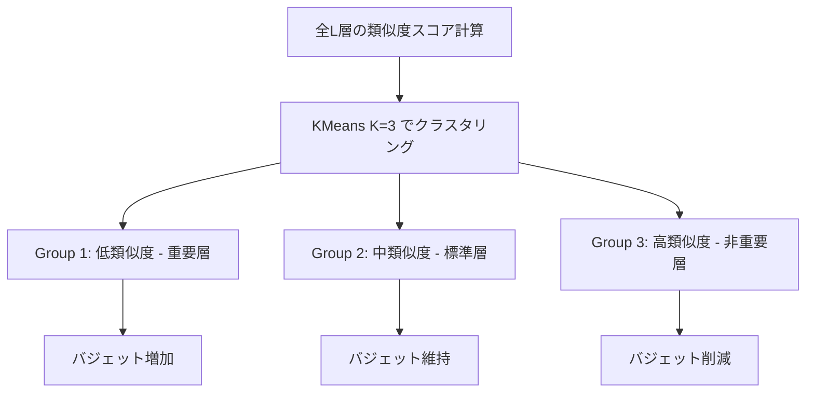

## 論文概要（Abstract）

SqueezeAttentionは、LLM推論時のKVキャッシュを**層方向（layer-wise）とトークン方向（sequence-wise）の2次元**で管理する手法である。従来のKVキャッシュ圧縮手法がすべてのAttention層に一律のバジェットを割り当てていたのに対し、著者らはコサイン類似度による層重要度測定に基づいて各層に異なるKVバジェットを配分する。著者らは、この手法により30-70%のメモリ削減と最大2.2倍のスループット改善を達成したと報告している（論文Abstract, Section 5より）。

この記事は [Zenn記事: プロンプトキャッシュ実装術：Claude・GPT・Geminiのコスト90%削減パターン](https://zenn.dev/0h_n0/articles/10efd4d3683138) の深掘りです。

## 情報源

- **会議名**: ICLR 2025（International Conference on Learning Representations）
- **年**: 2025
- **URL**: [https://arxiv.org/abs/2404.04793](https://arxiv.org/abs/2404.04793)
- **著者**: Zihao Wang, Bin Cui, Shaoduo Gan
- **OpenReview**: [https://openreview.net/forum?id=9HK2rHNAhd](https://openreview.net/forum?id=9HK2rHNAhd)
- **発表形式**: Poster

## カンファレンス情報

ICLR（International Conference on Learning Representations）は、深層学習・表現学習分野の最高峰国際会議の1つである。2025年のICLRはシンガポールで開催され、採択率は例年25-30%程度と非常に競争率が高い。SqueezeAttentionはConference Paper（Poster）として採択された。

## 技術的詳細（Technical Details）

### 背景: KVキャッシュの問題

LLMのAutoregressive推論では、各トークン生成時に過去のKey-Value（KV）ペアを再利用するためKVキャッシュが用いられる。しかし、モデルサイズやシーケンス長の増大に伴い、KVキャッシュのメモリ消費量はGPUメモリの大部分を占めるようになる。

従来の圧縮手法（H2O, StreamingLLM等）は**トークン方向（sequence-wise）の圧縮**のみを行い、すべてのAttention層に同一のバジェットを割り当てていた。しかし、著者らは各Attention層がトークンに対して異なる感度を持つことを実験的に確認し、層ごとに異なるバジェットを割り当てるべきだと主張している。

### コサイン類似度による層重要度測定

SqueezeAttentionの核となるアイデアは、各Attention層の「重要度」をコサイン類似度で定量化する点である。具体的には、第$l$層のSelf-Attention処理の前後における隠れ状態の類似度を計算する。

$$
s^{(l)} = \text{CosineSimilarity}(\mathbf{h}^{(l)}_{\text{in}}, \mathbf{h}^{(l)}_{\text{out}}) = \frac{\mathbf{h}^{(l)}_{\text{in}} \cdot \mathbf{h}^{(l)}_{\text{out}}}{\|\mathbf{h}^{(l)}_{\text{in}}\| \cdot \|\mathbf{h}^{(l)}_{\text{out}}\|}
$$

ここで、

- $\mathbf{h}^{(l)}_{\text{in}}$: 第$l$層のSelf-Attentionへの入力隠れ状態
- $\mathbf{h}^{(l)}_{\text{out}}$: 第$l$層のSelf-Attentionからの出力隠れ状態
- $s^{(l)}$: 第$l$層の類似度スコア（$0 \leq s^{(l)} \leq 1$）

**直感的な解釈**: $s^{(l)}$が1に近い層は、Self-Attentionが入力をほとんど変化させていないため「重要度が低い」と判断される。逆に$s^{(l)}$が小さい層は、入力を大きく変換しているため「重要度が高い」と判断される。

### KMeansクラスタリングによる層分類

著者らは、全層の類似度スコア $\{s^{(1)}, s^{(2)}, \ldots, s^{(L)}\}$ に対してKMeansクラスタリング（$K=3$）を適用し、層を3つのグループに分類する。



- **Group 1**（低類似度、例: $s \approx 0.7$-$0.85$）: Attentionが入力を大きく変換する重要な層。バジェットを増加させる
- **Group 2**（中類似度、例: $s \approx 0.85$-$0.95$）: 標準的な層。バジェットを維持する
- **Group 3**（高類似度、例: $s \approx 0.95$-$0.99$）: Attentionの寄与が小さい層。バジェットを削減する

著者らの報告によると、Group 3に分類される層は全体の50-70%を占める場合が多く、これが大幅なメモリ削減の主要因となっている。

### バジェット再配分アルゴリズム

全体のKVキャッシュバジェットを$B_{\text{total}}$、初期バジェット（各層一律）を$b_{\text{init}}$、層数を$L$とする。Group 3に属する層のバジェットは以下のように削減される。

$$
b^{(l)} = b_{\text{init}} \times p, \quad l \in G_3
$$

ここで$p$はバジェット削減率（著者らは$p = 0.1$-$0.2$を推奨）。削減分は重要な層に再配分される。

$$
b^{(l)} = \frac{L \cdot b_{\text{init}} - |G_3| \cdot b_{\text{init}} \cdot p}{|G_1| + |G_2|}, \quad l \in G_1 \cup G_2
$$

ここで、

- $b^{(l)}$: 第$l$層のKVバジェット（保持するKVペア数）
- $|G_k|$: Group $k$に属する層の数
- $p$: Group 3のバジェット削減率（ハイパーパラメータ）

**制約条件**: 全層のバジェット合計は元の合計バジェット以下に保たれる。

$$
\sum_{l=1}^{L} b^{(l)} \leq B_{\text{total}}
$$

### 層ごとの圧縮手法の適用

バジェット配分後、各層のバジェットに合わせて既存のsequence-wise圧縮手法を適用する。SqueezeAttentionは以下の手法との組み合わせを検証している。

- **H2O（Heavy-Hitter Oracle）**: Attention scoreが高いトークンを優先的に保持
- **StreamingLLM**: 先頭のsinkトークンと直近のウィンドウトークンを保持
- **Sliding Window Attention**: 固定サイズのウィンドウ内のトークンのみ保持

著者らは、SqueezeAttentionがこれらの手法と**直交的（orthogonal）**であると述べており、既存のsequence-wise圧縮手法に対してlayer-wise最適化を追加するプラグインとして機能する。

### 全体アルゴリズム

```python
import torch
import numpy as np
from sklearn.cluster import KMeans
from dataclasses import dataclass


@dataclass
class LayerBudget:
    """各層のKVキャッシュバジェット情報

    Attributes:
        layer_id: 層のインデックス
        similarity: コサイン類似度スコア
        group: KMeansクラスタリングで割り当てられたグループ (1, 2, 3)
        budget: 割り当てられたKVバジェット（保持トークン数）
    """
    layer_id: int
    similarity: float
    group: int
    budget: int


def compute_layer_similarity(
    hidden_before: torch.Tensor,
    hidden_after: torch.Tensor,
) -> float:
    """Self-Attention前後の隠れ状態のコサイン類似度を計算

    Args:
        hidden_before: Attention入力 (seq_len, d_model)
        hidden_after: Attention出力 (seq_len, d_model)

    Returns:
        コサイン類似度スコア (0.0 - 1.0)
    """
    cos_sim = torch.nn.functional.cosine_similarity(
        hidden_before.flatten().unsqueeze(0),
        hidden_after.flatten().unsqueeze(0),
    )
    return cos_sim.item()


def allocate_budgets(
    similarities: list[float],
    initial_budget: int,
    reduction_rate: float = 0.15,
    n_clusters: int = 3,
) -> list[LayerBudget]:
    """KMeansクラスタリングに基づくバジェット再配分

    Args:
        similarities: 各層のコサイン類似度リスト
        initial_budget: 初期バジェット（全層共通の保持トークン数）
        reduction_rate: Group 3のバジェット削減率 (0.0-1.0)
        n_clusters: クラスタ数 (デフォルト: 3)

    Returns:
        各層のバジェット情報リスト
    """
    n_layers = len(similarities)
    sim_array = np.array(similarities).reshape(-1, 1)

    # KMeansクラスタリング
    kmeans = KMeans(n_clusters=n_clusters, random_state=42)
    labels = kmeans.fit_predict(sim_array)

    # クラスタをソートしてGroup番号を割り当て
    # 類似度が低い順に Group 1 (重要), 2 (標準), 3 (非重要)
    cluster_means = {i: sim_array[labels == i].mean() for i in range(n_clusters)}
    sorted_clusters = sorted(cluster_means, key=lambda x: cluster_means[x])
    cluster_to_group = {c: g + 1 for g, c in enumerate(sorted_clusters)}

    groups = [cluster_to_group[label] for label in labels]

    # バジェット再配分
    group3_count = sum(1 for g in groups if g == 3)
    group12_count = n_layers - group3_count

    reduced_budget = int(initial_budget * reduction_rate)
    if group12_count > 0:
        increased_budget = int(
            (n_layers * initial_budget - group3_count * reduced_budget)
            / group12_count
        )
    else:
        increased_budget = initial_budget

    results: list[LayerBudget] = []
    for i in range(n_layers):
        budget = reduced_budget if groups[i] == 3 else increased_budget
        results.append(LayerBudget(
            layer_id=i,
            similarity=similarities[i],
            group=groups[i],
            budget=budget,
        ))

    return results
```

## 実装のポイント

### Prefilling時の計算オーバーヘッド

著者らは、コサイン類似度の計算とKMeansクラスタリングはprefilling phase（初回のプロンプト処理時）に一度だけ実行されると報告している。Mistral-7Bにおけるオーバーヘッドは約6.3%であり、後続のデコーディングでのメモリ削減とスループット向上がこのコストを上回ると述べている。

### ハイパーパラメータ設定

公式実装（[GitHub](https://github.com/hetailang/SqueezeAttention)）に基づくと、主要なハイパーパラメータは以下の通りである。

- `ini_size`: 初期KVバジェット（例: Mistral-7Bで0.21、LLaMA-2で0.4）
- `KV_class3`: Group 3層のバジェット削減後の値（例: Mistral-7Bで0.08、LLaMA-2で0.25）
- `start_size`: StreamingLLMのsinkトークン数（デフォルト: 4）

### 実装上の注意点

1. **`modify_transformers.py`の実行が必須**: 公式実装ではHugging Face Transformersライブラリの内部を書き換えるスクリプトが必要
2. **Flash Attentionとの併用**: `flash-attn`パッケージのインストールが推奨されている
3. **モデルごとの調整**: `ini_size`と`KV_class3`はモデルサイズやタスクに応じて調整が必要

## Production Deployment Guide

### AWS実装パターン（コスト最適化重視）

SqueezeAttentionを用いたKVキャッシュ2D管理をAWS上でLLM推論サービスとして運用する場合の構成を、トラフィック量別に示す。コスト試算は2026年5月時点のAWS us-east-1（バージニア北部）リージョンのオンデマンド料金に基づく概算値であり、実際のコストはトラフィックパターン、リージョン、バースト使用量により変動する。最新料金は[AWS料金計算ツール](https://calculator.aws/)で確認を推奨する。

| 構成 | トラフィック | インスタンス | GPU | 月額概算 |
|------|-------------|-------------|-----|---------|
| Small | ~100 req/日 | g5.xlarge | A10G x1 (24GB) | $750-900 |
| Medium | ~1,000 req/日 | g5.12xlarge | A10G x4 (96GB) | $4,200-4,800 |
| Large | 10,000+ req/日 | p4d.24xlarge | A100 x8 (320GB) | $16,500-18,000 |

**Small構成（~100 req/日）**:
- g5.xlarge（$1.006/hr）でMistral-7B + SqueezeAttention
- SqueezeAttentionにより7Bモデルのバッチサイズを拡大可能（バジェット20%設定時、メモリ使用量約70%削減）
- 月額: g5.xlarge $734 + S3/CloudWatch $20-50 = 約$750-900

**Medium構成（~1,000 req/日）**:
- g5.12xlarge（$5.672/hr）で13B-30Bクラスモデル + SqueezeAttention
- 4基のA10Gでテンソル並列推論、KVキャッシュ圧縮により同時バッチ数を拡大
- 月額: g5.12xlarge $4,140 + ALB/S3/監視 $100-200 = 約$4,200-4,800

**Large構成（10,000+ req/日）**:
- p4d.24xlarge（$21.96/hr）で70Bクラスモデル + SqueezeAttention
- 8基のA100 (40GB HBM2e) でLLaMA-2-70Bを運用、SqueezeAttentionにより1.4倍のスループット改善
- 月額: p4d.24xlarge $16,029 + ネットワーク/監視 $500-800 = 約$16,500-18,000

**コスト削減テクニック**:
- **Spot Instances**: g5/p4dインスタンスで最大60-90%削減（推論のステートレス設計が前提）
- **Reserved Instances**: 1年コミットで最大40%、3年で最大62%削減
- **Savings Plans**: Compute Savings Plansで最大66%削減
- **SqueezeAttention自体の効果**: メモリ削減によりバッチサイズ拡大 → 同一インスタンスでより多くのリクエスト処理 → インスタンス台数削減

### Terraformインフラコード

#### Small構成（Serverless + GPU）

```hcl
# SqueezeAttention LLM推論 - Small構成
# g5.xlarge + ECS Fargate（管理サーバレス）
# 2026年5月時点 us-east-1

terraform {
  required_version = ">= 1.8"
  required_providers {
    aws = {
      source  = "hashicorp/aws"
      version = "~> 5.80"
    }
  }
}

provider "aws" {
  region = "us-east-1"
}

# --- VPC基盤 ---
resource "aws_vpc" "inference" {
  cidr_block           = "10.0.0.0/16"
  enable_dns_hostnames = true
  tags = { Name = "squeeze-attn-inference" }
}

resource "aws_subnet" "private" {
  vpc_id            = aws_vpc.inference.id
  cidr_block        = "10.0.1.0/24"
  availability_zone = "us-east-1a"
  tags = { Name = "squeeze-attn-private" }
}

# --- IAMロール（最小権限） ---
resource "aws_iam_role" "inference" {
  name = "squeeze-attn-inference-role"
  assume_role_policy = jsonencode({
    Version = "2012-10-17"
    Statement = [{
      Action = "sts:AssumeRole"
      Effect = "Allow"
      Principal = { Service = "ec2.amazonaws.com" }
    }]
  })
}

resource "aws_iam_role_policy" "s3_model" {
  name = "s3-model-read"
  role = aws_iam_role.inference.id
  policy = jsonencode({
    Version = "2012-10-17"
    Statement = [{
      Effect   = "Allow"
      Action   = ["s3:GetObject", "s3:ListBucket"]
      Resource = [
        "arn:aws:s3:::${var.model_bucket}",
        "arn:aws:s3:::${var.model_bucket}/*"
      ]
    }]
  })
}

# --- EC2 (g5.xlarge) ---
resource "aws_instance" "inference" {
  ami                  = var.deep_learning_ami_id  # Deep Learning AMI (Ubuntu)
  instance_type        = "g5.xlarge"               # A10G x1, 24GB VRAM
  subnet_id            = aws_subnet.private.id
  iam_instance_profile = aws_iam_instance_profile.inference.name

  root_block_device {
    volume_size = 200  # モデル重み + KVキャッシュ用
    volume_type = "gp3"
    encrypted   = true
  }

  tags = {
    Name        = "squeeze-attn-inference"
    Environment = "production"
    CostCenter  = "ml-inference"
  }
}

resource "aws_iam_instance_profile" "inference" {
  name = "squeeze-attn-inference-profile"
  role = aws_iam_role.inference.name
}

# --- CloudWatch アラーム（コスト監視） ---
resource "aws_cloudwatch_metric_alarm" "gpu_utilization" {
  alarm_name          = "squeeze-attn-gpu-low-utilization"
  comparison_operator = "LessThanThreshold"
  evaluation_periods  = 6          # 30分間低利用
  metric_name         = "GPUUtilization"
  namespace           = "CustomMetrics/Inference"
  period              = 300
  statistic           = "Average"
  threshold           = 10
  alarm_description   = "GPU utilization below 10% for 30min - consider Spot or shutdown"
  alarm_actions       = [var.sns_topic_arn]
}

# --- AWS Budgets ---
resource "aws_budgets_budget" "monthly" {
  name         = "squeeze-attn-monthly"
  budget_type  = "COST"
  limit_amount = "1000"
  limit_unit   = "USD"
  time_unit    = "MONTHLY"

  notification {
    comparison_operator       = "GREATER_THAN"
    threshold                 = 80
    threshold_type            = "PERCENTAGE"
    notification_type         = "ACTUAL"
    subscriber_email_addresses = [var.alert_email]
  }
}

variable "model_bucket" { type = string }
variable "deep_learning_ami_id" { type = string }
variable "sns_topic_arn" { type = string }
variable "alert_email" { type = string }
```

#### Large構成（EKS + Karpenter + Spot）

```hcl
# SqueezeAttention LLM推論 - Large構成
# EKS + Karpenter（Spot優先） + p4d.24xlarge
# 2026年5月時点 us-east-1

module "eks" {
  source  = "terraform-aws-modules/eks/aws"
  version = "~> 20.30"

  cluster_name    = "squeeze-attn-inference"
  cluster_version = "1.31"
  vpc_id          = aws_vpc.inference.id
  subnet_ids      = aws_subnet.private[*].id

  # コスト最適化: パブリックアクセス無効化
  cluster_endpoint_public_access = false

  eks_managed_node_groups = {
    # 管理用ノード（Spot）
    system = {
      instance_types = ["m6i.large"]
      capacity_type  = "SPOT"
      min_size       = 1
      max_size       = 3
      desired_size   = 2
    }
  }
}

# --- Karpenter Provisioner（GPU Spot優先） ---
resource "kubectl_manifest" "karpenter_provisioner" {
  yaml_body = yamlencode({
    apiVersion = "karpenter.sh/v1"
    kind       = "NodePool"
    metadata   = { name = "gpu-inference" }
    spec = {
      template = {
        spec = {
          requirements = [
            { key = "node.kubernetes.io/instance-type", operator = "In",
              values = ["p4d.24xlarge", "g5.48xlarge"] },
            { key = "karpenter.sh/capacity-type", operator = "In",
              values = ["spot", "on-demand"] },
            # Spot優先
            { key = "karpenter.sh/capacity-type", operator = "In",
              values = ["spot"] },
          ]
          nodeClassRef = { name = "gpu-node" }
        }
      }
      limits = {
        cpu    = "384"
        memory = "4608Gi"
      }
      disruption = {
        consolidationPolicy = "WhenEmpty"
        consolidateAfter    = "30s"
      }
    }
  })
}

# --- Secrets Manager（モデル設定） ---
resource "aws_secretsmanager_secret" "model_config" {
  name       = "squeeze-attn/model-config"
  kms_key_id = aws_kms_key.inference.arn
}

resource "aws_kms_key" "inference" {
  description         = "KMS key for SqueezeAttention inference secrets"
  enable_key_rotation = true
}

# --- Cost Explorer アラート ---
resource "aws_ce_anomaly_monitor" "inference" {
  name              = "squeeze-attn-cost-monitor"
  monitor_type      = "DIMENSIONAL"
  monitor_dimension = "SERVICE"
}

resource "aws_ce_anomaly_subscription" "alert" {
  name = "squeeze-attn-cost-alert"
  monitor_arn_list = [aws_ce_anomaly_monitor.inference.arn]
  frequency = "DAILY"
  subscriber {
    type    = "EMAIL"
    address = var.alert_email
  }
  threshold_expression {
    dimension {
      key           = "ANOMALY_TOTAL_IMPACT_ABSOLUTE"
      values        = ["100"]
      match_options = ["GREATER_THAN_OR_EQUAL"]
    }
  }
}
```

### 運用・監視設定

#### CloudWatch Logs Insights クエリ

```
# GPU メモリ使用量とKVキャッシュサイズの監視
fields @timestamp, gpu_memory_used_mb, kv_cache_size_mb, batch_size, throughput_tps
| filter kv_cache_size_mb > 0
| stats avg(kv_cache_size_mb) as avg_kv, max(gpu_memory_used_mb) as peak_gpu,
        avg(throughput_tps) as avg_throughput
  by bin(1h)
| sort @timestamp desc

# レイテンシ分析（P95, P99）
fields @timestamp, latency_ms
| stats percentile(latency_ms, 95) as p95,
        percentile(latency_ms, 99) as p99,
        avg(latency_ms) as avg_lat
  by bin(5m)
```

#### CloudWatch アラーム設定

```python
import boto3


def create_inference_alarms(
    instance_id: str,
    sns_topic_arn: str,
) -> list[str]:
    """SqueezeAttention推論サーバの監視アラームを作成

    Args:
        instance_id: EC2インスタンスID
        sns_topic_arn: 通知先SNSトピックARN

    Returns:
        作成したアラームのARNリスト
    """
    cw = boto3.client("cloudwatch")
    alarm_arns: list[str] = []

    # GPUメモリ使用率アラーム（OOM防止）
    cw.put_metric_alarm(
        AlarmName=f"squeeze-attn-gpu-mem-{instance_id}",
        MetricName="GPUMemoryUtilization",
        Namespace="CustomMetrics/Inference",
        Statistic="Maximum",
        Period=60,
        EvaluationPeriods=3,
        Threshold=90.0,
        ComparisonOperator="GreaterThanThreshold",
        AlarmActions=[sns_topic_arn],
        AlarmDescription="GPU memory > 90% - KV cache budget may need reduction",
        Dimensions=[{"Name": "InstanceId", "Value": instance_id}],
    )

    # スループット低下アラーム
    cw.put_metric_alarm(
        AlarmName=f"squeeze-attn-throughput-{instance_id}",
        MetricName="InferenceThroughput",
        Namespace="CustomMetrics/Inference",
        Statistic="Average",
        Period=300,
        EvaluationPeriods=3,
        Threshold=50.0,
        ComparisonOperator="LessThanThreshold",
        AlarmActions=[sns_topic_arn],
        AlarmDescription="Throughput below 50 tokens/s - check batch size and KV budget",
        Dimensions=[{"Name": "InstanceId", "Value": instance_id}],
    )

    return alarm_arns
```

#### X-Ray トレーシング設定

```python
from aws_xray_sdk.core import xray_recorder, patch_all


def setup_xray_tracing() -> None:
    """X-Rayトレーシングの初期化

    boto3呼び出しを自動計装し、推論パイプラインの
    レイテンシ内訳を可視化する。
    """
    xray_recorder.configure(
        service="squeeze-attn-inference",
        sampling=True,
        context_missing="LOG_ERROR",
    )
    patch_all()  # boto3自動計装


@xray_recorder.capture("inference_request")
def handle_inference(prompt: str, model_name: str) -> dict:
    """推論リクエストのトレーシング付きハンドラ

    Args:
        prompt: 入力プロンプト
        model_name: 使用モデル名

    Returns:
        推論結果とメタデータ
    """
    subsegment = xray_recorder.current_subsegment()
    if subsegment:
        subsegment.put_annotation("model", model_name)
        subsegment.put_metadata("prompt_length", len(prompt))
    # ... 推論処理 ...
    return {"output": "...", "tokens_generated": 0}
```

#### Cost Explorer自動レポート

```python
import boto3
from datetime import datetime, timedelta


def daily_cost_report(sns_topic_arn: str) -> dict:
    """日次コストレポートを生成しSNS通知

    Args:
        sns_topic_arn: 通知先SNSトピックARN

    Returns:
        コストレポート辞書
    """
    ce = boto3.client("ce")
    today = datetime.utcnow().strftime("%Y-%m-%d")
    yesterday = (datetime.utcnow() - timedelta(days=1)).strftime("%Y-%m-%d")

    response = ce.get_cost_and_usage(
        TimePeriod={"Start": yesterday, "End": today},
        Granularity="DAILY",
        Metrics=["UnblendedCost"],
        Filter={
            "Tags": {
                "Key": "CostCenter",
                "Values": ["ml-inference"],
            }
        },
        GroupBy=[{"Type": "DIMENSION", "Key": "SERVICE"}],
    )

    total = sum(
        float(g["Metrics"]["UnblendedCost"]["Amount"])
        for result in response["ResultsByTime"]
        for g in result["Groups"]
    )

    # $100/日超過でアラート
    if total > 100:
        sns = boto3.client("sns")
        sns.publish(
            TopicArn=sns_topic_arn,
            Subject="SqueezeAttention Inference Cost Alert",
            Message=f"Daily cost: ${total:.2f} exceeds $100 threshold",
        )

    return {"date": yesterday, "total_cost": total, "details": response}
```

### コスト最適化チェックリスト

**アーキテクチャ選択**:
- [ ] トラフィック量に応じた構成選択（Small: g5.xlarge / Medium: g5.12xlarge / Large: p4d.24xlarge）
- [ ] SqueezeAttentionのバジェット設定でメモリ削減 → バッチサイズ拡大 → インスタンス削減

**リソース最適化**:
- [ ] Spot Instances優先（推論サーバのステートレス設計）
- [ ] Reserved Instances: 1年コミットで40%削減
- [ ] Savings Plans: Compute Savings Plansで最大66%削減
- [ ] GPU使用率モニタリング（低利用時にスケールダウン）
- [ ] EBS gp3ボリューム使用（gp2より20%安価）

**KVキャッシュ最適化**:
- [ ] `ini_size`パラメータ調整（モデル・タスクに応じて0.2-0.4）
- [ ] `KV_class3`パラメータ調整（0.08-0.25）
- [ ] Group 3層の比率モニタリング（50-70%が想定範囲）
- [ ] バッチサイズとKVバジェットのトレードオフ最適化

**監視・アラート**:
- [ ] AWS Budgets設定（月額上限アラート）
- [ ] CloudWatch GPUメモリアラーム（OOM防止）
- [ ] Cost Anomaly Detection有効化
- [ ] 日次コストレポート自動送信
- [ ] X-Rayトレーシングでレイテンシボトルネック可視化

**リソース管理**:
- [ ] 未使用EC2インスタンスの自動停止（Lambda + CloudWatch Events）
- [ ] タグ戦略（CostCenter, Environment, Model）
- [ ] EBSスナップショットのライフサイクルポリシー
- [ ] 開発環境の夜間・週末自動停止
- [ ] モデルアーティファクトのS3ライフサイクル設定（IA移行）

## 実験結果（Results）

著者らは、Mistral-7B、LLaMA-2-7B-32K、GPT-NeoX-20B、LLaMA-2-70Bの4モデルで、SAMSUMおよびXSUMベンチマークを用いた評価を行っている。

### メモリ削減

著者らの報告（論文Section 5）によると、SqueezeAttentionはFull Cacheと比較して**トークンあたりのメモリ使用量を70-80%削減**し、既存の圧縮ベースライン（H2O, StreamingLLM等）と比較しても**25-66%の追加削減**を達成している。

### スループット改善

| モデル | GPU | バッチサイズ | スループット | Full Cache比 |
|--------|-----|-------------|-------------|-------------|
| Mistral-7B | A100 | 224 | 892.5 tokens/s | 2.2倍 |
| LLaMA-2-70B | A100 x8 | 64 | - | 1.4倍 |

Mistral-7Bではバジェット20%設定時にバッチサイズ224を実現し、Sliding Window（バッチサイズ128でOOM）を大幅に上回っている。

### モデル精度への影響

著者らは、バジェット削減にもかかわらずモデル精度は同等水準を維持していると報告している。Mistral-7BのSAMSUMタスクでは、バジェット20%（SqueezeAttention適用）でも、バジェット30%のSliding Window Attentionと同等以上のスコアを達成している。

## 実運用への応用（Practical Applications）

### LLM推論サービスのスケーリング

SqueezeAttentionは、特に**長文入力を扱うLLM推論サービス**で効果を発揮する。文書要約、RAG（Retrieval Augmented Generation）、長文対話など、KVキャッシュが大きくなるユースケースでは、メモリ削減によるバッチサイズ拡大が直接的なスループット改善につながる。

### 既存システムへの統合

SqueezeAttentionの最大の利点は、既存のsequence-wise圧縮手法と**直交的に組み合わせ可能**な点にある。すでにH2OやStreamingLLMを導入している推論システムに対して、layer-wiseの最適化を追加するだけで追加のメモリ削減が見込める。

### コスト効率の改善

Zenn記事で解説されているプロンプトキャッシュ（Claude, GPT, Gemini）はAPI呼び出しコストの削減を目的としているが、SqueezeAttentionはセルフホスト推論環境でのGPUメモリコストを削減する。両者を組み合わせることで、API利用時のトークンコスト削減とセルフホスト時のインフラコスト削減を両立できる。

## 関連研究（Related Work）

- **H2O（Heavy-Hitter Oracle）**: Attention scoreに基づくトークン選択でKVキャッシュを圧縮する手法。SqueezeAttentionはH2Oをsequence-wise圧縮として内部で利用している
- **StreamingLLM**: 先頭のsinkトークンと直近のウィンドウトークンのみを保持する手法。SqueezeAttentionの層ごとのバジェット配分と組み合わせて使用可能
- **GQA（Grouped Query Attention）**: Attention Head数を減らすことでKVキャッシュサイズを削減するモデルアーキテクチャ変更。SqueezeAttentionは既存モデルに後付けで適用可能な点で補完的

## まとめと今後の展望

SqueezeAttentionは、KVキャッシュの圧縮をトークン方向だけでなく**層方向にも最適化する**ことで、既存手法に対して追加のメモリ削減とスループット向上を実現した。コサイン類似度による層重要度測定とKMeansクラスタリングというシンプルなアプローチでありながら、30-70%のメモリ削減と最大2.2倍のスループット改善を達成している点は実用的である。

今後は、より多くのモデルアーキテクチャ（Mixture of Experts等）への適用や、動的なバジェット調整（入力に応じてリアルタイムにバジェットを変更する手法）の研究が期待される。

## 参考文献

- **Conference URL**: [https://openreview.net/forum?id=9HK2rHNAhd](https://openreview.net/forum?id=9HK2rHNAhd)
- **arXiv**: [https://arxiv.org/abs/2404.04793](https://arxiv.org/abs/2404.04793)
- **Code**: [https://github.com/hetailang/SqueezeAttention](https://github.com/hetailang/SqueezeAttention)
- **Related Zenn article**: [https://zenn.dev/0h_n0/articles/10efd4d3683138](https://zenn.dev/0h_n0/articles/10efd4d3683138)
- **ICLR 2025 Virtual**: [https://iclr.cc/virtual/2025/poster/30707](https://iclr.cc/virtual/2025/poster/30707)
