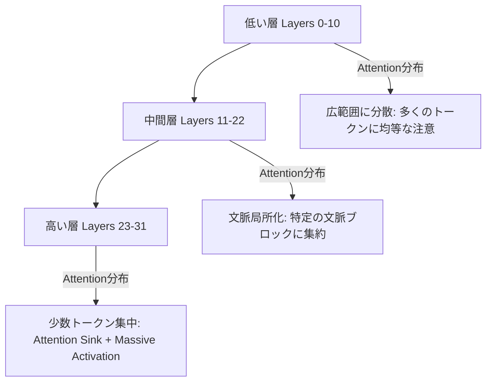
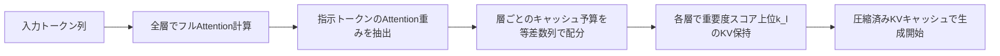
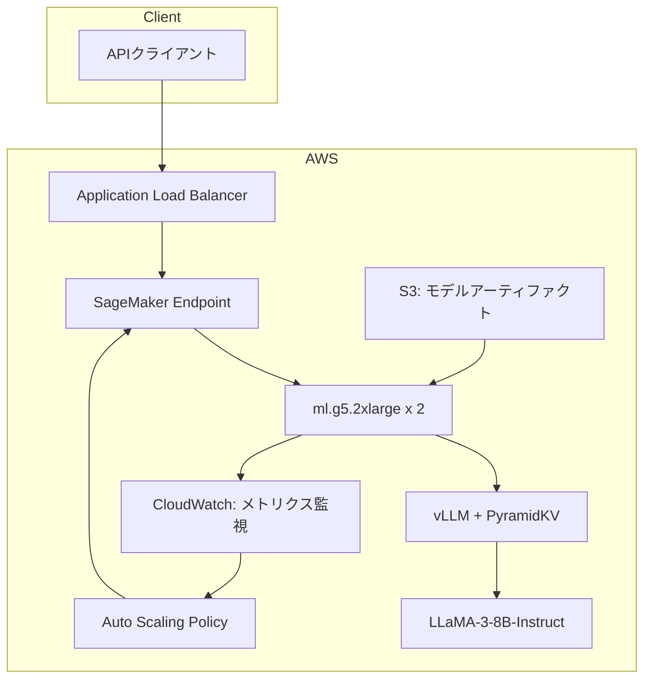

## 論文概要（Abstract）

LLMの推論時にメモリを大量に消費するKVキャッシュを、Attention分布の層間パターンに基づいて動的に圧縮する手法 **PyramidKV** を提案した論文です。著者らは、Transformerの低い層ではAttentionが広く分散し、高い層では少数の重要トークンに集中するという「**Pyramidal Information Funneling（ピラミッド型情報漏斗）**」現象を発見しました。この知見に基づき、低い層にはより多くのKVキャッシュを割り当て、高い層には少なく割り当てることで、フルKVキャッシュの**12%のみを保持しながら同等の性能を達成**したと報告されています（arXiv:2406.02069, Cai et al., 2024）。

この記事は [Zenn記事: プロンプトキャッシュ実装術：Claude・GPT・Geminiのコスト90%削減パターン](https://zenn.dev/0h_n0/articles/10efd4d3683138) の深掘りです。

## 情報源

- **arXiv ID**: 2406.02069
- **URL**: [arXiv:2406.02069](https://arxiv.org/abs/2406.02069)
- **著者**: Zefan Cai, Yichi Zhang, Bofei Gao, Yuliang Liu, Yucheng Li, Tianyu Liu, Keming Lu, Wayne Xiong, Yue Dong, Junjie Hu, Wen Xiao
- **初版投稿**: 2024年6月
- **最終改訂**: 2025年5月（v4）
- **分野**: Computation and Language (cs.CL)
- **公式実装**: [KVCache-Factory](https://github.com/Zefan-Cai/KVCache-Factory)

## 背景と動機（Background）

### KVキャッシュのメモリ問題

Transformerベースの自己回帰LLMは、推論時に過去のトークンのKey・Value表現をキャッシュとして保持します。これにより再計算を回避できますが、シーケンス長 $n$ に対してKVキャッシュのメモリは $O(n \cdot d \cdot L)$（$d$: ヘッド次元、$L$: 層数）で線形増加します。長文コンテキスト（128Kトークン以上）を扱うモデルでは、KVキャッシュだけで数十GBのGPUメモリを消費するケースがあり、推論コストの主要なボトルネックになっています。

### 既存手法の限界

先行研究としてH2O（Heavy-Hitter Oracle）、SnapKV、StreamingLLMなどが提案されていますが、これらはいずれも**全ての層に一律のKVキャッシュサイズを割り当てる**方針を採っています。著者らは、層ごとにAttention分布の特性が大きく異なることに着目し、一律割り当てでは情報の損失パターンが最適化されていないと指摘しています。

## 主要な貢献（Key Contributions）

1. **Pyramidal Information Funnelingの発見**: LLMのAttention分布が低い層から高い層にかけてピラミッド型に集約される現象を実験的に示した
2. **層ごとの動的KVキャッシュ割り当て**: 等差数列に基づく予算配分アルゴリズムにより、低い層に多く・高い層に少なくKVキャッシュを割り当てる手法を提案
3. **12%のKVキャッシュで同等性能**: LongBenchベンチマークでフルKVキャッシュの12%のみを保持しながら、同等の性能を達成
4. **極端な圧縮での優位性**: KVキャッシュを0.7%のみ保持するシナリオでは、TRECデータセットにおいて既存手法比で**20.5ポイントの精度向上**を達成

## 技術的詳細（Technical Details）

### Pyramidal Information Funneling

著者らはLLaMA-3-8B-Instructのattention mapを層ごとに可視化し、以下の3つの段階を発見しました。



- **低い層（Layers 0-10）**: Attentionが広範囲のトークンに分散し、入力全体の文脈を捕捉する。KVキャッシュを多く保持する必要がある
- **中間層（Layers 11-22）**: Attentionが特定の文脈ブロックに局所化し始める
- **高い層（Layers 23-31）**: 少数の重要トークン（Attention Sink、Massive Activation）にAttentionが集中する。保持すべきKVエントリが少なくて済む

### 動的KVキャッシュ予算配分アルゴリズム

PyramidKVは2つのフェーズで動作します。

**フェーズ1: 予算配分（Budget Allocation）**

全層にわたるKVキャッシュの総予算 $k^{\text{total}}$ を、等差数列によってピラミッド型に配分します。$m$ を層数、$\beta$ をピラミッドの急峻さを制御するハイパーパラメータとします。

最下層（Layer 0）に割り当てるキャッシュサイズ:

$$k^{0} = \frac{2 \cdot k^{\text{total}}}{m}$$

最上層（Layer $m-1$）に割り当てるキャッシュサイズ:

$$k^{m-1} = \frac{k^{\text{total}}}{\beta \cdot m}$$

中間層（Layer $l$）のキャッシュサイズは等差数列で補間されます:

$$k^{l} = k^{m-1} - \frac{k^{m-1} - k^{0}}{m} \times l$$

論文の実験では $\beta = 20$ が使用されています。この設定により、最下層には最上層の約40倍のKVキャッシュが割り当てられます。

**フェーズ2: KVキャッシュ選択（Cache Selection）**

各層・各Attentionヘッドにおいて、指示トークン（入力末尾の $\alpha$ トークン）からの注意度に基づき重要度スコアを計算します:

$$s^{h}_{i} = \sum_{j \in [n - \alpha, n]} A^{h}_{ij}$$

ここで $s^{h}_{i}$ はヘッド $h$ におけるトークン $i$ の重要度スコア、$A^{h}_{ij}$ は指示トークン $j$ からトークン $i$ へのattention重みです。論文では $\alpha = 8$ が使用されています。

各層で重要度スコア上位 $k^{l}$ 個のトークンのKV状態を保持し、残りを破棄します。

### 全体アーキテクチャ



## 実装のポイント（Implementation Notes）

### KVCache-Factoryによる実装

著者らは[KVCache-Factory](https://github.com/Zefan-Cai/KVCache-Factory)というフレームワークを公開しており、PyramidKVを含む複数のKVキャッシュ圧縮手法を統一的に利用できます。

**動作要件**:
- `transformers >= 4.41`
- `flash-attn >= 2.4.0.post1`
- Flash Attention 2またはSDPA（Scaled Dot Product Attention）をサポート

**実行例**（LongBench評価）:

```bash
python3 run_longbench.py \
    --method PyramidKV \
    --model_path meta-llama/Meta-Llama-3-8B-Instruct \
    --max_capacity_prompts 128 \
    --attn_implementation flash_attention_2 \
    --save_dir ./results \
    --use_cache True
```

### 実装上の注意点

PyramidKVはプリフィル段階（全入力トークンの処理）で一度だけattention mapを分析し、キャッシュを圧縮します。デコード段階（トークン生成）では圧縮済みキャッシュをそのまま利用するため、**生成速度への追加オーバーヘッドはありません**。ただし、プリフィル段階で全層のattention重みを一時的にメモリ上に保持する必要があるため、ピークメモリ使用量はフルKVキャッシュと同等になる点に注意が必要です。

## Production Deployment Guide

PyramidKV的な動的KVキャッシュ圧縮をAWS上で本番運用する場合のアーキテクチャとコスト試算を示します。以下の料金は2026年5月時点のAWS公式料金に基づきます。

### アーキテクチャ概要



### インスタンス選定

LLaMA-3-8B-Instruct（FP16）のモデル重みは約16GBです。KVキャッシュ圧縮を適用することで、必要なGPUメモリを大幅に削減できます。

| インスタンス | GPU | VRAM | オンデマンド料金 | 用途 |
|---|---|---|---|---|
| g5.2xlarge | A10G x1 | 24GB | $1.212/hr | 7-8Bモデル（圧縮KVキャッシュ） |
| g5.12xlarge | A10G x4 | 96GB | $5.672/hr | 70Bモデル（テンソル並列） |
| p4d.24xlarge | A100 x8 | 320GB | $32.77/hr | 大規模バッチ推論 |

PyramidKVを適用した場合のKVキャッシュメモリ消費量（論文Table 7より）:

| KVキャッシュサイズ | メモリ使用量 | フルKVキャッシュ比 |
|---|---|---|
| 64エントリ | 53 MB | 0.8% |
| 128エントリ | 107 MB | 1.6% |
| 256エントリ | 214 MB | 3.2% |
| 2048エントリ | 1,717 MB | 25.7% |

フルKVキャッシュ（128Kトークン）では約6.7GBを消費しますが、PyramidKV（128エントリ）では107MBに圧縮されます。これにより、g5.2xlarge（24GB VRAM）でも十分な同時リクエスト処理が可能になります。

### vLLMとの統合

2026年5月時点で、vLLMはPaged Attentionによるメモリ管理を標準搭載しています。PyramidKVをvLLMと統合するには、カスタムAttentionバックエンドとして実装する方法が考えられます。

```python
"""PyramidKV-style KV cache manager for vLLM integration."""
from dataclasses import dataclass
from typing import Optional

import torch


@dataclass
class PyramidKVConfig:
    """PyramidKV cache allocation configuration.

    Attributes:
        total_budget: Total KV cache entries across all layers.
        num_layers: Number of transformer layers.
        beta: Steepness parameter for pyramid allocation.
            Higher values create a steeper pyramid (more
            disparity between lower and upper layers).
        instruction_window: Number of instruction tokens
            (alpha) used for importance scoring.
    """

    total_budget: int = 2048
    num_layers: int = 32
    beta: float = 20.0
    instruction_window: int = 8


def compute_layer_budgets(config: PyramidKVConfig) -> list[int]:
    """Compute per-layer KV cache budgets using arithmetic sequence.

    The allocation follows the Pyramidal Information Funneling
    pattern: lower layers receive more cache entries, upper
    layers receive fewer.

    Args:
        config: PyramidKV configuration parameters.

    Returns:
        List of cache budget per layer (length = num_layers).

    Example:
        >>> cfg = PyramidKVConfig(total_budget=2048, num_layers=32)
        >>> budgets = compute_layer_budgets(cfg)
        >>> budgets[0] > budgets[-1]
        True
        >>> sum(budgets) <= cfg.total_budget + cfg.num_layers
        True
    """
    m = config.num_layers
    k_total = config.total_budget

    # Bottom layer (maximum cache)
    k_bottom = (2 * k_total) / m
    # Top layer (minimum cache)
    k_top = k_total / (config.beta * m)

    budgets: list[int] = []
    for layer_idx in range(m):
        # Linear interpolation via arithmetic sequence
        k_l = k_bottom - ((k_bottom - k_top) / m) * layer_idx
        budgets.append(max(1, int(k_l)))

    # Normalize so that sum matches total budget
    current_sum = sum(budgets)
    if current_sum != k_total:
        scale = k_total / current_sum
        budgets = [max(1, int(b * scale)) for b in budgets]

    return budgets


def select_important_kv(
    attention_weights: torch.Tensor,
    budget: int,
    instruction_window: int = 8,
) -> torch.Tensor:
    """Select top-k important token indices based on attention scores.

    Computes importance scores by summing attention weights
    from the last `instruction_window` tokens to each position,
    then retains the top-`budget` positions.

    Args:
        attention_weights: Attention matrix of shape
            (num_heads, seq_len, seq_len).
        budget: Number of KV entries to retain.
        instruction_window: Number of trailing tokens to use
            for importance scoring.

    Returns:
        Indices of selected tokens, shape (num_heads, budget).
    """
    # Extract attention from instruction tokens
    # Shape: (num_heads, instruction_window, seq_len)
    instruction_attn = attention_weights[:, -instruction_window:, :]

    # Sum over instruction tokens to get importance score
    # Shape: (num_heads, seq_len)
    importance_scores = instruction_attn.sum(dim=1)

    # Select top-k indices per head
    # Shape: (num_heads, budget)
    _, selected_indices = importance_scores.topk(
        k=min(budget, importance_scores.size(-1)),
        dim=-1,
    )

    return selected_indices
```

### SageMaker Endpointデプロイ構成

```python
"""SageMaker endpoint configuration for PyramidKV-enabled model."""
import json
from typing import Any


def create_sagemaker_config(
    model_id: str = "meta-llama/Meta-Llama-3-8B-Instruct",
    instance_type: str = "ml.g5.2xlarge",
    instance_count: int = 2,
    kv_cache_budget: int = 2048,
) -> dict[str, Any]:
    """Generate SageMaker endpoint configuration.

    Args:
        model_id: HuggingFace model identifier.
        instance_type: SageMaker ML instance type.
        instance_count: Number of instances for HA.
        kv_cache_budget: Total KV cache budget per layer.

    Returns:
        Configuration dict for SageMaker deployment.
    """
    return {
        "Image": "763104351884.dkr.ecr.us-east-1.amazonaws.com/"
        "huggingface-pytorch-tgi-inference:2.4.0-tgi3.1.1-gpu-py312-cu124-ubuntu22.04",
        "ModelDataUrl": f"s3://model-artifacts/{model_id}/",
        "Environment": {
            "HF_MODEL_ID": model_id,
            "SM_NUM_GPUS": json.dumps(1),
            "MAX_INPUT_TOKENS": json.dumps(32768),
            "MAX_TOTAL_TOKENS": json.dumps(40960),
            "QUANTIZE": "none",
        },
        "InstanceType": instance_type,
        "InitialInstanceCount": instance_count,
        "KVCacheConfig": {
            "method": "pyramidkv",
            "total_budget": kv_cache_budget,
            "beta": 20.0,
            "instruction_window": 8,
        },
    }
```

### コスト試算（2026年5月時点のAWS料金）

以下はus-east-1リージョンのオンデマンド料金に基づく試算です。

**シナリオ1: 小規模（LLaMA-3-8B、g5.2xlarge x2）**

| 項目 | 月額コスト |
|---|---|
| g5.2xlarge x2（HA構成）| $1.212 x 2 x 730h = **$1,770** |
| S3ストレージ（モデル16GB）| ~$0.37 |
| ALB | ~$22 |
| CloudWatch | ~$10 |
| **合計** | **約$1,802/月** |

PyramidKV（128エントリ）適用時の効果:
- KVキャッシュメモリ: 6.7GB → 107MB（**93.4%削減**）
- 同時処理可能リクエスト数: 約3倍に向上（VRAM余剰分をバッチ処理に活用）

**シナリオ2: 大規模（LLaMA-3-70B、g5.12xlarge x2）**

| 項目 | 月額コスト |
|---|---|
| g5.12xlarge x2（HA構成）| $5.672 x 2 x 730h = **$8,281** |
| S3ストレージ（モデル140GB）| ~$3.22 |
| ALB | ~$22 |
| CloudWatch | ~$10 |
| **合計** | **約$8,316/月** |

**コスト削減のポイント**:
- Reserved Instance（1年）で約40%削減: シナリオ1で約$1,081/月
- Savings Plans（3年）で約56%削減: シナリオ2で約$3,659/月
- Spot Instance活用（推論の中断許容時）: 最大70%削減

### 監視・運用のポイント

```python
"""CloudWatch metrics for PyramidKV cache monitoring."""
from dataclasses import dataclass


@dataclass
class KVCacheMetrics:
    """Metrics to monitor for PyramidKV deployment.

    Attributes:
        cache_hit_rate: Fraction of KV lookups served
            from compressed cache (target: > 0.95).
        cache_memory_mb: Current KV cache memory in MB.
        p99_latency_ms: 99th percentile inference latency.
        throughput_rps: Requests processed per second.
    """

    cache_hit_rate: float
    cache_memory_mb: float
    p99_latency_ms: float
    throughput_rps: float


# Recommended CloudWatch alarms
ALARM_THRESHOLDS = {
    "GPUMemoryUtilization": {
        "threshold": 85.0,
        "comparison": "GreaterThanThreshold",
        "period_seconds": 300,
        "description": "GPU VRAM usage exceeding 85%",
    },
    "ModelLatency": {
        "threshold": 5000.0,
        "comparison": "GreaterThanThreshold",
        "period_seconds": 60,
        "description": "P99 latency exceeding 5 seconds",
    },
    "Invocations4XXErrors": {
        "threshold": 10,
        "comparison": "GreaterThanThreshold",
        "period_seconds": 300,
        "description": "Client error rate spike",
    },
}
```

### Auto Scaling設定

```python
"""Auto Scaling configuration for SageMaker endpoint."""
from typing import Any


def create_scaling_policy(
    endpoint_name: str,
    variant_name: str = "AllTraffic",
    min_instances: int = 2,
    max_instances: int = 8,
    target_invocations_per_instance: int = 50,
) -> dict[str, Any]:
    """Generate Auto Scaling policy for SageMaker endpoint.

    Scales based on invocations per instance to maintain
    consistent latency under varying load.

    Args:
        endpoint_name: SageMaker endpoint name.
        variant_name: Production variant name.
        min_instances: Minimum instance count.
        max_instances: Maximum instance count.
        target_invocations_per_instance: Target concurrent
            invocations per instance for scaling trigger.

    Returns:
        Scaling policy configuration dict.
    """
    resource_id = (
        f"endpoint/{endpoint_name}/variant/{variant_name}"
    )
    return {
        "ServiceNamespace": "sagemaker",
        "ResourceId": resource_id,
        "ScalableDimension": (
            "sagemaker:variant:DesiredInstanceCount"
        ),
        "MinCapacity": min_instances,
        "MaxCapacity": max_instances,
        "TargetTrackingScalingPolicy": {
            "TargetValue": target_invocations_per_instance,
            "PredefinedMetricSpecification": {
                "PredefinedMetricType": (
                    "SageMakerVariantInvocationsPerInstance"
                ),
            },
            "ScaleInCooldown": 300,
            "ScaleOutCooldown": 60,
        },
    }
```

## 実験結果（Experimental Results）

### LongBenchベンチマーク

著者らはLongBenchベンチマーク（6つのタスクカテゴリ）を用いて、KVキャッシュサイズ128での各手法の性能を比較しています。

**LLaMA-3-8B-Instruct（KVサイズ128）の結果**（論文Table 1より）:

| データセット | Full KV | StreamingLLM | H2O | SnapKV | **PyramidKV** |
|---|---|---|---|---|---|
| NarrativeQA | 25.70 | 18.61 | 22.12 | 21.19 | **21.40** |
| Qasper | 29.75 | 9.65 | 13.20 | 13.55 | **16.92** |
| HotpotQA | 45.55 | 37.95 | 37.79 | 38.75 | **39.73** |
| TREC | 73.00 | 43.50 | 38.50 | 45.00 | **66.50** |
| TriviaQA | 90.56 | 74.08 | 87.75 | 88.36 | **89.35** |
| 平均 | 41.46 | 32.00 | 35.37 | 35.50 | **37.25** |

PyramidKVは全てのベースラインを上回り、特にTRECデータセットでは**SnapKV比で21.5ポイント、H2O比で28.0ポイント**の大幅な改善を示しています。これは、TRECのような分類タスクでは入力全体の文脈理解が重要であり、低い層での広範なAttention情報の保持がより効果的に機能するためと著者らは分析しています。

### Needle-in-a-Haystack実験

長文中の特定情報検索能力を測るNeedle-in-a-Haystack実験では、以下の結果が報告されています:

- **Full KV**: 65.0（平均スコア）
- **PyramidKV**: 62.6（Full KVの96.3%を維持）
- **SnapKV**: 57.3

著者らは、LLaMA-3-70B-Instructにおいて128 KVキャッシュエントリのみで**100.0%の検索精度**を達成したと報告しています。

### メモリ効率

フルKVキャッシュ（128Kトークン）と比較した場合:
- KVサイズ128: **メモリ使用量の98.4%を削減**（6.7GB → 107MB）
- KVサイズ2048: フルKV性能とほぼ同等を維持しつつ74.3%削減

## 実運用への応用（Practical Applications）

### 適用が有効なユースケース

PyramidKVの動的KVキャッシュ圧縮は、以下のシナリオで特に有効です:

1. **長文ドキュメントのQA**: 契約書や技術文書の質問応答で、128Kトークンの入力を128エントリのKVキャッシュで処理可能
2. **大規模バッチ推論**: KVキャッシュのメモリ削減により、同一GPUで同時処理できるリクエスト数が増加
3. **エッジデバイスでの推論**: メモリ制約の厳しい環境（24GB VRAM以下）での長文処理

### 2026年時点の推論フレームワークとの関係

vLLMのPaged Attention、SGLangのRadixAttention、DeepSeekのMLA（Multi-head Latent Attention）など、KVキャッシュ最適化技術は急速に発展しています。PyramidKVの層ごとの動的配分という着想は、これらのフレームワークに統合可能な汎用的な手法であり、FP8量子化やPrefix Cachingとの組み合わせによるさらなるメモリ削減も期待されています。

## 関連研究（Related Work）

- **H2O (Heavy-Hitter Oracle)**: Attentionスコアの上位トークンのKVのみを保持する手法。全層一律の割り当て
- **SnapKV**: Observation windowに基づくKVキャッシュ選択。PyramidKVと同様にinstruction tokenのattentionを利用するが、層間の配分は一律
- **StreamingLLM**: Attention SinkトークンとスライディングウィンドウのKVを保持。長文タスクでの性能低下が著しい
- **PyramidInfer** (Yang et al., 2024): 類似の名前を持つが、重要なコンテキストを層ごとに絞り込む別の手法（ACL 2024 Findings）
- **MLA (Multi-head Latent Attention)**: DeepSeekが提案した低ランク射影によるKVキャッシュ圧縮（7-14倍圧縮）

## まとめと今後の展望

PyramidKVは、LLMのAttention分布における「Pyramidal Information Funneling」という現象を発見し、それに基づく層ごとの動的KVキャッシュ配分を実現した手法です。フルKVキャッシュの12%で同等性能を達成するという結果は、長文推論のメモリ効率改善に大きな示唆を与えています。

今後の課題として、著者らはプリフィル段階でのピークメモリ削減、より大規模なモデル（100B+パラメータ）での検証、そしてvLLMやTensorRT-LLMなどの本番推論フレームワークへの統合を挙げています。KVキャッシュ圧縮は2026年現在も活発な研究領域であり、FP8量子化やMLA、Prefix Cachingとの組み合わせにより、さらなるメモリ効率の改善が期待されています。

## 参考文献

1. Cai, Z., Zhang, Y., Gao, B., et al. (2024). "PyramidKV: Dynamic KV Cache Compression based on Pyramidal Information Funneling." arXiv:2406.02069. [https://arxiv.org/abs/2406.02069](https://arxiv.org/abs/2406.02069)
2. Zhang, Z., Sheng, Y., et al. (2023). "H2O: Heavy-Hitter Oracle for Efficient Generative Inference of Large Language Models." NeurIPS 2023. [https://arxiv.org/abs/2306.14048](https://arxiv.org/abs/2306.14048)
3. Li, Y., et al. (2024). "SnapKV: LLM Knows What You Are Looking For Before Generation." arXiv:2404.14469. [https://arxiv.org/abs/2404.14469](https://arxiv.org/abs/2404.14469)
4. Xiao, G., et al. (2024). "Efficient Streaming Language Models with Attention Sinks." ICLR 2024. [https://arxiv.org/abs/2309.17453](https://arxiv.org/abs/2309.17453)
5. Yang, G., et al. (2024). "PyramidInfer: Pyramid KV Cache Compression for High-throughput LLM Inference." ACL 2024 Findings. [https://arxiv.org/abs/2405.12532](https://arxiv.org/abs/2405.12532)
6. KVCache-Factory (公式実装). [https://github.com/Zefan-Cai/KVCache-Factory](https://github.com/Zefan-Cai/KVCache-Factory)
