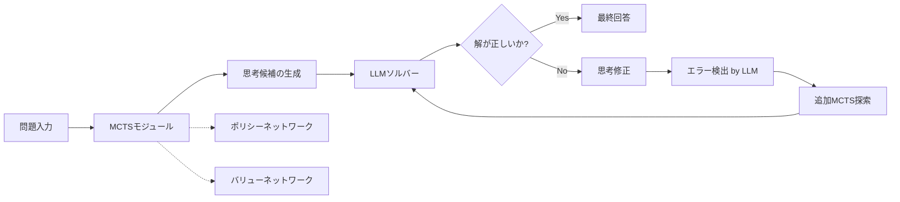

本記事は [Everything of Thoughts (XoT)](https://arxiv.org/abs/2311.04254) の解説記事です。

## 論文概要（Abstract）

Ding, Zhang, Wang et al. (2023) は、LLMの思考生成において「性能（Performance）」「効率（Efficiency）」「柔軟性（Flexibility）」の3要素を同時に達成するフレームワーク XoT（Everything of Thoughts）を提案した。従来の思考パラダイム（CoT, ToT, GoT）はこれら3要素のうち最大2つしか達成できないという制約があり、著者らはこれを「ペンローズ三角形の法則」と呼んでいる。XoTは事前学習済みの強化学習（RL）とモンテカルロ木探索（MCTS）を組み合わせ、外部のドメイン知識と計画能力を思考に組み込むことで、この制約を打破する。Game of 24、8-Puzzle、Pocket Cubeの3タスクで評価を行い、ToT比で大幅な精度向上をわずか1-2回のLLM呼び出しで実現している。

この記事は [Zenn記事: Tree of Thoughts発展手法を比較実装する](https://zenn.dev/0h_n0/articles/7932979f3f3713) の深掘りです。

## 情報源

- **arXiv ID**: 2311.04254
- **URL**: [https://arxiv.org/abs/2311.04254](https://arxiv.org/abs/2311.04254)
- **著者**: Ruomeng Ding, Chaoyun Zhang, Lu Wang et al. (Microsoft Research)
- **発表年**: 2023年11月（ACL 2024 Findings採択）
- **分野**: cs.AI, cs.LG
- **コードリポジトリ**: [github.com/microsoft/Everything-of-Thoughts-XoT](https://github.com/microsoft/Everything-of-Thoughts-XoT)

## 背景と動機（Background & Motivation）

LLMの推論能力を高める思考生成手法は、Chain-of-Thought（CoT）から Tree of Thoughts（ToT）、Graph of Thoughts（GoT）へと発展してきた。しかし、各手法にはトレードオフが存在する。

- **CoT**: 効率的（LLM呼び出し1回）だが、線形な思考しかできず性能・柔軟性に限界がある
- **ToT**: 木構造の探索で性能は高いが、多数のLLM呼び出しが必要（非効率）で、探索空間が固定的
- **GoT**: グラフ構造で柔軟な思考が可能だが、効率と性能の両立が困難

Ding et al. はこの3要素のトレードオフを「ペンローズ三角形の法則」と定式化した。ペンローズ三角形は3辺が同時には成立しない不可能図形であり、従来手法では性能・効率・柔軟性のうち最大2つしか同時に達成できないことを意味する。XoTはこの制約を、LLMの外部にRL+MCTSモジュールを配置することで打破する。MCTSが計画と探索を担当し、LLMは最終的な推論と思考修正のみに集中することで、高い性能と効率を両立する設計である。

## 主要な貢献（Key Contributions）

- **貢献1**: ペンローズ三角形の法則の定式化 --- 既存の思考パラダイム（IO, CoT, CoT-SC, ToT, GoT）が性能・効率・柔軟性の3要素を同時に達成できないことを体系的に整理
- **貢献2**: XoTフレームワークの提案 --- 事前学習済みRLポリシー/バリューネットワークでガイドされたMCTSにより、LLM呼び出し回数を最小化しながら高品質な思考を生成
- **貢献3**: MCTS-LLM協調型の思考修正フレームワーク --- LLMがエラーを検出し、MCTSがエラー地点から追加探索を行うことで、自律的に思考を修正
- **貢献4**: Game of 24、8-Puzzle、Pocket Cubeの3タスクで、ToT比で大幅な性能向上と90%以上のLLM呼び出し削減を実証

## 技術的詳細（Technical Details）

### XoTフレームワークの全体構成

XoTは3つの主要コンポーネントから構成される。



1. **MCTSモジュール**: 事前学習済みのポリシーネットワーク $P_\theta$ とバリューネットワーク $v_\theta$ でガイドされた木探索を実行し、問題の解法（思考パス）を生成する。LLMを呼び出さずに探索が完結する点が核心である
2. **LLMソルバー**: MCTSが生成した思考パスを受け取り、最終的な推論を行う。必要に応じてエラー検出も担当する
3. **思考修正フレームワーク**: LLMが思考中のエラーを特定し、MCTSがエラー地点の親状態から追加シミュレーションを実行して修正する

### MCTSのPUCTアルゴリズム

MCTSの選択フェーズでは、PUCT（Predictor + Upper Confidence bound applied to Trees）アルゴリズムを使用する。各ノードで以下の式に基づいてアクションを選択する。

$$
a^* = \arg\max_{a}\left[Q(s,a) + w \cdot P_\theta(s,a) \sqrt{\frac{N(s)}{1+N(s,a)}}\right]
$$

ここで、
- $Q(s,a)$: 状態 $s$ でアクション $a$ を取った場合の平均価値（exploitation項）
- $P_\theta(s,a)$: ポリシーネットワークが出力するアクション $a$ の事前確率
- $N(s)$: 状態 $s$ の訪問回数
- $N(s,a)$: 状態 $s$ でアクション $a$ を選択した回数
- $w$: exploration重み（exploration-exploitation のバランスを制御）

この式の第1項はexploitation（既知の高価値アクションの活用）、第2項はexploration（未探索アクションの探索）を表す。$N(s,a)$ が小さいほど第2項が大きくなり、未探索のアクションが優先される。ポリシーネットワーク $P_\theta$ の事前確率により、ランダム探索ではなくドメイン知識に基づいた効率的な探索が実現される。

### ポリシー/バリューネットワークの学習

ポリシーネットワークとバリューネットワークは、AlphaZero方式の自己対戦（self-play）で事前学習される。損失関数は以下の通りである。

$$
L = (v(s) - v_\theta(s))^2 + \epsilon(s)^T \log P_\theta(s)
$$

ここで、
- $v(s)$: MCTSシミュレーションから得られた状態 $s$ の真の価値（教師信号）
- $v_\theta(s)$: バリューネットワークの予測価値
- $\epsilon(s)$: MCTSの探索結果から得られた改善されたポリシー（探索確率分布）
- $P_\theta(s)$: ポリシーネットワークの出力確率分布

第1項はバリューネットワークの予測誤差（MSE損失）、第2項はポリシーネットワークのクロスエントロピー損失である。MCTSの探索結果 $\epsilon(s)$ がポリシーの教師信号となるため、探索が進むほどネットワークの精度が向上する自己改善ループが形成される。

ネットワークアーキテクチャは軽量な2層MLP（隠れユニット: 128, 256）であり、学習イテレーション3回、各イテレーションで10エピソードの自己対戦を実行する。この軽量設計により、新しいドメインへの適用時の学習コストを抑えている。

### 思考修正フレームワーク

XoTの特徴的な機能として、MCTS-LLM協調型の思考修正がある。

1. **エラー検出**: LLMがMCTSの生成した思考パスを検証し、エラーが含まれる思考ステップを特定する。この検証にはLLM呼び出しが1回必要
2. **修正探索**: エラーが検出された思考ステップの親状態から、MCTSが追加のシミュレーション（500回）を実行する。推論時の通常シミュレーション（200回）より多い回数を割り当てることで、エラー箇所の修正精度を高める
3. **再推論**: 修正された思考パスをLLMに提供し、最終的な回答を生成する

この修正フレームワークにより、XoTは平均1.39回（Game of 24の場合）のLLM呼び出しで高精度な回答を得る。修正が不要な場合は1回、修正が必要な場合でも2-3回程度に収まるため、ToTの39.83回と比較して桁違いに効率的である。

## 実装のポイント（Implementation）

XoTの公式実装は [github.com/microsoft/Everything-of-Thoughts-XoT](https://github.com/microsoft/Everything-of-Thoughts-XoT) で公開されている。Pythonで実装されており、以下の構成となっている。

- **`xot_mcts/`**: MCTSの学習コード。`Coach.py` が自己対戦ループ、`MCTS.py` が探索アルゴリズム、各タスク用のニューラルネットワークは `{env}/pytorch/NNet.py` に定義
- **`xot_all_in_one/`**: 推論と比較実験のコード。IO, CoT, CoT-SC, ToT, GoT, XoTの各ソルバーを統一インターフェースで提供。設定はYAMLファイルで管理

実装上の注意点として、以下が挙げられる。

1. **ポリシー/バリューネットワークの事前学習**: 新しいタスクへの適用時には、タスク固有の状態表現と行動空間の定義が必要。ネットワーク自体は2層MLPで軽量だが、MCTSの自己対戦データ生成には計算時間がかかる
2. **MCTSシミュレーション数の調整**: 推論時200回、修正時500回がデフォルト設定。タスクの複雑さに応じて調整が必要であり、シミュレーション数を増やすと精度は上がるがレイテンシも増加する
3. **OpenAI API設定**: LLMソルバーはGPT-3.5/GPT-4を使用。環境変数でAPIキーを設定する必要がある

## Production Deployment Guide

XoTは論文にGitHubリポジトリが公開されており、実装セクションが充実しているため、本節ではAWS上でのプロダクション環境構築ガイドを提供する。

### AWS実装パターン（コスト最適化重視）

XoTの本番デプロイでは、MCTSモジュール（CPU/GPUで事前学習済みモデルの推論）とLLMソルバー（Bedrock APIコール）の2系統のコンピュートを考慮する必要がある。以下はトラフィック量別の推奨構成である。

**注意**: コスト試算は2026年5月時点のAWS ap-northeast-1（東京）リージョン料金に基づく概算値。実際のコストはトラフィックパターン、リージョン、バースト使用量により変動する。最新料金は [AWS料金計算ツール](https://calculator.aws/) で確認を推奨する。

| 構成 | トラフィック | 主要サービス | 月額概算 |
|------|------------|-------------|---------|
| Small | ~100 req/日 | Lambda + Bedrock + DynamoDB | $80-180 |
| Medium | ~1,000 req/日 | ECS Fargate + Bedrock + ElastiCache | $400-900 |
| Large | 10,000+ req/日 | EKS + Karpenter + Spot + Bedrock | $2,500-5,500 |

**Small構成の内訳**: Lambda（MCTS推論、ARM64、1024MB、$15-30/月）+ Bedrock Claude 3 Haiku（LLMソルバー、1.39回/req平均、$30-80/月）+ DynamoDB On-Demand（状態管理、$5-15/月）+ S3（モデルチェックポイント保存、$1-5/月）+ CloudWatch（監視、$5-10/月）。XoTはLLM呼び出しが平均1.39回と少ないため、Bedrockコストが従来手法（ToTの39.83回）と比較して大幅に抑えられる。

**Medium構成の内訳**: ECS Fargate（MCTSサーバー常駐、0.5vCPU/1GB、$80-150/月）+ Bedrock Claude 3.5 Sonnet（$150-400/月）+ ElastiCache（MCTSキャッシュ、cache.t3.micro、$30-60/月）+ ALB（$25/月）+ CloudWatch/X-Ray（$20-40/月）。

**Large構成の内訳**: EKS コントロールプレーン（$73/月）+ EC2 Spot（c6g.xlarge x 3、MCTS推論、$120-200/月）+ Bedrock Claude 3.5 Sonnet（$1,500-3,500/月）+ ElastiCache（cache.r6g.large、$200/月）+ ALB + NAT Gateway（$100/月）+ 監視一式（$50-100/月）。Karpenterによる自動スケーリングでピーク時のみノード追加。

**コスト削減テクニック**:
- **Spot Instances活用**: MCTSの推論はステートレスなため中断耐性が高く、Spot Instancesで最大90%削減
- **Bedrock Batch API**: 非リアルタイム処理ではBatch APIで50%削減
- **Prompt Caching**: MCTSが生成する思考パスのプレフィックスをキャッシュし、30-90%削減
- **モデル選択ロジック**: 修正不要ケース（約60%）はHaikuで処理し、修正時のみSonnetを使用

### Terraformインフラコード

#### Small構成（Serverless: Lambda + Bedrock）

```hcl
# XoT Small構成 - Lambda + Bedrock + DynamoDB
# 2026-05 ap-northeast-1 向け

terraform {
  required_version = ">= 1.8"
  required_providers {
    aws = {
      source  = "hashicorp/aws"
      version = "~> 5.80"
    }
  }
}

provider "aws" {
  region = "ap-northeast-1"
}

# --- IAM (最小権限) ---
resource "aws_iam_role" "xot_lambda" {
  name = "xot-lambda-role"
  assume_role_policy = jsonencode({
    Version = "2012-10-17"
    Statement = [{
      Action = "sts:AssumeRole"
      Effect = "Allow"
      Principal = { Service = "lambda.amazonaws.com" }
    }]
  })
}

resource "aws_iam_role_policy" "xot_lambda_policy" {
  name = "xot-lambda-policy"
  role = aws_iam_role.xot_lambda.id
  policy = jsonencode({
    Version = "2012-10-17"
    Statement = [
      {
        Effect = "Allow"
        Action = [
          "bedrock:InvokeModel",      # LLMソルバー用
          "bedrock:InvokeModelWithResponseStream"
        ]
        Resource = "arn:aws:bedrock:ap-northeast-1::foundation-model/anthropic.*"
      },
      {
        Effect = "Allow"
        Action = [
          "dynamodb:GetItem", "dynamodb:PutItem",
          "dynamodb:UpdateItem", "dynamodb:Query"
        ]
        Resource = aws_dynamodb_table.xot_state.arn
      },
      {
        Effect   = "Allow"
        Action   = ["s3:GetObject"]
        Resource = "${aws_s3_bucket.xot_models.arn}/*"  # チェックポイント読込
      },
      {
        Effect = "Allow"
        Action = [
          "logs:CreateLogGroup", "logs:CreateLogStream",
          "logs:PutLogEvents"
        ]
        Resource = "arn:aws:logs:*:*:*"
      }
    ]
  })
}

# --- S3 (モデルチェックポイント) ---
resource "aws_s3_bucket" "xot_models" {
  bucket = "xot-model-checkpoints-${data.aws_caller_identity.current.account_id}"
}

resource "aws_s3_bucket_server_side_encryption_configuration" "xot_models" {
  bucket = aws_s3_bucket.xot_models.id
  rule {
    apply_server_side_encryption_by_default {
      sse_algorithm = "aws:kms"  # KMS暗号化
    }
  }
}

resource "aws_s3_bucket_public_access_block" "xot_models" {
  bucket                  = aws_s3_bucket.xot_models.id
  block_public_acls       = true
  block_public_policy     = true
  ignore_public_acls      = true
  restrict_public_buckets = true
}

# --- DynamoDB (On-Demand, 状態管理) ---
resource "aws_dynamodb_table" "xot_state" {
  name         = "xot-thought-state"
  billing_mode = "PAY_PER_REQUEST"  # On-Demand: 低コスト
  hash_key     = "request_id"

  attribute {
    name = "request_id"
    type = "S"
  }

  server_side_encryption {
    enabled = true  # KMS暗号化
  }

  ttl {
    attribute_name = "expires_at"
    enabled        = true  # 自動削除でストレージコスト削減
  }
}

# --- Lambda (MCTS推論 + LLMソルバー呼び出し) ---
resource "aws_lambda_function" "xot_solver" {
  function_name = "xot-solver"
  role          = aws_iam_role.xot_lambda.arn
  runtime       = "python3.12"
  handler       = "handler.lambda_handler"
  timeout       = 120           # MCTS探索 + LLM呼び出し
  memory_size   = 1024          # MLP推論に十分なメモリ
  architectures = ["arm64"]     # Graviton: x86比20%安価

  environment {
    variables = {
      MCTS_SIMULATIONS     = "200"    # 推論時シミュレーション数
      MCTS_REVISION_SIMS   = "500"    # 修正時シミュレーション数
      MODEL_BUCKET         = aws_s3_bucket.xot_models.id
      DYNAMODB_TABLE       = aws_dynamodb_table.xot_state.name
      BEDROCK_MODEL_ID     = "anthropic.claude-3-haiku-20240307-v1:0"
    }
  }

  tracing_config {
    mode = "Active"  # X-Ray自動計装
  }

  filename = "lambda_package.zip"  # デプロイパッケージ
}

# --- CloudWatch アラーム (コスト監視) ---
resource "aws_cloudwatch_metric_alarm" "lambda_duration" {
  alarm_name          = "xot-lambda-duration-high"
  comparison_operator = "GreaterThanThreshold"
  evaluation_periods  = 3
  metric_name         = "Duration"
  namespace           = "AWS/Lambda"
  period              = 300
  statistic           = "Average"
  threshold           = 90000  # 90秒超でアラート
  alarm_description   = "XoT Lambda実行時間異常 - MCTSシミュレーション数の見直しを検討"
  dimensions = {
    FunctionName = aws_lambda_function.xot_solver.function_name
  }
}

data "aws_caller_identity" "current" {}
```

#### Large構成（Container: EKS + Karpenter + Spot）

```hcl
# XoT Large構成 - EKS + Karpenter + Spot Instances
# 10,000+ req/日向け

module "eks" {
  source  = "terraform-aws-modules/eks/aws"
  version = "~> 20.30"

  cluster_name    = "xot-production"
  cluster_version = "1.31"

  vpc_id     = module.vpc.vpc_id
  subnet_ids = module.vpc.private_subnets

  # パブリックアクセス最小化
  cluster_endpoint_public_access  = true
  cluster_endpoint_private_access = true

  eks_managed_node_groups = {
    # システムノード（常時稼働、On-Demand）
    system = {
      instance_types = ["t4g.medium"]  # Graviton: コスト効率
      capacity_type  = "ON_DEMAND"
      min_size       = 1
      max_size       = 2
      desired_size   = 1
    }
  }
}

# --- Karpenter (Spot優先オートスケーリング) ---
resource "helm_release" "karpenter" {
  name       = "karpenter"
  repository = "oci://public.ecr.aws/karpenter"
  chart      = "karpenter"
  version    = "1.1.1"
  namespace  = "kube-system"

  set {
    name  = "settings.clusterName"
    value = module.eks.cluster_name
  }
}

# Karpenter NodePool: MCTS推論用 (Spot優先)
resource "kubectl_manifest" "xot_nodepool" {
  yaml_body = <<-YAML
    apiVersion: karpenter.sh/v1
    kind: NodePool
    metadata:
      name: xot-mcts-workers
    spec:
      template:
        spec:
          requirements:
            - key: karpenter.sh/capacity-type
              operator: In
              values: ["spot", "on-demand"]  # Spot優先
            - key: node.kubernetes.io/instance-type
              operator: In
              values: ["c6g.xlarge", "c7g.xlarge", "c6gn.xlarge"]
            - key: kubernetes.io/arch
              operator: In
              values: ["arm64"]  # Graviton
          nodeClassRef:
            group: karpenter.k8s.aws
            kind: EC2NodeClass
            name: default
      limits:
        cpu: "64"          # 最大CPU制限
        memory: "128Gi"
      disruption:
        consolidationPolicy: WhenEmptyOrUnderutilized
        consolidateAfter: 60s  # アイドル1分で統合
  YAML
}

# --- Secrets Manager (API設定) ---
resource "aws_secretsmanager_secret" "bedrock_config" {
  name = "xot/bedrock-config"
}

resource "aws_secretsmanager_secret_version" "bedrock_config" {
  secret_id = aws_secretsmanager_secret.bedrock_config.id
  secret_string = jsonencode({
    model_id         = "anthropic.claude-3-5-sonnet-20241022-v2:0"
    fallback_model   = "anthropic.claude-3-haiku-20240307-v1:0"
    max_tokens       = 4096
    mcts_simulations = 200
    revision_sims    = 500
  })
}

# --- AWS Budgets (予算アラート) ---
resource "aws_budgets_budget" "xot_monthly" {
  name         = "xot-monthly-budget"
  budget_type  = "COST"
  limit_amount = "5000"
  limit_unit   = "USD"
  time_unit    = "MONTHLY"

  notification {
    comparison_operator       = "GREATER_THAN"
    threshold                 = 80  # 80%到達でアラート
    threshold_type            = "PERCENTAGE"
    notification_type         = "ACTUAL"
    subscriber_email_addresses = ["ops-team@example.com"]
  }

  notification {
    comparison_operator       = "GREATER_THAN"
    threshold                 = 100  # 100%到達で緊急アラート
    threshold_type            = "PERCENTAGE"
    notification_type         = "ACTUAL"
    subscriber_email_addresses = ["ops-team@example.com"]
  }
}
```

### 運用・監視設定

#### CloudWatch Logs Insights クエリ

```
# コスト異常検知: 1時間あたりのBedrock呼び出し回数
fields @timestamp, @message
| filter @message like /bedrock_invoke/
| stats count() as invoke_count by bin(1h) as hour
| sort hour desc
| limit 24

# レイテンシ分析: P95/P99
fields @timestamp, duration_ms
| filter @message like /xot_solver/
| stats percentile(duration_ms, 95) as p95,
        percentile(duration_ms, 99) as p99,
        avg(duration_ms) as avg_ms
  by bin(1h)
```

#### CloudWatch アラーム設定（Python）

```python
import boto3

cloudwatch = boto3.client("cloudwatch", region_name="ap-northeast-1")

def create_bedrock_token_alarm() -> None:
    """Bedrockトークン使用量スパイク検知アラームを作成"""
    cloudwatch.put_metric_alarm(
        AlarmName="xot-bedrock-token-spike",
        MetricName="InputTokenCount",
        Namespace="AWS/Bedrock",
        Statistic="Sum",
        Period=3600,       # 1時間単位
        EvaluationPeriods=2,
        Threshold=500000,  # 1時間50万トークン超過
        ComparisonOperator="GreaterThanThreshold",
        AlarmActions=["arn:aws:sns:ap-northeast-1:ACCOUNT:xot-alerts"],
        Dimensions=[
            {"Name": "ModelId", "Value": "anthropic.claude-3-haiku-20240307-v1:0"}
        ],
    )
```

#### X-Ray トレーシング設定（Python）

```python
from aws_xray_sdk.core import xray_recorder, patch_all

# boto3自動計装
patch_all()

@xray_recorder.capture("xot_mcts_inference")
def run_mcts_inference(problem_state: dict) -> dict:
    """MCTS推論をX-Rayでトレース"""
    subsegment = xray_recorder.current_subsegment()
    subsegment.put_annotation("task_type", problem_state.get("task", "unknown"))
    subsegment.put_metadata("mcts_sims", 200)

    # MCTS実行
    result = mcts_solver.solve(problem_state)

    subsegment.put_annotation("needs_revision", result.get("needs_revision", False))
    subsegment.put_metadata("llm_calls", result.get("llm_call_count", 1))
    return result
```

#### Cost Explorer 自動レポート（Python）

```python
import boto3
from datetime import datetime, timedelta

ce = boto3.client("ce", region_name="us-east-1")
sns = boto3.client("sns", region_name="ap-northeast-1")

def daily_cost_report() -> dict:
    """日次コストレポートを取得し、閾値超過時にSNS通知"""
    end = datetime.utcnow().strftime("%Y-%m-%d")
    start = (datetime.utcnow() - timedelta(days=1)).strftime("%Y-%m-%d")

    response = ce.get_cost_and_usage(
        TimePeriod={"Start": start, "End": end},
        Granularity="DAILY",
        Metrics=["UnblendedCost"],
        Filter={
            "Tags": {
                "Key": "Project",
                "Values": ["xot-production"],
            }
        },
        GroupBy=[{"Type": "DIMENSION", "Key": "SERVICE"}],
    )

    total = sum(
        float(g["Metrics"]["UnblendedCost"]["Amount"])
        for r in response["ResultsByTime"]
        for g in r["Groups"]
    )

    if total > 100:  # $100/日超過でアラート
        sns.publish(
            TopicArn="arn:aws:sns:ap-northeast-1:ACCOUNT:xot-cost-alerts",
            Subject=f"XoT Daily Cost Alert: ${total:.2f}",
            Message=f"日次コストが$100を超過: ${total:.2f}\n詳細: {response}",
        )

    return {"date": start, "total_cost": total, "breakdown": response}
```

### コスト最適化チェックリスト

#### アーキテクチャ選択
- [ ] トラフィック量に応じた構成選択（~100/日: Serverless、~1,000/日: Hybrid、10,000+/日: Container）
- [ ] XoTの特性（LLM呼び出し1-2回）を活かしたBedrock中心設計

#### リソース最適化
- [ ] EC2/EKS: Spot Instances優先（MCTSはステートレスで中断耐性あり）
- [ ] Reserved Instances: MCTS常駐サーバーには1年コミットで最大72%削減
- [ ] Savings Plans: Compute Savings Plansでリージョン横断の割引適用
- [ ] Lambda: メモリサイズ最適化（Power Tuningツールで1024MB前後を検証）
- [ ] Graviton (ARM64): x86比20%安価、MLP推論には十分な性能
- [ ] ECS/EKS: Karpenter WhenEmptyOrUnderutilized で自動統合

#### LLMコスト削減
- [ ] Bedrock Batch API: 非リアルタイム処理で50%削減
- [ ] Prompt Caching: 思考パスのプレフィックスをキャッシュ（30-90%削減）
- [ ] モデル選択ロジック: 修正不要ケースはHaiku、修正時のみSonnet
- [ ] トークン数制限: MCTS思考パスの最大長を制限（max_tokens 4096）
- [ ] XoT採用自体がコスト削減: ToT比でLLM呼び出し97%削減（39.83回 vs 1.39回）

#### 監視・アラート
- [ ] AWS Budgets: 月額予算アラート（80%/100%閾値）
- [ ] CloudWatch アラーム: Bedrockトークン使用量、Lambda実行時間
- [ ] Cost Anomaly Detection: ML検知による異常コスト通知
- [ ] 日次コストレポート: Cost Explorer APIで自動取得、$100/日超過でSNS通知
- [ ] X-Rayトレーシング: MCTS推論 + Bedrock呼び出しの分散トレース

#### リソース管理
- [ ] 未使用リソース削除: 週次でUnused EBS/ENI/EIP棚卸し
- [ ] タグ戦略: `Project=xot-production`, `Environment=prod/staging/dev` 必須
- [ ] S3ライフサイクルポリシー: MCTSチェックポイントの旧バージョンを30日で Glacier移行
- [ ] DynamoDB TTL: 完了リクエストを24時間で自動削除
- [ ] 開発環境の夜間停止: EKS dev クラスタを22:00-08:00で停止（Karpenter disruption活用）
- [ ] CloudWatch Logs保持期間: 本番30日、開発7日に設定

## 実験結果（Results）

著者らは Game of 24、8-Puzzle、Pocket Cube の3タスクでXoTを評価している。

### Game of 24（論文 Table 1 より）

4つの数字と四則演算で24を作る問題。1,225題のデータセットで評価。

| 手法 | GPT-3.5 精度 | GPT-4 精度 | LLM呼び出し回数 |
|------|-------------|-----------|----------------|
| IO | 6.57% | 10.22% | 1.00 |
| CoT | 2.19% | 4.38% | 1.00 |
| ToT (b=3) | 10.22% | 60.58% | 39.83 |
| XoT (修正なし) | 61.31% | 63.50% | 1.00 |
| XoT (修正あり) | 79.56% | 74.45% | 1.39 |
| XoT (複数解) | 90.51% | 85.40% | 2.31 |

XoT（修正あり）はGPT-3.5でToTのGPT-4精度を上回り（79.56% vs 60.58%）、LLM呼び出しは97%少ない（1.39 vs 39.83）。GPT-3.5でGPT-4を超える精度を出せる点は、コスト面で大きな意味を持つ。

### 8-Puzzle（論文 Table 2 より）

3x3のスライドパズル。300題で評価。

| 手法 | GPT-3.5 精度 | GPT-4 精度 | LLM呼び出し回数 |
|------|-------------|-----------|----------------|
| ToT (b=3) | 6.72% | 13.45% | 54.13 |
| XoT (修正あり) | 59.66% | 93.28% | 1.48 |

### Pocket Cube（論文 Table 3 より）

2x2x2のルービックキューブ。1,000題で評価。

| 手法 | GPT-3.5 精度 | GPT-4 精度 | LLM呼び出し回数 |
|------|-------------|-----------|----------------|
| ToT (b=3) | 17.49% | 19.57% | 56.58 |
| XoT (修正あり) | 74.32% | 77.60% | 1.54 |

3タスク全てにおいて、XoTはToT比で4-9倍の精度向上を1/30以下のLLM呼び出し回数で達成している。特にGPT-3.5での性能向上が顕著であり、これはMCTSが外部知識として探索能力を提供するため、LLM自体の推論能力への依存度が低減されていることを示唆する。

## 実運用への応用（Practical Applications）

XoTの設計思想は、LLMの推論コストが課題となるプロダクション環境で有用である。[Zenn記事](https://zenn.dev/0h_n0/articles/7932979f3f3713)で比較されているToT/GoTは、多数のLLM呼び出しが必要なため、リアルタイム応答が求められるサービスには適用しにくい。XoTはこの制約を解消する。

**適用が見込まれるユースケース**:
- **数学・論理パズルの自動解答**: MCTSの事前学習により、問題構造に特化した探索が可能。教育プラットフォームでの活用が考えられる
- **コード生成のプランニング**: コード生成の計画段階でMCTSが候補を生成し、LLMが最終的なコードに変換するパイプライン
- **対話システムの応答計画**: 複数の応答候補をMCTSで評価し、最適な応答パスをLLMに提供する

**制約・限界**:
- タスクごとにポリシー/バリューネットワークの事前学習が必要であり、汎用的なゼロショット適用はできない
- MCTSの状態空間と行動空間の定義がタスク依存であり、新しいドメインへの適用にはエンジニアリングコストがかかる
- 自然言語生成タスク（要約、翻訳等）のように行動空間が巨大な問題への適用は、著者らも未検証としている

## 関連研究（Related Work）

- **Tree of Thoughts (ToT)** (Yao et al., 2023): LLM自身が木構造で思考を展開する手法。XoTとの違いは、ToTがLLMを探索のエンジンとして使用するのに対し、XoTは事前学習済みのMCTSを探索に使い、LLMは推論のみに特化させる点にある
- **Graph of Thoughts (GoT)** (Besta et al., 2023): 思考をグラフ構造で表現し、合流・分岐を可能にする。柔軟性は高いが、効率面での課題がある
- **LATS** (Zhou et al., 2023): LLM自身をMCTSのシミュレーションに使用する手法。XoTとは異なり、各シミュレーションでLLMを呼び出すため効率面で劣る
- **AlphaZero** (Silver et al., 2017): XoTのMCTSモジュールはAlphaZero方式の自己対戦で学習される。ゲームAIの手法をLLM思考生成に転用した点がXoTの着眼点である

## まとめと今後の展望

XoTは、事前学習済みのRL+MCTSをLLMの外部モジュールとして配置することで、思考生成における性能・効率・柔軟性のトレードオフ（ペンローズ三角形の法則）を打破した。Game of 24ではGPT-3.5で79.56%の精度をわずか1.39回のLLM呼び出しで達成し、ToT（GPT-4、60.58%、39.83回）を大幅に上回っている。

今後の研究方向として、著者らは以下を示唆している。(1) より複雑な自然言語タスクへの適用（行動空間の汎用的な定義方法の確立）、(2) MCTSの事前学習を効率化するメタ学習アプローチ、(3) 複数ドメインで共有可能なポリシーネットワークの設計。LLMの推論コスト削減が求められるプロダクション環境において、外部探索モジュールとの協調という設計パターンは今後も発展が期待される。

## 参考文献

- **arXiv**: [https://arxiv.org/abs/2311.04254](https://arxiv.org/abs/2311.04254)
- **ACL Anthology**: [https://aclanthology.org/2024.findings-acl.95/](https://aclanthology.org/2024.findings-acl.95/)
- **Code**: [https://github.com/microsoft/Everything-of-Thoughts-XoT](https://github.com/microsoft/Everything-of-Thoughts-XoT)
- **Related Zenn article**: [https://zenn.dev/0h_n0/articles/7932979f3f3713](https://zenn.dev/0h_n0/articles/7932979f3f3713)
