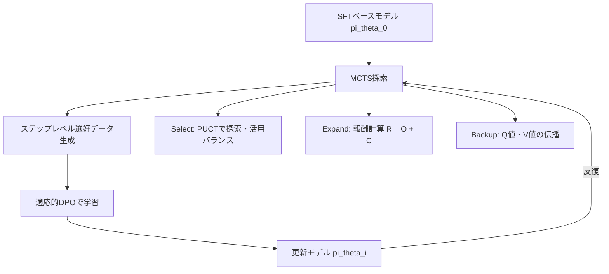
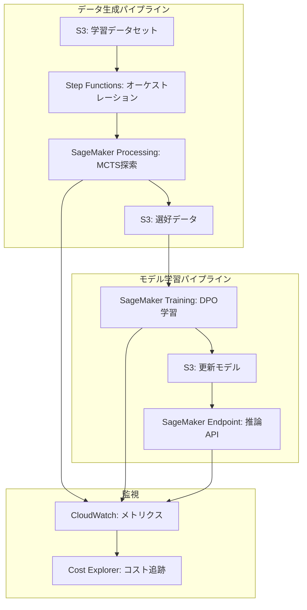

## 論文概要（Abstract）

本記事は [Monte Carlo Tree Search Boosts Reasoning via Iterative Preference Learning](https://arxiv.org/abs/2405.00451) の解説記事です。

著者らは、AlphaZeroの自己対戦学習に着想を得て、Monte Carlo Tree Search（MCTS）によりステップレベルの選好データを生成し、Direct Preference Optimization（DPO）でLLMを反復的に更新するフレームワークを提案しています。従来のインスタンスレベル（回答全体単位）の選好学習では中間ステップの品質を評価できない問題がありましたが、本手法ではMCTSの木探索によって推論過程の各ステップに対して細粒度な報酬を割り当てます。Mistral-7Bをベースモデルとした実験では、GSM8Kで81.8%（+5.9%）、MATHで34.7%（+5.8%）、ARC-Challengeで76.4%（+15.8%）の精度向上が報告されています（arXiv:2405.00451, Xie et al., 2024）。

この記事は [Zenn記事: Tree of Thoughts発展手法を比較実装する: ToT・GoT・MCTSの精度とコスト](https://zenn.dev/0h_n0/articles/7932979f3f3713) の深掘りです。

## 情報源

- **arXiv ID**: 2405.00451
- **URL**: [arXiv:2405.00451](https://arxiv.org/abs/2405.00451)
- **著者**: Yuxi Xie, Anirudh Goyal, Wenyue Zheng, Min-Yen Kan, Timothy P. Lillicrap, Kenji Kawaguchi, Michael Shieh
- **初版投稿**: 2024年5月
- **最終改訂**: 2024年6月（v2）
- **分野**: Artificial Intelligence (cs.AI), Machine Learning (cs.LG)
- **公式実装**: [YuxiXie/MCTS-DPO](https://github.com/YuxiXie/MCTS-DPO)（Apache-2.0ライセンス）

## 背景と動機（Background & Motivation）

### LLM推論の課題とステップレベル選好の必要性

LLMの推論能力を強化するために、RLHF（Reinforcement Learning from Human Feedback）やDPOによる選好学習が広く用いられています。しかし、従来の手法はインスタンスレベル、すなわち回答全体に対して「良い/悪い」のラベルを付与する方式が主流でした。数学的推論のように複数のステップから成るタスクでは、正しい最終回答に至るまでの**中間ステップの品質**が重要であるにもかかわらず、インスタンスレベルの報酬だけでは各ステップの良否を識別できません。

### AlphaZeroからの着想

著者らは、AlphaZeroが自己対戦とMCTSを組み合わせてゲーム木を探索し、ポリシーと価値関数を反復的に改善する仕組みに着目しています。ゲームにおける「手」の評価と同様に、LLMの推論における各「ステップ」を木構造のノードとして扱い、MCTSの探索によりステップレベルの品質を定量化するアプローチを採用しています。さらに、オフラインで固定データから学習するのではなく、更新されたモデル自身が新たなデータを生成する**オンライン学習**の枠組みを採ることで、ポリシーとデータ分布の乖離を回避しています。

## 主要な貢献（Key Contributions）

1. **ステップレベル選好データの自動生成**: MCTSの木探索を用いて、LLMの推論過程における各ステップに対してQ値ベースの選好ペアを自動構築する手法を提案
2. **自己評価による報酬の精緻化**: 正解判定（Outcome）だけでなく、モデル自身の信頼度（Self-evaluation）を報酬に組み込むことで、中間ステップの品質推定精度を向上
3. **オンライン反復学習フレームワーク**: 更新済みモデルで新たなMCTS探索を行い、DPOで再学習するサイクルを繰り返すことで、オフライン学習の理論的限界を回避
4. **適応的ラベルスムージング付きDPO**: MCTSの訪問回数に基づくスムージングパラメータにより、ノイジーな選好ラベルに対する頑健性を実現
5. **算術・常識推論の両方で一貫した改善**: GSM8K、MATH、ARC-Challenge、AI2Science、SciQなど複数ベンチマークでSFTベースラインを上回る精度を達成

## 技術的詳細（Technical Details）

### 全体アーキテクチャ

本手法は、MCTSによるデータ生成とDPOによるモデル更新を交互に繰り返す反復学習フレームワークです。



### Select Phase: PUCTによるノード選択

MCTSの各イテレーションでは、PUCT（Predictor + Upper Confidence bounds applied to Trees）アルゴリズムにより次に展開するノードを選択します。

$$s_{t+1}^{*} = \arg\max_{s_{t+1}} \left[ Q(s_t, a) + c_{\text{puct}} \cdot \frac{p(a \mid s_t) \cdot \sqrt{N(s_t)}}{1 + N(s_{t+1})} \right]$$

ここで、
- $Q(s_t, a)$: 状態 $s_t$ で行動 $a$ を選択した場合の行動価値（Q値）
- $c_{\text{puct}}$: 探索と活用のバランスを制御する定数
- $N(s_t)$: 状態 $s_t$ の訪問回数
- $p(a \mid s_t)$: ポリシーに基づく行動の事前確率

ポリシー確率 $p(a \mid s_t)$ には長さペナルティが組み込まれています。

$$p(a \mid s_t) = \frac{\pi_\theta(a \mid x, s_t)}{|a|^\lambda}$$

ここで $|a|$ は行動（生成されたテキスト）のトークン数、$\lambda$ は長さペナルティの強度です。この設計により、不必要に長い推論チェーンの生成が抑制されます。

### Expand Phase: 報酬関数の設計

展開されたノード（推論ステップ）に対して、2つの成分から成る報酬を計算します。

$$R(s_t) = O(s_t) + C(s_t)$$

**Outcome correctness $O(s_t)$**: 結果の正確性を判定する離散的な報酬です。

$$O(s_t) = \begin{cases} +1 & \text{正解の終端状態} \\ -1 & \text{不正解の終端状態} \\ 0 & \text{中間状態（未完了）} \end{cases}$$

**Self-evaluation $C(s_t)$**: モデル自身が現在の推論ステップの正確性を評価するスコアです。具体的には、「この推論は正しいか?」というプロンプトに対するモデルの応答確率として定義されます。

$$C(s_t) = \pi_\theta(A \mid \text{prompt}_{\text{eval}}, x, s_t)$$

ここで $A$ は正確性を示すトークン（例: "correct"）、$\text{prompt}_{\text{eval}}$ は自己評価用のプロンプトです。著者らの実験（論文Table 3）では、評価プロンプトに例示（example answers）を含めることでAUCが62.0から74.7に改善されたと報告されています。

### Backup Phase: Q値の伝播

MCTSの探索終了後、終端ノードから根ノードに向かってボトムアップでQ値と状態価値Vを更新します。

$$Q(s_t, a) \leftarrow r(s_t, a) + \gamma \cdot V(s_{t+1})$$

$$V(s_t) = \frac{\sum_{a} N(s_{t+1}) \cdot Q(s_t, a)}{\sum_{a} N(s_{t+1})}$$

$$N(s_t) \leftarrow N(s_t) + 1$$

ここで、
- $r(s_t, a)$: 状態 $s_t$ で行動 $a$ を取った場合の即時報酬
- $\gamma$: 将来の報酬に対する割引率
- $V(s_t)$: 状態 $s_t$ の価値（子ノードのQ値の訪問回数加重平均）

状態価値 $V(s_t)$ を訪問回数 $N(s_{t+1})$ で重み付け平均する点が特徴的です。より多く訪問されたノード（有望な探索パス）のQ値が強く反映されます。

### DPO損失関数（適応的ラベルスムージング付き）

MCTSから得られたステップレベルの選好ペア $(y_w, y_l)$（$y_w$: 選好される応答、$y_l$: 非選好応答）を用いて、以下のDPO損失関数でモデルを更新します。

$$\ell_i(\theta) = -\mathbb{E}\left[(1 - \alpha_{x, y_w, y_l}) \log \sigma\left(\beta \cdot h_{\pi_\theta}^{y_w, y_l}\right) + \alpha_{x, y_w, y_l} \log \sigma\left(-\beta \cdot h_{\pi_\theta}^{y_w, y_l}\right)\right]$$

ここで $\beta$ はDPOの温度パラメータ、$h_{\pi_\theta}^{y_w, y_l}$ はモデルの選好スコア差です。

適応的ラベルスムージングパラメータ $\alpha$ は、MCTSの訪問回数に基づいて算出されます。

$$\alpha_{x, y_w, y_l} = \frac{1}{N(x, y_w) / N(x, y_l) + 1}$$

ここで、
- $N(x, y_w)$: 選好される応答 $y_w$ を含むノードの訪問回数
- $N(x, y_l)$: 非選好応答 $y_l$ を含むノードの訪問回数

この設計の直感的な意味は明快です。$y_w$ と $y_l$ の訪問回数の差が大きい（MCTSが明確に片方を優先した）場合、$\alpha$ は小さくなり、通常のDPOに近い強い学習信号が発生します。逆に、訪問回数が拮抗している（MCTSでも判断が難しかった）場合、$\alpha$ は0.5に近づき、学習信号が緩和されます。これにより、ノイジーなラベルに対して保守的な更新が行われます。

### オンラインvs.オフライン: 理論的根拠

著者らは、オフラインとオンラインの選好学習の理論的な比較も行っています。

**定理3.1（オフラインの限界）**: サンプリング分布と現在のポリシーが大きく乖離する場合、オフライン選好学習は確率 $\geq 1 - 2\varepsilon M$ で最適ポリシーへの収束に失敗すると示されています。

**定理3.2（オンラインの収束）**: オンライン設定（各イテレーションで $\pi^{(i)} = \pi_\theta^{(i-1)}$ として新たなデータを生成）では、$M \geq n + 1$ イテレーション以内で最適ポリシーに収束することが保証されます。ここで $n$ は準最適応答の数です。

## 実装のポイント（Implementation Notes）

### 公式実装: MCTS-DPO

著者らは[MCTS-DPO](https://github.com/YuxiXie/MCTS-DPO)をApache-2.0ライセンスで公開しており、Safe-RLHFのコードベースを基に構築されています。高速版として[Fast-MCTS-DPO](https://github.com/YuxiXie/Fast-MCTS-DPO)（vLLM統合版）も公開されています。

**環境構築**:

```bash
conda env create --file conda-recipe.yaml
pip install -r requirements.txt
```

**実行例**（数学推論タスク）:

```bash
# Mistral-7B SFTモデルでMCTS + DPOを実行
bash scripts/mcts_mathqa.sh
```

### 主要なハイパーパラメータ

| パラメータ | 記号 | 説明 |
|---|---|---|
| MCTSイテレーション数 | $K$ | 各問題に対するMCTS探索の繰り返し回数 |
| 分岐数 | $b_1 \to b_2$ | アニーリングにより探索初期は広く、後半は狭く |
| 木の深さ | $T$ | 1サンプルあたりの平均推論ステップ数 |
| DPO温度 | $\beta$ | 選好学習の強度を制御 |
| PUCT定数 | $c_{\text{puct}}$ | 探索・活用のバランス |
| 長さペナルティ | $\lambda$ | 長い推論チェーンへのペナルティ |
| 割引率 | $\gamma$ | 将来報酬の減衰率 |

分岐数のアニーリング（$b_1 \to b_2$、$b_1 > b_2$）は実装上の工夫として注目に値します。探索初期には多くの候補を生成して広く探索し、後半には有望な分岐に集中することで、計算コストと探索品質のトレードオフを制御しています。

## Production Deployment Guide

MCTS + DPOによる反復選好学習パイプラインをAWS上で本番運用する場合のアーキテクチャとコスト試算を示します。以下の料金は2026年5月時点のAWS公式料金（ap-northeast-1リージョン）に基づく概算値です。実際のコストはトラフィックパターン、リージョン、バースト使用量により変動するため、最新料金はAWS料金計算ツールで確認を推奨します。

### アーキテクチャ概要

本手法は「MCTSによるデータ生成（推論フェーズ）」と「DPOによるモデル更新（学習フェーズ）」の2つのワークロードから構成されます。推論フェーズはGPUを大量に消費するMCTS探索を伴い、学習フェーズは通常のDPOファインチューニングです。



### AWS実装パターン（コスト最適化重視）

#### トラフィック量別推奨構成

| 構成 | ユースケース | AWSサービス | 月額コスト概算 |
|---|---|---|---|
| Small | 研究用途（週1回学習） | SageMaker Processing (Spot) + S3 | $200-500 |
| Medium | チーム利用（日次学習） | SageMaker Training + ECS Fargate | $1,500-3,000 |
| Large | プロダクション（継続学習） | EKS + Karpenter + Spot | $5,000-12,000 |

#### Small構成（研究用途: 週1回の反復学習）

- **SageMaker Processing** (ml.g5.2xlarge Spot): MCTS探索ジョブ（1回あたり4-8時間）
- **SageMaker Training** (ml.g5.12xlarge Spot): DPOファインチューニング（1回あたり2-4時間）
- **S3**: 選好データ・モデルチェックポイント保存
- **Step Functions**: パイプラインオーケストレーション

コスト内訳:
- g5.2xlarge Spot ($0.484/hr) x 8h x 4回/月 = **$15.5**
- g5.12xlarge Spot ($2.269/hr) x 4h x 4回/月 = **$36.3**
- S3 (500GB) = **$11.5**
- Step Functions + CloudWatch = **$5**
- **合計: 約$68/月**（Spotが常時確保できる前提）

#### Medium構成（日次学習サイクル）

- **SageMaker Training** (ml.g5.12xlarge): 日次DPOジョブ
- **ECS Fargate** (4vCPU/16GB): MCTS探索ワーカー（GPU不要の前処理部分）
- **SageMaker Endpoint** (ml.g5.2xlarge x2): 推論API（HA構成）
- **DynamoDB**: 学習メタデータ・選好データインデックス

コスト内訳:
- g5.12xlarge On-Demand ($5.672/hr) x 4h x 30日 = **$680.6**
- g5.2xlarge x2 Endpoint ($1.212/hr x 2 x 730h) = **$1,769.5**
- ECS Fargate = **$50**
- DynamoDB + S3 + CloudWatch = **$30**
- **合計: 約$2,530/月**

#### Large構成（プロダクション: 継続的オンライン学習）

- **EKS + Karpenter**: GPU Spot Instances自動スケーリング
- **FSx for Lustre**: 高速モデル・データI/O
- **SageMaker Pipelines**: MLOpsパイプライン
- **Secrets Manager**: APIキー・モデルレジストリ認証

### Terraformインフラコード

#### Small構成（Serverless: MCTS + DPO学習パイプライン）

```hcl
# Small構成: SageMaker Processing + Training + Step Functions
# 週次反復学習パイプライン

terraform {
  required_version = ">= 1.9"
  required_providers {
    aws = {
      source  = "hashicorp/aws"
      version = "~> 5.80"
    }
  }
}

provider "aws" {
  region = "ap-northeast-1"
}

# --- IAM Role (最小権限) ---
resource "aws_iam_role" "mcts_dpo_role" {
  name = "mcts-dpo-sagemaker-role"
  assume_role_policy = jsonencode({
    Version = "2012-10-17"
    Statement = [{
      Action = "sts:AssumeRole"
      Effect = "Allow"
      Principal = { Service = "sagemaker.amazonaws.com" }
    }]
  })
}

resource "aws_iam_role_policy" "sagemaker_policy" {
  name = "mcts-dpo-sagemaker-policy"
  role = aws_iam_role.mcts_dpo_role.id
  policy = jsonencode({
    Version = "2012-10-17"
    Statement = [
      {
        Effect   = "Allow"
        Action   = ["s3:GetObject", "s3:PutObject", "s3:ListBucket"]
        Resource = [
          aws_s3_bucket.artifacts.arn,
          "${aws_s3_bucket.artifacts.arn}/*"
        ]
      },
      {
        Effect   = "Allow"
        Action   = ["logs:CreateLogGroup", "logs:CreateLogStream", "logs:PutLogEvents"]
        Resource = "arn:aws:logs:*:*:*"
      },
      {
        Effect   = "Allow"
        Action   = ["cloudwatch:PutMetricData"]
        Resource = "*"
      }
    ]
  })
}

# --- S3 Bucket (モデル・選好データ保存) ---
resource "aws_s3_bucket" "artifacts" {
  bucket = "mcts-dpo-artifacts-${data.aws_caller_identity.current.account_id}"
  # コスト最適化: ライフサイクルルールで古いチェックポイントを自動削除
}

resource "aws_s3_bucket_server_side_encryption_configuration" "artifacts_enc" {
  bucket = aws_s3_bucket.artifacts.id
  rule {
    apply_server_side_encryption_by_default {
      sse_algorithm = "aws:kms"
    }
  }
}

resource "aws_s3_bucket_lifecycle_configuration" "artifacts_lifecycle" {
  bucket = aws_s3_bucket.artifacts.id
  rule {
    id     = "expire-old-checkpoints"
    status = "Enabled"
    filter { prefix = "checkpoints/" }
    expiration { days = 30 }
  }
}

# --- CloudWatch Alarm (コスト監視) ---
resource "aws_cloudwatch_metric_alarm" "training_cost" {
  alarm_name          = "mcts-dpo-training-cost-spike"
  comparison_operator = "GreaterThanThreshold"
  evaluation_periods  = 1
  metric_name         = "EstimatedCharges"
  namespace           = "AWS/Billing"
  period              = 86400
  statistic           = "Maximum"
  threshold           = 200 # $200/日 超過で通知
  alarm_actions       = [aws_sns_topic.alerts.arn]
}

resource "aws_sns_topic" "alerts" {
  name = "mcts-dpo-cost-alerts"
}

data "aws_caller_identity" "current" {}
```

#### Large構成（Container: EKS + Karpenter + Spot Instances）

```hcl
# Large構成: EKS + Karpenter + GPU Spot Instances
# 継続的オンライン学習パイプライン

module "eks" {
  source  = "terraform-aws-modules/eks/aws"
  version = "~> 20.31"

  cluster_name    = "mcts-dpo-cluster"
  cluster_version = "1.31"

  vpc_id     = module.vpc.vpc_id
  subnet_ids = module.vpc.private_subnets

  cluster_endpoint_public_access = false

  # コスト最適化: マネージドノードグループは最小限
  eks_managed_node_groups = {
    system = {
      instance_types = ["m6i.large"]
      min_size       = 2
      max_size       = 3
      desired_size   = 2
    }
  }

  # Karpenterに必要なIAM設定
  enable_karpenter = true
}

# Karpenter NodePool: GPU Spot優先
resource "kubectl_manifest" "gpu_nodepool" {
  yaml_body = yamlencode({
    apiVersion = "karpenter.sh/v1"
    kind       = "NodePool"
    metadata   = { name = "gpu-spot" }
    spec = {
      template = {
        spec = {
          requirements = [
            { key = "karpenter.sh/capacity-type", operator = "In", values = ["spot"] },
            { key = "node.kubernetes.io/instance-type", operator = "In",
              values = ["g5.2xlarge", "g5.4xlarge", "g5.12xlarge"] },
          ]
          nodeClassRef = { name = "default" }
        }
      }
      limits = { cpu = "128", "nvidia.com/gpu" = "16" }
      disruption = {
        consolidationPolicy = "WhenEmptyOrUnderutilized"
        consolidateAfter    = "30s"
      }
    }
  })
}

# Secrets Manager: モデルレジストリ認証情報
resource "aws_secretsmanager_secret" "model_registry" {
  name                    = "mcts-dpo/model-registry"
  recovery_window_in_days = 7
}

# AWS Budgets: 月額予算アラート
resource "aws_budgets_budget" "monthly" {
  name         = "mcts-dpo-monthly"
  budget_type  = "COST"
  limit_amount = "12000"
  limit_unit   = "USD"
  time_unit    = "MONTHLY"

  notification {
    comparison_operator       = "GREATER_THAN"
    threshold                 = 80
    threshold_type            = "PERCENTAGE"
    notification_type         = "ACTUAL"
    subscriber_email_addresses = ["team@example.com"]
  }
}
```

### 運用・監視設定

#### CloudWatch Logs Insights クエリ

```
# MCTS探索のトークン使用量分析（1時間あたり）
fields @timestamp, @message
| filter @message like /mcts_iteration/
| stats sum(tokens_generated) as total_tokens,
        avg(tree_depth) as avg_depth,
        avg(branches_explored) as avg_branches
  by bin(1h) as time_window
| sort time_window desc

# DPO学習のロス推移・異常検知
fields @timestamp, dpo_loss, learning_rate, preference_accuracy
| filter @message like /dpo_training_step/
| stats avg(dpo_loss) as avg_loss,
        max(dpo_loss) as max_loss,
        avg(preference_accuracy) as avg_acc
  by bin(5m)
| filter max_loss > 2.0
```

#### CloudWatch アラーム設定

```python
"""CloudWatch alarm configuration for MCTS-DPO pipeline."""
import boto3

cloudwatch = boto3.client("cloudwatch", region_name="ap-northeast-1")


def create_pipeline_alarms(sns_topic_arn: str) -> None:
    """Create monitoring alarms for MCTS-DPO pipeline.

    Args:
        sns_topic_arn: SNS topic ARN for alert notifications.
    """
    # GPU使用率スパイク検知
    cloudwatch.put_metric_alarm(
        AlarmName="mcts-dpo-gpu-utilization-high",
        MetricName="GPUUtilization",
        Namespace="AWS/SageMaker",
        Statistic="Average",
        Period=300,
        EvaluationPeriods=3,
        Threshold=95.0,
        ComparisonOperator="GreaterThanThreshold",
        AlarmActions=[sns_topic_arn],
    )

    # MCTS探索の所要時間異常検知
    cloudwatch.put_metric_alarm(
        AlarmName="mcts-dpo-search-duration-high",
        MetricName="MCTSSearchDuration",
        Namespace="Custom/MCTS-DPO",
        Statistic="p99",
        Period=600,
        EvaluationPeriods=2,
        Threshold=3600.0,  # 1時間超過
        ComparisonOperator="GreaterThanThreshold",
        AlarmActions=[sns_topic_arn],
    )
```

#### X-Ray トレーシング設定

```python
"""X-Ray tracing for MCTS-DPO inference pipeline."""
from aws_xray_sdk.core import xray_recorder, patch_all

# boto3自動計装
patch_all()


@xray_recorder.capture("mcts_search")
def run_mcts_search(
    problem: str,
    model_endpoint: str,
    num_iterations: int = 32,
) -> dict:
    """Execute MCTS search with X-Ray tracing.

    Args:
        problem: Input problem text.
        model_endpoint: SageMaker endpoint name.
        num_iterations: Number of MCTS iterations.

    Returns:
        Search results with preference pairs.
    """
    subsegment = xray_recorder.current_subsegment()
    subsegment.put_annotation("model_endpoint", model_endpoint)
    subsegment.put_annotation("num_iterations", num_iterations)
    subsegment.put_metadata("problem_length", len(problem))

    # MCTS探索の実行（省略）
    results = {"preference_pairs": [], "tree_depth": 0}
    return results
```

#### Cost Explorer自動レポート

```python
"""Daily cost report for MCTS-DPO pipeline."""
import datetime
import json

import boto3


def get_daily_cost_report() -> dict:
    """Retrieve daily cost breakdown for MCTS-DPO services.

    Returns:
        Cost breakdown by service with total.
    """
    ce = boto3.client("ce", region_name="us-east-1")
    today = datetime.date.today()
    yesterday = today - datetime.timedelta(days=1)

    response = ce.get_cost_and_usage(
        TimePeriod={
            "Start": yesterday.isoformat(),
            "End": today.isoformat(),
        },
        Granularity="DAILY",
        Metrics=["UnblendedCost"],
        Filter={
            "Tags": {
                "Key": "Project",
                "Values": ["mcts-dpo"],
            }
        },
        GroupBy=[{"Type": "DIMENSION", "Key": "SERVICE"}],
    )

    costs = {}
    for group in response["ResultsByTime"][0]["Groups"]:
        service = group["Keys"][0]
        amount = float(group["Metrics"]["UnblendedCost"]["Amount"])
        costs[service] = amount

    total = sum(costs.values())

    # $100/日超過でSNS通知
    if total > 100:
        sns = boto3.client("sns", region_name="ap-northeast-1")
        sns.publish(
            TopicArn="arn:aws:sns:ap-northeast-1:ACCOUNT:mcts-dpo-cost-alerts",
            Subject="MCTS-DPO Cost Alert",
            Message=json.dumps(
                {"total": total, "breakdown": costs}, indent=2
            ),
        )

    return {"total": total, "breakdown": costs}
```

### コスト最適化チェックリスト

**アーキテクチャ選択**:
- [ ] 学習頻度に応じた構成を選択（週次: Small、日次: Medium、継続: Large）
- [ ] MCTS探索と DPO学習のワークロードを分離（異なるインスタンスタイプ）

**リソース最適化**:
- [ ] GPU Spot Instances優先（MCTS探索は中断再開可能な設計に）
- [ ] Reserved Instances: SageMaker Endpoint用（1年コミットで40%削減）
- [ ] Savings Plans: 長期運用のGPUコンピュート（3年で最大56%削減）
- [ ] SageMaker Processing: ジョブ完了後の自動インスタンス停止を確認
- [ ] EKS: Karpenterの consolidation で未使用ノード即時回収

**LLMコスト削減**:
- [ ] 分岐数アニーリング（$b_1 \to b_2$）で不要な探索を削減
- [ ] MCTSイテレーション数 $K$ を問題難易度に応じて動的調整
- [ ] 学習済みモデルの量子化（INT8/INT4）で推論コストを50-75%削減
- [ ] バッチ推論でMCTS探索を並列化（GPU使用率を最大化）

**監視・アラート**:
- [ ] AWS Budgets: 月額予算上限設定（Small: $500、Medium: $3,000、Large: $12,000）
- [ ] CloudWatch: GPU使用率・MCTS探索時間のアラーム
- [ ] Cost Anomaly Detection: 日次コスト異常検知を有効化
- [ ] 日次コストレポート: Cost Explorer APIで自動取得・SNS通知

**リソース管理**:
- [ ] S3ライフサイクル: 30日以上経過したチェックポイントを自動削除
- [ ] タグ戦略: 全リソースに `Project:mcts-dpo` タグを付与
- [ ] ECR: 古いコンテナイメージの自動削除ポリシー
- [ ] 開発環境: 業務時間外のGPUインスタンス自動停止

## 実験結果（Results）

### 算術推論タスク

著者らはMistral-7Bベース（Arithmoデータセット約540K問題でSFT済み）のモデルに対して、GSM8K、MATH、ARC-Challengeの3ベンチマークで評価を行っています（論文Table 1）。

| 手法 | GSM8K | MATH | ARC-C |
|---|---|---|---|
| SFT baseline (Arithmo) | 75.9% | 28.9% | -- |
| MCTS Offline-DPO | 79.9% | 31.9% | 70.8% |
| Instance-level Online-DPO | 79.7% | 32.9% | 75.3% |
| 提案手法（Step-level Online-DPO） | 80.7% | 32.2% | 76.4% |
| 提案手法 (ground-truth使用) | **81.8%** (+5.9%) | **34.7%** (+5.8%) | -- |

注目すべき点として、オフラインDPO（MCTS Offline-DPO）からオンライン設定に移行するだけでARC-Cが70.8%から75.3%に改善されており、さらにインスタンスレベルからステップレベルに変更することで76.4%に向上しています。これは、理論的分析（定理3.1, 3.2）と整合する結果です。

### 常識推論タスク

常識推論データセット（ARC-Easy/Challenge、AI2Science-Middle、OpenBookQA、CommonSenseQA）で学習し、SciQ（学習に使用していないデータセット）で汎化性能を評価した結果が論文Table 2に報告されています。

| データセット | Direct Tuning | 提案手法 | SFTベースライン |
|---|---|---|---|
| ARC-Challenge | 73.9% | **76.4%** | 60.6% |
| AI2Sci-Middle | 85.2% | **88.2%** | -- |
| SciQ（未知データ） | 86.4% | **88.5%** | -- |

SciQでの改善（86.4% → 88.5%）は、本手法が特定のデータセットへの過学習ではなく、汎化可能な推論能力を獲得していることを示唆しています。著者らは、学習時間のスケーリング（training-time compute）が推論時のself-consistency（複数回サンプリングして多数決）よりも効率的であることも示しており、SciQではself-consistencyの性能上限84%を超える88.6%に到達したと報告しています。

### アブレーション: 自己評価の重要性

論文Table 3では、自己評価メカニズムの効果が検証されています。GSM8Kにおいて、自己評価なし（AUC 62.0）に対して例示付き自己評価（AUC 74.7）で大幅に判別能力が向上しています。一方、ground-truth情報なしでは判別能力が低下することも確認されており、自己評価の信頼性が手法全体の性能に直結することが示されています。

## 実運用への応用（Practical Applications）

### 数学・コーディング支援ツール

本手法は、LLMベースの数学問題ソルバーやコード生成システムの品質向上に直接応用可能です。ステップレベルの選好学習により、「正しい最終回答に至る推論過程」を学習できるため、途中で論理的に破綻するケースを減少させることが期待されます。

### カスタムドメインへの適用

MCTSの報酬関数を設計変更することで、法律文書の論理構成、医療診断の鑑別推論、科学実験の仮説検証など、ステップバイステップの推論が求められるドメインへの展開が考えられます。ただし、自己評価の精度がドメイン依存であるため、ドメイン固有の評価プロンプト設計とバリデーションが必要です。

### Zenn記事との関連

関連Zenn記事「[Tree of Thoughts発展手法を比較実装する](https://zenn.dev/0h_n0/articles/7932979f3f3713)」ではToT、GoT、MCTSの推論時の探索コストと精度が比較されていますが、本論文のアプローチは推論時のMCTSではなく**学習時のMCTS**を活用する点で異なります。学習時にMCTSで高品質な選好データを生成しておけば、推論時には通常のgreedy/samplingデコーディングで済むため、推論コストを増加させずに推論品質を向上できるという利点があります。

## 関連研究（Related Work）

- **AlphaZero** (Silver et al., 2017): 本論文の直接的な着想元。自己対戦 + MCTSによるポリシー改善の枠組みをLLMの推論に適用
- **DPO** (Rafailov et al., 2023): RLHFの報酬モデル学習を不要にした選好最適化手法。本論文はDPOの損失関数に適応的ラベルスムージングを導入して拡張
- **Tree of Thoughts** (Yao et al., 2023): 推論時の木探索によるLLM推論強化。本論文は推論時ではなく学習時にMCTS探索を行う点で補完的な関係
- **RLHF** (Ouyang et al., 2022): 人間のフィードバックによる強化学習。本論文はMCTSの自動探索により人間のアノテーションコストを削減

## まとめと今後の展望

著者らは、AlphaZeroに着想を得たMCTS + DPOの反復学習フレームワークにより、LLMの推論能力を一貫して改善できることを示しました。ステップレベルの選好データ生成、自己評価メカニズム、適応的ラベルスムージング、オンライン学習の4つの要素が組み合わさることで、Mistral-7Bの算術・常識推論で5-15ポイントの精度向上が達成されています。

今後の研究方向として、著者らは自己評価の精度向上（現状ではground-truth情報なしでの判別能力に改善余地あり）、より大規模なモデルへの適用（70B+）、マルチモーダル推論への拡張を示唆しています。また、MCTS探索の計算コスト削減（分岐数の動的制御、木の再利用）も実用化に向けた重要な課題です。

## 参考文献

- **arXiv**: [arXiv:2405.00451](https://arxiv.org/abs/2405.00451)
- **Code**: [YuxiXie/MCTS-DPO](https://github.com/YuxiXie/MCTS-DPO)（Apache-2.0）
- **Fast version**: [YuxiXie/Fast-MCTS-DPO](https://github.com/YuxiXie/Fast-MCTS-DPO)（vLLM統合）
- **Related Zenn article**: [Tree of Thoughts発展手法を比較実装する](https://zenn.dev/0h_n0/articles/7932979f3f3713)
