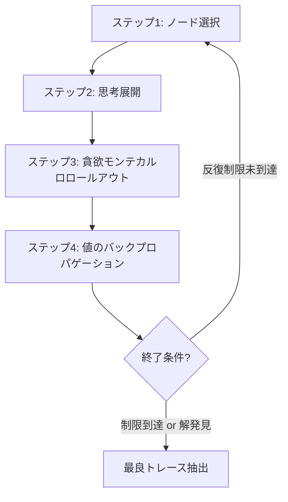
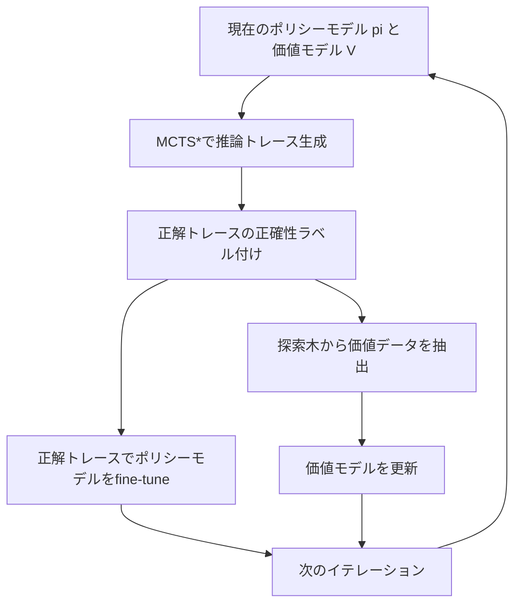

## 論文概要（Abstract）

本記事は [ReST-MCTS*](https://arxiv.org/abs/2406.03816) の解説記事です。

ReST-MCTS*は、プロセス報酬モデル（PRM）とMonte Carlo Tree Search（MCTS*）を統合し、LLMの推論トレースを自動的に生成・選別して自己学習を行うフレームワークです。従来の自己学習手法（ReST-EMなど）が最終回答の正誤のみでフィルタリングしていたのに対し、ReST-MCTS*はステップごとの推論品質を評価する「プロセス報酬」を導入しています。著者らは、手動のステップ単位アノテーションを必要とせず、正解への到達確率からプロセス報酬を推定するアルゴリズムを提案しました。MATH、GSM8K、SciBenchなど複数のベンチマークにおいて、Best-of-NやTree-of-Thoughtを上回る精度を達成したと報告されています（Zhang et al., NeurIPS 2024）。

この記事は [Zenn記事: Tree of Thoughts発展手法を比較実装する: ToT・GoT・MCTSの精度とコスト](https://zenn.dev/0h_n0/articles/7932979f3f3713) の深掘りです。

## 情報源

- **arXiv ID**: 2406.03816
- **URL**: [arXiv:2406.03816](https://arxiv.org/abs/2406.03816)
- **著者**: Dan Zhang, Sining Zhoubian, Ziniu Hu, Yisong Yue, Yuxiao Dong, Jie Tang
- **初版投稿**: 2024年6月
- **最終改訂**: 2024年11月（v3）
- **分野**: Computation and Language (cs.CL)
- **採択**: NeurIPS 2024（Poster）
- **公式実装**: [THUDM/ReST-MCTS](https://github.com/THUDM/ReST-MCTS)

## 背景と動機（Background）

### LLM自己学習の課題

LLMの推論能力を強化する自己学習手法は、モデル自身が生成した応答を学習データとして再利用するアプローチです。ReST-EM（Reinforced Self-Training with Expectation Maximization）やSelf-Rewarding LMなどの先行手法は、最終回答が正しいかどうかでフィルタリングした応答を学習データとしていました。しかし、この方式には根本的な問題があります。最終回答が正しくても途中の推論ステップが誤っている場合（偶然正解にたどり着くケース）、低品質な推論トレースが学習データに混入してしまいます。

### プロセス報酬の必要性

この問題を解決するには、推論の各ステップを個別に評価する「プロセス報酬モデル（PRM）」が必要です。しかし、PRMの学習には人間によるステップ単位のアノテーションが必要であり、PRM800Kのような大規模データセットの構築は莫大なコストを要します。ReST-MCTS*は、ツリー探索のダイナミクスを活用してこのアノテーションコストを回避し、最終回答の正誤情報のみからプロセス報酬を自動推定する手法を提案しています。

## 主要な貢献（Key Contributions）

1. **手動アノテーション不要のプロセス報酬推定**: MCTS*の探索木構造を利用し、各ステップが正解到達に寄与する確率からプロセス報酬を自動推定する品質値（Quality Value）を定式化
2. **MCTS*による高品質推論トレース生成**: 貪欲モンテカルロロールアウトとバックプロパゲーションを組み合わせた探索アルゴリズムにより、Best-of-NやTree-of-Thoughtを上回る推論トレースを生成
3. **反復自己学習パイプライン**: ポリシーモデルと価値モデルを交互に更新するイテレーティブな学習フレームワークにより、複数回の学習ラウンドで継続的に性能向上
4. **理論的保証**: 品質値の有界性（$v_k \in [0,1]$）を証明し、報酬信号の安定性を保証

## 技術的詳細（Technical Details）

### 品質値（Quality Value）の定式化

ReST-MCTS*の核心は、各推論ステップの品質を数値化する「品質値」$v_k$の設計にあります。$k$番目のステップにおける品質値は以下の再帰式で定義されます。

$$
v_k = \begin{cases} 0 & \text{if } k=0 \\ \max(v_{k-1} + ws_k, 0) & \text{otherwise} \end{cases}
$$

ここで$ws_k$は重み付き報酬（Weighted Reward）であり、以下のように計算されます。

$$
ws_k = \frac{1-v_{k-1}}{m_k+1} \cdot (1-2 \cdot rs_k)
$$

各変数の意味は以下の通りです。

- $v_k$: $k$番目のステップまでの累積品質値（$v_k \in [0,1]$）
- $ws_k$: $k$番目のステップの重み付き報酬
- $rs_k$: PRMが出力するシグモイドスコア（0に近いほど正しいステップ）
- $m_k$: 現在位置から正解に到達するまでの最小残りステップ数

この設計の背後にある直感は次の通りです。$rs_k$が低い（正しいステップ）場合、$1-2 \cdot rs_k > 0$となり品質値が上昇します。また、$\frac{1-v_{k-1}}{m_k+1}$の項は、残りの改善余地を残りステップ数で均等に配分する役割を果たします。

**定理1（有界性）**: 任意のステップ$k$において$ws_k \leq 1-v_{k-1}$が成立し、$v_k \in [0,1]$が保証されます。これにより、品質値が発散することなく安定した報酬信号として機能します。

### MCTS*アルゴリズム

MCTS*は古典的なMCTSを推論タスク向けに拡張したアルゴリズムで、以下の4段階を反復します。



**ステップ1: ノード選択（Selection）**

UCB（Upper Confidence Bound）を用いて、探索と活用のバランスを取りながら展開するノードを選択します。

**ステップ2: 思考展開（Self-Refine Thought Expansion）**

選択されたノードからLLM（ポリシーモデル$\pi$）を用いて複数の子ノード（次の推論ステップ候補）を生成します。

**ステップ3: 貪欲モンテカルロロールアウト（Greedy Monte Carlo Rollout）**

通常のMCTSではランダムシミュレーションを行いますが、ReST-MCTS*ではPRMで評価しながら貪欲に最良ステップを選択してロールアウトします。これにより、ランダム探索と比較して効率的に解空間を探索できます。

**ステップ4: 値のバックプロパゲーション（Value Backpropagation）**

ロールアウト結果（正解到達の成否）を元に、探索木のルートまで値を逆伝播して各ノードの価値推定を更新します。

### 自己学習パイプライン

ReST-MCTS*の自己学習は以下の手順をT回繰り返します。



1. 現在のポリシー$\pi$と価値モデル$V$を用いてMCTS*で推論データを生成
2. オラクル（正解ラベル）と照合し、正解に到達したトレースを抽出
3. 正解トレースでポリシーモデルをfine-tuneして$\pi'$を取得
4. 探索木の各ノードから品質値データを抽出し、価値モデル$V'$を学習
5. $\pi \leftarrow \pi'$, $V \leftarrow V'$として次のイテレーションへ

この二重更新（ポリシーと価値モデルの同時改善）により、イテレーションを重ねるごとにより高品質な探索が可能になり、それがさらに良い学習データを生むという好循環が生まれます。

### 価値モデルの初期化

価値モデルの初期学習データは以下の手順で構築されます。

1. SciInstructデータセットから11,554問を選択
2. ChatGLM2で各問題に対して不正解の推論ステップを生成（473.4kサンプル）
3. MATH-SHEPHERDのhard estimation手法を用いて、各ステップの報酬を計算

これにより、人間のステップ単位アノテーションなしにPRMの初期モデルを構築しています。

## 実装のポイント（Implementation）

### コアコンポーネントの構成

ReST-MCTS*の実装（[THUDM/ReST-MCTS](https://github.com/THUDM/ReST-MCTS)）は、`MCTS/`（探索アルゴリズム）、`PRM/`（プロセス報酬モデル）、`self_train/`（自己学習パイプライン）の3つの主要モジュールで構成されています。

### 探索の実行例

```python
from MCTS.task import MCTS_Task

question = "Calculate the sum of the first 10 prime numbers."
task = MCTS_Task(
    question,
    'llama',       # ポリシーモデル: llama / mistral / sciglm
    'local',       # 価値推定方式: local（PRMベース）
    lang='en'
)
output = task.run()  # MCTS*探索を実行し最良トレースを返す
```

### ハイパーパラメータの推奨値

著者らの実験設定に基づく推奨値は以下の通りです。

- **反復制限（iteration_limit）**: 50回（SciBench等の高難度タスク）
- **PRMの学習率**: ChatGLM3-6Bで2e-5、Mistral-7Bで3e-6
- **バッチサイズ**: 3（GPU メモリ制約を考慮）
- **学習エポック数**: 2-3エポック

### 実装上の注意点

- ロールアウト時の温度パラメータは低めに設定する（貪欲探索に近づける）
- PRMのシグモイド出力が0に近いほど「正しいステップ」である点に注意（直感と逆）
- 自己学習の各イテレーションで価値モデルのキャリブレーションが重要であり、品質値のスケールが崩れると探索効率が大幅に低下する

## Production Deployment Guide

### AWS実装パターン（コスト最適化重視）

ReST-MCTS*をプロダクション環境で運用する場合、MCTS探索（推論時）と自己学習パイプライン（学習時）で異なるインフラ構成が必要です。以下はMCTS探索による推論サービスの構成例です。

> **注**: 以下のコスト試算は2026年5月時点のAWS ap-northeast-1（東京）リージョン料金に基づく概算値です。実際のコストはトラフィックパターン、リージョン、バースト使用量により変動します。最新料金は[AWS料金計算ツール](https://calculator.aws/)で確認を推奨します。

| 構成 | 想定トラフィック | アーキテクチャ | 月額概算 |
|------|-----------------|---------------|---------|
| Small | ~100 req/日 | Lambda + Bedrock | $50-150 |
| Medium | ~1,000 req/日 | ECS Fargate + Bedrock | $300-800 |
| Large | 10,000+ req/日 | EKS + Spot GPU + セルフホスト | $2,000-5,000 |

**Small構成（~100 req/日）**:
- AWS Lambda（メモリ512MB、タイムアウト60s）でMCTS探索のオーケストレーション
- Amazon Bedrock（Claude 3.5 Sonnet）をポリシーモデルとして使用
- DynamoDB（On-Demand）で探索木の中間状態を保存
- 月額内訳: Lambda $5 + Bedrock $30-120（トークン量依存）+ DynamoDB $10-20

**Medium構成（~1,000 req/日）**:
- ECS Fargate（2 vCPU / 8GB RAM）でMCTS探索サーバーを常駐
- Bedrock Batch APIでバッチ推論（50%コスト削減）
- ElastiCache（Redis t3.small）で探索木キャッシュ
- 月額内訳: Fargate $80-120 + Bedrock $150-500 + ElastiCache $40 + その他 $30-100

**Large構成（10,000+ req/日）**:
- EKS上でvLLMによるセルフホストLLM（g5.xlarge Spot）
- Karpenterによる自動スケーリング（Spot優先でコスト90%削減）
- PRMもセルフホスト（推論専用の小型GPUインスタンス）
- 月額内訳: EKS $75 + GPU Spot $800-2,500 + ストレージ $100 + ネットワーク $200

**コスト削減テクニック**:
- Spot Instances活用でGPUコスト最大90%削減（g5.xlarge On-Demand $1.006/h → Spot ~$0.30/h）
- Reserved Instances購入（1年コミット）で最大72%削減
- Bedrock Batch API使用で50%削減（リアルタイム性不要な場合）
- Prompt Caching有効化で30-90%削減（同一プレフィックスの問題群）

### Terraformインフラコード

**Small構成（Serverless）**:

```hcl
# ReST-MCTS* Small構成: Lambda + Bedrock + DynamoDB
# terraform >= 1.10, aws provider >= 6.0

terraform {
  required_version = ">= 1.10"
  required_providers {
    aws = {
      source  = "hashicorp/aws"
      version = "~> 6.0"
    }
  }
}

provider "aws" {
  region = "ap-northeast-1"
}

# IAMロール（最小権限）
resource "aws_iam_role" "mcts_lambda" {
  name = "rest-mcts-lambda-role"
  assume_role_policy = jsonencode({
    Version = "2012-10-17"
    Statement = [{
      Action = "sts:AssumeRole"
      Effect = "Allow"
      Principal = { Service = "lambda.amazonaws.com" }
    }]
  })
}

resource "aws_iam_role_policy" "mcts_lambda_policy" {
  name = "rest-mcts-lambda-policy"
  role = aws_iam_role.mcts_lambda.id
  policy = jsonencode({
    Version = "2012-10-17"
    Statement = [
      {
        Effect   = "Allow"
        Action   = ["bedrock:InvokeModel"]
        Resource = "arn:aws:bedrock:ap-northeast-1::foundation-model/anthropic.claude-3-5-sonnet-*"
      },
      {
        Effect   = "Allow"
        Action   = ["dynamodb:PutItem", "dynamodb:GetItem", "dynamodb:Query", "dynamodb:DeleteItem"]
        Resource = aws_dynamodb_table.mcts_state.arn
      },
      {
        Effect   = "Allow"
        Action   = ["logs:CreateLogGroup", "logs:CreateLogStream", "logs:PutLogEvents"]
        Resource = "arn:aws:logs:ap-northeast-1:*:*"
      }
    ]
  })
}

# DynamoDB: 探索木の中間状態保存（On-Demandでコスト最適化）
resource "aws_dynamodb_table" "mcts_state" {
  name         = "rest-mcts-search-state"
  billing_mode = "PAY_PER_REQUEST"
  hash_key     = "search_id"
  range_key    = "node_id"

  attribute {
    name = "search_id"
    type = "S"
  }
  attribute {
    name = "node_id"
    type = "S"
  }

  ttl {
    attribute_name = "expires_at"
    enabled        = true
  }

  server_side_encryption {
    enabled = true  # KMS暗号化
  }

  tags = {
    Project = "rest-mcts"
    Env     = "production"
  }
}

# Lambda関数: MCTS探索オーケストレーター
resource "aws_lambda_function" "mcts_orchestrator" {
  function_name = "rest-mcts-orchestrator"
  runtime       = "python3.12"
  handler       = "handler.lambda_handler"
  role          = aws_iam_role.mcts_lambda.arn
  timeout       = 60
  memory_size   = 512

  filename         = "lambda_package.zip"
  source_code_hash = filebase64sha256("lambda_package.zip")

  environment {
    variables = {
      DYNAMODB_TABLE   = aws_dynamodb_table.mcts_state.name
      BEDROCK_MODEL_ID = "anthropic.claude-3-5-sonnet-20241022-v2:0"
      MAX_ITERATIONS   = "50"
    }
  }

  tracing_config {
    mode = "Active"  # X-Ray トレーシング有効化
  }

  tags = {
    Project = "rest-mcts"
  }
}

# CloudWatchアラーム: コスト異常検知
resource "aws_cloudwatch_metric_alarm" "bedrock_cost_spike" {
  alarm_name          = "rest-mcts-bedrock-token-spike"
  comparison_operator = "GreaterThanThreshold"
  evaluation_periods  = 1
  metric_name         = "InputTokenCount"
  namespace           = "AWS/Bedrock"
  period              = 3600
  statistic           = "Sum"
  threshold           = 100000
  alarm_description   = "Bedrock token usage spike detection"
  alarm_actions       = []  # SNSトピックARNを指定

  dimensions = {
    ModelId = "anthropic.claude-3-5-sonnet-20241022-v2:0"
  }
}
```

**Large構成（Container: EKS + Karpenter + Spot）**:

```hcl
# ReST-MCTS* Large構成: EKS + Karpenter + Spot GPU
# vLLMでセルフホストLLM + PRM

module "eks" {
  source  = "terraform-aws-modules/eks/aws"
  version = "~> 21.0"

  cluster_name    = "rest-mcts-cluster"
  cluster_version = "1.35"

  vpc_id     = module.vpc.vpc_id
  subnet_ids = module.vpc.private_subnets

  # コントロールプレーンのみ（マネージドノードなし、Karpenterで管理）
  cluster_endpoint_public_access = false

  tags = {
    Project = "rest-mcts"
    Env     = "production"
  }
}

# Karpenter Provisioner: Spot GPU優先
resource "kubectl_manifest" "karpenter_nodepool" {
  yaml_body = yamlencode({
    apiVersion = "karpenter.sh/v1"
    kind       = "NodePool"
    metadata   = { name = "gpu-spot" }
    spec = {
      template = {
        spec = {
          requirements = [
            { key = "karpenter.sh/capacity-type", operator = "In", values = ["spot", "on-demand"] },
            { key = "node.kubernetes.io/instance-type", operator = "In",
              values = ["g5.xlarge", "g5.2xlarge", "g6.xlarge"] },
            { key = "topology.kubernetes.io/zone", operator = "In",
              values = ["ap-northeast-1a", "ap-northeast-1c", "ap-northeast-1d"] }
          ]
          nodeClassRef = { group = "karpenter.k8s.aws", kind = "EC2NodeClass", name = "gpu" }
        }
      }
      limits   = { cpu = "128", "nvidia.com/gpu" = "8" }
      disruption = {
        consolidationPolicy = "WhenEmptyOrUnderutilized"
        consolidateAfter    = "30s"
      }
    }
  })
}

# Secrets Manager: モデル設定
resource "aws_secretsmanager_secret" "model_config" {
  name = "rest-mcts/model-config"

  tags = {
    Project = "rest-mcts"
  }
}

resource "aws_secretsmanager_secret_version" "model_config" {
  secret_id = aws_secretsmanager_secret.model_config.id
  secret_string = jsonencode({
    policy_model   = "meta-llama/Llama-3-8B-Instruct"
    value_model    = "rest-mcts-prm-v2"
    mcts_iterations = 50
  })
}

# AWS Budgets: 月額予算アラート
resource "aws_budgets_budget" "mcts_monthly" {
  name         = "rest-mcts-monthly-budget"
  budget_type  = "COST"
  limit_amount = "5000"
  limit_unit   = "USD"
  time_unit    = "MONTHLY"

  notification {
    comparison_operator       = "GREATER_THAN"
    threshold                 = 80
    threshold_type            = "PERCENTAGE"
    notification_type         = "ACTUAL"
    subscriber_email_addresses = ["alerts@example.com"]
  }
}
```

### 運用・監視設定

**CloudWatch Logs Insights クエリ**:

```
# MCTS探索のレイテンシ分析（P95, P99）
fields @timestamp, @message
| filter @message like /mcts_search_complete/
| stats percentile(duration_ms, 95) as p95,
        percentile(duration_ms, 99) as p99,
        avg(duration_ms) as avg_latency
  by bin(1h)

# Bedrockトークン使用量の時間推移
fields @timestamp, input_tokens, output_tokens
| filter @message like /bedrock_invoke/
| stats sum(input_tokens) as total_input,
        sum(output_tokens) as total_output
  by bin(1h)
| sort @timestamp desc
```

**CloudWatchアラーム設定（Python）**:

```python
import boto3
from typing import Any

cloudwatch = boto3.client("cloudwatch", region_name="ap-northeast-1")

def create_mcts_alarms() -> None:
    """ReST-MCTS*向けCloudWatchアラームを設定する"""

    # Bedrockトークン使用量スパイク検知
    cloudwatch.put_metric_alarm(
        AlarmName="rest-mcts-bedrock-token-spike",
        MetricName="InputTokenCount",
        Namespace="AWS/Bedrock",
        Statistic="Sum",
        Period=3600,
        EvaluationPeriods=1,
        Threshold=100000,
        ComparisonOperator="GreaterThanThreshold",
        AlarmActions=["arn:aws:sns:ap-northeast-1:ACCOUNT:mcts-alerts"],
        Dimensions=[{"Name": "ModelId", "Value": "anthropic.claude-3-5-sonnet-*"}],
    )

    # Lambda実行時間異常検知（タイムアウト間際）
    cloudwatch.put_metric_alarm(
        AlarmName="rest-mcts-lambda-duration-high",
        MetricName="Duration",
        Namespace="AWS/Lambda",
        Statistic="p99",
        Period=300,
        EvaluationPeriods=3,
        Threshold=55000,  # 55秒（タイムアウト60秒の92%）
        ComparisonOperator="GreaterThanThreshold",
        AlarmActions=["arn:aws:sns:ap-northeast-1:ACCOUNT:mcts-alerts"],
        Dimensions=[{"Name": "FunctionName", "Value": "rest-mcts-orchestrator"}],
    )
```

**X-Rayトレーシング設定（Python）**:

```python
from aws_xray_sdk.core import xray_recorder, patch_all
from aws_xray_sdk.core.models.segment import Segment

# boto3自動計装
patch_all()

def trace_mcts_search(question: str, iterations: int) -> dict:
    """MCTS探索をX-Rayでトレーシングする

    Args:
        question: 入力問題文
        iterations: MCTS探索の反復回数

    Returns:
        探索結果を含む辞書
    """
    segment: Segment = xray_recorder.begin_segment("mcts-search")
    segment.put_annotation("question_length", len(question))
    segment.put_annotation("max_iterations", iterations)

    subsegment = xray_recorder.begin_subsegment("tree-expansion")
    # MCTS探索のロジック
    subsegment.put_metadata("nodes_expanded", 0)
    xray_recorder.end_subsegment()

    segment.put_metadata("result", {"status": "completed"})
    xray_recorder.end_segment()
    return {"status": "completed"}
```

**Cost Explorer自動レポート（Python）**:

```python
import boto3
from datetime import datetime, timedelta

ce = boto3.client("ce", region_name="us-east-1")
sns = boto3.client("sns", region_name="ap-northeast-1")

def daily_cost_report() -> None:
    """日次コストレポートを取得しSNS通知する"""
    end = datetime.utcnow().strftime("%Y-%m-%d")
    start = (datetime.utcnow() - timedelta(days=1)).strftime("%Y-%m-%d")

    response = ce.get_cost_and_usage(
        TimePeriod={"Start": start, "End": end},
        Granularity="DAILY",
        Metrics=["UnblendedCost"],
        Filter={
            "Tags": {
                "Key": "Project",
                "Values": ["rest-mcts"],
            }
        },
        GroupBy=[{"Type": "DIMENSION", "Key": "SERVICE"}],
    )

    total = sum(
        float(g["Metrics"]["UnblendedCost"]["Amount"])
        for r in response["ResultsByTime"]
        for g in r["Groups"]
    )

    if total > 100:
        sns.publish(
            TopicArn="arn:aws:sns:ap-northeast-1:ACCOUNT:mcts-cost-alerts",
            Subject=f"[ReST-MCTS] Daily cost alert: ${total:.2f}",
            Message=f"日次コストが$100を超過: ${total:.2f}\n詳細: {response}",
        )
```

### コスト最適化チェックリスト

**アーキテクチャ選択**:
- [ ] トラフィック量に応じた構成を選択（Small: Serverless / Medium: Hybrid / Large: Container）
- [ ] MCTS探索の反復回数を問題難易度に応じて動的に調整（簡単な問題は10回、難問は50回）
- [ ] バッチ処理可能なリクエストはBedrock Batch APIにルーティング

**リソース最適化**:
- [ ] EC2/GPU: Spot Instances優先（g5.xlarge Spot ~$0.30/h、On-Demand比70%削減）
- [ ] Reserved Instances: 1年コミットで最大72%削減
- [ ] Savings Plans: Compute Savings Plans検討（ファミリー横断の割引）
- [ ] Lambda: メモリサイズをPower Tuningで最適化（512MB-1024MB推奨）
- [ ] EKS: Karpenterでアイドル時自動スケールダウン（consolidateAfter: 30s）

**LLMコスト削減**:
- [ ] Bedrock Batch API使用（リアルタイム性不要な自己学習フェーズで50%削減）
- [ ] Prompt Caching有効化（同一プレフィックスの数学問題群で30-90%削減）
- [ ] モデル選択ロジック（簡単な問題はHaiku、難問はSonnetに動的ルーティング）
- [ ] トークン数制限（MCTS各ノードの最大出力トークン数を制限）
- [ ] PRMのモデルサイズ最適化（6B-7Bクラスで十分な精度）

**監視・アラート**:
- [ ] AWS Budgets設定（月額予算の80%で通知）
- [ ] CloudWatch アラーム（Bedrockトークンスパイク、Lambdaタイムアウト）
- [ ] Cost Anomaly Detection有効化
- [ ] 日次コストレポートSNS通知

**リソース管理**:
- [ ] 未使用GPUインスタンス即時削除（Karpenter consolidation）
- [ ] タグ戦略（Project: rest-mcts でコスト追跡）
- [ ] DynamoDB TTLポリシー（探索木の中間状態を24時間で自動削除）
- [ ] 開発環境の夜間自動停止（EventBridgeスケジューラ）
- [ ] S3ライフサイクルポリシー（自己学習データの古いバージョンをGlacierに移行）

## 実験結果（Results）

### 多イテレーション自己学習

著者らはLLaMA-3-8B-Instructを用いた反復自己学習の効果を報告しています（論文Table 2）。

| モデル | 手法 | 精度 |
|--------|------|------|
| LLaMA-3-8B-Instruct | Zero-shot（0th iteration） | 24.78% |
| LLaMA-3-8B-Instruct | ReST-MCTS* 1st iteration | 27.55% |
| LLaMA-3-8B-Instruct | ReST-MCTS* 2nd iteration | 29.02% |

イテレーションごとに約2ポイントずつ精度が向上しており、ポリシーと価値モデルの同時改善が機能していることが確認されています。

### プロセス報酬モデルの効果

Mistral-7B MetaMATHを用いたベースライン比較では、MCTS*探索がSelf-Consistencyを大幅に上回る結果を示しています（論文Table 3）。

| ベンチマーク | Self-Consistency | ReST-MCTS* |
|-------------|-----------------|------------|
| GSM8K | 83.9% | 87.5% |
| MATH500 | 35.1% | 39.0% |

GSM8Kで+3.6ポイント、MATH500で+3.9ポイントの改善が得られています。

### 高難度タスク（SciBench）

SciBenchにおける各手法の比較では、ReST-MCTS*が全てのベースラインを上回っています（論文Table 4）。

| モデル | Chain-of-Thought | Tree-of-Thought | ReST-MCTS* |
|--------|-----------------|-----------------|------------|
| GPT-3.5 | 6.92% | 8.44% | 10.06% |
| GLM4 | 12.68% | 15.82% | 16.77% |

### 探索予算の効率性

論文Figure 2では、同一の探索予算（LLM呼び出し回数）の下でReST-MCTS*とSelf-Consistencyを比較しています。MATH精度でSelf-Consistencyが約42.5%に対し、ReST-MCTS*（Iter#2）は48.5%に達しており、約6ポイントの差が確認されています。この結果は、同じ計算予算でもツリー探索による構造的な探索がランダムサンプリングより効率的であることを示唆しています。

## 実運用への応用（Practical Applications）

### Zenn記事との関連

Zenn記事「[Tree of Thoughts発展手法を比較実装する](https://zenn.dev/0h_n0/articles/7932979f3f3713)」ではToT、GoT、MCTSの実装と比較を行っていますが、ReST-MCTS*はこれらの推論時探索手法をさらに一歩進め、探索結果をモデル自体の改善に活用する「自己学習」の枠組みを提供しています。

### プロダクション適用シナリオ

ReST-MCTS*の実用性が高いのは、以下のようなシナリオです。

- **数学・科学の自動解答システム**: MCTS*探索で複数の解法パスを検討し、PRMで各ステップを評価することで、単一のCoTより信頼性の高い回答を生成。教育分野での自動チューター等に適用可能
- **コード生成の品質向上**: 各行のコード生成をステップと見なし、テスト通過率をプロセス報酬として活用する拡張が考えられる
- **ドメイン特化LLMの継続的改善**: 特定ドメインの問題で自己学習パイプラインを回すことで、人手のアノテーションコストを大幅に削減しながらモデルを改善可能

### 運用上の制約

- MCTS探索は推論コストが高い（1問あたり数十回のLLM呼び出し）。リアルタイムサービスにはキャッシュ戦略やモデルの蒸留が必要
- 自己学習のイテレーション数には収穫逓減がある。著者らの実験では2イテレーションで4.24ポイント向上だが、以降の改善幅は報告されていない
- PRMの初期品質が全体のパフォーマンスに大きく影響するため、ドメインに適した初期化データの準備が重要

## 関連研究（Related Work）

- **ReST-EM**（Gulcehre et al., 2023）: Expectation-Maximizationに基づく自己学習手法。最終回答の正誤でフィルタリングするため、推論プロセスの品質は保証されない。ReST-MCTS*はプロセス報酬の導入でこの課題を解決
- **Self-Rewarding LM**（Yuan et al., 2024）: LLM自身が報酬モデルの役割も担う自己学習手法。ReST-MCTS*は専用のPRMを用い、ツリー探索によってより構造的な報酬推定を実現
- **PRM800K**（Lightman et al., 2023）: 人間がステップ単位でアノテーションした大規模PRMデータセット。ReST-MCTS*はこのようなコストの高い手動アノテーションを不要にする手法として位置づけられる
- **MATH-SHEPHERD**（Wang et al., 2024）: Hard estimationによるプロセス報酬の自動推定手法。ReST-MCTS*の価値モデル初期化にも活用されている

## まとめと今後の展望

ReST-MCTS*は、プロセス報酬モデルとMCTS*を組み合わせることで、手動アノテーション不要のLLM自己学習を実現した手法です。品質値の理論的有界性に裏付けられた安定した報酬信号と、反復的な自己学習パイプラインにより、複数のベンチマークで既存手法を上回る成果を達成したと著者らは報告しています。

今後の研究方向としては、自己学習イテレーションの長期安定性（報酬ハッキングの回避）、より大規模なモデルへの適用（70B以上）、数学以外のドメイン（コード生成、論理推論、マルチモーダル推論）への汎化可能性が挙げられます。特に、OpenAIのo1やDeepSeekのR1など推論特化モデルの登場を受けて、プロセス報酬に基づく自己学習は今後も活発に研究される領域であると考えられます。

## 参考文献

- **arXiv**: [https://arxiv.org/abs/2406.03816](https://arxiv.org/abs/2406.03816)
- **NeurIPS 2024 Proceedings**: [https://proceedings.neurips.cc/paper_files/paper/2024/hash/76ec4dc30e9faaf0e4b6093eaa377218-Abstract-Conference.html](https://proceedings.neurips.cc/paper_files/paper/2024/hash/76ec4dc30e9faaf0e4b6093eaa377218-Abstract-Conference.html)
- **Code**: [https://github.com/THUDM/ReST-MCTS](https://github.com/THUDM/ReST-MCTS)
- **Related Zenn article**: [https://zenn.dev/0h_n0/articles/7932979f3f3713](https://zenn.dev/0h_n0/articles/7932979f3f3713)
