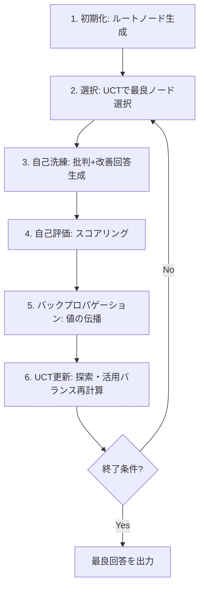

本記事は [MCTSr論文 (arXiv:2406.07394)](https://arxiv.org/abs/2406.07394) の解説記事です。

## 論文概要（Abstract）

MCT Self-Refine（MCTSr）は、Monte Carlo Tree Search（MCTS）とLLMの自己洗練（Self-Refine）を統合し、数学的推論の性能を向上させるアルゴリズムである。著者らはLLaMA-3 8BにMCTSrを適用し、GSM8Kで96.66%、MATHで58.24%の正答率を達成したと報告している。

この記事は [Zenn記事: Tree of Thoughts発展手法を比較実装する: ToT・GoT・MCTSの精度とコスト](https://zenn.dev/0h_n0/articles/7932979f3f3713) の深掘りです。

## 情報源

- **arXiv ID**: 2406.07394
- **URL**: [https://arxiv.org/abs/2406.07394](https://arxiv.org/abs/2406.07394)
- **著者**: Di Zhang, Xiaoshui Huang, Dongzhan Zhou, Yuqiang Li, Wanli Ouyang
- **発表年**: 2024年6月
- **分野**: cs.AI（Artificial Intelligence）
- **コード**: [https://github.com/trotsky1997/MathBlackBox](https://github.com/trotsky1997/MathBlackBox)

## 背景と動機（Background & Motivation）

LLMは数学的推論、特にオリンピックレベルの競技数学では正答率が低い。GPT-4はMATHデータセットで73.4%を達成しているが、8Bパラメータ規模のオープンソースモデルでの再現は困難であった。

従来のCoTやSelf-Refineは単一パスの改善に留まり、解空間の体系的探索ができない。著者らはMCTSの探索能力とLLMの自己洗練を組み合わせ、追加学習なしに推論時の計算量増加のみで性能向上を実現するMCTSrを提案している。

## 主要な貢献（Key Contributions）

- **MCTSとSelf-Refineの統合**: MCTSの探索フレームワークにLLMの自己批判・自己改善を組み込み、解の反復改善を木構造で管理
- **小規模モデルでの高性能達成**: LLaMA-3 8BでGSM8K 96.66%（GPT-4 Turboの97.1%に迫る）を達成
- **ロールアウト数と性能の相関実証**: ロールアウト数増加に伴う正答率向上を複数ベンチマークで実証
- **自己評価メカニズム**: 満点抑制や最小値・平均値の組み合わせで過度に楽観的な評価を防止

## 技術的詳細（Technical Details）

### MCTSrの6ステップアルゴリズム

MCTSrは以下の6ステップを反復実行する。



**ステップ1: 初期化** -- LLMが初期回答を生成しルートノードとする。ダミー負例を子ノードに追加し、比較対象を確保する。
**ステップ2: 選択** -- UCT式に基づき展開すべきノードを貪欲選択する。
**ステップ3: 自己洗練** -- 選択ノードの回答に対しLLMが批判的フィードバックを生成し、改善回答を生成する（批判→改善の2段階）。
**ステップ4: 自己評価** -- 改善回答をLLMが-100〜+100でスコアリングする。
**ステップ5: バックプロパゲーション** -- スコアを木の上方（親方向）に伝播する。
**ステップ6: UCT更新** -- 各ノードのUCT値を再計算し次の選択に備える。

### Q値計算式

自己評価で得られたスコアからノードのQ値（品質値）を算出する式は以下の通りである。

$$
Q(a) = \frac{1}{2}\left(\min(R_a) + \frac{1}{|R_a|}\sum R_{a_i}\right)
$$

ここで、
- $Q(a)$: ノード$a$の品質値
- $R_a$: ノード$a$に対する全評価スコアの集合
- $\min(R_a)$: 最低スコア
- $\|R_a\|$: 評価回数

最低スコアと平均スコアの平均を取ることで、一度でも低評価を受けた回答の過大評価を防ぐ設計である。

### バックプロパゲーション式

親ノードのQ値更新は、自身のQ値と子ノードの最良Q値の平均で行われる。

$$
Q'(a) = \frac{1}{2}\left(Q(a) + \max_{i \in \text{Children}(a)} Q(i)\right)
$$

ここで、
- $Q'(a)$: 更新後のノード$a$のQ値
- $\text{Children}(a)$: ノード$a$の子ノード集合

有望な探索経路の情報が木全体に伝播する仕組みである。

### UCT式

探索と活用のバランスを制御するUCT式は以下の通りである。

$$
\text{UCT}_a = Q(a) + c\sqrt{\frac{\ln(N(\text{Father}(a))+1)}{N(a)+\varepsilon}}
$$

ここで、
- $c$: 探索定数（探索と活用のバランスを制御するハイパーパラメータ）
- $N(\text{Father}(a))$: 親ノードの訪問回数
- $N(a)$: ノード$a$の訪問回数
- $\varepsilon$: ゼロ除算防止の微小定数

第1項が活用（exploitation）、第2項が探索（exploration）を担い、訪問回数が少ないノードほど探索が促進される。

### 満点抑制メカニズム

著者らは95点を超えるスコアに定数減少を適用し、早期に「完璧」と判断された回答で探索が停滞することを防いでいる。展開完了の判定は、子ノード数が制限に到達するか、子のQ値が親を超過した場合に行われる。

## 実装のポイント（Implementation）

MCTSrの実装（[MathBlackBox](https://github.com/trotsky1997/MathBlackBox)）はPythonで記述されており、VLLMまたはOpenAI互換推論サーバーを利用する。

- **推論サーバーの分離**: VLLMサーバーを独立稼働させ、MCTSrロジックはOpenAIクライアント経由でAPIコールする構成。モデル切り替え・スケーリングが容易
- **早期停止**: `run_with_earlystopping.py`で正解判明時に探索を打ち切る。実運用では別の停止基準が必要
- **並列探索**: SLURM統合により複数GPUノードで分散探索可能
- **プロンプト設計**: 批判フェーズと改善フェーズで異なるテンプレートを使用

主要なハイパーパラメータは探索定数$c$、ロールアウト数、子ノード数上限であり、計算コストと性能のトレードオフが存在する。

## Production Deployment Guide

MCTSrは1問に対し複数回のLLM呼び出しを必要とするため、コスト管理とレイテンシ制御が重要である。

### AWS実装パターン（コスト最適化重視）

1問あたり4-8ロールアウト（各ロールアウトで複数LLM呼び出し）が必要なため、バッチ処理に適したアーキテクチャが有効である。以下は2026年5月時点のAWS東京リージョン料金に基づく概算値であり、実際のコストはトラフィックパターンにより変動する。

| 構成 | トラフィック | 主要サービス | 月額概算 |
|------|-------------|-------------|---------|
| Small | ~100問/日 | Lambda + Bedrock (Claude 3 Haiku) | $80-200 |
| Medium | ~1,000問/日 | ECS Fargate + Bedrock (Claude 3.5 Sonnet) | $500-1,500 |
| Large | 10,000+問/日 | EKS + vLLM on g5.xlarge Spot | $3,000-8,000 |

**コスト削減テクニック**:
- Spot Instances活用（g5.xlarge: On-Demand $1.006/h → Spot $0.30-0.40/hで最大70%削減）
- 部分解キャッシュ（ElastiCache Redis、推定20-30%のAPIコスト削減）
- Bedrock Batch API（非同期処理で50%割引）
- Prompt Caching有効化（システムプロンプト部分30-90%削減）

### Terraformインフラコード

#### Small構成（Serverless: Lambda + Bedrock）

```hcl
# --- Small構成: MCTSr Serverless ---
# Lambda + Bedrock + DynamoDB  月額概算: $80-200 (~100問/日)

terraform {
  required_version = ">= 1.9"
  required_providers {
    aws = { source = "hashicorp/aws", version = "~> 5.80" }
  }
}

provider "aws" { region = "ap-northeast-1" }

resource "aws_dynamodb_table" "mctsr_solutions" {
  name         = "mctsr-solutions"
  billing_mode = "PAY_PER_REQUEST"
  hash_key     = "problem_id"
  range_key    = "rollout_id"
  attribute { name = "problem_id"; type = "S" }
  attribute { name = "rollout_id"; type = "N" }
  server_side_encryption { enabled = true }
  tags = { Project = "mctsr" }
}

resource "aws_iam_role" "mctsr_lambda" {
  name = "mctsr-lambda-role"
  assume_role_policy = jsonencode({
    Version = "2012-10-17"
    Statement = [{ Action = "sts:AssumeRole", Effect = "Allow",
      Principal = { Service = "lambda.amazonaws.com" } }]
  })
}

resource "aws_iam_role_policy" "mctsr_lambda" {
  name = "mctsr-lambda-policy"
  role = aws_iam_role.mctsr_lambda.id
  policy = jsonencode({
    Version = "2012-10-17"
    Statement = [
      { Effect = "Allow", Action = ["bedrock:InvokeModel"],
        Resource = "arn:aws:bedrock:ap-northeast-1::foundation-model/anthropic.claude-3-haiku-*" },
      { Effect = "Allow", Action = ["dynamodb:PutItem","dynamodb:GetItem","dynamodb:Query"],
        Resource = aws_dynamodb_table.mctsr_solutions.arn },
      { Effect = "Allow", Action = ["logs:CreateLogGroup","logs:CreateLogStream","logs:PutLogEvents"],
        Resource = "arn:aws:logs:ap-northeast-1:*:*" }
    ]
  })
}

resource "aws_lambda_function" "mctsr_solver" {
  function_name = "mctsr-solver"
  runtime       = "python3.12"
  handler       = "handler.solve"
  role          = aws_iam_role.mctsr_lambda.arn
  timeout       = 900   # 15分 (8-rollouts最大実行時間)
  memory_size   = 1024
  environment {
    variables = {
      DYNAMODB_TABLE = aws_dynamodb_table.mctsr_solutions.name
      MODEL_ID       = "anthropic.claude-3-haiku-20240307-v1:0"
      MAX_ROLLOUTS   = "8"
      UCT_CONSTANT   = "1.414"
    }
  }
  tracing_config { mode = "Active" }
  filename         = "lambda_package.zip"
  source_code_hash = filebase64sha256("lambda_package.zip")
  tags = { Project = "mctsr", CostCenter = "ml-inference" }
}
```

#### Large構成（Container: EKS + Karpenter + Spot）

```hcl
# --- Large構成: MCTSr on EKS ---
# EKS + Karpenter + Spot (vLLM)  月額概算: $3,000-8,000 (10,000+問/日)

module "eks" {
  source  = "terraform-aws-modules/eks/aws"
  version = "~> 20.31"
  cluster_name    = "mctsr-cluster"
  cluster_version = "1.31"
  vpc_id     = module.vpc.vpc_id
  subnet_ids = module.vpc.private_subnets
  cluster_endpoint_public_access = false
  eks_managed_node_groups = {
    system = {
      instance_types = ["c6i.xlarge"]
      capacity_type  = "ON_DEMAND"
      min_size = 1; max_size = 3; desired_size = 2
    }
  }
  tags = { Project = "mctsr" }
}

# Karpenter: GPU Spot自動プロビジョニング
resource "kubectl_manifest" "karpenter_nodepool" {
  yaml_body = yamlencode({
    apiVersion = "karpenter.sh/v1"
    kind       = "NodePool"
    metadata   = { name = "gpu-spot" }
    spec = {
      template = { spec = {
        requirements = [
          { key = "karpenter.sh/capacity-type", operator = "In", values = ["spot"] },
          { key = "node.kubernetes.io/instance-type", operator = "In",
            values = ["g5.xlarge", "g5.2xlarge", "g6.xlarge"] }
        ]
        nodeClassRef = { group = "karpenter.k8s.aws", kind = "EC2NodeClass", name = "gpu" }
      }}
      limits     = { cpu = "64", "nvidia.com/gpu" = "8" }
      disruption = { consolidationPolicy = "WhenEmptyOrUnderutilized", consolidateAfter = "60s" }
    }
  })
}

resource "aws_budgets_budget" "mctsr_monthly" {
  name = "mctsr-monthly-budget"
  budget_type = "COST"; limit_amount = "8000"; limit_unit = "USD"; time_unit = "MONTHLY"
  notification {
    comparison_operator = "GREATER_THAN"; threshold = 80; threshold_type = "PERCENTAGE"
    notification_type = "ACTUAL"; subscriber_email_addresses = ["ops-team@example.com"]
  }
}
```

### 運用・監視設定

#### CloudWatch Logs Insights クエリ

```
# トークン使用量分析
fields @timestamp, problem_id, input_tokens, output_tokens
| stats sum(input_tokens + output_tokens) as total_tokens by bin(1h)

# レイテンシ分析（P95, P99）
fields @timestamp, duration_ms
| stats percentile(duration_ms, 95) as p95, percentile(duration_ms, 99) as p99 by bin(1h)
```

#### CloudWatch アラーム設定（Python）

```python
import boto3

cloudwatch = boto3.client("cloudwatch", region_name="ap-northeast-1")

def create_token_usage_alarm(sns_topic_arn: str) -> dict:
    """Bedrockトークン使用量スパイク検知アラームを作成する。"""
    return cloudwatch.put_metric_alarm(
        AlarmName="mctsr-token-usage-spike",
        MetricName="InputTokenCount", Namespace="AWS/Bedrock",
        Statistic="Sum", Period=3600, EvaluationPeriods=1,
        Threshold=500000,  # 1時間あたり50万トークン超過
        ComparisonOperator="GreaterThanThreshold",
        AlarmActions=[sns_topic_arn],
        Dimensions=[{"Name": "ModelId", "Value": "anthropic.claude-3-haiku-20240307-v1:0"}],
    )
```

#### X-Ray トレーシング設定（Python）

```python
from aws_xray_sdk.core import xray_recorder, patch_all
patch_all()  # boto3自動計装

@xray_recorder.capture("mctsr_solve")
def solve_with_mctsr(problem: str, max_rollouts: int = 8) -> dict:
    """MCTSrによる問題解決をX-Rayでトレースする。"""
    subsegment = xray_recorder.current_subsegment()
    subsegment.put_annotation("max_rollouts", max_rollouts)
    result = run_mctsr(problem, max_rollouts)
    subsegment.put_annotation("best_score", result["best_q_value"])
    return result
```

#### Cost Explorer 自動レポート（Python）

```python
import boto3
from datetime import datetime, timedelta

ce = boto3.client("ce", region_name="ap-northeast-1")
sns_client = boto3.client("sns", region_name="ap-northeast-1")

def daily_cost_report(sns_topic_arn: str) -> None:
    """日次コストレポートを取得し、$100/日超過時にSNS通知する。"""
    end = datetime.utcnow().strftime("%Y-%m-%d")
    start = (datetime.utcnow() - timedelta(days=1)).strftime("%Y-%m-%d")
    response = ce.get_cost_and_usage(
        TimePeriod={"Start": start, "End": end}, Granularity="DAILY",
        Metrics=["UnblendedCost"],
        Filter={"Tags": {"Key": "Project", "Values": ["mctsr"]}},
        GroupBy=[{"Type": "DIMENSION", "Key": "SERVICE"}],
    )
    total = sum(
        float(g["Metrics"]["UnblendedCost"]["Amount"])
        for r in response["ResultsByTime"] for g in r["Groups"]
    )
    if total > 100:
        sns_client.publish(
            TopicArn=sns_topic_arn,
            Subject=f"MCTSr Daily Cost Alert: ${total:.2f}",
            Message=f"MCTSr daily cost exceeded $100: ${total:.2f}",
        )
```

### コスト最適化チェックリスト

**アーキテクチャ**: トラフィック量で構成選択（Serverless/Hybrid/Container） / バッチ優先 / 単一リージョン集約

**リソース最適化**: GPU Spot優先（g5.xlarge: $0.30-0.40/h vs On-Demand $1.006/h） / Reserved 1年コミット（最大40%削減） / Savings Plans（最大66%削減） / Lambda Power Tuning / Karpenterスケールダウン（consolidateAfter: 60s）

**LLMコスト削減**: Bedrock Batch API（50%割引） / Prompt Caching（30-90%削減） / モデル選択ロジック（簡単:Haiku、難問:Sonnet） / トークン数上限設定 / 部分解キャッシュ（Redis/DynamoDB）

**監視**: AWS Budgets（80%通知） / CloudWatchアラーム / Cost Anomaly Detection / 日次コストレポート（Cost Explorer + SNS） / Bedrock使用量ダッシュボード

**リソース管理**: 未使用EBS/スナップショット削除 / タグ戦略（Project/Environment/CostCenter） / S3ライフサイクル（90日→Glacier） / 開発環境夜間停止 / VPCエンドポイント活用

## 実験結果（Results）

### GSMベンチマーク

論文Table 1より、GSM8KおよびGSM-Hardにおける結果を以下に示す。

| データセット | Zero-Shot CoT | Self-Refine | 4-rollouts | 8-rollouts |
|-------------|--------------|-------------|-----------|-----------|
| GSM8K | 74.07% | 86.96% | 93.03% | 96.66% |
| GSM-Hard | 25.47% | 33.36% | 39.88% | 45.49% |

GSM8Kでは22.59ポイントの向上を達成する一方、GSM-Hardでは45.49%に留まり、問題の複雑さに伴う性能天井が報告されている。

### MATHデータセット

論文Table 2より、難易度レベル別の結果を示す。Level-1で90.16%を達成する一方、Level-5（最高難度）では34.06%に留まる。全体正答率は58.24%（2912/5000）である。高難度問題ではロールアウト数増加の効果が限定的であることが示唆されている。

### オリンピアドベンチマーク

論文Table 3より、数学オリンピックレベルのベンチマーク結果を示す。

| データセット | Zero-Shot CoT | Self-Refine | 4-rollouts | 8-rollouts |
|-------------|--------------|-------------|-----------|-----------|
| AIME | 2.36% | 4.39% | 7.50% | 11.79% |
| Math Odyssey | 17.22% | 30.33% | 40.10% | 49.36% |
| OlympiadBench | 1.25% | 3.06% | 5.25% | 7.76% |

高難度ベンチマークでは絶対値は低いが、Zero-Shot CoTからの相対改善率は大きい（AIMEで約5倍、OlympiadBenchで約6.2倍）。

### Closed-Sourceモデルとの比較（Table 4）

| モデル | MATH | Math Odyssey | GSM8K |
|--------|------|-------------|-------|
| GPT-4 Turbo | 73.4% | 49.1% | 97.1% |
| Claude 3 Opus | 60.1% | 40.0% | 95.0% |
| LLaMA-3 8B + MCTSr (8-rollouts) | 58.24% | 49.36% | 96.66% |

GSM8KでGPT-4 Turboの97.1%に迫る96.66%、Math OdysseyではGPT-4 Turboを上回る49.36%を記録。MATHではGPT-4 Turboに15ポイント以上の差がある。

## 実運用への応用（Practical Applications）

MCTSrの実運用への応用として、以下のユースケースが考えられる。

**教育支援**: MCTSの探索木が解法の思考過程を表現するため、複数ロールアウトの異なる解法パスを比較表示する教育ツールへの応用が見込まれる。

**推論時スケーリング**: 「推論時の計算量を増やすことで、モデルサイズを増やさずに性能を向上できる」というパラダイムはOpenAI o1やDeepSeek-R1と同方向であり、コスト制約環境で小規模モデルを活用する戦略として有用である。ただし、1問あたり数十回のLLM呼び出しが発生するため、バッチ処理での利用が現実的である。

## 関連研究（Related Work）

- **Tree of Thoughts (ToT)** (Yao et al., 2023): LLM推論を木構造で管理。MCTSrはToTをMCTSで体系化しUCTによる探索・活用バランスを導入した発展形
- **Self-Refine** (Madaan et al., 2023): LLM自身が出力を批判・改善する手法。MCTSrはこれを木のノード展開に組み込み、多パス探索へ拡張
- **AlphaGo/AlphaZero** (Silver et al., 2016-2017): MCTSとNN統合。MCTSrはAlphaGoの価値ネットワークの代わりにLLM自己評価を用い、外部報酬モデル訓練を不要にした
- **ReST-MCTS*** (Dan Zhang et al., 2024): MCTSとPRM統合の自己学習フレームワーク。MCTSrが推論時のみの手法であるのに対し、学習ループにMCTSを組み込む相補的手法

## まとめと今後の展望

MCTSrは、MCTSの体系的探索とLLMの自己洗練を統合し、LLaMA-3 8BでGSM8K 96.66%、Math Odyssey 49.36%（GPT-4 Turbo超え）を達成した。小規模モデルの推論時スケーリングの有効性を示す重要な成果である。

一方、MATH Level-5やAIMEではロールアウト数増加の効果が限定的であり、探索だけでは解決できない問題の存在も明らかになった。著者らはプロセス報酬モデル（PRM）との統合や、MCTSr生成データによるファインチューニングを今後の方向性として示唆している。

## 参考文献

- **arXiv**: [https://arxiv.org/abs/2406.07394](https://arxiv.org/abs/2406.07394)
- **Code**: [https://github.com/trotsky1997/MathBlackBox](https://github.com/trotsky1997/MathBlackBox)
- **Related Zenn article**: [https://zenn.dev/0h_n0/articles/7932979f3f3713](https://zenn.dev/0h_n0/articles/7932979f3f3713)
- Yao, S., et al. (2023). "Tree of Thoughts: Deliberate Problem Solving with Large Language Models." arXiv:2305.10601
- Madaan, A., et al. (2023). "Self-Refine: Iterative Refinement with Self-Feedback." arXiv:2303.17651
- Silver, D., et al. (2017). "Mastering the game of Go without human knowledge." Nature, 550(7676)
- Dan Zhang, et al. (2024). "ReST-MCTS*: LLM Self-Training via Process Reward Guided Tree Search." arXiv:2405.00451
