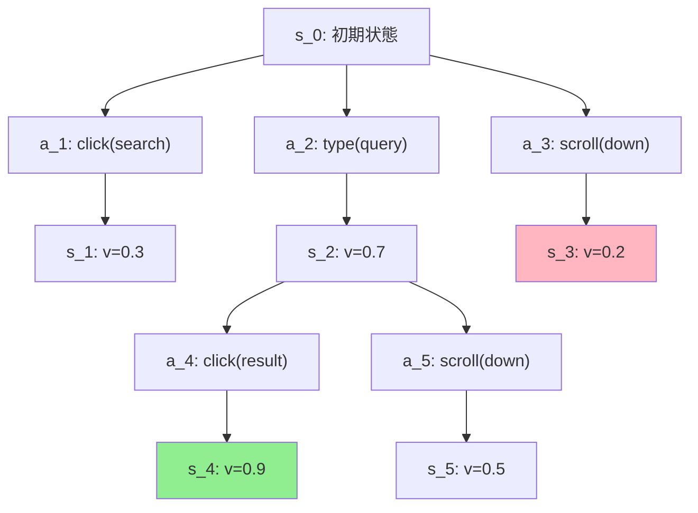

## 論文概要（Abstract）

本記事は [Tree Search for Language Model Agents](https://arxiv.org/abs/2407.01476)（ICLR 2025採択）の解説記事です。

言語モデル（LM）を用いた自律エージェントは、Web自動操作などの意思決定タスクで有望な成果を示している。しかし、LMは自然言語の理解・生成に最適化されており、多段階の推論・計画・環境フィードバックの活用に課題を抱えている。著者らは、インタラクティブなWeb環境においてLMエージェントが明示的に探索と多段階計画を行うための推論時探索アルゴリズムを提案した。このアルゴリズムはbest-first tree searchの形式をとり、実環境の状態空間上で動作する。VisualWebArenaベンチマークにおいて、GPT-4oエージェントに本手法を適用することで成功率を18.9%から26.4%へ39.7%相対改善し、当時のSOTAを達成した。

この記事は [Zenn記事: Tree of Thoughts発展手法を比較実装する: ToT・GoT・MCTSの精度とコスト](https://zenn.dev/0h_n0/articles/7932979f3f3713) の深掘りです。Zenn記事ではTree of Thoughts（ToT）やGraph of Thoughts（GoT）、MCTSなどの推論時探索手法を比較していますが、本記事ではそれらの手法を実際のWebエージェントタスクに適用した研究を詳しく解説します。

## 情報源

- **arXiv ID**: 2407.01476
- **URL**: [https://arxiv.org/abs/2407.01476](https://arxiv.org/abs/2407.01476)
- **著者**: Jing Yu Koh, Stephen McAleer, Daniel Fried, Ruslan Salakhutdinov（Carnegie Mellon University）
- **発表**: ICLR 2025（初版: 2024年7月、最新版v4: 2026年2月）
- **分野**: cs.AI, cs.CL, cs.LG
- **コード**: [https://github.com/kohjingyu/search-agents](https://github.com/kohjingyu/search-agents)

## 背景と動機（Background & Motivation）

LLMベースのWebエージェントは、ブラウザ操作を通じてタスクを自律的に遂行する技術として注目されている。しかし、ReActのような逐次的アプローチでは、エージェントが一度誤ったアクションを選択すると回復が困難であるという根本的な課題がある。実際のWeb操作では、間違ったリンクをクリックした後に正しいページに戻ることや、入力ミスを修正することが頻繁に必要となる。

著者らはこの課題に対し、チェスや囲碁のAIで成功を収めた木探索（tree search）のアイデアをWebエージェントに適用することを提案した。ただし、ゲームAIとは異なり、Webタスクでは状態空間が膨大かつ連続的であり、シミュレータによる高速なロールアウトが困難である。そこで、LM自身を価値関数として活用し、実環境上で効率的にbest-first探索を行うフレームワークを設計した。この手法は既存のエージェントアーキテクチャに対して補完的に適用可能であり、エージェントの再学習を必要としない点が実用上の利点となっている。

## 主要な貢献（Key Contributions）

- **実環境上で動作するbest-first tree search**: ゲームシミュレータではなく、実際のWebブラウザ環境上で木探索を行う初の手法を提案。状態の保存・復元をアクション列のリプレイで実現した
- **LMベースの価値関数**: GPT-4oをプロンプティングで価値関数として利用し、自己一貫性（self-consistency, 20パス平均）でノイズを低減。追加学習なしで探索を誘導する
- **テスト時計算量に対する性能スケーリング**: 探索予算を増やすほど性能が向上することを実証。c=5で30.6%、c=20で51.0%の相対改善を200タスクサブセットで確認した（論文Figure 2より）
- **既存エージェントへの汎用的適用**: GPT-4oだけでなくLlama-3-70Bにも適用し、VisualWebArenaで119.7%の相対改善を達成。特定のモデルに依存しない汎用性を示した

## 技術的詳細（Technical Details）

### 問題設定

Webエージェントのタスクは、部分観測マルコフ決定過程（POMDP）として定式化される。状態空間 $\mathcal{S}$、行動空間 $\mathcal{A}$（12種類）、決定的遷移関数 $T: \mathcal{S} \times \mathcal{A} \rightarrow \mathcal{S}$、二値報酬 $R(s, a) \in \{0, 1\}$ から構成される。エージェントは各時刻 $t$ で観測 $o_t$（レンダリングされたWebページ）を受け取り、タスク指示 $I$ に基づいてアクション $a_t$ を選択する。

行動空間は以下の12種類で構成される: click, hover, type, press key, new\_tab, tab\_focus, tab\_close, goto, go\_back, go\_forward, scroll, stop。

### Best-First Tree Search アルゴリズム

著者らの手法はA\*探索に着想を得たbest-first tree searchである。探索は3つのハイパーパラメータで制御される: 最大深さ $d$、分岐数 $b$、探索予算 $c$（最大ノード展開数）。



### 価値関数

探索を誘導する価値関数は以下のように定義される:

$$
v_t = f_v(I, \{o_1, \ldots, o_t\}) \in [0, 1]
$$

ここで、
- $I$: タスク指示（自然言語テキスト）
- $o_1, \ldots, o_t$: 時刻1から $t$ までの観測列（スクリーンショット、URL、前のアクション）
- $v_t$: 現在の軌跡がタスクを成功裏に完了する期待報酬の推定値

価値関数はマルチモーダルLM（GPT-4o）をプロンプティングして実装される。モデルは観測列を受け取り、現在の状態を4つのカテゴリに分類する:

| 分類 | 値 | 意味 |
|------|-----|------|
| success | 1.0 | タスク完了済み |
| trajectory towards success | 0.5 | 正しい方向に進行中 |
| failure | 0.0 | タスク失敗 |
| invalid | 0.0 | 無効な状態 |

推定精度を向上させるため、**自己一貫性（self-consistency）**を採用している。具体的には、温度1.0、top-p 1.0のサンプリングで $n=20$ パスのChain-of-Thought推論を生成し、それらの平均値を最終スコアとする。これにより、単一パスの推論よりもノイズに頑健な価値推定が得られる。

### 探索手順（アルゴリズム）

以下に探索の擬似コードを示す:

```python
from dataclasses import dataclass
from heapq import heappush, heappop
from typing import Any


@dataclass
class SearchNode:
    """探索木のノード

    Attributes:
        state: 環境状態
        value: 価値関数による評価値
        depth: 探索木における深さ
        actions: ルートからこのノードに至るアクション列
    """
    state: Any
    value: float
    depth: int
    actions: list[str]

    def __lt__(self, other: "SearchNode") -> bool:
        return self.value > other.value  # 最大ヒープ


def best_first_search(
    env: Any,
    agent: Any,
    value_fn: Any,
    instruction: str,
    max_depth: int = 5,
    branch_factor: int = 5,
    budget: int = 20,
    threshold: float = 0.9,
) -> SearchNode:
    """Best-first tree search for web agents

    Args:
        env: Web環境インスタンス
        agent: LMエージェント（アクション生成用）
        value_fn: 価値関数（状態評価用）
        instruction: タスク指示テキスト
        max_depth: 最大探索深さ d
        branch_factor: 分岐数 b
        budget: 最大ノード展開数 c
        threshold: 成功判定閾値 theta

    Returns:
        最良の探索ノード
    """
    initial_state = env.get_state()
    frontier: list[SearchNode] = []
    root = SearchNode(
        state=initial_state, value=0.0, depth=0, actions=[]
    )
    heappush(frontier, root)

    best_node = root
    best_value = 0.0
    expanded = 0

    while frontier and expanded < budget:
        node = heappop(frontier)

        # 価値関数で現在の状態を評価
        v = value_fn.evaluate(instruction, node.state)
        expanded += 1

        # ベストノードを更新
        if v > best_value:
            best_value = v
            best_node = node

        # 終了条件: 閾値超過 or 予算超過
        if v >= threshold:
            return best_node

        # 深さ制限内なら子ノードを展開
        if node.depth < max_depth:
            # 環境をこのノードの状態に復元
            env.restore_state(node.actions)

            # b個の候補アクションを生成
            candidate_actions = agent.generate_actions(
                instruction, node.state, n=branch_factor
            )

            for action in candidate_actions:
                # アクションを実行し新しい状態を取得
                new_state = env.step(action)
                child = SearchNode(
                    state=new_state,
                    value=0.0,  # 展開時に評価
                    depth=node.depth + 1,
                    actions=node.actions + [action],
                )
                heappush(frontier, child)

                # 環境を親状態に復元
                env.restore_state(node.actions)

    return best_node
```

### 状態の保存と復元

Web環境の状態復元は技術的に重要なポイントである。著者らは単純な `go_back` アクションではなく、初期状態 $s_0$ からアクション列をリプレイする方式を採用した。これは `go_back` がスクロール位置や入力済みテキストなどの情報を失う可能性があるためである。決定的遷移関数 $T$ の性質を利用し、同じアクション列を再実行すれば同一の状態に到達することが保証される。

## 実装のポイント（Implementation）

著者らの実装（[GitHub](https://github.com/kohjingyu/search-agents)）はPython 3.10/3.11で動作し、Playwrightによるブラウザ自動操作を基盤としている。主要な実装上の考慮点は以下の通りである。

**価値関数のコスト効率**: 著者らは、価値関数の呼び出しコストがアクション予測の約2倍安価であると報告している（論文Section 4.3）。これは、価値関数が短い分類応答（success/failure等）のみを生成するのに対し、アクション予測はChain-of-Thought推論と具体的なアクション文字列を生成する必要があるためである。

**GPT-4o + Set-of-Marks**: VisualWebArenaでは、GPT-4o（gpt-4o-2024-05-13）にSet-of-Marks（SoM）プロンプティングを組み合わせている。SoMはスクリーンショット上のインタラクティブ要素に番号付きマークを重畳することで、マルチモーダルLMが要素を正確に指定できるようにする手法である。

**Llama-3-70B + caption**: オープンソースモデルではLlama-3-70B-Instructを使用し、スクリーンショットの代わりにアクセシビリティツリーのテキストキャプションを入力として用いる。価値関数にはLLaVA-v1.6-34Bを使用するが、GPT-4oベースの価値関数と比較して精度は低い（Table 4: 30.0% vs 37.0%）。

**計算コスト**: 探索予算 $c=20$ の場合、最悪ケースでベースラインの20倍のLM呼び出しが必要となる。ただし、早期終了（閾値 $\theta$ 超過）により、実際の呼び出し回数は予算上限より少なくなることが多い。

## Production Deployment Guide

本論文の手法をプロダクション環境でWebエージェントとして運用する場合のAWSデプロイメントガイドを示す。Web環境の状態管理と木探索の計算が主要な設計課題となる。

### AWS実装パターン（コスト最適化重視）

著者らの手法は探索予算に応じてLM呼び出し回数が増大するため、トラフィック量とコストのバランスが重要となる。以下に2026年5月時点のap-northeast-1（東京）リージョンの概算コストを示す。実際のコストはトラフィックパターン、バースト使用量、モデル選択により変動するため、最新料金は[AWS料金計算ツール](https://calculator.aws/)で確認を推奨する。

| 構成 | トラフィック | 主要サービス | 月額概算 |
|------|-------------|-------------|---------|
| Small | ~100 req/日 | Lambda + Bedrock + DynamoDB | $150-400 |
| Medium | ~1,000 req/日 | ECS Fargate + Bedrock + ElastiCache | $800-2,000 |
| Large | 10,000+ req/日 | EKS + Spot + Bedrock Batch | $5,000-15,000 |

**Small構成（~100 req/日）**: Lambda関数でリクエストを受け付け、Bedrock（Claude 3.5 Sonnet）で価値関数とアクション予測を実行する。状態管理にDynamoDBを使用し、探索木のノード情報を永続化する。Lambda実行時間上限（15分）内に探索を完了させるため、探索予算は $c \leq 10$ に制限する。Playwright browserはLambda Layerとして含めるか、ECS Fargateの補助タスクとして分離する。

**Medium構成（~1,000 req/日）**: ECS Fargateでエージェントコンテナを常時稼働させ、ElastiCacheで探索状態をキャッシュする。ブラウザインスタンスのプール管理により状態復元のレイテンシを削減する。Bedrock Prompt Cachingを有効化し、同一タスク内の繰り返しプロンプトでコスト30-90%削減を図る。

**Large構成（10,000+ req/日）**: EKSクラスタでKarpenterによるSpot Instances自動スケーリングを行う。ブラウザプールをDaemonSetで各ノードに配置し、状態復元の高速化を実現する。Bedrock Batch APIで非同期価値関数評価を行い、コスト50%削減。複数タスクの探索を並列実行し、スループットを最大化する。

**コスト削減テクニック**:
- Spot Instances活用: EKSワーカーノードで最大90%削減（c5.2xlargeの場合: On-Demand $0.34/h → Spot $0.034-0.10/h）
- Reserved Instances: 1年コミットで最大72%削減（常時稼働のコントロールプレーン用）
- Bedrock Batch API: 非同期推論で50%削減（リアルタイム性が不要な価値関数評価に適用）
- Prompt Caching: 同一タスク内の観測履歴キャッシュで30-90%削減

### Terraformインフラコード

#### Small構成（Serverless）

```hcl
# --- Small構成: Lambda + Bedrock + DynamoDB ---
# 探索予算c<=10、~100 req/日向け

terraform {
  required_version = ">= 1.9"
  required_providers {
    aws = {
      source  = "hashicorp/aws"
      version = "~> 5.80"
    }
  }
}

provider "aws" {
  region = "ap-northeast-1"
}

# IAMロール（最小権限）
resource "aws_iam_role" "search_agent_lambda" {
  name = "search-agent-lambda-role"
  assume_role_policy = jsonencode({
    Version = "2012-10-17"
    Statement = [{
      Action = "sts:AssumeRole"
      Effect = "Allow"
      Principal = { Service = "lambda.amazonaws.com" }
    }]
  })
}

resource "aws_iam_role_policy" "lambda_bedrock" {
  name = "bedrock-invoke"
  role = aws_iam_role.search_agent_lambda.id
  policy = jsonencode({
    Version = "2012-10-17"
    Statement = [
      {
        Effect   = "Allow"
        Action   = ["bedrock:InvokeModel", "bedrock:InvokeModelWithResponseStream"]
        Resource = "arn:aws:bedrock:ap-northeast-1::foundation-model/anthropic.claude-3-5-sonnet-*"
      },
      {
        Effect   = "Allow"
        Action   = ["dynamodb:PutItem", "dynamodb:GetItem", "dynamodb:Query", "dynamodb:DeleteItem"]
        Resource = aws_dynamodb_table.search_state.arn
      },
      {
        Effect   = "Allow"
        Action   = ["logs:CreateLogGroup", "logs:CreateLogStream", "logs:PutLogEvents"]
        Resource = "arn:aws:logs:ap-northeast-1:*:*"
      }
    ]
  })
}

# DynamoDB: 探索状態管理（On-Demand、コスト最適化）
resource "aws_dynamodb_table" "search_state" {
  name         = "search-agent-state"
  billing_mode = "PAY_PER_REQUEST" # On-Demand: 低トラフィック時にコスト最適
  hash_key     = "task_id"
  range_key    = "node_id"

  attribute {
    name = "task_id"
    type = "S"
  }
  attribute {
    name = "node_id"
    type = "S"
  }

  ttl {
    attribute_name = "expires_at"
    enabled        = true
  }

  server_side_encryption {
    enabled = true # KMS暗号化
  }

  tags = {
    Project = "search-agent"
    Cost    = "pay-per-request"
  }
}

# Lambda関数
resource "aws_lambda_function" "search_agent" {
  function_name = "search-agent"
  runtime       = "python3.11"
  handler       = "main.handler"
  role          = aws_iam_role.search_agent_lambda.arn
  timeout       = 900  # 15分（探索の最大実行時間）
  memory_size   = 1024 # 価値関数評価に十分なメモリ

  environment {
    variables = {
      SEARCH_BUDGET    = "10"
      MAX_DEPTH        = "5"
      BRANCH_FACTOR    = "5"
      VALUE_THRESHOLD  = "0.9"
      STATE_TABLE_NAME = aws_dynamodb_table.search_state.name
    }
  }

  tracing_config {
    mode = "Active" # X-Ray有効化
  }

  tags = {
    Project = "search-agent"
  }
}

# CloudWatchアラーム: コスト監視
resource "aws_cloudwatch_metric_alarm" "lambda_duration" {
  alarm_name          = "search-agent-high-duration"
  comparison_operator = "GreaterThanThreshold"
  evaluation_periods  = 3
  metric_name         = "Duration"
  namespace           = "AWS/Lambda"
  period              = 300
  statistic           = "Average"
  threshold           = 600000 # 10分超過でアラート
  alarm_description   = "Search agent Lambda execution time exceeds 10 minutes"

  dimensions = {
    FunctionName = aws_lambda_function.search_agent.function_name
  }
}
```

#### Large構成（Container）

```hcl
# --- Large構成: EKS + Karpenter + Spot Instances ---
# 探索予算c=20、10,000+ req/日向け

module "eks" {
  source  = "terraform-aws-modules/eks/aws"
  version = "~> 20.31"

  cluster_name    = "search-agent-cluster"
  cluster_version = "1.31"

  vpc_id     = module.vpc.vpc_id
  subnet_ids = module.vpc.private_subnets

  # コントロールプレーンのパブリックアクセス最小化
  cluster_endpoint_public_access = true
  cluster_endpoint_public_access_cidrs = ["YOUR_CIDR/32"]

  eks_managed_node_groups = {
    # システムコンポーネント用（Reserved推奨）
    system = {
      instance_types = ["m7i.large"]
      min_size       = 1
      max_size       = 2
      desired_size   = 1
    }
  }

  tags = {
    Project     = "search-agent"
    Environment = "production"
  }
}

# Karpenter: Spot優先の自動スケーリング
resource "kubectl_manifest" "karpenter_nodepool" {
  yaml_body = yamlencode({
    apiVersion = "karpenter.sh/v1"
    kind       = "NodePool"
    metadata   = { name = "search-workers" }
    spec = {
      template = {
        spec = {
          requirements = [
            { key = "karpenter.sh/capacity-type", operator = "In", values = ["spot", "on-demand"] },
            { key = "node.kubernetes.io/instance-type", operator = "In",
              values = ["c5.2xlarge", "c5a.2xlarge", "c6i.2xlarge", "m5.2xlarge"] },
          ]
          nodeClassRef = { name = "default" }
        }
      }
      limits   = { cpu = "100", memory = "400Gi" }
      disruption = {
        consolidationPolicy = "WhenEmptyOrUnderutilized"
        consolidateAfter    = "30s"
      }
    }
  })
}

# Secrets Manager: Bedrock API設定
resource "aws_secretsmanager_secret" "bedrock_config" {
  name                    = "search-agent/bedrock-config"
  recovery_window_in_days = 7
}

# AWS Budgets: 月次予算アラート
resource "aws_budgets_budget" "search_agent" {
  name         = "search-agent-monthly"
  budget_type  = "COST"
  limit_amount = "15000"
  limit_unit   = "USD"
  time_unit    = "MONTHLY"

  notification {
    comparison_operator       = "GREATER_THAN"
    threshold                 = 80
    threshold_type            = "PERCENTAGE"
    notification_type         = "ACTUAL"
    subscriber_email_addresses = ["ops-team@example.com"]
  }

  notification {
    comparison_operator       = "GREATER_THAN"
    threshold                 = 100
    threshold_type            = "PERCENTAGE"
    notification_type         = "FORECASTED"
    subscriber_email_addresses = ["ops-team@example.com"]
  }
}
```

### 運用・監視設定

**CloudWatch Logs Insights クエリ**: 探索エージェントのコスト異常検知とレイテンシ分析に使用する。

```
# 1時間あたりのBedrock推論トークン使用量（コスト異常検知）
fields @timestamp, @message
| filter @message like /bedrock_invoke/
| stats sum(input_tokens) as total_input, sum(output_tokens) as total_output by bin(1h)
| sort @timestamp desc

# 探索レイテンシ分析（P95, P99）
fields @timestamp, search_duration_ms, nodes_expanded, task_id
| filter @message like /search_complete/
| stats percentile(search_duration_ms, 95) as p95,
        percentile(search_duration_ms, 99) as p99,
        avg(nodes_expanded) as avg_nodes by bin(1h)
```

**CloudWatch アラーム設定（Python）**:

```python
import boto3


def create_search_agent_alarms(sns_topic_arn: str) -> None:
    """探索エージェント用CloudWatchアラームを作成

    Args:
        sns_topic_arn: 通知先SNSトピックのARN
    """
    cw = boto3.client("cloudwatch", region_name="ap-northeast-1")

    # Bedrockトークン使用量スパイク検知
    cw.put_metric_alarm(
        AlarmName="search-agent-bedrock-token-spike",
        MetricName="InputTokenCount",
        Namespace="AWS/Bedrock",
        Statistic="Sum",
        Period=3600,
        EvaluationPeriods=1,
        Threshold=500000,  # 1時間50万トークン超過
        ComparisonOperator="GreaterThanThreshold",
        AlarmActions=[sns_topic_arn],
    )

    # 探索タイムアウト検知
    cw.put_metric_alarm(
        AlarmName="search-agent-timeout",
        MetricName="Duration",
        Namespace="AWS/Lambda",
        Statistic="p99",
        Period=300,
        EvaluationPeriods=2,
        Threshold=840000,  # 14分（15分上限の93%）
        ComparisonOperator="GreaterThanThreshold",
        AlarmActions=[sns_topic_arn],
    )
```

**X-Ray トレーシング設定（Python）**:

```python
from aws_xray_sdk.core import xray_recorder, patch_all

# boto3自動計装
patch_all()


@xray_recorder.capture("tree_search")
def run_search(task_id: str, instruction: str) -> dict:
    """X-Rayトレース付き探索実行

    Args:
        task_id: タスク識別子
        instruction: タスク指示テキスト

    Returns:
        探索結果の辞書
    """
    subsegment = xray_recorder.current_subsegment()
    subsegment.put_annotation("task_id", task_id)
    subsegment.put_metadata("instruction", instruction)
    subsegment.put_metadata("search_config", {
        "budget": 20, "max_depth": 5, "branch_factor": 5
    })

    # 探索実行（実装省略）
    result = {"best_value": 0.0, "nodes_expanded": 0}

    subsegment.put_metadata("result", result)
    return result
```

**Cost Explorer 日次レポート（Python）**:

```python
import boto3
from datetime import datetime, timedelta


def daily_cost_report(sns_topic_arn: str) -> dict:
    """日次コストレポート取得・アラート

    Args:
        sns_topic_arn: 通知先SNSトピックのARN

    Returns:
        サービス別コスト辞書
    """
    ce = boto3.client("ce", region_name="us-east-1")
    sns = boto3.client("sns", region_name="ap-northeast-1")
    today = datetime.utcnow().strftime("%Y-%m-%d")
    yesterday = (datetime.utcnow() - timedelta(days=1)).strftime("%Y-%m-%d")

    resp = ce.get_cost_and_usage(
        TimePeriod={"Start": yesterday, "End": today},
        Granularity="DAILY",
        Metrics=["UnblendedCost"],
        Filter={
            "Tags": {
                "Key": "Project",
                "Values": ["search-agent"],
            }
        },
        GroupBy=[{"Type": "DIMENSION", "Key": "SERVICE"}],
    )

    costs = {}
    total = 0.0
    for group in resp["ResultsByTime"][0]["Groups"]:
        service = group["Keys"][0]
        amount = float(group["Metrics"]["UnblendedCost"]["Amount"])
        costs[service] = amount
        total += amount

    # $100/日超過でSNS通知
    if total > 100:
        sns.publish(
            TopicArn=sns_topic_arn,
            Subject="Search Agent Cost Alert",
            Message=f"Daily cost ${total:.2f} exceeds $100 threshold.\n{costs}",
        )

    return costs
```

### コスト最適化チェックリスト

**アーキテクチャ選択**:
- [ ] トラフィック量で構成を判断（~100/日: Serverless、~1,000/日: Hybrid、10,000+/日: Container）
- [ ] 探索予算 $c$ をレイテンシ要件に応じて調整（c=5で30%改善、c=20で51%改善のトレードオフ）

**リソース最適化**:
- [ ] EC2/EKSワーカー: Spot Instances優先（c5.2xlargeで最大90%削減）
- [ ] Reserved Instances: コントロールプレーン・常時稼働ノードに1年コミット
- [ ] Savings Plans: Fargate/Lambda使用量のコミット割引検討
- [ ] Lambda: メモリサイズ最適化（1024MB推奨、Power Tuningで検証）
- [ ] EKS: Karpenter consolidation設定でアイドルノード自動縮退

**LLMコスト削減**:
- [ ] Bedrock Batch API: 非リアルタイム価値関数評価で50%削減
- [ ] Prompt Caching有効化: 同一タスク内の観測履歴再利用で30-90%削減
- [ ] モデル選択ロジック: 簡単なタスクにはHaiku、困難なタスクにはSonnetを使い分け
- [ ] トークン数制限: 価値関数の出力を分類ラベルに限定（max\_tokens=50）
- [ ] 探索の早期終了: 閾値 $\theta$ のチューニングで不要なノード展開を削減

**監視・アラート**:
- [ ] AWS Budgets: 月次予算アラート（80%/100%閾値）
- [ ] CloudWatch アラーム: Bedrockトークンスパイク・Lambdaタイムアウト検知
- [ ] Cost Anomaly Detection: ML自動検知で異常コスト早期発見
- [ ] 日次コストレポート: Cost Explorer APIで自動集計、$100/日超過でSNS通知

**リソース管理**:
- [ ] 未使用リソース削除: 完了タスクのDynamoDBレコードをTTLで自動削除
- [ ] タグ戦略: Project/Environment/Costタグで使用量追跡
- [ ] ライフサイクルポリシー: CloudWatch Logsの保持期間設定（30日推奨）
- [ ] 開発環境夜間停止: EKSワーカーノードのスケジュールスケーリング
- [ ] ブラウザインスタンスプール: 不要なヘッドレスブラウザの定期クリーンアップ

## 実験結果（Results）

### 主要ベンチマーク結果

著者らはVisualWebArena（VWA）とWebArenaの2つのベンチマークで評価を行った（論文Table 2より）。

| ベンチマーク | モデル | ベースライン | +Search | 相対改善 |
|------------|--------|------------|---------|---------|
| VWA | GPT-4o + SoM | 18.9% | 26.4% | +39.7% |
| VWA | Llama-3-70B + caption | 7.6% | 16.7% | +119.7% |
| WebArena | GPT-4o | 15.0% | 19.2% | +28.0% |
| WebArena | Llama-3-70B | 7.6% | 10.1% | +32.3% |

特筆すべきは、ベースライン性能が低いLlama-3-70Bにおいて探索の効果がより顕著に現れている点である。著者らはこれについて、弱いエージェントほど探索による探索空間の拡大が有効に機能すると分析している。

### タスク難易度別の効果

論文Table 5（VWA、GPT-4oベース）では、タスク難易度別の改善率が報告されている。

| 難易度 | ベースライン | +Search | 相対改善 |
|--------|------------|---------|---------|
| Easy | 34.2% | 42.3% | +24% |
| Medium | 12.7% | 22.2% | +75% |
| Hard | 10.2% | 14.9% | +47% |

Medium難易度のタスクで最大の改善（+75%）が見られる。著者らは、Easyタスクはベースラインでも解けることが多く、Hardタスクは探索深さ $d=5$ では不十分（10ステップ以上必要）であるため、Medium難易度で最も効果的であると考察している。

### 探索予算と性能のスケーリング

論文Figure 2（200タスクサブセット）では、探索予算 $c$ に対して性能がスケールすることが示されている。

| 探索予算 $c$ | 成功率 | ベースラインからの相対改善 |
|-------------|--------|----------------------|
| 0（ベースライン） | 24.5% | - |
| 5 | 32.0% | +30.6% |
| 20 | 37.0% | +51.0% |

また、同等の計算量で軌跡リランキング（trajectory reranking）と比較した場合、リランキングは $n=7$ 軌跡で約30%にプラトーするのに対し、木探索は $c=5$ の時点で既に32.0%を達成しており、計算効率の面でも優位性が確認されている。

### 価値関数の品質

論文Table 4（200タスクサブセット）では、価値関数の選択が探索性能に大きく影響することが示されている。

| 価値関数 | 成功率 |
|---------|--------|
| 探索なし | 24.5% |
| LLaVA-v1.6-34B（SC, n=20） | 30.0% |
| GPT-4o（SC なし） | 28.5% |
| GPT-4o（SC, n=20） | 37.0% |
| Ground-truth報酬 | 43.5% |

Ground-truth報酬との差（37.0% vs 43.5%）は、価値関数の精度改善によりさらなる性能向上の余地があることを示唆している。

## 実運用への応用（Practical Applications）

本論文の手法は、Zenn記事で紹介されているToT・GoT・MCTSの探索手法を、テキスト生成タスクからWebエージェントタスクへと拡張したものと位置づけられる。Zenn記事ではToTがパズル問題（Game of 24等）で探索を行うのに対し、本手法は実際のWebブラウザ操作という非可逆的かつ状態空間が巨大なドメインで探索を実現した点が異なる。

プロダクション視点では、以下の応用が考えられる。**RPAの高度化**: 従来のルールベースRPAでは対応困難だった動的なWeb UIに対し、探索付きLMエージェントによる柔軟な操作自動化が可能となる。**QAテスト自動化**: Webアプリケーションのエンドツーエンドテストにおいて、探索により多様なパスを自動的に検証できる。**カスタマーサポート自動化**: ユーザーに代わってWebサービスの操作を行うエージェントで、探索により操作ミスからの回復力を高められる。

ただし、著者らが指摘するように、実環境での破壊的アクション（注文確定、データ削除等）への対策が必要であり、価値関数に安全性制約を組み込む設計が求められる。レイテンシについても、$c=20$ では1タスクあたり数分を要するため、リアルタイム性が求められるユースケースでは探索予算の調整が必要となる。

## 関連研究（Related Work）

著者らの手法は、LLMの推論時探索という文脈において複数の先行研究と関連している。**Tree of Thoughts (ToT)**（Yao et al., 2023）はLLMの推論タスクにBFS/DFS探索を導入したが、テキスト空間での探索であり実環境でのインタラクションは扱わない。**LATS**（Zhou et al., 2023）はMCTSベースの探索をLMエージェントに適用したが、著者らはWebArenaでLATSより高い性能を達成したと報告している。**ReAct**（Yao et al., 2022）は推論と行動を交互に行うフレームワークだが、バックトラッキング機構を持たない逐次的手法であり、本手法はReActエージェントの上に探索層を追加する形で補完的に適用できる。

## まとめと今後の展望

著者らは、LMエージェントのインタラクティブWeb環境における推論時探索手法を提案し、VisualWebArenaで39.7%、WebArenaで28.0%の相対性能改善を達成した。テスト時計算量に対して性能がスケールすることを実証した点は、inference-time computeの有効性を示す重要な知見である。

今後の研究方向としては、（1）価値関数の精度向上（Ground-truth報酬との差を埋める）、（2）破壊的アクションの検出・回避メカニズムの統合、（3）非決定的環境（ネットワーク遅延、動的コンテンツ）への対応、（4）探索深さの動的調整（タスク難易度に応じた適応的予算配分）が挙げられる。また、ソフトウェアエンジニアリングエージェントなど他のドメインへの汎化も重要な課題である。

## 参考文献

- **arXiv**: [https://arxiv.org/abs/2407.01476](https://arxiv.org/abs/2407.01476)
- **Code**: [https://github.com/kohjingyu/search-agents](https://github.com/kohjingyu/search-agents)
- **Conference**: ICLR 2025
- **Related Zenn article**: [https://zenn.dev/0h_n0/articles/7932979f3f3713](https://zenn.dev/0h_n0/articles/7932979f3f3713)
- Yao, S., et al. "Tree of Thoughts: Deliberate Problem Solving with Large Language Models." NeurIPS 2023.
- Zhou, A., et al. "Language Agent Tree Search Unifies Reasoning Acting and Planning in Language Models." ICML 2024.
- Yao, S., et al. "ReAct: Synergizing Reasoning and Acting in Language Models." ICLR 2023.
