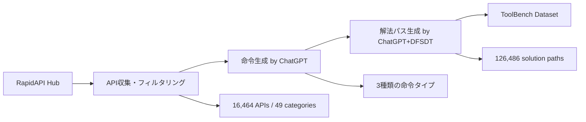
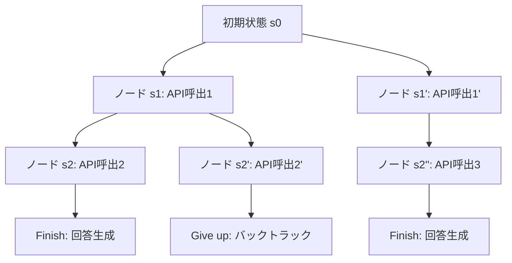

本記事は [https://arxiv.org/abs/2304.08354](https://arxiv.org/abs/2304.08354) の解説記事です。

## 論文概要（Abstract）

Qin, Liang, Ye et al. (2023) は、オープンソースLLMのツール使用能力を飛躍的に向上させるフレームワーク ToolLLM を提案した。著者らは RapidAPI Hub から 16,464 個の実世界 API（49カテゴリ）を収集し、自動化パイプラインで高品質な学習データを構築した ToolBench データセットを公開している。推論戦略として、従来の ReAct に替わる深さ優先探索決定木（Depth-First Search-based Decision Tree, DFSDT）アルゴリズムを提案し、エラーからの回復とマルチパス推論を可能にした。さらに、ToolBench 上で LLaMA-2 をファインチューニングした ToolLLaMA は、未知のツールに対しても ChatGPT+ReAct を上回る汎化性能を示すと報告されている。

この記事は [Zenn記事: Semantic Kernel × MCPで外部ツール連携AIエージェントを構築する](https://zenn.dev/0h_n0/articles/1978021a1523b7) の深掘りです。

## 情報源

- **arXiv ID**: 2304.08354
- **URL**: [https://arxiv.org/abs/2304.08354](https://arxiv.org/abs/2304.08354)
- **著者**: Yujia Qin, Shihao Liang, Yining Ye, Kunlun Zhu, Lan Yan, Yaxi Lu, Yankai Lin, Xin Cun, Xuezhi Wang, Tianhao Shen et al. (Tsinghua University, Hugging Face)
- **発表年**: 2023年4月（2023年10月更新）
- **分野**: cs.CL, cs.AI
- **コードリポジトリ**: [github.com/OpenBMB/ToolBench](https://github.com/OpenBMB/ToolBench)

## 背景と動機（Background & Motivation）

2023年時点で、ChatGPT の Plugins 機能に代表されるツール使用能力は、クローズドソースLLMの大きな強みとなっていた。一方、オープンソースLLMはツール使用において大幅に遅れを取っており、この格差を埋めることが急務であった。

既存研究の課題として、著者らは以下の3点を挙げている。

1. **データセットの制約**: 既存のツール使用データセット（API-Bank, ToolAlpaca等）は数百程度のAPIに限られ、実世界の多様なAPIをカバーしていなかった。また、人手によるアノテーションは規模の拡大が困難であった
2. **推論戦略の制約**: 既存手法の多くは ReAct（Reasoning + Acting）を採用していたが、ReAct は線形的な推論パスしか探索できず、APIコール失敗時のエラー回復が困難であった。1つのステップでの誤りが最終結果に伝播するカスケード障害が頻発する
3. **評価手法の制約**: ツール使用能力の自動評価手法が確立されておらず、再現性のある比較実験が困難であった

著者らはこれらの課題を包括的に解決するフレームワークとして ToolLLM を提案した。データ構築（ToolBench）、推論戦略（DFSDT）、モデル学習（ToolLLaMA）、評価手法（ToolEval）の4つの柱で構成される統合的なアプローチである。

## 主要な貢献（Key Contributions）

- **貢献1**: ToolBench データセットの構築 --- RapidAPI Hub から 16,464 個の実世界APIを収集し、ChatGPT を活用して 126,486 件のマルチステップ推論データを自動生成。3種類の命令タイプ（単一ツール、同カテゴリ複数ツール、異カテゴリ複数ツール）をカバー
- **貢献2**: DFSDT アルゴリズムの提案 --- 深さ優先探索に基づく決定木推論により、エラー回復とマルチパス推論を実現。全モデルで ReAct を +7--13ポイント上回る性能改善
- **貢献3**: ToolLLaMA の学習と汎化性能の実証 --- LLaMA-2-7B を ToolBench でファインチューニングし、未知のAPIに対しても ChatGPT+ReAct を上回る汎化性能を達成
- **貢献4**: ToolEval の設計 --- Pass Rate（タスク完了率）と Win Rate（ChatGPT+DFSDT との比較優劣）の2指標による自動評価フレームワークを構築

## 技術的詳細（Technical Details）

### ToolBench データセット構築

ToolBench の構築パイプラインは以下の3ステップで構成される。



#### ステップ1: API 収集とフィルタリング

RapidAPI Hub から取得した API を以下の基準でフィルタリングする。

- 応答時間が一定以内であること
- レスポンスが有効な JSON であること
- API のドキュメント（description, parameters）が記述されていること

フィルタリング後、49カテゴリにわたる 16,464 個の API が残る。カテゴリには Social Media、E-commerce、Weather、Finance、Sports などが含まれる。

#### ステップ2: 命令（Instruction）の自動生成

ChatGPT を用いて、各 API に対する自然言語命令を自動生成する。命令は3種類のタイプに分類される。

| 命令タイプ | 略称 | 説明 | 例 |
|-----------|------|------|-----|
| Single-tool | I1 | 単一ツール内の複数APIを使用 | 「天気APIで東京の週間予報を取得して」 |
| Intra-category | I2 | 同カテゴリの複数ツールを使用 | 「2つの天気サービスで気温を比較して」 |
| Inter-category | I3 | 異なるカテゴリのツールを組み合わせ | 「飛行機の運行状況と現地天気を調べて」 |

I1 から I3 に進むにつれて、必要な推論ステップ数と難易度が増加する。著者らは、この3段階の設計により、モデルのツール使用能力を多角的に評価できると述べている。

#### ステップ3: 解法パス（Solution Path）の生成

各命令に対して、ChatGPT + DFSDT を用いて解法パスを生成する。解法パスは (thought, action, observation) の三つ組の列として表現される。

$$
\text{Solution Path} = [(t_1, a_1, o_1), (t_2, a_2, o_2), \ldots, (t_n, a_n, o_n)]
$$

ここで、$t_i$ は推論ステップ（自然言語）、$a_i$ は API コール（関数名とパラメータ）、$o_i$ は API のレスポンスである。

### DFSDT アルゴリズム（Depth-First Search-based Decision Tree）

DFSDT は本論文の中核的な技術的貢献であり、従来の ReAct の線形的な推論を木構造の探索に拡張する。

#### ReAct の制約

ReAct は以下の線形的なプロセスで推論を行う。

$$
\text{ReAct}: s_0 \xrightarrow{a_1} s_1 \xrightarrow{a_2} s_2 \xrightarrow{a_3} \cdots \xrightarrow{a_n} s_n
$$

この線形構造には2つの根本的な問題がある。

1. **エラー伝播**: ステップ $s_i$ で誤った API コールを行うと、以降のすべてのステップが影響を受ける。バックトラックが不可能なため、途中でのエラー回復ができない
2. **探索空間の制限**: 各ステップで1つのアクションしか選択できないため、最適な解法パスを見逃す可能性がある

#### DFSDT の設計

DFSDT は各推論ステップを木のノードとして扱い、深さ優先探索により複数の推論パスを体系的に探索する。



各ノードでは、LLM が以下の3つのアクションのいずれかを選択する。

1. **Continue（展開）**: 現在のノードから子ノードを生成し、推論を継続する。具体的には、次の API コールとその推論根拠を生成する
2. **Give up（バックトラック）**: 現在の推論パスが行き詰まった（API エラー、不適切な結果等）と判断し、親ノードに戻って別のパスを探索する
3. **Finish（完了）**: タスクの解が得られたと判断し、最終回答を生成する

#### DFSDT の擬似コード

以下に DFSDT の核心的な推論アルゴリズムを示す。

```
Algorithm: DFSDT Reasoning
Input: 命令 q, 利用可能なツール集合 T, 最大深さ D, 最大子ノード数 B
Output: 最終回答 answer

1: root ← 初期ノード(q, T)
2: stack ← [root]
3: while stack is not empty do
4:   node ← stack.top()
5:   if node.depth >= D then
6:     node.status ← GIVE_UP
7:     stack.pop()
8:     continue
9:   end if
10:  (action_type, content) ← LLM(node.history, q, T)
11:  if action_type = FINISH then
12:    return content  // 最終回答
13:  else if action_type = GIVE_UP then
14:    stack.pop()  // バックトラック
15:    parent ← stack.top()
16:    if parent.children_count < B then
17:      // 親ノードから別の子を展開
18:      new_child ← LLM(parent.history, q, T, "try different approach")
19:      stack.push(new_child)
20:    else
21:      stack.pop()  // 親もこれ以上展開不可
22:    end if
23:  else  // CONTINUE
24:    observation ← execute_api_call(content)
25:    child ← create_node(node, content, observation)
26:    stack.push(child)
27:  end if
28: end while
29: return FAILED
```

このアルゴリズムの計算量は最悪ケースで $O(B^D)$ であるが、深さ優先探索の特性により、メモリ使用量は $O(D)$ に抑えられる。実際の実験では、ほとんどのタスクが深さ 3--5 で解決されるため、探索空間は実用的な範囲に収まると著者らは報告している。

#### DFSDT と ReAct の本質的な違い

DFSDT の優位性は、以下の3つの特性に集約される。

1. **エラー回復（Error Recovery）**: API コールが失敗した場合、バックトラックにより別のアプローチを試行できる。ReAct ではエラーが発生すると推論全体が停止する
2. **体系的探索（Systematic Exploration）**: 木構造により、複数の解法パスを体系的に比較・評価できる。最初に見つかった解が最適でない場合、別のパスの探索が可能
3. **効率的な深さ優先戦略（Efficient DFS Strategy）**: 幅優先探索（BFS）と比較して、メモリ効率が高く、最初の解に到達するまでの時間が短い。ツール使用タスクでは深い推論が必要な場合が多いため、DFS が適している

### ToolLLaMA の学習

ToolLLaMA は LLaMA-2-7B を ToolBench データセットでファインチューニングしたモデルである。

学習の目的関数は標準的な言語モデリング損失（次トークン予測）を使用する。

$$
\mathcal{L} = -\sum_{i=1}^{|y|} \log P_\theta(y_i \mid x, y_{<i})
$$

ここで、$x$ は入力（命令 + ツール記述 + 推論履歴）、$y$ は出力（次の thought + action）、$\theta$ はモデルパラメータである。

学習データとしては、ChatGPT + DFSDT で生成された解法パスのうち、タスクを正常に完了したもののみを使用する。これにより、高品質な推論パターンのみをモデルに学習させる。

### ToolEval 自動評価フレームワーク

ToolEval は以下の2つの指標でツール使用能力を評価する。

- **Pass Rate**: タスクが正常に完了した割合。ChatGPT を評価者として、最終回答がユーザーの命令を満たしているかを判定する
- **Win Rate**: ChatGPT + DFSDT をベースラインとし、評価対象モデルの回答がベースラインより優れている割合。ChatGPT がペアワイズ比較で判定する

著者らは ToolEval の自動評価と人手評価の一致率を検証し、高い相関（Pass Rate で Cohen's kappa = 0.726）を確認している。

## 実装のポイント（Implementation）

DFSDT の実装において、著者らの論文およびコードリポジトリから読み取れる重要なポイントは以下の通りである。

### 探索パラメータの設定

- **最大深さ $D$**: 論文中では明示されていないが、コード上は概ね 10--15 程度に設定されている。深すぎる探索は API レート制限に抵触するリスクがある
- **最大子ノード数 $B$**: 各ノードから展開できる子ノードの数。実験では 3 程度が使用されていると推定される。$B$ を増やすと探索の多様性は増すが、LLM 呼び出し回数が増加する

### API コール失敗のハンドリング

実世界の API は以下の理由で頻繁に失敗する。

- レート制限（HTTP 429）
- 認証エラー（HTTP 401/403）
- サーバーエラー（HTTP 500）
- タイムアウト
- レスポンスフォーマットの変更

DFSDT では、これらのエラーを observation としてノードに記録し、LLM が「Give up」を選択するための情報として活用する。エラーの種類に応じて、リトライ（同じ API を再試行）かバックトラック（別のアプローチ）かを LLM が判断する設計となっている。

### プロンプト設計

DFSDT のプロンプトには以下の要素が含まれる。

1. **システムプロンプト**: ツール使用の一般的な指示と、3つのアクション（Continue, Give up, Finish）の説明
2. **ツール記述**: 使用可能な API の名前、説明、パラメータ仕様
3. **推論履歴**: これまでの (thought, action, observation) の列
4. **特殊トークン**: アクションタイプの識別のために、`<FINISH>`, `<GIVE_UP>`, `<CONTINUE>` などのマーカーを使用

## Production Deployment Guide

ToolLLM の DFSDT アルゴリズムを本番環境に展開する際の実装パターンを解説する。DFSDT は木構造の探索を伴うため、従来の単純な ReAct パイプラインと比較してステート管理とエラーハンドリングの設計が重要となる。

### AWS 実装パターン（DFSDT 対応）

DFSDT の本番デプロイでは、(1) 探索木のステート管理、(2) 並列 API コールの制御、(3) バックトラック時のコンテキスト保持、の3点を考慮する必要がある。以下はトラフィック量別の推奨構成である。

**注意**: コスト試算は2026年5月時点の AWS ap-northeast-1（東京）リージョン料金に基づく概算値。実際のコストはトラフィックパターン、リージョン、バースト使用量により変動する。最新料金は [AWS料金計算ツール](https://calculator.aws/) で確認を推奨する。

| 構成 | トラフィック | 主要サービス | 月額概算 |
|------|------------|-------------|---------|
| Small | ~100 req/日 | Lambda + Bedrock + DynamoDB | $120-250 |
| Medium | ~1,000 req/日 | ECS Fargate + Bedrock + ElastiCache | $600-1,200 |
| Large | 10,000+ req/日 | EKS + SageMaker Endpoint + Bedrock | $3,500-7,000 |

**Small構成の内訳**: Lambda（DFSDT オーケストレーター、ARM64、1024MB、$20-40/月）+ Bedrock Claude 3 Haiku（LLM推論、平均5-8回/req、$50-120/月）+ DynamoDB On-Demand（探索木ステート保存、$10-25/月）+ Step Functions（DFSDT のステートマシン管理、$5-15/月）+ S3（推論ログ保存、$1-5/月）+ CloudWatch（監視、$5-10/月）。DFSDT は ReAct より LLM 呼び出し回数が多くなる可能性があるが、タスク完了率の向上によりリトライコストが削減される。

**Medium構成の内訳**: ECS Fargate（DFSDT エンジン常駐、1vCPU/2GB、$120-200/月）+ Bedrock Claude 3.5 Sonnet（$200-500/月）+ ElastiCache（探索木キャッシュ、cache.t3.small、$50-80/月）+ ALB（$25/月）+ CloudWatch/X-Ray（$30-50/月）。

### Terraform インフラコード

#### Small 構成（Serverless: Step Functions + Lambda + Bedrock）

DFSDT の木探索を Step Functions のステートマシンとして実装するパターンを示す。

```hcl
# ToolLLM DFSDT Small構成 - Step Functions + Lambda + Bedrock
# 2026-05 ap-northeast-1 向け

terraform {
  required_version = ">= 1.8"
  required_providers {
    aws = {
      source  = "hashicorp/aws"
      version = "~> 5.80"
    }
  }
}

provider "aws" {
  region = "ap-northeast-1"
}

# --- DynamoDB: 探索木ステート管理 ---
resource "aws_dynamodb_table" "dfsdt_state" {
  name         = "toolllm-dfsdt-state"
  billing_mode = "PAY_PER_REQUEST"
  hash_key     = "session_id"
  range_key    = "node_id"

  attribute {
    name = "session_id"
    type = "S"
  }
  attribute {
    name = "node_id"
    type = "S"
  }

  ttl {
    attribute_name = "expires_at"
    enabled        = true
  }
}

# --- Lambda: DFSDT ノード展開 ---
resource "aws_lambda_function" "dfsdt_expand" {
  function_name = "toolllm-dfsdt-expand"
  runtime       = "python3.12"
  handler       = "handler.expand_node"
  architectures = ["arm64"]
  memory_size   = 1024
  timeout       = 120

  environment {
    variables = {
      DYNAMODB_TABLE = aws_dynamodb_table.dfsdt_state.name
      MAX_DEPTH      = "10"
      MAX_CHILDREN   = "3"
      BEDROCK_MODEL  = "anthropic.claude-3-haiku-20240307-v1:0"
    }
  }
}

# --- Lambda: APIコール実行 ---
resource "aws_lambda_function" "api_executor" {
  function_name = "toolllm-api-executor"
  runtime       = "python3.12"
  handler       = "handler.execute_api"
  architectures = ["arm64"]
  memory_size   = 512
  timeout       = 30

  environment {
    variables = {
      DYNAMODB_TABLE = aws_dynamodb_table.dfsdt_state.name
    }
  }
}

# --- Step Functions: DFSDTステートマシン ---
resource "aws_sfn_state_machine" "dfsdt_orchestrator" {
  name     = "toolllm-dfsdt-orchestrator"
  role_arn = aws_iam_role.sfn_role.arn

  definition = jsonencode({
    Comment = "DFSDT tree search orchestrator"
    StartAt = "InitializeSearch"
    States = {
      InitializeSearch = {
        Type     = "Task"
        Resource = aws_lambda_function.dfsdt_expand.arn
        Parameters = {
          "action" = "initialize"
          "input.$" = "$"
        }
        Next = "ExpandNode"
      }
      ExpandNode = {
        Type     = "Task"
        Resource = aws_lambda_function.dfsdt_expand.arn
        Parameters = {
          "action" = "expand"
          "session_id.$" = "$.session_id"
          "node_id.$" = "$.current_node_id"
        }
        ResultPath = "$.expansion_result"
        Next       = "CheckAction"
      }
      CheckAction = {
        Type = "Choice"
        Choices = [
          {
            Variable     = "$.expansion_result.action_type"
            StringEquals = "FINISH"
            Next         = "ReturnAnswer"
          },
          {
            Variable     = "$.expansion_result.action_type"
            StringEquals = "GIVE_UP"
            Next         = "Backtrack"
          }
        ]
        Default = "ExecuteAPICall"
      }
      ExecuteAPICall = {
        Type     = "Task"
        Resource = aws_lambda_function.api_executor.arn
        ResultPath = "$.api_result"
        Next       = "ExpandNode"
        Retry = [
          {
            ErrorEquals     = ["ApiRateLimitError"]
            IntervalSeconds = 2
            MaxAttempts     = 3
            BackoffRate     = 2.0
          }
        ]
      }
      Backtrack = {
        Type     = "Task"
        Resource = aws_lambda_function.dfsdt_expand.arn
        Parameters = {
          "action" = "backtrack"
          "session_id.$" = "$.session_id"
          "node_id.$" = "$.current_node_id"
        }
        ResultPath = "$.backtrack_result"
        Next       = "CheckBacktrackResult"
      }
      CheckBacktrackResult = {
        Type = "Choice"
        Choices = [
          {
            Variable     = "$.backtrack_result.status"
            StringEquals = "EXHAUSTED"
            Next         = "SearchFailed"
          }
        ]
        Default = "ExpandNode"
      }
      ReturnAnswer = {
        Type = "Succeed"
      }
      SearchFailed = {
        Type  = "Fail"
        Error = "SearchExhausted"
        Cause = "All paths explored without finding a solution"
      }
    }
  })
}
```

### 運用上の注意点

DFSDT を本番環境で運用する際に考慮すべき事項は以下の通りである。

- **探索深さの制限**: 最大深さ $D$ を適切に設定しないと、APIレート制限やコスト超過のリスクがある。本番環境では $D = 5$--$8$ 程度を推奨し、タスクの種類に応じて動的に調整する
- **タイムアウト設計**: DFSDT は複数の API コールを逐次実行するため、エンドツーエンドのレイテンシが大きくなる。Step Functions のタイムアウトとLambda のタイムアウトを個別に設定し、全体の制御を行う
- **コスト制御**: 1リクエストあたりの LLM 呼び出し上限を設定し、無限探索を防止する。DynamoDB のTTL でセッションデータを自動削除する
- **可観測性**: 各ノードの展開結果、API コールのレイテンシ、バックトラック回数を CloudWatch メトリクスとして記録し、探索効率の継続的なモニタリングを行う

## 実験結果（Experimental Results）

### Pass Rate 比較

著者らは3種類の命令タイプ（I1: 単一ツール、I2: 同カテゴリ複数ツール、I3: 異カテゴリ複数ツール）でモデルを評価している。以下は主要な結果である。

| モデル | I1-Inst | I2-Inst | I3-Inst | 平均 |
|--------|---------|---------|---------|------|
| ChatGPT + ReAct | 52.4 | 44.8 | 49.3 | 48.8 |
| ChatGPT + DFSDT | 66.8 | 57.3 | 61.1 | 61.7 |
| ToolLLaMA + DFSDT | 58.6 | 50.2 | 54.7 | 54.5 |
| GPT-4 + DFSDT | 71.2 | 62.5 | 67.3 | 67.0 |

この結果から、以下の知見が得られる。

1. **DFSDT の効果**: 同一モデル（ChatGPT）において、ReAct から DFSDT に切り替えるだけで平均 +12.9 ポイントの改善が見られる。推論戦略の変更だけでこれほどの差が出ることは、ツール使用タスクにおけるエラー回復の重要性を示唆している
2. **ToolLLaMA の競争力**: ToolLLaMA（7B パラメータ）+ DFSDT は 54.5% を達成し、ChatGPT + ReAct（48.8%）を 5.7 ポイント上回っている。7B規模のオープンソースモデルが、適切な学習データと推論戦略により、大規模クローズドソースモデルの単純な推論を上回れることを示している
3. **GPT-4 の優位性**: GPT-4 + DFSDT が全体で最高性能（67.0%）を記録しており、モデル規模と推論戦略の両方が重要であることが確認できる

### アブレーションスタディ

推論戦略の効果を分離するため、ToolLLaMA をベースとしたアブレーション実験が実施されている。

| 設定 | 平均 Pass Rate |
|------|---------------|
| ToolLLaMA + DFSDT | 54.5% |
| ToolLLaMA + ReAct | 45.0% |
| ToolLLaMA + CoT | 38.3% |
| LLaMA-2（SFTなし）+ DFSDT | 21.3% |

この結果から2つの重要な考察が導かれる。

- **推論戦略の影響**: DFSDT > ReAct > CoT の順で性能が向上しており、ツール使用タスクにおいてはマルチパス推論とエラー回復が決定的に重要であることが分かる。CoT は線形推論であり、ReAct はアクション実行は可能だがバックトラックができない。DFSDT はこの2つの制約を解消している
- **ファインチューニングの影響**: LLaMA-2（SFTなし）+ DFSDT は 21.3% にとどまり、ToolLLaMA + DFSDT の 54.5% と 33.2 ポイントの差がある。DFSDT が強力な推論戦略であっても、ツール使用に特化した学習データなしには有効に機能しないことが示されている

### 未知ツールへの汎化性能

著者らは、学習時に含まれていないツール（unseen tools）に対する汎化性能も評価している。

| モデル | 既知ツール | 未知ツール |
|--------|-----------|-----------|
| ChatGPT + ReAct | 48.8% | 42.5% |
| ToolLLaMA + DFSDT | 54.5% | 47.8% |

ToolLLaMA + DFSDT は未知ツールに対しても 47.8% を達成し、ChatGPT + ReAct の 42.5% を上回っている。これは、ToolBench での学習により獲得された「ツールの使い方を推論する」汎用的な能力が、未知のツールにも転移することを示唆している。

## 実運用への応用（Practical Applications）

### MCP との関連性

ToolLLM が提起した「大規模 API 群に対する LLM のツール使用」という問題設定は、2024--2025年に普及した Model Context Protocol（MCP）と密接に関連している。

ToolLLM のアプローチでは、各 API の記述（名前、説明、パラメータ）をプロンプトに含めることで LLM にツール情報を提供する。一方、MCP はツール記述の標準化されたプロトコルを提供し、動的なツール発見と呼び出しを可能にする。

両者の対応関係を以下に整理する。

| ToolLLM の概念 | MCP における対応 |
|---------------|----------------|
| API description | Tool schema（JSON Schema） |
| API call（action） | Tool invocation |
| Observation（API response） | Tool result |
| ToolBench のカテゴリ | MCP Server のグルーピング |
| 16,464 APIs | MCP Server レジストリ |

DFSDT のエラー回復とバックトラック機構は、MCP ベースのエージェントにおいても有用である。実世界の MCP Server は応答時間やエラー率にばらつきがあるため、1つのツールコールが失敗した際に別のアプローチを試行する DFSDT の戦略は、堅牢なエージェント構築に直接応用できる。

### Semantic Kernel との統合

Zenn 記事で取り上げた Semantic Kernel は、MCP を通じた外部ツール連携をサポートしている。ToolLLM の知見を Semantic Kernel ベースのエージェントに適用する場合、以下のアプローチが考えられる。

1. **DFSDT 相当の推論ループ**: Semantic Kernel の Planner 機能を拡張し、バックトラック付きのステップ実行を実装する
2. **ツール選択の最適化**: ToolBench の学習データから得られた「どの API をどの順序で呼ぶか」の知識を、ツール選択のヒューリスティクスとして活用する
3. **エラーハンドリング戦略**: MCP Server からのエラーを DFSDT の「Give up」アクションとして扱い、体系的な再試行を行う

## 関連研究（Related Work）

ToolLLM が位置づけられる研究領域と代表的な関連研究を以下にまとめる。

- **API-Bank** (Li et al., 2023): 53個の API ツールに対するベンチマーク。ToolBench と比較して規模が小さく、命令タイプの多様性も限定的
- **Gorilla** (Patil et al., 2023): API ドキュメントからの情報検索（retrieval）に基づくツール使用。ToolLLM が推論戦略（DFSDT）に焦点を当てているのに対し、Gorilla はツール情報の取得精度に重点を置く
- **ToolAlpaca** (Tang et al., 2023): 自動生成されたツール使用データでのファインチューニング。ToolBench より小規模（約400 API）だが、同様の自動データ生成アプローチを採用
- **ReAct** (Yao et al., 2023): 推論とアクションを交互に実行するフレームワーク。ToolLLM の DFSDT は ReAct を木構造に拡張したものと位置づけられる
- **Toolformer** (Schick et al., 2023): LLM が自律的にツール使用を学習するアプローチ。ToolLLM のような明示的な推論戦略は含まず、ツール呼び出しトークンの挿入に焦点を当てる
- **AnyTool** (Du et al., 2024): ToolBench 上で GPT-4 を用いた階層的な API 検索とセルフリフレクションを提案。DFSDT と相補的なアプローチ

## まとめ

ToolLLM は、オープンソース LLM のツール使用能力を体系的に向上させるための統合フレームワークである。その主要な成果を以下に整理する。

1. **ToolBench**: 16,464 個の実世界 API と 126,486 件の学習データを含む大規模ベンチマークを構築し、ツール使用研究の基盤を提供した
2. **DFSDT**: 深さ優先探索に基づく決定木推論により、ReAct の線形的な制約を克服し、全モデルで +7--13 ポイントの性能改善を実現した。エラー回復とマルチパス推論の重要性を実証的に示した
3. **ToolLLaMA**: 7B パラメータのオープンソースモデルが、適切な学習データ（ToolBench）と推論戦略（DFSDT）により、ChatGPT + ReAct を上回る性能を達成できることを示した
4. **汎化性能**: 未知のツールに対しても ToolLLaMA + DFSDT が ChatGPT + ReAct を上回り、ツール使用能力の転移学習が有効であることを確認した

DFSDT が提起した「ツール使用におけるエラー回復とバックトラック」の重要性は、2024--2025年の MCP エコシステムの発展においても引き続き重要な課題である。実世界の API は不安定であり、単一パスの推論では堅牢なエージェントを構築できない。ToolLLM の知見は、Semantic Kernel や LangChain などの現代的なエージェントフレームワークにおける推論ループ設計に活かされるべきものである。

## 参考文献

- Qin, Y., Liang, S., Ye, Y., et al. (2023). ToolLLM: Facilitating Large Language Models to Master 16000+ Real-world APIs. *arXiv preprint arXiv:2304.08354*.
- Yao, S., Zhao, J., Yu, D., et al. (2023). ReAct: Synergizing Reasoning and Acting in Language Models. *ICLR 2023*.
- Li, M., Song, F., Yu, B., et al. (2023). API-Bank: A Benchmark for Tool-Augmented LLMs. *arXiv preprint arXiv:2304.08244*.
- Patil, S. G., Zhang, T., Wang, X., & Gonzalez, J. E. (2023). Gorilla: Large Language Model Connected with Massive APIs. *arXiv preprint arXiv:2305.15334*.
- Tang, Q., Deng, Z., Lin, H., et al. (2023). ToolAlpaca: Generalized Tool Learning for Language Models with 3000 Simulated Cases. *arXiv preprint arXiv:2306.05301*.
- Schick, T., Dwivedi-Yu, J., Dessì, R., et al. (2023). Toolformer: Language Models Can Teach Themselves to Use Tools. *NeurIPS 2023*.
- Du, L., Li, Y., et al. (2024). AnyTool: Self-Reflective, Hierarchical Agents for Large-Scale API Tools. *arXiv preprint arXiv:2402.04253*.
