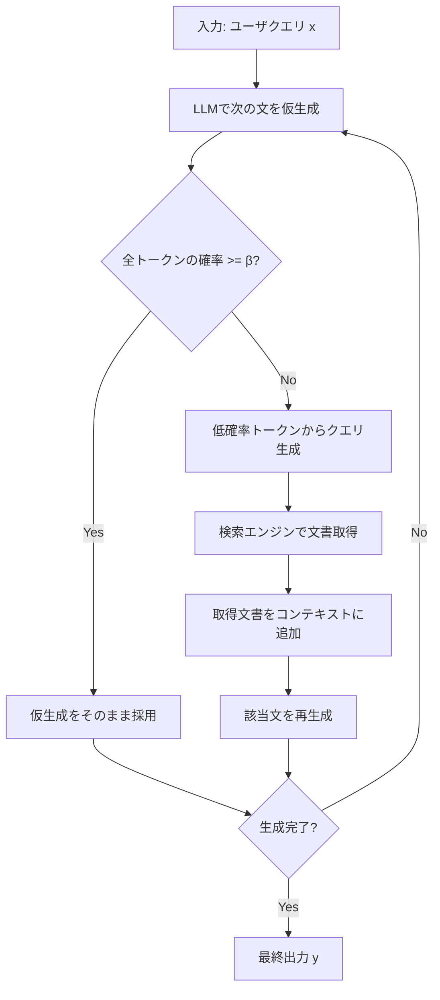

本記事は [Active Retrieval Augmented Generation](https://arxiv.org/abs/2305.06983) の解説記事です。

## 論文概要（Abstract）

Jiang, Xu, Gao, Sun, Liu, Dwivedi-Yu, Yang, Callan, Neubig (Carnegie Mellon University, 2023) は、長文生成タスクにおけるRetrieval-Augmented Generation（RAG）の課題に対して、**FLARE（Forward-Looking Active REtrieval augmented generation）**を提案した。従来のRAGが入力クエリに対して1回の検索で外部知識を取得するのに対し、FLAREは生成中のトークン確率を逐次監視し、モデルの不確実性が高い箇所で動的に追加検索を実行する。著者らはASQA、QAMPARI、ELI5、2WikiMultiHopQAの4つのベンチマークで評価を行い、従来手法を上回る性能を報告している。

この記事は [Zenn記事: FLARE×LangGraphで技術文書QAを反復検索ループ化し回答精度を高める](https://zenn.dev/0h_n0/articles/1310ef0d8ee818) の深掘りです。

## 情報源

- **arXiv ID**: 2305.06983
- **URL**: [https://arxiv.org/abs/2305.06983](https://arxiv.org/abs/2305.06983)
- **著者**: Zhengbao Jiang, Frank F. Xu, Luyu Gao et al.（Carnegie Mellon University）
- **発表年**: 2023年（EMNLP 2023 採択）
- **分野**: cs.CL（計算言語学）
- **コード**: [https://github.com/jzbjyb/FLARE](https://github.com/jzbjyb/FLARE)

## 背景と動機（Background & Motivation）

大規模言語モデル（LLM）は事前学習時の知識に依存するため、最新情報やロングテールの事実を正確に生成することが難しい。RAGはこの問題への有力なアプローチだが、従来のRAGには構造的な制約がある。入力クエリに対して検索を1回実行し、取得した文書をコンテキストに追加して生成を行う「single-turn」方式では、長文生成や多段推論を要するタスクで情報不足に陥りやすい。

著者らはこの課題を2つの観点から分析している。第一に、入力クエリだけでは生成途中で必要になる情報を事前に予測できない。第二に、長文生成では文脈が進むにつれて新たな事実確認が必要になるが、既存手法はこれに対応できない。IRCoT（Trivedi et al., 2023）のようにchain-of-thought推論の各ステップで検索を行う手法もあるが、検索タイミングが固定的であり、モデルが十分な知識を持っている箇所でも不要な検索を実行してしまう問題がある。

FLAREはこれらの課題に対して、「LLMが自身の不確実性を認識し、必要な時だけ検索する」という能動的検索（active retrieval）の枠組みを提案している。

## 主要な貢献（Key Contributions）

- **貢献1**: トークン生成確率に基づく能動的検索トリガー機構の提案。確率閾値$\beta$を用いて、モデルの不確実性が高い箇所でのみ検索を実行する仕組みを設計した
- **貢献2**: Implicit QueryとExplicit Queryの2つのクエリ生成戦略の提案と比較。低確率トークンのマスキングによる暗黙的クエリ生成と、LLMに質問文を直接生成させる明示的クエリ生成を体系的に評価した
- **貢献3**: 4つの知識集約型ベンチマーク（ASQA、QAMPARI、ELI5、2WikiMultiHopQA）での包括的な評価。特にASQAでExact Match 38.1（ベースライン31.2比で+6.9）の改善を達成した

## 技術的詳細（Technical Details）

### FLAREのアルゴリズム

FLAREの中核は「仮生成→確率評価→条件付き検索→本生成」の反復ループである。以下にアルゴリズムの全体像を示す。



### 確率閾値による検索トリガー

FLAREは生成されたトークン列$\hat{s}_t = (\hat{w}_1, \hat{w}_2, \dots, \hat{w}_l)$に対して、各トークンの生成確率$p(\hat{w}_i)$を監視する。文$\hat{s}_t$中に確率が閾値$\beta$を下回るトークンが存在する場合、その文に対して検索をトリガーする。

$$
\text{trigger\_retrieval}(\hat{s}_t) = \begin{cases} \text{True} & \text{if } \exists\, i \in \{1, \dots, l\} : p(\hat{w}_i) < \beta \\ \text{False} & \text{otherwise} \end{cases}
$$

ここで、
- $\hat{s}_t$: 時刻$t$で仮生成された文
- $\hat{w}_i$: 仮生成文中の$i$番目のトークン
- $p(\hat{w}_i)$: トークン$\hat{w}_i$の生成確率（LLMのsoftmax出力）
- $\beta$: 確率閾値（論文のデフォルト推奨値は0.5）
- $l$: 仮生成文のトークン数

著者らは$\beta = 0.5$をデフォルトとして推奨しているが、モデルやタスクによって最適値は異なると報告している。$\beta$が低すぎると必要な検索がスキップされ、高すぎると不要な検索が増加しレイテンシが悪化する。

### Implicit Query vs Explicit Query

検索がトリガーされた場合、FLAREは2つの方法でクエリを生成する。

**Implicit Query（FLAREinstruct）**: 仮生成文$\hat{s}_t$から低確率トークン（$p(\hat{w}_i) < \beta$）をマスクし、残りの高確率トークンを検索クエリとして使用する。

$$
q_t^{\text{implicit}} = \text{mask}(\hat{s}_t, \beta) = \{ \hat{w}_i \mid p(\hat{w}_i) \geq \beta \}
$$

この方法の直感は、モデルが確信を持っている部分（高確率トークン）は正しい文脈情報を含んでおり、不確実な部分（低確率トークン）が検索で補完すべき情報に対応するという仮定に基づいている。

**Explicit Query（FLAREdirect）**: LLMに対して直接質問文を生成させる。仮生成文の中で不確実な部分について、LLMが自然言語の質問を生成し、それを検索クエリとして使用する。具体的には、生成の途中で `[Search("検索クエリ")]` 形式のトークンを出力するようLLMをfew-shot instructionで制御する。

著者らの実験ではImplicit Queryの方が安定した性能を示す傾向があると報告されている。Explicit Queryはクエリの品質がLLMのinstruction-following能力に依存するため、モデルによってばらつきが生じる。

### 文単位の反復生成

FLAREは文（sentence）単位で生成と検索を反復する。各ステップで以下の処理が行われる。

1. 既存のコンテキスト$x \oplus y_{<t}$を条件として次の文$\hat{s}_t$を仮生成
2. $\hat{s}_t$中の全トークンの確率を評価
3. 低確率トークンが存在すれば検索をトリガー
4. 検索結果$d_t$をコンテキストに追加し、$\hat{s}_t$を再生成して$s_t$を得る
5. $s_t$を出力に追加し、次の文の生成に進む

このプロセスを数式で表すと以下のようになる。

$$
s_t = \begin{cases} \hat{s}_t & \text{if } \min_i p(\hat{w}_i) \geq \beta \\ \text{LM}(x \oplus d_t \oplus y_{<t}) & \text{otherwise} \end{cases}
$$

ここで、
- $y_{<t} = s_1 \oplus s_2 \oplus \cdots \oplus s_{t-1}$: 時刻$t$までに生成された文の連結
- $d_t = \text{Retrieve}(q_t)$: クエリ$q_t$による検索結果
- $\oplus$: 文字列の連結
- $\text{LM}(\cdot)$: 言語モデルによる生成関数

## 実装のポイント（Implementation）

FLAREを実装する際の主要な注意点を以下に示す。

```python
from dataclasses import dataclass


@dataclass
class FLAREConfig:
    """FLARE実行時の設定パラメータ

    Attributes:
        beta: 確率閾値。この値を下回るトークンが存在すると検索をトリガー
        max_iterations: 最大反復回数。無限ループ防止用
        sentence_delimiter: 文の区切り文字
        max_retrieval_docs: 1回の検索で取得する文書数
    """
    beta: float = 0.5
    max_iterations: int = 20
    sentence_delimiter: str = "."
    max_retrieval_docs: int = 3


def should_trigger_retrieval(
    token_probs: list[float],
    beta: float = 0.5,
) -> bool:
    """トークン確率列に基づいて検索トリガーを判定する

    Args:
        token_probs: 各トークンの生成確率のリスト
        beta: 確率閾値（デフォルト: 0.5）

    Returns:
        低確率トークンが存在する場合True
    """
    return any(p < beta for p in token_probs)


def build_implicit_query(
    tokens: list[str],
    token_probs: list[float],
    beta: float = 0.5,
) -> str:
    """低確率トークンをマスクしてImplicit Queryを構築する

    Args:
        tokens: 仮生成されたトークン列
        token_probs: 各トークンの生成確率
        beta: 確率閾値

    Returns:
        高確率トークンのみを連結したクエリ文字列
    """
    high_confidence_tokens = [
        tok for tok, prob in zip(tokens, token_probs)
        if prob >= beta
    ]
    return " ".join(high_confidence_tokens)
```

実装上の注意点として、以下の3つが重要である。

1. **文分割の粒度**: FLAREは文単位で生成・評価を行うため、文分割の精度が性能に影響する。日本語の場合は句点「。」での分割だけでなく、spaCyやGiNZAなどの文分割ツールの利用を検討すべきである
2. **確率取得の実装**: OpenAI APIでは`logprobs`パラメータでトークン確率を取得できるが、モデルによっては対応していない場合がある。ローカルモデルではsoftmax出力から直接取得する
3. **検索結果のコンテキスト長管理**: 反復検索によりコンテキストが肥大化するため、古い検索結果の刈り込みやコンテキストウィンドウの管理が必要である

## Production Deployment Guide

FLAREをプロダクション環境にデプロイする際のAWS構成とコスト最適化について解説する。FLAREは仮生成+本生成の2パス構成であるため、通常のRAGと比較して推論コストが高くなる点に留意が必要である。

### AWS実装パターン（コスト最適化重視）

FLARE RAGパイプライン向けのトラフィック量別推奨構成を以下に示す。コスト試算は2026年5月時点のap-northeast-1（東京リージョン）料金に基づく概算値であり、実際のコストはトラフィックパターン、バースト使用量により変動する。最新料金はAWS料金計算ツールで確認を推奨する。

| 構成 | トラフィック | 主要サービス | 月額概算 |
|------|-------------|-------------|---------|
| **Small** | ~100 req/日 | Lambda + Bedrock + OpenSearch Serverless | $120-200 |
| **Medium** | ~1,000 req/日 | ECS Fargate + Bedrock + OpenSearch Managed | $500-900 |
| **Large** | 10,000+ req/日 | EKS + vLLM (Spot) + OpenSearch | $2,500-5,500 |

**Small構成の内訳**:
- Lambda（FLARE制御ロジック）: ~$5/月（128MB、平均2秒/実行、100回/日）
- Bedrock Claude Sonnet（仮生成+本生成の2パス）: ~$60-120/月（入力1K tokens、出力500 tokens/回 x 2パス x 100回/日）
- OpenSearch Serverless（ベクトル検索）: ~$40-60/月（2 OCU最小構成）
- S3（文書ストレージ）: ~$1/月
- CloudWatch: ~$5/月

**Large構成の内訳**:
- EKS コントロールプレーン: ~$72/月
- EC2 Spot Instances（vLLM推論サーバー、g5.xlarge x 2）: ~$800-1,200/月（Spot割引適用後）
- OpenSearch Managed（3ノード、r6g.large.search）: ~$600/月
- ALB + NAT Gateway: ~$100/月
- 監視・ログ: ~$50/月

**コスト削減テクニック**:
- Spot Instancesで推論サーバーコストを最大70%削減（g5.xlargeの場合On-Demand $1.006/h → Spot約$0.30/h）
- Bedrock Prompt Cachingを有効化し、FLAREの反復検索で共通するシステムプロンプト部分のコストを30-90%削減
- Reserved Instancesで OpenSearchノードを最大60%削減（1年コミット）
- FLAREの確率閾値$\beta$を適切に設定し不要な検索回数を抑制することで、Bedrock API呼び出しコストを削減

### Terraformインフラコード

#### Small構成: Lambda + Bedrock + OpenSearch Serverless

```hcl
# FLARE RAG Pipeline - Small構成
# Lambda + Bedrock + OpenSearch Serverless
# 想定: ~100 req/日、月額$120-200

terraform {
  required_version = ">= 1.9"
  required_providers {
    aws = {
      source  = "hashicorp/aws"
      version = "~> 5.80"
    }
  }
}

provider "aws" {
  region = "ap-northeast-1"
}

# --- IAM Role (最小権限) ---
resource "aws_iam_role" "flare_lambda" {
  name = "flare-rag-lambda-role"
  assume_role_policy = jsonencode({
    Version = "2012-10-17"
    Statement = [{
      Action = "sts:AssumeRole"
      Effect = "Allow"
      Principal = { Service = "lambda.amazonaws.com" }
    }]
  })
}

resource "aws_iam_role_policy" "flare_lambda_policy" {
  name = "flare-rag-lambda-policy"
  role = aws_iam_role.flare_lambda.id
  policy = jsonencode({
    Version = "2012-10-17"
    Statement = [
      {
        Effect = "Allow"
        Action = [
          "bedrock:InvokeModel",
          "bedrock:InvokeModelWithResponseStream"
        ]
        Resource = "arn:aws:bedrock:ap-northeast-1::foundation-model/anthropic.claude-*"
      },
      {
        Effect = "Allow"
        Action = ["aoss:APIAccessAll"]
        Resource = aws_opensearchserverless_collection.flare_vectors.arn
      },
      {
        Effect = "Allow"
        Action = [
          "logs:CreateLogGroup",
          "logs:CreateLogStream",
          "logs:PutLogEvents"
        ]
        Resource = "arn:aws:logs:ap-northeast-1:*:*"
      },
      {
        # X-Ray トレーシング用
        Effect = "Allow"
        Action = [
          "xray:PutTraceSegments",
          "xray:PutTelemetryRecords"
        ]
        Resource = "*"
      }
    ]
  })
}

# --- OpenSearch Serverless (ベクトルDB) ---
resource "aws_opensearchserverless_security_policy" "flare_encryption" {
  name = "flare-encryption"
  type = "encryption"
  policy = jsonencode({
    Rules = [{ ResourceType = "collection", Resource = ["collection/flare-vectors"] }]
    AWSOwnedKey = true
  })
}

resource "aws_opensearchserverless_security_policy" "flare_network" {
  name = "flare-network"
  type = "network"
  policy = jsonencode([{
    Rules = [{
      ResourceType = "collection"
      Resource      = ["collection/flare-vectors"]
    }]
    AllowFromPublic = false  # VPCエンドポイント経由のみ
  }])
}

resource "aws_opensearchserverless_collection" "flare_vectors" {
  name = "flare-vectors"
  type = "VECTORSEARCH"
  depends_on = [
    aws_opensearchserverless_security_policy.flare_encryption,
    aws_opensearchserverless_security_policy.flare_network
  ]
}

# --- Lambda関数 (FLARE制御ロジック) ---
resource "aws_lambda_function" "flare_handler" {
  function_name = "flare-rag-handler"
  role          = aws_iam_role.flare_lambda.arn
  runtime       = "python3.12"
  handler       = "flare_handler.lambda_handler"
  filename      = "lambda_package.zip"
  timeout       = 120  # FLAREの反復処理に十分な時間
  memory_size   = 512  # トークン確率計算用
  tracing_config {
    mode = "Active"  # X-Ray有効化
  }
  environment {
    variables = {
      FLARE_BETA_THRESHOLD  = "0.5"
      MAX_ITERATIONS        = "20"
      OPENSEARCH_ENDPOINT   = aws_opensearchserverless_collection.flare_vectors.collection_endpoint
      BEDROCK_MODEL_ID      = "anthropic.claude-sonnet-4-20250514"
    }
  }
}

# --- CloudWatchアラーム (コスト監視) ---
resource "aws_cloudwatch_metric_alarm" "flare_duration" {
  alarm_name          = "flare-lambda-duration-high"
  comparison_operator = "GreaterThanThreshold"
  evaluation_periods  = 3
  metric_name         = "Duration"
  namespace           = "AWS/Lambda"
  period              = 300
  statistic           = "p95"
  threshold           = 90000  # 90秒
  alarm_description   = "FLARE Lambda P95レイテンシが90秒超過"
  dimensions = {
    FunctionName = aws_lambda_function.flare_handler.function_name
  }
}
```

#### Large構成: EKS + vLLM + OpenSearch

```hcl
# FLARE RAG Pipeline - Large構成
# EKS + vLLM (Spot) + OpenSearch Managed
# 想定: 10,000+ req/日、月額$2,500-5,500

# --- EKSクラスタ ---
module "eks" {
  source  = "terraform-aws-modules/eks/aws"
  version = "~> 20.31"

  cluster_name    = "flare-rag-cluster"
  cluster_version = "1.32"

  vpc_id     = module.vpc.vpc_id
  subnet_ids = module.vpc.private_subnets

  # コントロールプレーンのみ (ノードはKarpenterで管理)
  cluster_endpoint_public_access = false

  # Karpenter用IAM
  enable_cluster_creator_admin_permissions = true
}

# --- Karpenter (Spot優先オートスケーリング) ---
module "karpenter" {
  source  = "terraform-aws-modules/eks/aws//modules/karpenter"
  version = "~> 20.31"

  cluster_name = module.eks.cluster_name

  node_iam_role_additional_policies = {
    AmazonSSMManagedInstanceCore = "arn:aws:iam::aws:policy/AmazonSSMManagedInstanceCore"
  }
}

# Karpenter NodePool - GPU推論用 (Spot優先)
resource "kubectl_manifest" "karpenter_nodepool_gpu" {
  yaml_body = yamlencode({
    apiVersion = "karpenter.sh/v1"
    kind       = "NodePool"
    metadata   = { name = "flare-gpu-spot" }
    spec = {
      template = {
        spec = {
          requirements = [
            { key = "karpenter.sh/capacity-type", operator = "In", values = ["spot", "on-demand"] },
            { key = "node.kubernetes.io/instance-type", operator = "In", values = ["g5.xlarge", "g5.2xlarge"] },
            { key = "topology.kubernetes.io/zone", operator = "In", values = ["ap-northeast-1a", "ap-northeast-1c"] }
          ]
          nodeClassRef = { name = "default" }
        }
      }
      limits   = { cpu = "32", "nvidia.com/gpu" = "4" }
      disruption = {
        consolidationPolicy = "WhenEmptyOrUnderutilized"
        consolidateAfter    = "60s"
      }
    }
  })
}

# --- Secrets Manager (モデル設定) ---
resource "aws_secretsmanager_secret" "flare_config" {
  name       = "flare-rag/model-config"
  kms_key_id = aws_kms_key.flare.arn
}

resource "aws_secretsmanager_secret_version" "flare_config" {
  secret_id = aws_secretsmanager_secret.flare_config.id
  secret_string = jsonencode({
    beta_threshold     = 0.5
    max_iterations     = 20
    vllm_model         = "meta-llama/Llama-3.1-70B-Instruct"
    opensearch_endpoint = "https://flare-vectors.ap-northeast-1.aoss.amazonaws.com"
  })
}

# --- KMS暗号化 ---
resource "aws_kms_key" "flare" {
  description         = "FLARE RAG encryption key"
  enable_key_rotation = true
}

# --- AWS Budgets (予算アラート) ---
resource "aws_budgets_budget" "flare_monthly" {
  name         = "flare-rag-monthly"
  budget_type  = "COST"
  limit_amount = "5000"
  limit_unit   = "USD"
  time_unit    = "MONTHLY"

  notification {
    comparison_operator       = "GREATER_THAN"
    threshold                 = 80
    threshold_type            = "PERCENTAGE"
    notification_type         = "FORECASTED"
    subscriber_email_addresses = ["ops@example.com"]
  }
}
```

### セキュリティベストプラクティス

FLAREパイプラインのセキュリティ設計では以下の点に留意する。

- **IAM最小権限**: Lambda/ECSタスクロールにはBedrock InvokeModelとOpenSearchアクセスのみを許可する。`bedrock:*`のようなワイルドカード権限は使用しない
- **ネットワーク分離**: OpenSearch ServerlessはVPCエンドポイント経由のみでアクセスし、パブリックアクセスを無効化する
- **シークレット管理**: モデル設定やAPIキーはSecrets Managerに格納し、環境変数に直接埋め込まない
- **暗号化**: S3バケット、DynamoDBテーブル、EBSボリュームは全てKMSカスタマーマネージドキーで暗号化する
- **監査**: CloudTrailを有効化し、Bedrock API呼び出しのログを記録する

### 運用・監視設定

#### CloudWatch Logs Insights クエリ

```
# FLARE反復回数の分布分析（1時間あたり）
fields @timestamp, @message
| filter @message like /flare_iteration/
| stats count() as total_requests,
        avg(iteration_count) as avg_iterations,
        max(iteration_count) as max_iterations,
        percentile(iteration_count, 95) as p95_iterations
  by bin(1h)

# Bedrockトークン使用量のコスト異常検知
fields @timestamp, input_tokens, output_tokens
| filter @message like /bedrock_invoke/
| stats sum(input_tokens) as total_input,
        sum(output_tokens) as total_output,
        sum(input_tokens * 0.003 / 1000 + output_tokens * 0.015 / 1000) as estimated_cost_usd
  by bin(1h)
| filter estimated_cost_usd > 5.0
```

#### CloudWatch アラーム・X-Ray設定（Python）

```python
import boto3
from datetime import datetime, timedelta


def setup_flare_monitoring(function_name: str, sns_topic_arn: str) -> None:
    """FLARE Lambda用のCloudWatchアラームを設定する

    Args:
        function_name: Lambda関数名
        sns_topic_arn: 通知先SNSトピックのARN
    """
    cw = boto3.client("cloudwatch", region_name="ap-northeast-1")

    # Bedrockトークン使用量スパイク検知
    cw.put_metric_alarm(
        AlarmName=f"{function_name}-bedrock-token-spike",
        MetricName="InputTokenCount",
        Namespace="AWS/Bedrock",
        Statistic="Sum",
        Period=3600,
        EvaluationPeriods=1,
        Threshold=500000,  # 1時間あたり50万トークン超過で通知
        ComparisonOperator="GreaterThanThreshold",
        AlarmActions=[sns_topic_arn],
        TreatMissingData="notBreaching",
    )

    # Lambda実行時間P95異常検知
    cw.put_metric_alarm(
        AlarmName=f"{function_name}-duration-p95",
        MetricName="Duration",
        Namespace="AWS/Lambda",
        ExtendedStatistic="p95",
        Period=300,
        EvaluationPeriods=3,
        Threshold=90000,  # P95が90秒超過
        ComparisonOperator="GreaterThanThreshold",
        Dimensions=[{"Name": "FunctionName", "Value": function_name}],
        AlarmActions=[sns_topic_arn],
    )


def setup_xray_tracing() -> None:
    """X-Rayトレーシングを設定しFLAREの各ステップを計測する"""
    from aws_xray_sdk.core import xray_recorder, patch_all

    xray_recorder.configure(
        service="flare-rag-pipeline",
        sampling=True,
        context_missing="LOG_ERROR",
    )
    patch_all()  # boto3 (Bedrock, OpenSearch) を自動計装


def trace_flare_iteration(
    iteration: int,
    triggered_retrieval: bool,
    token_count: int,
) -> None:
    """FLARE反復ステップのトレースアノテーションを記録する

    Args:
        iteration: 現在の反復回数
        triggered_retrieval: 検索がトリガーされたか
        token_count: 生成トークン数
    """
    from aws_xray_sdk.core import xray_recorder

    segment = xray_recorder.current_segment()
    segment.put_annotation("flare_iteration", iteration)
    segment.put_annotation("retrieval_triggered", triggered_retrieval)
    segment.put_metadata("token_count", token_count)
```

#### Cost Explorer自動レポート（Python）

```python
import boto3
from datetime import datetime, timedelta


def get_daily_flare_cost_report(sns_topic_arn: str) -> dict[str, float]:
    """FLARE関連サービスの日次コストレポートを取得する

    Args:
        sns_topic_arn: 閾値超過時の通知先SNSトピックARN

    Returns:
        サービス別コストの辞書
    """
    ce = boto3.client("ce", region_name="us-east-1")
    sns = boto3.client("sns", region_name="ap-northeast-1")

    today = datetime.utcnow().strftime("%Y-%m-%d")
    yesterday = (datetime.utcnow() - timedelta(days=1)).strftime("%Y-%m-%d")

    response = ce.get_cost_and_usage(
        TimePeriod={"Start": yesterday, "End": today},
        Granularity="DAILY",
        Metrics=["UnblendedCost"],
        Filter={
            "Tags": {
                "Key": "Project",
                "Values": ["flare-rag"],
            }
        },
        GroupBy=[{"Type": "DIMENSION", "Key": "SERVICE"}],
    )

    costs: dict[str, float] = {}
    total = 0.0
    for group in response["ResultsByTime"][0]["Groups"]:
        service = group["Keys"][0]
        amount = float(group["Metrics"]["UnblendedCost"]["Amount"])
        costs[service] = amount
        total += amount

    # $100/日超過でSNS通知
    if total > 100.0:
        sns.publish(
            TopicArn=sns_topic_arn,
            Subject="FLARE RAG Cost Alert",
            Message=f"日次コストが${total:.2f}に達しました。内訳: {costs}",
        )

    return costs
```

### コスト最適化チェックリスト

#### アーキテクチャ選択
- [ ] トラフィック量に応じた構成選択（~100 req/日→Serverless、~1000→Hybrid、10000+→Container）
- [ ] FLAREの反復回数上限（`max_iterations`）をタスク特性に応じて設定し、無駄なAPI呼び出しを抑制
- [ ] $\beta$閾値を本番データで検証し、検索トリガー頻度を最適化

#### リソース最適化
- [ ] GPU推論サーバーはSpot Instances優先（g5.xlargeで最大70%削減）
- [ ] OpenSearch Reserved Instances 1年コミット（最大60%削減）
- [ ] Savings Plans検討（Compute Savings Plansで最大66%削減）
- [ ] Lambda メモリサイズをPower Tuningで最適化（512MB〜1024MB範囲）
- [ ] EKS/ECSアイドル時のスケールダウン設定（Karpenter consolidateAfter: 60s）
- [ ] NAT Gateway不使用構成の検討（VPCエンドポイントで代替）

#### LLMコスト削減
- [ ] Bedrock Prompt Caching有効化（FLAREのシステムプロンプト共通部分で30-90%削減）
- [ ] Bedrock Batch API使用（非リアルタイムタスクで50%削減）
- [ ] モデル選択ロジック実装（簡易クエリはHaikuモデル、複雑なクエリはSonnetモデルに振り分け）
- [ ] トークン数制限（入力コンテキストの最大長を設定し、検索結果の肥大化を防止）
- [ ] 仮生成の出力長制限（FLAREの仮生成は短い文で十分）

#### 監視・アラート
- [ ] AWS Budgets設定（月次予算の80%でFORECASTEDアラート）
- [ ] CloudWatch アラーム（Bedrockトークンスパイク、Lambda実行時間P95）
- [ ] Cost Anomaly Detection有効化（サービス別異常検知）
- [ ] 日次コストレポート自動送信（Cost Explorer API + SNS）
- [ ] FLARE反復回数メトリクス監視（異常に多い反復はクエリ品質の問題を示唆）

#### リソース管理
- [ ] 未使用OpenSearchインデックスの定期削除（ILMポリシー設定）
- [ ] タグ戦略統一（`Project: flare-rag`、`Environment: prod/dev`）
- [ ] S3ライフサイクルポリシー（古い検索結果キャッシュの自動削除）
- [ ] 開発環境の夜間停止（EventBridge + Lambda で平日22:00停止、8:00起動）
- [ ] CloudWatch Logsの保持期間設定（90日以上のログはS3 Glacier移行）

## 実験結果（Results）

著者らは4つの知識集約型ベンチマークでFLAREの評価を行っている。主要な結果を以下の表に示す（論文Table 2より）。

| データセット | メトリクス | No Retrieval | Single-turn RAG | FLARE (Implicit) |
|-------------|-----------|-------------|-----------------|-------------------|
| ASQA | EM (Exact Match) | 27.3 | 31.2 | **38.1** |
| QAMPARI | F1 | 15.3 | 22.6 | **24.8** |
| ELI5 | ROUGE-L | 16.4 | 17.2 | **18.0** |
| 2WikiMultiHopQA | F1 | 28.4 | 33.7 | **35.2** |

特にASQAではEM 38.1を達成し、Single-turn RAG（31.2）比で+6.9ポイントの改善が得られている。著者らはこの改善の要因として、長文回答の生成途中で追加の事実確認が可能になることを挙げている。

一方、ELI5では改善幅が比較的小さい（+0.8ポイント）。著者らはELI5が説明的な回答を求めるタスクであり、事実検索よりも論理的な構成力が重要であるため、能動的検索の恩恵が限定的であると分析している。

推論レイテンシについて、FLAREは仮生成+本生成の2パス構成であるため、検索がトリガーされた文については約2倍の推論時間が必要となる。ただし、検索不要と判定された文では追加コストは発生しないため、全体としてのレイテンシ増加は検索トリガー頻度に依存する。$\beta = 0.5$の場合、平均して全文の30-50%程度で検索がトリガーされると著者らは報告している。

## 実運用への応用（Practical Applications）

FLAREの能動的検索メカニズムは、Zenn記事で実装されているLangGraphベースの反復検索ループと相補的な関係にある。Zenn記事ではLangGraphのStateGraphを用いて「検索→生成→評価→再検索」のループを明示的に構築しているが、FLAREはこのループの「いつ再検索すべきか」の判断をトークン確率に基づいて自動化する。

プロダクション環境への適用では以下の点を考慮する必要がある。

1. **レイテンシとのトレードオフ**: FLAREの2パス構成はレイテンシを増加させる。リアルタイム応答が求められるチャットボットでは、$\beta$を低めに設定して検索頻度を抑制するか、非同期処理との組み合わせを検討する
2. **モデル依存性**: $\beta$の最適値はモデルのキャリブレーション特性に依存する。closed-book能力が高い最新モデル（GPT-4、Claude 3.5等）ではトークン確率が全体的に高くなるため、$\beta$の再調整が必要である
3. **コスト管理**: 反復検索によるAPI呼び出し回数の増加に対して、上限設定（`max_iterations`）やPrompt Cachingの活用が不可欠である
4. **ドキュメントQAへの適用**: 技術文書QAのような構造化された文書に対しては、FLAREとチャンク分割戦略を組み合わせることで、Zenn記事で紹介されているRAGパイプラインの精度をさらに向上させる可能性がある

## 関連研究（Related Work）

- **UAR（Unified Active Retrieval, 2023）**: 検索タイミングの判断を統一的なフレームワークで扱う手法。FLAREがトークン確率のみに依存するのに対し、UARは複数の信号（確率、エントロピー、self-consistency）を組み合わせて検索判断を行う
- **DRAGIN（Dynamic Retrieval Augmented Generation based on Information Needs, 2024）**: FLAREを発展させ、情報ニーズの推定にattentionスコアを活用する手法。クエリ生成の精度向上が報告されている
- **Self-RAG（Self-Reflective Retrieval Augmented Generation, 2023）**: 検索の必要性、検索結果の関連性、生成結果の正確性を特殊トークン（reflection tokens）で自己評価する手法。FLAREとは異なり、モデル自体に検索判断能力を学習させるアプローチを採る

## まとめと今後の展望

FLAREは「LLMの不確実性に基づく能動的検索」という明確な原理に基づき、従来のsingle-turn RAGの制約を克服した手法である。トークン確率閾値$\beta$による検索トリガー、Implicit/Explicit Queryの2つのクエリ生成戦略、文単位の反復生成という3つの技術要素が、知識集約型タスクでの一貫した性能改善に寄与している。

今後の研究方向として、著者らはモデルのキャリブレーション改善（確率推定の信頼性向上）、マルチモーダル情報源への拡張、検索効率の最適化（不要な検索の抑制）を挙げている。実務的には、DRAGINやSelf-RAGなどの後続研究で提案されたattentionベースのクエリ生成やreflection tokensとの統合が、より高精度な能動的RAGシステムの構築につながると考えられる。

## 参考文献

- **arXiv**: [https://arxiv.org/abs/2305.06983](https://arxiv.org/abs/2305.06983)
- **Code**: [https://github.com/jzbjyb/FLARE](https://github.com/jzbjyb/FLARE)
- **Related Zenn article**: [https://zenn.dev/0h_n0/articles/1310ef0d8ee818](https://zenn.dev/0h_n0/articles/1310ef0d8ee818)
