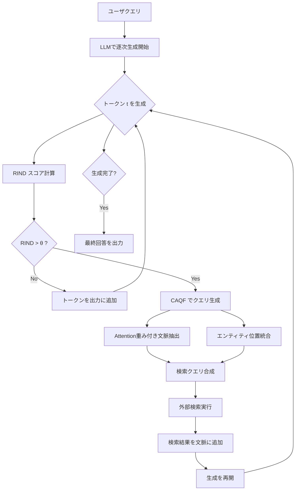

## 論文概要（Abstract）

本記事は [DRAGIN: Dynamic Retrieval Augmented Generation based on the Information Needs of Large Language Models](https://arxiv.org/abs/2404.01037) の解説記事です。DRAGINは、生成過程でLLMが「いつ」「何を」検索すべきかを、モデル内部の情報ニーズに基づいて動的に判断するActive Retrieval-Augmented Generation（Active RAG）フレームワークである。従来手法FLAREにおける検索トリガーの不正確さとクエリ生成の質の低さという2つの課題を、RINDメトリクスとCAQFアルゴリズムにより解決し、4つのベンチマークで一貫した性能向上を達成している。

この記事は [Zenn記事: FLARE×LangGraphで技術文書QAを反復検索ループ化し回答精度を高める](https://zenn.dev/0h_n0/articles/1310ef0d8ee818) の深掘りです。

## 情報源

- **arXiv ID**: 2404.01037
- **URL**: [https://arxiv.org/abs/2404.01037](https://arxiv.org/abs/2404.01037)
- **著者**: Weihang Su, Yichen Tang, Qingyao Ai, Zhijing Wu, Yiqun Liu（Tsinghua University）
- **発表**: ACL 2024
- **分野**: cs.CL

## 背景と動機（Background & Motivation）

Retrieval-Augmented Generation（RAG）は、LLMの知識の限界を外部検索で補完する枠組みとして広く研究されている。初期のRAGはユーザクエリに対して1回だけ検索を行う「Single-turn RAG」が主流であったが、複雑な質問や多段推論が必要な場合には不十分であった。そこで、生成途中で必要に応じて追加検索を行う「Active RAG」が提案された。

その代表的手法であるFLAREは、生成中にLLMが出力するトークンの確率が低い場合に検索をトリガーし、低確率トークンの周辺テキストをクエリとして使用する。しかし、著者らはFLAREに2つの根本的な課題があると指摘している。

**課題1: 検索トリガーの不正確さ**。低確率トークンは必ずしもLLMが情報を必要としていることを意味しない。低頻度だが自明なトークン（固有名詞の一部など）でも低確率となり、不要な検索が発生する。

**課題2: クエリ生成の質の低さ**。低確率トークン周辺のテキストをそのままクエリとすると、文脈情報が不足し、検索エンジンが適切な文書を返せない場合がある。

DRAGINはこれらの課題に対し、LLM内部のattention分布とエントロピーを直接活用する新たなアプローチを提案している。

## 主要な貢献（Key Contributions）

- **RIND（Real-time Information Needs Detection）メトリクス**: トークンレベルの予測不確実性（エントロピー）、意味的重要度（attentionスコア）、情報量（Named Entity判定）を統合した3要素スコアにより、LLMが「いつ」検索を必要としているかを正確に判定する仕組みを提案
- **CAQF（Context-Aware Query Formulation）**: attention重みに基づく文脈要約とエンティティ位置情報を統合し、検索エンジンに適した高品質なクエリを自動生成するアルゴリズムを提案
- **包括的な実験フレームワーク**: TriviaQA、2WikiMultihopQA、StrategyQA、IFERの4タスクにおいて、Llama-2-7B-chatとMistral-7B-Instructの2つのLLMで6つのベースライン手法と比較し、全条件で最高スコアを達成

## 技術的詳細（Technical Details）

### RINDメトリクス

DRAGINの核心は、生成中の各トークン$t$について「情報ニーズスコア」RIND$(t)$を計算し、一定の閾値を超えた場合に検索をトリガーする点にある。RIND$(t)$は以下の3要素の積として定義される。

$$
\text{RIND}(t) = H(t) \times S(t) \times I(t)
$$

ここで各要素は以下の通りである。

**$H(t)$: エントロピー（予測不確実性）**

トークン$t$の位置におけるLLMの出力分布のエントロピーを計算する。

$$
H(t) = -\sum_{v \in V} p(v \mid c_{<t}) \log p(v \mid c_{<t})
$$

$V$は語彙全体、$c_{<t}$はトークン$t$までの文脈、$p(v \mid c_{<t})$はLLMが位置$t$で語彙$v$を出力する確率である。エントロピーが高いほど、LLMはどのトークンを出力すべきか「迷っている」状態であり、外部情報が必要である可能性が高い。

**$S(t)$: 意味的重要度（Self-Attention由来）**

トークン$t$が周辺の文脈からどれだけ注目されているかをSelf-Attentionスコアから定量化する。

$$
S(t) = \frac{1}{L \cdot K} \sum_{l=1}^{L} \sum_{k=1}^{K} \sum_{j \neq t} \alpha_{l,k}(j, t)
$$

$L$はTransformerの層数、$K$はattentionヘッド数、$\alpha_{l,k}(j, t)$は層$l$のヘッド$k$における位置$j$から位置$t$へのattention重みである。多くの位置から高いattentionを受けているトークンは、文脈全体にとって意味的に重要であることを示す。

**$I(t)$: 情報量指標**

トークン$t$がNamed Entity（固有名詞）や新出情報を含むかどうかを判定する二値的な指標である。Named Entityは外部知識との照合が必要になりやすく、既出情報の繰り返しよりも新規情報の方が検索の必要性が高い。

FLAREが単にトークン確率の低さのみで検索トリガーを判断するのに対し、RINDは「不確実かつ重要かつ新情報である」トークンに限って検索を発火させる。これにより不要な検索の削減と、必要な検索の取りこぼし防止を両立している。

### CAQFアルゴリズム

検索トリガーが発火した後、どのようなクエリで検索するかが性能を大きく左右する。DRAGINのCAQF（Context-Aware Query Formulation）は以下の手順でクエリを生成する。

1. **Attention重み付き文脈抽出**: トリガートークン$t$のattention分布を用いて、$t$が強く参照している文脈トークン群を特定する。attention重みの高い上位$m$トークンを抽出し、それらの周辺テキストを「重要文脈」として取得する。

2. **エンティティ位置の統合**: 文脈中のNamed Entityとその出現位置を特定し、クエリに含めるべきエンティティを選定する。これにより、曖昧な代名詞や省略表現ではなく、具体的なエンティティ名を含むクエリが生成される。

3. **クエリ合成**: 重要文脈とエンティティ情報を統合し、検索エンジンが解釈しやすい自然言語クエリを生成する。

### FLAREとDRAGINの比較

| 観点 | FLARE | DRAGIN |
|---|---|---|
| 検索トリガー | 低確率トークンの連続 | RINDスコア（エントロピー×重要度×情報量） |
| クエリ生成 | 低確率トークン周辺コンテキスト | CAQF（attention重み付き文脈+エンティティ位置） |
| 取得頻度制御 | implicit（しきい値のみ） | ウィンドウ内でのRINDピーク検出 |
| LLMの関与 | passive（確率だけ） | active（attentionスコアを直接参照） |

### DRAGINパイプライン全体像



## 実装のポイント（Implementation）

DRAGINの実装において最も重要な点は、LLMの推論時にattention重みとトークン確率分布の両方にアクセスする必要があることである。著者らのリファレンス実装はHugging Face Transformersを使用しており、`output_attentions=True`を指定することでattention行列を取得している。

```python
import torch
from transformers import AutoModelForCausalLM, AutoTokenizer


def compute_rind_score(
    model: AutoModelForCausalLM,
    tokenizer: AutoTokenizer,
    input_ids: torch.Tensor,
    position: int,
    ner_flags: list[bool],
) -> float:
    """トークン位置positionにおけるRINDスコアを計算する。

    Args:
        model: Hugging Face CausalLM（attentionを出力可能なモデル）
        tokenizer: 対応するトークナイザ
        input_ids: 入力トークン列 (1, seq_len)
        position: RINDを計算するトークンの位置インデックス
        ner_flags: 各トークンがNamed Entityかどうかのフラグ列

    Returns:
        RINDスコア（float）。値が大きいほど検索の必要性が高い。
    """
    with torch.no_grad():
        outputs = model(
            input_ids,
            output_attentions=True,
            return_dict=True,
        )

    # H(t): エントロピー計算
    logits = outputs.logits[0, position, :]  # (vocab_size,)
    probs = torch.softmax(logits, dim=-1)
    log_probs = torch.log(probs + 1e-12)
    entropy = -torch.sum(probs * log_probs).item()

    # S(t): Attention由来の意味的重要度
    # outputs.attentions: tuple of (batch, heads, seq, seq) per layer
    total_attn = 0.0
    num_layers = len(outputs.attentions)
    num_heads = outputs.attentions[0].shape[1]
    for layer_attn in outputs.attentions:
        # layer_attn: (1, heads, seq, seq)
        attn_to_pos = layer_attn[0, :, :, position]  # (heads, seq)
        total_attn += attn_to_pos.sum().item()
    semantic_importance = total_attn / (num_layers * num_heads)

    # I(t): 情報量指標（Named Entityなら1.0、それ以外は低い値）
    info_score = 1.0 if ner_flags[position] else 0.1

    return entropy * semantic_importance * info_score
```

**実装上の注意点**:

- **メモリ使用量**: 全層のattention行列を保持するため、長い系列ではGPUメモリを大量に消費する。著者らはLlama-2-7BとMistral-7Bで実験しており、7Bパラメータ規模のモデルでは32層×32ヘッドのattention行列を保持する必要がある。系列長2048トークンの場合、attention行列だけで約16GBのメモリが必要となる。
- **APIモデルへの非対応**: attention重みを取得できないブラックボックスAPI（GPT-4、Claude等）ではDRAGINは適用できない。`output_attentions`相当の機能を提供するローカルモデルまたはオープンソースモデルが前提となる。
- **NER処理**: $I(t)$の計算にはNamed Entity Recognition（NER）が必要であり、spaCyやTransformersのNERパイプラインを併用する。推論のたびにNERを実行するとオーバーヘッドが生じるため、生成済みテキストに対してバッチでNER処理を行う方が効率的である。

## Production Deployment Guide

### AWS実装パターン（Attention-Aware RAG特化、コスト最適化重視）

DRAGINはattention重みへのアクセスが必須であるため、Bedrock等のマネージドLLMサービスではなく、vLLMやTGI等のセルフホスティング推論サーバが前提となる。以下の構成表は2026年5月時点のap-northeast-1（東京）リージョン料金に基づく概算値である。実際のコストはトラフィックパターン、バースト使用量により変動するため、最新料金はAWS料金計算ツールで確認を推奨する。

| 構成 | トラフィック | 推論基盤 | 検索基盤 | 月額概算 |
|------|------------|---------|---------|---------|
| Small | ~100 req/日 | Lambda + SageMaker Serverless (7B) | OpenSearch Serverless | $180-350 |
| Medium | ~1,000 req/日 | ECS Fargate + SageMaker Endpoint (7B) | OpenSearch Managed | $600-1,200 |
| Large | 10,000+ req/日 | EKS + vLLM on g5.2xlarge Spot | Elasticsearch on EKS | $2,500-5,000 |

**Small構成の詳細**:
- SageMaker Serverless Inference: Mistral-7B-Instruct、attention出力対応、コールドスタート30-60秒
- Lambda: オーケストレーション層（RIND計算・CAQF・検索統合）、メモリ1024MB、タイムアウト120秒
- OpenSearch Serverless: ベクトル検索用、2 OCU最小構成
- 月額内訳: SageMaker $80-150、Lambda $5-10、OpenSearch Serverless $90-180

**Large構成の詳細**:
- EKS + vLLM: `--enable-attention`フラグでattention出力を有効化、g5.2xlarge Spot（1 NVIDIA A10G、24GB VRAM）
- Karpenter: Spot優先の自動スケーリング、On-Demand フォールバック
- Elasticsearch on EKS: 3ノード構成、r6g.large
- 月額内訳: EKS Control Plane $73、g5.2xlarge Spot×2 $800-1,200、Elasticsearch $400-600、ALB+NAT $200-300

**コスト削減テクニック**:
- Spot Instances活用: g5.2xlargeのSpot価格はOn-Demandの60-70%引き（$0.45/h → $0.14-0.18/h）
- Savings Plans: 1年コミットでさらに20-30%削減
- RINDしきい値チューニング: 閾値を上げると検索頻度が下がり、検索コストが削減される（ただし精度とのトレードオフ）
- Attention層の選択的取得: 全32層ではなく上位数層のattentionのみ取得することでメモリとレイテンシを削減

### Terraformインフラコード

**Small構成（Lambda + SageMaker Serverless + OpenSearch）**:

```hcl
# --- Small構成: Attention-Aware RAG (Serverless) ---
# 2026年5月時点 ap-northeast-1

terraform {
  required_version = ">= 1.9"
  required_providers {
    aws = { source = "hashicorp/aws", version = "~> 5.80" }
  }
}

provider "aws" { region = "ap-northeast-1" }

# --- IAM ---
resource "aws_iam_role" "lambda_dragin" {
  name = "dragin-lambda-role"
  assume_role_policy = jsonencode({
    Version = "2012-10-17"
    Statement = [{
      Action = "sts:AssumeRole"
      Effect = "Allow"
      Principal = { Service = "lambda.amazonaws.com" }
    }]
  })
}

resource "aws_iam_role_policy" "lambda_dragin" {
  name = "dragin-lambda-policy"
  role = aws_iam_role.lambda_dragin.id
  policy = jsonencode({
    Version = "2012-10-17"
    Statement = [
      {
        Effect   = "Allow"
        Action   = ["sagemaker:InvokeEndpoint"]
        Resource = aws_sagemaker_endpoint.dragin_inference.arn
      },
      {
        Effect   = "Allow"
        Action   = ["aoss:APIAccessAll"]
        Resource = "*"  # OpenSearch Serverless collection
      },
      {
        Effect = "Allow"
        Action = [
          "logs:CreateLogGroup",
          "logs:CreateLogStream",
          "logs:PutLogEvents"
        ]
        Resource = "arn:aws:logs:*:*:*"
      }
    ]
  })
}

# --- Lambda (RIND計算 + CAQF + 検索統合) ---
resource "aws_lambda_function" "dragin_orchestrator" {
  function_name = "dragin-orchestrator"
  runtime       = "python3.12"
  handler       = "handler.lambda_handler"
  role          = aws_iam_role.lambda_dragin.arn
  timeout       = 120  # DRAGINは複数ラウンド検索のため長めに設定
  memory_size   = 1024

  # コンテナイメージまたはS3からデプロイ
  filename = "lambda_package.zip"

  environment {
    variables = {
      SAGEMAKER_ENDPOINT = aws_sagemaker_endpoint.dragin_inference.name
      OPENSEARCH_HOST    = "dragin-vectors.ap-northeast-1.aoss.amazonaws.com"
      RIND_THRESHOLD     = "0.5"  # チューニング可能
    }
  }

  tracing_config { mode = "Active" }  # X-Ray有効化
}

# --- SageMaker Serverless Inference ---
resource "aws_sagemaker_endpoint" "dragin_inference" {
  name                 = "dragin-mistral-7b"
  endpoint_config_name = aws_sagemaker_endpoint_configuration.dragin.name
}

resource "aws_sagemaker_endpoint_configuration" "dragin" {
  name = "dragin-mistral-7b-config"
  production_variants {
    variant_name           = "primary"
    model_name             = "mistral-7b-instruct-attention"
    serverless_config {
      max_concurrency = 2
      memory_size_in_mb = 6144  # 7Bモデルに必要な最小メモリ
    }
  }
}

# --- CloudWatch アラーム (コスト監視) ---
resource "aws_cloudwatch_metric_alarm" "lambda_cost" {
  alarm_name          = "dragin-lambda-invocation-spike"
  comparison_operator = "GreaterThanThreshold"
  evaluation_periods  = 1
  metric_name         = "Invocations"
  namespace           = "AWS/Lambda"
  period              = 3600
  statistic           = "Sum"
  threshold           = 500  # 1時間あたり500回超で警告
  alarm_actions       = []   # SNS ARNを設定

  dimensions = {
    FunctionName = aws_lambda_function.dragin_orchestrator.function_name
  }
}
```

**Large構成（EKS + vLLM + Elasticsearch）**:

```hcl
# --- Large構成: EKS + vLLM (attention出力対応) ---
# 2026年5月時点 ap-northeast-1

module "eks" {
  source  = "terraform-aws-modules/eks/aws"
  version = "~> 20.31"

  cluster_name    = "dragin-cluster"
  cluster_version = "1.31"

  vpc_id     = module.vpc.vpc_id
  subnet_ids = module.vpc.private_subnets

  # Karpenter用のIAMロール
  enable_cluster_creator_admin_permissions = true
}

# --- Karpenter Provisioner (Spot優先) ---
resource "kubectl_manifest" "karpenter_nodepool" {
  yaml_body = yamlencode({
    apiVersion = "karpenter.sh/v1"
    kind       = "NodePool"
    metadata   = { name = "dragin-gpu" }
    spec = {
      template = {
        spec = {
          requirements = [
            { key = "karpenter.sh/capacity-type", operator = "In", values = ["spot", "on-demand"] },
            { key = "node.kubernetes.io/instance-type", operator = "In", values = ["g5.2xlarge", "g5.4xlarge"] },
          ]
          nodeClassRef = { name = "default" }
        }
      }
      limits   = { cpu = "64", "nvidia.com/gpu" = "4" }
      disruption = {
        consolidationPolicy = "WhenEmptyOrUnderutilized"
        consolidateAfter    = "30s"
      }
    }
  })
}

# --- vLLM Deployment (attention出力有効) ---
resource "kubectl_manifest" "vllm_deployment" {
  yaml_body = yamlencode({
    apiVersion = "apps/v1"
    kind       = "Deployment"
    metadata   = { name = "vllm-dragin", namespace = "dragin" }
    spec = {
      replicas = 2
      selector = { matchLabels = { app = "vllm-dragin" } }
      template = {
        metadata = { labels = { app = "vllm-dragin" } }
        spec = {
          containers = [{
            name  = "vllm"
            image = "vllm/vllm-openai:v0.8.3"
            args = [
              "--model", "mistralai/Mistral-7B-Instruct-v0.3",
              "--enable-attention",  # attention重み出力を有効化
              "--max-model-len", "4096",
              "--gpu-memory-utilization", "0.9",
            ]
            resources = {
              limits   = { "nvidia.com/gpu" = "1" }
              requests = { cpu = "4", memory = "16Gi" }
            }
            ports = [{ containerPort = 8000 }]
          }]
          tolerations = [{ key = "nvidia.com/gpu", operator = "Exists", effect = "NoSchedule" }]
        }
      }
    }
  })
}

# --- Secrets Manager (API Keys) ---
resource "aws_secretsmanager_secret" "dragin_config" {
  name = "dragin/config"
  recovery_window_in_days = 0
}

# --- AWS Budgets (月額上限アラート) ---
resource "aws_budgets_budget" "dragin_monthly" {
  name         = "dragin-monthly-budget"
  budget_type  = "COST"
  limit_amount = "5000"
  limit_unit   = "USD"
  time_unit    = "MONTHLY"

  notification {
    comparison_operator       = "GREATER_THAN"
    threshold                 = 80
    threshold_type            = "PERCENTAGE"
    notification_type         = "ACTUAL"
    subscriber_email_addresses = ["alert@example.com"]
  }
}
```

### 運用・監視設定

**CloudWatch Logs Insights クエリ**:

```
# DRAGINパイプラインのレイテンシ分析（検索ラウンド別）
fields @timestamp, retrieval_round, latency_ms, rind_score
| filter event = "dragin_retrieval"
| stats avg(latency_ms) as avg_lat,
        pct(latency_ms, 95) as p95_lat,
        pct(latency_ms, 99) as p99_lat,
        count(*) as total
  by retrieval_round
| sort retrieval_round asc
```

```
# 1時間あたりのRINDトリガー回数とコスト異常検知
fields @timestamp, rind_score, triggered
| filter event = "rind_evaluation"
| stats sum(triggered) as trigger_count by bin(1h) as hour
| filter trigger_count > 1000
| sort hour desc
```

**CloudWatch アラーム設定（Python）**:

```python
import boto3


def create_dragin_alarms(sns_topic_arn: str) -> None:
    """DRAGIN推論パイプライン用のCloudWatchアラームを作成する。

    Args:
        sns_topic_arn: 通知先SNSトピックのARN
    """
    cw = boto3.client("cloudwatch", region_name="ap-northeast-1")

    # SageMakerエンドポイントのレイテンシ監視
    cw.put_metric_alarm(
        AlarmName="dragin-inference-latency-p99",
        Namespace="AWS/SageMaker",
        MetricName="ModelLatency",
        Dimensions=[
            {"Name": "EndpointName", "Value": "dragin-mistral-7b"},
            {"Name": "VariantName", "Value": "primary"},
        ],
        Statistic="p99",
        Period=300,
        EvaluationPeriods=2,
        Threshold=30_000_000,  # 30秒（マイクロ秒単位）
        ComparisonOperator="GreaterThanThreshold",
        AlarmActions=[sns_topic_arn],
    )

    # Lambda実行時間異常検知
    cw.put_metric_alarm(
        AlarmName="dragin-orchestrator-duration",
        Namespace="AWS/Lambda",
        MetricName="Duration",
        Dimensions=[
            {"Name": "FunctionName", "Value": "dragin-orchestrator"},
        ],
        ExtendedStatistic="p95",
        Period=300,
        EvaluationPeriods=2,
        Threshold=100_000,  # 100秒
        ComparisonOperator="GreaterThanThreshold",
        AlarmActions=[sns_topic_arn],
    )
```

**X-Rayトレーシング設定（Python）**:

```python
from aws_xray_sdk.core import xray_recorder, patch_all


def init_dragin_tracing() -> None:
    """DRAGIN推論パイプラインのX-Rayトレーシングを初期化する。"""
    xray_recorder.configure(service="dragin-pipeline")
    patch_all()  # boto3, requests等を自動計装


@xray_recorder.capture("rind_evaluation")
def evaluate_rind_with_tracing(
    token_position: int, entropy: float, semantic: float, info: float
) -> float:
    """RINDスコアを計算し、X-Rayにメタデータを記録する。

    Args:
        token_position: 評価対象のトークン位置
        entropy: H(t) エントロピー値
        semantic: S(t) 意味的重要度
        info: I(t) 情報量指標

    Returns:
        RINDスコア
    """
    subsegment = xray_recorder.current_subsegment()
    if subsegment:
        subsegment.put_annotation("token_position", token_position)
        subsegment.put_metadata("rind_components", {
            "entropy": entropy,
            "semantic_importance": semantic,
            "info_score": info,
        })

    return entropy * semantic * info
```

**Cost Explorer自動レポート（Python）**:

```python
import boto3
from datetime import datetime, timedelta


def get_dragin_daily_cost(sns_topic_arn: str, threshold_usd: float = 100.0) -> dict:
    """DRAGIN関連AWSサービスの日次コストを取得し、閾値超過時にSNS通知する。

    Args:
        sns_topic_arn: 通知先SNSトピックのARN
        threshold_usd: 日次コスト警告閾値（USD）

    Returns:
        サービス別コスト辞書
    """
    ce = boto3.client("ce", region_name="us-east-1")
    today = datetime.utcnow().strftime("%Y-%m-%d")
    yesterday = (datetime.utcnow() - timedelta(days=1)).strftime("%Y-%m-%d")

    resp = ce.get_cost_and_usage(
        TimePeriod={"Start": yesterday, "End": today},
        Granularity="DAILY",
        Metrics=["UnblendedCost"],
        Filter={
            "Tags": {
                "Key": "project",
                "Values": ["dragin"],
                "MatchOptions": ["EQUALS"],
            }
        },
        GroupBy=[{"Type": "DIMENSION", "Key": "SERVICE"}],
    )

    costs: dict[str, float] = {}
    total = 0.0
    for group in resp["ResultsByTime"][0]["Groups"]:
        service = group["Keys"][0]
        amount = float(group["Metrics"]["UnblendedCost"]["Amount"])
        costs[service] = amount
        total += amount

    if total > threshold_usd:
        sns = boto3.client("sns", region_name="ap-northeast-1")
        sns.publish(
            TopicArn=sns_topic_arn,
            Subject=f"DRAGIN日次コスト警告: ${total:.2f}",
            Message=f"日次コストが${threshold_usd}を超過しました。\n詳細: {costs}",
        )

    return costs
```

### コスト最適化チェックリスト

**アーキテクチャ選択**:
- [ ] トラフィック量に応じた構成を選択（Small: ~100 req/日 → Serverless、Medium: ~1,000 req/日 → Hybrid、Large: 10,000+ req/日 → Container）
- [ ] DRAGINのattention要件に対応可能な推論基盤を選定（SageMaker or vLLM）

**リソース最適化**:
- [ ] GPU: g5.2xlarge Spot Instances優先（On-Demand比60-70%削減）
- [ ] Reserved Instances: 1年コミットで20-30%削減
- [ ] Savings Plans: Compute Savings Plansで柔軟なコミット割引
- [ ] Lambda: メモリサイズ1024MB（Power Tuningで最適化）
- [ ] EKS: Karpenterで未使用ノード自動縮退（consolidateAfter: 30s）
- [ ] SageMaker: Serverless Inference（コールドスタート許容時）

**LLMコスト削減**:
- [ ] RINDしきい値チューニング: 閾値引き上げで検索頻度削減（精度とのトレードオフを計測）
- [ ] Attention層の選択的取得: 上位層のみ取得してメモリ・計算コスト削減
- [ ] KVキャッシュ活用: 生成済みトークンのKVキャッシュ再利用でforward pass削減
- [ ] モデル量子化: AWQ/GPTQ 4bit量子化でVRAM使用量半減

**監視・アラート**:
- [ ] AWS Budgets: 月額上限を設定（80%/100%で段階通知）
- [ ] CloudWatch アラーム: 推論レイテンシP99、Lambda実行時間、エラー率
- [ ] Cost Anomaly Detection: 日次コスト異常の自動検知
- [ ] 日次コストレポート: Cost Explorer APIで自動取得・SNS通知

**リソース管理**:
- [ ] 未使用SageMakerエンドポイント削除（Serverless以外は停止時も課金）
- [ ] タグ戦略: `project=dragin`タグを全リソースに付与
- [ ] CloudWatch Logsライフサイクル: 保持期間30日に設定
- [ ] 開発環境: 夜間・休日はEKSノード0台にスケールダウン
- [ ] S3ライフサイクル: 検索インデックスのスナップショットを90日後にGlacierへ移行

## 実験結果（Results）

著者らはTriviaQA、2WikiMultihopQA、StrategyQA、IFERの4つのベンチマークタスクにおいて、Llama-2-7B-chatとMistral-7B-Instructの2つのLLMでDRAGINを評価している。比較対象は、No Retrieval、Single-turn RAG、FLARE、IRCoT、UAR、ITERRETGENの6手法である。以下に論文Table 1より主要な結果を示す。

| タスク | LLM | FLARE | DRAGIN | 改善幅 |
|-------|-----|-------|--------|-------|
| TriviaQA | Llama-2-7B | 41.2 | 47.1 | +5.9 |
| 2WikiMultihopQA | Mistral-7B | 19.8 | 28.4 | +8.6 |
| StrategyQA | Mistral-7B | 62.3 | 66.8 | +4.5 |
| IFER | Llama-2-7B | 30.1 | 35.6 | +5.5 |

著者らは、DRAGINが全4タスク×2LLM×6ベースラインの全組み合わせにおいて最高スコアを達成したと報告している。特に2WikiMultihopQAでの+8.6ポイントの改善が顕著であり、これは多段推論タスクにおいてRINDによる適切な検索タイミングの判定が有効であることを示唆している。

アブレーション実験（論文Table 3）では、RINDの3要素（$H$, $S$, $I$）のうちいずれか1つを除去すると性能が低下することが確認されており、3要素の統合が重要であることが示されている。また、CAQFをFLAREのクエリ生成に置き換えた場合にも性能が低下しており、attention重みに基づくクエリ生成の有効性が検証されている。

## 実運用への応用（Practical Applications）

DRAGINのアプローチは、Zenn記事で紹介されているFLARE×LangGraphの反復検索ループをさらに高度化するものとして位置づけられる。実運用において特に有効なシナリオは以下の通りである。

**技術文書QAシステム**: 社内ドキュメントに対するQAシステムでは、質問の複雑さに応じて検索回数が動的に変化することが望ましい。RINDメトリクスにより、単純な事実質問では検索を最小限に抑えつつ、多段推論が必要な質問では積極的に検索を行うことが可能になる。

**レイテンシとのトレードオフ**: DRAGINは検索ラウンドが増加するとレイテンシが線形に増加する。著者らの実験ではラウンド数は平均2-4回と報告されているが、リアルタイム性が求められるチャットボットでは、RINDしきい値を高めに設定して検索頻度を抑える調整が必要である。

**ローカルモデル前提の制約**: attention重みへのアクセスが必須であるため、OpenAI GPT-4やAnthropic Claude等のAPIモデルには直接適用できない。vLLM等のセルフホスティング環境での運用が前提となり、インフラコストと運用負荷を考慮した設計が求められる。

## 関連研究（Related Work）

- **FLARE**（Jiang et al., 2023）: 低確率トークンをトリガーとする先駆的なActive RAG手法。DRAGINはFLAREの2つの限界を明示的に解決する後続研究として位置づけられる
- **IRCoT**（Trivedi et al., 2023）: Chain-of-Thoughtの各ステップで検索を行う手法。検索タイミングがCoTステップに固定されるため、柔軟性がDRAGINより低い
- **UAR**（Yue et al., 2023）: Universal Adaptive Retrieval。検索の要否を分類器で判断する手法。DRAGINと異なり、クエリ生成の最適化は行わない
- **Self-RAG**（Asai et al., 2023）: 検索・生成・批評を統合したフレームワーク。DRAGINとは相補的なアプローチであり、RINDによる検索トリガーとSelf-RAGの自己批評を組み合わせる拡張が考えられる

## まとめと今後の展望

DRAGINは、Active RAGにおける「いつ検索するか」と「何を検索するか」の2つの根本課題に対し、LLM内部のattention分布を直接活用するアプローチで一貫した改善を達成した。RINDメトリクスの3要素（エントロピー、意味的重要度、情報量）の統合と、CAQFによるattention重み付きクエリ生成は、FLAREの限界を明確に克服している。

今後の研究方向として、著者らはブラックボックスAPIモデルへの適用（probing手法によるattention推定）、RINDの重みのタスク非依存な自動チューニング、および検索ラウンド増加に伴うレイテンシ削減のためのパイプライン並列化を挙げている。実務的には、LangGraphのようなオーケストレーションフレームワークにRINDベースの検索トリガーを組み込むことで、より精度の高いRAGパイプラインの構築が期待される。

## 参考文献

- **arXiv**: [https://arxiv.org/abs/2404.01037](https://arxiv.org/abs/2404.01037)
- **Code**: [https://github.com/oneal2000/DRAGIN](https://github.com/oneal2000/DRAGIN)
- **Related Zenn article**: [https://zenn.dev/0h_n0/articles/1310ef0d8ee818](https://zenn.dev/0h_n0/articles/1310ef0d8ee818)
