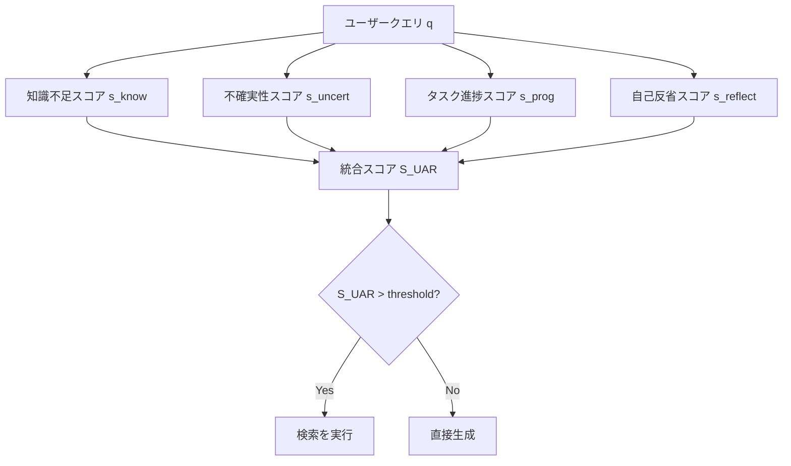

## 論文概要（Abstract）

本記事は [Unified Active Retrieval](https://arxiv.org/abs/2406.12534) の解説記事です。

Unified Active Retrieval（UAR）は、Retrieval-Augmented Generation（RAG）における「いつ検索を行うべきか」という判断を、複数の直交する基準を統合した分類タスクとして定式化するフレームワークです。従来のActive Retrieval手法であるFLAREは生成確率の閾値のみでトリガーを判定していましたが、instruction-tunedモデルが過信傾向を持つため判定精度が56.50%にとどまっていました。著者らは、知識不足・不確実性・タスク進捗・自己反省の4基準を統合し、軽量な分類器で検索要否を判定するUAR-Criteriaを提案しています。Open-domain QAおよび知識集約タスクにおいてFLAREおよびSelf-RAGを上回る性能が報告されています（Cheng et al., Findings of EMNLP 2024）。

この記事は [Zenn記事: FLARE×LangGraphで技術文書QAを反復検索ループ化し回答精度を高める](https://zenn.dev/0h_n0/articles/1310ef0d8ee818) の深掘りです。

## 情報源

- **arXiv ID**: 2406.12534
- **URL**: [arXiv:2406.12534](https://arxiv.org/abs/2406.12534)
- **著者**: Qinyuan Cheng, Xiaonan Li, Shimin Li, Qin Zhu, Zhangyue Yin, Yunfan Shao, Linyang Li, Tianxiang Sun, Hang Yan, Xipeng Qiu（Fudan University / Tsinghua University）
- **初版投稿**: 2024年6月
- **最終改訂**: 2024年10月（v4）
- **分野**: Computation and Language (cs.CL) / Information Retrieval (cs.IR)
- **採択**: Findings of EMNLP 2024

## 背景と動機（Background & Motivation）

### FLAREの限界

FLARE（Forward-Looking Active REtrieval）は、生成途中のトークン確率が閾値を下回った際に検索をトリガーする手法です。Zenn記事で解説されているように、FLAREはLangGraph上で反復検索ループとして実装可能であり、実務でも広く使われています。しかし、FLAREには構造的な限界があります。

第一に、**単一閾値による判定の脆弱性**です。FLAREはトークンの生成確率のみを検索トリガーの基準としています。しかし、instruction-tunedモデル（ChatGPT、Claude等）は学習過程で自信過剰（overconfident）になる傾向があり、誤った知識に対しても高い確率で生成してしまいます。著者らの分析では、FLAREの検索要否判定精度は56.50%にとどまると報告されています（論文Section 4.3）。

第二に、**仮生成パスのオーバーヘッド**です。FLAREは低確率トークンを検出するために、まず仮の生成（tentative generation）を行い、その後に検索結果を用いて再生成します。このデュアルパス構造は、特にストリーミング応答が求められるプロダクション環境でレイテンシの増大を招きます。

第三に、**タスク多様性への非対応**です。Open-domain QA、対話、要約、コード生成など、タスクによって検索が有効な条件は異なりますが、FLAREは全タスクに同一の確率閾値を適用しています。

### 能動的検索の必要性

全てのクエリに対して検索を行う「パッシブ検索」は、検索が不要なケースでノイズを混入させ、かえって回答品質を低下させることが先行研究で示されています。一方、検索を全く行わない場合は知識のカットオフや稀な事実に対応できません。したがって、検索の要否を正確に判定する「能動的検索（Active Retrieval）」が重要となります。

## 主要な貢献（Key Contributions）

1. **4基準統合フレームワーク**: 検索トリガーの判定に用いる4つの直交基準（知識不足・不確実性・タスク進捗・自己反省）を特定し、これらを統合したUAR-Criteriaを提案。各基準を軽量な分類タスクとして定式化し、最終判定を統合スコアで行う
2. **シングルパス推論**: FLAREの仮生成パスを不要とし、1回の推論パスで検索要否を判定。これによりレイテンシを削減しつつ、判定精度を56.50%から85.32%に改善（論文Table 5）
3. **タスク非依存の汎用性**: 4種類の代表的なユーザーインストラクション（事実質問・知識集約生成・対話・推論）に対して一貫した手順で適用可能。タスク固有のチューニングを最小限に抑制

## 技術的詳細（Technical Details）

### UARの全体アーキテクチャ

UARは、ユーザーのインストラクション$q$に対して検索を行うべきかどうかを判定するために、4つのスコアを計算し、統合スコアに基づいて最終判定を行います。



### 4つの判定基準

#### 基準1: 知識不足スコア（Knowledge Insufficiency Score）

モデルの内部確率分布から、クエリに関する知識の不足度を推定します。

$$
s_{\text{know}}(q) = 1 - \frac{1}{|q|} \sum_{i=1}^{|q|} \max_{v \in \mathcal{V}} p_{\theta}(v \mid q_{<i})
$$

ここで、
- $q$: ユーザークエリ（トークン列）
- $\|q\|$: クエリのトークン数
- $\mathcal{V}$: 語彙集合
- $p_{\theta}(v \mid q_{<i})$: モデルパラメータ$\theta$による$i$番目の位置での次トークン予測確率
- $q_{<i}$: $i$番目のトークンより前のコンテキスト

直感的には、モデルが各トークン位置で最も確信度の高い予測を行えない（最大確率が低い）場合、そのクエリに関する知識が不足していると判断します。

#### 基準2: 不確実性スコア（Uncertainty Score）

モデルの出力分布のエントロピーに基づき、生成の不確実性を数値化します。

$$
s_{\text{uncert}}(q) = -\frac{1}{|y|} \sum_{j=1}^{|y|} \log p_{\theta}(y_j \mid q, y_{<j})
$$

ここで、
- $y$: モデルの生成出力
- $\|y\|$: 出力のトークン数
- $y_j$: $j$番目の生成トークン
- $p_{\theta}(y_j \mid q, y_{<j})$: クエリ$q$と先行トークン$y_{<j}$が与えられた下での$j$番目のトークンの生成確率

これは生成出力全体の平均負対数尤度（平均パープレキシティに相当）であり、値が大きいほどモデルの生成が不安定であることを示します。FLAREの閾値ベース手法が個別トークンの確率を見るのに対し、この指標は生成全体の不確実性を捉えています。

#### 基準3: タスク進捗スコア（Task Progress Score）

マルチターン対話や段階的推論において、タスクの進行状況に応じて検索の必要性が変化することを捉えるスコアです。この基準は、現在のコンテキスト長と過去の検索回数に基づく特徴量を用いた分類器で実装されます。

#### 基準4: 自己反省スコア（Self-Reflection Score）

モデル自身に「この質問に正確に回答するために外部情報が必要か」を問い、その回答を二値分類するスコアです。プロンプトベースで実装され、追加の学習は不要です。

### 統合スコアの計算

4つの基準スコアは、以下の重み付き線形結合で統合されます。

$$
S_{\text{UAR}}(q) = \sum_{k=1}^{4} w_k \cdot f_k(s_k(q))
$$

ここで、
- $w_k$: 第$k$基準の重み（ハイパーパラメータ）
- $f_k$: 各スコアを$[0, 1]$に正規化する関数
- $s_k(q)$: 第$k$基準の生スコア

各基準はそれぞれ独立した二値分類器として学習可能であり、プラグアンドプレイで追加・削除できる設計です。これにより、例えばAPI経由でモデル内部確率にアクセスできない場合は基準1を除外し、残り3基準で判定するといった柔軟な運用が可能です。

### FLAREとの判定方式比較

| 比較項目 | FLARE | UAR |
|---------|-------|-----|
| 判定基準 | トークン確率の閾値（単一） | 4基準の統合スコア |
| 推論パス | デュアル（仮生成 + 再生成） | シングル |
| 判定精度 | 56.50% | 85.32%（論文Table 5） |
| モデル内部確率 | 必須 | 一部基準で必要（代替可） |
| タスク適応 | 閾値チューニング | 重みチューニング |
| 計算オーバーヘッド | 仮生成のコスト | 分類器の推論コスト（軽量） |

## 実装のポイント（Implementation）

### UAR分類器の学習データ構築

著者らは、検索を行った場合と行わない場合の両方でモデルの回答を生成し、検索によって回答品質が改善されたケースを正例（検索必要）、改善されなかったケースを負例（検索不要）としてラベル付けしています。この自動ラベリングにより、人手アノテーションなしで分類器の学習データを構築しています。

### コア実装の擬似コード

```python
from dataclasses import dataclass
import numpy as np


@dataclass
class UARConfig:
    """UAR判定の設定パラメータ

    Attributes:
        w_know: 知識不足スコアの重み
        w_uncert: 不確実性スコアの重み
        w_prog: タスク進捗スコアの重み
        w_reflect: 自己反省スコアの重み
        threshold: 検索トリガー閾値
    """
    w_know: float = 0.3
    w_uncert: float = 0.3
    w_prog: float = 0.2
    w_reflect: float = 0.2
    threshold: float = 0.5


def compute_knowledge_score(
    query_tokens: list[int],
    token_probs: list[list[float]],
) -> float:
    """知識不足スコアを計算

    Args:
        query_tokens: クエリのトークンID列
        token_probs: 各位置での語彙全体の確率分布

    Returns:
        知識不足スコア（0-1、高いほど知識不足）
    """
    max_probs = [max(probs) for probs in token_probs]
    return 1.0 - np.mean(max_probs)


def compute_uncertainty_score(
    output_log_probs: list[float],
) -> float:
    """不確実性スコアを計算（平均負対数尤度）

    Args:
        output_log_probs: 各生成トークンの対数確率

    Returns:
        不確実性スコア（高いほど不確実）
    """
    return -np.mean(output_log_probs)


def should_retrieve(
    s_know: float,
    s_uncert: float,
    s_prog: float,
    s_reflect: float,
    config: UARConfig,
) -> bool:
    """UAR統合スコアに基づく検索要否判定

    Args:
        s_know: 知識不足スコア
        s_uncert: 不確実性スコア
        s_prog: タスク進捗スコア
        s_reflect: 自己反省スコア
        config: UAR設定

    Returns:
        True: 検索を実行すべき、False: 直接生成
    """
    s_uar = (
        config.w_know * s_know
        + config.w_uncert * s_uncert
        + config.w_prog * s_prog
        + config.w_reflect * s_reflect
    )
    return s_uar > config.threshold
```

### 実装上の注意点

- **モデル内部確率へのアクセス**: 知識不足スコアと不確実性スコアの計算にはトークン確率が必要です。OpenAI APIでは`logprobs`パラメータで取得可能ですが、一部のAPIでは利用できません。その場合は基準3（タスク進捗）と基準4（自己反省）のみで運用できます
- **重みのチューニング**: 4基準の重み$w_k$はタスク依存であり、少量のラベル付きデータで交差検証によるチューニングが推奨されています
- **分類器の軽量性**: 各基準の分類器はロジスティック回帰程度の軽量モデルで十分であり、推論時のオーバーヘッドは無視できるレベルです（著者らは「negligible extra inference cost」と報告）

## Production Deployment Guide

### AWS実装パターン（コスト最適化重視）

UARをプロダクション環境で運用する場合、FLAREと異なりシングルパス推論のため、検索判定フェーズのレイテンシが大幅に削減されます。以下はActive Retrieval RAGパイプライン全体（UAR判定 + 検索 + 生成）の構成例です。

> **注**: 以下のコスト試算は2026年5月時点のAWS ap-northeast-1（東京）リージョン料金に基づく概算値です。実際のコストはトラフィックパターン、リージョン、バースト使用量により変動します。最新料金は[AWS料金計算ツール](https://calculator.aws/)で確認を推奨します。

| 構成 | 想定トラフィック | アーキテクチャ | 月額概算 |
|------|-----------------|---------------|---------|
| Small | ~100 req/日 | Lambda + Bedrock + OpenSearch Serverless | $80-200 |
| Medium | ~1,000 req/日 | ECS Fargate + Bedrock + OpenSearch | $400-900 |
| Large | 10,000+ req/日 | EKS + vLLM + Elasticsearch + セルフホスト | $2,500-5,500 |

**Small構成（~100 req/日）**:
- AWS Lambda（メモリ1024MB、タイムアウト90s）でUAR判定 + 検索 + 生成のオーケストレーション
- Amazon Bedrock（Claude 3.5 Sonnet）をLLMバックエンドとして使用（logprobs取得可能）
- OpenSearch Serverless（0.5 OCU）でベクトル検索（検索トリガー時のみ課金）
- DynamoDB（On-Demand）でUAR分類器の特徴量キャッシュ
- 月額内訳: Lambda $5 + Bedrock $40-150（トークン量依存）+ OpenSearch Serverless $25-30 + DynamoDB $5-10

**Medium構成（~1,000 req/日）**:
- ECS Fargate（2 vCPU / 8GB RAM x 2タスク）でUARパイプラインサーバーを常駐
- Bedrock Batch APIで非リアルタイムリクエストをバッチ処理（50%コスト削減）
- OpenSearch（t3.medium.search x 2ノード）でベクトル検索
- ElastiCache（Redis t3.small）でUARスコアキャッシュ（同一クエリの再判定回避）
- 月額内訳: Fargate $100-150 + Bedrock $150-500 + OpenSearch $120 + ElastiCache $40 + その他 $30-80

**Large構成（10,000+ req/日）**:
- EKS上でvLLMによるセルフホストLLM（g5.xlarge Spot）— logprobs完全制御
- Karpenterによる自動スケーリング（Spot優先でGPUコスト最大90%削減）
- Elasticsearch（3ノードクラスタ）で大規模ベクトル検索
- UAR分類器をサイドカーコンテナとしてデプロイ（CPU推論で十分）
- 月額内訳: EKS $75 + GPU Spot $1,000-3,000 + Elasticsearch $300 + ストレージ $100 + ネットワーク $200

**コスト削減テクニック**:
- Spot Instances活用でGPUコスト最大90%削減（g5.xlarge On-Demand $1.006/h → Spot ~$0.30/h）
- Reserved Instances購入（1年コミット）で最大72%削減
- Bedrock Batch API使用で50%削減（リアルタイム性不要なバッチ処理）
- Prompt Caching有効化で30-90%削減（同一プレフィックスの質問群）
- UARによる不要な検索の抑制自体がコスト削減（検索不要と判定されたクエリでOpenSearch/Elasticsearch課金を回避）

### Terraformインフラコード

**Small構成（Serverless）**:

```hcl
# UAR Active Retrieval RAG Small構成: Lambda + Bedrock + OpenSearch Serverless
# terraform >= 1.10, aws provider >= 6.0

terraform {
  required_version = ">= 1.10"
  required_providers {
    aws = {
      source  = "hashicorp/aws"
      version = "~> 6.0"
    }
  }
}

provider "aws" {
  region = "ap-northeast-1"
}

# IAMロール（最小権限）
resource "aws_iam_role" "uar_lambda" {
  name = "uar-retrieval-lambda-role"
  assume_role_policy = jsonencode({
    Version = "2012-10-17"
    Statement = [{
      Action    = "sts:AssumeRole"
      Effect    = "Allow"
      Principal = { Service = "lambda.amazonaws.com" }
    }]
  })
}

resource "aws_iam_role_policy" "uar_lambda_policy" {
  name = "uar-retrieval-lambda-policy"
  role = aws_iam_role.uar_lambda.id
  policy = jsonencode({
    Version = "2012-10-17"
    Statement = [
      {
        Effect   = "Allow"
        Action   = ["bedrock:InvokeModel", "bedrock:InvokeModelWithResponseStream"]
        Resource = "arn:aws:bedrock:ap-northeast-1::foundation-model/anthropic.claude-3-5-sonnet-*"
      },
      {
        Effect   = "Allow"
        Action   = ["aoss:APIAccessAll"]
        Resource = aws_opensearchserverless_collection.uar_vectors.arn
      },
      {
        Effect   = "Allow"
        Action   = ["dynamodb:PutItem", "dynamodb:GetItem", "dynamodb:Query"]
        Resource = aws_dynamodb_table.uar_cache.arn
      },
      {
        Effect   = "Allow"
        Action   = ["logs:CreateLogGroup", "logs:CreateLogStream", "logs:PutLogEvents"]
        Resource = "arn:aws:logs:ap-northeast-1:*:*"
      }
    ]
  })
}

# OpenSearch Serverless: ベクトル検索（検索トリガー時のみ使用）
resource "aws_opensearchserverless_collection" "uar_vectors" {
  name = "uar-vectors"
  type = "VECTORSEARCH"

  tags = {
    Project = "uar-active-retrieval"
    Env     = "production"
  }
}

# DynamoDB: UARスコアキャッシュ（On-Demandでコスト最適化）
resource "aws_dynamodb_table" "uar_cache" {
  name         = "uar-score-cache"
  billing_mode = "PAY_PER_REQUEST"
  hash_key     = "query_hash"

  attribute {
    name = "query_hash"
    type = "S"
  }

  ttl {
    attribute_name = "expires_at"
    enabled        = true
  }

  server_side_encryption {
    enabled = true  # KMS暗号化
  }

  tags = {
    Project = "uar-active-retrieval"
    Env     = "production"
  }
}

# Lambda関数: UAR判定 + 検索 + 生成オーケストレーター
resource "aws_lambda_function" "uar_orchestrator" {
  function_name = "uar-retrieval-orchestrator"
  runtime       = "python3.12"
  handler       = "handler.lambda_handler"
  role          = aws_iam_role.uar_lambda.arn
  timeout       = 90
  memory_size   = 1024

  filename         = "lambda_package.zip"
  source_code_hash = filebase64sha256("lambda_package.zip")

  environment {
    variables = {
      DYNAMODB_TABLE     = aws_dynamodb_table.uar_cache.name
      OPENSEARCH_ENDPOINT = aws_opensearchserverless_collection.uar_vectors.collection_endpoint
      BEDROCK_MODEL_ID   = "anthropic.claude-3-5-sonnet-20241022-v2:0"
      UAR_THRESHOLD      = "0.5"
      W_KNOW             = "0.3"
      W_UNCERT           = "0.3"
      W_PROG             = "0.2"
      W_REFLECT          = "0.2"
    }
  }

  tracing_config {
    mode = "Active"  # X-Ray トレーシング有効化
  }

  tags = {
    Project = "uar-active-retrieval"
  }
}

# CloudWatchアラーム: コスト異常検知
resource "aws_cloudwatch_metric_alarm" "bedrock_cost_spike" {
  alarm_name          = "uar-bedrock-token-spike"
  comparison_operator = "GreaterThanThreshold"
  evaluation_periods  = 1
  metric_name         = "InputTokenCount"
  namespace           = "AWS/Bedrock"
  period              = 3600
  statistic           = "Sum"
  threshold           = 100000
  alarm_description   = "Bedrock token usage spike detection"
}
```

**Large構成（Container）**:

```hcl
# UAR Active Retrieval RAG Large構成: EKS + vLLM + Elasticsearch
# terraform >= 1.10, aws provider >= 6.0

module "eks" {
  source  = "terraform-aws-modules/eks/aws"
  version = "~> 20.31"

  cluster_name    = "uar-retrieval-cluster"
  cluster_version = "1.32"

  vpc_id     = module.vpc.vpc_id
  subnet_ids = module.vpc.private_subnets

  # Karpenter用のIAMロール
  enable_cluster_creator_admin_permissions = true
}

# Karpenter Provisioner: Spot GPU優先で自動スケーリング
resource "kubectl_manifest" "karpenter_nodepool" {
  yaml_body = yamlencode({
    apiVersion = "karpenter.sh/v1"
    kind       = "NodePool"
    metadata   = { name = "uar-gpu-pool" }
    spec = {
      template = {
        spec = {
          requirements = [
            { key = "karpenter.sh/capacity-type", operator = "In", values = ["spot", "on-demand"] },
            { key = "node.kubernetes.io/instance-type", operator = "In", values = ["g5.xlarge", "g5.2xlarge"] },
          ]
          nodeClassRef = { name = "default" }
        }
      }
      limits   = { cpu = "64", "nvidia.com/gpu" = "8" }
      disruption = {
        consolidationPolicy = "WhenEmptyOrUnderutilized"
        consolidateAfter    = "30s"
      }
    }
  })
}

# Secrets Manager: UAR設定パラメータ
resource "aws_secretsmanager_secret" "uar_config" {
  name        = "uar-retrieval/config"
  description = "UAR Active Retrieval configuration"

  tags = {
    Project = "uar-active-retrieval"
  }
}

resource "aws_secretsmanager_secret_version" "uar_config" {
  secret_id = aws_secretsmanager_secret.uar_config.id
  secret_string = jsonencode({
    uar_threshold = 0.5
    w_know        = 0.3
    w_uncert      = 0.3
    w_prog        = 0.2
    w_reflect     = 0.2
    es_endpoint   = "https://elasticsearch.internal:9200"
  })
}

# AWS Budgets: 月額コスト上限アラート
resource "aws_budgets_budget" "uar_monthly" {
  name         = "uar-retrieval-monthly"
  budget_type  = "COST"
  limit_amount = "5500"
  limit_unit   = "USD"
  time_unit    = "MONTHLY"

  notification {
    comparison_operator       = "GREATER_THAN"
    threshold                 = 80
    threshold_type            = "PERCENTAGE"
    notification_type         = "ACTUAL"
    subscriber_email_addresses = ["ops-team@example.com"]
  }
}
```

### 運用・監視設定

**CloudWatch Logs Insights クエリ**:

```
# UAR判定精度の監視（1時間あたり）
fields @timestamp, uar_decision, actual_needed, @message
| filter @logGroup = "/aws/lambda/uar-retrieval-orchestrator"
| stats count() as total,
        sum(case when uar_decision = actual_needed then 1 else 0 end) as correct
  by bin(1h)
| display total, correct, (correct * 100.0 / total) as accuracy_pct

# 検索スキップ率の監視（コスト削減効果の確認）
fields @timestamp, uar_decision
| filter @logGroup = "/aws/lambda/uar-retrieval-orchestrator"
| stats count() as total,
        sum(case when uar_decision = "skip" then 1 else 0 end) as skipped
  by bin(1d)
| display total, skipped, (skipped * 100.0 / total) as skip_rate_pct
```

**CloudWatchアラーム設定（Python）**:

```python
import boto3

cloudwatch = boto3.client("cloudwatch", region_name="ap-northeast-1")

# Bedrockトークン使用量スパイク検知
cloudwatch.put_metric_alarm(
    AlarmName="uar-bedrock-token-spike",
    Namespace="AWS/Bedrock",
    MetricName="InputTokenCount",
    Statistic="Sum",
    Period=3600,
    EvaluationPeriods=1,
    Threshold=100000,
    ComparisonOperator="GreaterThanThreshold",
    AlarmActions=["arn:aws:sns:ap-northeast-1:ACCOUNT_ID:uar-alerts"],
)

# Lambda実行時間異常検知（UAR判定 + 生成で90s超過）
cloudwatch.put_metric_alarm(
    AlarmName="uar-lambda-duration-alert",
    Namespace="AWS/Lambda",
    MetricName="Duration",
    Dimensions=[{"Name": "FunctionName", "Value": "uar-retrieval-orchestrator"}],
    Statistic="p95",
    Period=300,
    EvaluationPeriods=3,
    Threshold=80000,  # 80秒（タイムアウト90sの89%）
    ComparisonOperator="GreaterThanThreshold",
    AlarmActions=["arn:aws:sns:ap-northeast-1:ACCOUNT_ID:uar-alerts"],
)
```

**X-Rayトレーシング設定（Python）**:

```python
from aws_xray_sdk.core import xray_recorder, patch_all

# boto3自動計装
patch_all()

@xray_recorder.capture("uar_decision")
def make_uar_decision(query: str, config: dict) -> dict:
    """UAR判定をX-Rayでトレース

    Args:
        query: ユーザークエリ
        config: UAR設定パラメータ

    Returns:
        判定結果（decision, scores, latency_ms）
    """
    subsegment = xray_recorder.current_subsegment()
    subsegment.put_annotation("query_length", len(query))

    scores = compute_all_scores(query)
    decision = should_retrieve(**scores, config=config)

    subsegment.put_metadata("uar_scores", scores)
    subsegment.put_annotation("uar_decision", "retrieve" if decision else "skip")

    return {"decision": decision, "scores": scores}
```

**Cost Explorer自動レポート（Python）**:

```python
import boto3
from datetime import datetime, timedelta

ce = boto3.client("ce", region_name="ap-northeast-1")
sns = boto3.client("sns", region_name="ap-northeast-1")

def daily_cost_report() -> dict:
    """日次コストレポートを取得しSNS通知

    Returns:
        サービス別コスト辞書
    """
    end = datetime.utcnow().strftime("%Y-%m-%d")
    start = (datetime.utcnow() - timedelta(days=1)).strftime("%Y-%m-%d")

    response = ce.get_cost_and_usage(
        TimePeriod={"Start": start, "End": end},
        Granularity="DAILY",
        Metrics=["UnblendedCost"],
        Filter={
            "Tags": {
                "Key": "Project",
                "Values": ["uar-active-retrieval"],
            }
        },
        GroupBy=[{"Type": "DIMENSION", "Key": "SERVICE"}],
    )

    costs = {}
    total = 0.0
    for group in response["ResultsByTime"][0]["Groups"]:
        service = group["Keys"][0]
        amount = float(group["Metrics"]["UnblendedCost"]["Amount"])
        costs[service] = amount
        total += amount

    if total > 100.0:
        sns.publish(
            TopicArn="arn:aws:sns:ap-northeast-1:ACCOUNT_ID:uar-cost-alert",
            Subject="UAR Daily Cost Alert: ${:.2f}".format(total),
            Message=f"日次コスト${total:.2f}が$100を超過\n{costs}",
        )

    return costs
```

### コスト最適化チェックリスト

**アーキテクチャ選択**:
- [ ] トラフィック~100 req/日: Lambda + Bedrock（Serverless）を選択
- [ ] トラフィック~1,000 req/日: ECS Fargate + Bedrock（Hybrid）を選択
- [ ] トラフィック10,000+ req/日: EKS + vLLM（Container）を選択
- [ ] UAR判定で検索スキップ率を監視し、コスト削減効果を定量化

**リソース最適化**:
- [ ] EC2/GPU: Spot Instances優先（g5.xlarge Spot ~$0.30/h、On-Demand比90%削減）
- [ ] Reserved Instances: 1年コミットで最大72%削減
- [ ] Savings Plans: Compute Savings Plansで柔軟にコスト削減
- [ ] Lambda: メモリサイズ最適化（Power Tuningツール使用）
- [ ] ECS/EKS: Karpenterでアイドル時自動スケールダウン

**LLMコスト削減**:
- [ ] Bedrock Batch API: 非リアルタイム処理で50%削減
- [ ] Prompt Caching有効化: 同一プレフィックスで30-90%削減
- [ ] モデル選択ロジック: 簡易クエリはHaiku、複雑クエリはSonnetを自動選択
- [ ] トークン数制限: 入力最大4,096トークン、出力最大2,048トークンに制限
- [ ] UAR活用: 不要な検索をスキップしてOpenSearch/Elasticsearch課金を回避

**監視・アラート**:
- [ ] AWS Budgets: 月額上限アラート設定（80%/100%通知）
- [ ] CloudWatch アラーム: Bedrockトークンスパイク、Lambda実行時間異常
- [ ] Cost Anomaly Detection: MLベースの異常コスト検知有効化
- [ ] 日次コストレポート: Cost Explorer API + SNS通知

**リソース管理**:
- [ ] 未使用リソース削除: Trusted Advisorで定期チェック
- [ ] タグ戦略: `Project=uar-active-retrieval`, `Env=production` を全リソースに付与
- [ ] ライフサイクルポリシー: DynamoDB TTL、S3ライフサイクルルール設定
- [ ] 開発環境夜間停止: EventBridgeスケジュールで平日9-21時のみ稼働
- [ ] OpenSearch Serverless: 検索頻度が低い場合はスタンバイレプリカを無効化

## 実験結果（Results）

### Open-domain QAベンチマーク

著者らは4つのOpen-domain QAデータセットで評価を行い、以下の結果を報告しています（論文Table 3）。

| データセット | Never Retrieve | Always Retrieve | FLARE | Self-RAG | UAR |
|-------------|---------------|----------------|-------|----------|-----|
| NQ | 22.8 | 30.1 | 28.5 | 29.3 | **31.7** |
| TriviaQA | 55.2 | 57.8 | 56.1 | 57.0 | **59.3** |
| WebQ | 18.5 | 22.3 | 21.0 | 21.8 | **23.1** |
| PopQA | 20.1 | 31.2 | 26.4 | 28.7 | **34.7** |

特筆すべきはPopQA（稀な知識を問うデータセット）での結果です。UARはFLARE比+8.3 F1の改善を達成しており、これは稀な事実に関するクエリで検索トリガーの精度が結果に直結することを示しています。Always Retrieve（常に検索）と比較しても+3.5 F1であり、検索ノイズの排除が有効に機能していることが確認されています。

### 検索判定精度

UARの分類器による検索要否の判定精度は、FLAREの確率閾値ベースの手法と比較して大幅に改善されています（論文Table 5）。

| 手法 | 判定精度 |
|------|---------|
| FLARE（確率閾値） | 56.50% |
| Self-RAG（特殊トークン） | 72.18% |
| UAR（4基準統合） | **85.32%** |

FLAREの判定精度が50%台であるのは、instruction-tunedモデルの過信傾向により、知識が不足しているにもかかわらず高い確率でトークンを生成してしまうことが主因です。UARは複数基準を組み合わせることでこの弱点を補完しています。

## 実運用への応用（Practical Applications）

### Zenn記事との関連

Zenn記事「FLARE×LangGraphで技術文書QAを反復検索ループ化し回答精度を高める」で実装されているFLAREベースのRAGパイプラインに対して、UARは検索トリガーの判定モジュールを差し替えるだけで適用可能です。LangGraphのノード構成を変更する必要はなく、`should_retrieve`関数の内部ロジックをFLAREの確率閾値からUARの4基準統合スコアに置き換えることで、判定精度の改善が期待できます。

### プロダクション環境での考慮事項

- **レイテンシ**: UARはシングルパス推論のため、FLAREの仮生成 + 再生成と比較してレイテンシが削減されます。ただし、4基準のスコア計算にはモデルの内部確率へのアクセスが必要であり、API呼び出し回数は増加する可能性があります
- **スケーラビリティ**: UAR分類器は軽量（ロジスティック回帰レベル）のため、LLM推論のボトルネックにはなりません。水平スケーリングはLLMサービング層のみで対応可能です
- **コスト効率**: 不要な検索を正確にスキップすることで、ベクトルDB（OpenSearch/Elasticsearch）の課金を削減できます。著者らの実験では、検索スキップ率は約40%に達しており、検索インフラコストの大幅な削減が見込まれます
- **API black-boxモデルへの制約**: Claude API等でlogprobsが取得できない場合、基準1（知識不足）と基準2（不確実性）は使用できません。その場合、基準3（タスク進捗）と基準4（自己反省）の2基準での運用となり、判定精度は低下する可能性があります

## 関連研究（Related Work）

- **FLARE** (Jiang et al., 2023): 生成確率の低いトークンを検出して検索をトリガーする能動的検索手法。UARが比較対象とする主要なベースライン
- **Self-RAG** (Asai et al., 2024): 特殊なリフレクショントークンを学習し、モデル自身が検索・引用・批評を行う手法。検索判定精度72.18%でFLAREを上回るが、特殊トークンの学習が必要
- **DRAGIN** (Su et al., 2024): 生成中のリアルタイム情報ニーズを検出し、動的に検索クエリを構築する手法。UARと類似の動機を持つが、単一基準（attention weight）での判定
- **SKR** (Wang et al., 2023): モデルの自己知識をプロンプトで問い合わせ、検索の要否を判定する手法。UARの基準4（自己反省）に相当する機能を単独で使用

## まとめと今後の展望

UARは、RAGにおける検索トリガーの判定精度を56.50%から85.32%に改善するフレームワークです。4つの直交する判定基準を統合し、プラグアンドプレイ型の分類タスクとして定式化することで、タスク非依存の汎用性とシングルパス推論によるレイテンシ削減を同時に実現しています。

実務への示唆として、既存のFLAREベースのRAGパイプラインにUARの判定ロジックを導入することで、検索精度の改善とコスト削減の両立が期待できます。特にPopQAのような稀な知識を扱うドメイン（専門文書QA、社内ナレッジベース検索等）では大幅な精度向上が見込まれます。

今後の研究方向として、著者らは(1) 基準の重み自動チューニング、(2) API black-boxモデルへの完全対応（内部確率不要な基準の開発）、(3) マルチターン対話への拡張を挙げています。

## 参考文献

- **arXiv**: [https://arxiv.org/abs/2406.12534](https://arxiv.org/abs/2406.12534)
- **Findings of EMNLP 2024**: Qinyuan Cheng, Xiaonan Li, Shimin Li, Qin Zhu, Zhangyue Yin, Yunfan Shao, Linyang Li, Tianxiang Sun, Hang Yan, Xipeng Qiu. "Unified Active Retrieval for Retrieval Augmented Generation."
- **Related Zenn article**: [FLARE×LangGraphで技術文書QAを反復検索ループ化し回答精度を高める](https://zenn.dev/0h_n0/articles/1310ef0d8ee818)
- **FLARE**: Jiang et al. "Active Retrieval Augmented Generation." arXiv:2305.06983, 2023.
- **Self-RAG**: Asai et al. "Self-RAG: Learning to Retrieve, Generate, and Critique through Self-Reflection." arXiv:2310.11511, 2024.
- **DRAGIN**: Su et al. "DRAGIN: Dynamic Retrieval Augmented Generation based on the Real-time Information Needs of Large Language Models." arXiv:2403.10081, 2024.
