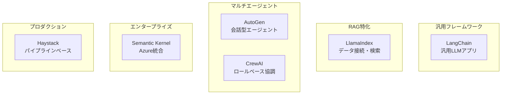
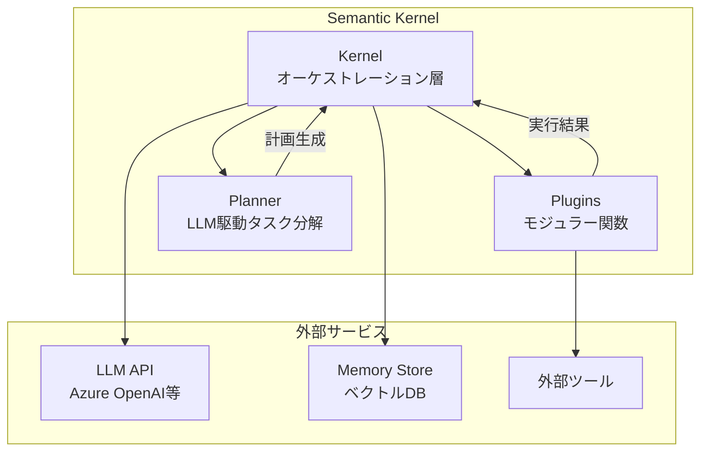

本記事は [https://arxiv.org/abs/2501.09136](https://arxiv.org/abs/2501.09136) の解説記事です。

## 論文概要（Abstract）

Chen, Nakarmi, Reunanen et al. (2025) は、LLMアプリケーション向けのAIオーケストレーションフレームワーク6種（LangChain、LlamaIndex、AutoGen、CrewAI、Semantic Kernel、Haystack）を体系的に比較分析したサーベイ論文を発表した。著者らはワークフロー管理、マルチエージェントサポート、メモリ管理、ツール統合、開発者体験の5つの観点から各フレームワークを評価し、ユースケースに応じた選定指針を提示している。本サーベイはフレームワーク選定の実務的な判断基準を示すとともに、現在のエコシステムが抱える課題（デバッグの困難さ、依存関係の管理、標準化の欠如、セキュリティ）を整理している。

この記事は [Zenn記事: Semantic Kernel × MCPで外部ツール連携AIエージェントを構築する](https://zenn.dev/0h_n0/articles/1978021a1523b7) の深掘りです。

## 情報源

- **arXiv ID**: 2501.09136
- **URL**: [https://arxiv.org/abs/2501.09136](https://arxiv.org/abs/2501.09136)
- **著者**: Yudi Chen, Riya Nakarmi, Jere Reunanen et al. (University of Helsinki)
- **発表年**: 2025年1月
- **分野**: cs.SE, cs.AI, cs.LG

## 背景と動機（Background & Motivation）

LLMの実用化が進む中、単一のLLM API呼び出しだけではビジネス要件を満たせないケースが増えている。RAG（Retrieval-Augmented Generation）による知識拡張、外部ツールとの連携、複数エージェント間の協調、ステートフルな会話管理など、LLMを中心とした複合的なシステムの構築が求められている。

こうした需要に応えるため、LangChain、LlamaIndex、AutoGen、CrewAI、Semantic Kernel、Haystackなど多数のオーケストレーションフレームワークが登場した。しかし、著者らは各フレームワークが異なる設計思想と強みを持つにもかかわらず、体系的な比較分析が欠如していると指摘している。開発者がプロジェクトに適したフレームワークを選定する際、公式ドキュメントやコミュニティの評判に頼らざるを得ないのが現状であり、統一的な評価基準に基づく比較が必要であるとの動機から本サーベイが実施された。

著者らは以下の3つのリサーチクエスチョンを設定している。

1. **RQ1**: 各フレームワークのコアアーキテクチャと設計原則はどのように異なるか
2. **RQ2**: ワークフロー管理、マルチエージェント、メモリ、ツール統合の実装はどう比較されるか
3. **RQ3**: 開発者体験（学習曲線、ドキュメント、エコシステム）にどのような差異があるか

## 主要な貢献（Key Contributions）

- **貢献1**: 6つの主要AIオーケストレーションフレームワークを5つの評価軸（ワークフロー管理、マルチエージェント、メモリ管理、ツール統合、開発者体験）で体系的に比較
- **貢献2**: 各フレームワークのアーキテクチャ設計原則を分析し、設計上のトレードオフを明示化
- **貢献3**: ユースケース別のフレームワーク選定ガイドラインの提示
- **貢献4**: 現在のAIオーケストレーションエコシステムが抱える共通課題（デバッグ、依存関係、標準化、セキュリティ）の整理と今後の研究方向性の提示

## 技術的詳細（Technical Details）

### フレームワーク全体像

著者らが分析した6つのフレームワークの位置づけを以下に示す。

### 各フレームワークのコアアーキテクチャ

著者らは各フレームワークのアーキテクチャを以下のように分析している。

#### LangChain

LangChainは「Chain」を基本抽象として、LLM呼び出し・プロンプト・ツールを連結するフレームワークである。著者らによれば、LangChainの特徴は高い汎用性と豊富なインテグレーションにある。LCEL（LangChain Expression Language）によるRunnableインターフェースでパイプラインを宣言的に記述でき、LangGraphを通じてステートフルなマルチエージェントワークフローも構築可能である。一方で、抽象化レイヤーの多さが学習曲線を高めていると報告されている。

#### LlamaIndex

LlamaIndexはデータ接続とRAGに特化したフレームワークである。著者らは、データコネクタ（LlamaHub）、インデックス構造（VectorStoreIndex、TreeIndex等）、クエリエンジンの3層構造が特徴であると述べている。特にドキュメントの読み込み・チャンク分割・インデックス作成・検索の一連のパイプラインが洗練されており、RAGアプリケーションの構築では他のフレームワークより少ないコードで実装可能だと分析している。

#### AutoGen

AutoGenはMicrosoftが開発した会話型マルチエージェントフレームワークである。著者らは、AutoGenのコア設計として「エージェント間の会話（conversation）」を中心に据えている点を強調している。AssistantAgent、UserProxyAgent、GroupChatなどの抽象を提供し、エージェント間のメッセージパッシングでタスクを遂行する。コード生成・実行の統合が深く、コード自動実行によるタスク解決に強みがある。

#### CrewAI

CrewAIはロールベースのマルチエージェント協調フレームワークである。著者らは、各エージェントに「役割（Role）」「目標（Goal）」「バックストーリー（Backstory）」を付与する設計が直感的であり、学習曲線が最も低いフレームワークの一つだと報告している。SequentialProcess、HierarchicalProcessなどのプロセスタイプで実行順序を制御する。

#### Haystack

Haystackはdeeepsetが開発したプロダクション指向のフレームワークである。著者らは、有向非巡回グラフ（DAG）ベースのパイプラインアーキテクチャが特徴であり、各コンポーネント（Retriever、Reader、Generatorなど）の入出力が明確に型付けされている点を評価している。再現性とテスト容易性を重視した設計がプロダクション環境に適していると述べている。

#### Semantic Kernel

Semantic Kernelについては次のセクションで詳述する。

## Semantic Kernelの詳細分析

### コアアーキテクチャ

著者らは、Semantic Kernelのアーキテクチャを3つの主要コンポーネントで説明している。

- **Kernel（カーネル）**: オーケストレーション層として、LLMサービス、プラグイン、メモリの統合を担う。すべてのリクエストはKernelを経由して処理される
- **Plugins（プラグイン）**: モジュラーな関数群。`@kernel_function`デコレータで定義され、OpenAIのfunction calling仕様と互換性がある。セマンティック関数（LLMプロンプト）とネイティブ関数（通常のコード）の2種類が存在する
- **Planner（プランナー）**: LLMを用いてユーザーの要求をプラグイン呼び出しの計画に分解する。ただし、著者らはプランナーにおけるハルシネーション（実際には存在しないプラグインを計画に含める等）のリスクを指摘している

### プラグインシステム

著者らは、Semantic Kernelのプラグインシステムがフレームワークの中核的な差別化要因であると述べている。プラグインは以下の特徴を持つ。

- **OpenAI function calling互換**: プラグインの関数シグネチャが自動的にfunction callingのスキーマに変換される
- **セマンティック関数**: プロンプトテンプレートとして定義され、LLMが実行する
- **ネイティブ関数**: Python/C#/Javaの通常のコードとして定義され、決定的な処理を担う
- **組み合わせ可能性**: Plannerが複数のプラグインを自動的に組み合わせて複雑なタスクを遂行する

### メモリ管理

著者らは、Semantic Kernelのメモリ管理を以下のように分類している。

- **揮発性メモリ（VolatileMemoryStore）**: インメモリのベクトルストアで、プロトタイピングに使用される
- **永続メモリ**: Azure AI Search、Chroma、Pinecone、Qdrant等のベクトルデータベースと統合可能

メモリはセマンティック検索を通じてコンテキストとして活用され、会話履歴や関連知識をLLMに提供する。著者らは、Azure AI Searchとのファーストクラスの統合が他のフレームワークにない強みだと報告している。

### マルチエージェント

著者らは、Semantic KernelのAgent Framework（調査時点でベータ版）について以下の構成要素を挙げている。

- **ChatCompletionAgent**: チャット補完APIをベースとしたエージェント
- **OpenAIAssistantAgent**: OpenAI Assistants APIを活用したエージェント
- **AgentGroupChat**: 複数エージェント間の会話を管理する仕組み

ただし、著者らはマルチエージェント機能の成熟度が AutoGen や CrewAI に比べて低いことを指摘している。

### エンタープライズ機能

著者らは、Semantic Kernelが他のフレームワークと比較してエンタープライズ機能が突出している点を報告している。

- **Azure OpenAIファーストクラスサポート**: Azure ADトークン認証、リージョン指定、コンテンツフィルタリングの統合
- **OpenTelemetry統合**: 分散トレーシングとメトリクス収集
- **Responsible AI**: コンテンツフィルタリングと安全性ガードレール
- **多言語対応**: Python、C#、Java（実験的）の3言語でSDKを提供

## フレームワーク比較分析

### 主要特性の比較

著者らが論文中のTable 1で示したフレームワーク比較を以下に再構成する。

| 特性 | LangChain | LlamaIndex | AutoGen | CrewAI | Semantic Kernel | Haystack |
|---|---|---|---|---|---|---|
| 主要用途 | 汎用LLMアプリ | RAG・データ接続 | マルチエージェント | ロールベース協調 | エンタープライズ | プロダクションNLP |
| マルチエージェント | LangGraph経由 | 限定的 | コア機能 | コア機能 | ベータ | 限定的 |
| エンタープライズ適性 | 中 | 低 | 中 | 低 | 高 | 中 |
| 学習曲線 | 中〜高 | 中 | 中 | 低〜中 | 中〜高 | 中 |
| 対応言語 | Python, JS | Python, TS | Python, .NET | Python | Python, C#, Java | Python |

### ワークフロー管理

著者らはワークフロー管理のアプローチを以下のように分類している。

| フレームワーク | ワークフローモデル | 実行制御 |
|---|---|---|
| LangChain | Chain/LCEL（宣言的） | Runnable, LangGraph（状態グラフ） |
| LlamaIndex | QueryEngine/Pipeline | データ駆動型、インデックスベース |
| AutoGen | 会話フロー | エージェント間メッセージ、GroupChat |
| CrewAI | Process（Sequential/Hierarchical） | Task依存関係ベース |
| Semantic Kernel | Planner + Kernel | LLM駆動の計画生成 |
| Haystack | DAGパイプライン | コンポーネント型、明示的なデータフロー |

著者らは、LangChainのLCELとHaystackのDAGパイプラインが宣言的なワークフロー定義に優れている一方、AutoGenとCrewAIは会話・タスクベースの暗黙的なフロー制御に重点を置いていると分析している。Semantic KernelのPlannerはLLMに計画生成を委ねるため柔軟性が高いが、計画の信頼性に課題があると指摘している。

### マルチエージェントサポート

著者らはマルチエージェント機能の成熟度に明確な差があることを報告している。

| フレームワーク | マルチエージェント成熟度 | 主な機能 |
|---|---|---|
| AutoGen | 高 | ConversableAgent、GroupChat、ネストされた会話 |
| CrewAI | 高 | ロールベースエージェント、Crew/Task抽象 |
| LangChain | 中（LangGraph） | 状態グラフ、条件分岐、サブグラフ |
| Semantic Kernel | 低（ベータ） | AgentGroupChat、ChatCompletionAgent |
| LlamaIndex | 低 | 基本的なエージェント機能 |
| Haystack | 低 | パイプラインベースの限定的なエージェント |

AutoGenとCrewAIがマルチエージェント機能をコア設計として持つのに対し、LangChainはLangGraphという拡張で対応している。著者らは、Semantic KernelのAgent Frameworkがベータ段階にあり、AutoGenやCrewAIほどの柔軟性はないと述べている。

### ツール統合

ツール統合のアプローチも各フレームワークで異なる。

| フレームワーク | ツール統合方式 | エコシステム |
|---|---|---|
| LangChain | Tool/ToolKit抽象 | 最大規模のインテグレーション数 |
| LlamaIndex | LlamaHub（コミュニティ駆動） | データコネクタが充実 |
| AutoGen | Function Registration | コード実行統合が強力 |
| CrewAI | Tool Decorator | シンプルで直感的 |
| Semantic Kernel | @kernel_function + Plugin | OpenAI function calling互換 |
| Haystack | Component（型付き入出力） | パイプライン統合型 |

著者らは、LangChainが最も豊富なサードパーティインテグレーションを持つ一方、Semantic Kernelのプラグインシステムは型安全性とOpenAI function callingとの互換性で優位性があると分析している。

### 開発者体験

著者らは開発者体験について以下の観点から評価している。

| フレームワーク | ドキュメント | コミュニティ | デバッグ容易性 |
|---|---|---|---|
| LangChain | 広範だが断片的 | 最大規模 | LangSmithで改善 |
| LlamaIndex | 体系的 | 大規模 | 中程度 |
| AutoGen | 改善中 | 成長中 | 会話ログで追跡 |
| CrewAI | シンプルで明快 | 成長中 | 比較的容易 |
| Semantic Kernel | Microsoftの体系的ドキュメント | 中規模 | OpenTelemetry統合 |
| Haystack | 充実 | 中規模 | パイプライン可視化 |

著者らは、CrewAIの学習曲線が最も低く、LangChainとSemantic Kernelは機能の豊富さと引き換えに学習コストが高いと報告している。デバッグについては、LangSmith（LangChain）とOpenTelemetry（Semantic Kernel）がオブザーバビリティツールとして有用であるが、いずれのフレームワークもLLM固有のデバッグ（プロンプトの挙動追跡、ハルシネーション検出等）には課題が残ると述べている。

## 現在の課題と今後の方向性

著者らは現在のAIオーケストレーションエコシステムが抱える共通課題として以下の4点を挙げている。

### 1. デバッグの困難さ

LLMを含むシステムのデバッグは従来のソフトウェアとは質的に異なる。出力が非決定的であるため、同じ入力に対して異なる出力が得られることがある。著者らは、プロンプトの微妙な変更が出力に大きな影響を与える問題や、マルチエージェントシステムにおけるエージェント間のインタラクションのデバッグが特に困難であると指摘している。LangSmithやOpenTelemetryなどのツールが部分的に対応しているが、LLM特有のデバッグ手法の標準化が必要であると述べている。

### 2. 依存関係の管理

フレームワークの急速な進化に伴い、APIの破壊的変更が頻繁に発生している。著者らは、LangChainにおいてバージョンアップ時の破壊的変更が開発者コミュニティで繰り返し問題になっていることを報告している。また、各フレームワークが多数のサードパーティライブラリに依存しているため、依存関係の競合が発生しやすいことも課題として挙げている。

### 3. 標準化の欠如

各フレームワークが独自のAPI設計と抽象を採用しているため、フレームワーク間の移植性が低い。著者らは、特にツール定義やエージェント間通信のプロトコルについて、業界標準の策定が必要であると主張している。この文脈において、Model Context Protocol（MCP）のような標準化の動きは重要であるが、調査時点では各フレームワークの対応状況にばらつきがある。

### 4. セキュリティ

LLMアプリケーション特有のセキュリティリスクとして、プロンプトインジェクション、ツール呼び出しの権限管理、データプライバシーの問題が挙げられている。著者らは、Semantic KernelのResponsible AI機能やAzureのコンテンツフィルタリングがエンタープライズレベルのセキュリティ対応として先行しているが、他のフレームワークでは十分な対策が提供されていないケースがあると報告している。

### 今後の研究方向性

著者らは以下の方向性を今後の研究課題として提示している。

- **フレームワーク横断的なベンチマーク**: 同一タスクでの定量的比較（レイテンシ、トークン使用量、精度等）
- **標準化プロトコルの策定**: ツール定義、エージェント間通信、メモリ管理の標準API
- **LLMネイティブなデバッグツール**: プロンプトトレーシング、ハルシネーション検出、マルチエージェントのインタラクション可視化
- **セキュリティフレームワーク**: プロンプトインジェクション対策、ツール呼び出しの権限制御の標準化

## 実運用への応用

著者らの分析に基づくユースケース別のフレームワーク選定指針を以下にまとめる。

| ユースケース | 推奨フレームワーク | 理由 |
|---|---|---|
| RAG中心のアプリ | LlamaIndex | データコネクタとインデックス構造が最も充実 |
| マルチエージェント会話 | AutoGen | 会話型エージェント設計がコア、コード実行統合 |
| ロールベースの協調タスク | CrewAI | 直感的なロール定義、低い学習曲線 |
| エンタープライズ統合 | Semantic Kernel | Azure統合、OpenTelemetry、Responsible AI |
| 汎用LLMアプリ | LangChain | 最大のエコシステム、幅広いインテグレーション |
| プロダクションNLP | Haystack | DAGパイプライン、型安全性、再現性重視 |

ただし、著者らはこれらの推奨が調査時点（2025年1月）のものであり、各フレームワークは急速に進化しているため、選定時には最新の状況を確認する必要があると付言している。特にSemantic KernelのAgent FrameworkやLangChainのLangGraphなど、ベータ・新機能の成熟度は変化が速い領域である。

また、著者らは複数フレームワークの組み合わせ（例: LlamaIndexのRAG機能 + LangChainのオーケストレーション）も実務では有効なアプローチであると述べている。

## まとめ

本サーベイは、LLMオーケストレーションフレームワーク6種を統一的な評価軸で比較した点に意義がある。著者らの分析により、以下の知見が得られている。

1. **設計思想の多様性**: 汎用（LangChain）、RAG特化（LlamaIndex）、マルチエージェント（AutoGen, CrewAI）、エンタープライズ（Semantic Kernel）、プロダクション（Haystack）と、各フレームワークは異なるニッチを占めている
2. **Semantic Kernelの位置づけ**: エンタープライズ機能（Azure統合、OpenTelemetry、Responsible AI）で差別化されているが、マルチエージェント機能の成熟度やAzureへの依存度が課題として残る
3. **エコシステムの課題**: デバッグ、依存関係管理、標準化、セキュリティの4点は全フレームワークに共通する未解決課題であり、今後の研究・開発が求められる

なお、本サーベイは2025年1月時点の調査であり、各フレームワークの進化速度を考慮すると、個別の機能比較は最新のドキュメントで確認することが推奨される。特にMCPのようなプロトコル標準化の動きや、各フレームワークのマルチエージェント機能の成熟は、本サーベイ以降も進展が見られる領域である。

## 参考文献

1. Chen, Y., Nakarmi, R., Reunanen, J., et al. (2025). A Survey on AI Orchestration Frameworks for LLM Applications: Approaches and Insights. arXiv:2501.09136.
2. LangChain Documentation. [https://docs.langchain.com/](https://docs.langchain.com/)
3. LlamaIndex Documentation. [https://docs.llamaindex.ai/](https://docs.llamaindex.ai/)
4. AutoGen Documentation. [https://microsoft.github.io/autogen/](https://microsoft.github.io/autogen/)
5. CrewAI Documentation. [https://docs.crewai.com/](https://docs.crewai.com/)
6. Semantic Kernel Documentation. [https://learn.microsoft.com/semantic-kernel/](https://learn.microsoft.com/semantic-kernel/)
7. Haystack Documentation. [https://docs.haystack.deepset.ai/](https://docs.haystack.deepset.ai/)
