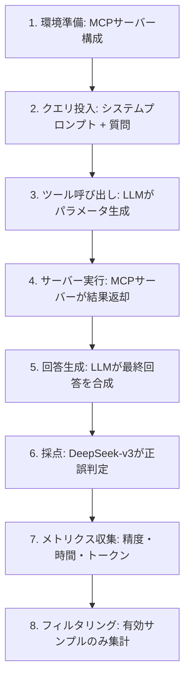
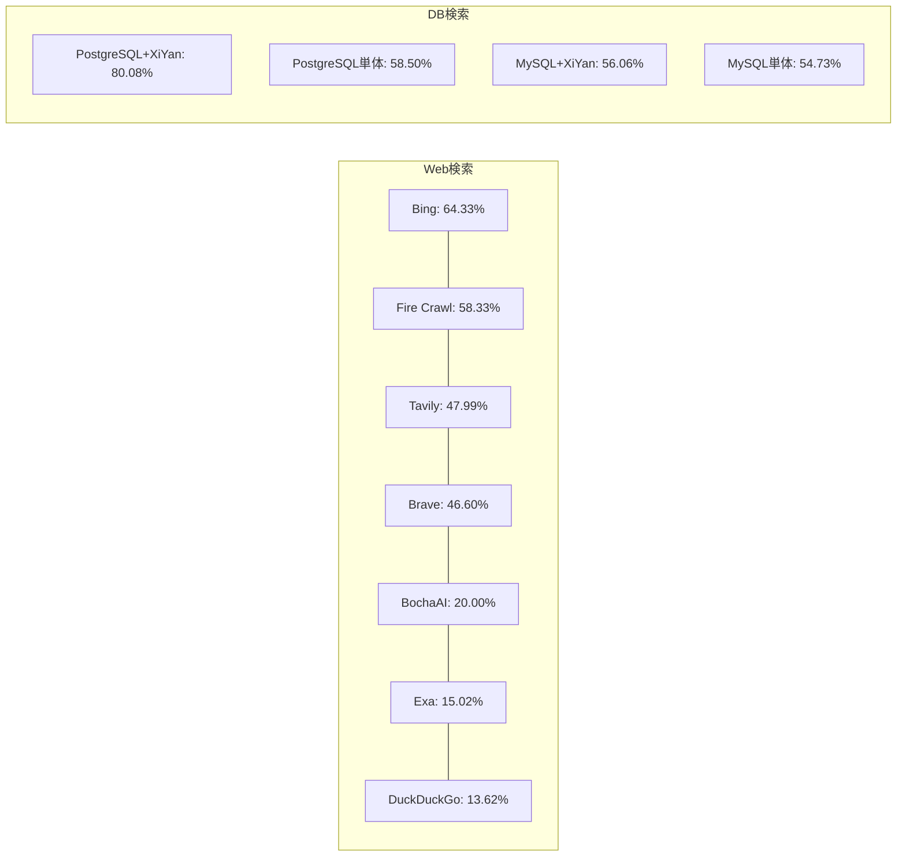

## 論文概要（Abstract）

本記事は [https://arxiv.org/abs/2504.11094](https://arxiv.org/abs/2504.11094) の解説記事です。

MCPBenchは、2024年後半に登場したModel Context Protocol（MCP）サーバーの実用性を体系的に評価するベンチマークフレームワークである。著者らは、Web検索系7サーバーとデータベース検索系3サーバーの合計10種のMCPサーバーを対象に、精度（Accuracy）・時間効率（Time）・トークン消費量（Token Usage）の3軸で評価を実施した。実験の結果、Bing Web Searchが最高精度64.33%を達成した一方、DuckDuckGoは13.62%にとどまり、MCPサーバー間で精度に最大50ポイント以上の差があることが報告されている。さらに、MCPサーバーが従来のFunction Call方式と比較して明確な精度優位性を示さないこと、および宣言的インターフェース（Declarative Interface）の導入がデータベース系タスクで22ポイントの精度向上をもたらすことが明らかにされた。

この記事は [Zenn記事: Semantic Kernel × MCPで外部ツール連携AIエージェントを構築する](https://zenn.dev/0h_n0/articles/1978021a1523b7) の深掘りです。

## 情報源

- **arXiv ID**: 2504.11094
- **URL**: [arXiv:2504.11094](https://arxiv.org/abs/2504.11094)
- **著者**: Zhiling Luo, Xiaorong Shi, Xuanrui Lin, Jinyang Gao
- **初版投稿**: 2025年4月15日
- **最終改訂**: 2025年4月18日（v2）
- **分野**: Information Retrieval (cs.IR), Databases (cs.DB)
- **公式実装**: [modelscope/MCPBench](https://github.com/modelscope/MCPBench)

## 背景と動機（Background & Motivation）

### MCPの普及と評価の不在

Model Context Protocol（MCP）は、Anthropicがオープンソースとしてリリースしたプロトコルであり、LLMが外部データソースやツールとリアルタイムに対話するための標準化されたインターフェースを提供する。MCPの登場以来、多数のMCPサーバー実装がコミュニティから公開されており、Web検索、データベースアクセス、ファイル操作など多岐にわたるユースケースをカバーしている。

しかし、これらのMCPサーバーが実際にどの程度「使い物になるのか」を定量的に評価した研究は存在しなかった。具体的には以下の問いが未解明であった。

1. **MCPサーバー間の性能差はどの程度か？** — 同じタスクに対して異なるMCPサーバーを使用した場合、精度や効率にどの程度の差が生じるのか
2. **MCPは従来のFunction Callより優れているのか？** — MCPプロトコルを介したツール呼び出しは、LLMネイティブのFunction Call機能と比較して優位性があるのか
3. **MCPサーバーの性能をどう改善できるのか？** — LLMがツールパラメータを構築する際の最適化手法は何か

著者らはこれらの問いに答えるため、MCPBenchという評価フレームワークを構築し、実証的な評価を行った。

### 実務的な意義

Zenn記事「Semantic Kernel × MCPで外部ツール連携AIエージェントを構築する」で紹介されているように、MCPはAIエージェント構築において重要な基盤技術となりつつある。しかし、MCPサーバーの選定にあたっては「どのサーバーが信頼できるか」「どのようなタスクで失敗するか」といった実用上の知見が不足していた。MCPBenchはこの知見ギャップを埋める最初の体系的試みである。

## 主要な貢献（Key Contributions）

1. **MCPBench評価フレームワークの構築**: Web検索・データベース検索の2カテゴリにわたる評価ベンチマークをオープンソースとして公開（[GitHub](https://github.com/modelscope/MCPBench)）
2. **10種のMCPサーバーの定量評価**: 精度・時間効率・トークン消費量の3指標で多角的に評価し、サーバー間の性能差を定量化
3. **MCP vs Function Callの比較**: MCPが従来のFunction Callに対して明確な優位性を持たないことを実験的に示した
4. **宣言的インターフェースによる性能改善**: パラメータ構築をLLMに委ねず、自然言語インターフェースを導入することでデータベース系タスクの精度が22ポイント向上することを実証

## 技術的詳細（Technical Details）

### 評価パイプライン

MCPBenchの評価パイプラインは以下の8ステップで構成される。

評価環境として、シンガポールに設置されたデュアルコアCPU・2GBRAMのサーバーが使用され、タイムアウトは30秒に設定されている。採点にはDeepSeek-v3が使用され、予測結果がGround Truthの主要情報を含むかどうかをTrue/Falseの二値で判定する。

### 評価指標の定義

MCPBenchでは3つの指標を用いて評価を行っている。

**1. 精度（Accuracy）**

$$
\text{Accuracy} = \frac{1}{|S_{\text{valid}}|} \sum_{i \in S_{\text{valid}}} \mathbb{1}[\text{grade}(y_i, \hat{y}_i) = \text{True}]
$$

ここで、
- $S_{\text{valid}}$: パイプラインを正常に完了した有効サンプルの集合
- $y_i$: $i$番目のサンプルのGround Truth
- $\hat{y}_i$: $i$番目のサンプルに対するモデルの予測
- $\text{grade}(\cdot)$: DeepSeek-v3による採点関数

有効サンプルは「処理パイプライン全体を正常に完了したもの」に限定される。APIキー制限やネットワーク障害によりパイプラインが中断したサンプルは集計から除外される。

**2. 時間消費量（Time Consumption）**

LLMのレイテンシとMCPサーバーのレイテンシを含むエンドツーエンドの処理時間（秒単位）で計測される。

**3. トークン消費量（Token Usage）**

- **Pre-fill Tokens**: プロンプトトークン数（入力コスト）
- **Completion Tokens**: 生成トークン数（出力コスト）

### 評価データセット

MCPBenchでは、Web検索タスク用に300サンプル、データベース検索タスク用に611サンプルの合計911サンプルが用意されている。

#### Web検索タスク（300サンプル）

| データセット | 出典 | サンプル数 | 内容 |
|:---|:---|:---:|:---|
| Frames | オープンソースベンチマーク | 100 | 多段推論を要する事実確認質問（英語） |
| News | 新聞聯播の書き起こし（3か月分） | 100 | 時事ニュースに関する質問（中国語） |
| Knowledge | Wikipedia + 科学報告から逆生成 | 100 | 百科事典的知識に関する質問（中国語） |

#### データベース検索タスク（611サンプル）

| データセット | 出典 | サンプル数 | 内容 |
|:---|:---|:---:|:---|
| Car_bi | 合成自動車メーカーデータ | 355 | BI分析クエリ |
| SQL_EVAL | Spiderスキーマ + 手動選択質問 | 256 | Text-to-SQLタスク |

### 評価対象のMCPサーバー

#### Web検索系（7サーバー）

| サーバー名 | 開発者 | ツールインターフェース |
|:---|:---|:---|
| Brave Search | erdnax123 | `brave_web_search` |
| DuckDuckGo | nickclyde | `search` |
| Tavily MCP Server | tavily-ai | `tavily-search` |
| Exa Search | exa-labs | `web_search` |
| Fire Crawl Search | mendableai | `firecrawl_search` |
| Bing Web Search | leehanchung | `bing_web_search` |
| BochaAI Search | Alibaba Cloud | `bocha_web_search` |

#### データベース系（3サーバー）

| サーバー名 | 開発者 | ツールインターフェース |
|:---|:---|:---|
| XiYan MCP Server | XGenerationLab | `get_data` |
| MySQL MCP Server | designcomputer | `execute_sql` |
| PostgreSQL MCP Server | modelcontextprotocol | `query` |

## 障害モード分類（Failure Analysis）

著者らは、MCPサーバー利用時に発生する障害を以下のカテゴリに分類している。

### 1. ネットワーク・技術的障害

APIキーの制限、プログラムクラッシュ、ネットワーク断など、MCPサーバーの外的要因による障害である。これらの障害が発生したサンプルは「無効サンプル」として集計から除外される。30秒のタイムアウト設定により、応答が遅いサーバー（例: Exa Searchの平均231秒）では多数のサンプルが無効化される。

### 2. LLMのパラメータ構築失敗

LLMがMCPサーバーに渡すパラメータ（SQL文、検索クエリなど）を正しく構築できない障害である。著者らは、これがMCPサーバーの精度低下における主要因であると指摘している。

- **データベース系**: LLMが生成するSQLクエリの構文エラーや論理エラー
- **Web検索系**: 検索クエリの最適化不足（多段推論が必要な質問に対して適切なクエリを生成できない）

### 3. 出力フォーマットの不統一

MCPサーバーごとに返却するレスポンスの形式が異なるため、LLMの後段処理に影響を与える。著者らは具体的なケーススタディで以下を報告している。

- **Brave Search**: 10件のWikipediaページのタイトルと説明文を返却するが、詳細な内容が欠落しており、LLMが正解に到達できない
- **BochaAI**: 検索結果を要約して返却するため、LLMが正解を容易に導出できる
- **Qwen Web Search（Function Call）**: 検索結果を分析・要約するが、中間処理で誤った結論を導出し、元の検索結果をLLMに渡さないため、LLMが自力で正解を導出する機会を奪う

### 4. コンテキスト情報の過不足

検索結果が過少（Brave Searchのように概要のみ）であればLLMの推論材料が不足し、過多であればプロンプトのトークン上限に達する。著者らのデータによると、Web検索系サーバーのPre-fillトークン数は1,643〜5,802と大幅にばらついている。

## 実験結果（Results）

### Web検索タスクの精度・効率・トークンコスト

以下はWeb検索タスクにおける各MCPサーバーの評価結果である（論文Table 5より）。

| サーバー | 精度 (%) | 時間 (秒) | Pre-fill Tokens | Completion Tokens |
|:---|:---:|:---:|:---:|:---:|
| **Bing Web Search** | **64.33** | **12.40** | 4,060 | 207 |
| Fire Crawl Search | 58.33 | 15.44 | 1,727 | 180 |
| Tavily MCP Server | 47.99 | 95.52 | 2,442 | 196 |
| Brave Search | 46.60 | 13.98 | 5,802 | 236 |
| BochaAI Search | 20.00 | 35.54 | 1,643 | 189 |
| Exa Search | 15.02 | 231.24 | 2,475 | 190 |
| DuckDuckGo | 13.62 | 64.17 | 1,719 | 162 |

**分析**: 精度の最高値（Bing: 64.33%）と最低値（DuckDuckGo: 13.62%）の間に50.71ポイントの差が存在する。時間効率についても、最速のBing（12.40秒）と最遅のExa Search（231.24秒）では約19倍の差がある。一方、Completion Tokensは162〜236の範囲に収まっており、LLMの出力は比較的一定であることが示されている。

### MCP vs Function Call比較

著者らはMCPサーバーと従来のFunction Call方式を比較している（論文Table 6より）。

| ツール | 方式 | 精度 (%) | 時間 (秒) | Pre-fill Tokens |
|:---|:---|:---:|:---:|:---:|
| Qwen Web Search | Function Call | 55.52 | 25.48 | 1,150 |
| Quark Search | Function Call | 46.00 | 27.31 | 1,142 |
| Brave Search | MCP | 46.60 | 13.98 | 5,802 |

著者らは「MCPの使用がFunction Callと比較して明確な精度改善を示さない」と結論付けている。むしろ、Qwen Web Search（Function Call）の精度55.52%は、Brave Search（MCP）の46.60%を上回っている。一方で、MCPサーバーのPre-fillトークン数はFunction Callの約5倍であり、コスト効率の面でもMCPが不利であることが示されている。

### データベースタスクにおける宣言的インターフェースの効果

データベース系タスクでは、XiYan MCP Serverの宣言的インターフェース（自然言語でクエリを投入し、サーバー内部でText-to-SQL変換を行う方式）が顕著な効果を示した。

#### MySQL（論文Table 7より）

| 構成 | 精度 (%) | 時間 (秒) | Pre-fill Tokens |
|:---|:---:|:---:|:---:|
| MySQL MCP Server（ベースライン） | 54.73 | 4.64 | 2,800 |
| MySQL + XiYan（宣言的IF） | 56.06 | 6.38 | 416 |

#### PostgreSQL（論文Table 8より）

| 構成 | 精度 (%) | 時間 (秒) | Pre-fill Tokens |
|:---|:---:|:---:|:---:|
| PostgreSQL MCP Server（ベースライン） | 58.50 | 5.85 | 6,897 |
| PostgreSQL + XiYan（宣言的IF） | **80.08** | 12.87 | 435 |

PostgreSQLの場合、宣言的インターフェースの導入により精度が21.58ポイント向上し、同時にPre-fillトークン数が6,897から435へと93.7%削減されている。これは、LLMがSQL文を構築する負担をサーバー側の専用モジュール（XiYanSQL）に移譲することで、パラメータ構築失敗という主要障害モードを回避できるためであると著者らは説明している。

### 結果の要約

## 実運用への応用（Practical Applications）

MCPBenchの実験結果から、MCPサーバーの設計・選定に関して以下の実務的示唆が得られる。

### 1. MCPサーバー選定の指針

Web検索系MCPサーバーの精度は13%〜64%と大幅にばらつくため、プロダクション環境では事前のベンチマーク評価が不可欠である。著者らのデータに基づけば、Bing Web SearchとFire Crawl Searchが精度・効率の両面で優れている。

### 2. 宣言的インターフェースの採用

データベース系タスクでは、LLMにSQL文の構築を委ねるよりも、自然言語を受け取りサーバー内部でText-to-SQL変換を行う宣言的インターフェースが有効である。PostgreSQLタスクでの22ポイントの精度向上は、この設計方針の有効性を強く示唆している。Semantic Kernelなどのフレームワークを通じてMCPサーバーを利用する場合にも、この知見は直接適用できる。

### 3. 検索結果フォーマットの最適化

Web検索系サーバーのケーススタディは、検索結果の返却形式がLLMの推論精度に直接影響することを示している。生の検索結果（タイトル+スニペットのみ）では情報が不足し、過度に要約された結果ではサーバー側の誤りがLLMに伝播する。著者らは、生データと要約の両方を提供する形式を推奨している。

### 4. トークンコストの管理

MCPサーバーのPre-fillトークン数は1,643〜6,897と大幅にばらつく。Brave Searchの5,802トークンはFunction Callの1,150トークンの5倍であり、大規模な運用ではコスト面の考慮が必要である。宣言的インターフェースの採用は精度向上だけでなく、トークンコスト削減（93.7%削減の事例あり）にも寄与する。

### 5. MCPとFunction Callの使い分け

著者らの結果は、MCPが全てのユースケースでFunction Callを上回るわけではないことを示している。MCPの主な価値はプロトコルの標準化とサーバーの再利用性にあり、精度面での優位性はタスクとサーバーの選択に依存する。プロダクション環境では、タスク特性に応じてMCPとFunction Callを使い分ける戦略が合理的である。

## 関連研究（Related Work）

- **Model Context Protocol**: Anthropicが提唱するオープンプロトコルであり、LLMと外部ツールの統合を標準化する。MCPBenchはこのプロトコルの実装品質を初めて定量評価した研究である。
- **Function Calling**: OpenAIのGPTシリーズやQwenに搭載されたLLMネイティブのツール呼び出し機能。MCPBenchの結果は、MCPがFunction Callを必ずしも代替するものではなく、補完的な関係にあることを示唆している。
- **Text-to-SQL**: Spider（Yu et al., 2018）を代表とするText-to-SQLベンチマーク群。MCPBenchではXiYanSQLフレームワークを宣言的インターフェースとして活用し、LLMによるSQL生成の精度問題を回避する手法を評価している。
- **Frames**: 事実確認・情報取得・推論を組み合わせたRAG評価ベンチマーク。MCPBenchのWeb検索タスクにおける評価データセットの一部として採用されている。

## まとめと今後の展望

MCPBenchは、MCPサーバーの実用性を精度・効率・トークンコストの3軸で初めて体系的に評価したベンチマークである。主要な知見として、(1) MCPサーバー間で精度に最大50ポイント以上の差があること、(2) MCPがFunction Callに対して明確な精度優位性を持たないこと、(3) 宣言的インターフェースの導入がデータベース系タスクで22ポイントの精度向上と93.7%のトークン削減をもたらすことが報告されている。

今後の課題として、著者らは評価対象サーバーの拡充（ファイル操作、コード実行など）、より多様なLLMでの評価、および適応的タイムアウト設定による有効サンプル率の改善を挙げている。MCPエコシステムの急速な成長に伴い、MCPBenchのような標準化された評価フレームワークの重要性は今後さらに高まると考えられる。

## 参考文献

- **arXiv**: [https://arxiv.org/abs/2504.11094](https://arxiv.org/abs/2504.11094)
- **Code**: [https://github.com/modelscope/MCPBench](https://github.com/modelscope/MCPBench)
- **MCP公式ドキュメント**: [https://modelcontextprotocol.io](https://modelcontextprotocol.io)
- **Related Zenn article**: [https://zenn.dev/0h_n0/articles/1978021a1523b7](https://zenn.dev/0h_n0/articles/1978021a1523b7)
