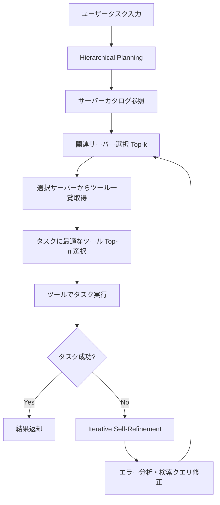
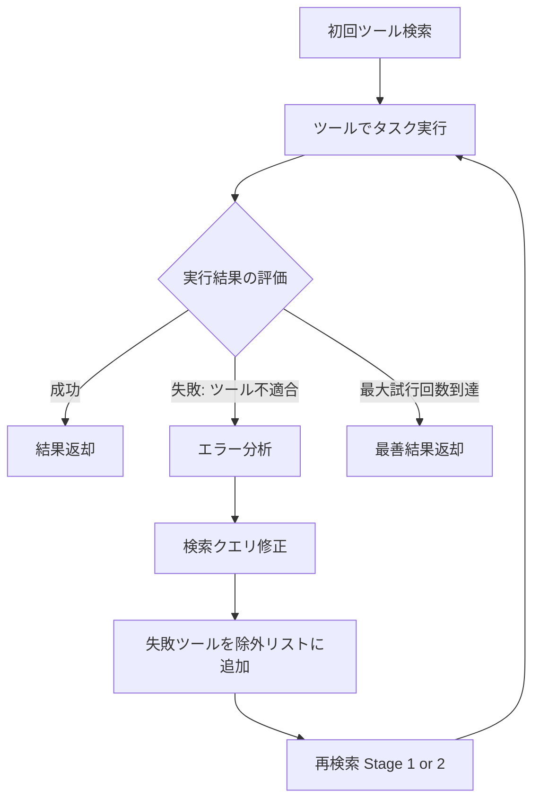

本記事は <https://arxiv.org/abs/2504.16736> の解説記事です。

## 論文概要（Abstract）

Model Context Protocol（MCP）はLLMが標準化されたサーバーを介して外部ツールにアクセスする仕組みを提供するが、MCPサーバー数の増加に伴いツール記述がコンテキストウィンドウを圧迫する問題が顕在化している。MCP-Zeroは、階層的プランニング（Hierarchical Planning）による能動的ツール検索と、反復自己改善（Iterative Self-Refinement）による検索ミスの回復を組み合わせ、214ツール環境でコンテキスト使用量を97.7%削減しつつ、Full Contextに迫るタスク成功率を達成するフレームワークである。

この記事は [Zenn記事: Semantic Kernel × MCPで外部ツール連携AIエージェントを構築する](https://zenn.dev/0h_n0/articles/1978021a1523b7) の深掘りです。

## 情報源

- **arXiv ID**: 2504.16736
- **URL**: [https://arxiv.org/abs/2504.16736](https://arxiv.org/abs/2504.16736)
- **著者**: Tian Liang, Xiao Liu, Yile Wang, Qing Zhu, Mingyu Jin 他（Salute AI / Ant Group / Dartmouth College）
- **発表年**: 2025年4月
- **分野**: cs.AI（Artificial Intelligence）
- **コード**: [https://github.com/Salute-AI/MCP-Zero](https://github.com/Salute-AI/MCP-Zero)

## 背景と動機（Background & Motivation）

MCPの普及に伴い、個々のMCPサーバーが数十のツールを提供し、エコシステム全体では数百〜数千のツールが利用可能になりつつある。MCP-Zeroの論文では、20サーバー・214ツールの環境を構築しており、各ツール記述が約200トークンとすると、全ツールをコンテキストに読み込むだけで約42,800トークンを消費する。これはGPT-4oの128Kコンテキストの約33%に相当し、タスク指示やマルチターン会話履歴と合わせると現実的な運用が困難になる。

従来のアプローチとして、ユーザーが手動でツールを選択するか、全ツールを毎回ロードするかの二択であった。前者はスケーラビリティに欠け、後者はコンテキストウィンドウの浪費とコスト増を招く。著者らは、LLM自身が必要なツールを能動的に探索・取得する「Active Tool Discovery」という新たなパラダイムを提案し、この課題を解決している。

## 主要な貢献（Key Contributions）

- **MCP-Zeroフレームワーク**: 階層的プランニング（HP）と反復自己改善（ISR）を組み合わせた能動的ツール探索手法の提案
- **MCP-Bench**: 20のMCPサーバーと214ツールから構成されるベンチマークの構築。タスク成功率とツール検索精度の両面で評価可能
- **コンテキスト効率の実証**: 214ツール（約42,800トークン）から5ツール（約1,000トークン）への削減により97.7%のトークン削減を達成
- **ISRの有効性実証**: 初期検索失敗時の回復率約65%を達成し、ツール検索精度を8-12ポイント改善

## 技術的詳細（Technical Details）

### 全体アーキテクチャ

MCP-Zeroの処理フローは、タスク受領からツール取得・実行までを3段階で構成する。



### 階層的プランニング（Hierarchical Planning: HP）

従来のflat retrievalでは、214ツールから直接検索を行うため、類似名称のツール間で混同が生じやすい。HPは検索を2段階に分割することで精度を向上させる。

**Stage 1: サーバー選択**

MCPサーバーのカタログ（サーバー名・概要）のみをコンテキストに含め、タスクに関連するサーバーをTop-k個選択する。サーバーカタログは1サーバーあたり約30-50トークンで記述できるため、20サーバーでも600-1,000トークン程度に収まる。

$$
S^* = \arg\!\max_{S \subseteq \mathcal{S}, |S| = k} \; \text{Relevance}(S, \text{task})
$$

ここで、
- $\mathcal{S}$: 全MCPサーバー集合
- $S^*$: 選択されたサーバー部分集合
- $k$: 選択サーバー数（論文では$k=3$を推奨）

**Stage 2: ツール選択**

選択されたサーバーからのみツール一覧を取得し、タスクに最適なツールをTop-n個選択する。3サーバーから平均10-15ツールを取得する場合、30-45ツール分の記述（約6,000-9,000トークン）のみ参照すればよい。

$$
T^* = \arg\!\max_{T \subseteq \mathcal{T}_{S^*}, |T| = n} \; \text{Match}(T, \text{task})
$$

ここで、
- $\mathcal{T}_{S^*}$: 選択サーバー$S^*$が提供するツール集合
- $T^*$: 最終的に選択されたツール部分集合
- $n$: 選択ツール数（論文では$n=5$）

最終的にコンテキストに含まれるのは5ツール分の記述（約1,000トークン）のみであり、214ツール全体（約42,800トークン）に対して97.7%の削減となる。

### 反復自己改善（Iterative Self-Refinement: ISR）

ツール検索は誤りを含む可能性があり、初回で適切なツールが取得できない場合がある。ISRはタスク実行結果のフィードバックを基に検索を修正する機構である。



ISRの各ステップは以下の通りである。

1. **エラー分類**: タスク実行失敗の原因を「ツール不適合」「パラメータ不正」「サーバーエラー」に分類
2. **検索修正**: ツール不適合の場合、失敗したツールを除外リストに追加し、検索クエリを修正して再検索
3. **段階的回復**: Stage 2（ツール選択）のみの再検索で解決しない場合、Stage 1（サーバー選択）まで遡って再検索

著者らは、ISRにより初期検索失敗の約65%が回復可能であると報告している。最大試行回数は論文中で3回に設定されている。

### アルゴリズム擬似コード

```python
from dataclasses import dataclass


@dataclass
class MCPServer:
    """MCPサーバー情報"""
    name: str
    description: str
    tools: list[dict]


@dataclass
class ToolResult:
    """ツール実行結果"""
    success: bool
    output: str
    error_type: str | None = None


def mcp_zero(
    task: str,
    servers: list[MCPServer],
    llm: callable,
    k: int = 3,
    n: int = 5,
    max_retries: int = 3,
) -> str:
    """MCP-Zeroメインループ

    Args:
        task: ユーザータスク
        servers: 利用可能なMCPサーバー一覧
        llm: LLM推論関数
        k: 選択サーバー数
        n: 選択ツール数
        max_retries: ISR最大試行回数

    Returns:
        タスク実行結果
    """
    excluded_tools: set[str] = set()

    for attempt in range(max_retries):
        # Stage 1: サーバー選択（カタログのみ参照）
        catalog = [
            {"name": s.name, "desc": s.description}
            for s in servers
        ]
        selected_servers = llm(
            f"Task: {task}\nSelect top-{k} servers:\n{catalog}"
        )

        # Stage 2: ツール選択（選択サーバーのツールのみ参照）
        candidate_tools = []
        for server in selected_servers:
            candidate_tools.extend([
                t for t in server.tools
                if t["name"] not in excluded_tools
            ])
        selected_tools = llm(
            f"Task: {task}\nSelect top-{n} tools:\n{candidate_tools}"
        )

        # ツール実行
        result: ToolResult = execute_tools(task, selected_tools, llm)

        if result.success:
            return result.output

        # ISR: エラー分析と検索修正
        if result.error_type == "tool_mismatch":
            excluded_tools.update(
                t["name"] for t in selected_tools
            )

    return result.output  # 最善結果を返却
```

### Flat Retrieval との比較

HPの優位性を理解するため、flat retrieval（全214ツールから直接検索）との差異を整理する。

| 項目 | Flat Retrieval | Hierarchical Planning |
|------|---------------|----------------------|
| 検索対象 | 214ツール全体 | Stage 1: 20サーバー → Stage 2: 30-45ツール |
| コンテキスト消費 | ~42,800トークン | Stage 1: ~800 + Stage 2: ~1,000 |
| 検索精度（GPT-4o） | 約55-60% | 72.3%（論文Table 1より） |
| 類似ツール混同 | 高い | サーバー粒度で先にフィルタリングされるため低い |

著者らは、HPなし（flat retrieval）の場合、タスク成功率が15-20ポイント低下すると報告している。

## 実装のポイント（Implementation）

MCP-Zeroの実装において注意すべき点を以下に挙げる。

**サーバーカタログの品質**: HPの成否はサーバーカタログの記述品質に依存する。サーバー名と概要が曖昧であれば、Stage 1の選択精度が低下し、後続の全段階に影響する。著者らのMCP-Benchでは、各サーバーに1-2文の明確な機能概要を設定している。

**除外リストの管理**: ISRで失敗ツールを除外する際、サーバー自体を除外するか個別ツールを除外するかの判断が必要である。論文ではツール単位の除外を採用しているが、サーバー全体が無関係な場合はサーバー単位で除外するほうが効率的である。

**Top-k/nの設定**: $k=3$, $n=5$は論文の推奨値だが、ツール数やサーバー数に応じた調整が必要である。サーバー数が100を超える場合、$k$を5-7に増やすことが著者らにより示唆されている。

**レイテンシ考慮**: HPは2段階の検索を行うためlatencyが増加する。リアルタイム応答が求められるユースケースでは、サーバーカタログのキャッシュやツール記述の事前インデキシングが有効である。

## Production Deployment Guide

MCP-Zeroのツール検索機構をプロダクション環境にデプロイするためのAWS構成を示す。ここでは、MCPサーバー群とLLMを統合したツール検索・実行パイプラインを対象とする。

### AWS実装パターン（コスト最適化重視）

**トラフィック量別の推奨構成**:

| 構成 | トラフィック | アーキテクチャ | 月額概算 |
|------|-------------|--------------|---------|
| Small | ~100 req/日 | Lambda + Bedrock + DynamoDB | $50-150 |
| Medium | ~1,000 req/日 | ECS Fargate + Bedrock + ElastiCache | $300-800 |
| Large | 10,000+ req/日 | EKS + Spot + Bedrock Batch | $2,000-5,000 |

**Small構成（~100 req/日）**: Lambda関数でHP Stage 1（サーバー選択）とStage 2（ツール選択）を逐次実行する。サーバーカタログはDynamoDBに格納し、ツール記述はS3に保存する。Bedrockで Claude 3.5 Sonnet を呼び出してツール選択を行う。月額内訳: Lambda $5, DynamoDB $5, Bedrock $30-120, S3 $1, CloudWatch $5。

**Medium構成（~1,000 req/日）**: ECS Fargate上でMCP-Zero APIサーバーを常駐させ、ElastiCacheでサーバーカタログとツール記述をキャッシュする。ISR の再検索ループを同一コンテナ内で処理することでレイテンシを削減する。月額内訳: ECS Fargate $80-150, ElastiCache $50, Bedrock $150-500, ALB $20, CloudWatch $10。

**Large構成（10,000+ req/日）**: EKSクラスタ上でMCP-Zero Workerを水平スケールする。Karpenter + Spot Instancesでコスト最適化し、Bedrock Batch APIでバッチ処理可能なリクエストを集約する。月額内訳: EKS Control Plane $73, EC2 Spot $200-500, Bedrock $1,500-4,000, ElastiCache $100, ALB $50, CloudWatch $30。

**コスト削減テクニック**: Spot Instancesで最大90%削減、Reserved Instancesの1年コミットで最大72%削減、Bedrock Batch APIで50%削減、Prompt Cachingの有効化でStage 1のカタログ参照コストを30-90%削減。

> **注**: コスト試算は2026年5月時点のAWS ap-northeast-1（東京）リージョン料金に基づく概算値。実際のコストはトラフィックパターン、リージョン、バースト使用量により変動する。最新料金は[AWS料金計算ツール](https://calculator.aws/)で確認を推奨する。

### Terraformインフラコード

**Small構成（Serverless）**:

```hcl
# MCP-Zero Small構成: Lambda + Bedrock + DynamoDB
terraform {
  required_version = ">= 1.9"
  required_providers {
    aws = {
      source  = "hashicorp/aws"
      version = "~> 5.80"
    }
  }
}

provider "aws" {
  region = "ap-northeast-1"
}

# サーバーカタログ用DynamoDB（On-Demandでコスト最適化）
resource "aws_dynamodb_table" "mcp_server_catalog" {
  name         = "mcp-zero-server-catalog"
  billing_mode = "PAY_PER_REQUEST"
  hash_key     = "server_id"

  attribute {
    name = "server_id"
    type = "S"
  }

  server_side_encryption {
    enabled = true  # KMS暗号化
  }

  tags = {
    Project = "mcp-zero"
    Env     = "prod"
  }
}

# Lambda実行ロール（最小権限）
resource "aws_iam_role" "mcp_zero_lambda" {
  name = "mcp-zero-lambda-role"
  assume_role_policy = jsonencode({
    Version = "2012-10-17"
    Statement = [{
      Action = "sts:AssumeRole"
      Effect = "Allow"
      Principal = { Service = "lambda.amazonaws.com" }
    }]
  })
}

resource "aws_iam_role_policy" "mcp_zero_policy" {
  name = "mcp-zero-policy"
  role = aws_iam_role.mcp_zero_lambda.id
  policy = jsonencode({
    Version = "2012-10-17"
    Statement = [
      {
        Effect   = "Allow"
        Action   = ["bedrock:InvokeModel"]
        Resource = "arn:aws:bedrock:ap-northeast-1::foundation-model/anthropic.claude-3-5-sonnet-*"
      },
      {
        Effect   = "Allow"
        Action   = ["dynamodb:GetItem", "dynamodb:Query", "dynamodb:Scan"]
        Resource = aws_dynamodb_table.mcp_server_catalog.arn
      },
      {
        Effect   = "Allow"
        Action   = ["logs:CreateLogGroup", "logs:CreateLogStream", "logs:PutLogEvents"]
        Resource = "arn:aws:logs:*:*:*"
      }
    ]
  })
}

# MCP-Zero Lambda関数
resource "aws_lambda_function" "mcp_zero" {
  function_name = "mcp-zero-tool-discovery"
  runtime       = "python3.12"
  handler       = "main.handler"
  role          = aws_iam_role.mcp_zero_lambda.arn
  timeout       = 120  # ISR含め最大120秒
  memory_size   = 512  # ツール記述のパース用

  environment {
    variables = {
      CATALOG_TABLE  = aws_dynamodb_table.mcp_server_catalog.name
      MAX_RETRIES    = "3"    # ISR最大試行回数
      TOP_K_SERVERS  = "3"    # HP Stage 1
      TOP_N_TOOLS    = "5"    # HP Stage 2
    }
  }

  tags = {
    Project = "mcp-zero"
  }
}

# CloudWatchアラーム（コスト監視）
resource "aws_cloudwatch_metric_alarm" "bedrock_cost" {
  alarm_name          = "mcp-zero-bedrock-token-spike"
  comparison_operator = "GreaterThanThreshold"
  evaluation_periods  = 1
  metric_name         = "InputTokenCount"
  namespace           = "AWS/Bedrock"
  period              = 3600
  statistic           = "Sum"
  threshold           = 100000  # 1時間あたり10万トークン
  alarm_actions       = []      # SNS ARNを設定

  tags = {
    Project = "mcp-zero"
  }
}
```

**Large構成（Container）**:

```hcl
# MCP-Zero Large構成: EKS + Karpenter + Spot
module "eks" {
  source          = "terraform-aws-modules/eks/aws"
  version         = "~> 20.31"
  cluster_name    = "mcp-zero-cluster"
  cluster_version = "1.31"

  vpc_id     = module.vpc.vpc_id
  subnet_ids = module.vpc.private_subnets

  # コスト最適化: マネージドノードグループ不使用（Karpenterで管理）
  cluster_endpoint_public_access = false
}

# Karpenter Provisioner（Spot優先で最大90%コスト削減）
resource "kubectl_manifest" "karpenter_provisioner" {
  yaml_body = yamlencode({
    apiVersion = "karpenter.sh/v1"
    kind       = "NodePool"
    metadata   = { name = "mcp-zero-workers" }
    spec = {
      template = {
        spec = {
          requirements = [
            { key = "karpenter.sh/capacity-type", operator = "In", values = ["spot", "on-demand"] },
            { key = "node.kubernetes.io/instance-type", operator = "In",
              values = ["m6i.large", "m6i.xlarge", "m7i.large", "m7i.xlarge"] },
          ]
          nodeClassRef = { name = "default" }
        }
      }
      limits   = { cpu = "100", memory = "400Gi" }
      disruption = {
        consolidationPolicy = "WhenEmptyOrUnderutilized"
        consolidateAfter    = "30s"
      }
    }
  })
}

# AWS Budgets（月額予算アラート）
resource "aws_budgets_budget" "mcp_zero" {
  name         = "mcp-zero-monthly"
  budget_type  = "COST"
  limit_amount = "5000"
  limit_unit   = "USD"
  time_unit    = "MONTHLY"

  notification {
    comparison_operator       = "GREATER_THAN"
    threshold                 = 80
    threshold_type            = "PERCENTAGE"
    notification_type         = "ACTUAL"
    subscriber_email_addresses = ["ops@example.com"]
  }
}
```

### 運用・監視設定

**CloudWatch Logs Insights クエリ**（コスト異常検知）:

```
fields @timestamp, @message
| filter @message like /token_count/
| stats sum(input_tokens) as total_input, sum(output_tokens) as total_output by bin(1h)
| sort @timestamp desc
| limit 24
```

**CloudWatch Logs Insights クエリ**（ISRレイテンシ分析）:

```
fields @timestamp, duration_ms, isr_attempts
| filter event = "mcp_zero_request"
| stats avg(duration_ms) as avg_latency,
        pct(duration_ms, 95) as p95_latency,
        pct(duration_ms, 99) as p99_latency,
        avg(isr_attempts) as avg_retries
  by bin(1h)
```

**CloudWatchアラーム設定（Python）**:

```python
import boto3

cloudwatch = boto3.client("cloudwatch", region_name="ap-northeast-1")

# Bedrockトークン使用量スパイク検知
cloudwatch.put_metric_alarm(
    AlarmName="mcp-zero-bedrock-token-spike",
    Namespace="AWS/Bedrock",
    MetricName="InputTokenCount",
    Statistic="Sum",
    Period=3600,
    EvaluationPeriods=1,
    Threshold=100000,
    ComparisonOperator="GreaterThanThreshold",
    AlarmActions=["arn:aws:sns:ap-northeast-1:123456789012:ops-alerts"],
)
```

**X-Rayトレーシング設定（Python）**:

```python
from aws_xray_sdk.core import xray_recorder, patch_all

# boto3自動計装
patch_all()

@xray_recorder.capture("mcp_zero_tool_discovery")
def tool_discovery(task: str) -> list[dict]:
    """MCP-Zeroツール探索のトレーシング"""
    subsegment = xray_recorder.current_subsegment()
    subsegment.put_annotation("task_type", classify_task(task))
    subsegment.put_metadata("task", task, "mcp-zero")

    # HP Stage 1
    with xray_recorder.in_subsegment("hp_stage1_server_selection"):
        servers = select_servers(task, k=3)

    # HP Stage 2
    with xray_recorder.in_subsegment("hp_stage2_tool_selection"):
        tools = select_tools(task, servers, n=5)

    subsegment.put_metadata("selected_tools", [t["name"] for t in tools])
    return tools
```

**Cost Explorer日次レポート（Python）**:

```python
import boto3
from datetime import date, timedelta

ce = boto3.client("ce", region_name="us-east-1")
sns = boto3.client("sns", region_name="ap-northeast-1")

def daily_cost_report() -> None:
    """日次コストレポート取得・通知"""
    today = date.today()
    yesterday = today - timedelta(days=1)

    response = ce.get_cost_and_usage(
        TimePeriod={"Start": str(yesterday), "End": str(today)},
        Granularity="DAILY",
        Metrics=["UnblendedCost"],
        Filter={
            "Tags": {
                "Key": "Project",
                "Values": ["mcp-zero"],
            }
        },
        GroupBy=[{"Type": "DIMENSION", "Key": "SERVICE"}],
    )

    total = sum(
        float(g["Metrics"]["UnblendedCost"]["Amount"])
        for g in response["ResultsByTime"][0]["Groups"]
    )

    if total > 100:  # $100/日超過でアラート
        sns.publish(
            TopicArn="arn:aws:sns:ap-northeast-1:123456789012:cost-alert",
            Subject="MCP-Zero Cost Alert",
            Message=f"Daily cost: ${total:.2f}",
        )
```

### コスト最適化チェックリスト

**アーキテクチャ選択**:
- [ ] トラフィック ~100 req/日 → Serverless（Lambda + Bedrock）
- [ ] トラフィック ~1,000 req/日 → Hybrid（ECS Fargate + Bedrock）
- [ ] トラフィック 10,000+ req/日 → Container（EKS + Spot + Bedrock Batch）

**リソース最適化**:
- [ ] EC2/EKS: Spot Instances優先（最大90%削減）
- [ ] Reserved Instances: 1年コミットで最大72%削減
- [ ] Savings Plans: Compute Savings Plans検討
- [ ] Lambda: メモリサイズ512MB（ツール記述パースに適切）
- [ ] ECS/EKS: Karpenterでアイドル時自動スケールダウン
- [ ] ElastiCache: サーバーカタログキャッシュで重複Bedrock呼び出し削減

**LLMコスト削減**:
- [ ] Bedrock Batch API: 非同期処理可能なリクエストを集約（50%削減）
- [ ] Prompt Caching: Stage 1のカタログプロンプトをキャッシュ（30-90%削減）
- [ ] モデル選択: Stage 1にHaiku、Stage 2にSonnetの使い分け
- [ ] トークン数制限: サーバー概要を50トークン以内に制限
- [ ] HP活用: 214ツール全ロード（~42,800トークン）→ 5ツール（~1,000トークン）で97.7%削減

**監視・アラート**:
- [ ] AWS Budgets: 月額予算設定（80%到達でアラート）
- [ ] CloudWatch アラーム: Bedrockトークンスパイク検知
- [ ] Cost Anomaly Detection: Bedrock/Lambda異常検知有効化
- [ ] 日次コストレポート: Cost Explorer API + SNS通知

**リソース管理**:
- [ ] 未使用リソース: 不要なECS タスク定義・Lambda バージョン削除
- [ ] タグ戦略: `Project=mcp-zero` タグ必須
- [ ] ライフサイクルポリシー: CloudWatch Logs 30日保持
- [ ] 開発環境: 夜間・週末のEKSノード停止

## 実験結果（Results）

著者らはMCP-Bench（20サーバー・214ツール）上で複数のベースラインとMCP-Zeroを比較している。主要結果を以下に示す（論文Table 1より）。

| 手法 | ベースLLM | ツール検索精度 | タスク成功率 |
|------|----------|--------------|------------|
| Full Context | GPT-4o | 100%（全ロード） | 61.2% |
| Random Retrieval | GPT-4o | ~2.3% | 12.5% |
| MCP-Zero | GPT-4o | 72.3% | 58.7% |
| MCP-Zero | Claude 3.5 | 78.1% | 63.4% |
| MCP-Zero | Claude 3.7 | 84.6% | 67.8% |

注目すべき点は以下の通りである。

**Full Contextとの差**: MCP-Zero（GPT-4o）はFull Context比でタスク成功率が2.5ポイント低下に留まる（61.2% → 58.7%）。214ツール全ロードの場合と比較して97.7%のトークンを削減しながら、性能低下は最小限である。

**モデル依存性**: Claude 3.7を用いた場合、ツール検索精度84.6%、タスク成功率67.8%を達成しており、GPT-4o Full Contextを上回る。著者らは、LLMの指示追従能力が高いほどHPの効果が増大すると分析している。

**アブレーション結果**: ISRを除去した場合、タスク成功率が8-12ポイント低下する。HPを除去してflat retrievalにした場合は15-20ポイントの低下が報告されている。これはHPとISRがそれぞれ独立に性能に寄与していることを示している。

## 実運用への応用（Practical Applications）

MCP-Zeroの手法は、Zenn記事で紹介されているSemantic Kernel + MCP構成に直接応用可能である。Semantic Kernelが接続するMCPサーバーが増加した際、全ツールのスキーマをコンテキストに含めるのではなく、MCP-Zeroの階層的アプローチで必要なツールのみを動的取得することで、コンテキスト効率とコストを改善できる。

具体的な適用場面として、以下が挙げられる。

- **マルチテナントAIアシスタント**: テナントごとに異なるMCPサーバー群を持つ環境で、HP Stage 1でテナント関連サーバーをフィルタリング
- **大規模ツールレジストリ**: 企業内の100以上のAPIをMCPサーバーとして登録した環境で、コンテキスト溢れなくツール選択
- **コスト最適化**: Bedrockのトークン課金において、97.7%のトークン削減は直接的なコスト削減に繋がる

ISRの回復機構は、プロダクションにおけるツール実行失敗時のグレースフルデグラデーションとしても機能する。

## 関連研究（Related Work）

- **ToolBench / ToolLLM（Qin et al., 2024）**: 16,000以上のAPIからツールを検索・利用するベンチマーク。MCP-Zeroとの相違点は、ToolBenchがAPI-level flat retrievalであるのに対し、MCP-Zeroはサーバー-ツールの階層構造を活用する点にある。
- **Gorilla（Patil et al., 2023）**: LLMにAPI呼び出しを教えるファインチューニング手法。MCP-Zeroはファインチューニング不要で、推論時の検索戦略のみで対応する。
- **AnyTool（Du et al., 2024）**: 機能階層に基づくツール検索。MCP-Zeroの HPと類似するが、MCP-ZeroはISRによる失敗回復を追加している点で異なる。

## まとめと今後の展望

MCP-Zeroは、MCPエコシステムのスケーリングに伴うコンテキスト溢れ問題に対し、HP（階層的プランニング）とISR（反復自己改善）の2つの機構で実用的な解を示した。214ツール環境で97.7%のトークン削減を達成し、タスク成功率の低下を最小限に抑えている（論文Table 1より）。

今後の課題として、著者らはサーバー数が100を超える超大規模環境での階層の多段化、ツール記述のベクトル検索との統合、マルチモーダルツール（画像・音声系API）への対応を挙げている。MCPの標準化が進む中、能動的ツール探索はエージェントシステムの必須コンポーネントになりうる。

## 参考文献

- **arXiv**: [https://arxiv.org/abs/2504.16736](https://arxiv.org/abs/2504.16736)
- **Code**: [https://github.com/Salute-AI/MCP-Zero](https://github.com/Salute-AI/MCP-Zero)
- **Related Zenn article**: [https://zenn.dev/0h_n0/articles/1978021a1523b7](https://zenn.dev/0h_n0/articles/1978021a1523b7)
- **MCP Specification**: [https://modelcontextprotocol.io/](https://modelcontextprotocol.io/)
