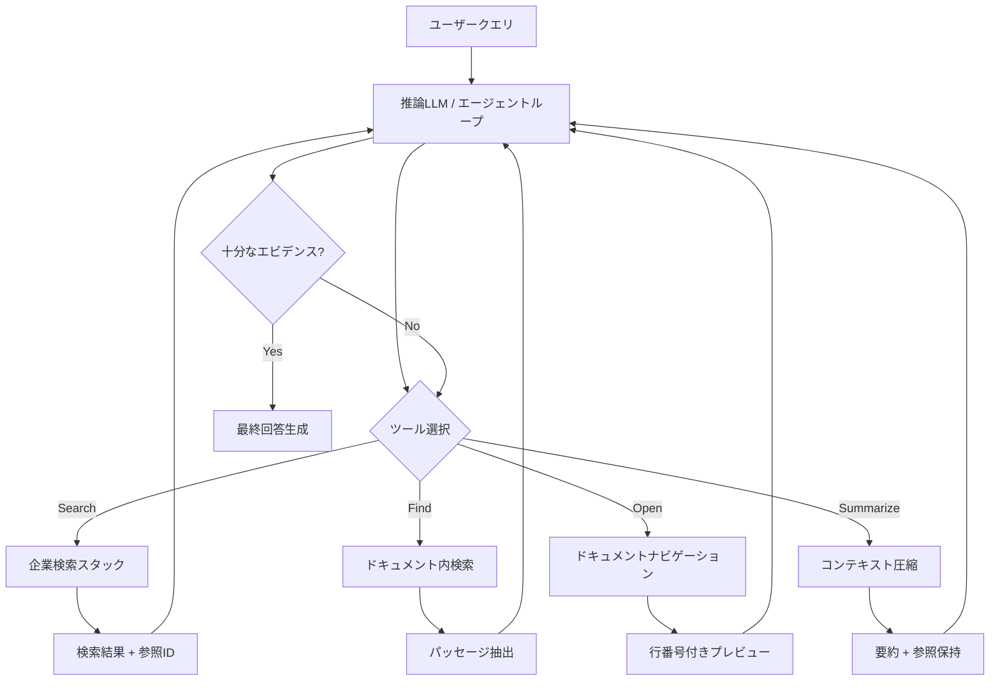

本記事は <https://arxiv.org/abs/2605.05538> の解説記事です。

## 論文概要（Abstract）

AgenticRAGは、企業向けナレッジベースに対する検索・分析を反復エージェントループとして再定式化するフレームワークである。従来のRAGパイプラインが検索スタックへのグラウンディング依存度を高め、LLMを固定された候補集合に制約していた問題に対し、Search・Find・Open・Summarizeの4ツールを備えた軽量なエージェントハーネスを既存の検索インフラ上に構築する。BRIGHTベンチマークでrecall@1を49.6%（最良埋め込みベースライン比+21.8pp、単一検索比5.9倍）、FinanceBenchで正答率92.00%（従来RAGの24.24%に対し約3.8倍）を達成している。

この記事は [Zenn記事: FLARE×LangGraphで技術文書QAを反復検索ループ化し回答精度を高める](https://zenn.dev/0h_n0/articles/1310ef0d8ee818) の深掘りです。

## 情報源

- **arXiv ID**: 2605.05538
- **URL**: [https://arxiv.org/abs/2605.05538](https://arxiv.org/abs/2605.05538)
- **著者**: Susheel Suresh, Hazel Mak, Shangpo Chou, Fred Kroon, Sahil Bhatnagar（Microsoft）
- **発表年**: 2026年5月
- **分野**: cs.AI（Artificial Intelligence）、cs.IR（Information Retrieval）

## 背景と動機（Background & Motivation）

標準的なRAGパイプラインでは、ユーザークエリに対して1回の検索で上位k件のドキュメントを取得し、それをコンテキストとしてLLMに渡す。この単一検索アプローチには構造的な限界がある。第一に、検索スタックへの過度な依存により、検索段階で関連ドキュメントを取りこぼすとLLMの回答品質が直接低下する。第二に、多段推論を要する質問（例：「A社の2024年Q3売上が前年同期比でどの程度変動したか」）では、複数ドキュメントを横断的に参照する必要があるが、単一クエリでは必要な情報を網羅できない。

著者らはこの課題に対し、LLM自身が検索クエリを動的に生成・修正し、ドキュメント内をナビゲートし、取得したエビデンスを自律的に分析する「エージェント型検索」を提案している。FLAREやSelf-RAGなどの先行研究が検索タイミングの最適化に注力していたのに対し、AgenticRAGは検索・ナビゲーション・分析の全工程をツールとしてLLMに委譲することで、既存の検索インフラを変更せずに精度改善を実現する点が特徴的である。

## 主要な貢献（Key Contributions）

- **軽量エージェントハーネスの設計**: 既存の企業向け検索インフラの上にSearch・Find・Open・Summarizeの4ツールを配置する構成を提案。検索スタック自体の変更を不要とし、導入障壁を低減
- **単一検索からエージェント型検索への転換効果の実証**: アブレーション研究により、最も大きな改善要因が単一検索からエージェント型ツール利用への転換であることを示した（recall@1で5.9倍改善）
- **128Kコンテキスト管理メカニズム**: トークン予算の90%到達で警告を発し、閾値到達時に強制的にSummarizeを実行する仕組みにより、長大なドキュメント群を扱いつつもコンテキスト溢れを防止
- **3つの公開ベンチマーク（BRIGHT, WixQA, FinanceBench）での包括的評価**: 検索精度・事実性・回答正確性の各側面で従来手法を大幅に上回る結果を報告

## 技術的詳細（Technical Details）

### アーキテクチャ

AgenticRAGは、推論LLMが4つのツールを反復的に呼び出すエージェントループとして設計されている。従来のRAGが「検索 → 生成」の線形パイプラインであるのに対し、AgenticRAGではLLM自身が検索戦略を計画・実行・評価するサイクルを回す。



### 4つのツールの詳細

**Search（検索）**: 既存の企業検索スタックに委譲し、1クエリあたり最大10件の結果を返す。特筆すべきは、1回のツール呼び出しで最大5つのクエリ再構成（multi-query search）を実行でき、結果を統合・重複排除する仕組みである。各結果には一意の参照ID（`turnmmsearchnn`形式）が付与され、後続のFind・Openで追跡可能となる。

**Find（ドキュメント内検索）**: 特定ドキュメント内でキーワード・セマンティック検索を行い、1パターンあたり最大2パッセージ（約11Kトークン上限）を返す。大規模ドキュメント全体をコンテキストに含めずに、必要な箇所のみをピンポイントで取得できる。

**Open（ドキュメントナビゲーション）**: ドキュメントのローリングウィンドウ表示を提供する。デフォルトで1回あたり1,800行を行番号付きで返し、レスポンスヘッダに表示範囲（例：`Viewing lines [0–1799] of 3000`）を含める。LLMは明示的な行番号を指定して後続のOpen呼び出しを行い、ドキュメント内を自在にナビゲートできる。

**Summarize（コンテキスト圧縮）**: 128Kトークンのコンテキスト予算を管理する。会話がトークン予算の90%（約115Kトークン）に達すると内部警告を発し、閾値到達時に強制的にSummarizeを実行する。保持された参照IDに関連付けられたコンテンツは残しつつ、不要な中間結果を圧縮する。

### トークン予算管理

AgenticRAGのコンテキスト管理は以下のように定式化される。

$$
\text{TokenBudget}(t) = \sum_{i=1}^{t} \text{tokens}(\text{msg}_i) \leq C_{\max}
$$

ここで、
- $t$: 現在のターン数
- $\text{msg}_i$: $i$番目のメッセージ（ツール呼び出し結果を含む）
- $C_{\max}$: コンテキスト上限（128Kトークン）

Summarize実行時のコンテキスト圧縮は次のように表現できる。

$$
\text{Context}'(t) = \text{Summarize}\bigl(\text{Context}(t), \mathcal{R}_{\text{preserved}}\bigr)
$$

ここで、
- $\text{Context}(t)$: ターン$t$時点の全会話履歴
- $\mathcal{R}_{\text{preserved}}$: 保持すべき参照ID集合
- $\text{Context}'(t)$: 圧縮後のコンテキスト

保持された参照IDに紐づくエビデンスはSummarize後も残るため、LLMは圧縮後にOpen・Findで深掘りを継続できる。

### Multi-Query Searchの効率性

multi-query searchは検索効率に寄与する。著者らのアブレーション研究では、multi-queryを除去するとツール呼び出し回数が4.79回から6.79回に増加（約42%増）する一方、recall@1は43.49%から44.84%と同等水準に留まると報告されている。すなわち、multi-queryは精度を維持しつつ、LLMの推論ステップ数を削減する効率化メカニズムとして機能する。

### 検索精度の定式化

BRIGHTベンチマークにおけるrecall@kは以下で定義される。

$$
\text{Recall}@k = \frac{1}{|\mathcal{Q}|} \sum_{q \in \mathcal{Q}} \frac{|\mathcal{D}_q^{\text{ret}}(k) \cap \mathcal{D}_q^{\text{rel}}|}{|\mathcal{D}_q^{\text{rel}}|}
$$

ここで、
- $\mathcal{Q}$: クエリ集合
- $\mathcal{D}_q^{\text{ret}}(k)$: クエリ$q$に対する上位$k$件の検索結果
- $\mathcal{D}_q^{\text{rel}}$: クエリ$q$の正解ドキュメント集合

AgenticRAGでは、エージェントが返した最終的な参照ドキュメント群を$\mathcal{D}_q^{\text{ret}}$として評価する。

## 実装のポイント（Implementation）

AgenticRAGの設計思想をLangGraphで再現する場合、各ツールをノードとして定義し、エージェントループを条件付きエッジで制御する構成が自然である。以下に、コア部分の実装例を示す。

```python
from typing import TypedDict, Annotated
from langgraph.graph import StateGraph, END
from langchain_core.messages import BaseMessage


class AgenticRAGState(TypedDict):
    """AgenticRAGのエージェント状態を管理する型定義.

    Attributes:
        messages: LLMとツール間の会話履歴
        token_count: 現在のトークン使用量
        references: 参照ID → ドキュメントメタデータのマッピング
        iteration: 現在のエージェントループ反復回数
    """
    messages: Annotated[list[BaseMessage], "会話履歴"]
    token_count: int
    references: dict[str, dict]
    iteration: int


TOKEN_BUDGET: int = 128_000
SUMMARIZE_WARNING_RATIO: float = 0.9


def should_summarize(state: AgenticRAGState) -> bool:
    """トークン予算の90%に達したかを判定する.

    Args:
        state: 現在のエージェント状態

    Returns:
        Summarizeを実行すべきかどうか
    """
    return state["token_count"] >= int(TOKEN_BUDGET * SUMMARIZE_WARNING_RATIO)


def build_agentic_rag_graph() -> StateGraph:
    """AgenticRAGのエージェントループをLangGraphで構築する.

    Search/Find/Open/Summarizeの4ツールを持つ
    反復エージェントグラフを返す。

    Returns:
        コンパイル済みのStateGraph
    """
    graph = StateGraph(AgenticRAGState)

    graph.add_node("agent", agent_node)
    graph.add_node("search", search_tool_node)
    graph.add_node("find", find_tool_node)
    graph.add_node("open", open_tool_node)
    graph.add_node("summarize", summarize_tool_node)

    graph.add_conditional_edges(
        "agent",
        route_tool_call,
        {
            "search": "search",
            "find": "find",
            "open": "open",
            "summarize": "summarize",
            "finish": END,
        },
    )

    for tool_node in ["search", "find", "open", "summarize"]:
        graph.add_edge(tool_node, "agent")

    graph.set_entry_point("agent")
    return graph.compile()
```

実装上の注意点として、著者らはプロダクション展開から得られた知見を以下のように報告している。ドキュメントメタデータ（タイトル、ファイル名、種別）をSearch結果に含めることで、意味的に類似したスニペット間の区別が容易になる。また、行番号付きドキュメントプレビューにより、LLMがドキュメント内の特定箇所へジャンプする際のアンカーとして機能する。

## Production Deployment Guide

AgenticRAGは反復的なツール呼び出しを伴うため、単純RAGと比較してレイテンシとトークンコストが増加する。著者らの報告では、BRIGHTでは平均4.79回のツール呼び出しで52.3Kトークン（単一検索の2.6倍）、FinanceBenchでは114.8Kトークン（単一検索の7.8倍）を消費する。以下では、これらの特性を踏まえたAWS構成を示す。

### AWS実装パターン（コスト最適化重視）

以下はマルチエージェントRAG特化のトラフィック量別推奨構成である。コスト試算は2026年5月時点のap-northeast-1（東京）リージョン料金に基づく概算値であり、実際のコストはトラフィックパターン、バースト使用量、LLMトークン消費により変動する。最新料金はAWS料金計算ツールで確認を推奨する。

| 構成 | トラフィック | コンピュート | LLM推論 | 状態管理 | オーケストレーション | 月額概算 |
|------|------------|-------------|---------|---------|-------------------|---------|
| **Small** | ~100 req/日 | Lambda (1GB, 300s) | Bedrock (Claude Sonnet) | DynamoDB (On-Demand) | Step Functions (Standard) | $80-200 |
| **Medium** | ~1,000 req/日 | ECS Fargate (2vCPU, 4GB) | Bedrock (Prompt Caching有効) | ElastiCache (t4g.micro) | Step Functions (Express) | $400-900 |
| **Large** | 10,000+ req/日 | EKS + Spot (m6i.xlarge) | Bedrock (Batch API + Caching) | ElastiCache (r7g.large) | 自前オーケストレーター | $2,500-6,000 |

**Small構成の内訳（~100 req/日）**:
- Lambda: 100req × 300s × 1GB = 30,000 GB-秒/月 ≈ $5
- Bedrock Claude Sonnet: 100req × 52Kトークン平均 ≈ 520万トークン/月 ≈ $50-100
- Step Functions: 100 × 30日 × 5ステップ = 15,000遷移/月 ≈ $1未満
- DynamoDB: On-Demand、参照ID・会話履歴保存 ≈ $5-10

**コスト削減テクニック**:
- Bedrock Prompt Caching: システムプロンプト・ツール定義の再利用で30-90%削減
- Bedrock Batch API: 非リアルタイム処理（バッチ分析）で50%削減
- Spot Instances（Large構成）: EKSワーカーノードで最大90%削減
- ハイブリッドルーティング: 単純クエリは従来RAG、複雑クエリのみAgenticRAGに振り分け

### Terraformインフラコード

**Small構成（Serverless）: Lambda + Bedrock + Step Functions**

```hcl
# AgenticRAG Small構成 - Serverless
# 2026年5月時点 ap-northeast-1

terraform {
  required_version = ">= 1.9"
  required_providers {
    aws = { source = "hashicorp/aws", version = "~> 5.80" }
  }
}

provider "aws" { region = "ap-northeast-1" }

# --- IAM（最小権限） ---
resource "aws_iam_role" "agentic_rag_lambda" {
  name = "agentic-rag-lambda-role"
  assume_role_policy = jsonencode({
    Version = "2012-10-17"
    Statement = [{
      Action = "sts:AssumeRole"
      Effect = "Allow"
      Principal = { Service = "lambda.amazonaws.com" }
    }]
  })
}

resource "aws_iam_role_policy" "bedrock_invoke" {
  name = "bedrock-invoke"
  role = aws_iam_role.agentic_rag_lambda.id
  policy = jsonencode({
    Version = "2012-10-17"
    Statement = [{
      Effect   = "Allow"
      Action   = ["bedrock:InvokeModel", "bedrock:InvokeModelWithResponseStream"]
      Resource = "arn:aws:bedrock:ap-northeast-1::foundation-model/anthropic.claude-*"
    }]
  })
}

resource "aws_iam_role_policy" "dynamodb_access" {
  name = "dynamodb-access"
  role = aws_iam_role.agentic_rag_lambda.id
  policy = jsonencode({
    Version = "2012-10-17"
    Statement = [{
      Effect   = "Allow"
      Action   = ["dynamodb:GetItem", "dynamodb:PutItem", "dynamodb:UpdateItem", "dynamodb:Query"]
      Resource = aws_dynamodb_table.agent_state.arn
    }]
  })
}

# --- DynamoDB（エージェント状態管理） ---
resource "aws_dynamodb_table" "agent_state" {
  name         = "agentic-rag-state"
  billing_mode = "PAY_PER_REQUEST" # コスト最適化: On-Demand
  hash_key     = "session_id"
  range_key    = "turn_id"

  attribute {
    name = "session_id"
    type = "S"
  }
  attribute {
    name = "turn_id"
    type = "N"
  }

  ttl {
    attribute_name = "expires_at"
    enabled        = true # 24時間後に自動削除でコスト削減
  }

  server_side_encryption { enabled = true } # KMS暗号化
}

# --- Lambda ---
resource "aws_lambda_function" "agentic_rag" {
  function_name = "agentic-rag-handler"
  runtime       = "python3.13"
  handler       = "handler.main"
  role          = aws_iam_role.agentic_rag_lambda.arn
  timeout       = 300 # 反復ツール呼び出しに対応
  memory_size   = 1024

  environment {
    variables = {
      TOKEN_BUDGET         = "128000"
      SUMMARIZE_THRESHOLD  = "0.9"
      MAX_ITERATIONS       = "15"
      DYNAMODB_TABLE       = aws_dynamodb_table.agent_state.name
    }
  }

  tracing_config { mode = "Active" } # X-Ray有効化

  filename         = "lambda.zip"
  source_code_hash = filebase64sha256("lambda.zip")
}

# --- CloudWatch アラーム（コスト監視） ---
resource "aws_cloudwatch_metric_alarm" "lambda_duration" {
  alarm_name          = "agentic-rag-high-duration"
  comparison_operator = "GreaterThanThreshold"
  evaluation_periods  = 3
  metric_name         = "Duration"
  namespace           = "AWS/Lambda"
  period              = 300
  statistic           = "Average"
  threshold           = 240000 # 240秒 = タイムアウト80%
  alarm_actions       = [] # SNSトピックARNを設定

  dimensions = {
    FunctionName = aws_lambda_function.agentic_rag.function_name
  }
}
```

**Large構成（Container）: EKS + Bedrock + ElastiCache**

```hcl
# AgenticRAG Large構成 - Container
# 2026年5月時点 ap-northeast-1

module "eks" {
  source  = "terraform-aws-modules/eks/aws"
  version = "~> 20.31"

  cluster_name    = "agentic-rag-cluster"
  cluster_version = "1.32"

  vpc_id     = module.vpc.vpc_id
  subnet_ids = module.vpc.private_subnets

  cluster_endpoint_public_access = false # セキュリティ: プライベートのみ
}

# --- Karpenter（Spot優先オートスケーリング） ---
resource "kubectl_manifest" "karpenter_nodepool" {
  yaml_body = yamlencode({
    apiVersion = "karpenter.sh/v1"
    kind       = "NodePool"
    metadata   = { name = "agentic-rag-pool" }
    spec = {
      template = {
        spec = {
          requirements = [
            { key = "karpenter.sh/capacity-type", operator = "In", values = ["spot", "on-demand"] },
            { key = "node.kubernetes.io/instance-type", operator = "In",
              values = ["m6i.xlarge", "m6i.2xlarge", "m7i.xlarge", "m7i.2xlarge"] },
          ]
          nodeClassRef = { name = "default" }
        }
      }
      limits   = { cpu = "64", memory = "256Gi" }
      disruption = {
        consolidationPolicy = "WhenEmptyOrUnderutilized"
        consolidateAfter    = "30s" # アイドルノード早期回収でコスト削減
      }
    }
  })
}

# --- ElastiCache（参照キャッシュ・セッション状態） ---
resource "aws_elasticache_replication_group" "agent_cache" {
  replication_group_id = "agentic-rag-cache"
  description          = "Agent state and reference cache"
  engine               = "redis"
  engine_version       = "7.1"
  node_type            = "cache.r7g.large"
  num_cache_clusters   = 2 # Multi-AZ

  at_rest_encryption_enabled = true
  transit_encryption_enabled = true
  subnet_group_name          = aws_elasticache_subnet_group.private.name
}

# --- AWS Budgets（予算アラート） ---
resource "aws_budgets_budget" "monthly" {
  name         = "agentic-rag-monthly"
  budget_type  = "COST"
  limit_amount = "6000"
  limit_unit   = "USD"
  time_unit    = "MONTHLY"

  notification {
    comparison_operator       = "GREATER_THAN"
    threshold                 = 80
    threshold_type            = "PERCENTAGE"
    notification_type         = "ACTUAL"
    subscriber_email_addresses = ["ops@example.com"]
  }
}
```

### 運用・監視設定

**CloudWatch Logs Insights クエリ: コスト異常検知**

```
# 1時間あたりのトークン使用量推移
fields @timestamp, token_count, iteration_count, tool_calls
| stats sum(token_count) as total_tokens,
        avg(iteration_count) as avg_iterations,
        count(*) as request_count
  by bin(1h)
| filter total_tokens > 10000000
| sort @timestamp desc
```

**CloudWatch Logs Insights クエリ: レイテンシ分析**

```
# P95/P99レイテンシとツール呼び出し回数の相関
fields @timestamp, duration_ms, tool_calls, query_complexity
| stats percentile(duration_ms, 95) as p95,
        percentile(duration_ms, 99) as p99,
        avg(tool_calls) as avg_tools
  by bin(1h)
| sort @timestamp desc
```

**CloudWatch アラーム設定（Python）: Bedrockトークン使用量スパイク検知**

```python
import boto3


def create_token_usage_alarm(sns_topic_arn: str) -> dict:
    """Bedrockトークン使用量の急増を検知するCloudWatchアラームを作成する.

    Args:
        sns_topic_arn: 通知先SNSトピックのARN

    Returns:
        CloudWatch put_metric_alarm APIのレスポンス
    """
    cw = boto3.client("cloudwatch", region_name="ap-northeast-1")
    return cw.put_metric_alarm(
        AlarmName="agentic-rag-token-spike",
        MetricName="InputTokenCount",
        Namespace="AWS/Bedrock",
        Statistic="Sum",
        Period=3600,
        EvaluationPeriods=2,
        Threshold=5_000_000,
        ComparisonOperator="GreaterThanThreshold",
        AlarmActions=[sns_topic_arn],
        Dimensions=[
            {"Name": "ModelId", "Value": "anthropic.claude-sonnet-4-20250514"},
        ],
    )
```

**X-Ray トレーシング設定（Python）: エージェントループの可観測性**

```python
from aws_xray_sdk.core import xray_recorder, patch_all


patch_all()  # boto3自動計装


@xray_recorder.capture("agentic_rag_iteration")
def trace_agent_iteration(
    session_id: str,
    iteration: int,
    tool_name: str,
    token_count: int,
) -> None:
    """エージェントループの各反復をX-Rayセグメントとして記録する.

    Args:
        session_id: セッション識別子
        iteration: 反復回数
        tool_name: 実行されたツール名
        token_count: 現在のトークン使用量
    """
    subsegment = xray_recorder.current_subsegment()
    subsegment.put_annotation("session_id", session_id)
    subsegment.put_annotation("tool", tool_name)
    subsegment.put_metadata("iteration", iteration)
    subsegment.put_metadata("token_count", token_count)
    subsegment.put_metadata("budget_usage_pct", token_count / 128_000 * 100)
```

**Cost Explorer自動レポート（Python）: 日次コスト監視**

```python
import boto3
from datetime import date, timedelta


def get_daily_cost_report() -> dict[str, float]:
    """Bedrock/Lambda/DynamoDBの日次コストを取得する.

    Returns:
        サービス別のコスト辞書（例: {"Bedrock": 12.5, "Lambda": 0.3}）
    """
    ce = boto3.client("ce", region_name="us-east-1")
    today = date.today()
    yesterday = today - timedelta(days=1)

    response = ce.get_cost_and_usage(
        TimePeriod={
            "Start": yesterday.isoformat(),
            "End": today.isoformat(),
        },
        Granularity="DAILY",
        Metrics=["UnblendedCost"],
        Filter={
            "Dimensions": {
                "Key": "SERVICE",
                "Values": [
                    "Amazon Bedrock",
                    "AWS Lambda",
                    "Amazon DynamoDB",
                    "Amazon ElastiCache",
                ],
            }
        },
        GroupBy=[{"Type": "DIMENSION", "Key": "SERVICE"}],
    )

    costs: dict[str, float] = {}
    for group in response["ResultsByTime"][0]["Groups"]:
        service = group["Keys"][0]
        amount = float(group["Metrics"]["UnblendedCost"]["Amount"])
        costs[service] = amount

    total = sum(costs.values())
    if total > 100.0:
        _send_cost_alert(total, costs)

    return costs


def _send_cost_alert(total: float, breakdown: dict[str, float]) -> None:
    """日次コストが$100を超えた場合にSNS通知を送信する.

    Args:
        total: 合計コスト（USD）
        breakdown: サービス別コスト内訳
    """
    sns = boto3.client("sns", region_name="ap-northeast-1")
    message = f"AgenticRAG日次コスト警告: ${total:.2f}\n"
    for svc, cost in breakdown.items():
        message += f"  {svc}: ${cost:.2f}\n"

    sns.publish(
        TopicArn="arn:aws:sns:ap-northeast-1:ACCOUNT_ID:cost-alerts",
        Subject=f"AgenticRAG Cost Alert: ${total:.2f}/day",
        Message=message,
    )
```

### コスト最適化チェックリスト

**アーキテクチャ選択**:
- [ ] トラフィック量に応じた構成を選択（~100 req/日: Serverless、~1,000 req/日: Hybrid、10,000+ req/日: Container）
- [ ] 単純クエリと複雑クエリのハイブリッドルーティングを実装（論文の設計方針に準拠）
- [ ] Step Functions Express（短時間）とStandard（長時間）を適切に使い分け

**リソース最適化**:
- [ ] EC2/EKS: Spot Instances優先（最大90%削減）
- [ ] Reserved Instances: 1年コミット（最大72%削減）
- [ ] Savings Plans: コンピュート全体で検討
- [ ] Lambda: メモリサイズを実測値ベースで最適化（Power Tuning）
- [ ] ECS/EKS: Karpenterでアイドル時30秒後にノード回収
- [ ] DynamoDB: On-Demandモード + TTLで古いセッション自動削除

**LLMコスト削減**:
- [ ] Bedrock Batch API: 非リアルタイム処理で50%削減
- [ ] Prompt Caching: システムプロンプト・ツール定義の再利用で30-90%削減
- [ ] モデル選択ロジック: 単純クエリにはHaiku、複雑クエリにはSonnet
- [ ] トークン数制限: MAX_ITERATIONS上限（デフォルト15）で暴走防止
- [ ] 検索結果スニペット長の制限: 過剰なコンテキスト投入を抑制

**監視・アラート**:
- [ ] AWS Budgets: 月次予算アラート（80%到達で通知）
- [ ] CloudWatch アラーム: トークン使用量スパイク検知
- [ ] Cost Anomaly Detection: ML ベースの異常検知有効化
- [ ] 日次コストレポート: Cost Explorer API + SNS通知
- [ ] X-Rayトレーシング: エージェントループの各反復を記録

**リソース管理**:
- [ ] 未使用リソース削除: 開発環境のEKSクラスタ・ElastiCache
- [ ] タグ戦略: `project=agentic-rag`, `env=prod/dev`で全リソースにタグ付与
- [ ] ライフサイクルポリシー: CloudWatch Logs保持期間（本番30日、開発7日）
- [ ] 開発環境夜間停止: EventBridgeでECSタスク数を0にスケールイン

## 実験結果（Results）

著者らは3つの公開ベンチマークで評価を行い、以下の結果を報告している。

**BRIGHT（長文脈検索、Recall@1）**

| モデル | 平均 | Biology | Earth | Economics | Psychology | Robotics | Stack | Sustainable | Pony |
|--------|------|---------|-------|-----------|------------|----------|-------|-------------|------|
| AgenticRAG (Claude Sonnet 4.5) | **49.6** | 62.3 | 60.0 | 58.7 | 67.9 | 55.0 | 34.1 | 51.7 | 7.1 |
| AgenticRAG (GPT-5-mini) | 43.5 | 61.7 | 48.1 | 41.4 | 65.3 | 39.4 | 40.6 | 46.6 | 4.8 |
| 最良埋め込み (Qwen) | 27.8 | 39.2 | 36.1 | 25.7 | 42.3 | 21.3 | 23.5 | 33.1 | 1.3 |

**WixQA（事実性スコア、Expert Written分割）**

| 手法 | 事実性スコア |
|------|------------|
| AgenticRAG (GPT-5-mini) | **0.96** |
| E5 Embedding | 0.85 |
| BM25 | 0.83 |

**FinanceBench（回答正確性）**

| 手法 | 正答率 |
|------|--------|
| Oracle（正解エビデンス直接入力） | 94.00% |
| AgenticRAG (GPT-5-mini) | **92.00%** |
| AgenticRAG (Claude Sonnet 4.5) | 91.78% |
| Agentic + Keyword Tools | 32.71% |
| 従来RAG | 24.24% |

著者らのアブレーション研究（GPT-5-mini、BRIGHT）では、単一検索（recall@1: 8.41%）からフルシステム（43.49%）への改善が最大の要因であり、5.2倍の向上を示している。Summarize・Semantic Findの除去は精度に大きな影響を与えず、multi-query searchの除去はツール呼び出し回数を42%増加させる一方で精度は同等水準を維持すると報告されている。

トークンコストについて、著者らはBRIGHT平均で52.3Kトークン（単一検索の2.6倍）、FinanceBenchで114.8Kトークン（7.8倍）と報告している。FinanceBenchの高コストは、116Kトークン規模のドキュメント内を深くナビゲートする必要があることに起因する。

## 実運用への応用（Practical Applications）

AgenticRAGは既存の検索インフラを変更せずに導入できる設計であるため、エンタープライズ環境での段階的導入に適している。著者らが報告しているプロダクション展開の知見は実務上有用である。

**ハイブリッドルーティング**: 全クエリをAgenticRAGに送るのではなく、クエリ複雑度に基づいて従来RAGとの振り分けを行う。単純な事実確認（「A社のCEOは誰か」）は従来RAGで十分であり、多段推論を要する質問のみAgenticRAGに回す。これによりレイテンシとトークンコストを大幅に削減できる。関連するZenn記事で解説されているFLAREの反復検索ループも同様のアプローチであり、LangGraphの条件付きエッジでルーティングロジックを実装できる。

**ドキュメントメタデータの活用**: Search結果にドキュメントのタイトル・ファイル名・種別を含めることで、LLMが類似スニペットを区別しやすくなる。企業ナレッジベースでは同一トピックの異なるバージョンのドキュメントが存在するケースが多く、メタデータによる識別が精度向上に直結する。

**128Kコンテキスト管理**: FinanceBenchでの114.8Kトークン消費が示すように、大規模ドキュメントの深掘りではコンテキストウィンドウの上限に近づく。Summarizeによる動的圧縮は必須であり、圧縮後も参照IDを保持する設計により、後続のFind・Openで追跡が途切れない。

## 関連研究（Related Work）

- **FLARE** (Jiang et al., 2023): LLMが生成中に信頼度が低下した時点で動的に検索を発動するアプローチ。AgenticRAGとは検索トリガーの粒度が異なり、FLAREがトークンレベルの信頼度に基づくのに対し、AgenticRAGはツール呼び出しレベルで判断する
- **Self-RAG** (Asai et al., 2024): 検索の要否・検索結果の関連性・生成の忠実度を特殊トークンで自己評価するフレームワーク。AgenticRAGはファインチューニング不要で既存LLMに適用可能な点で差別化される
- **UAR (Unified Active Retrieval)** (Ren et al., 2025): タイミング判断・検索方法選択・文書選択の3要素を統合的に扱う枠組み。AgenticRAGは検索メカニズム自体ではなく、既存検索インフラ上のハーネスとして機能する点が異なる
- **ReDI**: エンベディングベースの強化検索手法。BRIGHTベンチマークにおいてAgenticRAGと比較されており、recall@1で26.0%に対しAgenticRAGは49.6%と大きく上回っている

## まとめと今後の展望

AgenticRAGは、RAGを単一検索パイプラインからエージェント型ツール利用へ転換することで、検索精度を大幅に改善できることを実証した。最大の貢献は、既存の企業向け検索インフラを変更せずに、Search・Find・Open・Summarizeの4ツールを備えた軽量ハーネスで精度向上を達成した点にある。

ただし、トークンコストは単一検索の2.6-7.8倍に増加し、反復ツール呼び出しによるレイテンシも課題として残る。著者らが提案するハイブリッドルーティング（単純クエリは従来RAG、複雑クエリのみAgenticRAG）は現実的な緩和策である。今後は、エージェントの検索戦略をオフライン最適化するメタ学習や、ツール呼び出しの並列化による低レイテンシ化が研究方向として期待される。

## 参考文献

- **arXiv**: [https://arxiv.org/abs/2605.05538](https://arxiv.org/abs/2605.05538)
- **Related Zenn article**: [FLARE×LangGraphで技術文書QAを反復検索ループ化し回答精度を高める](https://zenn.dev/0h_n0/articles/1310ef0d8ee818)
- **FLARE**: Jiang et al., "Active Retrieval Augmented Generation," EMNLP 2023
- **Self-RAG**: Asai et al., "Self-RAG: Learning to Retrieve, Generate, and Critique through Self-Reflection," ICLR 2024
