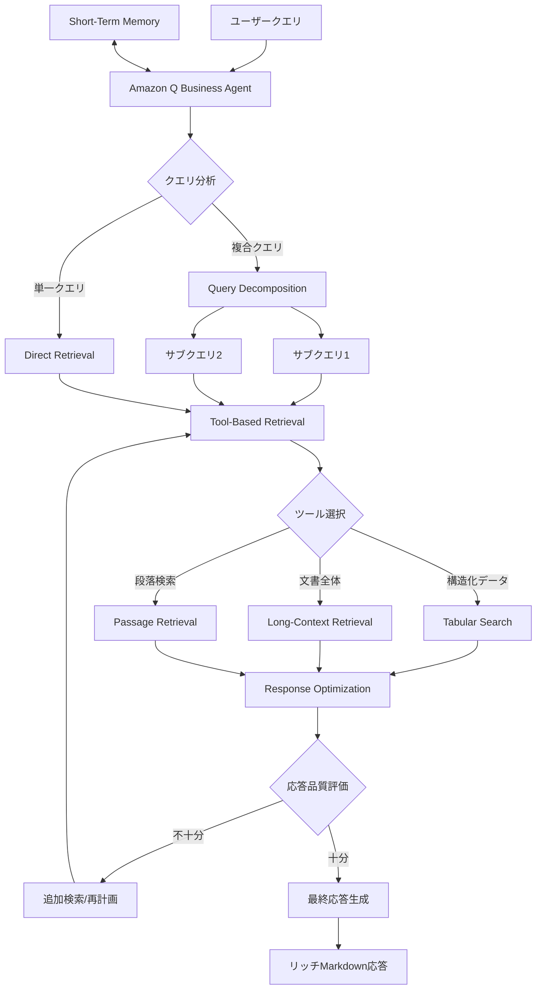
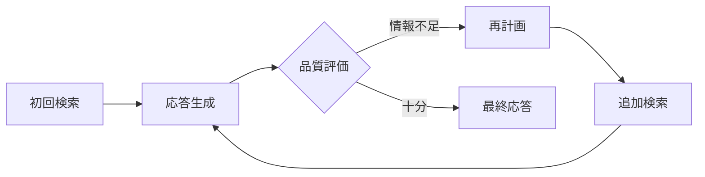

## ブログ概要（Summary）

本記事は [AWSブログ: Bringing Agentic RAG to Amazon Q Business](https://aws.amazon.com/blogs/machine-learning/bringing-agentic-retrieval-augmented-generation-to-amazon-q-business/) の解説記事です。AWSは、Amazon Q Businessに「Agentic RAG」機能を導入し、従来の単発検索型RAGでは困難であった複雑なエンタープライズクエリへの対応を実現した。AIエージェントがクエリ分解、ツールベース検索、マルチターン会話状態管理、応答最適化の4つの柱で動的な検索戦略を実行する仕組みを、AWSブログの内容に基づいて解説する。

この記事は [Zenn記事: FLARE×LangGraphで技術文書QAを反復検索ループ化し回答精度を高める](https://zenn.dev/0h_n0/articles/1310ef0d8ee818) の深掘りです。

## 情報源

- **種別**: 企業テックブログ
- **URL**: [https://aws.amazon.com/blogs/machine-learning/bringing-agentic-retrieval-augmented-generation-to-amazon-q-business/](https://aws.amazon.com/blogs/machine-learning/bringing-agentic-retrieval-augmented-generation-to-amazon-q-business/)
- **組織**: Amazon Web Services (AWS) Machine Learning Blog
- **著者**: Sanjit Misra, Kapil Badesara, Danilo Neves Ribeiro, Venky Nagapudi, Sunil Singh, Yi-An Lai, Yumo Xu
- **発表日**: 2025年8月14日

## 技術的背景（Technical Background）

### 従来RAGの限界

従来のRAG（Retrieval-Augmented Generation）は、ユーザークエリに基づいて関連文書や段落を検索し、それをコンテキストとしてLLMに渡して回答を生成するアプローチである。AWSブログでは、このアプローチが「基本的な事実確認型の質問には有効」であると認めつつ、以下の限界を指摘している。

**従来RAGの課題:**
- **不完全な回答**: 複雑な質問（例: 「2024年の東南部と北東部の指標の変化を比較せよ」）に対し、断片的な情報しか返せない
- **段落単位検索の限界**: 文書全体の分析が必要なケース（例: 「10Kレポートを要約せよ」）で、検索結果が断片化し一貫性を損なう
- **不透明な処理**: ユーザーがシステムの処理状況を把握できず、進捗が見えないまま待機を強いられる
- **コンテキスト喪失**: マルチターン会話で前回の文脈が失われ、ユーザーが毎回コンテキストを再入力する必要がある

### なぜAgentic RAGが必要か

Zenn記事で解説したFLARE（Forward-Looking Active REtrieval augmented generation）は、LLMの生成中に信頼度が低い箇所を検出して反復検索ループを実行するアプローチであり、「応答の不完全さを検知して追加検索する」という思想はAgentic RAGと共通している。AWSはこの概念をエンタープライズ向けマネージドサービスとして実装し、クエリ分解・ツール選択・会話状態管理・応答品質評価を統合したエージェントアーキテクチャとして提供している。

## 実装アーキテクチャ（Architecture）

AWSブログによると、Amazon Q BusinessのAgentic RAGは4つの主要コンポーネントで構成される。

### アーキテクチャ全体像



### 1. Query Decomposition（クエリ分解）

AWSブログでは、複雑な質問を離散的なコンポーネントに分解し、並列にデータ探索を行う仕組みを説明している。

**具体例**: 「ワシントン州とカリフォルニア州の休暇ポリシーを比較せよ」というクエリに対して、エージェントは以下のように分解する。

1. サブクエリ1: "washington state vacation policies"
2. サブクエリ2: "california state vacation policies"

各サブクエリの検索結果をLLMが統合し、リッチなMarkdown形式で比較結果を提示する。AWSブログでは、この分解過程がリアルタイムでユーザーに表示され、「クエリ分解パターン、文書検索パス、応答生成ワークフロー」の各ステップが透過的に確認できると説明されている。

### 2. Tool-Based Retrieval（ツールベース検索）

エージェントは、クエリの性質に応じて適切な検索ツールを選択する。

| ツール | 用途 | 対象データ |
|--------|------|-----------|
| **Tabular Search** | 構造化データの検索 | DOCX/PPTX/PDF内の表、CSV/XLSX |
| **Long-Context Retrieval** | 文書全体の分析 | 10Kレポート等の長文書 |
| **Passage Retrieval** | 段落単位の検索 | 一般的なテキスト文書 |

**Tabular Search**は、AWSブログによると「コード生成またはテーブル線形化（tabular linearization）を通じた構造化データの検索」を行う。埋め込み表形式のデータ（DOCX/PPTX/PDF内のテーブル）とスプレッドシート（CSV/XLSX）の両方に対応している。

**Long-Context Retrieval**は、「10Kレポートを要約せよ」のような文書全体の理解が必要なクエリに対し、断片的なパッセージではなく文書全体をフェッチする。AWSブログでは、従来の段落単位検索が「複雑な文書分析の一貫性と完全性を損なう」ことを指摘し、Long-Context Retrievalがこの問題を解決すると述べている。

### 3. Multi-Turn Conversational State（マルチターン会話状態管理）

AWSブログでは、短期記憶（short-term memory）によるマルチターン会話の実現を説明している。

**動作メカニズム:**
- 会話コンテキストをインメモリに保持し、自然なフォローアップ質問を可能にする
- 複数の回答候補がある場合、曖昧さを解消するための明確化質問（clarifying questions）を生成する
- 会話状態と過去の検索結果の両方をメモリ内に保持する

**具体例**: ユーザーが「Qについて教えて」と質問した場合、Amazon Qには複数の実装（Amazon Q Business, Amazon Q Developer等）が存在するため、エージェントは各実装の概要を提示した上で、「どのQについて詳しく知りたいか」とフォローアップ質問を行う。ユーザーが特定の実装を指定すると、前回の会話コンテキストと検索結果を保持したまま、対象を絞った応答を生成する。

### 4. Response Optimization（応答最適化）

AWSブログが説明する最も特徴的な機能は、エージェントによる応答品質の継続的な評価と再計画である。



AWSブログでは、エージェントが「検索ツールの使用と応答生成プロセス全体を通じて計画・推論を行い、会話状態と履歴を考慮しつつ、必要に応じてプロセスを再計画する」と説明している。初回の検索で重要な情報が欠落していることを検知した場合、自律的に追加検索や代替検索戦略を開始する。

この反復的な品質改善ループは、Zenn記事で解説したFLAREの「信頼度ベースの再検索トリガー」と設計思想を共有しているが、Amazon Q Businessではエージェントが検索ツールの選択自体も動的に変更できる点で、より柔軟なアプローチとなっている。

## Production Deployment Guide

Amazon Q Businessはマネージドサービスであるため、直接のインフラ構築は不要だが、カスタムAgentic RAGシステムを構築する場合のAWSパターンを示す。以下は2026年5月時点のap-northeast-1（東京リージョン）料金に基づく概算値であり、実際のコストはトラフィックパターン、リージョン、バースト使用量により変動する。最新料金はAWS料金計算ツールで確認を推奨する。

### AWS実装パターン（コスト最適化重視）

AWSブログで紹介されたAgentic RAGアーキテクチャをカスタム実装する場合の構成パターンを示す。

| 規模 | 構成 | 主要サービス | 月額概算 |
|------|------|-------------|---------|
| **Small** (~100 req/日) | Serverless | Lambda + Bedrock + Amazon Q Business | $150-350 |
| **Medium** (~1,000 req/日) | Hybrid | ECS Fargate + Bedrock + OpenSearch Serverless | $800-1,500 |
| **Large** (10,000+ req/日) | Container | EKS + Bedrock + OpenSearch + ElastiCache | $3,000-6,000 |

**Small構成の内訳:**
- Amazon Q Business: Business Lite $3/ユーザー/月（50ユーザー想定で$150）
- Lambda: クエリ分解・ツール選択ロジック（~$5/月）
- Bedrock (Claude Sonnet): カスタム応答生成（~$50-100/月）
- DynamoDB: 会話状態保持（~$5/月）
- CloudWatch: 監視・ログ（~$10/月）

**Medium構成の内訳:**
- ECS Fargate: エージェントオーケストレーター（2 vCPU, 4GB RAM, ~$120/月）
- Bedrock (Claude Sonnet): クエリ分解 + 応答生成（~$300-500/月）
- OpenSearch Serverless: ベクトル検索（2 OCU, ~$350/月）
- ElastiCache (Redis): 会話状態キャッシュ（cache.t4g.micro, ~$15/月）
- ALB + CloudWatch: $30/月

**Large構成の内訳:**
- EKS: コントロールプレーン（$73/月）+ Karpenter管理ノード
- EC2 (Spot): m6i.xlarge x 3-10台（~$300-1,000/月、Spot価格）
- Bedrock (Claude Sonnet): 高スループット（~$1,500-2,500/月）
- OpenSearch: マネージド3ノード（r6g.large, ~$600/月）
- ElastiCache (Redis): クラスタモード（~$200/月）

**コスト削減テクニック:**
- Spot Instances活用で最大90%削減（EKSワーカーノード）
- Reserved Instances（1年コミット）でOpenSearch最大40%削減
- Bedrock Batch APIで非同期処理を50%削減
- Bedrock Prompt Cachingで反復クエリのトークンコスト30-90%削減

### Terraformインフラコード

#### Small構成（Serverless: Lambda + Bedrock + DynamoDB）

```hcl
# Small構成: Agentic RAG Serverless
# Amazon Q Business + Lambda カスタムエージェント
# 2026年5月時点 ap-northeast-1

terraform {
  required_version = ">= 1.9"
  required_providers {
    aws = {
      source  = "hashicorp/aws"
      version = "~> 5.80"
    }
  }
}

provider "aws" {
  region = "ap-northeast-1"
}

# --- IAMロール（最小権限） ---
resource "aws_iam_role" "agentic_rag_lambda" {
  name = "agentic-rag-lambda-role"
  assume_role_policy = jsonencode({
    Version = "2012-10-17"
    Statement = [{
      Action = "sts:AssumeRole"
      Effect = "Allow"
      Principal = { Service = "lambda.amazonaws.com" }
    }]
  })
}

resource "aws_iam_role_policy" "lambda_bedrock" {
  name = "bedrock-invoke"
  role = aws_iam_role.agentic_rag_lambda.id
  policy = jsonencode({
    Version = "2012-10-17"
    Statement = [
      {
        Effect   = "Allow"
        Action   = ["bedrock:InvokeModel", "bedrock:InvokeModelWithResponseStream"]
        Resource = "arn:aws:bedrock:ap-northeast-1::foundation-model/anthropic.claude-*"
      },
      {
        Effect   = "Allow"
        Action   = ["dynamodb:GetItem", "dynamodb:PutItem", "dynamodb:UpdateItem", "dynamodb:Query"]
        Resource = aws_dynamodb_table.conversation_state.arn
      },
      {
        Effect   = "Allow"
        Action   = ["logs:CreateLogGroup", "logs:CreateLogStream", "logs:PutLogEvents"]
        Resource = "arn:aws:logs:ap-northeast-1:*:*"
      }
    ]
  })
}

# --- DynamoDB: 会話状態保持（On-Demand） ---
resource "aws_dynamodb_table" "conversation_state" {
  name         = "agentic-rag-conversation-state"
  billing_mode = "PAY_PER_REQUEST"
  hash_key     = "session_id"
  range_key    = "turn_id"

  attribute {
    name = "session_id"
    type = "S"
  }
  attribute {
    name = "turn_id"
    type = "N"
  }

  ttl {
    attribute_name = "expires_at"
    enabled        = true
  }

  server_side_encryption {
    enabled = true  # KMS暗号化
  }

  tags = {
    Project = "agentic-rag"
    Env     = "production"
  }
}

# --- Lambda: クエリ分解・ツール選択エージェント ---
resource "aws_lambda_function" "agentic_rag" {
  function_name = "agentic-rag-agent"
  runtime       = "python3.12"
  handler       = "agent.handler"
  role          = aws_iam_role.agentic_rag_lambda.arn
  timeout       = 120  # エージェントの再計画ループに十分な時間
  memory_size   = 1024 # Bedrock応答のパース処理に必要

  environment {
    variables = {
      DYNAMODB_TABLE     = aws_dynamodb_table.conversation_state.name
      BEDROCK_MODEL_ID   = "anthropic.claude-sonnet-4-20250514"
      MAX_REPLAN_ROUNDS  = "3"  # Response Optimization上限
    }
  }

  tracing_config {
    mode = "Active"  # X-Ray トレーシング有効化
  }

  tags = {
    Project = "agentic-rag"
  }
}

# --- CloudWatchアラーム: コスト監視 ---
resource "aws_cloudwatch_metric_alarm" "lambda_duration" {
  alarm_name          = "agentic-rag-lambda-duration"
  comparison_operator = "GreaterThanThreshold"
  evaluation_periods  = 3
  metric_name         = "Duration"
  namespace           = "AWS/Lambda"
  period              = 300
  statistic           = "Average"
  threshold           = 30000  # 30秒超で警告
  alarm_description   = "Lambda実行時間がResponse Optimization込みで想定超過"

  dimensions = {
    FunctionName = aws_lambda_function.agentic_rag.function_name
  }
}
```

#### Large構成（Container: EKS + Karpenter + OpenSearch）

```hcl
# Large構成: Agentic RAG Container
# EKS + Karpenter（Spot優先）+ OpenSearch
# 2026年5月時点 ap-northeast-1

module "eks" {
  source  = "terraform-aws-modules/eks/aws"
  version = "~> 20.31"

  cluster_name    = "agentic-rag-cluster"
  cluster_version = "1.31"

  vpc_id     = module.vpc.vpc_id
  subnet_ids = module.vpc.private_subnets

  # コスト最適化: パブリックアクセス制限
  cluster_endpoint_public_access  = false
  cluster_endpoint_private_access = true

  # KMS暗号化
  cluster_encryption_config = {
    provider_key_arn = aws_kms_key.eks.arn
    resources        = ["secrets"]
  }

  tags = {
    Project = "agentic-rag"
    Env     = "production"
  }
}

# --- Karpenter: Spot優先の自動スケーリング ---
resource "kubectl_manifest" "karpenter_nodepool" {
  yaml_body = yamlencode({
    apiVersion = "karpenter.sh/v1"
    kind       = "NodePool"
    metadata   = { name = "agentic-rag-pool" }
    spec = {
      template = {
        spec = {
          requirements = [
            { key = "karpenter.sh/capacity-type", operator = "In", values = ["spot", "on-demand"] },
            { key = "node.kubernetes.io/instance-type", operator = "In",
              values = ["m6i.xlarge", "m6i.2xlarge", "m7i.xlarge", "m7i.2xlarge"] },
            { key = "topology.kubernetes.io/zone", operator = "In",
              values = ["ap-northeast-1a", "ap-northeast-1c", "ap-northeast-1d"] }
          ]
          nodeClassRef = { name = "default" }
        }
      }
      disruption = {
        consolidationPolicy = "WhenEmptyOrUnderutilized"
        consolidateAfter    = "30s"
      }
      limits = {
        cpu    = "80"   # 最大80 vCPU
        memory = "320Gi"
      }
    }
  })
}

# --- Secrets Manager: Bedrock設定 ---
resource "aws_secretsmanager_secret" "bedrock_config" {
  name       = "agentic-rag/bedrock-config"
  kms_key_id = aws_kms_key.eks.arn
}

resource "aws_secretsmanager_secret_version" "bedrock_config" {
  secret_id = aws_secretsmanager_secret.bedrock_config.id
  secret_string = jsonencode({
    model_id          = "anthropic.claude-sonnet-4-20250514"
    max_replan_rounds = 5
    temperature       = 0.1
  })
}

# --- AWS Budgets: 予算アラート ---
resource "aws_budgets_budget" "agentic_rag" {
  name         = "agentic-rag-monthly"
  budget_type  = "COST"
  limit_amount = "6000"
  limit_unit   = "USD"
  time_unit    = "MONTHLY"

  cost_filter {
    name   = "TagKeyValue"
    values = ["user:Project$agentic-rag"]
  }

  notification {
    comparison_operator       = "GREATER_THAN"
    threshold                 = 80
    threshold_type            = "PERCENTAGE"
    notification_type         = "ACTUAL"
    subscriber_email_addresses = ["ops@example.com"]
  }

  notification {
    comparison_operator       = "GREATER_THAN"
    threshold                 = 100
    threshold_type            = "PERCENTAGE"
    notification_type         = "FORECASTED"
    subscriber_email_addresses = ["ops@example.com"]
  }
}
```

### 運用・監視設定

#### CloudWatch Logs Insights クエリ

```
# コスト異常検知: 1時間あたりのBedrock入出力トークン使用量
fields @timestamp, input_tokens, output_tokens
| stats sum(input_tokens) as total_input, sum(output_tokens) as total_output,
        sum(input_tokens + output_tokens) as total_tokens by bin(1h)
| filter total_tokens > 100000
| sort @timestamp desc

# レイテンシ分析: エージェント再計画回数とP95/P99
fields @timestamp, replan_count, duration_ms
| stats percentile(duration_ms, 95) as p95,
        percentile(duration_ms, 99) as p99,
        avg(replan_count) as avg_replans by bin(1h)
| sort @timestamp desc
```

#### CloudWatch アラーム設定

```python
import boto3
from typing import Any

def create_bedrock_token_alarm(
    cloudwatch: boto3.client,
    alarm_name: str = "agentic-rag-bedrock-tokens",
    threshold: float = 500000,
    sns_topic_arn: str = "",
) -> dict[str, Any]:
    """Bedrockトークン使用量スパイク検知アラームを作成する。

    Args:
        cloudwatch: CloudWatch クライアント
        alarm_name: アラーム名
        threshold: 5分間のトークン使用量閾値
        sns_topic_arn: 通知先SNSトピックARN

    Returns:
        CloudWatch put_metric_alarm のレスポンス
    """
    return cloudwatch.put_metric_alarm(
        AlarmName=alarm_name,
        MetricName="InputTokenCount",
        Namespace="AWS/Bedrock",
        Statistic="Sum",
        Period=300,
        EvaluationPeriods=2,
        Threshold=threshold,
        ComparisonOperator="GreaterThanThreshold",
        AlarmActions=[sns_topic_arn],
        Dimensions=[
            {"Name": "ModelId", "Value": "anthropic.claude-sonnet-4-20250514"}
        ],
    )
```

#### X-Ray トレーシング設定

```python
from aws_xray_sdk.core import xray_recorder, patch_all
from aws_xray_sdk.core.models.subsegment import Subsegment

# boto3自動計装
patch_all()


def trace_agentic_rag_step(
    step_name: str,
    query: str,
    tool_used: str,
    replan_round: int,
) -> Subsegment:
    """Agentic RAGの各ステップをX-Rayサブセグメントとして記録する。

    Args:
        step_name: ステップ名（例: "query_decomposition", "tool_retrieval"）
        query: 処理対象のクエリ文字列
        tool_used: 使用した検索ツール名
        replan_round: 現在の再計画ラウンド番号

    Returns:
        X-Ray サブセグメント
    """
    subsegment = xray_recorder.begin_subsegment(step_name)
    subsegment.put_annotation("tool", tool_used)
    subsegment.put_annotation("replan_round", replan_round)
    subsegment.put_metadata("query", query, "agentic_rag")
    return subsegment
```

#### Cost Explorer 自動レポート

```python
import boto3
from datetime import date, timedelta
from typing import Any


def get_daily_agentic_rag_cost(
    ce_client: boto3.client,
    target_date: date | None = None,
    cost_threshold: float = 100.0,
    sns_topic_arn: str = "",
) -> dict[str, Any]:
    """日次コストレポートを取得し、閾値超過時にSNS通知する。

    Args:
        ce_client: Cost Explorer クライアント
        target_date: 対象日（Noneの場合は前日）
        cost_threshold: アラート閾値（USD/日）
        sns_topic_arn: 通知先SNSトピックARN

    Returns:
        サービス別コスト内訳の辞書
    """
    if target_date is None:
        target_date = date.today() - timedelta(days=1)

    response = ce_client.get_cost_and_usage(
        TimePeriod={
            "Start": target_date.isoformat(),
            "End": (target_date + timedelta(days=1)).isoformat(),
        },
        Granularity="DAILY",
        Metrics=["UnblendedCost"],
        Filter={
            "Tags": {
                "Key": "Project",
                "Values": ["agentic-rag"],
            }
        },
        GroupBy=[{"Type": "DIMENSION", "Key": "SERVICE"}],
    )

    costs: dict[str, float] = {}
    total = 0.0
    for group in response["ResultsByTime"][0]["Groups"]:
        service = group["Keys"][0]
        amount = float(group["Metrics"]["UnblendedCost"]["Amount"])
        costs[service] = amount
        total += amount

    if total > cost_threshold and sns_topic_arn:
        sns = boto3.client("sns")
        sns.publish(
            TopicArn=sns_topic_arn,
            Subject=f"[Agentic RAG] Daily cost alert: ${total:.2f}",
            Message=f"Date: {target_date}\nTotal: ${total:.2f}\nBreakdown:\n"
            + "\n".join(f"  {k}: ${v:.2f}" for k, v in sorted(costs.items())),
        )

    return {"date": target_date.isoformat(), "total": total, "breakdown": costs}
```

### コスト最適化チェックリスト

#### アーキテクチャ選択

- [ ] トラフィック量に基づく構成選択（~100 req/日: Serverless、~1,000: Hybrid、10,000+: Container）
- [ ] Amazon Q Business利用可能な場合はマネージドサービスを優先

#### リソース最適化

- [ ] EC2: Spot Instances優先（EKSワーカーノード、Karpenter `spot` 優先設定）
- [ ] Reserved Instances: OpenSearch/ElastiCacheに1年コミットで最大40%削減
- [ ] Savings Plans: Fargate/Lambda向けCompute Savings Plans検討
- [ ] Lambda: メモリサイズ最適化（Power Tuningで実測、1024MB推奨）
- [ ] ECS/EKS: 夜間・休日のスケールダウン設定（Karpenter consolidation）

#### LLMコスト削減

- [ ] Bedrock Batch API: 非リアルタイム処理（バッチ分析等）に適用し50%削減
- [ ] Prompt Caching有効化: システムプロンプト・ツール定義の反復利用で30-90%削減
- [ ] モデル選択ロジック: 単純クエリはHaiku、複雑クエリはSonnetを動的選択
- [ ] トークン数制限: 入力コンテキスト長の上限設定とチャンク戦略最適化
- [ ] Response Optimization上限: 再計画ラウンド数に上限設定（推奨: 3-5回）

#### 監視・アラート

- [ ] AWS Budgets: プロジェクトタグベースの月次予算アラート（80%/100%閾値）
- [ ] CloudWatch アラーム: Bedrockトークン使用量、Lambda/ECS実行時間
- [ ] Cost Anomaly Detection: ML異常検知による予期せぬコストスパイク検出
- [ ] 日次コストレポート: Cost Explorer APIによる自動レポート + SNS通知

#### リソース管理

- [ ] 未使用リソース削除: 未アタッチEBS、不要なNAT Gateway、アイドルELB
- [ ] タグ戦略: `Project=agentic-rag`, `Env=prod/dev` の統一タグ適用
- [ ] ライフサイクルポリシー: S3/CloudWatch Logsの保持期間設定（90日推奨）
- [ ] 開発環境夜間停止: EventBridge + Lambdaによる自動停止/起動スケジュール
- [ ] DynamoDB TTL: 会話状態の自動期限切れ設定（24時間推奨）

## パフォーマンス最適化（Performance）

AWSブログでは具体的なベンチマーク数値は公開されていないが、アーキテクチャ上のパフォーマンス特性を以下のように整理できる。

**Query Decompositionの並列実行**: サブクエリを並列にデータソースへ発行することで、逐次検索と比較してレイテンシを低減する。$n$個のサブクエリに分解した場合、理想的にはレイテンシが$O(1)$（最も遅いサブクエリに律速）となるが、実際にはLLMによる分解・統合のオーバーヘッドが加算される。

**Response Optimizationのトレードオフ**: 再計画ループの回数が増えるほど応答品質は向上するが、レイテンシとトークンコストが増大する。カスタム実装では`MAX_REPLAN_ROUNDS`パラメータで上限を制御し、品質とコストのバランスを調整する。

**チューニング指針:**
- 初回検索の精度向上（埋め込みモデルの選択、チャンクサイズ調整）で再計画回数を削減
- Tabular SearchとLong-Context Retrievalのルーティング精度向上でツール選択のオーバーヘッドを削減
- 会話状態のインメモリキャッシュ（Redis/ElastiCache）でマルチターンのレイテンシを最小化

## 運用での学び（Production Lessons）

AWSブログの内容から、エンタープライズ環境でのAgentic RAG導入における運用上の考慮事項を整理する。

**セキュリティとアクセス制御**: AWSブログでは「既存の権限とアクセス制御を尊重し、ユーザーが認可された情報のみを受け取ることを保証する」と説明している。Agentic RAGでは複数のデータソースを横断検索するため、ドキュメント単位のアクセス制御が従来以上に重要となる。Amazon Q Businessでは既存のIAM/IdP連携によるアクセス制御がそのまま適用される。

**透明性の確保**: エージェントの処理ステップ（クエリ分解、ツール選択、再計画）をリアルタイムでユーザーに表示することで、「ブラックボックス」感を排除している。AWSブログでは「クエリ分解パターン、文書検索パス、応答生成ワークフロー」の各段階が可視化されると述べている。エンタープライズ環境では、この透明性が監査対応やコンプライアンス要件の充足にも寄与する。

**引用の明示**: AWSブログでは、応答に「明確な引用（clear citations）」を付与することが言及されている。RAGシステムの信頼性を担保するには、回答の根拠となった文書・段落を明示する仕組みが不可欠であり、Agentic RAGでも複数ステップを経た情報の出典追跡が求められる。

## 学術研究との関連（Academic Connection）

Amazon Q BusinessのAgentic RAGは、複数の学術研究と関連している。

**FLARE（Jiang et al., 2023）との関連**: Zenn記事で詳述したFLAREは、LLMの生成中に低信頼度トークンを検出して能動的に再検索を行う手法であり、AWSのResponse Optimizationにおける「応答品質を継続的に評価し、不十分な場合に追加検索を開始する」仕組みと設計思想を共有している。FLAREが生成トークンの確率値に基づく自動トリガーであるのに対し、Amazon Q Businessではエージェントが応答全体の完全性を評価する点が異なる。

**Self-RAG（Asai et al., 2023）との関連**: Self-RAGはLLMが自身の出力を批判的に評価し、検索の要否を動的に判断する手法であり、AWSのResponse Optimizationにおけるエージェントの自己評価ループと類似したアプローチである。

**ReAct（Yao et al., 2022）との関連**: AWSのエージェントが「計画→検索→推論→再計画」のループを実行する点は、ReActフレームワークの思考-行動-観察サイクルと対応している。

## まとめと実践への示唆

AWSがAmazon Q Businessに導入したAgentic RAGは、Query Decomposition、Tool-Based Retrieval、Multi-Turn Conversational State、Response Optimizationの4つの柱により、従来のRAGでは対応困難であった複雑なエンタープライズクエリへの回答精度を向上させている。Advanced Searchトグルによる有効化と処理ステップのリアルタイム可視化は、エンタープライズユーザーにとっての導入障壁を下げている。

Zenn記事で解説したFLARE×LangGraphの反復検索ループは、AWSのResponse Optimizationと設計思想を共有しており、カスタム実装でも同様の品質改善ループを構築できる。マネージドサービス（Amazon Q Business）とカスタム実装（Bedrock + LangGraph/LlamaIndex）の使い分けは、要件に応じた柔軟な選択が求められる。

## 参考文献

- **Blog URL**: [https://aws.amazon.com/blogs/machine-learning/bringing-agentic-retrieval-augmented-generation-to-amazon-q-business/](https://aws.amazon.com/blogs/machine-learning/bringing-agentic-retrieval-augmented-generation-to-amazon-q-business/)
- **Related Papers**:
  - Jiang et al., "Active Retrieval Augmented Generation," arXiv:2305.06983 (2023)
  - Asai et al., "Self-RAG: Learning to Retrieve, Generate, and Critique through Self-Reflection," arXiv:2310.11511 (2023)
  - Yao et al., "ReAct: Synergizing Reasoning and Acting in Language Models," arXiv:2210.03629 (2022)
- **Related Zenn article**: [https://zenn.dev/0h_n0/articles/1310ef0d8ee818](https://zenn.dev/0h_n0/articles/1310ef0d8ee818)
