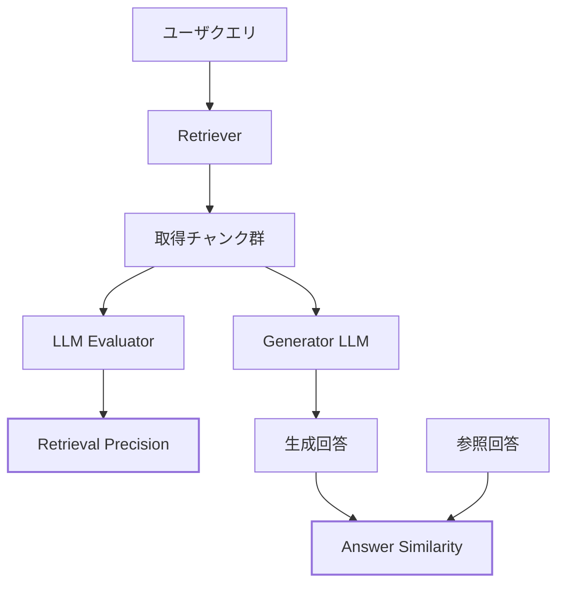
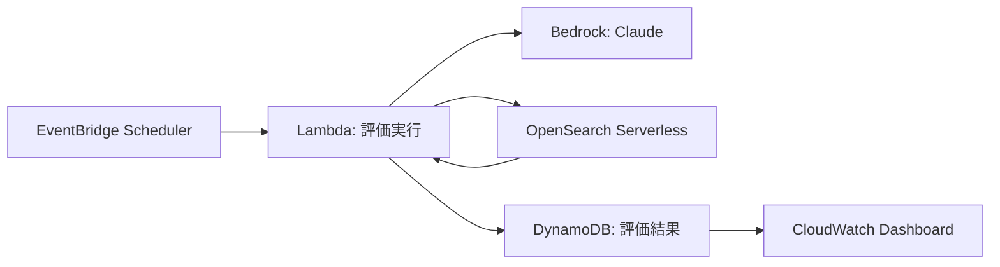
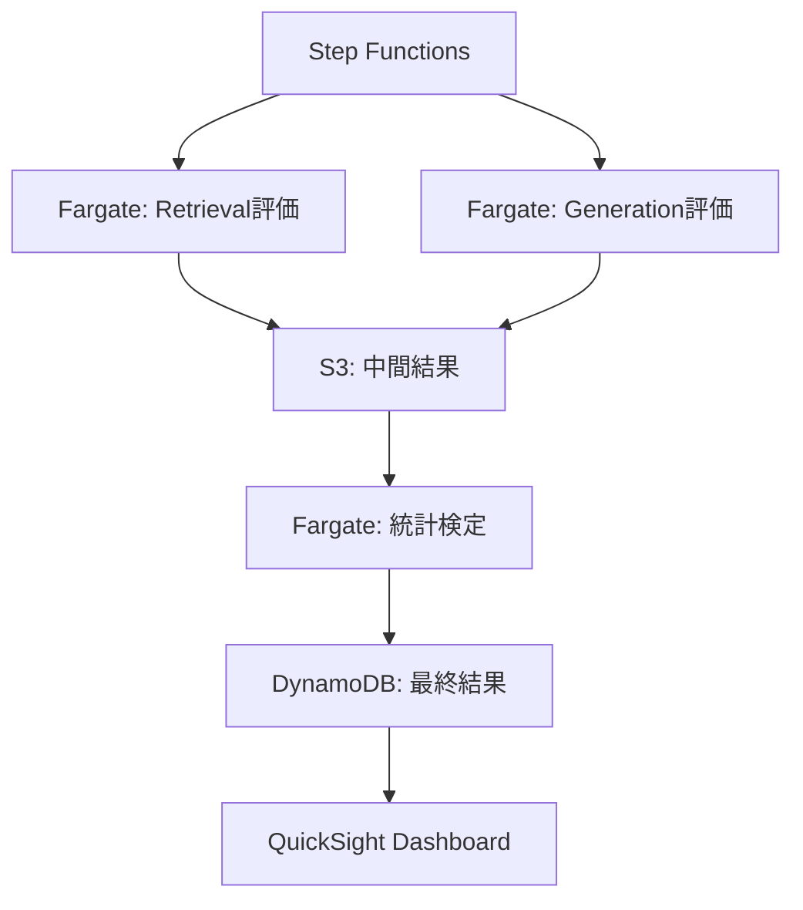

## 論文概要

本記事は [ARAGOG (arXiv:2404.01037)](https://arxiv.org/abs/2404.01037) の解説記事です。ARAGOG（Advanced RAG Output Grading）は、Retrieval-Augmented Generation（RAG）パイプラインにおける**検索段階と生成段階を分離して評価**する診断フレームワークである。著者らは、既存のRAG評価が end-to-end の出力品質のみに着目しており、品質低下の原因が検索側にあるのか生成側にあるのかを切り分けられない点を課題として指摘している。ARAGOGでは Retrieval Precision と Answer Similarity という2つの独立した指標を用いて8種類のRAG手法を体系的に比較し、各手法の強みと限界を統計的に検証している。

## 情報源

| 項目 | 内容 |
|------|------|
| **論文タイトル** | ARAGOG: Advanced RAG Output Grading |
| **著者** | Matouš Eibich, Shivay Nagpal, Alexander Fred-Ojala |
| **arXiv ID** | [2404.01037](https://arxiv.org/abs/2404.01037) |
| **公開年** | 2024年4月 |
| **分野** | cs.CL (Computational Linguistics), cs.IR (Information Retrieval) |
| **コード** | [GitHub: predlico/ARAGOG](https://github.com/predlico/ARAGOG)（MIT License） |

## 背景と動機

RAGはLLMのハルシネーションを軽減する有力な手法として広く採用されているが、RAGパイプライン全体の出力品質が低い場合に、その原因がどこにあるのかを特定することは容易ではない。原因は大きく分けて2つ考えられる。

1. **検索の失敗**: ベクトルDBから関連性の高い文書チャンクを取得できていない
2. **生成の失敗**: 関連文書は取得できているが、LLMがその情報を適切に活用できていない

著者らは、既存の研究が個別のRAG手法の提案や逐次的なSoTAモデル比較に偏っており、「複数のRAG手法を横断的に比較し、検索と生成を独立に評価する包括的な実験研究が欠如している」と指摘している。この gap を埋めるために、ARAGOGでは検索精度（Retrieval Precision）と回答類似度（Answer Similarity）を分離して測定する評価フレームワークを構築し、8種類のRAG手法とその組み合わせを統計的に有意な形で比較した。

## 主要な貢献

著者らが挙げる本論文の主な貢献は以下の通りである。

1. **分離評価の枠組み**: 検索段階と生成段階を独立した指標で評価し、RAGパイプラインのボトルネックを特定可能にした
2. **8種類のRAG手法の体系的比較**: Naive RAG、HyDE、Sentence Window Retrieval、Document Summary Index、MMR、Multi-query、Cohere Rerank、LLM Rerankを同一条件下で比較
3. **統計的検証**: 各手法を10回ずつ実行し、ANOVAおよびTukey's HSD検定で有意差を確認
4. **再現性の確保**: 評価用の107個のQAペア、コード、結果をGitHubで公開

## 技術的詳細

### 評価フレームワークの全体像

ARAGOGの評価パイプラインは、検索と生成を独立に評価するために以下の構成を取る。



このパイプラインの要点は、Retrieval Precision の算出にはGenerator LLMの出力を一切使わず、取得チャンクの関連性のみをLLM Evaluatorが判定する点にある。これにより、検索品質を生成品質と独立に測定できる。

### 評価指標の定義

#### Retrieval Precision（検索精度）

取得されたチャンク群のうち、クエリに対して関連性を持つチャンクの割合を測定する。スコアは0から1の範囲を取る。

$$
\text{Retrieval Precision} = \frac{|\text{関連チャンク}|}{|\text{取得チャンク全体}|}
$$

各チャンクの関連性はLLM Evaluatorが独立に判定する。この指標はGeneratorの性能に依存しないため、純粋に検索コンポーネントの品質を反映する。

#### Answer Similarity（回答類似度）

生成された回答と参照回答（Ground Truth）との意味的類似度を0から5のスケールで測定する。

$$
\text{Answer Similarity} = \text{LLM\_Judge}(\text{生成回答}, \text{参照回答}) \in [0, 5]
$$

著者らは、コサイン類似度のような単純な埋め込みベースの類似度を超えて、LLMをジャッジとして用いることでより精緻な意味的評価を実現している。ただし、この指標は検索品質と生成品質の両方に影響されるため、Retrieval Precisionとの組み合わせで解釈する必要がある。

#### RAGAS指標の不採用

著者らはRAGAS（Retrieval Augmented Generation Assessment）フレームワークの指標（Context Precision、Context Recall、Faithfulness、Answer Relevance）も検討したが、「その複雑さがしばしば信頼性の低い結果をもたらした」として採用を見送っている。これはRAGAS自体の問題というより、LLM-as-a-Judgeの安定性に関わる課題であり、ARAGOG独自の指標設計の動機となっている。

### 評価対象のRAG手法

著者らが評価した8種類のRAG手法を、アプローチ別に整理する。

#### Decoupling系（検索単位と生成コンテキストの分離）

**Sentence Window Retrieval**: 検索時には個別の文を単位として用いるが、生成時にはその文の前後の文脈（ウィンドウ）を含めてLLMに渡す。これにより検索の精度を高めつつ、生成に必要な文脈を確保する。

**Document Summary Index**: 文書全体の要約をインデックス化して検索に使い、ヒットした場合は要約ではなく元の全文をGeneratorに渡す。事前に要約を生成するコストが発生するが、検索精度の向上が期待される。

#### Query拡張系

**HyDE（Hypothetical Document Embedding）**: クエリに対してLLMに仮の回答を生成させ、その仮回答の埋め込みを用いて文書検索を行う。仮回答が実際の文書と近い埋め込み空間上の位置に配置されることを利用する。

**Multi-query**: 1つのクエリからLLMを用いてN個の類似クエリを生成し、それぞれで検索を行うことで検索の網羅性を高める。

#### Reranking系

**Cohere Rerank**: クロスエンコーダアーキテクチャを用いて、初期検索結果の関連度を再評価する外部APIサービス。

**LLM Rerank**: LLM自体を再ランキングに用いる手法。追加のLLM呼び出しが発生するため、レイテンシとコストが増加する。

#### ベースライン

**Naive RAG**: 標準的なベクトルDB検索。チャンク分割 → 埋め込み → コサイン類似度検索という基本的なパイプライン。

**MMR（Maximal Marginal Relevance）**: 検索結果の関連性と多様性のバランスを取る手法。冗長なチャンクの取得を抑制する。

### チャンキング戦略

各手法に応じて異なるチャンキング設定が用いられた。

| 手法 | チャンクサイズ | オーバーラップ |
|------|-------------|-------------|
| Classic VDB | 512トークン | 50トークン |
| Sentence Window | 3文 | — |
| Document Summary Index | 3072トークン | 100トークン |

チャンキング戦略が手法間で異なるため、著者らは「チャンクに含まれる情報密度が異なり、手法間の厳密な比較には限界がある」と認めている。

### データセット

著者らはAI分野のarXiv論文423本からなるデータセットを構築した。

- **QA生成対象**: BERT、RoBERTaなど13本の主要論文から107個のQAペアをGPT-4で生成し、人手で品質を確認
- **ノイズ論文**: 410本の追加論文を「ノイズ」としてベクトルDBに格納し、実運用に近い検索環境を再現

この設計は、単純なベンチマークでは見えにくい検索精度の差異を浮き彫りにする意図がある。

## 実装のポイント

ARAGOGの評価パイプラインを自前で再現・応用する際の実装上の要点を整理する。

### 評価の安定性確保

LLM-as-a-Judgeの出力は確率的であり、同一入力でもスコアが変動する。著者らは各手法を10回実行して分散を測定しており、これは実務でも重要な設計指針である。推奨される対策は以下の通り。

- 各設定で最低5〜10回の評価を実行し、中央値と四分位範囲を報告する
- ANOVAやTukey's HSD検定で有意差を確認してから結論を出す
- `temperature=0` でも完全な決定論的出力にはならないことを前提とする

### 検索評価の分離実装

LlamaIndexやLangChainを用いる場合、Retrieverの出力（取得チャンク）をGeneratorに渡す前に横取りして評価する仕組みが必要になる。

```python
from llama_index.core import VectorStoreIndex

# Retrieverのみを取得して検索結果を評価
retriever = index.as_retriever(similarity_top_k=5)
retrieved_nodes = retriever.retrieve(query)

# 各ノードの関連性をLLMで判定
relevant_count = 0
for node in retrieved_nodes:
    relevance = evaluate_relevance(query, node.text)
    if relevance:
        relevant_count += 1

retrieval_precision = relevant_count / len(retrieved_nodes)
```

### HyDE + Reranking の組み合わせ

著者らの実験で最も高い検索精度を示した HyDE + LLM Rerank の組み合わせは、以下のように実装できる。

```python
from llama_index.core.indices.query.query_transform import HyDEQueryTransform
from llama_index.core.postprocessor import LLMRerank

# HyDE: 仮回答を生成して検索
hyde = HyDEQueryTransform(include_original=True)
hypothetical_doc = hyde.run(query)

# 初期検索
initial_results = retriever.retrieve(hypothetical_doc)

# LLM Rerank: 検索結果を再ランキング
reranker = LLMRerank(top_n=5)
reranked_results = reranker.postprocess_nodes(
    initial_results, query_str=query
)
```

ただし、この組み合わせはLLM呼び出しが3回（仮回答生成 + 検索 + 再ランキング）発生するため、レイテンシとコストのトレードオフを考慮する必要がある。

## 本番運用ガイド: AWSによるRAG評価パイプラインのデプロイ

ARAGOGの知見を実運用のRAG評価に適用する場合、評価パイプラインそのものをスケーラブルにデプロイする必要がある。ここでは、規模別に3つのアーキテクチャパターンを示す。

### Small構成: Lambda + Bedrock + DynamoDB

QAペア数が数百件以下、評価頻度が日次以下の場合に適する。



```hcl
# terraform/small/main.tf
resource "aws_lambda_function" "rag_evaluator" {
  function_name = "aragog-evaluator"
  runtime       = "python3.12"
  handler       = "handler.evaluate"
  timeout       = 900
  memory_size   = 1024

  environment {
    variables = {
      BEDROCK_MODEL_ID  = "anthropic.claude-3-5-sonnet-20241022-v2:0"
      DYNAMODB_TABLE    = aws_dynamodb_table.eval_results.name
      OPENSEARCH_ENDPOINT = aws_opensearchserverless_collection.rag.collection_endpoint
    }
  }
}

resource "aws_dynamodb_table" "eval_results" {
  name         = "aragog-eval-results"
  billing_mode = "PAY_PER_REQUEST"
  hash_key     = "eval_id"
  range_key    = "timestamp"

  attribute {
    name = "eval_id"
    type = "S"
  }
  attribute {
    name = "timestamp"
    type = "S"
  }

  ttl {
    attribute_name = "expires_at"
    enabled        = true
  }
}

resource "aws_scheduler_schedule" "daily_eval" {
  name       = "aragog-daily-eval"
  schedule_expression = "rate(1 day)"

  target {
    arn      = aws_lambda_function.rag_evaluator.arn
    role_arn = aws_iam_role.scheduler.arn
  }
}
```

### Medium構成: Step Functions + Fargate

QAペア数が数千件、複数のRAG手法を並列評価する場合に適する。



Step Functionsで検索評価と生成評価を並列に実行し、統計検定（ANOVA + Tukey's HSD）を最終ステップで行う。ARAGOGの「10回繰り返し実行」の設計をMap Stateで自然に表現できる。

### Large構成: EKS + Karpenter

継続的な評価パイプラインを運用し、モデル更新やインデックス再構築のたびに自動評価を実行する場合に適する。

```hcl
# terraform/large/karpenter.tf
resource "helm_release" "karpenter" {
  name       = "karpenter"
  repository = "oci://public.ecr.aws/karpenter"
  chart      = "karpenter"
  version    = "1.1.1"
  namespace  = "kube-system"
}

resource "kubectl_manifest" "gpu_nodepool" {
  yaml_body = <<-YAML
    apiVersion: karpenter.sh/v1
    kind: NodePool
    metadata:
      name: rag-eval-gpu
    spec:
      template:
        spec:
          nodeClassRef:
            group: karpenter.k8s.aws
            kind: EC2NodeClass
            name: default
          requirements:
            - key: "karpenter.k8s.aws/instance-family"
              operator: In
              values: ["g5", "g6"]
            - key: "karpenter.sh/capacity-type"
              operator: In
              values: ["spot", "on-demand"]
          taints:
            - key: nvidia.com/gpu
              effect: NoSchedule
      limits:
        cpu: "128"
        memory: 512Gi
      disruption:
        consolidationPolicy: WhenEmptyOrUnderutilized
  YAML
}
```

### モニタリング設計

いずれの構成でも、以下の3層のモニタリングを推奨する。

#### CloudWatch メトリクス

- **Retrieval Precision の推移**: 日次評価結果をカスタムメトリクスとして記録
- **Answer Similarity の推移**: 同上
- **評価パイプラインのレイテンシ**: Lambda/Fargateの実行時間
- **Bedrock の Token 使用量**: 評価コストの追跡

#### X-Ray トレーシング

評価パイプラインの各ステップ（チャンク取得 → LLM評価 → スコア集計）をトレースし、ボトルネックを特定する。特にLLM Rerankを含む手法では、再ランキングステップのレイテンシが支配的になりやすい。

#### アラート設計

```yaml
# CloudWatch Alarm 例
- metric: RetrievalPrecision
  threshold: 0.6
  comparison: LessThanThreshold
  period: 86400
  action: SNS通知 → Slack連携
  description: "検索精度が閾値を下回った場合、インデックスの劣化を疑う"

- metric: AnswerSimilarity
  threshold: 3.0
  comparison: LessThanThreshold
  period: 86400
  action: SNS通知
  description: "回答品質の低下を検知"
```

### コスト最適化チェックリスト

RAG評価パイプラインの運用コストを抑えるための項目を整理する。

**インフラ層**:
1. Lambda の適切なメモリサイズ設定（過剰割り当ての回避）
2. Fargate Spot の活用（評価ジョブは中断耐性がある）
3. Karpenter の Consolidation Policy による未使用ノードの自動縮退
4. OpenSearch Serverless の OCU（OpenSearch Compute Unit）最小値設定
5. DynamoDB の TTL 設定による古い評価結果の自動削除
6. S3 の Intelligent-Tiering による中間結果の自動階層化
7. NAT Gateway コストの削減（VPC Endpoint の活用）

**LLM呼び出し層**:
8. Bedrock のバッチ推論 API の活用（最大50%のコスト削減）
9. Prompt Caching の有効化（同一QAペアの繰り返し評価時）
10. 評価用モデルの選択最適化（Claude 3.5 Haiku で十分な場合は Sonnet を避ける）
11. 不要なチャンクの事前フィルタリング（明らかに無関係なチャンクをLLM評価から除外）
12. Max tokens の適切な設定（評価応答に長文は不要）

**評価設計層**:
13. 繰り返し回数の段階的設定（探索フェーズは3回、最終評価は10回）
14. QAペアのサンプリング評価（全107問を毎回実行する必要はない）
15. 差分評価の導入（前回から変更のあった手法のみ再評価）
16. 評価結果のキャッシュ（同一検索結果に対するLLM判定の再利用）

**運用層**:
17. Cost Explorer のタグ別コスト分析の有効化
18. Budgets アラートの設定（月次コスト上限の監視）
19. Savings Plans / Reserved Instances の検討（安定した評価負荷の場合）
20. CloudWatch Logs の保持期間設定（評価ログは30日で十分な場合が多い）
21. 不要な CloudWatch メトリクスの無効化
22. Step Functions の Express Workflow の検討（実行時間5分以内の場合）

## 実験結果

### Retrieval Precision（検索精度）の比較

著者らの実験結果から、Classic VDB（標準チャンキング）カテゴリにおける各手法の検索精度を以下にまとめる。Naive RAG との平均差と統計的有意性（Tukey's HSD検定）を示す。

| 手法 | Naive RAGとの平均差 | p値 | 有意性 |
|------|-------------------|-----|--------|
| HyDE + LLM Rerank | +0.0749 | 0.0000 | 有意 |
| HyDE | +0.0648 | 0.0000 | 有意 |
| LLM Rerank | +0.0514 | 0.0000 | 有意 |
| HyDE + Cohere Rerank | +0.0371 | 0.0000 | 有意 |
| MMR | +0.0156 | 0.3787 | **非有意** |
| Cohere Rerank | +0.0150 | 0.4515 | **非有意** |
| Multi-query + Reciprocal | -0.0542 | 0.0000 | 有意（悪化） |

著者らは「HyDEとLLM Rerankが検索精度を有意に向上させる」と報告している。一方、MMRとCohere Rerankは Naive RAG と統計的に有意な差がなく、「ベースラインに対して顕著な優位性を示さなかった」とされている。

### Sentence Window Retrieval の優位性

著者らは「Sentence Window Retrievalの最低性能の変種でさえ、Classic VDBの最高性能の手法を上回る」と報告しており、チャンキング戦略が検索精度に極めて大きな影響を持つことを示している。具体的には、Sentence Window + Cohere Rerank と Classic VDB + HyDE + LLM Rerank の間に平均差0.1021（p = 0.0000）の有意差が確認されている。

### Answer Similarity との乖離

興味深い発見として、著者らは Sentence Window Retrieval について「高い検索精度と低い回答類似度の乖離」を報告している。検索精度は最高であるにもかかわらず、生成された回答の品質は必ずしもそれに比例しない。これは、検索で適切な文を見つけていても、前後の文脈を含めたウィンドウがGeneratorにとって最適なコンテキストとは限らないことを示唆しており、まさにARAGOGの分離評価が有効に機能した事例である。

## 実運用への応用

ARAGOGの知見は、実運用のRAGパイプラインのデバッグと最適化に直接活用できる。

### ボトルネック特定のフロー

1. **Retrieval Precision が低い場合**: 検索コンポーネントに問題がある。チャンキング戦略の変更（Sentence Window の導入）、HyDE の適用、埋め込みモデルの見直しを検討する
2. **Retrieval Precision は高いが Answer Similarity が低い場合**: Generatorに問題がある。プロンプトの改善、LLMの変更、コンテキストウィンドウの調整を検討する
3. **両方が低い場合**: データパイプライン全体の見直しが必要。データの品質、前処理、チャンクサイズの最適化から着手する

### コスト対効果の判断

著者らの結果は、高コストの手法が常に最適とは限らないことを示している。

- **Cohere Rerank**: 外部API呼び出しコストが発生するが、統計的に有意な改善なし
- **LLM Rerank**: 追加のLLM呼び出しコストに見合う改善あり
- **Sentence Window**: チャンキング戦略の変更のみで大幅な改善が可能（追加コストなし）

実運用では、まず Sentence Window Retrieval のようなコスト増を伴わない手法を試し、その上で必要に応じて HyDE や LLM Rerank を追加するのが合理的である。

### LlamaIndex / LangChain との統合

関連するZenn記事「[LlamaIndex v0.14でRAGパイプラインを体系的に構築する実践ガイド](https://zenn.dev/0h_n0/articles/d70a46a75bdb5b)」で紹介されているRAGASやDeepEvalによる評価と、ARAGOGの分離評価アプローチは相補的である。RAGASが提供する Faithfulness や Answer Relevance はend-to-endの品質指標であり、ARAGOGの Retrieval Precision と組み合わせることで、パイプラインのどの段階で品質低下が起きているかを多角的に診断できる。

## 関連研究

**RAGAS** (Shahul et al., 2023): Context Precision、Context Recall、Faithfulness、Answer Relevanceの4指標によるRAG評価フレームワーク。ARAGOGの著者らはRAGASの指標を検討したが、複雑さによる結果の不安定性を理由に独自指標を採用している。

**DeepEval**: RAGASと類似した指標体系を持つオープンソース評価ツール。LLM-as-a-Judgeを用いた自動評価をサポートする。

**RGB** (Chen et al., 2024): RAGシステムのロバスト性に焦点を当てた評価ベンチマーク。ノイズ耐性や反事実ロバスト性など、ARAGOGがカバーしない側面を評価する。

**ARES** (Saad-Falcon et al., 2024): LLMとクラシファイアを組み合わせた評価手法。少量のアノテーションデータから予測モデルを構築する点がARAGOGと異なる。

## 限界と注意点

著者ら自身が認めている限界は以下の通りである。

1. **モデルの制約**: 評価にGPT-3.5-turboを使用しており、GPT-4等のより高性能なモデルでは結果が異なる可能性がある
2. **データセットの規模**: 107個のQAペア、1つのドメイン（AI論文）のみでの検証であり、汎化性に限界がある
3. **チャンキングの不均一性**: 手法ごとに異なるチャンク設定を使用しており、厳密な条件統制ができていない
4. **評価指標の選択**: RAG評価に最適な指標についてはコンセンサスが存在せず、本研究の指標選択も概念的な妥当性に基づいている
5. **手法の網羅性**: Step-back Prompting、Auto-merging Retrieval、Hybrid Searchなどは評価対象外

## まとめと今後の展望

ARAGOGは、RAGパイプラインの品質問題を「検索の問題か生成の問題か」に切り分ける実用的なフレームワークを提供している。主要な知見として、Sentence Window Retrieval のチャンキング戦略が検索精度に最も大きな影響を与えること、HyDE と LLM Rerank の組み合わせが Classic VDB 内で最高の検索精度を達成すること、そして確立された手法（MMR、Cohere Rerank）が必ずしも統計的に有意な改善をもたらさないことが示された。

今後の研究課題として、著者らはより多様なドメイン・データセットでの検証、高性能LLMによる評価の再実施、ナレッジグラフ統合型RAGの評価、および自動最適化されたRAG構成の探索を挙げている。実務者にとっては、ARAGOGの分離評価アプローチを自前の評価パイプラインに組み込み、RAGの改善サイクルを体系的に回すことが重要な次のステップとなるだろう。

## 参考文献

1. Eibich, M., Nagpal, S., & Fred-Ojala, A. (2024). ARAGOG: Advanced RAG Output Grading. arXiv:2404.01037.
2. Es, S., James, J., Espinosa-Anke, L., & Schockaert, S. (2023). RAGAS: Automated Evaluation of Retrieval Augmented Generation. arXiv:2309.15217.
3. Gao, L., Ma, X., Lin, J., & Callan, J. (2022). Precise Zero-Shot Dense Retrieval without Relevance Labels (HyDE). arXiv:2212.10496.
4. Chen, J., Lin, H., Han, X., & Sun, L. (2024). Benchmarking Large Language Models in Retrieval-Augmented Generation (RGB). AAAI 2024.
5. Saad-Falcon, J., Khattab, O., Potts, C., & Zaharia, M. (2024). ARES: An Automated Evaluation Framework for Retrieval-Augmented Generation Systems. arXiv:2311.09476.
