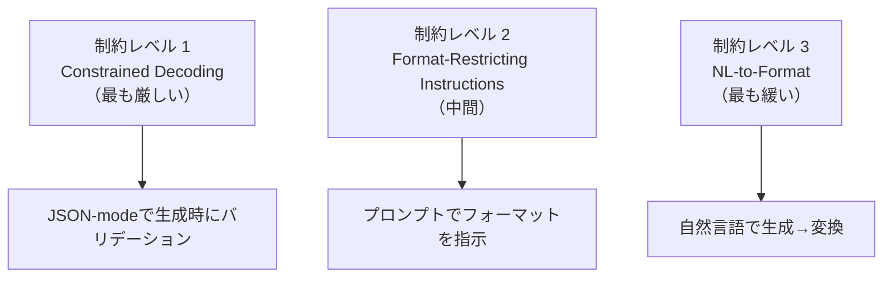

本記事は [arXiv:2408.02442 Let Me Speak Freely? A Study on the Impact of Format Restrictions on Performance of Large Language Models](https://arxiv.org/abs/2408.02442) の解説記事です。

## 論文概要（Abstract）

本論文は、JSON、XML、YAML等の構造化出力フォーマットがLLMの推論能力およびドメイン知識の活用にどのような影響を与えるかを体系的に実証した研究である。著者らは7つのベンチマーク（推論3種、分類4種）と5つのモデルで評価を行い、「構造化制約が厳しいほど推論タスクの性能劣化が大きい」という主要な知見を報告している。特にJSON Schemaの厳密な制約（constrained decoding）下では、Claude-3-HaikuのGSM8K精度が86.51%から23.44%へ63ポイント低下するケースが確認された。

この記事は [Zenn記事: AIエージェントのツール定義設計原則：スキーマ・命名・レスポンスの実践ガイド](https://zenn.dev/0h_n0/articles/581a4e0ece7056) の深掘りです。

## 情報源

- **会議名**: EMNLP 2024（Conference on Empirical Methods in Natural Language Processing）Industry Track
- **年**: 2024
- **URL**: [https://arxiv.org/abs/2408.02442](https://arxiv.org/abs/2408.02442)
- **著者**: Zhi Rui Tam, Cheng-Kuang Wu, Yi-Lin Tsai, Chieh-Yen Lin, Hung-yi Lee, Yun-Nung Chen
- **ACL Anthology**: [https://aclanthology.org/2024.emnlp-industry.91](https://aclanthology.org/2024.emnlp-industry.91)

## カンファレンス情報

EMNLPは自然言語処理分野の主要国際会議（ACL、NAACL、EACLと並ぶTier 1）であり、Industry Trackは産業応用に焦点を当てたトラックである。構造化出力はLLMのFunction Calling（ツール呼び出し）で必須の技術であり、本論文はツール定義設計における重要な実証根拠を提供している。

## 背景と動機（Background & Motivation）

LLMエージェントがツールを呼び出す際、ツールの引数はJSON等の構造化フォーマットで生成される必要がある。OpenAIのstrict modeやAnthropicのtool useでは、LLMの出力がJSON Schemaに厳密に準拠することが求められる。しかし、この「構造化制約」がLLMの推論能力に与える影響は十分に研究されていなかった。

本論文の動機は「構造化出力を要求することで、LLMは何を失うのか？」という根本的な問いにある。ツール定義のJSON Schemaが複雑であるほど、LLMのパラメータ生成精度が低下する可能性があり、これはエージェント設計における重大なトレードオフを示唆する。

## 技術的詳細（Technical Details）

### 実験設定

著者らは3段階の制約レベルを比較している。



**Constrained Decoding（CD）**: JSON-modeにより、生成の各ステップで有効なJSONトークンのみを許可する。最も厳しい制約であり、パースエラーはゼロになるが、LLMの思考空間を大幅に制限する。

**Format-Restricting Instructions（FRI）**: プロンプトで出力フォーマットを指示するが、トークンレベルの制約は課さない。パースエラーが発生し得る。

**NL-to-Format**: 2段階アプローチ。まず自然言語で回答を生成し、次に構造化フォーマットに変換する。

### 評価モデルとベンチマーク

**モデル**:

| カテゴリ | モデル名 |
|---------|---------|
| プロプライエタリ | GPT-3.5-turbo-0125, Claude-3-haiku, Gemini-1.5-flash |
| オープンウェイト | LLaMA-3-8B-Instruct, Gemma-2-9B-Instruct |

**ベンチマーク**:

| カテゴリ | タスク名 | 評価対象 |
|---------|---------|---------|
| 推論 | GSM8K | 数学的推論 |
| 推論 | Last Letter Concatenation | 記号的推論 |
| 推論 | Shuffled Objects | 状態推論 |
| 分類 | DDXPlus | 医療診断（49クラス） |
| 分類 | MultiFin | 金融カテゴリ分類（5クラス） |
| 分類 | Sports Understanding | 事象の妥当性判断 |
| 分類 | NI Task 280 | ステレオタイプ分類 |

### 主要な実験結果

#### 推論タスクでの性能劣化

論文Table 1より、GSM8Kにおける各モデルの精度を以下に示す（Text = 自然言語、JSON = JSON Schema制約付き）。

| モデル | Text | JSON (Schema付き) | 劣化幅 |
|--------|------|-------------------|--------|
| Gemini-1.5-Flash | 89.33% | 89.21% | -0.12pt |
| GPT-3.5-turbo | 75.99% | 49.25% | -26.74pt |
| Claude-3-haiku | 86.51% | 23.44% | **-63.07pt** |
| LLaMA-3-8B | 75.13% | 48.90% | -26.23pt |

Claude-3-haikuの63ポイント低下は、JSON Schemaの制約がLLMの数学的推論を壊滅的に阻害し得ることを示している。

Last Letter Concatenation（記号的推論）でも同様の傾向が確認されている。

| モデル | Text | JSON | 劣化幅 |
|--------|------|------|--------|
| GPT-3.5-turbo | 56.74% | 25.20% | -31.54pt |
| LLaMA-3-8B | 70.07% | 28.00% | -42.07pt |

#### 分類タスクでの性能向上

論文のDDXPlus（医療診断）結果は、推論タスクとは逆の傾向を示す。

| モデル | Text | JSON | 変化 |
|--------|------|------|------|
| Gemini-1.5-Flash | 41.59% | 60.36% | **+18.77pt** |
| GPT-3.5-turbo | 44.07% | 55.51% | **+11.44pt** |
| Claude-3-haiku | 33.78% | 52.04% | **+18.26pt** |

著者らはこの改善について、構造化制約が回答空間を有効な選択肢に限定することで、分類タスクでは「雑音の除去」として機能すると分析している。

### Schema制約の除去実験

論文の重要な発見は、Schema仕様を除去（JSONフォーマットのみ指定し、フィールド定義は指定しない）した場合の性能回復である。

| モデル（GSM8K） | JSON + Schema | JSON（Schemaなし） | 回復幅 |
|----------------|--------------|-------------------|--------|
| Claude-3-haiku | 23.44% | 86.99% | **+63.55pt** |
| GPT-3.5-turbo | 49.25% | 74.70% | **+25.45pt** |

この結果は、性能劣化の主因がJSON形式そのものではなく**Schema制約（フィールド定義、型指定、必須フィールド等）の複雑さ**にあることを示している。

### パースエラーの分析

著者らはパースエラーが性能低下の主因ではないことも示している。例えばLLaMA-3-8BのLast Letter Concatenationでは、JSONのパースエラー率が0.148%であるにもかかわらず38.15ポイントの性能差が観測されている。つまり、LLMは構文的に正しいJSONを生成できていても、その内容の推論精度が低下するという問題である。

## 実装のポイント（Implementation）

### NL-to-Formatパイプライン

著者らが提案する緩和策の一つが**NL-to-Format**パイプラインである。

```python
from typing import Any
import json


def nl_to_format_pipeline(
    llm_client: Any,
    query: str,
    target_schema: dict,
) -> dict:
    """NL-to-Format: 2段階で構造化出力を生成

    Step 1: 自然言語で推論（制約なし）
    Step 2: 推論結果を構造化フォーマットに変換
    """
    # Step 1: 自然言語で回答生成（推論能力を最大限活用）
    nl_response = llm_client.generate(
        prompt=f"以下の質問に自然言語で回答してください。\n\n{query}",
        # JSON-modeを使用しない
    )

    # Step 2: 構造化フォーマットに変換
    structured = llm_client.generate(
        prompt=(
            f"以下の回答を指定されたJSONスキーマに変換してください。\n\n"
            f"回答: {nl_response}\n\n"
            f"スキーマ: {json.dumps(target_schema, ensure_ascii=False)}"
        ),
        response_format={"type": "json_object"},
    )

    return json.loads(structured)
```

### ツール定義設計への実践的指針

本論文の知見をツール定義設計に適用すると、以下の指針が得られる。

**1. Schemaはフラットに保つ**

ネストの深いSchemaほどLLMの推論能力を阻害する。ネスト深さは2以下を目安にする。

```json
{
  "type": "object",
  "properties": {
    "query": {"type": "string"},
    "filters": {
      "type": "object",
      "properties": {
        "date_from": {"type": "string"},
        "date_to": {"type": "string"}
      }
    }
  }
}
```

**2. 必須フィールドを最小化する**

`required`配列に含めるフィールドは最小限にし、任意パラメータはデフォルト値を持たせる。strict modeでは全フィールドをrequiredにする必要があるが、任意フィールドは`"type": ["string", "null"]`で表現する。

**3. 推論が必要なパラメータにはenumを活用する**

分類タスクでは構造化制約が精度を改善する（DDXPlusで+18.77pt）ことから、回答空間が有限な場合はenum制約が有効である。

```json
{
  "sort_by": {
    "type": "string",
    "enum": ["relevance", "price_asc", "price_desc", "rating"],
    "description": "ソート順"
  }
}
```

**4. 複雑な推論を要するフィールドには自由テキストを許可する**

推論タスクでは自由テキストの精度が高いため、「理由」や「分析」を含むフィールドにはstringの自由テキストを使用する。

## 実験結果の追加分析（Results）

### コスト効率分析

論文Appendix Cでは、フォーマット別のトークンコストも比較されている。著者らの分析によると、YAMLがLLaMA-3-8Bで最もコスト効率が高い（0.08 vs. テキストの0.11）とされている。ただし、フォーマット選択ではコストよりも性能を優先すべきであると著者らは述べている。

### 修正プロンプティング

Claude-3-Haikuにおいて、パースエラーが発生した出力に対して修正プロンプトを適用することでJSONおよびYAMLのスコアが改善されたことが報告されている（論文Figure 5）。これはエラーハンドリングの設計にも示唆を与える知見である。

### モデル間の頑健性の差

Gemini-1.5-Flashは構造化制約に対して最も頑健であり、GSM8Kでの劣化はわずか0.12ポイントにとどまっている。一方、Claude-3-haikuは63ポイントの劣化を示しており、モデルによる差が極めて大きい。著者らはこの差が訓練データに含まれる構造化出力の量と多様性に起因すると推測している。

## 実運用への応用（Practical Applications）

### ツール定義設計への影響

Zenn記事で解説されているstrict mode（`strict: true`）は、本論文が指摘する「最も厳しい制約」に相当する。strict modeを使用する場合、以下のトレードオフを認識する必要がある。

| 側面 | strict mode ON | strict mode OFF |
|------|---------------|----------------|
| Schema準拠の保証 | 100%保証 | パースエラーの可能性 |
| 推論精度 | 低下リスクあり | 影響なし |
| 適用タスク | 分類・選択型 | 推論・生成型 |

実務的には、ツールのパラメータに推論が必要な場合（例: 検索クエリの構築、日時の解釈）はstrict modeを避け、選択型のパラメータ（例: ソート順、フィルタカテゴリ）にはstrict modeを適用するハイブリッドアプローチが有効であると考えられる。

### エージェントアーキテクチャへの示唆

本論文の知見は、ReActパターンにおける「思考（Thought）」ステップと「アクション（Action）」ステップの分離を支持する。思考ステップでは自然言語で推論し、アクションステップでのみ構造化フォーマットで出力する2段階アプローチにより、推論品質と構造化出力の両立が可能になる。

## 関連研究（Related Work）

- **Outlines（Willard & Louf, 2024）**: 文法制約デコーディングによる構造化出力生成。本論文が指摘するconstrained decodingの性能影響を技術的に補完
- **ToolACE（Liu et al., 2024）**: Function calling訓練データの品質向上。本論文の知見を踏まえ、構造化制約に頑健なモデルの訓練を目指す研究
- **Generating Structured Outputs from LLMs（arXiv:2501.10868）**: 構造化出力の包括的ベンチマーク。本論文の後続研究として位置づけられる

## まとめと今後の展望

本論文は「構造化出力制約はLLMの推論能力を低下させる」という重要な実証知見を提供した。特にJSON Schema制約下でのClaude-3-haikuの63ポイント低下は衝撃的な数値である。

ツール定義設計の観点では、以下が示唆される。

1. **Schemaの複雑さを最小化する**: 必要最小限のフィールドとフラットな構造
2. **タスクに応じた制約レベルの選択**: 分類型にはenum、推論型には自由テキスト
3. **NL-to-Formatパイプラインの検討**: 推論品質が重要な場合は2段階アプローチ

ただし、本論文の結果は2024年8月時点のモデルに基づいており、Gemini-1.5-Flashの頑健性が示すように、モデルの訓練手法次第で制約耐性は改善し得る。2026年現在のモデル（GPT-4o、Claude Sonnet 4.5等）では改善されている可能性がある。

## 参考文献

- **arXiv**: [https://arxiv.org/abs/2408.02442](https://arxiv.org/abs/2408.02442)
- **ACL Anthology**: [https://aclanthology.org/2024.emnlp-industry.91](https://aclanthology.org/2024.emnlp-industry.91)
- **Related Zenn article**: [https://zenn.dev/0h_n0/articles/581a4e0ece7056](https://zenn.dev/0h_n0/articles/581a4e0ece7056)
