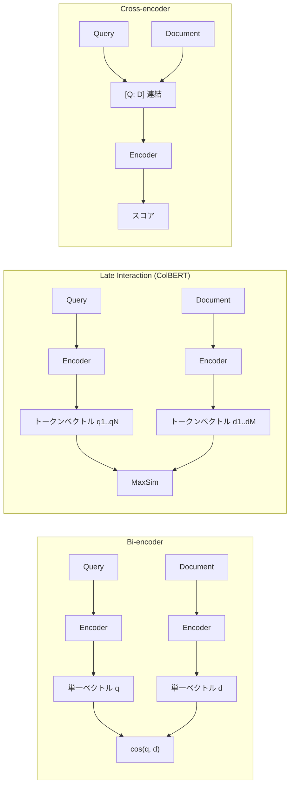
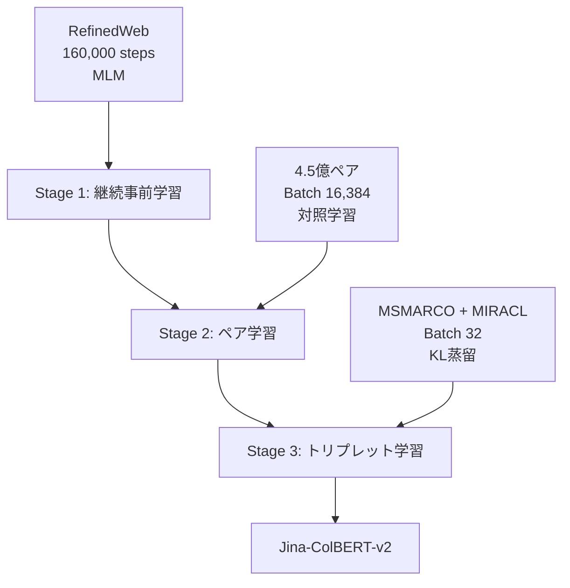

## 論文概要

本記事は [Jina-ColBERT-v2 (arXiv:2408.16672)](https://arxiv.org/abs/2408.16672) の解説記事です。Jina-ColBERT-v2は、ColBERTアーキテクチャに基づく多言語対応のLate Interactionリトリーバーである。XLM-RoBERTaをバックボーンに採用し、Matryoshka Representation Learning（MRL）による柔軟な次元選択、Rotary Positional Embeddings（RoPE）による長文対応、クロスエンコーダからの知識蒸留など複数の改善を導入している。BEIRベンチマークで平均nDCG@10=53.1を達成し、従来のColBERTv2（49.6）を上回る性能を示した。

## 情報源

| 項目 | 内容 |
|------|------|
| arXiv ID | [2408.16672](https://arxiv.org/abs/2408.16672) |
| タイトル | Jina-ColBERT-v2: A General-Purpose Multilingual Late Interaction Retriever |
| 著者 | Rohan Jha, Bo Wang, Michael Gunther, Georgios Mastrapas, Saba Sturua, Isabelle Mohr, Andreas Koukounas, Mohammad Kalim Akram, Nan Wang, Han Xiao (Jina AI) |
| 公開年 | 2024年8月 |

## 背景と動機

情報検索における埋め込みモデルは、大きく分けてBi-encoder、Cross-encoder、Late Interactionの3つのアーキテクチャに分類される。

Bi-encoderはクエリと文書をそれぞれ独立にエンコードして単一ベクトルを生成する。事前に文書ベクトルを計算・インデックス化できるため推論効率が高いが、クエリと文書の間の細粒度な相互作用を捉えられないという限界がある。

Cross-encoderはクエリと文書を連結して同時にエンコードし、Attention機構によって両者の全トークン間の相互作用を直接モデル化する。精度は高いが、全ての候補文書に対して推論を実行する必要があるため計算コストが大きく、大規模コーパスへのリアルタイム適用が困難である。

Late Interactionはこの両者のトレードオフを解決するアプローチであり、ColBERTが代表的なモデルである。クエリと文書をそれぞれ独立にエンコードしてトークンレベルの埋め込みを生成し、推論時にMaxSim演算で類似度を計算する。文書側のエンコーディングを事前計算できるため効率的でありながら、トークンレベルの相互作用を捉えることで高い精度を実現する。

しかし、従来のColBERTモデルには英語中心である点、埋め込み次元が固定である点、学習データの多様性が不十分である点など改善の余地があった。Jina-ColBERT-v2はこれらの課題に対して、多言語バックボーンの採用と学習パイプラインの改善により包括的な解決を図っている。



## 主要な貢献

著者らは以下の貢献を報告している。

1. **多言語バックボーンの採用**: XLM-RoBERTaをベースとし、RefinedWebデータセットで16万ステップの継続事前学習を実施。RoPEの導入により最大8,192トークンの長文に対応した。

2. **Matryoshka Representation Learning（MRL）**: 6つの異なる次元（64, 96, 128, 256, 512, 768）での埋め込みを同時に学習する手法を導入。用途に応じてストレージと精度のトレードオフを柔軟に選択可能とした。

3. **3段階学習パイプライン**: (1) 継続事前学習、(2) 大規模弱教師ありペア学習、(3) クロスエンコーダ蒸留によるトリプレット学習の3段階で段階的にモデルを最適化した。

4. **クエリ拡張Attention**: [MASK]トークンを活用したクエリ拡張機構を導入し、短いクエリに対する検索性能を向上させた。

5. **網羅的なアブレーション**: タスク指示文、スコア正規化、クエリ拡張Attentionなどの各要素について詳細な効果検証を実施した。

## 技術的詳細

### MaxSim演算

ColBERTの核となるLate Interaction scoring（MaxSim）は、以下の式で定義される。

$$
S(q, d) = \sum_{i=1}^{|q|} \max_{j \in \{1, \ldots, |d|\}} \mathbf{q}_i \cdot \mathbf{d}_j^T
$$

ここで$\mathbf{q}_i$はクエリの$i$番目のトークン埋め込み、$\mathbf{d}_j$は文書の$j$番目のトークン埋め込みである。各クエリトークンに対して最も類似度の高い文書トークンとの内積を取り、その合計をスコアとする。この演算により、クエリの各トークンが文書中で最も関連する箇所を特定でき、Bi-encoderよりも細粒度なマッチングが可能となる。

### アーキテクチャ改善

**バックボーン**: XLM-RoBERTaにFlash Attention最適化を適用し、絶対位置埋め込みをRoPEに置換した。RoPEへの変更により、学習時の系列長を超える入力にも対応可能となった。RefinedWebデータセット上で16万ステップのMasked Language Modeling（MLM）による継続事前学習を実施している。

**線形射影ヘッド**: 隠れ次元768から任意の出力次元への線形射影層を設ける。MRLにより、6つの次元（64, 96, 128, 256, 512, 768）に対応する射影を同時に学習する。著者らは、128次元から64次元への削減でnDCG@10の低下がわずか1.59%であったと報告しており、ストレージ効率と検索精度の良好なトレードオフを実現している。

**クエリ拡張Attention**: ColBERTの[MASK]トークンを用いたクエリ拡張機構を導入している。短いクエリを固定長まで[MASK]トークンでパディングし、Attentionを通じてクエリの潜在的な意図を補完する。著者らは、この機構によりBEIR TREC-COVIDで77.2から80.2へ、MIRACL中国語で34.4から52.9へとスコアが向上したと報告している。ただし、300トークン程度の長いクエリでは汎化性能が低下する場合があることも指摘されている。

### 3段階学習パイプライン



**Stage 1: 修正エンコーダの継続事前学習**

XLM-RoBERTaの絶対位置埋め込みをRoPEに置き換えた後、RefinedWebデータセット上で16万ステップのMLMを実行する。この段階でRoPEへの適応と長文処理能力の獲得を行う。

**Stage 2: 大規模ペア学習**

4億5,000万件の弱教師ありテキストペアを用いて10万ステップの対照学習を行う。データ構成は英語50%、主要29言語、コード3%、クロスリンガル4.3%である。バッチサイズ16,384、学習率$5 \times 10^{-5}$、温度パラメータ$\tau = 0.02$でin-batchネガティブを用いた対照損失で学習する。

**Stage 3: クロスエンコーダ蒸留によるトリプレット学習**

人手アノテーション（MSMARCO、DuReader、MIRACL）と機械翻訳による拡張データ（中国語、フランス語、ドイツ語、日本語、ロシア語、スペイン語）を用いて10万ステップの学習を行う。教師モデルとして多言語クロスエンコーダjina-reranker-v2-base-multilingualを使用し、KLダイバージェンス損失で知識蒸留を行う。バッチサイズ32、学習率$1 \times 10^{-5}$（コサイン減衰、5%ウォームアップ）、BFLOAT-16精度で学習する。

## 実装のポイント

Jina-ColBERT-v2はRAGパイプラインにおいて、主にリランキングまたは検索の段階で利用できる。

**リランキングとしての利用**: Bi-encoderで候補を粗く絞り込んだ後、Jina-ColBERT-v2のMaxSim演算でリランキングを行う。Cross-encoderに比べて文書側のトークンベクトルを事前計算できるため、大量の候補に対しても効率的にリランキングが可能である。

**LlamaIndexとの統合例**: LlamaIndexでは`ColBERTRerank`を通じてLate Interactionモデルをリランカーとして利用できる。以下はコンセプトコードである。

```python
from llama_index.postprocessor.colbert_rerank import ColBERTRerank

# Jina-ColBERT-v2をリランカーとして設定
colbert_reranker = ColBERTRerank(
    model="jinaai/jina-colbert-v2",
    top_n=5,
)

# クエリエンジンに組み込み
query_engine = index.as_query_engine(
    similarity_top_k=20,  # Bi-encoderで20件取得
    node_postprocessors=[colbert_reranker],  # Late Interactionでリランク
)
```

**MRL次元の選択指針**: 著者らの実験結果に基づくと、128次元がデフォルトの推奨設定であり、64次元でもnDCG@10の低下は1.59%に留まる。ストレージやメモリの制約が厳しい環境では64次元を、精度を最優先する場合は256次元以上を検討するとよい。

## 本番環境デプロイガイド

Jina-ColBERT-v2を本番環境でリトリーバー/リランカーとして運用するにあたり、規模に応じた3つのデプロイパターンを示す。

### デプロイ規模の選択

| 規模 | QPS目安 | 文書数 | 構成 |
|------|---------|--------|------|
| Small | ~10 QPS | ~10万件 | Lambda + DynamoDB |
| Medium | ~100 QPS | ~1,000万件 | ECS Fargate + OpenSearch |
| Large | 1,000+ QPS | 1億件以上 | EKS + GPU + Karpenter |

### Small構成: Lambda + DynamoDB

小規模なPoC・社内ツール向け。文書のトークンベクトルをDynamoDBに格納し、Lambda上でMaxSim演算を実行する。

```hcl
# Terraform構成例（Small）
resource "aws_lambda_function" "colbert_reranker" {
  function_name = "colbert-reranker"
  runtime       = "python3.12"
  handler       = "handler.lambda_handler"
  memory_size   = 3008
  timeout       = 30
  architectures = ["arm64"]

  environment {
    variables = {
      MODEL_NAME       = "jinaai/jina-colbert-v2"
      EMBEDDING_DIM    = "128"
      DYNAMODB_TABLE   = aws_dynamodb_table.token_embeddings.name
    }
  }
}

resource "aws_dynamodb_table" "token_embeddings" {
  name         = "colbert-token-embeddings"
  billing_mode = "PAY_PER_REQUEST"
  hash_key     = "doc_id"

  attribute {
    name = "doc_id"
    type = "S"
  }

  # トークンベクトルはバイナリ属性として格納
  # 1文書あたり約128トークン x 128次元 x 4bytes = 64KB
}
```

**コスト目安**: Lambda 10万リクエスト/月 + DynamoDB オンデマンド = 約$10-30/月

### Medium構成: ECS Fargate + OpenSearch

中規模のプロダクション向け。モデル推論をECS Fargateで、インデックスをOpenSearch Serverlessで管理する。

```hcl
# Terraform構成例（Medium）
resource "aws_ecs_service" "colbert_service" {
  name            = "colbert-service"
  cluster         = aws_ecs_cluster.main.id
  task_definition = aws_ecs_task_definition.colbert.arn
  desired_count   = 2

  capacity_provider_strategy {
    capacity_provider = "FARGATE"
    weight            = 1
  }
}

resource "aws_ecs_task_definition" "colbert" {
  family                   = "colbert-reranker"
  requires_compatibilities = ["FARGATE"]
  cpu                      = 4096   # 4 vCPU
  memory                   = 16384  # 16 GB

  container_definitions = jsonencode([{
    name  = "colbert"
    image = "your-ecr-repo/colbert-server:latest"
    portMappings = [{
      containerPort = 8080
      protocol      = "tcp"
    }]
    environment = [
      { name = "MODEL_NAME", value = "jinaai/jina-colbert-v2" },
      { name = "EMBEDDING_DIM", value = "128" },
      { name = "MAX_BATCH_SIZE", value = "32" },
    ]
  }])
}
```

### Large構成: EKS + GPU + Karpenter

大規模プロダクション向け。GPU推論によりスループットを最大化し、Karpenterでノードを自動スケールする。

```hcl
# Terraform構成例（Large - Karpenter NodePool）
resource "kubectl_manifest" "colbert_nodepool" {
  yaml_body = yamlencode({
    apiVersion = "karpenter.sh/v1"
    kind       = "NodePool"
    metadata   = { name = "colbert-gpu" }
    spec = {
      template = {
        spec = {
          requirements = [
            { key = "node.kubernetes.io/instance-type", operator = "In", values = ["g5.xlarge", "g5.2xlarge"] },
            { key = "karpenter.sh/capacity-type", operator = "In", values = ["spot", "on-demand"] },
          ]
          nodeClassRef = { name = "default" }
        }
      }
      limits   = { cpu = "128", memory = "512Gi" }
      disruption = { consolidationPolicy = "WhenEmpty", consolidateAfter = "60s" }
    }
  })
}
```

### モニタリング: CloudWatch + X-Ray

```hcl
# CloudWatch メトリクスアラーム
resource "aws_cloudwatch_metric_alarm" "rerank_latency_p99" {
  alarm_name          = "colbert-rerank-latency-p99"
  comparison_operator = "GreaterThanThreshold"
  evaluation_periods  = 3
  metric_name         = "rerank_latency_ms"
  namespace           = "ColBERT/Reranker"
  period              = 60
  statistic           = "p99"
  threshold           = 500
  alarm_description   = "P99 rerank latency exceeds 500ms"
  alarm_actions       = [aws_sns_topic.alerts.arn]
}

resource "aws_cloudwatch_metric_alarm" "error_rate" {
  alarm_name          = "colbert-error-rate"
  comparison_operator = "GreaterThanThreshold"
  evaluation_periods  = 2
  threshold           = 5

  metric_query {
    id          = "error_rate"
    expression  = "(errors / total) * 100"
    label       = "Error Rate %"
    return_data = true
  }

  metric_query {
    id = "errors"
    metric {
      metric_name = "5XXError"
      namespace   = "ColBERT/Reranker"
      period      = 300
      stat        = "Sum"
    }
  }

  metric_query {
    id = "total"
    metric {
      metric_name = "RequestCount"
      namespace   = "ColBERT/Reranker"
      period      = 300
      stat        = "Sum"
    }
  }
}
```

**X-Rayトレーシング**: Lambda/ECSのX-Rayトレーシングを有効にし、エンコーディング、MaxSim演算、DynamoDB/OpenSearchアクセスの各段階でサブセグメントを記録する。これにより、レイテンシのボトルネック特定が容易になる。

### コスト最適化チェックリスト

デプロイ時に確認すべき項目を以下にまとめる。

**モデル最適化**:
- MRL次元を64に削減してストレージ・演算コストを半減させる（精度低下1.59%）
- ONNX Runtime/TensorRTへの変換による推論高速化
- バッチ推論の活用（複数クエリのまとめ処理）
- FP16/BF16量子化の適用

**インフラ最適化**:
- Spot Instanceの活用（Karpenter構成時、最大70%コスト削減）
- リザーブドインスタンスの検討（安定負荷部分）
- Graviton2/3インスタンスの利用（CPU推論時、約20%コスト削減）
- Auto Scalingのターゲット追跡ポリシー設定
- 不要時のスケールイン（夜間・休日の最小台数削減）

**ストレージ最適化**:
- トークンベクトルの量子化圧縮（float32 -> float16/int8）
- 不要文書のインデックスからの定期パージ
- S3 Intelligent-Tieringの活用（コールドデータ）
- DynamoDB TTLの設定（一時データの自動削除）

**ネットワーク最適化**:
- VPCエンドポイントの利用（DynamoDB/S3）
- CloudFrontによるAPIキャッシュ（同一クエリの重複排除）
- リージョン選択（ユーザー近接リージョン）

**運用最適化**:
- CloudWatch Logs Insightsによるコスト異常検知
- AWS Cost Explorerのアラート設定
- タグベースのコスト配分
- 定期的なRight-sizingレビュー（月次）

## 実験結果

### BEIRベンチマーク

著者らはBEIR（Benchmarking Information Retrieval）ベンチマークで評価を行い、nDCG@10で平均53.1を達成したと報告している。これは従来のColBERTv2の49.6を3.5ポイント上回る結果である。

| データセット | Jina-ColBERT-v2 | ColBERTv2 |
|-------------|-----------------|-----------|
| 平均 | **53.1** | 49.6 |
| Natural Questions | **64.0** | 52.4 |
| TREC-COVID | **83.4** | 72.6 |
| Quora | **88.7** | 85.5 |
| ArguAna | 36.6 | **46.5** |

ArguAnaでの性能低下について、著者らは反論検索タスクが検索重視のトリプレット学習と相反する性質を持つ可能性を指摘している。

### LoTTEベンチマーク

LoTTE（Long-Tail Topic-stratified Evaluation）ベンチマークではSuccess@5で平均76.4を達成し、ColBERTv2の72.0を上回ったと報告されている。

### MIRACLベンチマーク（多言語評価）

多言語情報検索ベンチマークMIRACLでは、nDCG@10で平均62.3を達成している。著者らは、ファインチューニング済みのmDPR-FT（62.7）にわずかに及ばなかった原因として「多言語性の呪い（curse of multilinguality）」の可能性を挙げている。

特にアラビア語（75.3）、ベンガル語（75.0）、タイ語（77.2）、トルコ語（74.2）で高い性能を示している。

### mMARCOベンチマーク

mMARCOでは14言語にわたりMRR@10で平均31.3を達成し、ColBERT-XM（25.4）を大きく上回ったと報告されている。

### アブレーション結果

著者らは主要な設計選択についてアブレーション実験を行っている。

- **タスク指示文**: BEIR全体で負の効果。著者らは、指示文がLate Interactionモデルに適さない可能性を指摘している
- **スコア正規化**: nDCG@10への効果は不確定であった
- **クエリ拡張Attention**: 正の効果が確認された（TREC-COVID: 77.2→80.2、MIRACL中国語: 34.4→52.9）

## 実運用への応用

Jina-ColBERT-v2は、RAGパイプラインにおいて以下のような活用が考えられる。

**2段階検索パイプライン**: 第1段階でBi-encoder（例: jina-embeddings-v3）による高速な候補取得を行い、第2段階でJina-ColBERT-v2によるLate Interactionリランキングを実行する。Cross-encoderリランキング（SentenceTransformerRerank、CohereRerank等）と比較して、文書トークンベクトルの事前計算が可能なため、候補数が多い場合のレイテンシ面で優位性がある。

**多言語RAG**: 14言語以上での学習データを持つため、多言語コーパスに対する検索・リランキングに適している。特に日本語はトリプレット学習の対象言語に含まれており、日本語RAGパイプラインへの組み込みが有望である。

**MRL次元による柔軟な運用**: ストレージ制約に応じて埋め込み次元を64-768の範囲で選択できる。エッジデバイスでは64次元、クラウド環境では128次元以上という使い分けが可能である。

ただし、Late Interactionモデルはトークンレベルのベクトルを保持するため、単一ベクトルのBi-encoderと比較してストレージ要件が大きくなる点に注意が必要である（1文書あたり約128トークン分のベクトルを保持）。

## 関連研究

**ColBERT** (Khattab & Zaharia, 2020): Late Interactionの概念を初めて提案し、MaxSim演算によるトークンレベルのマッチングを導入した。BERTをバックボーンとし、英語のみに対応していた。

**ColBERTv2** (Santhanam et al., 2022): 残差圧縮によるストレージ効率の改善と、知識蒸留による精度向上を実現した。依然として英語中心のモデルであった。

**Cohere Rerank**: 商用のCross-encoderリランキングAPI。高い精度を持つが、APIコールのレイテンシとコストがボトルネックとなる場合がある。Jina-ColBERT-v2はオープンモデルとして自前運用が可能な選択肢を提供している。

**ColBERT-XM** (Louis et al., 2024): 多言語ColBERTの先行研究。mMARCOで平均MRR@10=25.4であり、Jina-ColBERT-v2（31.3）はこれを大きく上回っている。

## まとめと今後の展望

Jina-ColBERT-v2は、多言語対応、MRLによる柔軟な次元選択、3段階学習パイプラインの導入により、Late Interactionリトリーバーの実用性を大きく向上させたモデルである。BEIRで53.1、mMARCOで31.3と、従来のColBERTv2やColBERT-XMを上回る性能を達成している。

一方で、ArguAnaのような特殊なタスクでの性能低下、タスク指示文の非有効性、長いクエリでのクエリ拡張Attentionの限界など、課題も残されている。今後は、より多様なタスクへの適応や、トークンベクトルのさらなる圧縮によるストレージ効率の改善が期待される。

RAGパイプラインにおいて、Cross-encoderの精度とBi-encoderの効率を両立する選択肢として、Late Interactionモデルの重要性は今後も増していくと考えられる。

## 参考文献

1. Jha, R., Wang, B., Gunther, M., et al. (2024). "Jina-ColBERT-v2: A General-Purpose Multilingual Late Interaction Retriever." arXiv:2408.16672.
2. Khattab, O. & Zaharia, M. (2020). "ColBERT: Efficient and Effective Passage Search via Contextualized Late Interaction over BERT." SIGIR 2020.
3. Santhanam, K., Khattab, O., Saad-Falcon, J., et al. (2022). "ColBERTv2: Effective and Efficient Retrieval via Lightweight Late Interaction." NAACL 2022.
4. Conneau, A., et al. (2020). "Unsupervised Cross-lingual Representation Learning at Scale." ACL 2020. (XLM-RoBERTa)
5. Su, J., et al. (2024). "RoFormer: Enhanced Transformer with Rotary Position Embedding." Neurocomputing.
6. Kusupati, A., et al. (2022). "Matryoshka Representation Learning." NeurIPS 2022.
