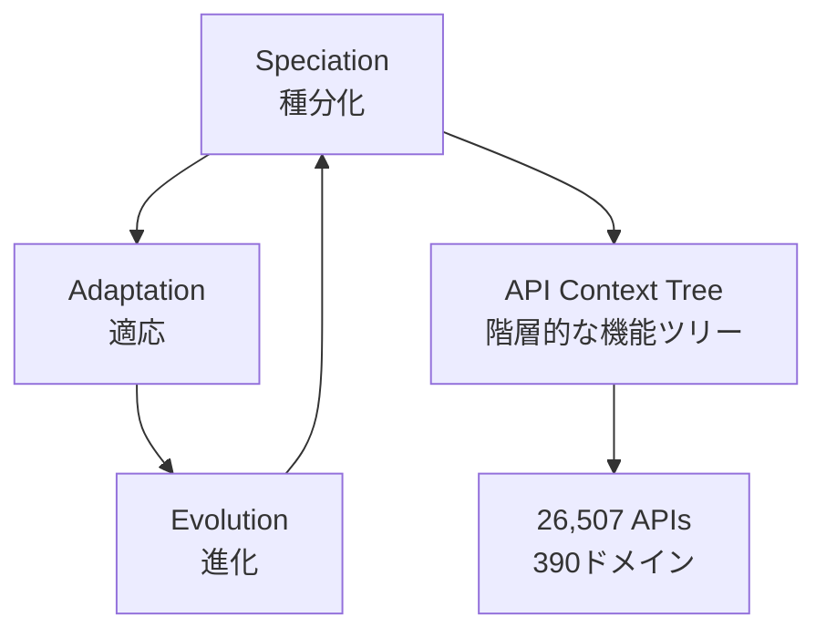

本記事は [arXiv:2409.00920 ToolACE: Winning the Points of LLM Function Calling](https://arxiv.org/abs/2409.00920) の解説記事です。

## 論文概要（Abstract）

ToolACEは、LLMのFunction Calling能力を向上させるための高品質な訓練データを自動生成するパイプラインである。著者らは自己進化的合成プロセスにより26,507個の多様なAPI定義を含むプールを構築し、マルチエージェント対話生成とデュアルレイヤー検証を組み合わせることで、高品質な訓練データを大規模に生成した。LLaMA3.1-8Bをベースにファインチューニングしたモデル（ToolACE-8B）は、Berkeley Function-Calling Leaderboard（BFCL）で総合3位を達成し、パラメータ数が大幅に多いGPT-4系モデルと競合する性能を報告している。

この記事は [Zenn記事: AIエージェントのツール定義設計原則：スキーマ・命名・レスポンスの実践ガイド](https://zenn.dev/0h_n0/articles/581a4e0ece7056) の深掘りです。

## 情報源

- **arXiv ID**: 2409.00920
- **URL**: [https://arxiv.org/abs/2409.00920](https://arxiv.org/abs/2409.00920)
- **著者**: Weiwen Liu, Xu Huang, Xingshan Zeng et al.（28名の共著）
- **発表年**: 2024
- **分野**: cs.LG, cs.AI, cs.CL
- **データ・モデル**: [https://huggingface.co/Team-ACE](https://huggingface.co/Team-ACE)

## 背景と動機（Background & Motivation）

Function Calling（ツール呼び出し）はLLMエージェントの中核能力であるが、高品質な訓練データの構築は困難である。従来のデータセット（Gorilla: 1,645 API/3ドメイン、ToolLLM: 16,464 API/49ドメイン）はドメイン範囲が限定的であり、API定義の多様性や複雑さが実世界のツール環境を十分に反映していなかった。

本研究の動機は「API定義の品質と多様性が、LLMのFunction Calling精度を本質的に左右する」という仮説にある。API定義のSchema設計、パラメータの型定義、説明文の詳細度がモデルの呼び出し精度に直結することを、データ生成とモデル訓練の双方から実証する。

## 主要な貢献（Key Contributions）

- **貢献1**: 自己進化的合成プロセスにより26,507個の多様なAPI定義を390ドメインにわたって自動生成
- **貢献2**: マルチエージェント対話生成とデュアルレイヤー（ルールベース+モデルベース）検証を組み合わせた品質保証パイプライン
- **貢献3**: 8Bパラメータモデルでberkeley Function-Calling Leaderboard総合3位（スコア59.22）を達成

## 技術的詳細（Technical Details）

### 自己進化的API合成（Self-Evolution Synthesis）

API定義の生成は3段階の反復プロセスで行われる。



**Speciation（種分化）**: 事前学習データ（技術マニュアル、ドキュメント、仕様書）から階層的なAPIコンテキストツリーを構築する。各ノードはAPIが提供し得る機能を表現する。

**Adaptation（適応）**: サブツリーをサンプリングし、ドメインと多様性レベルを指定する。異なるAPI間で機能が重複しないよう、能力の深さを変化させる。

**Evolution（進化）**: LLMを用いてサンプリングされたサブツリーと既存の例から新しいAPI定義を合成する。多様性指標として「新規機能やパラメータの追加、制約の追加、パラメータ型の変異」が用いられる。

### API定義の品質仕様

生成されるAPI定義はJSON Schemaに準拠し、以下の特性を持つ。

```json
{
  "name": "weather_get_forecast",
  "description": "指定された地点の天気予報を取得する。緯度経度またはCity名で指定可能。3時間ごとの予報を最大5日分返す。",
  "parameters": {
    "type": "object",
    "properties": {
      "location": {
        "type": "string",
        "description": "地点名またはCity名（例: 'Tokyo', 'New York'）"
      },
      "latitude": {
        "type": "number",
        "description": "緯度（-90から90）。locationと排他的に使用"
      },
      "longitude": {
        "type": "number",
        "description": "経度（-180から180）。latitudeと同時に指定必須"
      },
      "days": {
        "type": "integer",
        "description": "予報日数（1-5）。デフォルト: 3",
        "minimum": 1,
        "maximum": 5
      },
      "units": {
        "type": "string",
        "enum": ["metric", "imperial"],
        "description": "温度単位。デフォルト: metric"
      }
    },
    "required": ["location"]
  }
}
```

ToolACEの合成プロセスでは、ネストされたパラメータ型（リストのリスト、辞書のリスト等）や並列実行、依存チェーンを含む複雑なAPI定義が生成される。

### マルチエージェント対話生成

3つのシミュレーションエージェント（ユーザー、アシスタント、ツール）が4種類の対話パターンを生成する。

| 対話パターン | 説明 | 例 |
|-------------|------|-----|
| 単一関数呼び出し | 1つのAPIを1回呼び出す | 天気予報の取得 |
| 並列関数呼び出し | 複数APIを並行実行 | 東京と大阪の天気を同時取得 |
| 依存関数呼び出し | 前の結果を次の入力に使用 | ユーザー検索→プロフィール取得 |
| 非ツール利用応答 | ツール呼び出しが不要な質問 | 一般的な知識への回答 |

アシスタントエージェントの行動空間には「API呼び出し」「情報の追加要求」「フィードバックの要約」「非ツール回答」が含まれる。生成された応答は複数回生成し、一貫性を確認した上で採用される。

### デュアルレイヤー検証システム

**ルール検証層（Rule Verification）**: 以下の4つの観点を自動チェックする。

1. **API定義の明確さ**: JSON Schema準拠、型定義の整合性
2. **関数呼び出しの実行可能性**: API名の一致、必須パラメータの充足、フォーマットパターンの準拠
3. **対話の正確性**: フィールドの存在、応答長、文字の有効性
4. **データサンプルの一貫性**: API名の対応、フォーマット準拠、対話順序

**モデル検証層（Model Verification）**: LLMを審査員として以下を評価する。

1. **ハルシネーション検出**: パラメータ値の捏造がないか
2. **一貫性検証**: タスク完了度、制約遵守
3. **ツール応答の整合性**: API定義とレスポンスの対応

### 複雑度の定量化

著者らはデータの複雑度をモデル損失で定量化している。

$$
H_M(x, y) = -\frac{1}{n_y} \sum_{i=1}^{n_y} \log p(t_i \mid x, t_1, \ldots, t_{i-1})
$$

ここで、
- $x$: 入力（ユーザークエリ + API定義）
- $y$: 正解出力（関数呼び出し）
- $n_y$: 出力トークン数
- $t_i$: $i$番目の出力トークン

著者らの分析によると、複雑度は候補API数、利用API数、クエリと説明文の非類似度と正の相関を示す。

## 実装のポイント（Implementation）

### 学習設定

| パラメータ | 値 |
|-----------|-----|
| ベースモデル | LLaMA3.1-8B-Instruct |
| 手法 | SFT + LoRA |
| LoRA rank | 16 |
| LoRA alpha | 32 |
| 学習率 | $1 \times 10^{-4}$ |
| ウォームアップ | 10% |
| スケジューラ | コサイン |
| バッチサイズ | 48 |
| エポック数 | 3 |

LoRAによるパラメータ効率的な微調整を採用しており、全パラメータ更新と比較して計算コストが大幅に低い。

### API定義設計への示唆

ToolACEの実験結果から、API定義の品質に関する以下の知見が得られている。

1. **多様なパラメータ型**: ネストされたリストや辞書を含むAPI定義でのFunction Calling精度は、単純な型のみのAPIに比べて低い。API定義ではできるだけフラットな構造が望ましい

2. **説明文の詳細度**: API名と説明文の間のクエリ非類似度が高いほど（つまり名前だけでは機能が推測しにくいほど）、Function Callingの複雑度が上がる。これはZenn記事で紹介されている「ツール名で何をするかわかるように設計する」原則と一致する

3. **候補API数の影響**: 候補API数の増加に伴い複雑度が上昇する。これはZenn記事で紹介されているTool Search（`defer_loading`）の必要性を裏付ける

## 実験結果（Results）

### Berkeley Function-Calling Leaderboard

論文より、ToolACE-8BのBFCLスコアを以下に示す。

| メトリクス | ToolACE-8B | 備考 |
|-----------|-----------|------|
| 総合スコア | 59.22 | BFCL総合3位 |
| Non-live AST | 89.27% | API呼び出しの構造的正確性 |
| Non-live Executable | 90.07% | 実行可能性 |
| Live AST | 73.21% | ライブAPI環境での正確性 |
| ハルシネーション（関連） | 85.37% | 関連ツールでの幻覚抑制 |
| ハルシネーション（非関連） | 83.81% | 非関連ツールでの幻覚抑制 |

### API-Bankでの比較

| モデル | Call精度 | Retrieval+Call精度 |
|--------|---------|-------------------|
| ToolACE-8B | 75.94% | 47.41% |
| GPT-4o | 同等レベル | 同等レベル |

著者らは8Bパラメータという小規模モデルでGPT-4o相当の性能を達成したことを主要な成果として報告している。

### データ多様性と精度の関係

論文の分析によると、訓練データのAPI多様性（クラスタ数6→14→30）と精度には正の相関が確認されている。特にハルシネーション検出（関連度判定）での改善が顕著であると報告されている。

## 実運用への応用（Practical Applications）

ToolACEの知見はツール定義設計に以下の示唆を与える。

1. **API定義の品質管理**: ToolACEのデュアルレイヤー検証（ルールベース+モデルベース）は、プロダクション環境でのAPI定義のCIパイプラインに応用可能。新しいツール定義をデプロイする前に、JSON Schema準拠性チェック（ルール層）とLLM による意味的整合性チェック（モデル層）を自動実行する

2. **ツール数のスケーリング**: 候補API数の増加が複雑度を上げるという知見は、Zenn記事で紹介されている「20ツール以下で初期精度を確保」というガイドラインと整合する

3. **Function Callingの微調整**: LoRA（rank=16, alpha=32）による効率的な微調整手法は、カスタムツールセットに特化したモデルの構築に参考になる。ただし、APIの追加・変更のたびに再学習が必要になる点はToolGenと同様の制約である

## 関連研究（Related Work）

- **Gorilla（Patil et al., 2023）**: 1,645 API/3ドメインの初期的なFunction Callingデータセット。ToolACEは規模（26,507 API/390ドメイン）と多様性で大幅に拡張
- **ToolLLM（Qin et al., 2024）**: 16,464 API/49ドメイン。RapidAPIベースで実世界APIを利用。ToolACEは合成データによりドメイン範囲を拡大
- **APIGen（Liu et al., 2024）**: API合成に焦点を当てた並行研究。ToolACEはマルチエージェント対話生成とデュアルレイヤー検証で差別化

## まとめと今後の展望

ToolACEは「API定義の品質と多様性がFunction Calling性能を決定する」ことを大規模な実験で実証した論文である。26,507 APIの自動生成パイプラインとデュアルレイヤー検証は、ツール定義の品質管理の体系化に貢献している。

ツール定義設計の観点では、以下が特に重要である。

1. **名前と説明文の整合性**: クエリと説明文の非類似度が複雑度を上げるため、ツール名は機能を明確に表現すべきである
2. **パラメータ構造のシンプルさ**: ネストの深い型定義はFunction Calling精度を下げる
3. **検証パイプラインの自動化**: ルールベース+モデルベースの二層検証により、ツール定義の品質を継続的に保証できる

ただし、ToolACEのデータはLLMによる合成データであり、実世界APIとの分布の乖離がライブ環境での性能に影響し得る点は著者ら自身も課題として認識している。

## 参考文献

- **arXiv**: [https://arxiv.org/abs/2409.00920](https://arxiv.org/abs/2409.00920)
- **Model & Data**: [https://huggingface.co/Team-ACE](https://huggingface.co/Team-ACE)
- **Related Zenn article**: [https://zenn.dev/0h_n0/articles/581a4e0ece7056](https://zenn.dev/0h_n0/articles/581a4e0ece7056)
