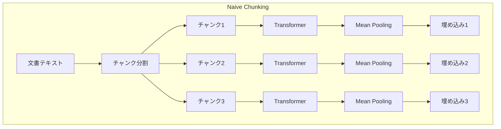
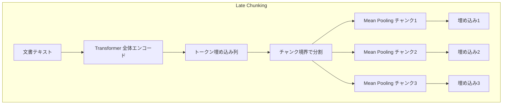

## 論文概要

本記事は [Late Chunking (arXiv:2409.04701)](https://arxiv.org/abs/2409.04701) の解説記事です。Jina AIのMichael Güntherらが2024年9月に発表した本論文は、密ベクトル検索における従来のチャンキング手法が抱える文脈情報喪失の問題に対し、Transformerによるエンコード後にチャンキングを行う「Late Chunking」を提案しています。追加学習なしで既存の長文コンテキスト埋め込みモデルに適用でき、BeIRベンチマークで平均2.7〜3.6%の相対的な性能向上を報告しています。本記事は、[LlamaIndex v0.14でRAGパイプラインを体系的に構築する実践ガイド](https://zenn.dev/0h_n0/articles/d70a46a75bdb5b) で解説したSemanticSplitterNodeParserなどの従来チャンキング手法の限界を、学術的な観点から深掘りする位置づけです。

## 情報源

| 項目 | 詳細 |
|------|------|
| **arXiv ID** | [2409.04701](https://arxiv.org/abs/2409.04701) |
| **著者** | Michael Günther, Isabelle Mohr, Daniel James Williams, Bo Wang, Han Xiao (Jina AI) |
| **初版投稿** | 2024年9月7日 |
| **最新版** | 2025年7月7日 (v3) |
| **分野** | cs.CL (Computation and Language), cs.IR (Information Retrieval) |
| **GitHub** | [jina-ai/late-chunking](https://github.com/jina-ai/late-chunking) |

## 背景と動機

RAG（Retrieval-Augmented Generation）パイプラインでは、長い文書をチャンク（断片）に分割してから各チャンクを独立にベクトル化する「chunk-then-embed」方式が広く用いられています。しかし、この方式にはチャンク間の文脈情報が失われるという根本的な問題があります。

著者らは論文中で、Wikipediaの「Berlin」の記事を例に挙げてこの問題を具体的に説明しています。最初の文で「Berlin」が導入された後、後続の文では「its」「the city」といった照応表現（anaphoric reference）が使われます。従来の方式では各チャンクが独立にエンコードされるため、「the city」が何を指すのかという情報が埋め込みに反映されません。

この問題は、チャンクサイズが小さいほど深刻になります。密ベクトル検索では短いテキストの方が意味の過圧縮が起きにくく性能が良いとされる一方で、短いチャンクほど周囲の文脈を失いやすいというトレードオフが存在します。LlamaIndexのSemanticSplitterNodeParserのように意味的な境界でチャンクを分割する手法でも、各チャンクを独立にエンコードする限りこの問題は残ります。

著者らはこのトレードオフを解消するために、チャンキングのタイミングを変えるという発想に至りました。

## 主要な貢献

- **Late Chunking手法の提案**: 長文コンテキスト埋め込みモデルで文書全体をエンコードした後にチャンキングを行うことで、文脈情報を保持したチャンク埋め込みを生成する手法
- **追加学習不要での適用**: 既存の長文コンテキスト埋め込みモデル（jina-embeddings-v2/v3、nomic-embed-text-v1など）にそのまま適用可能
- **Long Late Chunking**: モデルのコンテキスト長を超える文書に対応するためのマクロチャンキング手法
- **Span Poolingによるファインチューニング**: Late Chunkingに特化した訓練手法の提案。スパンレベルのアノテーションを用いて、チャンク単位の検索性能を向上
- **包括的なベンチマーク評価**: BeIRおよびLongEmbedベンチマークで、3種類のチャンキング戦略（固定長・文単位・意味的）にわたる評価を実施

## 技術的詳細

### 従来方式とLate Chunkingの比較

以下の図は、従来のNaive Chunkingと提案手法のLate Chunkingのパイプラインを比較したものです。





Naive Chunkingでは、各チャンクが独立にTransformerに入力されるため、self-attentionは同一チャンク内のトークンにしか適用されません。一方、Late Chunkingでは文書全体をTransformerに通してからチャンキングを行うため、各トークンの埋め込みが文書全体の文脈を反映しています。

### アルゴリズムの数学的定式化

Late Chunkingのアルゴリズムは以下の手順で構成されます。

**入力**: テキスト $T$ とチャンカー関数

1. チャンカーがテキスト $T$ を文字単位のチャンク $(c_1, \ldots, c_n)$ に分割
2. トークナイザがテキスト全体からトークンID列 $(\tau_1, \ldots, \tau_m)$ と各トークンの文字長 $(o_1, \ldots, o_m)$ を生成
3. Transformerモデルがトークン列全体を処理し、文脈を考慮したトークン埋め込み列 $(\vartheta_1, \ldots, \vartheta_m)$ を出力
4. 文字単位のチャンク境界をトークンインデックスに変換

各チャンク $i$ の埋め込み $e_i$ は、対応するトークン範囲に対するMean Poolingで計算されます。

$$
e_i = \frac{\sum_{j=\text{cue\_start}_i}^{\text{cue\_end}_i} \vartheta_j}{(\text{cue\_end}_i + 1) - \text{cue\_start}_i}
$$

ここで、$\vartheta_j$ はTransformerの最終層から出力されたトークン $j$ の埋め込みベクトル、$\text{cue\_start}_i$ と $\text{cue\_end}_i$ はチャンク $i$ に対応するトークンの開始・終了インデックスです。

重要な点は、$\vartheta_j$ が文書全体のself-attentionを経たトークン埋め込みであるということです。Naive Chunkingでは各チャンクが独立にエンコードされるため、$\vartheta_j$ はチャンク内のトークンのみから計算されますが、Late Chunkingでは全トークンとの相互作用を含む表現になります。

### Long Late Chunking

モデルのコンテキスト長（例: 8192トークン）を超える文書を扱うために、著者らはLong Late Chunkingを提案しています。この手法では以下のように処理します。

1. 文書を最大 $l_{\max}$ トークンのマクロチャンクに分割
2. 連続するマクロチャンク間に $\omega$ トークンのオーバーラップを設定（文脈の連続性を維持）
3. 各マクロチャンクに対して通常のLate Chunkingを適用
4. オーバーラップ領域を除いてトークン埋め込みを結合

### Span Poolingによるファインチューニング

Late Chunkingの効果をさらに高めるため、著者らはSpan Poolingと呼ばれるファインチューニング手法を提案しています。

訓練データは $(q, d, \langle \text{start}, \text{end} \rangle)$ のタプル形式で、$q$ はクエリ、$d$ は文書、$\langle \text{start}, \text{end} \rangle$ は文書中の回答スパンの位置です。従来の訓練では文書全体にMean Poolingを適用しますが、Span Poolingでは回答スパンのトークンのみにMean Poolingを適用します。

損失関数にはInfoNCE損失を使用します。

$$
\mathcal{L}_{\text{NCE}}(B) := -\sum_{(x_i, y_i) \in B} \ln \frac{e^{s(x_i, y_i) / \tau}}{\sum_{i'=1}^{k} e^{s(x_i, y_{i'}) / \tau}}
$$

ここで、$s$ はコサイン類似度、$\tau$ は温度パラメータ、$B$ はミニバッチです。双方向損失は以下のように定義されます。

$$
\mathcal{L}_{\text{pairs}}(B) := \mathcal{L}_{\text{NCE}}(B) + \mathcal{L}_{\text{NCE}}(B^{\dagger})
$$

訓練データとしてFEVER（文レベルスパン）とTriviaQA（エンティティ/フレーズレベルスパン）から約47万ペアを使用しています。

## 実装のポイント

Late Chunkingは、長文コンテキストをサポートする既存の埋め込みモデルに対して追加学習なしで適用できます。著者らのGitHubリポジトリを用いた基本的な実装例を以下に示します。

```python
from typing import List
import torch
from transformers import AutoModel, AutoTokenizer

def late_chunking(
    text: str,
    chunk_boundaries: List[tuple[int, int]],
    model_name: str = "jinaai/jina-embeddings-v2-small-en",
) -> List[torch.Tensor]:
    """Late Chunkingによるチャンク埋め込み生成.

    Args:
        text: 入力テキスト全体
        chunk_boundaries: 各チャンクの(開始文字位置, 終了文字位置)のリスト
        model_name: 使用する埋め込みモデル名

    Returns:
        各チャンクの埋め込みベクトルのリスト
    """
    tokenizer = AutoTokenizer.from_pretrained(model_name, trust_remote_code=True)
    model = AutoModel.from_pretrained(model_name, trust_remote_code=True)

    # 文書全体をトークナイズ（オフセットマッピングを取得）
    inputs = tokenizer(
        text,
        return_tensors="pt",
        return_offsets_mapping=True,
        max_length=8192,
        truncation=True,
    )
    offset_mapping = inputs.pop("offset_mapping")[0]

    # Transformerで文書全体をエンコード
    with torch.no_grad():
        outputs = model(**inputs)
    token_embeddings = outputs.last_hidden_state[0]  # (seq_len, hidden_dim)

    # 文字単位の境界をトークンインデックスに変換
    chunk_embeddings: list[torch.Tensor] = []
    for char_start, char_end in chunk_boundaries:
        token_indices = [
            i for i, (s, e) in enumerate(offset_mapping)
            if s >= char_start and e <= char_end and s != e
        ]
        if token_indices:
            # 対象トークンのMean Pooling
            chunk_emb = token_embeddings[token_indices].mean(dim=0)
            chunk_embeddings.append(chunk_emb)

    return chunk_embeddings
```

実装上の注意点として、以下の考慮事項があります。

- **特殊トークンの扱い**: [CLS]トークンは最初のチャンクに、[SEP]トークンは最後のチャンクに含める。jina-v3やnomicモデルでは、先頭に付与されるインストラクションも最初のチャンクに割り当てる
- **チャンキング戦略の選択**: 固定長（256トークン）、文単位（5文ごと）、意味的分割のいずれでも適用可能
- **コンテキスト長の制限**: モデルのコンテキスト長を超える文書にはLong Late Chunkingを使用し、オーバーラップ幅は実験的に16トークン程度で十分と報告されている

## 本番環境への展開ガイド

Late Chunkingを本番RAGシステムに統合する際には、トラフィック規模に応じたアーキテクチャ選定が重要です。以下に、AWSを基盤としたデプロイパターンを示します。

### トラフィック規模別アーキテクチャ

| 規模 | 想定トラフィック | アーキテクチャ | 月額目安 |
|------|-----------------|--------------|---------|
| Small | ~1,000 req/日 | Lambda + S3 + OpenSearch Serverless | $150-300 |
| Medium | ~10,000 req/日 | ECS Fargate + ElastiCache + OpenSearch | $800-1,500 |
| Large | ~100,000 req/日 | EKS + Karpenter + GPU nodes + OpenSearch | $3,000-8,000 |

### Small構成: Lambda + サーバーレス

小規模では、Lambda関数でLate Chunkingの推論を行い、結果をOpenSearch Serverlessに格納するサーバーレス構成が費用対効果に優れます。主要リソースはLambda関数（memory_size: 3008MB、timeout: 300s）、OpenSearch Serverless（VECTORSEARCH型）、SQSキューによるイベント駆動です。PyTorchをLambda Layerとして含め、モデルはS3またはEFSからロードします。

### Large構成: EKS + Karpenter + GPU

大規模トラフィックでは、EKS上にGPUノード（g5.xlarge/g5.2xlarge）をKarpenterで動的にプロビジョニングします。Spotインスタンスの活用で最大60%のコスト削減が可能です。KarpenterのconsolidationPolicy（WhenEmptyOrUnderutilized）により、アイドルノードは60秒後に自動削除されます。

### モニタリングとオブザーバビリティ

本番環境では以下の監視を推奨します。

- **CloudWatchメトリクス**: EmbeddingLatency（ms）、ChunkCount、TokenCountをカスタムメトリクスとして送信
- **X-Rayトレーシング**: tokenize / transformer_encode / chunk_and_pool の各ステージを個別にトレース
- **Cost Explorer**: タグ別コスト推移のダッシュボード化、月次のコスト異常検知アラート（AWS Cost Anomaly Detection）

### コスト最適化チェックリスト

**コンピューティング**:
- [ ] GPUインスタンスにSpotインスタンスを活用（最大60%削減）
- [ ] 推論時にfp16/bf16量子化を適用してメモリ使用量を削減
- [ ] バッチ推論で複数文書をまとめて処理しGPU利用率を向上
- [ ] オフピーク時間帯の処理をスケジュールジョブに移行
- [ ] Lambda関数のメモリサイズを実測に基づいて最適化
- [ ] モデルのONNX変換による推論高速化を検証
- [ ] Gravitonインスタンス（CPU推論時）の採用を検討

**ストレージ・ネットワーク**:
- [ ] OpenSearchのインデックス圧縮（Faiss IVF-PQ等）を検討
- [ ] 埋め込みの次元削減（Matryoshka Representation Learning対応モデル）
- [ ] S3 Intelligent-Tieringで元文書のストレージコストを最適化
- [ ] VPCエンドポイントでNATゲートウェイのデータ転送コストを削減
- [ ] リージョン内通信を徹底しクロスリージョン転送を回避

**運用・セキュリティ**:
- [ ] Reserved Instances / Savings Plansの適用を定期的に見直し
- [ ] CloudWatch Logsの保持期間を必要最小限に設定
- [ ] 開発環境の夜間・週末自動停止
- [ ] IAMロールの最小権限原則を遵守
- [ ] VPC内のプライベートサブネットでモデル推論を実行
- [ ] 埋め込みベクトルの暗号化（OpenSearch at-rest encryption）
- [ ] API GatewayでのWAF設定とレート制限
- [ ] Secrets Managerでの認証情報管理

## 実験結果

著者らはBeIRベンチマークおよびLongEmbedベンチマークを用いて、Late Chunkingの有効性を評価しています。

### BeIRベンチマーク (nDCG@10)

論文Table 2より、jina-embeddings-v2-smallモデルでの固定長256トークンチャンキングの結果を示します。

| 手法 | SciFact | NFCorpus | FiQA | TRECCOVID | 平均 |
|------|---------|----------|------|-----------|------|
| Naive Chunking | 52.2 | 31.6 | 38.9 | 69.8 | 54.0 |
| Late Chunking | 54.0 | 33.9 | 39.9 | 72.3 | 55.0 |

著者らは、文単位チャンキング（5文ごと）では平均+1.9ポイント（相対+3.63%）、意味的チャンキングでは平均+1.5ポイント（相対+2.70%）の向上を報告しています。これらの改善は追加学習なしで得られたものです。

### チャンクサイズの影響

論文Figure 3より、著者らはNFCorpusおよびLongEmbedデータセットにおいて、チャンクサイズを64〜2048トークンの範囲で変化させた実験を報告しています。Late Chunkingの優位性はチャンクサイズが小さいほど顕著であり、これは小チャンクほど周囲の文脈を必要とするという直観と一致します。

### ファインチューニングの効果

論文Table 3より、jina-embeddings-v3モデルに対するSpan Pooling訓練の結果では、一貫して小幅な改善が見られると報告されています。例えば、FiQAでMean Pooling訓練の47.40%に対してSpan Pooling訓練は48.22%を達成しています。ただし著者らは、訓練データがWikipediaベースの約47万ペアに限定されていることが性能向上の制約になっている可能性を指摘しています。

### 文脈埋め込みの比較

論文Table 4では、ACME Corpの売上成長に関するクエリを用いた質的評価が示されています。関連チャンク（「3% revenue growth」を含む）に対するコサイン類似度は、Naive Chunkingの0.6343に対してLate Chunkingは0.8516を達成し、LLMベースの文脈的埋め込み（Anthropic方式、0.8590）に迫る性能を追加のLLM呼び出しなしで実現しています。

### 制約と限界

著者らは以下の制約を報告しています。

- **合成データセットでの限界**: Needle-8192やPasskey-8192のように、関連情報が無関係なテキストに埋め込まれるタスクでは、Late Chunkingが不利になる場合がある（無関係な文脈がノイズとして作用するため）
- **オーバーラップの効果が限定的**: 16トークンのオーバーラップはNaive Chunkingでは効果が薄いと報告されている
- **訓練データの制約**: Span Pooling訓練に使用したデータセットがWikipediaベースに限定されており、ドメイン特化での改善余地がある

## 実運用への応用

Late Chunkingは、[LlamaIndex v0.14のRAGパイプライン](https://zenn.dev/0h_n0/articles/d70a46a75bdb5b)で解説したSemanticSplitterNodeParserと相補的に利用できます。

LlamaIndexのSemanticSplitterNodeParserは、連続する文の埋め込み類似度に基づいて意味的に一貫したチャンクを作成しますが、各チャンクは独立にエンコードされます。Late Chunkingを組み合わせることで、意味的に適切な境界でのチャンク分割と文脈保持型のエンコードを両立できます。

具体的な導入パターンとして以下が考えられます。

1. **インデクシング時**: SemanticSplitterで境界を決定し、チャンク境界情報を保持したままLate Chunkingでエンコード
2. **クエリ時**: クエリは通常通り単独でエンコード（短いテキストでは文脈喪失の問題がないため）
3. **ハイブリッド検索**: Late Chunkingによる密ベクトル検索とBM25によるスパース検索を組み合わせ、リランキングで最終順位を決定

Anthropicが提案するLLMベースの文脈的検索（各チャンクにLLMで文脈情報を付与する方式）と比較すると、Late Chunkingはインデクシング時のLLM呼び出しが不要であり、コストとレイテンシの面で有利です。論文Table 4の結果からも、両者の性能差は0.0074（コサイン類似度）と極めて小さいことが示されています。

## 関連研究

- **ColBERT** (Khattab & Zaharia, 2020): トークン単位の埋め込みを保持し、クエリ時に遅延相互作用（late interaction）を行う手法。Late Chunkingとは異なり、ストレージコストが大きくなる
- **Anthropicの文脈的検索** (2024): LLM（claude-3-haiku）を用いて各チャンクに文脈説明を付与する手法。Late Chunkingと同等の効果を追加のLLM呼び出しなしで実現できる点がLate Chunkingの利点
- **Chen et al. (2024)**: 文脈化された文埋め込みのために専用モデルを訓練する手法。Late Chunkingが既存モデルに追加学習なしで適用できる点と対照的
- **Sentence-BERT** (Reimers & Gurevych, 2019): 文の埋め込みにMean Poolingを用いる標準的な手法で、Late Chunkingの基盤となるアプローチ

## まとめと今後の展望

Late Chunkingは、「チャンキングのタイミングを変える」というシンプルな発想で、従来のchunk-then-embed方式が抱える文脈情報喪失の問題を解決する手法です。追加学習なしで既存の長文コンテキスト埋め込みモデルに適用でき、BeIRベンチマークで一貫した改善を示しています。

今後の展望として、以下の方向性が考えられます。

- **大規模訓練データでのSpan Pooling**: Wikipedia以外のドメイン特化データでのファインチューニング効果の検証
- **マルチモーダルへの拡張**: 画像やテーブルを含む文書への適用
- **LlamaIndex等のフレームワーク統合**: Late Chunkingをノードパーサーとして直接組み込むインターフェースの整備

RAGパイプラインにおけるチャンキングの品質は検索性能に直結するため、Late Chunkingのようなエンコード段階での文脈保持は、実用的なシステム改善に寄与する手法といえます。

## 参考文献

- Günther, M., Mohr, I., Williams, D. J., Wang, B., & Xiao, H. (2024). Late Chunking: Contextual Chunk Embeddings Using Long-Context Embedding Models. [arXiv:2409.04701](https://arxiv.org/abs/2409.04701)
- GitHub: [jina-ai/late-chunking](https://github.com/jina-ai/late-chunking)
- FEVER span annotations: [jinaai/fever-span-annotated](https://huggingface.co/datasets/jinaai/fever-span-annotated)
- TriviaQA span annotations: [jinaai/triviaqa-span-annotated](https://huggingface.co/datasets/jinaai/triviaqa-span-annotated)
- Zenn記事: [LlamaIndex v0.14でRAGパイプラインを体系的に構築する実践ガイド](https://zenn.dev/0h_n0/articles/d70a46a75bdb5b)
