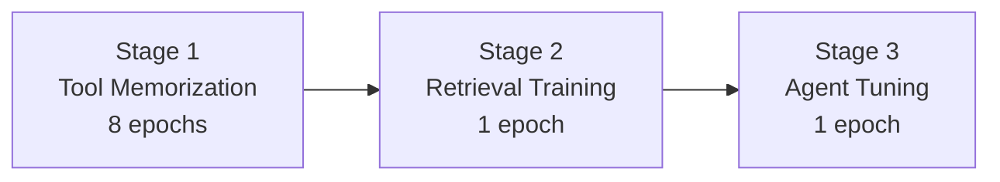

本記事は [arXiv:2410.03439 ToolGen: Unified Tool Retrieval and Calling via Generation](https://arxiv.org/abs/2410.03439) の解説記事です。

## 論文概要（Abstract）

ToolGenは、従来のツール検索（どのツールを使うか）とツール呼び出し（どう使うか）を分離していたパイプラインを、LLMの単一生成パスに統一するフレームワークである。各ツールに仮想トークンを割り当ててLLMの語彙に追加し、ツール選択を「特定トークンの生成」問題として定式化する。著者らはToolBenchデータセット（47,000超のAPI）で評価を行い、ツール検索・エンドツーエンドタスク完了の両方で既存手法を上回る性能を報告している。

この記事は [Zenn記事: AIエージェントのツール定義設計原則：スキーマ・命名・レスポンスの実践ガイド](https://zenn.dev/0h_n0/articles/581a4e0ece7056) の深掘りです。

## 情報源

- **会議名**: ICLR 2025（International Conference on Learning Representations）
- **年**: 2025
- **URL**: [https://arxiv.org/abs/2410.03439](https://arxiv.org/abs/2410.03439)
- **著者**: Renxi Wang, Xudong Han, Lei Ji, Shu Wang, Timothy Baldwin, Haonan Li
- **コード**: [https://github.com/Reason-Wang/ToolGen](https://github.com/Reason-Wang/ToolGen)

## カンファレンス情報

ICLRは機械学習分野における最高峰の国際会議の一つであり、表現学習（Representation Learning）を軸としながらも、LLM・エージェント・ツール利用に関する研究も多数採択されている。ToolGenは2025年の大会で採択された。

## 背景と動機（Background & Motivation）

LLMエージェントが外部ツールを利用する際、従来は2段階のパイプラインが一般的であった。まずツール検索システム（BM25やベクトル類似度検索）が候補ツールを絞り込み、次にLLMがそのサブセットからツールを選択・呼び出すという流れである。

この2段階アプローチには以下の問題がある。

1. **コンテキスト制約**: 候補ツールの説明文をすべてLLMのコンテキストに入れる必要があり、ツール数が増えるとコンテキストウィンドウを圧迫する
2. **検索精度の上限**: 第1段階の検索が不正確だと、正しいツールが候補に含まれず、LLMの選択精度に上限が生じる
3. **エンドツーエンド最適化の欠如**: 検索とLLM選択が独立に最適化されるため、全体最適が保証されない

ToolGenはこれらの問題を「ツール知識をLLMのパラメータに直接統合する」アプローチで解決する。

## 技術的詳細（Technical Details）

### ツールトークンの設計

ToolGenの核心は、各ツールをLLMの語彙内の一意の仮想トークンに対応させる**アトミックインデキシング**である。

具体的には、Llama-3-8Bの語彙（128,256トークン）に46,985個のツールトークンを追加し、合計175,241トークンの拡張語彙を構築する。新しいトークンの埋め込みは、対応するツール名のトークン埋め込みの平均値で初期化される。

$$
\mathbf{e}_{\text{tool}_i} = \frac{1}{|T_i|} \sum_{t \in T_i} \mathbf{e}_t
$$

ここで、
- $\mathbf{e}_{\text{tool}_i}$: ツール$i$の仮想トークン埋め込み
- $T_i$: ツール$i$の名前を構成するサブワードトークンの集合
- $\mathbf{e}_t$: 既存語彙内のトークン$t$の埋め込み

この初期化により、ツール名の意味的情報が仮想トークンに伝達される。

### 3段階学習パイプライン

ToolGenは以下の3段階で学習を行う。



**Stage 1: Tool Memorization（ツール記憶）**

ツールの説明文（ドキュメント）を入力とし、対応する仮想トークンを出力として学習する。

$$
\mathcal{L}_{\text{mem}} = \sum_{d \in \mathcal{D}} -\log p_\theta(\text{Index}(d) \mid d_{\text{doc}})
$$

ここで、
- $\mathcal{D}$: 全ツール集合
- $d_{\text{doc}}$: ツール$d$の説明文
- $\text{Index}(d)$: ツール$d$に割り当てられた仮想トークン
- $\theta$: モデルパラメータ

この段階ではツール説明文→仮想トークンの対応関係をモデルに記憶させる。著者らは8エポックの学習が必要であると報告している。

**Stage 2: Retrieval Training（検索訓練）**

ユーザークエリを入力とし、関連するツールの仮想トークンを出力として学習する。

$$
\mathcal{L}_{\text{ret}} = \sum_{q \in \mathcal{Q}} \sum_{d \in \mathcal{D}_q} -\log p_{\theta'}(\text{Index}(d) \mid q)
$$

ここで、
- $\mathcal{Q}$: クエリ集合
- $\mathcal{D}_q$: クエリ$q$に関連するツール集合
- $\theta'$: Stage 1で学習済みのパラメータからの継続学習

この段階により、モデルは自然言語のクエリから適切なツールトークンを生成する能力を獲得する。

**Stage 3: End-to-End Agent-Tuning（エージェント微調整）**

タスク完了の軌跡（思考→ツール選択→引数指定→結果解釈の繰り返し）で微調整する。モデルは思考を生成し、ツールトークンを出力し、引数をJSON形式で生成するという一連の流れをエンドツーエンドで学習する。

### 制約付きビームサーチ

推論時には**disjunctive trie**データ構造を用いた制約付きビームサーチにより、生成されるトークンを有効なツールトークンに限定する。これにより、存在しないツールのハルシネーションを完全に排除する。

```python
class ConstrainedBeamSearch:
    """制約付きビームサーチの概念的な実装"""

    def __init__(self, tool_tokens: set[int], beam_width: int = 5):
        self.tool_tokens = tool_tokens
        self.beam_width = beam_width

    def search(self, model, input_ids: list[int]) -> int:
        """有効なツールトークンのみを候補として生成"""
        logits = model.forward(input_ids)
        # ツールトークン以外のlogitsをマスク
        mask = torch.full_like(logits, float("-inf"))
        for token_id in self.tool_tokens:
            mask[token_id] = 0.0
        masked_logits = logits + mask
        # ビームサーチで上位候補を選択
        top_k = torch.topk(masked_logits, self.beam_width)
        return top_k.indices[0].item()
```

## 実装のポイント（Implementation）

### 学習設定

論文Table 5より、著者らは以下の設定を使用している。

| パラメータ | 値 |
|-----------|-----|
| ベースモデル | Llama-3-8B |
| オプティマイザ | AdamW（コサインスケジューラ） |
| 学習率 | $4 \times 10^{-5}$ |
| ウォームアップ | 3% |
| ハードウェア | 4×A100 GPU（DeepSpeed ZeRO-3） |
| Stage 1 エポック数 | 8 |
| Stage 2 エポック数 | 1 |
| Stage 3 エポック数 | 1 |

### 実装上の注意点

1. **語彙拡張のコスト**: 46,985トークンの追加はembedding layerとlm_headのサイズを増加させる。メモリ使用量の増加はトークン数×hidden_dim分（例: $46985 \times 4096 \approx 192M$パラメータ追加）
2. **新ツール追加時の再学習**: ToolGenの制約として、新しいツールを追加するにはStage 1から再学習が必要である。動的なツール追加には適さない
3. **disjunctive trieの構築**: 大規模ツールセットでのtrie構築は初期コストがかかるが、推論時の制約チェックは$O(\log N)$で効率的

## 実験結果（Results）

### ツール検索精度

論文Table 1より、In-Domainでのツール検索精度（NDCG@K）を以下に示す。

| 手法 | I1 NDCG@1 | I2 NDCG@1 | I3 NDCG@1 |
|------|-----------|-----------|-----------|
| BM25 | 51.43 | 56.15 | 39.00 |
| Embedding Similarity | 56.95 | 54.46 | 49.00 |
| ToolRetriever | 66.27 | 65.23 | 55.00 |
| **ToolGen** | **89.17** | **91.45** | **87.00** |

ToolGenは全カテゴリでToolRetrieverを20ポイント以上上回っている。著者らはこの改善をツール知識のパラメトリックな統合によるものと分析している。

### エンドツーエンド性能

論文Table 2より、Solvable Pass Rate（SoPR）とSolvable Win Rate（SoWR）を以下に示す。

| 手法 | SoPR (平均) | SoWR (平均) |
|------|-----------|-----------|
| GPT-3.5 | 47.50 | 49.17 |
| ToolLlama-3 | 44.61 | 46.50 |
| **ToolGen** | **53.28** | **51.51** |

ToolGenはGPT-3.5およびToolLlamaを上回るエンドツーエンド性能を達成している。

### Ablation Study

論文Table 3より、各学習段階を除去した場合の影響を以下に示す。

| 構成 | NDCG@1 (I1) |
|------|------------|
| Full ToolGen | 87.67 |
| Retrieval Training除去 | 10.17 |
| Tool Memorization除去 | 84.78 |

Retrieval Trainingの除去により性能が壊滅的に低下する（87.67→10.17）ことから、Stage 2がToolGenの性能に最も重要であることが示されている。一方、Tool Memorization（Stage 1）の除去では約3ポイントの低下にとどまっており、クエリ→ツールトークンの直接マッピング学習が主要な寄与源であることがわかる。

## 実運用への応用（Practical Applications）

ToolGenのアプローチは、以下の条件を満たすシステムで有効である。

1. **大規模ツールリポジトリ**: 数千〜数万のAPIを扱うプラットフォーム。コンテキストにすべてのツール定義を含められない規模
2. **ツールセットの安定性**: ツール追加頻度が低く、定期的な再学習が許容される環境
3. **エンドツーエンド最適化の必要性**: 検索精度と呼び出し精度の両方を同時に最適化したい場合

一方、以下の環境ではToolGenは適さない。

- **動的なツール追加が必要**: MCPサーバーの動的接続のように、実行時にツールが追加・削除される環境
- **モデルの微調整が不可**: API経由でのみLLMを利用する場合（OpenAI API等）
- **小規模ツールセット**: ツール数が数十程度であれば、コンテキスト内にすべての定義を含めるプロンプトベースのアプローチで十分

Zenn記事で紹介されている`defer_loading: true`（Tool Search）は、ToolGenとは異なりモデルの微調整を必要としないプロンプトベースのアプローチであるが、動的なツール発見という同じ問題を解決しようとしている。ToolGenはより根本的な解決策（パラメトリック統合）を提供する一方、実用面での柔軟性はTool Searchに劣る。

## 関連研究（Related Work）

- **ToolLlama（Qin et al., 2024）**: ToolBenchデータセットとオープンソースモデルによるツール利用学習。ToolGenの主要ベースライン
- **Gorilla（Patil et al., 2023）**: API呼び出しに特化したLLMの微調整。ToolGenはGorilla的アプローチをツール検索にも拡張
- **CRAFT（Yuan et al., 2024）**: コード生成によるツール作成。ToolGenとは異なり、ツール自体を動的に生成するアプローチ

## まとめと今後の展望

ToolGenは「ツール検索を生成問題に変換する」というパラダイムシフトを提案した論文である。47,000超のツールを扱う大規模設定でNDCG@1が89.17（I1カテゴリ）を達成し、従来のretriever-basedアプローチを大幅に上回る性能を示した。

ただし、新ツール追加時の再学習コスト、語彙拡張によるメモリ増加、動的ツール環境への適用困難さは今後の課題である。実務的には、ToolGenのパラメトリック統合とTool Search（プロンプトベース）のハイブリッドアプローチが有望であると考えられる。

## 参考文献

- **arXiv**: [https://arxiv.org/abs/2410.03439](https://arxiv.org/abs/2410.03439)
- **Code**: [https://github.com/Reason-Wang/ToolGen](https://github.com/Reason-Wang/ToolGen)
- **Related Zenn article**: [https://zenn.dev/0h_n0/articles/581a4e0ece7056](https://zenn.dev/0h_n0/articles/581a4e0ece7056)
