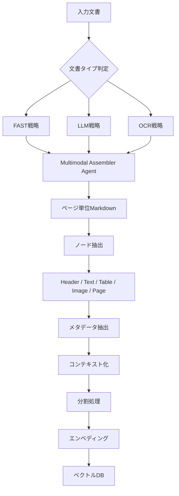
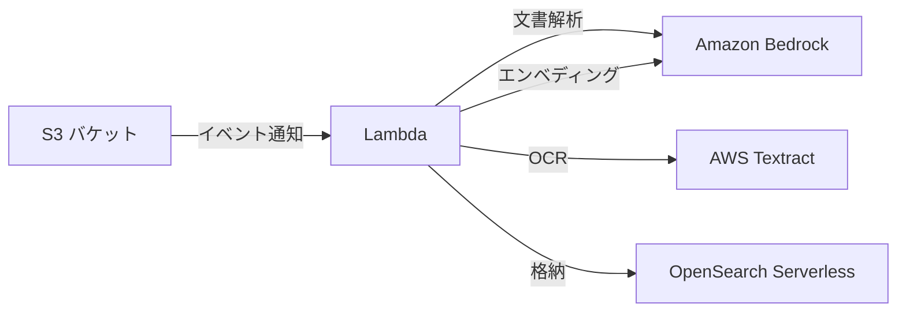

## 論文概要

本記事は [Advanced ingestion process powered by LLM parsing for RAG system (arXiv:2412.15262)](https://arxiv.org/abs/2412.15262) の解説記事です。Retrieval Augmented Generation（RAG）システムにおいて、多様な構造を持つマルチモーダル文書の処理は依然として大きな課題である。本論文では、LLMパワードOCRを用いたマルチストラテジーパーシング手法を提案し、プレゼンテーション資料やスキャン文書を含む多様な文書タイプからのコンテンツ抽出を実現する。ノードベースの抽出技術により情報間の関係性を構築し、コンテキスト認識型メタデータを生成することで、文書理解と検索能力を向上させている。

## 情報源

| 項目 | 内容 |
|------|------|
| arXiv ID | [2412.15262](https://arxiv.org/abs/2412.15262) |
| タイトル | Advanced ingestion process powered by LLM parsing for RAG system |
| 著者 | Arnau Perez, Xavier Vizcaino |
| 発表年 | 2024年12月 |
| ページ数 | 12ページ、3図 |
| ライセンス | CC-BY 4.0 |

## 背景と動機

RAGシステムの性能は、検索対象となる文書のインジェスション品質に大きく依存する。実運用環境では、以下のような多様な文書タイプを扱う必要がある。

- **学術論文PDF**: 2カラムレイアウト、数式、図表が混在
- **企業ドキュメント**: 画像が多く、テキスト量は比較的少ない
- **プレゼンテーション資料**: テキストと画像が混在し、構造が非定型
- **スキャン文書**: テキスト情報がラスタライズされており、OCRが必須

従来のRAGパイプラインでは、LlamaIndexの`SimpleDirectoryReader`のように、PDFからテキストを単純に抽出するアプローチが一般的であった。しかし、この方法では表構造の崩壊、画像内テキストの欠落、2カラム構造の誤認識といった問題が発生し、下流の検索精度が低下する。著者らは、文書タイプごとに最適なパーシング戦略を選択し、それらを統合する仕組みが不可欠であると指摘している。

## 主要な貢献

本論文の主要な貢献は以下の4点である。

1. **マルチストラテジーパーシング**: FAST・LLM・OCRの3つの相補的な解析戦略を組み合わせ、文書タイプに応じた最適な抽出を実現
2. **ノードベース階層構造**: 標準的なチャンキングを超えた、Header・Text・Table・Image・Pageの5種類のノードによる関係性追跡を実装
3. **コンテキスト認識型メタデータ抽出**: 表やヘッダーに対するサマリー生成と質問生成による、文脈を保持したメタデータの自動生成
4. **柔軟なエンベディング戦略**: コンテンツタイプに応じたエンベディング手法の切り替えにより、意味的な希釈を防止

## 技術的詳細

### 全体アーキテクチャ

本システムのインジェスションパイプラインは、**前処理（Pre-processing）**、**処理（Processing）**、**エンベディング（Embedding）** の3フェーズで構成される。



### 3つのパーシング戦略

著者らは、単一のパーシング手法では多様な文書タイプに対応できないという課題に対し、3つの相補的な戦略を提案している。

**FAST戦略**は、Pythonライブラリを用いてPDFからテキストと画像を直接抽出する。処理速度が速く、テキストが豊富な文書に適している。ただし、スキャンPDFのようにテキストがラスタライズされた文書では何も抽出できない。

**LLM戦略**は、マルチモーダルLLM（Claude Sonnet 3.5 v2）をOCRタスクに活用する。テキスト抽出に加え、表の内容理解や画像の説明文生成も行う。非テキスト画像（グラフ、図表）に対しては説明文を生成し、画像内に埋め込まれたテキストも抽出する。

**OCR戦略**は、AWS Textractを用いた専用OCRサービスである。スキャン文書に対して高精度なテキスト抽出を実現するが、2カラム構造の学術論文では水平方向にテキストを読み取ってしまうという制約がある。

各戦略の適用ロジックは文書タイプによって異なる。

| 文書タイプ | FAST | LLM | OCR | 理由 |
|-----------|------|-----|-----|------|
| スキャンPDF | × | ○ | ○ | FASTではテキスト抽出不可 |
| 学術論文（2カラム） | ○ | ○ | × | OCRは2カラム構造を誤認識 |
| プレゼンテーション | ○（画像） | ○（テキスト） | ○（テキスト） | 3戦略の併用が有効 |
| 企業ドキュメント | ○ | ○ | △ | 画像中心の場合はLLM重視 |

### Multimodal Assembler Agent

3つの戦略から得られた情報を統合するのが**Multimodal Assembler Agent**である。このエージェントは以下の3種類の入力を受け取る。

1. **ページスナップショット**: ページ全体の画像
2. **説明付き画像**: LLM戦略で生成された画像の説明文
3. **抽出テキスト**: FAST・OCR戦略で得られたテキスト

これらを統合し、ページごとの**Markdownファイル**を生成する。最終的にページ単位のMarkdownを結合して文書全体の構造化表現を得る。

### ノードベースの抽出と関係性

Assembler Agentが出力したMarkdownから、5種類のノードを抽出する。

- **Header**: セクション見出し。子ノードを持てる唯一のノードタイプで、階層構造の追跡を可能にする
- **Text**: 段落、文、リスト、箇条書き
- **Table**: 表構造のデータ
- **Image**: 視覚コンテンツと説明文
- **Page/Document**: 上位のコンテナノード

各ノード間には`next`、`previous`、`parent`、`child`の関係が定義される。著者らは、この関係性によってチャンキング時のコンテキスト喪失を防止し、検索時に関連ノードを辿ることが可能になると述べている。

### コンテキスト化と分割

**コンテキスト化**のステップでは、2つのエージェントが協調して動作する。

1. **Question Generator Agent**: TableノードとHeaderノードに対して、そのコンテンツで回答可能な質問を自動生成する
2. **Summary Generator Agent**: 同じくTableノードとHeaderノードに対して、コンテキスト認識型のサマリーを生成する

テキストノードがサイズ閾値を超える場合は、**Recursive Splitter**または**Semantic Splitter**で分割する。

### エンベディング戦略

ノードタイプごとに異なるエンベディング戦略を採用し、意味的な希釈（semantic dilution）を防止する。

| ノードタイプ | エンベディング対象 | 理由 |
|------------|-------------------|------|
| Text | テキスト本体 | 直接的な意味表現 |
| Image | 説明文 | 視覚情報のテキスト化 |
| Table | コンテキスト化された要約 | 表構造の意味的圧縮 |
| Header/Page | サマリー | 意味的希釈の防止 |
| Q&A | 質問文 | 質問ベースの検索対応 |

著者らは、ベクトルデータベースとしてPinecone（メタデータ上限40KB）とOpenSearch（ハイブリッド検索対応）を検討し、エンベディングモデルにはVoyage AIおよびCohere embed-multilingual-v3を使用している。

## 実装のポイント

本論文のアーキテクチャは、LlamaIndexの`IngestionPipeline`と組み合わせることで実運用に適用可能である。以下に主要な実装パターンを示す。

```python
from dataclasses import dataclass
from enum import Enum
from typing import Protocol


class ParseStrategy(Enum):
    """文書解析戦略の定義."""

    FAST = "fast"
    LLM = "llm"
    OCR = "ocr"


class DocumentParser(Protocol):
    """文書解析のプロトコル定義."""

    def parse(self, document: bytes) -> list[dict]:
        """文書をパースしてノードリストを返す."""
        ...


@dataclass
class DocumentNode:
    """論文で提案された5種類のノードを表現するデータクラス.

    Attributes:
        node_type: ノードの種類（Header, Text, Table, Image, Page）
        content: ノードの本文コンテンツ
        metadata: メタデータ辞書
        relationships: 他ノードとの関係性マップ
    """

    node_type: str
    content: str
    metadata: dict
    relationships: dict


def select_strategies(doc_type: str) -> list[ParseStrategy]:
    """文書タイプに応じたパーシング戦略を選択する.

    Args:
        doc_type: 文書タイプ（scanned_pdf, academic, presentation, corporate）

    Returns:
        適用すべきパーシング戦略のリスト

    """
    strategy_map: dict[str, list[ParseStrategy]] = {
        "scanned_pdf": [ParseStrategy.LLM, ParseStrategy.OCR],
        "academic": [ParseStrategy.FAST, ParseStrategy.LLM],
        "presentation": [
            ParseStrategy.FAST,
            ParseStrategy.LLM,
            ParseStrategy.OCR,
        ],
        "corporate": [ParseStrategy.FAST, ParseStrategy.LLM],
    }
    return strategy_map.get(doc_type, [ParseStrategy.FAST])
```

LlamaIndexの`IngestionPipeline`との統合においては、カスタム`TransformComponent`として各パーシング戦略を実装し、`NodeParser`をノードベース抽出に対応させることが現実的なアプローチとなる。`SimpleDirectoryReader`による単純なテキスト抽出と比較して、文書構造を保持した状態でのインジェスションが可能になる。

## 本番デプロイガイド

### アーキテクチャ規模別の構成

本論文のインジェスションパイプラインを本番環境にデプロイする場合、処理量に応じて3つの構成を検討する。

#### Small構成（月間100文書以下）

サーバーレスアーキテクチャでコストを最小化する構成である。



S3への文書アップロードをトリガーとしてLambda関数を起動し、Amazon Bedrockで LLM戦略（Claude Sonnet）、AWS TextractでOCR戦略を実行する。FAST戦略はLambda内のPythonライブラリで処理する。

```hcl
# Small構成: Lambda + Bedrock + S3
resource "aws_lambda_function" "ingestion" {
  function_name = "rag-ingestion-processor"
  runtime       = "python3.12"
  handler       = "handler.process_document"
  timeout       = 900
  memory_size   = 3008

  environment {
    variables = {
      BEDROCK_MODEL_ID    = "anthropic.claude-sonnet-4-20250514"
      OPENSEARCH_ENDPOINT = aws_opensearchserverless_collection.rag.endpoint
      EMBEDDING_MODEL_ID  = "cohere.embed-multilingual-v3"
    }
  }
}

resource "aws_s3_bucket_notification" "ingestion_trigger" {
  bucket = aws_s3_bucket.documents.id

  lambda_function {
    lambda_function_arn = aws_lambda_function.ingestion.arn
    events              = ["s3:ObjectCreated:*"]
    filter_prefix       = "uploads/"
    filter_suffix       = ".pdf"
  }
}

resource "aws_opensearchserverless_collection" "rag" {
  name = "rag-knowledge-base"
  type = "VECTORSEARCH"
}
```

#### Medium構成（月間1,000文書程度）

ECS Fargateによるコンテナベースの構成で、SQSによるキューイングで非同期処理を実現する。

```hcl
# Medium構成: ECS Fargate + SQS
resource "aws_ecs_service" "ingestion" {
  name            = "rag-ingestion"
  cluster         = aws_ecs_cluster.main.id
  task_definition = aws_ecs_task_definition.ingestion.arn
  desired_count   = 2
  launch_type     = "FARGATE"

  network_configuration {
    subnets         = var.private_subnets
    security_groups = [aws_security_group.ingestion.id]
  }
}

resource "aws_sqs_queue" "ingestion" {
  name                       = "rag-ingestion-queue"
  visibility_timeout_seconds = 1800
  message_retention_seconds  = 86400

  redrive_policy = jsonencode({
    deadLetterTargetArn = aws_sqs_queue.ingestion_dlq.arn
    maxReceiveCount     = 3
  })
}

resource "aws_sqs_queue" "ingestion_dlq" {
  name = "rag-ingestion-dlq"
}
```

#### Large構成（月間10,000文書以上）

EKS + Karpenterによる自動スケーリング構成で、大量文書の並列処理に対応する。

```hcl
# Large構成: EKS + Karpenter
resource "aws_eks_cluster" "ingestion" {
  name     = "rag-ingestion-cluster"
  role_arn = aws_iam_role.eks.arn
  version  = "1.31"

  vpc_config {
    subnet_ids = var.private_subnets
  }
}

resource "helm_release" "karpenter" {
  name       = "karpenter"
  repository = "oci://public.ecr.aws/karpenter"
  chart      = "karpenter"
  version    = "1.1.1"
  namespace  = "kube-system"

  set {
    name  = "settings.clusterName"
    value = aws_eks_cluster.ingestion.name
  }
}
```

Karpenter NodePoolの設定例を示す。GPU対応インスタンスを含めることで、エンベディング処理のローカル実行も可能にする。

```yaml
apiVersion: karpenter.sh/v1
kind: NodePool
metadata:
  name: ingestion-workers
spec:
  template:
    spec:
      requirements:
        - key: karpenter.k8s.aws/instance-family
          operator: In
          values: ["m7i", "c7i", "r7i"]
        - key: karpenter.k8s.aws/instance-size
          operator: In
          values: ["xlarge", "2xlarge", "4xlarge"]
        - key: kubernetes.io/arch
          operator: In
          values: ["amd64"]
      nodeClassRef:
        group: karpenter.k8s.aws
        kind: EC2NodeClass
        name: default
  limits:
    cpu: "128"
    memory: 512Gi
  disruption:
    consolidationPolicy: WhenEmptyOrUnderutilized
    consolidateAfter: 30s
```

### モニタリング

CloudWatchとX-Rayを組み合わせた監視体制を構築する。

```hcl
# CloudWatch ダッシュボードとアラーム
resource "aws_cloudwatch_metric_alarm" "ingestion_errors" {
  alarm_name          = "rag-ingestion-error-rate"
  comparison_operator = "GreaterThanThreshold"
  evaluation_periods  = 2
  metric_name         = "IngestionErrors"
  namespace           = "RAG/Ingestion"
  period              = 300
  statistic           = "Sum"
  threshold           = 5
  alarm_description   = "インジェスション処理のエラー率監視"
  alarm_actions       = [aws_sns_topic.alerts.arn]
}

resource "aws_cloudwatch_log_group" "ingestion" {
  name              = "/rag/ingestion"
  retention_in_days = 30
}
```

X-Rayによるトレーシングでは、各パーシング戦略の処理時間と、Assembler Agentの統合処理のレイテンシを個別に計測する。これにより、ボトルネックとなっている戦略の特定が可能になる。

```python
from aws_xray_sdk.core import xray_recorder


@xray_recorder.capture("parse_document")
def parse_with_strategy(
    document: bytes, strategy: ParseStrategy
) -> list[DocumentNode]:
    """X-Rayトレース付きの文書解析処理.

    Args:
        document: 入力文書のバイトデータ
        strategy: 使用するパーシング戦略

    Returns:
        抽出されたノードのリスト
    """
    subsegment = xray_recorder.current_subsegment()
    subsegment.put_annotation("strategy", strategy.value)
    # パーシング処理の実装
    ...
```

### コスト最適化チェックリスト

本番デプロイ時のコスト最適化項目を以下にまとめる。

**コンピュートリソース**:
- Lambda関数のメモリサイズを処理内容に応じて調整（FAST戦略: 512MB、LLM戦略: 3008MB）
- ECS/EKSのSpotインスタンス活用（インジェスションはリトライ可能なため適合）
- Karpenterの`consolidationPolicy`でアイドルノードを自動回収
- ARM64インスタンス（Graviton）の採用でコストを約20%削減

**LLM API呼び出し**:
- FAST戦略で十分な文書はLLM戦略をスキップし、API呼び出しを削減
- バッチ処理でAPI呼び出し回数を集約
- Bedrock Provisioned Throughputの検討（Large構成の場合）
- プロンプトキャッシュの活用でトークン消費を削減

**ストレージ**:
- S3 Intelligent-Tieringで処理済み文書のストレージコストを自動最適化
- OpenSearch Serverlessの OCU（OpenSearch Compute Unit）を最小構成から開始
- 中間生成物（Markdownファイル）のライフサイクルポリシー設定

**ネットワーク**:
- VPCエンドポイントでS3・Bedrock・Textractへの通信をプライベート化（NAT Gatewayコスト削減）
- リージョン内通信の徹底（クロスリージョン転送料金の回避）

**運用**:
- CloudWatch Logsの保持期間を適切に設定（30日以上は不要な場合が多い）
- X-Rayのサンプリングレートを本番環境では5-10%に設定
- DLQ（Dead Letter Queue）の定期的な確認と再処理の自動化
- タグベースのコスト配分で文書タイプ別のコスト可視化

## 実験結果

著者らは、3種類のナレッジベースを用いて提案手法の有効性を検証している。

1. **学術論文KB**: arXivの論文5件（テキスト密度が高い文書）
2. **企業ドキュメントKB**: 10件以上の企業資料（画像密度が高い文書）
3. **混合KB**: 10件の異なるトピック・フォーマットの混在文書

評価データセットはClaude Haiku 3.5を用いてページ数と同等数の質問・回答ペアを生成し、検索時には最大5ノードを取得してClaude Sonnet 3.5 v2で回答を生成、Llama 3.1 405B Instructで評価を行っている。

著者らは、**Answer Relevancy**（回答の関連性）と**Faithfulness**（情報の忠実性）において良好な性能を示したと報告している。一方で、**Contextual Relevancy**（文脈的関連性）は全テストケースで低い値にとどまっている。これは、検索された5ノードのうち80%以上がPageノードやHeaderノードであり、直接的な回答情報を含まないコンテキストが多く含まれることが原因と分析されている。

**Contextual Precision**（文脈的精度）は、トピックが均一な企業ドキュメントKBでは高い値を示す一方、混合KBでは低下する傾向が確認されている。著者らは、この問題に対してCohere等のリランカーモデルの導入が有効であると指摘している。

## 実運用への応用

本論文のアプローチをRAGシステムの実運用に適用する際の要点を整理する。

**段階的な導入**: まずFAST戦略のみで運用を開始し、処理品質が不足する文書タイプが特定された段階でLLM戦略やOCR戦略を追加する。全文書に対してLLM戦略を適用するとAPIコストが増大するため、文書タイプの自動分類と戦略ルーティングの実装が重要である。

**ノード階層の活用**: 検索結果として返されたノードの`parent`・`child`関係を辿ることで、回答に必要なコンテキストを動的に拡張できる。これは、固定サイズのチャンキングでは実現できない柔軟な検索を可能にする。

**制約事項への対応**: 著者らが指摘しているContextual Relevancyの低さに対しては、リランカーの導入に加えて、PageノードやHeaderノードの検索重みを調整するフィルタリング戦略が有効と考えられる。また、文書の更新や外部参照の処理に関する課題は、増分インジェスションの仕組みで対応する必要がある。

## 関連研究

文書パーシングの分野では、LlamaIndex社の**LlamaParse**がクラウドベースの文書解析サービスとして広く利用されている。表や画像を含む複雑なPDFに対応し、Markdownへの変換を提供する。**Unstructured**はオープンソースの文書処理ライブラリであり、多様なファイルフォーマットに対応したパーティショニング機能を持つ。IBM Researchの**Docling**は、科学論文に特化した文書理解ツールであり、レイアウト解析と構造化抽出に優れている。

チャンキング戦略に関しては、Semantic Splitter、Recursive Splitter、Hierarchical Splitterが広く研究されている。本論文のノードベースアプローチは、これらの戦略を補完する位置づけにある。また、Anthropicが提案したContextual Retrievalの手法や、Cohereのリランキングモデルとの組み合わせによる精度向上も関連する研究として言及されている。

## まとめと今後の展望

本論文は、RAGシステムのインジェスション品質を向上させるためのマルチストラテジーパーシングアーキテクチャを提案した。FAST・LLM・OCRの3戦略の相補的な活用と、ノードベースの階層構造による文書理解の改善は、実運用RAGシステムの構築における有用な知見を提供している。

一方で、Contextual Relevancyの低さやエンティティ間の概念リンクの課題は、今後の改善が必要な領域である。リランカーの統合、ノードフィルタリングの精緻化、そして増分インジェスションへの対応が今後の研究課題として挙げられる。LlamaIndexの`IngestionPipeline`と本論文の手法を組み合わせることで、`SimpleDirectoryReader`では対応できなかった複雑な文書構造への対応が可能になる点は、実務的に大きな価値がある。

## 参考文献

1. Perez, A., & Vizcaino, X. (2024). Advanced ingestion process powered by LLM parsing for RAG system. arXiv:2412.15262. [https://arxiv.org/abs/2412.15262](https://arxiv.org/abs/2412.15262)
2. Lewis, P., et al. (2020). Retrieval-Augmented Generation for Knowledge-Intensive NLP Tasks. NeurIPS 2020. arXiv:2005.11401.
3. Anthropic. (2024). Contextual Retrieval. [https://www.anthropic.com/news/contextual-retrieval](https://www.anthropic.com/news/contextual-retrieval)
4. LlamaIndex. LlamaParse Documentation. [https://docs.llamaindex.ai/en/stable/](https://docs.llamaindex.ai/en/stable/)
5. Unstructured. Open-Source Document Processing. [https://github.com/Unstructured-IO/unstructured](https://github.com/Unstructured-IO/unstructured)
6. IBM Research. Docling - Document Understanding. [https://github.com/DS4SD/docling](https://github.com/DS4SD/docling)
