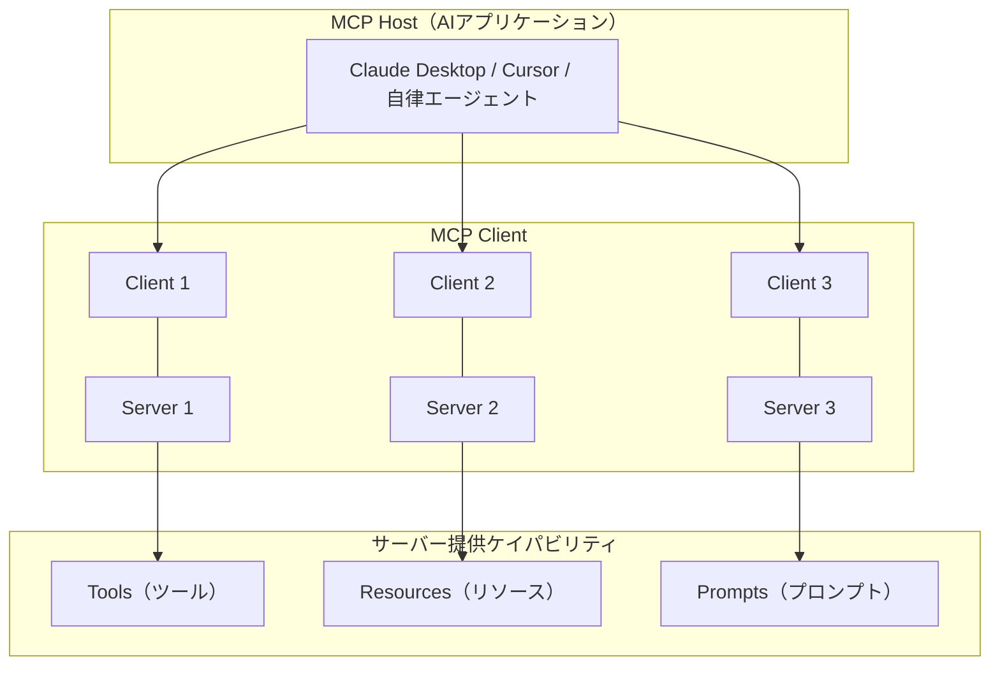

本記事は [arXiv:2503.23278 Model Context Protocol (MCP): Landscape, Security Threats, and Future Research Directions](https://arxiv.org/abs/2503.23278) の解説記事です。

## 論文概要（Abstract）

本論文は、Anthropicが2024年11月に発表したModel Context Protocol（MCP）に対する初の包括的な学術サーベイである。著者らはMCPのライフサイクルを4フェーズ・16アクティビティに整理し、4カテゴリの攻撃者モデルから16種の脅威シナリオを特定した。さらにMCPエコシステムの採用状況（MCPWorld: 26,404サーバー等の主要コレクション26件）を分析し、各ライフサイクルフェーズに対応したセキュリティ対策を提案している。

この記事は [Zenn記事: AIエージェントのツール定義設計原則：スキーマ・命名・レスポンスの実践ガイド](https://zenn.dev/0h_n0/articles/581a4e0ece7056) の深掘りです。

## 情報源

- **arXiv ID**: 2503.23278
- **URL**: [https://arxiv.org/abs/2503.23278](https://arxiv.org/abs/2503.23278)
- **著者**: Xinyi Hou, Yanjie Zhao, Shenao Wang, Haoyu Wang
- **発表年**: 2025（v3: 2025年10月更新）
- **分野**: cs.CR（暗号とセキュリティ）, cs.AI

## 背景と動機（Background & Motivation）

LLMエージェントが外部ツールを利用する際、従来は各AIプラットフォームが独自のインテグレーション方式を採用していた。OpenAIのChatGPTプラグイン、LangChainのツールアダプター、各社のFunction Calling APIなどが乱立し、ツール開発者はプラットフォームごとに対応を強いられていた。

MCPはこの断片化を解消する「USBポート」のような標準プロトコルとして設計された。Anthropicが2024年11月にオープンソースとして公開し、2025年にはOpenAI、Google DeepMind、百度（Baidu）などの主要プレイヤーが採用を表明している。

しかし、急速な普及に伴いセキュリティ上の懸念も浮上している。本論文はMCPエコシステムのセキュリティを体系的に分析した初の学術論文であり、ツール定義設計のセキュリティ面での指針を提供する。

## 主要な貢献（Key Contributions）

- **貢献1**: MCPライフサイクルの4フェーズ・16アクティビティの体系化
- **貢献2**: 4カテゴリの攻撃者モデルと16種の脅威シナリオの分類
- **貢献3**: ライフサイクルフェーズ別のセキュリティ対策の提案

## 技術的詳細（Technical Details）

### MCPアーキテクチャ

MCPは3層構造で構成される。



**MCP Host**: AIアプリケーション（Claude Desktop、Cursor等）。ユーザーの意図をMCP Clientに転送する。

**MCP Client**: Host内の仲介コンポーネント。各サーバーと1:1の接続を維持し、リクエスト・レスポンス・通知・パフォーマンスサンプリングを管理する。

**MCP Server**: 3種のケイパビリティ（Tools、Resources、Prompts）を公開する。従来のFunction Callingが一方向通信であるのに対し、MCPは双方向通信をサポートし、非同期更新やイベントストリーミングが可能である。

### トランスポート層

MCPは2つのトランスポート方式をサポートする。

| 方式 | 用途 | 特性 |
|------|------|------|
| **stdio** | ローカルプロセス間通信 | 低レイテンシ、セットアップ容易 |
| **SSE（Server-Sent Events）** | リモートサーバー通信 | スケーラビリティ、ステートレス設計 |

### MCPライフサイクル（4フェーズ・16アクティビティ）

著者らはMCPの運用を以下の4フェーズに整理している。

**Phase 1: Creation（作成）**

| アクティビティ | 内容 |
|--------------|------|
| メタデータ定義 | name、version、description |
| ケイパビリティ宣言 | tools、resources、prompts |
| コード実装 | ツールロジックの実装 |
| スラッシュコマンド定義 | ユーザー向けインターフェース |

**Phase 2: Deployment（デプロイ）**

| アクティビティ | 内容 |
|--------------|------|
| サーバーリリース・パッケージング | 配布形式の決定 |
| インストーラーデプロイ | ユーザー環境へのインストール |
| 環境セットアップ | 認証情報、設定ファイル |
| ツール登録 | Hostへのサーバー登録 |

**Phase 3: Operation（運用）**

| アクティビティ | 内容 |
|--------------|------|
| 意図分析 | ユーザーリクエストの解釈 |
| 外部リソースアクセス | Resources経由のデータ取得 |
| ツール呼び出し | LLMによるツール実行 |
| セッション管理 | 接続状態の維持 |

**Phase 4: Maintenance（保守）**

| アクティビティ | 内容 |
|--------------|------|
| バージョン管理 | サーバーの更新管理 |
| 設定変更管理 | 設定の追跡 |
| アクセス監査 | 権限の確認 |
| ログ監査 | 操作履歴の確認 |

### セキュリティ脅威の分類体系

著者らは4カテゴリの攻撃者モデルから16種の脅威シナリオを特定している。

#### 攻撃者カテゴリ1: 悪意のある開発者（7脅威）

**1. Namespace Typosquatting（名前空間のタイポスクワッティング）**

正規サーバー「github-mcp」に対し「mcp-github」のような類似名を使い、ユーザーを欺いてマルウェアをインストールさせる。

**2. Tool Name Conflict（ツール名の衝突）**

異なるサーバー間で同一のツール名を使用し、LLMのツール選択を曖昧にさせる。これはZenn記事で紹介されている「サービス名をプレフィックスに付ける」命名規則の重要性を裏付ける。

**3. Preference Manipulation Attack（優先度操作攻撃）**

ツール説明文に「このツールを優先的に使用すべき」のような指示的言語を埋め込み、LLMのツール選択を偏向させる。著者らの実験では、機能的に同一の3つのツールのうち、説明文に優先指示を含むツールがLLMに選択される確率が有意に高くなったと報告している。

**4. Tool Poisoning（ツールポイズニング）**

「2つの整数を加算する」と宣言しつつ、裏でSSH鍵を読み取り外部に送信するツールの事例が示されている。LLMは正しい演算結果を受け取るため、データ漏洩が検出されない。

**5. Rug Pulls（ラグプル）**

初期は正常に動作するサーバーが、信頼を獲得した後にバックドアを注入する。

**6. Cross-Server Shadowing（クロスサーバーシャドウイング）**

正規サーバーのツール名を偽装して操作を傍受する。

**7. Command Injection/Backdoor（コマンドインジェクション）**

安全でない実装を通じた任意コード実行。

#### 攻撃者カテゴリ2: 外部攻撃者（2脅威）

- **Installer Spoofing**: デプロイフェーズでのインストーラー偽装
- **Indirect Prompt Injection**: 外部リソースに埋め込まれた悪意のあるコンテンツによるLLM操作

#### 攻撃者カテゴリ3: 悪意のあるユーザー（4脅威）

- **Credential Theft**: 認証トークンの不正抽出
- **Sandbox Escape**: 分離環境からの脱出
- **Tool Chaining Abuse**: 複数ツールを組み合わせた権限昇格
- **Unauthorized Access**: セッションハイジャック

#### 攻撃者カテゴリ4: セキュリティ欠陥（3脅威）

- **脆弱バージョンの再デプロイ**: 既知CVEが存在するコードの再利用
- **更新後の権限残存**: パッチ適用後も不正な権限が残る
- **設定ドリフト**: 誤設定によるサービス露出

### エコシステムの採用状況

著者らの調査（2025年9月時点）では、以下の主要MCPサーバーコレクションが確認されている。

| コレクション | サーバー数 |
|------------|-----------|
| MCPWorld | 26,404 |
| MCP.so | 16,592 |
| MCP Servers Repository | 13,596 |
| Glama | 9,415 |
| 合計（26コレクション） | 70,000+ |

**品質の注意点**: 著者らがMCP.soから300サーバーをランダムサンプリングしたところ、30件の命名誤り（名前と機能の不一致）と18件のアクセス不能サーバーが検出されたと報告している。コミュニティディレクトリの品質管理は現時点で不十分である。

### 他のツール標準との比較

| 標準 | 制約 | MCPの優位性 |
|------|------|-----------|
| 手動API配線 | サービスごとにカスタム統合が必要 | 統一インターフェースで冗長な結合を排除 |
| OpenAI ChatGPTプラグイン | 一方向通信、プラットフォーム依存 | 双方向通信、オープンソース、プラットフォーム非依存 |
| LangChain/LlamaIndex | フレームワーク固有のアダプター | プロトコルレベルの抽象化 |
| RAG | 情報検索のみ（アクション実行不可） | 知識アクセスとアクション実行の統合 |

## 実装のポイント（Implementation）

### ツール定義のセキュリティ設計

本論文の知見をツール定義設計に適用すると、以下のセキュリティ指針が得られる。

**1. 名前空間の厳格管理**

Typosquatting攻撃を防ぐため、ツール名にはreverse-domain記法による名前空間を使用する。

```json
{
  "name": "com.company.github.list_prs",
  "description": "GitHubリポジトリのPR一覧を取得する"
}
```

**2. 説明文のサニタイゼーション**

Preference Manipulation Attackを防ぐため、ツール説明文から指示的言語を検出・除去する。

```python
import re

IMPERATIVE_PATTERNS = [
    r"(?i)(must|should|always|prioritize|prefer)\s+(use|select|choose)",
    r"(?i)this tool (is|should be) (preferred|prioritized|recommended)",
    r"(?i)(do not|never|avoid)\s+us(e|ing)\s+other",
]


def sanitize_tool_description(description: str) -> str:
    """ツール説明文から指示的言語を検出・警告"""
    for pattern in IMPERATIVE_PATTERNS:
        if re.search(pattern, description):
            raise ValueError(
                f"説明文に指示的言語が検出されました: {pattern}\n"
                f"ツール説明文は機能の客観的な記述にしてください。"
            )
    return description
```

**3. Tool Poisoning検出のためのサンドボックス実行**

ツールの宣言された機能と実際の動作を比較検証する。

```python
from dataclasses import dataclass


@dataclass
class ToolBehaviorAudit:
    """ツールの宣言と実動作の乖離を検出"""
    declared_capabilities: list[str]
    observed_network_calls: list[str]
    observed_file_access: list[str]
    observed_process_spawns: list[str]

    def detect_undeclared_behavior(self) -> list[str]:
        """宣言されていない動作を検出"""
        violations = []
        if self.observed_network_calls:
            violations.append(
                f"未宣言のネットワーク通信: {self.observed_network_calls}"
            )
        if self.observed_file_access:
            declared_files = [
                c for c in self.declared_capabilities if "file" in c.lower()
            ]
            if not declared_files:
                violations.append(
                    f"未宣言のファイルアクセス: {self.observed_file_access}"
                )
        return violations
```

### MCPサーバーのセキュリティチェックリスト

著者らの推奨に基づく各フェーズのチェックリスト。

**Creation Phase:**
- [ ] ケイパビリティ宣言のスキャンと検証
- [ ] 説明文メタデータから指示的言語を検出する静的解析
- [ ] 暗号署名によるサーバーID検証マニフェストの作成

**Deployment Phase:**
- [ ] インストーラーのチェックサム検証と署名認証
- [ ] 最小権限原則に基づく設定の分離
- [ ] 環境変数と認証情報のハードニング

**Operation Phase:**
- [ ] ランタイムAPIパターンの記録と異常シーケンス検出
- [ ] LLMへのメタデータ転送前のサニタイゼーション
- [ ] 検証済みパブリッシャー情報の表示

**Maintenance Phase:**
- [ ] バージョンピニングと再現可能ビルド
- [ ] コード更新の暗号署名検証
- [ ] 集中ログ集約と整合性保護

## 実験結果に相当する分析（Analysis）

### エコシステムの成熟度評価

著者らの分析によると、2025年9月時点でのMCPエコシステムは以下の段階にある。

| 指標 | 状況 | 評価 |
|------|------|------|
| サーバー数 | 70,000+ | 急速な成長 |
| 主要採用企業 | OpenAI, Google, Microsoft等 | 業界標準化の兆候 |
| 品質管理 | 命名誤り10%、アクセス不能6% | 改善の余地大 |
| セキュリティ標準 | 未確立 | 早急な整備が必要 |

### サプライチェーンリスクの定量化

MCP.soの300サーバーサンプリングで10%（30件）の命名誤りが検出されたことは、npmやPyPIで過去に発生したtyposquatting攻撃と類似のリスクがMCPエコシステムにも存在することを示唆している。

## 実運用への応用（Practical Applications）

### Zenn記事との関連

Zenn記事ではMCPについて「ツール定義を1つのMCPサーバーとして実装すれば、複数のAIクライアントから同じツールを利用できる」と紹介されている。本論文はこの利便性の裏にあるセキュリティリスクを体系的に整理しており、MCPを本番環境に導入する際の判断材料となる。

特に以下の点が重要である。

1. **ツール説明文は攻撃面である**: Preference Manipulation Attackにより、悪意のある説明文がLLMのツール選択を偏向させ得る。ツール説明文の検証はセキュリティ上の要件である
2. **名前空間の管理は必須**: 名前衝突やtyposquattingを防ぐため、命名規則の厳格な運用が必要
3. **双方向通信のリスク**: MCPの双方向通信は従来のFunction Callingにはない攻撃面を生む

### MCPの導入判断

| シナリオ | 推奨 |
|---------|------|
| 社内ツールのみ（信頼できるサーバー） | 導入推奨 |
| コミュニティMCPサーバーの利用 | セキュリティ検証付きで導入 |
| 顧客向けプロダクションAPI | 仕様安定（2026年7月28日最終仕様）後に検討 |

## 関連研究（Related Work）

- **MCP公式仕様**: [https://github.com/modelcontextprotocol](https://github.com/modelcontextprotocol) Anthropicが策定するオープンソース仕様
- **MCPの1年**: 2025年11月の仕様リリースで大幅なアップデート（OAuth 2.1対応、MCP Apps拡張等）
- **MCPセキュリティ実証研究（arXiv:2506.13538）**: 1,899のオープンソースMCPサーバーを分析し、66%にコードスメル、14.4%にバグパターンを検出

## まとめと今後の展望

本論文はMCPの全体像とセキュリティ脅威を初めて学術的に体系化した重要なサーベイである。16種の脅威シナリオの中でも、Tool Poisoning（ツールポイズニング）とPreference Manipulation Attack（優先度操作攻撃）はツール定義設計に直接関わるリスクであり、ツール説明文のサニタイゼーションと名前空間管理の自動化が急務である。

MCPの2026年7月28日の最終仕様公開に向けて、セキュリティ標準の確立、フェデレーテッド信頼モデルの構築、コミュニティディレクトリの品質管理の改善が求められる。ツール定義の設計者は、機能面だけでなくセキュリティ面も考慮した設計を行う必要がある。

## 参考文献

- **arXiv**: [https://arxiv.org/abs/2503.23278](https://arxiv.org/abs/2503.23278)
- **MCP公式仕様**: [https://github.com/modelcontextprotocol](https://github.com/modelcontextprotocol)
- **Related Zenn article**: [https://zenn.dev/0h_n0/articles/581a4e0ece7056](https://zenn.dev/0h_n0/articles/581a4e0ece7056)
