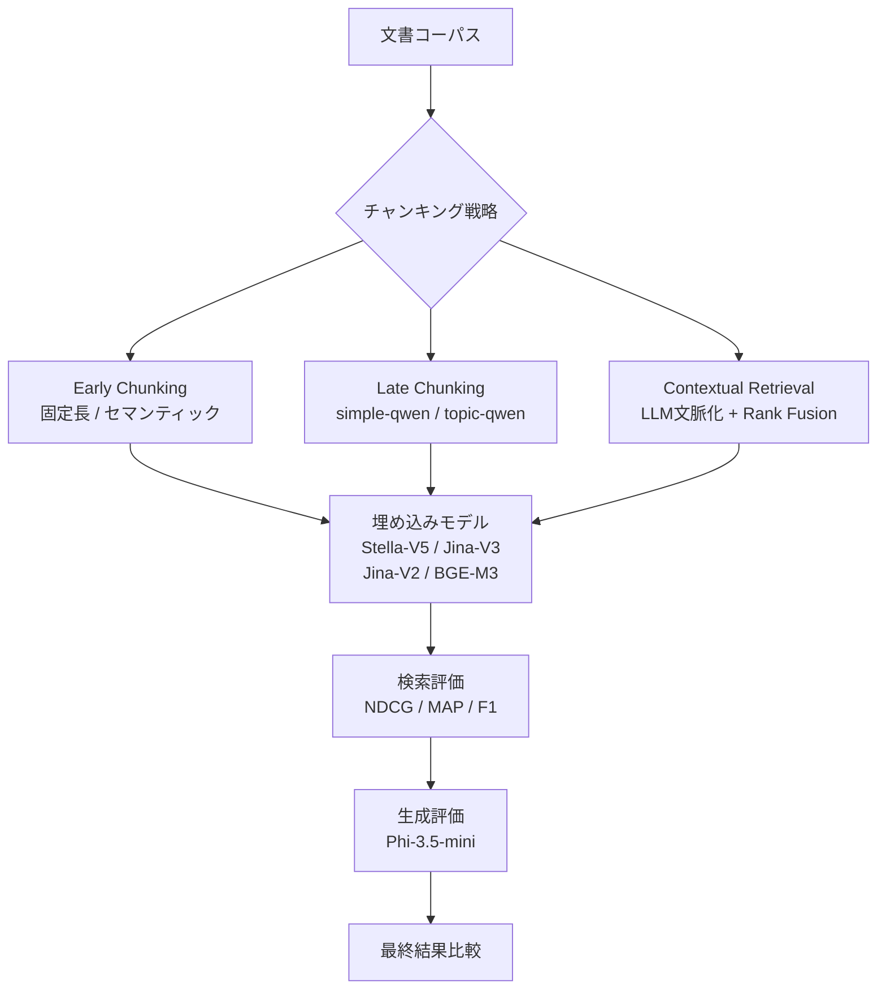
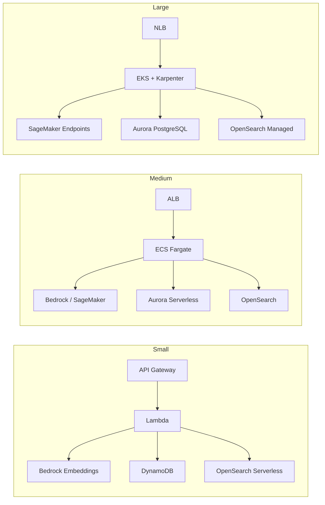

## 論文概要

本記事は [Reconstructing Context: Evaluating Advanced Chunking Strategies for Retrieval-Augmented Generation (arXiv:2504.19754)](https://arxiv.org/abs/2504.19754) の解説記事です。RAG（Retrieval-Augmented Generation）システムにおいて、文書をどのようにチャンクに分割するかは検索精度と生成品質に直結する重要な課題である。本論文はCarlo MerolaとJaspinder Singhにより、ECIR 2025併設ワークショップ（Second Workshop on Knowledge-Enhanced Information Retrieval）で発表された。従来の固定長チャンキングがもたらす文脈断裂の問題に対し、Late ChunkingとAnthropicのContextual Retrievalという2つの先進的手法を実証的に比較評価し、それぞれの強みと弱みを明らかにしている。

## 情報源

| 項目 | 内容 |
|------|------|
| arXiv ID | [2504.19754](https://arxiv.org/abs/2504.19754) |
| 著者 | Carlo Merola, Jaspinder Singh |
| 発表年 | 2025年4月 |
| 会議 | ECIR 2025 Workshop (Knowledge-Enhanced Information Retrieval) |
| 分野 | 情報検索 (cs.IR) |
| コード | [disi-unibo-nlp/rag-when-how-chunk](https://github.com/disi-unibo-nlp/rag-when-how-chunk)（MIT License） |

## 背景と動機

RAGシステムでは、大量の文書をLLMの入力トークン制限内で扱うために文書をチャンクに分割する必要がある。しかし、従来の固定長チャンキング（例: 512文字ごとの分割）は文脈を断片化し、不完全な情報検索を引き起こす。例えば「Transformerアーキテクチャの自己注意機構」について検索する際、関連する説明が複数チャンクに分断されると、検索結果が不完全になる。

この問題に対し、Late Chunking（埋め込み後に分割する手法）やContextual Retrieval（LLMによる文脈付与を行う手法）といった先進的アプローチが提案されてきた。しかし、これらの手法を同一条件下で厳密に比較した研究は限られていた。著者らは、複数の埋め込みモデルとデータセットを用いた体系的な比較評価を行うことで、実務者がチャンキング戦略を選定する際の実証的根拠を提供することを目指している。

関連するZenn記事「[LlamaIndex v0.14でRAGパイプラインを体系的に構築する実践ガイド](https://zenn.dev/0h_n0/articles/d70a46a75bdb5b)」では、SentenceSplitterやSemanticSplitterNodeParserを用いたチャンキング実装を解説しているが、本論文はそれらの手法選定に対する実験的裏付けを与えるものである。

## 主要な貢献

著者らの主要な貢献は以下の通りである。

- **体系的な比較評価フレームワークの構築**: Early Chunking（従来手法）、Late Chunking、Contextual Retrievalの3カテゴリを、複数の埋め込みモデル（4種）とデータセット（2種）にわたって統一的に評価
- **検索性能と生成性能の両面からの分析**: NDCG、MAP、F1といった検索指標に加え、生成出力の品質も評価対象に含めている
- **計算コストの定量化**: 各手法の処理時間とGPUメモリ使用量を記録し、精度と効率のトレードオフを明示
- **再現性の確保**: 全実験コードをMITライセンスで公開し、第三者による追試を可能にしている

## 技術的詳細

### 評価対象のチャンキング戦略

本論文で比較された手法は大きく3つのカテゴリに分類される。

**Early Chunking（従来手法）**: 文書を先にチャンクに分割してから、各チャンクを独立に埋め込みベクトルへ変換する。固定長分割（512文字単位）とセマンティック分割（Jina-Segmenter APIによる意味境界検出）の2方式が含まれる。各チャンクはトークン単位の埋め込みを平均プーリングで集約して単一のベクトル表現を得る。

**Late Chunking**: Early Chunkingとは逆の順序で処理する。まず文書全体をトークン単位で埋め込み、その後にチャンク境界で分割し、各セグメントに対して平均プーリングを適用する。この順序により、各チャンクの埋め込みが文書全体の文脈情報を保持する。動的分割モデルとして、文書構造ベースのsimple-qwen-0.5と、Chain-of-Thoughtによるトピック識別を行うtopic-qwen-0.5の2種類が検証されている。

**Contextual Retrieval（Rank Fusion付き）**: 3つの要素で構成される。(1) LLM（Phi-3.5-mini-instruct）が各チャンクに対して文書全体の文脈を要約した説明文を生成し、チャンク先頭に付加する（文脈化）。(2) 密ベクトル検索とBM25スパース検索を4:1の重み比率で融合する（Rank Fusion）。(3) クロスエンコーダ（Jina Reranker V2 Base）による再ランキングで最終的な検索結果を精緻化する。

### 評価パイプライン



### 使用した埋め込みモデル

著者らは以下の4つの埋め込みモデルを用いて評価を行っている。

| モデル | MTEBランク | パラメータ数 | メモリ使用量 | 埋め込み次元 | 最大トークン |
|--------|-----------|------------|------------|------------|------------|
| Stella-V5 | 5位 | 1,543M | 5.75 GB | 1,024 | 131,072 |
| Jina-V3 | 53位 | 572M | 2.13 GB | 1,024 | 8,194 |
| Jina-V2 | 123位 | 137M | 0.51 GB | 1,024 | 8,194 |
| BGE-M3 | 211位 | 567M | 2.11 GB | 1,024 | 8,192 |

Stella-V5はMTEBベンチマーク5位の高性能モデルであり、最大131,072トークンのロングコンテキスト対応が特徴である。一方、Jina-V2は137Mパラメータと軽量ながら十分な性能を発揮する。

### 評価指標

検索性能の評価に用いられた指標は以下の3つである。

- **NDCG（Normalized Discounted Cumulative Gain）**: ランキング品質を測定し、上位の位置ほど重視する。$k$位までの結果を対象とする場合、理想的なランキングに対する正規化された累積利得として計算される
- **MAP（Mean Average Precision）**: 各クエリに対する平均適合率の平均値。関連文書が上位に出現するほど高い値を示す
- **F1スコア**: 適合率（precision）と再現率（recall）の調和平均

### データセットと実験環境

著者らは2つのデータセットを使用している。

- **NFCorpus**: 栄養学・医学分野の文書コーパスで、文書の平均長が長いことが特徴。RQ1（Early vs. Late Chunking）では全データ（約5,000文書、1,000クエリ）、RQ2（Contextual Retrieval評価）ではGPUメモリ制約のため20%サブセット（約300文書、50クエリ）を使用
- **MSMarco**: Microsoft提供の大規模検索データセット。生成性能の評価に使用

実験環境はNvidia RTX 4090（24GB VRAM）上で、LLMにはMicrosoft Phi-3.5-mini-instruct（4ビット量子化）を使用している。

## 実装のポイント

本論文の知見をRAGシステムに適用する際の実装上のポイントを整理する。

**チャンキング戦略の選定基準**: 著者らは「固定長チャンキングとセマンティックチャンキングの性能差はほとんどないか、まったくない。一方で固定長チャンキングの方が実装が容易で処理が高速である」と報告している（論文Section 4.1）。したがって、まず固定長チャンキングをベースラインとして採用し、性能不足が確認された場合にのみ高度な手法を検討するのが合理的である。

**Rank Fusionの重み調整**: Contextual Retrievalにおける密ベクトルとBM25の融合比率は結果に大きく影響する。著者らは当初等重み（1:1）で実験したが性能が低下し、Anthropicの推奨に従って4:1（密ベクトル優位）に変更したところ改善が見られたと報告している。実装時にはこの比率をハイパーパラメータとして調整する必要がある。

**動的分割モデルの計算コスト**: topic-qwen-0.5による動的分割はNFCorpusに対して約120分を要し、固定長分割の約30分と比較して4倍の処理時間がかかる。バッチ処理パイプラインではこのオーバーヘッドを考慮した設計が求められる。

**LlamaIndexとの対応関係**: [関連Zenn記事](https://zenn.dev/0h_n0/articles/d70a46a75bdb5b)で解説しているLlamaIndexのSentenceSplitterは本論文の固定長チャンキングに、SemanticSplitterNodeParserはセマンティックチャンキングにそれぞれ対応する。本論文の結果を踏まえると、SentenceSplitterで十分な検索精度が得られるケースが多いことが示唆される。

## Production Deployment Guide

本論文の知見を本番環境に適用するためのAWSデプロイメントパターンを規模別に示す。

### デプロイメント規模別アーキテクチャ



#### Small構成（月額 $200-500）

文書数10,000件以下、QPS 10未満の小規模ユースケース向け。本論文の知見に基づき、固定長チャンキング＋密ベクトル検索のシンプルな構成を推奨する。

```hcl
# Terraform - Small構成: Lambda + Bedrock + OpenSearch Serverless
resource "aws_lambda_function" "chunking_processor" {
  function_name = "rag-chunking-processor"
  runtime       = "python3.12"
  handler       = "handler.process_document"
  timeout       = 300
  memory_size   = 1024

  environment {
    variables = {
      CHUNK_SIZE        = "512"
      CHUNK_OVERLAP     = "50"
      EMBEDDING_MODEL   = "amazon.titan-embed-text-v2:0"
      OPENSEARCH_ENDPOINT = aws_opensearchserverless_collection.rag.collection_endpoint
    }
  }
}

resource "aws_opensearchserverless_collection" "rag" {
  name = "rag-chunks"
  type = "VECTORSEARCH"
}

resource "aws_dynamodb_table" "chunk_metadata" {
  name         = "rag-chunk-metadata"
  billing_mode = "PAY_PER_REQUEST"
  hash_key     = "document_id"
  range_key    = "chunk_index"

  attribute {
    name = "document_id"
    type = "S"
  }

  attribute {
    name = "chunk_index"
    type = "N"
  }

  point_in_time_recovery {
    enabled = true
  }
}
```

#### Medium構成（月額 $1,000-3,000）

文書数100,000件程度、QPS 50未満の中規模ユースケース向け。Contextual RetrievalのRank Fusionを導入し、検索精度を向上させる。

```hcl
# Terraform - Medium構成: ECS Fargate + SageMaker
resource "aws_ecs_service" "rag_pipeline" {
  name            = "rag-chunking-service"
  cluster         = aws_ecs_cluster.main.id
  task_definition = aws_ecs_task_definition.rag_pipeline.arn
  desired_count   = 2
  launch_type     = "FARGATE"

  network_configuration {
    subnets          = var.private_subnets
    security_groups  = [aws_security_group.rag_service.id]
    assign_public_ip = false
  }
}

resource "aws_ecs_task_definition" "rag_pipeline" {
  family                   = "rag-pipeline"
  requires_compatibilities = ["FARGATE"]
  cpu                      = "2048"
  memory                   = "8192"
  network_mode             = "awsvpc"

  container_definitions = jsonencode([{
    name  = "chunking-worker"
    image = "${var.ecr_repo}:latest"
    environment = [
      { name = "CHUNK_STRATEGY", value = "contextual" },
      { name = "RANK_FUSION_DENSE_WEIGHT", value = "0.8" },
      { name = "RANK_FUSION_BM25_WEIGHT", value = "0.2" },
      { name = "RERANKER_ENABLED", value = "true" }
    ]
    logConfiguration = {
      logDriver = "awslogs"
      options = {
        "awslogs-group"  = "/ecs/rag-pipeline"
        "awslogs-region" = var.region
      }
    }
  }])
}
```

#### Large構成（月額 $5,000-15,000）

文書数1,000,000件以上、QPS 200以上の大規模ユースケース向け。EKS + Karpenterで自動スケーリングを行い、SageMakerエンドポイントで埋め込みモデルをホスティングする。

```hcl
# Terraform - Large構成: EKS + Karpenter + SageMaker
resource "aws_eks_cluster" "rag_cluster" {
  name     = "rag-production"
  role_arn = aws_iam_role.eks_cluster.arn
  version  = "1.31"

  vpc_config {
    subnet_ids              = var.private_subnets
    endpoint_private_access = true
    endpoint_public_access  = false
  }

  encryption_config {
    provider {
      key_arn = aws_kms_key.eks.arn
    }
    resources = ["secrets"]
  }
}

resource "aws_sagemaker_endpoint" "embedding_model" {
  name                 = "rag-embedding-endpoint"
  endpoint_config_name = aws_sagemaker_endpoint_configuration.embedding.name
}

resource "aws_sagemaker_endpoint_configuration" "embedding" {
  name = "rag-embedding-config"

  production_variants {
    variant_name           = "primary"
    model_name             = aws_sagemaker_model.stella_v5.name
    instance_type          = "ml.g5.2xlarge"
    initial_instance_count = 2

    managed_instance_scaling {
      status                 = "ENABLED"
      min_instance_count     = 1
      max_instance_count     = 8
    }
  }
}
```

### モニタリング構成

```hcl
# CloudWatch ダッシュボード + アラーム
resource "aws_cloudwatch_metric_alarm" "chunking_latency" {
  alarm_name          = "rag-chunking-p99-latency"
  comparison_operator = "GreaterThanThreshold"
  evaluation_periods  = 3
  metric_name         = "ChunkingLatencyP99"
  namespace           = "RAG/Pipeline"
  period              = 300
  statistic           = "p99"
  threshold           = 5000
  alarm_description   = "チャンキング処理のP99レイテンシが5秒を超過"
  alarm_actions       = [aws_sns_topic.alerts.arn]
}

resource "aws_cloudwatch_metric_alarm" "retrieval_quality" {
  alarm_name          = "rag-retrieval-ndcg-degradation"
  comparison_operator = "LessThanThreshold"
  evaluation_periods  = 5
  metric_name         = "RetrievalNDCG"
  namespace           = "RAG/Quality"
  period              = 3600
  statistic           = "Average"
  threshold           = 0.3
  alarm_description   = "検索品質(NDCG)が閾値を下回った"
  alarm_actions       = [aws_sns_topic.alerts.arn]
}
```

X-Rayによる分散トレーシングを有効化し、チャンキング・埋め込み・検索・生成の各フェーズのレイテンシを可視化する。Cost Explorerでタグベースのコスト配分を設定し、チャンキング戦略ごとのコスト比較を可能にする。

### コスト最適化チェックリスト

**インフラ最適化**:
- [ ] Savings Plans / Reserved Instancesの適用（SageMaker、OpenSearch）
- [ ] Karpenter Spot Instanceの活用（非リアルタイムバッチ処理）
- [ ] OpenSearch UltraWarmティアへの古いインデックス移行
- [ ] Lambda Provisioned Concurrencyの適正値設定
- [ ] S3 Intelligent-Tieringによる文書ストレージ最適化
- [ ] NAT Gatewayの統合（マルチAZ→シングルNAT検討）
- [ ] CloudFront経由のAPI Gatewayキャッシング

**チャンキング処理最適化**:
- [ ] 固定長チャンキングをデフォルトとして採用（論文の知見に基づく）
- [ ] バッチ埋め込みAPIの利用（リアルタイム処理比で60-80%コスト削減）
- [ ] 埋め込みモデルの量子化（Jina-V2: 0.51GB vs Stella-V5: 5.75GB）
- [ ] チャンク重複率の最適化（オーバーラップ削減で埋め込み回数低減）
- [ ] Contextual Retrievalは高品質要求時のみ限定的に適用

**データ最適化**:
- [ ] 重複文書の事前除去によるチャンク数削減
- [ ] インデックス圧縮（PQ / HNSW パラメータ調整）
- [ ] 不要なメタデータフィールドの除外
- [ ] TTLベースの古いチャンクの自動削除
- [ ] BM25インデックスのシャード数最適化

**運用最適化**:
- [ ] オフピーク時間帯のバッチ再インデックス実行
- [ ] 段階的デプロイメント（Canary）による品質劣化の早期検知
- [ ] Bedrock On-Demand vs Provisioned Throughputの使い分け
- [ ] CloudWatch Logs Insightsによるコスト異常検知クエリ設定
- [ ] 月次コストレビューの自動レポート生成（Cost Explorer API）

### セキュリティベストプラクティス

- **転送中の暗号化**: 全通信をTLS 1.2以上で暗号化。VPCエンドポイント経由でAWSサービスにアクセスし、インターネットゲートウェイを経由しない
- **保管中の暗号化**: OpenSearchドメイン、DynamoDBテーブル、S3バケットにKMSカスタマーマネージドキーを適用
- **IAM最小権限**: チャンキングワーカーには`bedrock:InvokeModel`と`opensearch:ESHttp*`のみ付与。`*`リソースを避け、ARNで明示的に指定
- **ネットワーク分離**: チャンキング処理はプライベートサブネットで実行。セキュリティグループでインバウンドを必要最小限に制限
- **監査ログ**: CloudTrail + VPC Flow Logsを有効化し、S3に90日以上保持
- **入力バリデーション**: アップロード文書のファイルサイズ上限（50MB）とMIMEタイプチェックを実施

## 実験結果

### RQ1: Early Chunking vs. Late Chunking

著者らはNFCorpusを用いてEarly ChunkingとLate Chunkingを比較している（論文Table 3）。Stella-V5では両手法の性能差はわずかであり、Early ChunkingのNDCG@5が0.443、Late Chunkingが0.445とほぼ同等である。Jina-V3ではLate Chunking（topic-qwen分割）がNDCG@5で0.383を記録し、Early Chunking（セマンティック分割）の0.377をわずかに上回った。

一方、BGE-M3ではLate Chunkingが著しく性能低下し、Early ChunkingのNDCG@5が0.246であるのに対し、Late Chunking（topic-qwen）は0.110にとどまった。著者らはこの不整合について、BGE-M3がLate Chunkingの前提とする長文脈処理に適していない可能性を指摘している。

MSMarcoデータセット（論文Table 4）では、Stella-V5のEarly ChunkingがNDCG@5で0.630を記録したのに対し、Late Chunkingは0.503に低下している。MSMarcoのパッセージは比較的短いため、Late Chunkingの文脈保持の利点が十分に発揮されなかったと著者らは分析している。

### RQ2: Contextual Retrieval vs. 従来手法

NFCorpusの20%サブセットを用いた評価（論文Table 2）では、Jina-V3による固定長文脈化チャンク＋Rank Fusion検索がNDCG@5で0.317、MAP@5で0.146を記録し、最も高い検索精度を示した。Jina-V2によるセマンティック文脈化チャンクもNDCG@5で0.297と良好な結果を得ている。

### Late Chunking vs. Contextual Retrieval の直接比較

論文Table 5では、Jina-V3を用いた両手法の直接比較が示されている。Contextual RetrievalのNDCG@5は0.317、Late Chunkingは0.309であり、Contextual Retrievalが全指標でわずかに上回った。ただし、著者らは生成品質について「検索手法間の生成性能差は、有意な差を評価するには不十分であった」と報告しており、検索精度の差が最終的な回答品質に直結するとは限らないことを示唆している。

## 実運用への応用

本論文の知見から、実運用RAGシステムの設計に以下の指針を導出できる。

**段階的な手法導入**: 固定長チャンキングとセマンティックチャンキングの性能差が小さいという結果は、まず固定長チャンキングで最小構成を構築し、検索品質のモニタリングに基づいて段階的に高度な手法を導入すべきことを示している。LlamaIndexのSentenceSplitterをベースラインとして採用し、品質が要件を満たさない場合にSemanticSplitterNodeParserやContextual Retrievalへの移行を検討するのが合理的である。

**埋め込みモデルの選定**: Stella-V5は最高精度を示したが、5.75GBのメモリ使用量と大きなモデルサイズを考慮すると、Jina-V3（2.13GB）がコストパフォーマンスの観点で優れた選択肢となる。BGE-M3はLate Chunkingとの相性が悪いため、Late Chunkingを採用する場合は避けるべきである。

**Rank Fusionの設計**: Contextual RetrievalにおけるRank Fusionの重み比率（密ベクトル:BM25 = 4:1）は、ドメインと文書特性に依存する。専門用語が多い医学・法律分野ではBM25の重みを高め（例: 3:1）、一般的な技術文書では4:1〜5:1を出発点とすることが推奨される。

**計算リソースの見積もり**: Contextual RetrievalのLLM文脈化処理は、長い文書に対して20GB近いVRAMを消費する。本番環境では文書長の上限設定やバッチ処理による分散が不可欠である。

## 関連研究

本論文は以下の先行研究を踏まえている。

- **Lewis et al. (2020)**: RAGの基礎フレームワークを提案し、密パッセージ検索と生成モデルの統合を実現した。本論文はその検索フェーズにおけるチャンキング最適化に焦点を当てている
- **Anthropic Contextual Retrieval (2024)**: Anthropicが提案したContextual Retrieval手法は、LLMによるチャンク文脈化とBM25/密ベクトルのRank Fusionを組み合わせた手法である。本論文はこの手法を独立に検証し、その有効性と計算コストを定量化している
- **Jina AI Late Chunking**: 埋め込みモデルの長文脈対応能力を活用し、文書全体を先に埋め込んでから分割するアプローチ。本論文はその効果がモデルとデータセットに依存することを明らかにした
- **Segment-then-Predict アプローチ**: 教師あり分割モデルによる動的チャンキング。本論文で使用されたsimple-qwen-0.5およびtopic-qwen-0.5がこのカテゴリに該当する

## まとめと今後の展望

本論文は、RAGシステムにおけるチャンキング戦略の選択が「万能な最適解」を持たないことを実証的に示した。Contextual Retrievalは検索精度でわずかに優位であるが、計算コストが大幅に高い。Late Chunkingは効率的だが、埋め込みモデルとの相性に依存し、一貫した優位性は示せなかった。固定長チャンキングとセマンティックチャンキングの性能差は小さく、実装容易性を考慮すると固定長が実用的な出発点となる。

著者らは今後の課題として、より多様なデータセットでの検証、大規模LLMを用いた文脈化の効果、および長文書に特化したチャンキング戦略の開発を挙げている。また、計算コスト制約の緩和（より大きなGPUメモリの活用）により、NFCorpus全体でのContextual Retrieval評価が可能になることも期待される。

## 参考文献

1. Carlo Merola, Jaspinder Singh. "Reconstructing Context: Evaluating Advanced Chunking Strategies for Retrieval-Augmented Generation." arXiv:2504.19754, April 2025. [https://arxiv.org/abs/2504.19754](https://arxiv.org/abs/2504.19754)
2. Patrick Lewis et al. "Retrieval-Augmented Generation for Knowledge-Intensive NLP Tasks." NeurIPS 2020.
3. Anthropic. "Introducing Contextual Retrieval." 2024. [https://www.anthropic.com/news/contextual-retrieval](https://www.anthropic.com/news/contextual-retrieval)
4. Jina AI. "Late Chunking in Long-Context Embedding Models." 2024.
5. Microsoft. "Phi-3 Technical Report." arXiv:2404.14219, 2024.
6. 関連Zenn記事: "LlamaIndex v0.14でRAGパイプラインを体系的に構築する実践ガイド." [https://zenn.dev/0h_n0/articles/d70a46a75bdb5b](https://zenn.dev/0h_n0/articles/d70a46a75bdb5b)
7. GitHub リポジトリ（実験コード）: [https://github.com/disi-unibo-nlp/rag-when-how-chunk](https://github.com/disi-unibo-nlp/rag-when-how-chunk)
