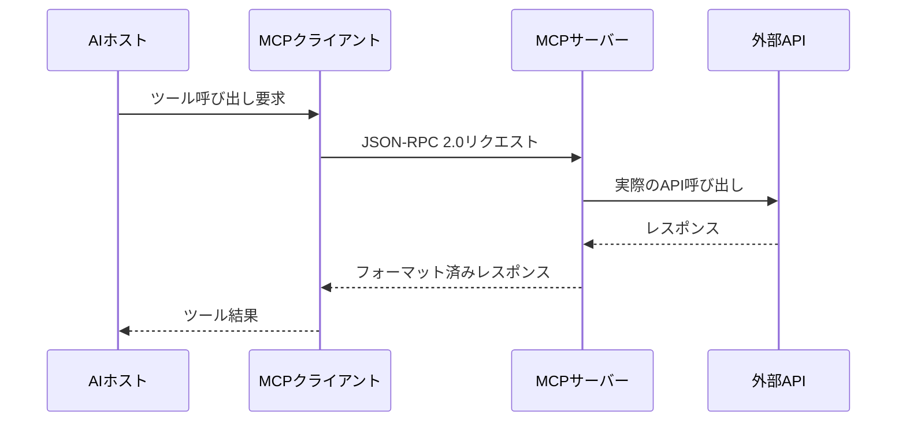

本記事は [Anthropicエンジニアリングブログ「Writing effective tools for AI agents」](https://www.anthropic.com/engineering/writing-tools-for-agents) の解説記事です。

## ブログ概要（Summary）

Anthropicは自社のエンジニアリングブログにおいて、AIエージェント向けツール設計の体系的なアプローチを公開した。このブログでは、ツールを「決定論的システムと非決定論的エージェントの間の新しいソフトウェア契約」と定義し、従来のAPI設計とは根本的に異なる設計原則が必要であると主張している。具体的には、5つの設計原則（選択的実装、名前空間戦略、意味のあるコンテキスト返却、トークン効率、説明文エンジニアリング）と、プロトタイプ構築・包括的評価・反復的最適化の3段階ワークフローを提示している。

この記事は [Zenn記事: AIエージェントのツール定義設計原則：スキーマ・命名・レスポンスの実践ガイド](https://zenn.dev/0h_n0/articles/581a4e0ece7056) の深掘りです。

## 情報源

- **種別**: 企業テックブログ
- **URL**: [https://www.anthropic.com/engineering/writing-tools-for-agents](https://www.anthropic.com/engineering/writing-tools-for-agents)
- **組織**: Anthropic（Claude開発元）
- **発表時期**: 2025年

## 技術的背景（Technical Background）

従来のソフトウェアにおけるAPI設計は、決定論的なクライアントが同じ入力に対して常に同じ呼び出しパターンを生成することを前提としていた。しかしLLMエージェントがツールの利用者となる場合、この前提は崩れる。エージェントは文脈に応じてツールを異なる方法で呼び出す可能性があり、パラメータの誤解やツール利用のハルシネーション（実在しないツールの呼び出し）が発生し得る。

この課題に対し、Anthropicは社内のMCPツール群（Slack連携、Asana連携など）の開発経験から得た知見を体系化した。同ブログの位置づけは、Anthropicが公式ドキュメント「[Define tools](https://platform.claude.com/docs/en/agents-and-tools/tool-use/define-tools)」で提供するAPI仕様レベルの情報を、実装者の視点から補完する実践的ガイドラインである。

学術的には、LLMのツール利用能力はReAct（Yao et al., 2022）やToolformer（Schick et al., 2023）以降急速に発展しており、近年はツール定義のフォーマットが性能に与える影響を実証的に分析する研究が増えている。本ブログはそうした学術的知見をプロダクション環境に橋渡しする資料として位置づけられる。

## 3段階ワークフロー（Three-Stage Workflow）

Anthropicはツール開発に以下の3段階を推奨している。


### 第1段階: プロトタイプ構築

Claude Codeなどのツールを活用し、LLMフレンドリーなドキュメント（`.llms.txt`ファイル等）を参照しながら素早い初期実装を行う。MCPサーバーとしてローカルで動作確認を行い、基本的な機能を検証する。

### 第2段階: 包括的評価

単純なサンドボックスシナリオではなく、複数のツール呼び出しを要する現実的なワークフローで評価タスクを設計する。ブログでは以下の複合タスクを例として挙げている。

- ドキュメント添付付きの会議スケジューリング
- 複数顧客にまたがる支払いログの分析
- 分散したデータソースからの顧客情報統合

各タスクには検証可能な期待結果を対応させ、以下のメトリクスを計測する。

| メトリクス | 観察ポイント |
|-----------|------------|
| 正確性（Accuracy） | ツール選択と引数生成の正しさ |
| 実行時間（Runtime） | エンドツーエンドの所要時間 |
| ツール呼び出し回数 | 冗長な呼び出しがないか |
| トークン消費量 | コンテキストの効率的利用 |
| エラー率 | パラメータエラー、ツール選択ミス |

### 第3段階: 反復的最適化

評価トランスクリプトをエージェント自身に分析させ、矛盾点、非効率性、混乱を招くスキーマを特定する。ブログでは特に「エージェントが明示的に指摘しない省略（omission）にこそ問題が潜む」と強調している。改善のたびにホールドアウトテストセットで過学習を防ぐ。

## 5つの設計原則（Five Core Principles）

### 原則1: 選択的ツール実装（Selective Tool Implementation）

少数の精緻なツールが、多数の重複するツールに勝るとブログは述べている。例として、`list_users`、`list_events`、`create_event`を別々に実装するのではなく、内部で空き状況確認を処理する単一の`schedule_event`ツールを構築するアプローチが推奨されている。

この原則の背景には、LLMのコンテキスト制約がある。エージェントに提示するツール定義はすべてコンテキストウィンドウを消費するため、ツール数の増加はLLMの推論精度とトークンコストの両方に悪影響を及ぼす。

```python
# 統合前: 3つの独立したツール
tools = [
    {"name": "list_users", "description": "ユーザー一覧を取得"},
    {"name": "list_events", "description": "イベント一覧を取得"},
    {"name": "create_event", "description": "イベントを作成"},
]

# 統合後: 1つの統合ツール
tools = [
    {
        "name": "schedule_event",
        "description": (
            "会議をスケジュールする。参加者の空き状況を自動確認し、"
            "全員が参加可能な時間帯にイベントを作成する。"
            "参加者のメールアドレスと希望時間帯を指定する。"
        ),
        "input_schema": {
            "type": "object",
            "properties": {
                "participants": {
                    "type": "array",
                    "items": {"type": "string"},
                    "description": "参加者のメールアドレス一覧",
                },
                "preferred_time": {
                    "type": "string",
                    "description": "希望時間帯（例: '来週月曜午前'）",
                },
                "duration_minutes": {
                    "type": "integer",
                    "description": "会議時間（分）。デフォルト: 30",
                },
            },
            "required": ["participants"],
        },
    }
]
```

### 原則2: 名前空間戦略（Namespacing Strategy）

ツール名にサービスベース（`asana_search`、`jira_search`）またはリソースベース（`asana_projects_search`）のプレフィックスを付与する。ブログによると、プレフィックスとサフィックスの命名選択がツール選択精度に「非自明な影響（non-trivial effects）」を与えることがテストで確認されている。

### 原則3: 意味のあるコンテキスト返却（Meaningful Context Returns）

技術的識別子（UUID、MIMEタイプ）を自然言語等価物（`name`、`file_type`）に置き換える。さらにオプションの`response_format`列挙パラメータにより「detailed」と「concise」の切り替えを可能にする。

ブログではSlackツールの事例が示されており、conciseレスポンスはdetailedの約3分の1のトークン数で済む（72トークン vs. 206トークン、約65%削減）と報告している。この削減はエージェントの多段階推論において累積的に効果を発揮する。

```python
from typing import Literal
from pydantic import BaseModel, Field


class SlackSearchParams(BaseModel):
    query: str = Field(description="検索キーワード")
    detail_level: Literal["concise", "detailed"] = Field(
        default="concise",
        description=(
            "concise: メッセージ本文のみ（72トークン/件）、"
            "detailed: 送信者・リアクション・スレッド情報を含む（206トークン/件）"
        ),
    )
    max_results: int = Field(
        default=5,
        description="取得件数の上限（1-20）",
        ge=1,
        le=20,
    )


def format_message_concise(msg: dict) -> dict:
    """conciseモード: 高信号フィールドのみ抽出"""
    return {
        "text": msg["text"],
        "channel": msg["channel"]["name"],
        "author": msg["user"]["real_name"],
        "ts": msg["ts"],
    }


def format_message_detailed(msg: dict) -> dict:
    """detailedモード: 全コンテキスト情報を含む"""
    return {
        "text": msg["text"],
        "channel": msg["channel"]["name"],
        "author": msg["user"]["real_name"],
        "ts": msg["ts"],
        "reactions": [r["name"] for r in msg.get("reactions", [])],
        "thread_reply_count": msg.get("reply_count", 0),
        "permalink": msg.get("permalink", ""),
        "attachments": [a["title"] for a in msg.get("attachments", [])],
    }
```

### 原則4: トークン効率（Token Efficiency）

ページネーション、フィルタリング、範囲選択、切り詰めにデフォルト値を設定する。ブログではClaude Codeがレスポンスを25,000トークンに制限していることを例示している。

エラーメッセージの設計も重要な要素として取り上げられている。暗号的なエラーコードではなく、エージェントが次のアクションを判断できるアクション指向のガイダンスを返す。

```python
def handle_search_error(query: str, error: Exception) -> dict:
    """エージェントが次のアクションを判断できるエラーレスポンス"""
    if isinstance(error, TooManyResultsError):
        return {
            "error": True,
            "message": f"検索結果が多すぎます（{error.count}件）",
            "suggestion": (
                "より具体的なキーワードで再検索してください。"
                "例: チャンネル名やユーザー名を追加"
            ),
            "example": f'{query} in:#engineering from:@alice',
        }
    return {
        "error": True,
        "message": str(error),
        "suggestion": "パラメータを確認して再試行してください。",
    }
```

### 原則5: 説明文エンジニアリング（Description Engineering）

ブログはツール説明文について「ツール性能に実質的な影響を与える（substantially impact performance）」と述べ、新しいチームメンバーに説明するように書くことを推奨している。暗黙のコンテキストを明示的にし、曖昧さを排除する（`user`ではなく`user_id`を使用）。

具体的な改善事例として、Claudeがウェブ検索ツールを使用する際にクエリに不必要に「2025」を付加してしまう問題が挙げられている。これはツール説明文の改善により解消された。このように小さな説明文の改善が「劇的な改善（dramatic improvements）」をもたらすと報告されている。

## 実装アーキテクチャ（Architecture）

### MCPサーバーとしてのツール提供

Anthropicはツールの提供形態としてMCP（Model Context Protocol）サーバーを推奨している。MCPサーバーは以下の3つのプリミティブで構成される。

| プリミティブ | 役割 | 例 |
|-------------|------|-----|
| Tools | LLMが呼び出す関数 | DBクエリ、メール送信 |
| Resources | 読み取り専用コンテキスト | ファイル内容、設定値 |
| Prompts | 再利用可能なテンプレート | コードレビュー手順 |

ツール定義はJSON Schemaベースの`inputSchema`として表現され、LLMは定義を読み取って呼び出し判断・引数生成を行う。



### 評価フレームワーク

ブログの評価アプローチは、従来のユニットテスト的な検証とは異なり、エンドツーエンドの複合タスクに焦点を当てている。

```python
from dataclasses import dataclass


@dataclass
class EvalTask:
    """評価タスクの定義"""
    description: str
    required_tools: list[str]
    expected_tool_calls: int
    verification_fn: callable
    max_tokens_budget: int


eval_tasks = [
    EvalTask(
        description="顧客Aの過去3ヶ月の支払いログを分析し、異常を報告",
        required_tools=["payment_search", "customer_lookup", "report_create"],
        expected_tool_calls=5,
        verification_fn=verify_payment_report,
        max_tokens_budget=10000,
    ),
]
```

## パフォーマンス最適化（Performance）

### レスポンスフォーマットの選択

ブログではレスポンスフォーマット（XML、JSON、Markdown）の選択がタスクとエージェントの訓練データパターンに依存すると述べ、普遍的な最適解は存在しないとしている。評価駆動での選択が重要であるという立場である。

### 実測されたトークン効率改善

| 最適化手法 | Before | After | 削減率 |
|-----------|--------|-------|--------|
| detail_level導入（Slack） | 206トークン/件 | 72トークン/件 | 約65% |
| Claude Codeレスポンス制限 | 制限なし | 25,000トークン上限 | 可変 |

ブログではこの65%削減を達成した`detail_level`パラメータの具体的な実装例が示されており、エージェントが最初にconciseで概要を把握し、必要に応じてdetailedで深掘りする2段階アプローチが有効であると報告している。

### 冗長呼び出しの検出パターン

ブログでは評価メトリクスの分析から以下のパターンを抽出している。

- **冗長なツール呼び出しが多い** → ページネーションやトークン制限パラメータの調整が必要
- **パラメータエラーが多い** → ツール説明文や入力例の充実が必要

## 運用での学び（Production Lessons）

### Slack MCPツールの改善事例

ブログによると、Slack MCPツールはClaude自身による最適化を経て大幅に改善された。Asana MCPツールも同様の反復プロセスで改善が確認されている。さらにClaude Sonnet 3.5はツール説明文の改善後にSWE-bench Verifiedでstate-of-the-artを達成したと報告されている。

### 暗黙知の明示化

エージェント向けツール設計で最も見落とされがちな問題は「暗黙知の省略」である。ブログでは以下の具体例を挙げている。

1. **パラメータの曖昧さ**: `user`フィールドがユーザーID、メールアドレス、表示名のいずれを期待するのか不明確
2. **フォーマットの暗黙的想定**: 日付形式がISO 8601なのかUnixタイムスタンプなのか未記載
3. **ドメイン固有の制約**: Slackチャンネル名に`#`プレフィックスが必要かどうか

これらはすべてツール説明文で明示する必要がある。

### エージェントフィードバックの分析

ブログはエージェント自身にトランスクリプトを分析させる手法を推奨しているが、重要な注意点を述べている。「エージェントが明示的に言及しないこと（omission）にこそ問題が潜む」という指摘であり、エージェントが回避しているツールや使用していないパラメータに着目することが改善の鍵となる。

## 学術研究との関連（Academic Connection）

本ブログの知見は以下の学術研究と関連している。

- **ReAct（Yao et al., 2022）**: LLMの推論とアクションを交互に行うフレームワーク。ブログの5原則はReActパターンでのツール定義最適化に直接適用可能
- **Toolformer（Schick et al., 2023）**: LLMが自律的にツール利用を学習。ブログの評価フレームワークはToolformer型エージェントの実環境評価に応用可能
- **ToolBench（Qin et al., 2024）**: 大規模ツール利用ベンチマーク。ブログの統合アプローチ（原則1）とToolBenchのマルチツール評価は相互補完的

ブログの「決定論的vs非決定論的」の枠組みは、従来のAPIデザイン原則（REST、gRPC等）とLLMエージェント向けツール設計の根本的な差異を明確にしている。

## まとめと実践への示唆

Anthropicの本ブログは、ツール設計を「エンジニアリング」として体系化した点に大きな価値がある。特に以下の3点が実務への重要な示唆を持つ。

1. **評価駆動アプローチ**: ツール定義の品質は主観的な「良い設計」ではなく、定量的な評価メトリクスで測定すべきである
2. **トークン効率のインパクト**: `detail_level`パラメータの導入という小さな変更が65%のトークン削減をもたらすことは、レスポンス設計の重要性を示している
3. **反復改善の仕組み**: エージェント自身によるトランスクリプト分析は、従来のQAプロセスでは捕捉できないツール設計上の問題を発見できる

ただし、本ブログはAnthropicの社内ツール群（主にClaude向け）での経験に基づいており、他のLLMプロバイダー（OpenAI、Google等）のモデルでの検証結果は含まれていない。また、ブログで示されたメトリクス改善の詳細な数値（Slack/Asana MCPツールの具体的な精度向上幅）は公開されておらず、定量的な再現は困難である。

## 参考文献

- **Blog URL**: [https://www.anthropic.com/engineering/writing-tools-for-agents](https://www.anthropic.com/engineering/writing-tools-for-agents)
- **Anthropic Define tools**: [https://platform.claude.com/docs/en/agents-and-tools/tool-use/define-tools](https://platform.claude.com/docs/en/agents-and-tools/tool-use/define-tools)
- **Related Zenn article**: [https://zenn.dev/0h_n0/articles/581a4e0ece7056](https://zenn.dev/0h_n0/articles/581a4e0ece7056)
