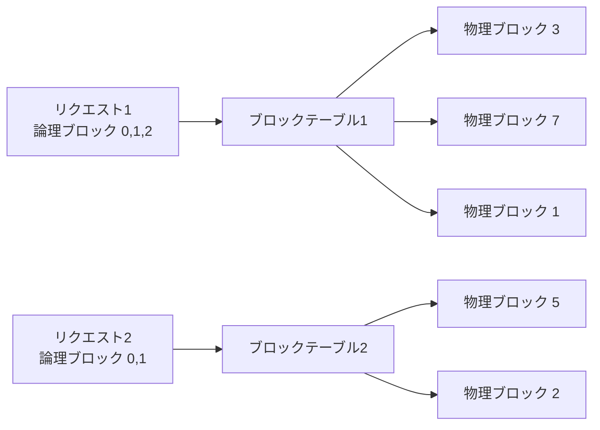

本記事は [arXiv:2309.06180 Efficient Memory Management for Large Language Model Serving with PagedAttention](https://arxiv.org/abs/2309.06180) の解説記事です。

## 論文概要（Abstract）

PagedAttentionは、OSの仮想メモリにおけるページング機構に着想を得たアテンションアルゴリズムであり、LLM推論時のKVキャッシュを固定サイズのブロックに分割して非連続メモリ上に格納する。著者らはこの手法をvLLMとして実装し、既存システムと比較して大幅なスループット改善を報告している。本論文はACM SOSP 2023に採択された。

この記事は [Zenn記事: Vertex AIでLLMを本番運用する：カスタムコンテナ・コスト最適化・オートスケーリング実践](https://zenn.dev/0h_n0/articles/318e7b40fcfa5a) の深掘りです。

## 情報源

- **会議名**: SOSP 2023（ACM SIGOPS 29th Symposium on Operating Systems Principles）
- **年**: 2023
- **URL**: [https://arxiv.org/abs/2309.06180](https://arxiv.org/abs/2309.06180)
- **著者**: Woosuk Kwon, Zhuohan Li, Siyuan Zhuang, Ying Sheng, Lianmin Zheng, Cody Hao Yu, Joseph E. Gonzalez, Hao Zhang, Ion Stoica（UC Berkeley）
- **コード**: [https://github.com/vllm-project/vllm](https://github.com/vllm-project/vllm)（Apache 2.0ライセンス）

## カンファレンス情報

SOSPはオペレーティングシステム分野の最高峰会議であり、1967年から続く歴史を持つ。採択率は通常15-20%程度と極めて競争的である。本論文がSOSPに採択されたことは、LLMサービングの問題がシステム研究コミュニティにおいても重要な課題として認識されていることを示している。

## 背景と動機（Background & Motivation）

LLM推論をバッチ処理で高速化するには、複数リクエストのKVキャッシュを同時にGPUメモリ上に保持する必要がある。しかし、著者らは既存システムにおいてKVキャッシュのメモリ管理に深刻な非効率性があることを指摘している。

著者らの分析（論文Section 3）によると、既存システムでは以下の3種類のメモリ浪費が発生している。

1. **内部フラグメンテーション**: 最大系列長分のメモリを事前確保するため、実際に使用されない部分が無駄になる
2. **外部フラグメンテーション**: リクエストごとに連続メモリ領域を確保するため、断片化が蓄積する
3. **予約による浪費**: 将来のトークン生成に備えてメモリを予約するが、実際には使われない場合がある

著者らの測定（論文Figure 3）では、既存システムにおいてKVキャッシュ用に確保されたメモリのうち**60-80%が実際には浪費**されていると報告されている。この浪費がバッチサイズの上限を制約し、GPUの演算リソースが十分に活用されない原因となっている。

## 主要な貢献（Key Contributions）

- **貢献1**: KVキャッシュをOSのページング機構に倣ってブロック単位で管理するPagedAttentionアルゴリズムの提案
- **貢献2**: PagedAttentionを実装したLLMサービングシステムvLLMの構築
- **貢献3**: copy-on-writeメカニズムによるKVキャッシュの効率的な共有（parallel sampling、beam search対応）

## 技術的詳細（Technical Details）

### PagedAttentionの原理

従来のAttentionでは、各リクエストのKVキャッシュが連続メモリ領域に格納される。PagedAttentionはこれを固定サイズの**ブロック**に分割し、非連続メモリ上に配置する。

各ブロックは$B$個のトークン分のKeyベクトルとValueベクトルを格納する。ブロックサイズ$B$はデフォルトで16トークンに設定されている。

Attentionの計算は以下のようにブロック単位で行われる。

$$
\text{Attention}(q, K, V) = \text{softmax}\left(\frac{qK^T}{\sqrt{d_k}}\right)V
$$

PagedAttentionでは、$K$と$V$がブロック$B_1, B_2, \ldots, B_n$に分割されているため、上式は以下のように分解される。

$$
A_i = \frac{q \cdot K_{B_i}^T}{\sqrt{d_k}}, \quad i = 1, \ldots, n
$$

$$
\text{output} = \sum_{i=1}^{n} \text{softmax}(A_i) \cdot V_{B_i}
$$

ここで、
- $q$: 現在のトークンのQueryベクトル（形状: $1 \times d_k$）
- $K_{B_i}$: ブロック$i$に格納されたKeyベクトル群（形状: $B \times d_k$）
- $V_{B_i}$: ブロック$i$に格納されたValueベクトル群（形状: $B \times d_v$）
- $d_k$: Keyの次元数
- $n$: 現在使用中のブロック数

実際の実装では、数値安定性のためにsoftmaxは各ブロックのmaxを追跡しながらオンラインで計算される。

### ブロックテーブルによる仮想メモリ管理

vLLMはOS仮想メモリと同様に、**論理ブロック**と**物理ブロック**の2層構造で管理を行う。



各リクエストは自身のブロックテーブルを持ち、論理ブロック番号から物理ブロック番号へのマッピングを管理する。新しいトークンが生成されると、最後のブロックに空きがあればそこに追記し、満杯であれば新しい物理ブロックをオンデマンドで割り当てる。

この設計により、以下の利点が得られる。

- **内部フラグメンテーションの解消**: 最後のブロックを除き、すべてのブロックが完全に使用される
- **外部フラグメンテーションの解消**: ブロックは非連続に配置できるため、断片化が発生しない
- **メモリの動的確保**: 事前に最大系列長分を確保する必要がない

### Copy-on-Writeによるキャッシュ共有

parallel sampling（同一プロンプトから複数の応答を生成）やbeam searchでは、リクエスト間でプロンプト部分のKVキャッシュを共有できる。著者らはOSのcopy-on-write機構を適用し、共有ブロックを参照カウントで管理する。分岐が発生した時点でブロックをコピーすることで、メモリ効率と正確性を両立している。

論文Table 3によると、parallel samplingにおいてcopy-on-writeを適用した場合、メモリ使用量が最大55%削減されると報告されている。

### スケジューリング: Continuous Batching

vLLMはiteration-levelスケジューリング（continuous batching）を採用している。従来のバッチ処理では、バッチ内の全リクエストが完了するまで新しいリクエストを追加できない。continuous batchingでは、各イテレーション（1トークン生成）ごとにリクエストの追加・除去を行う。

GPUメモリが不足した場合、vLLMは優先度の低いリクエストのKVキャッシュをCPUメモリにスワップアウトし、後から復帰させる**プリエンプティブスケジューリング**も実装している。

## 実装のポイント（Implementation）

vLLMのPagedAttentionカーネルはCUDAで実装されている。実装上の要点を以下に示す。

**カスタムCUDAカーネル**: ブロック単位のAttention計算はCUDAカーネルとして実装されており、各スレッドブロックが1つのKVキャッシュブロックの処理を担当する。物理ブロックアドレスの参照はブロックテーブルのルックアップで行うため、通常のAttentionカーネルと比較してオーバーヘッドは小さいと著者らは述べている。

**ブロックサイズの選択**: デフォルトのブロックサイズは16トークンである。著者らの実験（論文Figure 10）では、ブロックサイズが小さいほど内部フラグメンテーションが減少する一方、ブロックテーブルの管理コストが増加するトレードオフがあると報告されている。

**メモリプール**: 物理ブロックはサービス起動時に一括確保され、フリーリストで管理される。メモリ確保・解放のオーバーヘッドを回避するため、ブロックの生成・破棄ではなく、フリーリストの操作のみで管理される。

```python
# PagedAttentionの概念的な実装（簡略化）
def paged_attention(
    query: torch.Tensor,
    key_cache: torch.Tensor,
    value_cache: torch.Tensor,
    block_tables: torch.Tensor,
    context_lens: torch.Tensor,
    block_size: int = 16,
) -> torch.Tensor:
    """PagedAttention計算

    Args:
        query: (num_seqs, num_heads, head_size)
        key_cache: (num_blocks, num_heads, block_size, head_size)
        value_cache: (num_blocks, num_heads, block_size, head_size)
        block_tables: (num_seqs, max_num_blocks_per_seq)
        context_lens: (num_seqs,)
        block_size: ブロックあたりのトークン数

    Returns:
        output: (num_seqs, num_heads, head_size)
    """
    num_seqs = query.shape[0]
    output = torch.zeros_like(query)

    for seq_idx in range(num_seqs):
        ctx_len = context_lens[seq_idx]
        num_blocks = (ctx_len + block_size - 1) // block_size

        keys, values = [], []
        for block_idx in range(num_blocks):
            phys_block = block_tables[seq_idx, block_idx]
            keys.append(key_cache[phys_block])
            values.append(value_cache[phys_block])

        k = torch.cat(keys, dim=1)[:, :ctx_len]
        v = torch.cat(values, dim=1)[:, :ctx_len]

        scale = query.shape[-1] ** -0.5
        attn = torch.softmax(query[seq_idx] @ k.transpose(-1, -2) * scale, dim=-1)
        output[seq_idx] = attn @ v

    return output
```

## 実験結果（Results）

### スループット比較

著者らはOPT-13B、OPT-66B、OPT-175BおよびLLaMA-13BモデルをA100 80GB GPU上で評価している。評価にはShareGPTおよびAlpacaデータセットの実トレースが使用された。

論文Table 2およびFigure 8によると、vLLMの正規化スループットは以下のとおりである。

| モデル | データセット | vs HF Transformers | vs FasterTransformer | vs Orca |
|--------|------------|-------------------|---------------------|---------|
| OPT-13B | ShareGPT | 14.3-24.3倍 | 2.2-3.5倍 | 2.2倍 |
| OPT-66B | ShareGPT | — | 2.0-2.7倍 | 1.7-2.7倍 |
| OPT-175B | ShareGPT | — | — | 1.7-2.7倍 |
| LLaMA-13B | ShareGPT | — | — | 1.6-2.3倍 |

著者らの報告では、ShareGPTデータセット（出力長の分散が大きい）のほうがAlpacaデータセット（出力長が比較的均一）よりもvLLMの優位性が顕著であった。これは、出力長の分散が大きいほど従来手法のメモリ浪費が増大するためである。

### メモリ効率

論文Figure 9によると、vLLMのメモリ浪費率は4%未満に抑えられている。これは既存システムの60-80%と比較して大幅な改善である。この改善により、同一GPU上でより多くのリクエストを同時に処理でき、バッチサイズの拡大がスループット向上に直結している。

### Parallel Samplingでの効果

parallel sampling（1プロンプトから複数応答生成）では、copy-on-writeによるKVキャッシュ共有が効果を発揮する。論文Table 3によると、sampling数が増えるほどメモリ削減効果が大きくなり、sampling数6の場合にはメモリ使用量が約55%削減されたと報告されている。

## 実運用への応用（Practical Applications）

vLLMは論文発表後に急速に普及し、LLMサービングのデファクトスタンダードとなっている。Vertex AI、Amazon SageMaker、Azure ML等の主要クラウドプラットフォームがvLLMを推論エンジンとして採用している。

**Vertex AIとの関連**: Zenn記事で解説されているVertex AIのカスタムコンテナデプロイでは、vLLMのプリビルトDockerイメージが提供されている。`--gpu-memory-utilization`パラメータはvLLMの物理ブロック確保量を制御するものであり、PagedAttentionのブロックプールサイズに直接対応する。

**本番運用での考慮点**: PagedAttentionの恩恵は同時リクエスト数が多い場合に最大化される。単一リクエスト処理ではメモリ管理のオーバーヘッドが相対的に大きくなるため、バッチ処理環境で真価を発揮する。また、ブロックサイズの選択はモデルやワークロードに依存するため、本番デプロイ時にはベンチマークに基づく調整が推奨される。

## 関連研究（Related Work）

- **Orca (Yu et al., 2022)**: iteration-levelスケジューリング（continuous batching）を提案した先行研究。vLLMはOrcaのスケジューリング手法を採用しつつ、メモリ管理を改善している
- **FasterTransformer (NVIDIA)**: NVIDIAが開発した高速推論ライブラリ。カスタムCUDAカーネルによる高速化を行うが、メモリ管理は従来の連続割り当て方式を使用
- **FlashAttention (Dao et al., 2022)**: Attention計算自体のメモリ効率化（HBMアクセスの最適化）を行うカーネル。PagedAttentionとは直交する最適化であり、vLLMではFlashAttentionと併用可能

## まとめと今後の展望

PagedAttentionは、LLM推論のボトルネックであったKVキャッシュのメモリ管理を、OSの仮想メモリ技術をGPUメモリに適用するという着想で解決した。著者らの報告では、メモリ浪費率を60-80%から4%未満に削減し、スループットを最大24倍改善している。

vLLMは論文発表以降も活発に開発が続いており、Speculative Decoding、プレフィックスキャッシュ、tensor parallelism等の機能が追加されている。Vertex AIをはじめとするクラウドプラットフォームでの標準的な推論エンジンとして定着しており、本番LLMサービングにおける基盤技術となっている。

## 参考文献

- **Conference**: [ACM SOSP 2023](https://dl.acm.org/doi/10.1145/3600006.3613165)
- **arXiv**: [https://arxiv.org/abs/2309.06180](https://arxiv.org/abs/2309.06180)
- **Code**: [https://github.com/vllm-project/vllm](https://github.com/vllm-project/vllm)
- **Related Zenn article**: [https://zenn.dev/0h_n0/articles/318e7b40fcfa5a](https://zenn.dev/0h_n0/articles/318e7b40fcfa5a)

---

:::message
この記事はAI（Claude Code）により自動生成されました。内容の正確性については原論文に基づいて検証していますが、詳細は原論文もご確認ください。
:::
