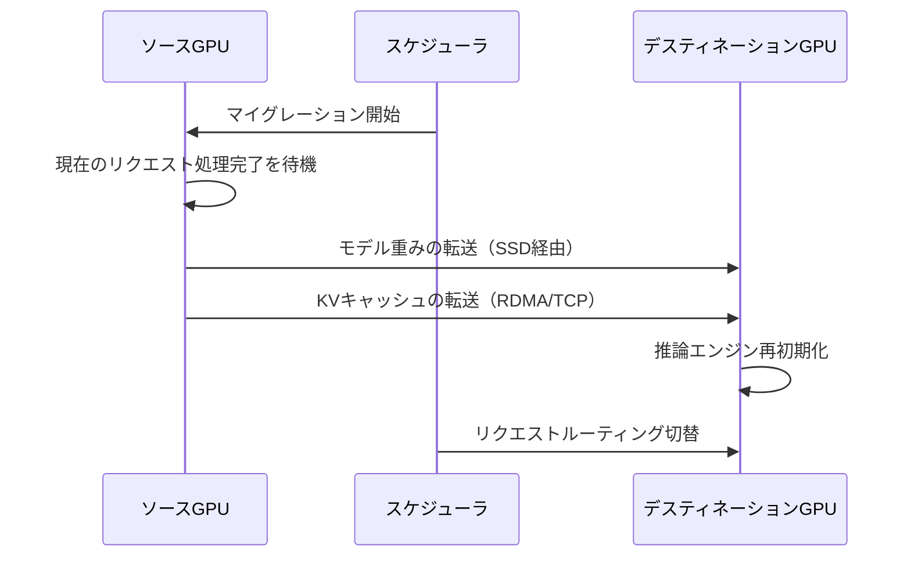

本記事は [arXiv:2406.03243 ServerlessLLM: Low-Latency Serverless Inference for Large Language Models](https://arxiv.org/abs/2406.03243) の解説記事です。

## 論文概要（Abstract）

ServerlessLLMは、サーバレス（scale-to-zero）環境でLLM推論を行う際のコールドスタート問題を解決するシステムである。著者らは3つの技術を提案している。(1) GPUローカルSSDからの並列ロードによる高速チェックポイントロード、(2) GPU間でのLLM推論インスタンスのライブマイグレーション、(3) データ局所性を活用したサーバレススケジューラ。著者らの報告では、既存手法と比較してコールドスタートレイテンシを最大6.5倍削減している。

この記事は [Zenn記事: Vertex AIでLLMを本番運用する：カスタムコンテナ・コスト最適化・オートスケーリング実践](https://zenn.dev/0h_n0/articles/318e7b40fcfa5a) の深掘りです。

## 情報源

- **arXiv ID**: 2406.03243
- **URL**: [https://arxiv.org/abs/2406.03243](https://arxiv.org/abs/2406.03243)
- **著者**: Yao Fu, Leyang Xue, Yeqi Huang, Andrei-Octavian Brabete, Dmitrii Ustiugov, Yuvraj Patel, Luo Mai（University of Edinburgh他）
- **発表年**: 2024
- **分野**: cs.DC, cs.AI, cs.LG
- **コード**: [https://github.com/ServerlessLLM/ServerlessLLM](https://github.com/ServerlessLLM/ServerlessLLM)（Apache 2.0ライセンス）

## 背景と動機（Background & Motivation）

サーバレスコンピューティングは従量課金モデルを提供し、トラフィックがない時間帯にはリソースをゼロまで縮退（scale-to-zero）させることでコストを削減できる。Vertex AIのScale-to-Zero機能（`min_replica_count=0`）やAmazon SageMakerの同等機能がこのモデルを採用している。

しかし、LLM推論をサーバレス環境に適用する際には、従来のWebアプリケーションとは異なるコールドスタートの課題がある。

1. **モデル重みのロード時間**: LLMのチェックポイントファイルは数十GBに達する。7Bモデルでも約14GB（bfloat16）、70Bモデルでは約140GBのデータをGPUメモリにロードする必要がある
2. **ストレージ帯域幅のボトルネック**: ネットワークストレージ（NFS/GCS/S3）からのロードでは帯域幅が制約となり、70Bモデルで数分のコールドスタートが発生する
3. **GPU在庫の不確実性**: scale-to-zeroからの復帰時に、要求するGPUタイプが利用可能である保証がない

著者らの調査では、既存のサーバレスフレームワーク（AWS Lambda、Google Cloud Functions等）はモデルロード最適化を考慮しておらず、LLM推論のコールドスタートは数十秒から数分に達すると報告している。

## 主要な貢献（Key Contributions）

- **貢献1**: チェックポイントのsequential tensor layoutとGPUローカルSSDからの並列ロードによる高速LLMロード機構
- **貢献2**: LLM推論インスタンスのKVキャッシュを含むライブマイグレーション機構
- **貢献3**: データ局所性を活用し、コールドスタートを予測的に回避するサーバレススケジューラ

## 技術的詳細（Technical Details）

### 高速LLMロード（Fast LLM Loading）

従来のチェックポイントロードでは、PyTorchの`torch.load()`がCPUメモリにデシリアライズし、その後GPUメモリに転送する2段階の処理を行う。ServerlessLLMはこのパイプラインを以下のように最適化している。

**Sequential Tensor Layout**: モデルの重みファイルをGPUメモリ上のレイアウトに合わせて事前に再配置する。従来のPyTorch pickleフォーマットではテンソルがランダムな順序で格納されるが、ServerlessLLMでは推論時のアクセスパターンに最適化された連続配置を行う。

$$
T_{\text{load}} = \frac{S_{\text{model}}}{B_{\text{SSD}} \times N_{\text{parallel}}} + T_{\text{init}}
$$

ここで、
- $T_{\text{load}}$: モデルロード時間
- $S_{\text{model}}$: モデルサイズ（バイト）
- $B_{\text{SSD}}$: SSD読み取り帯域幅（バイト/秒）
- $N_{\text{parallel}}$: 並列読み取りストリーム数
- $T_{\text{init}}$: 推論エンジン初期化時間

**GPUダイレクト転送**: NVMe SSDからGPUメモリへの転送にGPUDirect Storage（GDS）を利用し、CPUメモリを経由するオーバーヘッドを排除する。著者らの報告（論文Table 2）では、この最適化により70Bモデルのロードがネットワークストレージからの従来手法と比較して最大10倍高速化されている。

### ライブマイグレーション（Live Migration）

クラスタ内でGPUリソースの再配分が必要な場合（例: 高優先度リクエストの到着）、ServerlessLLMは実行中の推論インスタンスを別のGPUに移動できる。



マイグレーションのコストは、転送するKVキャッシュサイズに依存する。著者らの測定では、KVキャッシュサイズが小さい（短いコンテキスト）場合はマイグレーションオーバーヘッドが数秒以内に収まるが、長コンテキスト（数千トークン以上）ではKVキャッシュ転送がボトルネックとなり、マイグレーション時間が大幅に増加すると報告されている。

### 局所性駆動スケジューラ（Locality-Driven Scheduler）

ServerlessLLMのスケジューラは、各サーバのローカルSSDにキャッシュされたモデルチェックポイントの情報を追跡し、リクエストを可能な限り同じサーバに割り当てる。

スケジューリングアルゴリズムの概要は以下のとおりである。

```python
def schedule_request(
    request: InferenceRequest,
    servers: list[ServerState],
) -> str:
    """局所性を考慮したリクエストスケジューリング

    Args:
        request: 推論リクエスト（モデルID含む）
        servers: サーバ状態リスト

    Returns:
        割り当て先サーバID
    """
    model_id = request.model_id

    candidates_with_cache = [
        s for s in servers
        if model_id in s.local_ssd_cache and s.has_available_gpu()
    ]

    if candidates_with_cache:
        return min(candidates_with_cache, key=lambda s: s.gpu_utilization).id

    candidates_with_gpu = [s for s in servers if s.has_available_gpu()]
    if candidates_with_gpu:
        best = min(candidates_with_gpu, key=lambda s: s.gpu_utilization)
        best.preload_model(model_id)
        return best.id

    return trigger_scale_up(model_id)
```

このスケジューラにより、同じモデルへのリクエストが同一サーバに集中するため、SSDキャッシュのヒット率が向上し、コールドスタートの発生頻度が大幅に減少する。

## 実装のポイント（Implementation）

ServerlessLLMの実装はPythonベースであり、vLLMをバックエンドの推論エンジンとして使用している。

**チェックポイントの事前変換**: モデルをServerlessLLM形式に変換するプリプロセスステップが必要である。PyTorchチェックポイントをsequential tensor layoutに変換し、ローカルSSDに配置する。

**Kubernetes統合**: スケジューラはKubernetesオペレータとして実装されており、HPA（Horizontal Pod Autoscaler）との統合が可能である。scale-to-zeroの判定はカスタムメトリクスサーバから取得したリクエストレートに基づいて行われる。

**ストレージ階層**: モデルチェックポイントは3階層で管理される。
1. GPUメモリ（最速、ウォームスタート）
2. ローカルNVMe SSD（高速、ウォームコールドスタート）
3. ネットワークストレージ（低速、コールドスタート）

## 実験結果（Results）

### コールドスタートレイテンシ

著者らはA100 GPUクラスタを使用し、最大70Bパラメータのモデルでコールドスタートレイテンシを評価している。

論文Table 3およびFigure 7によると、ServerlessLLMのコールドスタートレイテンシは以下のとおりである。

| モデルサイズ | 従来手法（NFS） | ServerlessLLM（SSD） | 高速化比 |
|-----------|----------------|---------------------|---------|
| 7B | 約30秒 | 約5秒 | 6.0倍 |
| 13B | 約60秒 | 約10秒 | 6.0倍 |
| 70B | 約300秒 | 約46秒 | 6.5倍 |

### SLO達成率

Azure Functionsの実トレースパターンを使用したシミュレーションでは、ServerlessLLMは既存のサーバレスフレームワークと比較してSLO（Service Level Objective）違反率を大幅に削減したと報告されている。特に、リクエストの到着パターンにバースト性がある場合に、局所性スケジューラの効果が顕著であった。

### リソース効率

scale-to-zeroにより、トラフィックがゼロの時間帯にはGPUリソースを完全に解放できる。著者らの試算では、1日のうちトラフィックが存在する時間が50%の場合、常時稼働と比較してGPUコストを約50%削減可能であると述べている。ただし、コールドスタートのレイテンシがSLO要件を満たすことが前提条件である。

## 実運用への応用（Practical Applications）

### Vertex AIのScale-to-Zeroとの関連

Zenn記事で解説されているVertex AIのScale-to-Zero機能（`min_replica_count=0`）は、ServerlessLLMが解決を目指す問題と同一のドメインにある。Vertex AIでは以下のコールドスタート時間が目安として挙げられている。

| モデルサイズ | GPU | Vertex AIコールドスタート（目安） |
|-----------|-----|-------------------------------|
| 7B | L4 24GB | 30秒〜1分 |
| 13B | A100 40GB | 1分〜2分 |
| 70B | 4x A100 80GB | 3分〜5分 |

ServerlessLLMのローカルSSD活用とsequential tensor layout最適化は、これらのコールドスタート時間を大幅に短縮する可能性がある。ただし、Vertex AIのマネージド環境ではローカルSSDのカスタム配置やGPUDirect Storageの設定が制限される場合があり、そのまま適用するには追加の検討が必要である。

### 適用が有効な場面

- **開発・ステージング環境**: トラフィックが断続的で、コスト削減が重要
- **バッチ推論**: 定期的なバッチ処理の前にウォームアップ時間を確保できる
- **マルチモデル環境**: 低頻度アクセスのモデルをscale-to-zeroにし、高頻度モデルのみ常時稼働

### 適用が困難な場面

- **リアルタイムAPI**: P99レイテンシ要件が数秒以内の場合、コールドスタートが許容されない
- **予測不可能なバースト**: 突発的なトラフィック急増に対してコールドスタートが間に合わない

## 関連研究（Related Work）

- **vLLM (Kwon et al., SOSP 2023)**: ServerlessLLMのバックエンド推論エンジン。PagedAttentionによるメモリ効率化を提供するが、コールドスタート最適化は範囲外。ServerlessLLMはvLLMの上位レイヤとして位置付けられる
- **Llumnix (Sun et al., 2023)**: LLMクラスタの動的スケジューリングとライブマイグレーション。ServerlessLLMと類似のマイグレーション機構を持つが、サーバレス（scale-to-zero）は主眼としていない。Alibaba PAI発のOSSプロジェクトであり、Kubernetesオペレータとして実装されている点が共通
- **INFaaS (Romero et al., 2021)**: MLモデルの自動スケーリングフレームワーク。LLM特化ではなく汎用的なMLモデルを対象としており、モデルロード最適化が不十分
- **MuxServe (Bai et al., 2024)**: 複数LLMの空間的・時間的多重化。ServerlessLLMとは直交する最適化であり、組み合わせて使用可能。co-hosting環境でのscale-to-zeroにはServerlessLLMのコールドスタート最適化が有効

## まとめと今後の展望

ServerlessLLMは、サーバレスLLM推論のコールドスタート問題に対して、ストレージ最適化・ライブマイグレーション・局所性スケジューリングの3つの技術で取り組んでいる。著者らの報告では、最大6.5倍のコールドスタート高速化を達成している。

Vertex AIのScale-to-Zero機能を活用する上で、ServerlessLLMの知見は有用である。特に、GPUローカルストレージの活用とチェックポイントフォーマットの最適化は、コールドスタート時間の短縮に直接的に寄与する技術である。一方で、超長コンテキスト推論時のKVキャッシュマイグレーションコストや、マネージド環境での適用制約は今後の課題として残されている。

## 参考文献

- **arXiv**: [https://arxiv.org/abs/2406.03243](https://arxiv.org/abs/2406.03243)
- **Code**: [https://github.com/ServerlessLLM/ServerlessLLM](https://github.com/ServerlessLLM/ServerlessLLM)
- **Related Zenn article**: [https://zenn.dev/0h_n0/articles/318e7b40fcfa5a](https://zenn.dev/0h_n0/articles/318e7b40fcfa5a)

---

:::message
この記事はAI（Claude Code）により自動生成されました。内容の正確性については原論文に基づいて検証していますが、詳細は原論文もご確認ください。
:::
