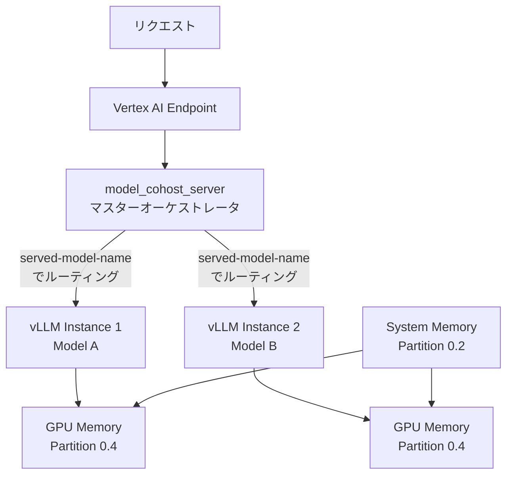

本記事は [Closing the efficiency gap in LLM serving with model co-hosting with Vertex AI](https://docs.cloud.google.com/vertex-ai/docs/blog/posts/closing-the-efficiency-gap-with-model-co-hosting) の解説記事です。

## ブログ概要（Summary）

Google Cloudのエンジニアリングチーム（Ivan Nardini, Kathy Yu, Jiuqiang Tang）が2026年3月に公開したこのブログ記事は、Vertex AI上で複数のLLMを1台のGPUノードに同居させるモデルco-hosting機能の技術的詳細とベンチマーク結果を報告している。8xH100ノードで8つの独立したvLLMインスタンスを起動した構成では、著者らは約7.8倍のスループット向上をほぼレイテンシ劣化なしで達成したと報告している。

この記事は [Zenn記事: Vertex AIでLLMを本番運用する：カスタムコンテナ・コスト最適化・オートスケーリング実践](https://zenn.dev/0h_n0/articles/318e7b40fcfa5a) の深掘りです。

## 情報源

- **種別**: 企業テックブログ（Google Cloud AI Engineering Blog）
- **URL**: [https://docs.cloud.google.com/vertex-ai/docs/blog/posts/closing-the-efficiency-gap-with-model-co-hosting](https://docs.cloud.google.com/vertex-ai/docs/blog/posts/closing-the-efficiency-gap-with-model-co-hosting)
- **組織**: Google Cloud AI Engineering Team
- **著者**: Ivan Nardini, Kathy Yu, Jiuqiang Tang（Editor: Elisa Bandy）
- **発表日**: 2026年3月19日

## 技術的背景（Technical Background）

### なぜモデルco-hostingが必要か

複数のLLMを運用する場合、モデルごとに個別のGPUエンドポイントを立てる構成が一般的であるが、この方式ではGPUリソースの利用効率が低下する。特に以下の状況で問題が顕在化する。

- **低～中トラフィックのモデルが複数存在**: 各モデルが専用GPUを占有するが、個々のGPU利用率は低い
- **異なるサイズのモデルを運用**: 7Bモデルに80GB GPUを専有させるのは過剰
- **GPU調達コストの高騰**: H100 80GBノード（8GPU）の時間単価は約$98/hであり、非効率な利用は直接的なコスト増につながる

モデルco-hostingは、1台のGPUノード上で複数のvLLMインスタンスを同時稼働させることで、ハードウェア利用効率を改善するアプローチである。

### 学術研究との関連

モデルco-hostingの基本的なアイデアは、GPU上でのワークロード多重化に関する研究に基づいている。MuxServe（2024年）は空間的・時間的多重化を組み合わせた手法を提案しており、NVIDIA MPSやMIGによるGPUリソース分割を利用する。Vertex AIのco-hosting実装はコンテナレベルのオーケストレーションアプローチを採用しており、MuxServeのようなプロセスレベル分割とは異なるが、複数LLMのGPU共有という目的は共通している。

## 実装アーキテクチャ（Architecture）

### コンテナレベルのオーケストレーション

ブログで報告されているco-hostingアーキテクチャは、以下の3層構造で構成されている。



1. **マスターオーケストレータ** (`model_cohost_server`): 単一コンテナ内で複数のvLLMサーバプロセスを管理
2. **インスタンスルーティング**: `--served-model-name`引数に基づいてリクエストを適切なvLLMインスタンスに振り分け
3. **GPUメモリパーティション**: `--gpu-memory-partitions`引数で各インスタンスへのメモリ割り当て比率を指定

### GPUメモリパーティショニングの設計

メモリは以下の2種類に分類される。

- **事前割り当てメモリ（pre-allocated memory）**: モデル重み、KVキャッシュなど、サービス起動時に確保される固定メモリ
- **一時メモリ（transient memory）**: 推論時の中間計算に使用される一時的なメモリ

ブログでは、パーティション比率の合計を1.0未満に設定し、一時メモリ用のバッファを確保することが推奨されている。例えば2モデル構成では`0.4, 0.4`（合計0.8）とし、残り0.2を一時メモリに充てる設計である。

## ベンチマーク結果（Performance）

### 単一モデルスケーリング

8xH100ノード上で単一モデルの構成を変更した場合のスループット比較が報告されている。

| 構成 | TP設定 | インスタンス数 | 特徴 |
|------|--------|--------------|------|
| TP=8, 1インスタンス | 8 | 1 | 個々のリクエスト応答速度を最速化 |
| TP=4, 2インスタンス | 4 | 2 | レイテンシとスループットのバランス |
| TP=2, 4インスタンス | 2 | 4 | スループット優先 |
| TP=1, 8インスタンス | 1 | 8 | GPU間通信排除、最大スループット |

TP=1×8インスタンス構成では、TP=8×1インスタンス構成と比較して**約7.8倍のスループット向上**が報告されている。これは、TPを下げることでGPU間通信（NVLink/NVSwitch）のオーバーヘッドが排除され、各GPUが独立して推論を処理できるためである。

### クロスオーバーポイント

TP設定の最適値は同時リクエスト数（並行度）に依存する。ブログでは「クロスオーバーポイント」として以下の傾向が報告されている。

- **低並行度（1-8リクエスト）**: TP=8が最適。単一リクエストの処理速度が重要であり、GPU間並列化のレイテンシ短縮効果が大きい
- **高並行度（1024+リクエスト）**: TP=1×8インスタンスが最適。GPU間通信がボトルネックとなり、独立インスタンスの方が総スループットが高い

Gemma 2 9B ITモデルでの検証では、並行リクエスト数が1024を超えるあたりでTP=1×8インスタンスがTP=8×1インスタンスを上回ったと報告されている。

### 異種モデル共存時の干渉測定

著者らはGemma-3n-E2B-itとLlama-3.1-8B-Instructを同一VM上に配置（各0.4 GPUメモリパーティション）した際の性能干渉を測定している。

| 構成 | Gemma-3n スループット | 変化率 |
|------|---------------------|--------|
| 単独デプロイ | 30.96 req/s | — |
| co-hosted（+ Llama-3.1-8B） | 30.21 req/s | **-2.4%** |

著者らの報告では、co-hosted構成でもスループット低下は約2.4%にとどまり、実用上の影響は小さいと結論している。

### テスト対象モデル

ブログでは以下のモデルが評価対象として挙げられている。

- Gemma 2 9B IT
- Gemma-3n-E2B-it
- Llama-3.1-8B-Instruct
- Llama 3.3
- Gemma 3
- Mistral 7B

## 動的モデル入替（ホットリロード）

co-hosting環境では、コンテナを再起動せずにモデルを動的に入れ替えるホットリロード機能が提供されている。GCS上のYAML設定ファイルを更新し、`update_models` APIを呼び出すことでモデルの追加・削除・入替が可能である。

```yaml
# gs://my-ml-models/cohost-config/models.yaml
models:
  - name: summarizer-7b
    path: gs://my-ml-models/models/summarizer-7b
    gpu_memory_fraction: 0.4
  - name: classifier-3b
    path: gs://my-ml-models/models/classifier-3b
    gpu_memory_fraction: 0.4
```

ブログによると、このAPIは既存リクエストの処理完了を待ってから新モデルをロードするグレースフルリロードを行う。ただし、TP設定やメモリパーティション比率を変更する場合はインスタンスの再作成が必要であると記載されている。

## 運用での学び（Production Lessons）

### メモリパーティション設計の注意点

- パーティション比率の合計を1.0にしないこと。一時メモリ用のバッファが不足し、CUDA OOMの原因となる
- モデルサイズに応じてパーティション比率を非対称に設定可能（例: 7Bモデルに0.3、13Bモデルに0.5）
- `--gpu-memory-utilization=0.90`と`--gpu-memory-partitions=0.4,0.4`は独立したパラメータであり、前者はvLLMインスタンス内のKVキャッシュ割り当て、後者はGPU間のメモリ分割を制御する

### Pod co-schedulingとの比較

ブログでは、Kubernetes Pod co-scheduling（別コンテナでモデルを動かし、同一ノードにスケジュール）との比較も行われている。著者らは以下の理由からコンテナレベルのアプローチを選択したと述べている。

- **異種モデルの柔軟性**: 異なるフレームワーク・設定のモデルを同一コンテナで管理可能
- **動的リロードの容易さ**: Pod再スケジュール不要でモデル入替可能
- **性能**: Pod co-scheduling方式と同等のスループットを維持

### 制約事項

- co-hostingは**シングルノード構成のみ対応**（マルチノードTP非対応）
- メモリパーティション比率は起動時に固定され、動的変更には再起動が必要
- 汎用的な最適構成は存在せず、ワークロード固有のベンチマークが必要

## 学術研究との関連（Academic Connection）

co-hostingのアプローチは以下の学術研究と関連が深い。

- **MuxServe (2024)**: GPU上での空間的・時間的多重化。NVIDIA MPS/MIGを利用したプロセスレベル分割を提案
- **AlpaServe (2023)**: 統計的多重化とモデル並列化によるGPUリソース共有
- **S-LoRA (2023)**: 多数のLoRAアダプタを効率的にサービングするシステム。共有ベースモデル上でアダプタを切り替える形のco-hosting

Vertex AIの実装はこれらの学術研究の知見を活かしつつ、コンテナレベルのオーケストレーションという実用的なアプローチを採用している点が特徴的である。

## まとめと実践への示唆

モデルco-hostingは、複数LLMを運用する環境においてGPU利用効率を大幅に改善する実用的な手法である。著者らの報告では、8xH100ノードでTP=1×8インスタンス構成にすることで約7.8倍のスループット向上が達成されている。また、異種モデル共存時の性能干渉は約2.4%と小さく、実用上許容可能な水準であると評価されている。

実践的には、まず単一モデルでTP設定ごとのスループット・レイテンシプロファイリングを実施し、ワークロードの並行度に応じたクロスオーバーポイントを特定することが推奨される。

## 参考文献

- **Blog URL**: [https://docs.cloud.google.com/vertex-ai/docs/blog/posts/closing-the-efficiency-gap-with-model-co-hosting](https://docs.cloud.google.com/vertex-ai/docs/blog/posts/closing-the-efficiency-gap-with-model-co-hosting)
- **Tutorial notebook**: [model_garden_model_cohost.ipynb](https://github.com/GoogleCloudPlatform/vertex-ai-samples/blob/main/notebooks/community/model_garden/model_garden_model_cohost.ipynb)
- **Related papers**: MuxServe ([arXiv:2401.02954](https://arxiv.org/abs/2401.02954)), S-LoRA ([arXiv:2310.11454](https://arxiv.org/abs/2310.11454))
- **Related Zenn article**: [https://zenn.dev/0h_n0/articles/318e7b40fcfa5a](https://zenn.dev/0h_n0/articles/318e7b40fcfa5a)

---

:::message
この記事はAI（Claude Code）により自動生成されました。内容の正確性については原ブログに基づいて検証していますが、詳細は原ブログもご確認ください。
:::
