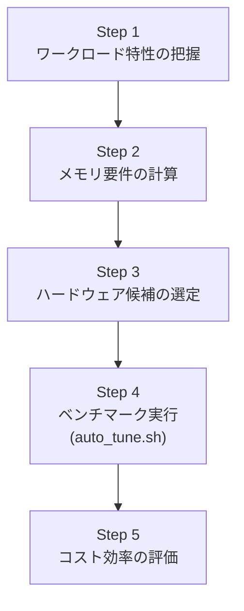

本記事は [vLLM Performance Tuning: The Ultimate Guide to xPU Inference Configuration](https://cloud.google.com/blog/topics/developers-practitioners/vllm-performance-tuning-the-ultimate-guide-to-xpu-inference-configuration) の解説記事です。

## ブログ概要（Summary）

Google CloudのField Solution ArchitectであるEric Hanleyらが2025年8月に公開したこのブログ記事は、vLLMの推論パフォーマンスを体系的にチューニングするための方法論を提示している。GPU（NVIDIA L4, A100, H100）とTPU（v5e, v6e/Trillium）の両方を対象に、Gemma-3-27b-itモデルを例として、ワークロード特性の把握からハードウェア選定、パラメータ最適化、コスト効率評価までの全工程を実測値とともに報告している。

この記事は [Zenn記事: Vertex AIでLLMを本番運用する：カスタムコンテナ・コスト最適化・オートスケーリング実践](https://zenn.dev/0h_n0/articles/318e7b40fcfa5a) の深掘りです。

## 情報源

- **種別**: 企業テックブログ（Google Cloud Blog）
- **URL**: [https://cloud.google.com/blog/topics/developers-practitioners/vllm-performance-tuning-the-ultimate-guide-to-xpu-inference-configuration](https://cloud.google.com/blog/topics/developers-practitioners/vllm-performance-tuning-the-ultimate-guide-to-xpu-inference-configuration)
- **組織**: Google Cloud
- **著者**: Eric Hanley（Field Solution Architect, AI Infrastructure）、Brittany Rockwell（Product Manager, AI and Computing）他
- **発表日**: 2025年8月26日

## 技術的背景（Technical Background）

vLLMは高スループットなLLM推論エンジンとして広く採用されているが、デフォルト設定のままで最適な性能が得られるとは限らない。推論パフォーマンスは以下の要因に依存する。

- **ハードウェア**: GPU/TPUの種類、メモリ容量、相互接続帯域幅
- **モデル**: パラメータ数、精度（bfloat16/int8等）、アーキテクチャ
- **ワークロード**: 入出力トークン長、リクエストレート、バッチパターン
- **vLLM設定**: gpu_memory_utilization、tensor_parallel_size、max_num_seqs等

ブログでは、これらの要因を体系的に分析し、最適な構成を特定するための5段階の方法論が提示されている。

## 実装アーキテクチャ（Architecture）

### 5段階チューニング方法論

ブログで提案されているチューニングプロセスは以下のとおりである。



**Step 1: ワークロード特性の把握**

以下のパラメータを事前に把握する必要がある。

| パラメータ | ブログの例 | 説明 |
|-----------|-----------|------|
| モデル | Gemma-3-27b-it | 27Bパラメータ、instruction-tuned |
| 精度 | bfloat16 | 1パラメータあたり2バイト |
| 入力トークン長 | 1,500 | 平均入力長 |
| 出力トークン長 | 200 | 平均出力長 |
| 最大系列長 | 2,000 | 入出力合計の上限 |
| 目標リクエストレート | 100 req/s | 全体の処理目標 |
| レイテンシ要件 | P99 E2E ≤ 10,000ms | 許容される最大レイテンシ |

**Step 2: メモリ要件の計算**

必要なGPU/TPUメモリは以下の式で計算される。

$$
M_{\text{total}} = M_{\text{model}} + M_{\text{KV}} + M_{\text{overhead}} + M_{\text{activation}}
$$

ここで、
- $M_{\text{model}} = P \times b$（$P$: パラメータ数、$b$: バイト/パラメータ。bfloat16で$b=2$）
- $M_{\text{KV}}$: KVキャッシュメモリ（バッチサイズとシーケンス長に依存）
- $M_{\text{overhead}} \approx 1\text{GB}$: PyTorch/CUDAランタイムオーバーヘッド
- $M_{\text{activation}}$: 中間活性化メモリ（ピーク値）

Gemma-3-27b-it（bfloat16）の場合:
- $M_{\text{model}} = 27 \times 10^9 \times 2 = 54\text{GB}$
- 最小構成で約57GBのvRAMが必要
- 単一80GB GPU（A100/H100）に収まるが、KVキャッシュを含めるとバッチサイズに制約

ブログでは、Google Colabで利用可能な[HBM Calculator](https://colab.research.google.com/github/ericehanley/rightsize-vllm/blob/main/HBM_Calculator.ipynb)が提供されており、具体的なメモリ要件を対話的に計算できる。

### 主要なvLLMパラメータ

ブログで取り上げられている主要パラメータとその影響を整理する。

**gpu_memory_utilization（0.0-1.0）**

vLLMがKVキャッシュに事前割り当てするGPUメモリの比率。デフォルトは0.90。

ブログでは以下のチューニング戦略が推奨されている。
- 初期値: 0.98から開始
- OOM発生時: 1%ずつ低減（0.97, 0.96, ...）
- 安定動作する最大値を採用

値を大きくするほどKVキャッシュ容量が増え、同時処理可能なリクエスト数が増加する。一方、値が大き過ぎるとCUDA OOMのリスクが高まる。

**tensor_parallel_size（TP）**

モデルをTPデバイスに分割するパラメータ。単一デバイスにモデルが収まる場合はTP=1が最もオーバーヘッドが小さい。TPを増やすと個々のリクエストのレイテンシは改善されるが、デバイス間通信のオーバーヘッドが発生する。

**max_num_seqs / max_num_batched_tokens**

同時処理するシーケンス数とバッチトークン数の上限。ブログの検証では以下の組み合わせがテストされている。

| max_num_seqs | max_num_batched_tokens | 特徴 |
|-------------|----------------------|------|
| 128 | 512 | 低レイテンシ重視 |
| 128 | 1024 | バランス型 |
| 256 | 512 | 高スループット |
| 256 | 2048 | 最大バッチ |

## ベンチマーク結果（Performance）

### GPU vs TPU比較

ブログでは、同一モデル（Gemma-3-27b-it）で複数のハードウェア構成を比較している。

**g2-standard-48（4x NVIDIA L4, 各24GB vRAM）**

| 設定 | リクエストレート | P99 E2E (ms) | スループット (req/s) |
|------|----------------|-------------|---------------------|
| seqs=256, tokens=512 | 6 | 7,612 | 4.17 |

TP=4が必要（単一L4では27Bモデルが収まらない）。

**TPU v6e-4（Trillium, 4チップ × 32GB HBM）**

| 設定 | リクエストレート | P99 E2E (ms) | スループット (req/s) |
|------|----------------|-------------|---------------------|
| seqs=128, tokens=512 | 9 | 8,549 | 5.59 |
| seqs=256, tokens=512 | 9 | 8,423 | **5.63** |
| seqs=256, tokens=1024 | 9 | 9,319 | 5.54 |
| seqs=256, tokens=2048 | 9 | 9,869 | 5.48 |

最適構成は `max_num_seqs=256, max_num_batched_tokens=512` であり、5.63 req/sのスループットをP99レイテンシ8,423msで達成している。

### コスト効率比較

ブログの報告によると、100 req/sの目標を達成するために必要なインスタンス数とコストは以下のとおりである。

**GPU構成（g2-standard-48）**:
- 単一インスタンススループット: 4.17 req/s
- 必要インスタンス数: $\lceil 100 / 4.17 \rceil = 24$台
- Spotインスタンス単価（2025年7月時点）: $2.25/h
- 月額コスト: $24 \times 2.25 \times 730 \approx \$39,420$

**TPU構成（v6e-4）**:
- 単一インスタンススループット: 5.63 req/s
- 必要インスタンス数: $\lceil 100 / 5.63 \rceil = 18$台
- Spotインスタンス単価（2025年7月時点）: $0.56 \times 4 = \$2.24$/h
- 月額コスト: $18 \times 2.24 \times 730 \approx \$29,434$

TPU v6e構成はGPU構成と比較して**月額約$10,000（約25%）のコスト削減**、**約1.82倍のコスト効率（req/s per $）**を達成したと報告されている。

### 自動チューニングスクリプト

ブログではvLLMリポジトリに含まれる`auto_tune.sh`スクリプトを使った自動ベンチマークが推奨されている。このスクリプトは以下の処理を自動化する。

1. `gpu_memory_utilization`を0.98から段階的に低減してOOMしない最大値を発見
2. `max_num_seqs`と`max_num_batched_tokens`の組み合わせを網羅的にテスト
3. 各組み合わせでリクエストレートを段階的に上げてスループットを測定
4. P99レイテンシが閾値以内で最大のスループットを報告

```bash
# auto_tune.shの設定例
MODEL="google/gemma-3-27b-it"
SYSTEM="TPU"          # GPU または TPU
TP=4                  # tensor parallel size
INPUT_LEN=1500        # 平均入力トークン数
OUTPUT_LEN=200        # 平均出力トークン数
MAX_MODEL_LEN=2000    # 最大系列長
MIN_CACHE_HIT_PCT=50  # プレフィックスキャッシュヒット率
MAX_LATENCY_ALLOWED_MS=10000  # P99レイテンシ上限
NUM_SEQS_LIST="128 256"
NUM_BATCHED_TOKENS_LIST="512 1024 2048"
```

## 運用での学び（Production Lessons）

### プレフィックスキャッシュの活用

ブログでは、プレフィックスキャッシュ（prefix caching）が重要な最適化として取り上げられている。多数のリクエストが同一のシステムプロンプトを共有する場合、その部分のKVキャッシュを再利用できる。

ブログのベンチマークでは50%のキャッシュヒット率が想定されている。ヒット率はアプリケーションのログから実測する必要があるとブログは述べている。

### OOMへの対処

ブログでは以下の段階的対処法が推奨されている。

1. `gpu_memory_utilization`を0.98から0.01ずつ低減
2. `max_num_seqs`を128に制限
3. `max_num_batched_tokens`を512に制限
4. 上記で解決しない場合はTP数を増やす（より多くのGPU/TPUを使用）

### TPUの注意点

TPU環境ではvLLMエンジンの初期起動に10分以上かかる場合があるとブログは報告している。これはJAX/XLAのコンパイルオーバーヘッドに起因する。auto_tune.shのタイムアウト値を30分に延長することが推奨されている。

## 学術研究との関連（Academic Connection）

ブログで使用されているvLLMの最適化技術は、以下の学術研究に基づいている。

- **PagedAttention (Kwon et al., SOSP 2023)**: vLLMの中核であるKVキャッシュのページング管理。gpu_memory_utilizationパラメータはPagedAttentionのブロックプールサイズに直接影響する
- **Continuous Batching (Yu et al., OSDI 2022)**: iteration-levelスケジューリング。max_num_seqsパラメータがバッチサイズの上限を決定する
- **Tensor Parallelism (Shoeybi et al., 2019)**: Megatron-LMで提案されたモデル並列化。TPパラメータがこの分割数に対応する

## まとめと実践への示唆

vLLMのパフォーマンスチューニングは、ワークロード特性の理解から始まり、メモリ計算、ハードウェア選定、自動ベンチマーク、コスト評価の5段階で体系的に行うことが推奨されている。特に重要な知見として、TPU v6e（Trillium）がGPU（L4）と比較して約1.82倍のコスト効率を示したことが挙げられる。

Vertex AIでのデプロイにおいても、vLLMのパラメータチューニングは推論パフォーマンスとコストに直結するため、本番デプロイ前にauto_tune.shを用いた構成最適化を実施することが推奨される。

## 参考文献

- **Blog URL**: [https://cloud.google.com/blog/topics/developers-practitioners/vllm-performance-tuning-the-ultimate-guide-to-xpu-inference-configuration](https://cloud.google.com/blog/topics/developers-practitioners/vllm-performance-tuning-the-ultimate-guide-to-xpu-inference-configuration)
- **Auto Tune Script**: [github.com/vllm-project/vllm/blob/main/benchmarks/auto_tune/README.md](https://github.com/vllm-project/vllm/blob/main/benchmarks/auto_tune/README.md)
- **HBM Calculator**: [HBM_Calculator.ipynb (Colab)](https://colab.research.google.com/github/ericehanley/rightsize-vllm/blob/main/HBM_Calculator.ipynb)
- **Related Zenn article**: [https://zenn.dev/0h_n0/articles/318e7b40fcfa5a](https://zenn.dev/0h_n0/articles/318e7b40fcfa5a)

---

:::message
この記事はAI（Claude Code）により自動生成されました。内容の正確性については原ブログに基づいて検証していますが、詳細は原ブログもご確認ください。
:::
