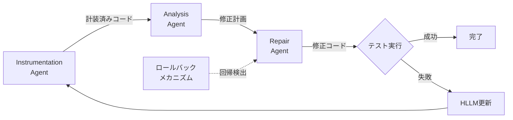

本記事は [TraceCoder: A Trace-Driven Multi-Agent Framework for Automated Debugging of LLM-Generated Code](https://arxiv.org/abs/2602.06875)（Huang et al., 2026）の解説記事です。ICSE 2026（2026年4月、リオデジャネイロ）で発表されました。

## 論文概要（Abstract）

LLMが生成するコードには、構文的には正しいが論理的に微妙なバグが含まれることがあります。従来のデバッグ手法は「テストが通ったか否か」というpass/fail信号のみに依存しており、バグの根本原因を捉えるには不十分でした。TraceCoderは、実行トレース（ランタイムの変数値・制御フロー）を活用した因果分析で根本原因を特定し、過去の修正失敗から学習する履歴学習メカニズム（HLLM）で反復的にコードを修正するマルチエージェントフレームワークです。著者らの報告によると、ClassEvalベンチマークで既存最良手法に対して34.43%の相対改善を達成しています。

この記事は [Zenn記事: LangSmithでLLMエージェントをデバッグする実践ガイド2026](https://zenn.dev/0h_n0/articles/969d91080115db) の深掘りです。LangSmithではエージェントの実行トレースを可視化してデバッグしますが、TraceCoderは「コード」の実行トレースを可視化して自動修正するアプローチを提案しており、トレース駆動型デバッグの原理を共有しています。

## 情報源

- **会議名**: ICSE 2026（International Conference on Software Engineering）
- **年**: 2026
- **URL**: [https://arxiv.org/abs/2602.06875](https://arxiv.org/abs/2602.06875)
- **著者**: Jiangping Huang, Wenguang Ye, Weisong Sun, Jian Zhang, Mingyue Zhang, Yang Liu
- **DOI**: 10.1145/3744916.3773187

## カンファレンス情報

ICSEはソフトウェアエンジニアリング分野の最高峰国際会議です。2026年は4月12-18日にブラジル・リオデジャネイロで開催されました。TraceCoderはLLMコード生成の品質向上という、ソフトウェアエンジニアリングとAIの交差領域に位置する研究です。

## 背景と動機（Background & Motivation）

LLMによるコード生成は急速に実用化が進んでいますが、生成コードの品質保証は未解決の課題です。著者らは従来手法の限界として以下を指摘しています：

1. **pass/fail信号の情報量不足**: テスト結果が「失敗」とわかっても、「なぜ失敗したか」がわからない
2. **反復修正の非効率性**: Self-Debuggingなどの既存手法は同じ修正を繰り返し試行し、効率が悪い
3. **修正の回帰リスク**: バグ修正が他の正しい部分を壊す「回帰バグ」が頻繁に発生する

## 主要な貢献（Key Contributions）

- **トレース駆動型デバッグ**: 実行トレース（変数値、制御フロー）の因果分析により、pass/failを超えた詳細な障害診断を実現
- **履歴学習メカニズム（HLLM）**: 過去の修正失敗を記録し、同じ誤りの繰り返しを防止
- **ロールバックメカニズム（RM）**: 修正の回帰を検出し、最良のコードバージョンに自動復帰
- **3エージェント協調アーキテクチャ**: 計装・分析・修正の各エージェントが専門化して協調動作

## 技術的詳細（Technical Details）

### 3エージェントアーキテクチャ

TraceCoderは3つの専門エージェントが順次動作するパイプラインです：



**Instrumentation Agent（計装エージェント）**: コードにprint文を挿入して実行時の変数値と制御フローを記録します。以下の4原則に従います：

1. **論理的分解**: コードを関数・分岐・ループの単位に分割
2. **状態・制御の追跡可能性**: 入出力と中間変数値をログ出力
3. **計装の純粋性**: 「非侵襲的なprint文のみを挿入し、計算ロジックは一切変更しない」
4. **可読性のある出力**: 下流の分析エージェントが解析しやすい構造化フォーマット

著者らの検証では、計装によるセマンティクス保持率は99.32-100%、CrossHairによる形式検証で97%以上の動作等価性が確認されたと報告されています。

**Analysis Agent（分析エージェント）**: 実行トレースデータを受け取り、因果分析を行います。2段階で動作します：

1. **診断と振り返り**: トレースデータと過去の修正履歴（HLLMレコード）を統合的に分析
2. **戦略策定**: 修正計画と次の計装提案の2つの出力を生成

**Repair Agent（修正エージェント）**: 分析エージェントの修正計画に基づいてコードを修正します。

### 履歴学習メカニズム（HLLM）

HLLMは3段階で動作します：

**Lesson Record（教訓記録）**: 失敗した修正試行の実行結果、修正計画、修正後コード、エラーフィードバック、テスト通過数を記録

**Lesson Feedback（教訓フィードバック）**: 分析エージェントが過去の失敗記録を参照し、同じ誤りを回避

**Lesson-Informed Deliberation（教訓に基づく審議）**: 3段階の推論プロセスで、(1)過去の修正がなぜ失敗したかを診断、(2)繰り返される落とし穴を要約、(3)過去の欠陥に対処する修正戦略を策定

### ロールバックメカニズム（RM）

RMは3つの状態変数を管理します：

- $\text{best\_code}$: 最もテスト通過数が多いコードバージョン
- $\text{prev\_pass\_count}$: 前回試行のテスト通過数
- $\text{stagnation\_counter}$: 連続非改善回数

$$
\text{action} = \begin{cases}
\text{promote} & \text{if } \text{pass\_count} > \text{best\_pass\_count} \\
\text{rollback} & \text{if } \text{pass\_count} \leq \text{prev\_pass\_count} \\
\text{terminate} & \text{if } \text{stagnation\_counter} > \text{patience}
\end{cases}
$$

## 実験結果（Results）

### メインの結果（論文 Table 1より）

著者らが報告するTraceCoder（Gemini-2.5-Flash使用時）の各ベンチマークでのPass@1精度：

| ベンチマーク | TraceCoder | 2位手法 | 相対改善 |
|------------|-----------|---------|---------|
| ClassEval | 82.00% | — | +34.43% |
| BigCodeBench-Complete | 89.04% | — | +14.05% |
| 全ベンチマーク平均 | 90.72% | — | +11.93% |

### アブレーション結果（論文 Table 2より）

BigCodeBench-CompleteにおけるTraceCoderの各コンポーネントの寄与：

| 構成 | Pass@1 | 低下幅 |
|------|--------|-------|
| フルTraceCoder | 89.04% | — |
| 反復修正なし | 53.77% | -35.27% |
| 計装なし | 78.51% | -10.53% |
| HLLM なし | 86.75% | -2.29% |
| ロールバックなし | 84.55% | -4.49% |

反復修正（Iterative Repair）が最大の寄与（65.61%の相対寄与）を示しており、計装による実行トレースの活用がその基盤となっています。

### コスト効率（論文 Table 4関連）

同一トークン予算での比較では：
- TraceCoder Pass@1 (82%) > CoT Pass@6 (55%)（ClassEval）
- TraceCoder Pass@1 (82%) > ベースライン Pass@15 (58%)（同一トークン予算）

著者らは、TraceCoderが「高コスト・高性能」のレジームで動作するが、ガイドなしのサンプリングと比較して大幅に効率的であると報告しています。

### エラー分析（論文 Table 7より）

BigCodeBenchサブセットでの失敗要因分析：

| 結果 | 割合 |
|------|------|
| Pass | 89.04% |
| Runtime Error | 4.23% |
| Wrong Answer | 6.34% |
| Time Limit Exceeded | 0.39% |

Wrong Answerが主要な失敗モードであり、論理バグの完全な排除には課題が残ると著者らは指摘しています。

## 実装のポイント（Implementation）

TraceCoderの計装手法は、LangSmithの`@traceable`デコレータと思想が共通しています。どちらも「既存コードにプローブを挿入して実行を記録する」アプローチです：

```python
def instrument_code(source_code: str) -> str:
    """コードに非侵襲的な計装を追加する

    TraceCoder方式: print文で変数値と制御フローを記録
    LangSmith方式: @traceableデコレータで入出力を記録

    Args:
        source_code: 計装対象のソースコード

    Returns:
        計装済みのソースコード
    """
    import ast
    tree = ast.parse(source_code)
    for node in ast.walk(tree):
        if isinstance(node, ast.FunctionDef):
            probe = ast.parse(
                f'print(f"[TRACE] {node.name} called")'
            ).body[0]
            node.body.insert(0, probe)
    return ast.unparse(tree)
```

**LangSmithとの接続ポイント**: TraceCoder的なコードトレースをLangSmithの実行トレースと統合することで、「エージェントのどのステップで」「生成されたコードのどの行が」問題だったかを一元的に分析可能になります。

## 実運用への応用（Practical Applications）

TraceCoderのアプローチは、LLMを活用したコード生成パイプラインの品質保証に適用できます：

1. **CI/CDパイプラインへの統合**: LLMが生成したコードに対してTraceCoderの計装→テスト→自動修正を適用し、品質ゲートとして機能させる
2. **コードレビューの自動化**: 修正の各イテレーションでHLLMが蓄積した「教訓」は、チーム共通のバグパターン知識として再利用可能
3. **LangSmithのコードエージェント監視**: LangGraphベースのコード生成エージェントのトレースにTraceCoder的な実行トレースを統合し、コード品質の劣化を早期検出

ただし、著者らが指摘する制約として、計装のオーバーヘッド（特にI/O集約型コード）と、外部依存のモック化の必要性があります。

## 関連研究（Related Work）

- **Self-Debugging**（Chen et al., 2024）: テスト結果のみを用いた反復修正。TraceCoderとの違いは、実行トレースという追加情報源を持たない点。Self-Debuggingの修正は同じ誤りを繰り返しやすい
- **INTERVENOR**（Wang et al., 2024）: 教師-生徒フレームワークによるデュアルエージェント修正。TraceCoderはさらに計装エージェントを追加した3エージェント構成で、より詳細な障害診断を実現
- **DoVer**（Ma et al., 2025）: マルチエージェントの介入駆動型デバッグ。DoVerがエージェント間メッセージに介入するのに対し、TraceCoderはコードの実行トレースに介入する点で補完的

## まとめと今後の展望

TraceCoderは、「pass/failを超えた実行トレースの活用」「過去の失敗からの学習（HLLM）」「修正の回帰防止（ロールバック）」の3つの仕組みにより、LLM生成コードの自動デバッグ精度を大幅に向上させています。ClassEvalで34.43%の相対改善、BigCodeBenchで14.05%の相対改善という結果は、トレース駆動型アプローチの有効性を示しています。

LangSmithのトレース可視化とTraceCoderのコードトレース分析を組み合わせることで、「エージェントレベルの障害特定」と「コードレベルのバグ修正」を統合した包括的なデバッグパイプラインの構築が期待されます。

## 参考文献

- **Conference URL**: [https://arxiv.org/abs/2602.06875](https://arxiv.org/abs/2602.06875)
- **DOI**: [https://doi.org/10.1145/3744916.3773187](https://doi.org/10.1145/3744916.3773187)
- **Related Zenn article**: [https://zenn.dev/0h_n0/articles/969d91080115db](https://zenn.dev/0h_n0/articles/969d91080115db)

---

:::message
この記事はAI（Claude Code）により自動生成されました。内容の正確性については論文原文で検証していますが、最新の情報は公式リポジトリもご確認ください。
:::
