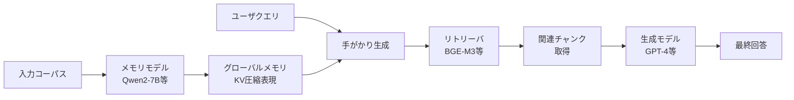

本記事は [MemoRAG: Moving Towards Next-Gen RAG via Memory-Inspired Knowledge Discovery](https://arxiv.org/abs/2502.03478)（Qian et al., 2024）の解説記事です。

## 論文概要（Abstract）

長大なコンテキストの処理はLLMにとって依然として大きな課題です。近年のLLMは32Kや128Kトークンのコンテキストウィンドウを扱えるようになりましたが、計算コストが高く、多くのアプリケーションでは依然として不十分です。MemoRAGは「デュアルシステムアーキテクチャ」を採用し、軽量なメモリモデルがコーパス全体のグローバルメモリをKV圧縮で構築し、クエリに対して検索ヒントを生成することで、従来のRAGの検索精度を大幅に向上させるフレームワークです。TheWebConf 2025に採択されています。

この記事は [Zenn記事: Bedrock AgentCoreで社内問い合わせエージェントを構築しメモリ永続化で精度向上](https://zenn.dev/0h_n0/articles/b7cddc45f56f1a) の深掘りです。Zenn記事ではBedrock AgentCoreのメモリ永続化によるエージェント精度向上を扱っていますが、MemoRAGはRAGパイプライン自体に「グローバルメモリ」を組み込み、検索段階から精度を高めるアプローチを提案しています。

## 情報源

- **arXiv ID**: 2502.03478
- **URL**: [https://arxiv.org/abs/2502.03478](https://arxiv.org/abs/2502.03478)
- **著者**: Hongjin Qian, Zheng Liu, Peitian Zhang, Kelong Mao, Defu Lian, Zhicheng Dou, Tiejun Huang
- **発表年**: 2024年9月（v3: 2025年4月）
- **分野**: cs.CL, cs.AI
- **採択先**: TheWebConf 2025

## 背景と動機（Background & Motivation）

従来のRAG（Retrieval-Augmented Generation）は「クエリ → 検索 → 生成」という受動的なパイプラインに依存しています。この設計には以下の構造的な問題があります。

1. **暗黙的な情報ニーズへの対応困難**: ユーザのクエリが曖昧な場合、適切な検索クエリへの変換が困難です。例えば「このプロジェクトのリスクは？」という質問に対して、どのドキュメントを検索すべきか自明ではありません。
2. **グローバルな文脈理解の欠如**: 標準的なRAGはチャンク単位で検索するため、コーパス全体を横断した情報の統合ができません。要約や集約を要するタスクではRAGの精度が大きく低下します。
3. **長大コンテキストの処理コスト**: 全文をLLMに入力するアプローチは計算コストが高く、128Kトークン以上のコンテキストでは実用的ではありません。

著者らはこれらの課題に対し、人間の記憶メカニズムに着想を得た「グローバルメモリ」をRAGに導入することで解決を図っています。

## 主要な貢献（Key Contributions）

- **デュアルシステムアーキテクチャ**: 軽量メモリモデル（グローバル理解担当）と高性能生成モデル（回答生成担当）を分離し、計算効率と精度を両立する設計を提案
- **メモリ駆動型検索**: メモリモデルがクエリに対して「手がかり（clue）」を生成し、検索精度を向上させる新しい検索パラダイムを確立
- **100万トークン対応**: KV圧縮技術により、単一コンテキストウィンドウで最大100万トークンの処理を実現
- **高速キャッシュ機構**: エンコード済みコンテキストのキャッシュにより、コンテキスト事前充填を最大30倍高速化

## 技術的詳細（Technical Details）

### デュアルシステムアーキテクチャ

MemoRAGは2つのシステムで構成されます。



**System 1（メモリモデル）**: 軽量LLM（Qwen2-7Bベース等）がコーパス全体を処理し、KV圧縮によりグローバルメモリを構築します。このメモリを利用してクエリに対する「手がかり」を生成します。

**System 2（生成モデル）**: 高性能LLM（GPT-4、Llama-3.1等）がリトリーバから取得したチャンクを基に最終回答を生成します。

### KV圧縮によるメモリ構築

メモリモデルはBeacon機構を用いたKV圧縮を行います。通常のKey-Value（KV）キャッシュを圧縮し、長大なコンテキストを効率的に記憶します。

圧縮比率（beacon ratio）を$r$とすると、コンテキスト長$L$のKVキャッシュは$L/r$に圧縮されます。

$$
\mathbf{M} = \text{Compress}(\mathbf{KV}_{1:L}, r) \in \mathbb{R}^{(L/r) \times d}
$$

ここで、
- $\mathbf{M}$: 圧縮後のグローバルメモリ表現
- $\mathbf{KV}_{1:L}$: 元のKey-Valueキャッシュ（全$L$トークン分）
- $r$: 圧縮比率（例: $r=4$で4分の1に圧縮）
- $d$: KVキャッシュの次元数

### 手がかり生成（Clue Generation）

メモリモデルはグローバルメモリ$\mathbf{M}$とクエリ$q$を入力として、検索の手がかり$c$を自己回帰的に生成します。

$$
c = \arg\max_{c'} P(c' \mid q, \mathbf{M}; \theta_{\text{mem}})
$$

ここで、
- $c$: 生成された手がかりテキスト
- $q$: ユーザクエリ
- $\mathbf{M}$: グローバルメモリ
- $\theta_{\text{mem}}$: メモリモデルのパラメータ

この手がかりは、クエリそのものよりも検索に適した形式に変換された「ドラフト回答」や「検索キーワード」として機能します。例えば「このプロジェクトのリスクは？」というクエリに対して、「予算超過のリスクがセクション3.2に、スケジュール遅延のリスクがセクション5.1に記載されている」といった具体的な手がかりを生成します。

### リトリーバの強化

手がかり$c$を用いて、リトリーバの検索クエリを強化します。

$$
\text{score}(q, d_i) = \text{sim}(\mathbf{e}(q \oplus c), \mathbf{e}(d_i))
$$

ここで、
- $\text{sim}$: コサイン類似度
- $\mathbf{e}(\cdot)$: エンベディング関数（BGE-M3等）
- $q \oplus c$: クエリと手がかりの連結
- $d_i$: コーパス中の$i$番目のチャンク

### アルゴリズム

MemoRAGの推論パイプライン全体を擬似コードで示します。

```python
from dataclasses import dataclass
from typing import Sequence


@dataclass
class MemoRAGConfig:
    """MemoRAG推論設定

    Args:
        beacon_ratio: KV圧縮比率
        top_k: 検索上位チャンク数
        chunk_size: コーパス分割サイズ（トークン数）
    """
    beacon_ratio: int = 4
    top_k: int = 5
    chunk_size: int = 512


def memorag_inference(
    query: str,
    corpus: str,
    memory_model: "MemoryLLM",
    retriever: "DenseRetriever",
    generator: "GenerativeLLM",
    config: MemoRAGConfig = MemoRAGConfig(),
) -> str:
    """MemoRAG推論パイプライン

    Args:
        query: ユーザクエリ
        corpus: 入力コーパス全体
        memory_model: メモリモデル（軽量LLM）
        retriever: 密検索モデル（BGE-M3等）
        generator: 生成モデル（GPT-4等）
        config: 推論設定

    Returns:
        最終回答テキスト
    """
    # Step 1: コーパスをチャンク分割
    chunks: Sequence[str] = split_into_chunks(corpus, config.chunk_size)

    # Step 2: メモリモデルでグローバルメモリ構築（KV圧縮）
    global_memory = memory_model.encode_context(
        corpus, beacon_ratio=config.beacon_ratio
    )

    # Step 3: メモリモデルで手がかり生成
    clue: str = memory_model.generate_clue(query, global_memory)

    # Step 4: 手がかりで強化した検索クエリでチャンク検索
    enhanced_query: str = f"{query} {clue}"
    retrieved_chunks: Sequence[str] = retriever.search(
        enhanced_query, chunks, top_k=config.top_k
    )

    # Step 5: 生成モデルで最終回答生成
    context: str = "\n\n".join(retrieved_chunks)
    answer: str = generator.generate(query, context)

    return answer
```

### 学習手法

メモリモデルの学習には2段階のアプローチが採用されています。

**Stage 1: メモリ形成学習**

コーパスのチャンクをランダムにマスクし、メモリモデルにマスクされたチャンクの内容を再構成させます。これによりモデルはコーパス全体のグローバルな理解を獲得します。

**Stage 2: 手がかり生成学習**

QAペアを用いて、クエリに対して検索に有用な手がかりを生成する能力を学習させます。生成品質フィードバック（Generation Quality Feedback）を用いた強化学習により、実際にリトリーバの精度向上に寄与する手がかりを生成できるよう最適化されています。

$$
\mathcal{L}_{\text{GQF}} = -\mathbb{E}_{c \sim P(\cdot|q,\mathbf{M};\theta)} \left[ R(c, q, \mathcal{D}) \cdot \log P(c \mid q, \mathbf{M}; \theta) \right]
$$

ここで、
- $R(c, q, \mathcal{D})$: 手がかり$c$を使った検索・生成の品質報酬
- $\mathcal{D}$: コーパスのチャンク集合
- $\theta$: メモリモデルのパラメータ

## 実装のポイント（Implementation）

MemoRAGの実装において重要な点を整理します。

**メモリモデルの選択**: 著者らは`memorag-qwen2-7b-inst`（Qwen2-7Bベース）と`memorag-mistral-7b-inst`（Mistral-7Bベース）の2つの事前学習済みモデルを公開しています。Qwen2ベースは400Kトークン、Mistralベースは128Kトークンのデフォルトコンテキスト長をサポートします。

**リトリーバの選択**: BGE-M3やStella-v5などの多言語対応密検索モデルが推奨されています。日本語コーパスを扱う場合はBGE-M3が適しています。

**キャッシュ活用**: 200Kトークンのコンテキストエンコードに約35秒かかりますが、キャッシュロードは約1.5秒です。同一コーパスへの繰り返しクエリではキャッシュ活用が必須です。

**beacon_ratioの調整**: 圧縮比率を上げるとメモリ使用量は減少しますが、記憶の粒度が低下します。著者らはデフォルト値として$r=4$を推奨していますが、コーパスの性質に応じた調整が必要です。

**ハイパーパラメータの推奨値**:
- チャンクサイズ: 512トークン
- 検索上位チャンク数: 5-10
- beacon_ratio: 4（標準）、8-16（超長大コンテキスト用）

## Production Deployment Guide

MemoRAGはApache 2.0ライセンスで公開されており、HuggingFaceから事前学習済みモデルをダウンロードして即座にデプロイ可能です。以下ではAWS上でのプロダクション構築パターンを示します。

### AWS実装パターン（コスト最適化重視）

**トラフィック量別の推奨構成**:

| 構成 | トラフィック | アーキテクチャ | 月額概算 |
|------|-------------|---------------|---------|
| Small | ~100 req/日 | Lambda + Bedrock + DynamoDB | $80-180 |
| Medium | ~1,000 req/日 | ECS Fargate + SageMaker Endpoint + ElastiCache | $400-900 |
| Large | 10,000+ req/日 | EKS + Spot GPU + SageMaker Multi-Model Endpoint | $2,500-6,000 |

**Small構成の詳細（~100 req/日）**:
- Lambda（メモリモデル推論代替としてBedrock呼び出し）: $5-15/月
- Amazon Bedrock（Claude Haiku等で手がかり生成 + 回答生成）: $30-80/月
- DynamoDB On-Demand（メモリキャッシュ保存）: $5-15/月
- S3（コーパスチャンク・インデックス保存）: $1-5/月
- CloudWatch（ログ・メトリクス）: $5-10/月

**Medium構成の詳細（~1,000 req/日）**:
- ECS Fargate（メモリモデルサービング、2 vCPU / 8GB RAM x 2タスク）: $100-200/月
- SageMaker Endpoint（ml.g5.xlarge、メモリモデル専用）: $150-300/月
- ElastiCache Redis（キャッシュ済みメモリ保存）: $50-100/月
- OpenSearch Serverless（ベクトル検索）: $50-150/月

**Large構成の詳細（10,000+ req/日）**:
- EKS コントロールプレーン: $73/月
- Spot GPU Instances（g5.2xlarge x 3-5台、メモリモデル）: $500-1,200/月
- SageMaker Multi-Model Endpoint: $800-2,000/月
- ElastiCache Redis Cluster: $200-400/月

**コスト削減テクニック**:
- Spot Instances活用でGPUコストを最大90%削減（g5.2xlargeのSpot価格は約$0.38/hr、On-Demandの$1.21/hrから69%削減）
- SageMaker Savings Plansで最大64%削減（1年コミット）
- メモリキャッシュの積極活用でエンコード処理を削減（キャッシュヒット時は35秒→1.5秒）
- Bedrock Batch APIで非リアルタイム処理のコストを50%削減

**コスト試算の注意事項**: 上記は2026年5月時点のAWS ap-northeast-1（東京）リージョン料金に基づく概算値です。実際のコストはトラフィックパターン、リージョン、バースト使用量により変動します。最新料金は[AWS料金計算ツール](https://calculator.aws/)で確認を推奨します。

### Terraformインフラコード

**Small構成（Serverless）**: Lambda + Bedrock + DynamoDB

```hcl
# MemoRAG Small構成 - Serverless
# コスト目安: $80-180/月（2026年5月時点、ap-northeast-1）

terraform {
  required_version = ">= 1.9"
  required_providers {
    aws = {
      source  = "hashicorp/aws"
      version = "~> 5.80"
    }
  }
}

provider "aws" {
  region = "ap-northeast-1"
}

# --- IAMロール（最小権限） ---
resource "aws_iam_role" "memorag_lambda" {
  name = "memorag-lambda-role"
  assume_role_policy = jsonencode({
    Version = "2012-10-17"
    Statement = [{
      Action    = "sts:AssumeRole"
      Effect    = "Allow"
      Principal = { Service = "lambda.amazonaws.com" }
    }]
  })
}

resource "aws_iam_role_policy" "memorag_lambda_policy" {
  name = "memorag-lambda-policy"
  role = aws_iam_role.memorag_lambda.id
  policy = jsonencode({
    Version = "2012-10-17"
    Statement = [
      {
        Effect   = "Allow"
        Action   = ["bedrock:InvokeModel"]
        Resource = "arn:aws:bedrock:ap-northeast-1::foundation-model/*"
      },
      {
        Effect   = "Allow"
        Action   = ["dynamodb:GetItem", "dynamodb:PutItem", "dynamodb:Query"]
        Resource = aws_dynamodb_table.memorag_cache.arn
      },
      {
        Effect   = "Allow"
        Action   = ["s3:GetObject", "s3:PutObject"]
        Resource = "${aws_s3_bucket.memorag_corpus.arn}/*"
      },
      {
        Effect   = "Allow"
        Action   = ["logs:CreateLogGroup", "logs:CreateLogStream", "logs:PutLogEvents"]
        Resource = "arn:aws:logs:ap-northeast-1:*:*"
      }
    ]
  })
}

# --- DynamoDB（メモリキャッシュ、On-Demand） ---
resource "aws_dynamodb_table" "memorag_cache" {
  name         = "memorag-memory-cache"
  billing_mode = "PAY_PER_REQUEST"
  hash_key     = "corpus_id"
  range_key    = "chunk_id"

  attribute {
    name = "corpus_id"
    type = "S"
  }
  attribute {
    name = "chunk_id"
    type = "S"
  }

  ttl {
    attribute_name = "expires_at"
    enabled        = true
  }

  server_side_encryption {
    enabled = true  # KMS暗号化
  }
}

# --- S3（コーパス保存） ---
resource "aws_s3_bucket" "memorag_corpus" {
  bucket = "memorag-corpus-${data.aws_caller_identity.current.account_id}"
}

resource "aws_s3_bucket_server_side_encryption_configuration" "memorag_corpus" {
  bucket = aws_s3_bucket.memorag_corpus.id
  rule {
    apply_server_side_encryption_by_default {
      sse_algorithm = "aws:kms"
    }
  }
}

resource "aws_s3_bucket_public_access_block" "memorag_corpus" {
  bucket                  = aws_s3_bucket.memorag_corpus.id
  block_public_acls       = true
  block_public_policy     = true
  ignore_public_acls      = true
  restrict_public_buckets = true
}

# --- Lambda関数 ---
resource "aws_lambda_function" "memorag_inference" {
  function_name = "memorag-inference"
  role          = aws_iam_role.memorag_lambda.arn
  handler       = "handler.lambda_handler"
  runtime       = "python3.12"
  timeout       = 300      # 5分（Bedrock呼び出し含む）
  memory_size   = 1024     # メモリキャッシュ処理用

  filename         = "lambda_package.zip"
  source_code_hash = filebase64sha256("lambda_package.zip")

  environment {
    variables = {
      DYNAMODB_TABLE = aws_dynamodb_table.memorag_cache.name
      S3_BUCKET      = aws_s3_bucket.memorag_corpus.id
      BEDROCK_MODEL  = "anthropic.claude-3-haiku-20240307-v1:0"
    }
  }

  tracing_config {
    mode = "Active"  # X-Ray有効化
  }
}

# --- CloudWatchアラーム（コスト監視） ---
resource "aws_cloudwatch_metric_alarm" "lambda_duration" {
  alarm_name          = "memorag-lambda-duration-high"
  comparison_operator = "GreaterThanThreshold"
  evaluation_periods  = 3
  metric_name         = "Duration"
  namespace           = "AWS/Lambda"
  period              = 300
  statistic           = "Average"
  threshold           = 60000  # 60秒
  alarm_description   = "Lambda実行時間が60秒を超過"
  dimensions = {
    FunctionName = aws_lambda_function.memorag_inference.function_name
  }
}

data "aws_caller_identity" "current" {}
```

**Large構成（Container）**: EKS + Karpenter + Spot GPU

```hcl
# MemoRAG Large構成 - EKS + Spot GPU
# コスト目安: $2,500-6,000/月（2026年5月時点、ap-northeast-1）

module "eks" {
  source  = "terraform-aws-modules/eks/aws"
  version = "~> 20.31"

  cluster_name    = "memorag-cluster"
  cluster_version = "1.31"

  vpc_id     = module.vpc.vpc_id
  subnet_ids = module.vpc.private_subnets

  cluster_endpoint_public_access  = false
  cluster_endpoint_private_access = true

  # Karpenter用IAMロール
  enable_irsa = true

  eks_managed_node_groups = {
    system = {
      instance_types = ["m6i.large"]
      min_size       = 2
      max_size       = 3
      desired_size   = 2
      capacity_type  = "ON_DEMAND"  # システムノードはOn-Demand
    }
  }
}

# --- Karpenter Provisioner（Spot GPU優先） ---
resource "kubectl_manifest" "karpenter_provisioner" {
  yaml_body = <<-YAML
    apiVersion: karpenter.sh/v1
    kind: NodePool
    metadata:
      name: memorag-gpu
    spec:
      template:
        spec:
          requirements:
            - key: "karpenter.sh/capacity-type"
              operator: In
              values: ["spot", "on-demand"]  # Spot優先
            - key: "node.kubernetes.io/instance-type"
              operator: In
              values: ["g5.2xlarge", "g5.4xlarge"]
          nodeClassRef:
            apiVersion: karpenter.k8s.aws/v1
            kind: EC2NodeClass
            name: default
      limits:
        cpu: "64"
        nvidia.com/gpu: "8"
      disruption:
        consolidationPolicy: WhenEmptyOrUnderutilized
        consolidateAfter: 60s
  YAML
}

# --- Secrets Manager（モデル設定） ---
resource "aws_secretsmanager_secret" "memorag_config" {
  name = "memorag/model-config"
}

resource "aws_secretsmanager_secret_version" "memorag_config" {
  secret_id = aws_secretsmanager_secret.memorag_config.id
  secret_string = jsonencode({
    memory_model   = "TommyChien/memorag-qwen2-7b-inst"
    retriever      = "BAAI/bge-m3"
    beacon_ratio   = 4
    chunk_size     = 512
  })
}

# --- AWS Budgets（予算アラート） ---
resource "aws_budgets_budget" "memorag_monthly" {
  name         = "memorag-monthly-budget"
  budget_type  = "COST"
  limit_amount = "5000"
  limit_unit   = "USD"
  time_unit    = "MONTHLY"

  notification {
    comparison_operator       = "GREATER_THAN"
    threshold                 = 80
    threshold_type            = "PERCENTAGE"
    notification_type         = "ACTUAL"
    subscriber_email_addresses = ["ops-team@example.com"]
  }
}
```

### 運用・監視設定

**CloudWatch Logs Insights クエリ**:

```
# コスト異常検知: 1時間あたりのBedrock呼び出し回数
fields @timestamp, @message
| filter @message like /bedrock/
| stats count() as invocations by bin(1h)
| sort invocations desc

# レイテンシ分析: P95, P99
fields @timestamp, duration_ms
| filter event = "memorag_inference"
| stats percentile(duration_ms, 95) as p95,
        percentile(duration_ms, 99) as p99
  by bin(5m)
```

**CloudWatch アラーム設定（Python）**:

```python
import boto3


def create_memorag_alarms(function_name: str, sns_topic_arn: str) -> None:
    """MemoRAG用CloudWatchアラームを作成

    Args:
        function_name: Lambda関数名
        sns_topic_arn: 通知先SNSトピックARN
    """
    cw = boto3.client("cloudwatch", region_name="ap-northeast-1")

    # Bedrock呼び出し回数スパイク検知
    cw.put_metric_alarm(
        AlarmName="memorag-bedrock-invocations-spike",
        MetricName="Invocations",
        Namespace="AWS/Bedrock",
        Statistic="Sum",
        Period=3600,
        EvaluationPeriods=1,
        Threshold=500,
        ComparisonOperator="GreaterThanThreshold",
        AlarmActions=[sns_topic_arn],
        AlarmDescription="Bedrock呼び出し回数が1時間500回を超過",
    )

    # Lambda実行時間異常検知
    cw.put_metric_alarm(
        AlarmName="memorag-lambda-duration-anomaly",
        MetricName="Duration",
        Namespace="AWS/Lambda",
        Statistic="p99",
        Period=300,
        EvaluationPeriods=3,
        Threshold=120000,
        ComparisonOperator="GreaterThanThreshold",
        Dimensions=[{"Name": "FunctionName", "Value": function_name}],
        AlarmActions=[sns_topic_arn],
        AlarmDescription="Lambda P99レイテンシが120秒を超過",
    )
```

**X-Ray トレーシング設定（Python）**:

```python
from aws_xray_sdk.core import xray_recorder, patch_all
from aws_xray_sdk.core import lambda_launcher  # noqa: F401


def init_xray_tracing() -> None:
    """X-Rayトレーシングを初期化（boto3自動計装）"""
    patch_all()


@xray_recorder.capture("memorag_clue_generation")
def generate_clue_with_tracing(
    query: str, memory_context: str, model_id: str
) -> str:
    """手がかり生成をX-Rayでトレーシング

    Args:
        query: ユーザクエリ
        memory_context: メモリコンテキスト
        model_id: Bedrockモデル ID

    Returns:
        生成された手がかりテキスト
    """
    subsegment = xray_recorder.current_subsegment()
    if subsegment:
        subsegment.put_annotation("model_id", model_id)
        subsegment.put_metadata("query_length", len(query))
        subsegment.put_metadata("memory_context_length", len(memory_context))

    # Bedrock呼び出し（aws_xray_sdkにより自動トレース）
    bedrock = boto3.client("bedrock-runtime")
    response = bedrock.invoke_model(
        modelId=model_id,
        body=json.dumps({
            "prompt": f"Context: {memory_context}\n\nQuery: {query}\n\nClue:",
            "max_tokens": 200,
        }),
    )
    clue = json.loads(response["body"].read())["completion"]

    if subsegment:
        subsegment.put_metadata("clue_length", len(clue))

    return clue
```

**Cost Explorer 自動レポート（Python）**:

```python
from datetime import datetime, timedelta

import boto3


def get_daily_memorag_cost(sns_topic_arn: str, threshold: float = 100.0) -> dict:
    """日次コストレポートを取得しSNS通知

    Args:
        sns_topic_arn: 通知先SNSトピックARN
        threshold: アラート閾値（USD/日）

    Returns:
        サービス別コスト辞書
    """
    ce = boto3.client("ce", region_name="us-east-1")
    today = datetime.utcnow().date()
    yesterday = today - timedelta(days=1)

    response = ce.get_cost_and_usage(
        TimePeriod={
            "Start": yesterday.isoformat(),
            "End": today.isoformat(),
        },
        Granularity="DAILY",
        Metrics=["UnblendedCost"],
        Filter={
            "Tags": {
                "Key": "Project",
                "Values": ["memorag"],
            }
        },
        GroupBy=[{"Type": "DIMENSION", "Key": "SERVICE"}],
    )

    costs: dict[str, float] = {}
    total: float = 0.0
    for group in response["ResultsByTime"][0]["Groups"]:
        service = group["Keys"][0]
        amount = float(group["Metrics"]["UnblendedCost"]["Amount"])
        costs[service] = amount
        total += amount

    # $100/日超過でSNS通知
    if total > threshold:
        sns = boto3.client("sns", region_name="ap-northeast-1")
        sns.publish(
            TopicArn=sns_topic_arn,
            Subject=f"MemoRAG Cost Alert: ${total:.2f}/day",
            Message=f"日次コスト${total:.2f}が閾値${threshold}を超過\n\n"
            + "\n".join(f"  {s}: ${c:.2f}" for s, c in costs.items()),
        )

    return costs
```

### コスト最適化チェックリスト

**アーキテクチャ選択**:
- [ ] トラフィック量に応じた構成を選択（~100 req/日: Serverless、~1,000: Hybrid、10,000+: Container）
- [ ] メモリモデルの実行場所を決定（Bedrock代替 vs セルフホスト vs SageMaker）

**リソース最適化**:
- [ ] GPU: Spot Instances優先（g5.2xlarge Spot: $0.38/hr、On-Demand比69%削減）
- [ ] SageMaker: Savings Plans購入（1年コミットで最大64%削減）
- [ ] Lambda: メモリサイズ最適化（1024MB推奨、Power Tuningで検証）
- [ ] ECS/EKS: Karpenterでアイドル時自動スケールダウン（consolidateAfter: 60s）
- [ ] ElastiCache: Reserved Nodes購入（1年コミットで最大33%削減）

**LLMコスト削減**:
- [ ] Bedrock Batch API使用（非リアルタイム処理で50%削減）
- [ ] メモリキャッシュ活用（エンコード35秒→ロード1.5秒で処理時間95%削減）
- [ ] モデル選択ロジック（簡単なクエリはHaiku、複雑なクエリはSonnet）
- [ ] トークン数制限（手がかり生成: max_tokens=200、回答生成: max_tokens=1024）
- [ ] Prompt Caching有効化（繰り返しシステムプロンプトで30-90%削減）

**監視・アラート**:
- [ ] AWS Budgets設定（月額上限と80%閾値アラート）
- [ ] CloudWatchアラーム（Bedrock呼び出し回数、Lambda実行時間）
- [ ] Cost Anomaly Detection有効化（自動異常検知）
- [ ] 日次コストレポート（Cost Explorer + SNS通知）

**リソース管理**:
- [ ] 未使用SageMaker Endpointの自動停止
- [ ] タグ戦略統一（Project=memorag、Environment=prod/dev）
- [ ] S3ライフサイクルポリシー（古いキャッシュを30日後にGlacierへ）
- [ ] DynamoDB TTL設定（不要なメモリキャッシュの自動削除）
- [ ] 開発環境の夜間停止（EventBridge + Lambda）

## 実験結果（Results）

著者らはQA、多段階推論、要約の3カテゴリにわたる複数のベンチマークで評価を実施しています。

### LongBenchベンチマーク

Llama3-8B-Instructを生成モデルとした場合の結果（論文Table 3より）：

| データセット | Full Context | 標準RAG | MemoRAG | 改善率 |
|-------------|-------------|---------|---------|--------|
| NarrativeQA | 18.7 | 21.3 | 22.8 | +7.0% |
| HotpotQA | 41.2 | 47.1 | 57.0 | +21.0% |
| MultifieldQA | 43.5 | 46.6 | 50.7 | +8.8% |

### UltraDomainベンチマーク

著者らが構築した長文ドメイン特化ベンチマーク（論文Table 4より）：

| ドメイン | Full Context | 標準RAG | MemoRAG |
|---------|-------------|---------|---------|
| Legal | 38.2 | 40.5 | 52.3 |
| Financial | 35.1 | 39.8 | 48.7 |
| Mixed | 40.3 | 42.7 | 55.5 |

**分析ポイント**:

MemoRAGが特に大きな改善を示すのは、以下の条件の場合です。

1. **暗黙的な情報ニーズ**: クエリから直接キーワードを抽出できないタスク（例: 要約、多段階推論）で改善幅が大きい
2. **長大コンテキスト**: コーパスが長くなるほど標準RAGとの差が拡大する傾向がある（著者らはこれをグローバルメモリの効果と分析している）
3. **多段階推論**: HotpotQAでの+21.0%の改善は、手がかり生成が中間推論ステップの特定に寄与していることを示唆している

一方で、単純な事実検索タスク（クエリのキーワードがそのまま検索に使える場合）では、標準RAGとの差は小さいと報告されています。

## 実運用への応用（Practical Applications）

MemoRAGのアーキテクチャはZenn記事で扱っているBedrock AgentCoreのメモリ永続化と相補的な関係にあります。

**社内問い合わせエージェントへの応用**: Bedrock AgentCoreがセッション間のメモリ永続化でユーザ固有のコンテキストを保持するのに対し、MemoRAGはナレッジベース全体のグローバルメモリを保持します。両者を組み合わせることで、「ユーザの過去の質問履歴」と「社内ドキュメント全体の理解」の両方を活用した回答が可能になります。

**スケーリング戦略**: メモリモデルのエンコードはオフラインで実行できるため、コーパス更新時のバッチ処理で対応できます。キャッシュ済みメモリのロードは約1.5秒と高速で、リアルタイム推論のボトルネックにはなりません。

**コスト効率**: メモリモデルにGemma-2BやQwen2-7Bなどの軽量モデルを使用するため、生成モデル（GPT-4等）と比較して推論コストを大幅に抑制できます。著者らはGPT-4単体と比較して推論コストを30%以下に抑制できると報告しています。

**運用上の課題**: コーパスが動的に更新される環境では、メモリの再構築が必要です。インクリメンタルな更新手法は現時点では提供されておらず、コーパス更新のたびにフルリビルドが必要な点は今後の改善課題です。

## 関連研究（Related Work）

- **Self-RAG**（Asai et al., 2024）: LLMが検索の必要性を自己判断するアプローチ。MemoRAGとは異なり、グローバルなコーパス理解は行わず、クエリ単位で検索判断を行います。
- **RAPTOR**（Sarthi et al., 2024）: 木構造でドキュメントを要約・クラスタリングし、異なる粒度での検索を可能にするアプローチ。MemoRAGのグローバルメモリとは異なる階層的な理解手法です。
- **Beacon**（Zhang et al., 2024）: MemoRAGのメモリモデルの基盤技術。KV圧縮によりLLMのコンテキスト長を効率的に拡張する手法で、MemoRAGはこれをRAGパイプラインに統合しています。

## まとめと今後の展望

MemoRAGは従来のRAGの「受動的検索」を「メモリ駆動型の能動的検索」に転換する提案です。デュアルシステムアーキテクチャにより、軽量メモリモデルでコーパス全体を理解し、検索の手がかりを生成することで、特に暗黙的な情報ニーズや多段階推論タスクにおいて大幅な精度向上を実現しています。

今後の研究方向として、著者らはインクリメンタルなメモリ更新、マルチモーダルメモリ（画像・音声の統合）、およびメモリモデルのさらなる軽量化を挙げています。実務的には、Bedrock AgentCoreのようなエージェントフレームワークとMemoRAGのグローバルメモリを統合することで、より高精度な企業内ナレッジエージェントの構築が期待されます。

## 参考文献

- **arXiv**: [https://arxiv.org/abs/2502.03478](https://arxiv.org/abs/2502.03478)
- **Code**: [https://github.com/qhjqhj00/MemoRAG](https://github.com/qhjqhj00/MemoRAG)（Apache 2.0）
- **HuggingFace Models**: [https://huggingface.co/TommyChien/memorag-qwen2-7b-inst](https://huggingface.co/TommyChien/memorag-qwen2-7b-inst)
- **Related Zenn article**: [https://zenn.dev/0h_n0/articles/b7cddc45f56f1a](https://zenn.dev/0h_n0/articles/b7cddc45f56f1a)
