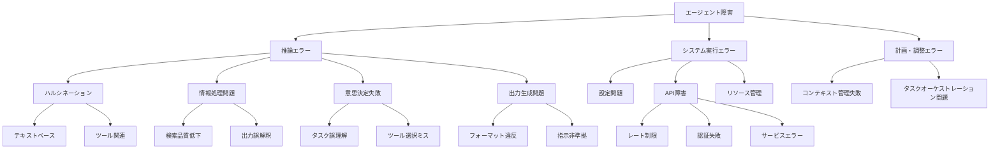

本記事は [TRAIL: Trace Reasoning and Agentic Issue Localization](https://arxiv.org/abs/2505.08638)（Deshpande et al., 2025）の解説記事です。

## 論文概要（Abstract）

LLMエージェントが複雑なタスクを実行する際、障害の特定と分類は依然として人手に依存しています。TRAILは、エージェントの実行トレースを体系的に分析するための障害分類体系（タクソノミー）と、148件の人手アノテーション付きトレースからなるベンチマークデータセットを提案しています。著者らの評価では、最良のモデル（Gemini-2.5-Pro）でもTRAILベンチマークで11%のジョイント精度にとどまり、現行LLMのトレース分析能力に大きな課題があることを示しています。

この記事は [Zenn記事: LangSmithでLLMエージェントをデバッグする実践ガイド2026](https://zenn.dev/0h_n0/articles/969d91080115db) の深掘りです。LangSmithはトレースの可視化とPollyによるAI分析を提供しますが、TRAILはそのAI分析の限界を定量的に評価し、改善すべき課題を明確にしています。

## 情報源

- **arXiv ID**: 2505.08638
- **URL**: [https://arxiv.org/abs/2505.08638](https://arxiv.org/abs/2505.08638)
- **著者**: Darshan Deshpande, Varun Gangal, Hersh Mehta, Jitin Krishnan, Anand Kannappan, Rebecca Qian（Patronus AI）
- **発表年**: 2025年5月（v2: 2025年6月）
- **分野**: cs.AI, cs.CL
- **データセット**: [PatronusAI/TRAIL](https://huggingface.co/datasets/PatronusAI/TRAIL)（HuggingFace）

## 背景と動機（Background & Motivation）

エージェントシステムの障害分析は、従来のソフトウェアデバッグよりも困難です。その理由として、著者らは以下を指摘しています：

1. **非決定的な実行パス**: 同じ入力でもツール選択や推論順序が変わる
2. **外部ツール出力との相互作用**: ツールのエラーとLLMの推論エラーが複合的に作用する
3. **スケーラビリティの欠如**: 手動のドメイン固有分析では、日々増加するエージェント実行に対応できない

これらの課題に対し、TRAILはOpenTelemetryベースのスパンを用いた構造化トレースの標準的な評価基盤を提供することで、トレース分析の自動化に向けた基礎を築いています。

## 主要な貢献（Key Contributions）

- **エージェント障害のタクソノミー**: 推論エラー、システム実行エラー、計画・調整エラーの3大カテゴリとその下位分類を定義
- **TRAILデータセット**: 148件の人手アノテーション付き実行トレース（1,987 OTelスパン、841件のエラー注釈）
- **LLMベンチマーク**: 現行の最先端LLMがトレース分析タスクにおいて極めて低い性能を示すことを実証

## 技術的詳細（Technical Details）

### 障害タクソノミー

TRAILのタクソノミーは3階層構造で、エージェント固有の障害パターンを網羅しています：



このタクソノミーは、LangSmithで観察されるZenn記事の3大障害パターン（検索品質低下・ツールパラメータのハルシネーション・推論ループ）をすべてカバーし、さらにシステムレベルの障害やマルチエージェント間の調整失敗も含んでいます。

### データセット構成

| 項目 | 値 |
|------|-----|
| 総トレース数 | 148件 |
| OTelスパン数 | 1,987件 |
| エラー含有スパン数 | 575件 |
| アノテーション済みエラー数 | 841件 |
| トレースあたり平均エラー数 | 5.68件 |
| GAIAタスクのトレース | 114件 |
| SWE-Benchタスクのトレース | 30件 |

トレースは以下のモデル・タスクで生成されています：

- **GAIAタスク**: o3-mini-2025-01-31によるマルチエージェント検索タスク
- **SWE-Benchタスク**: Claude-3.7-Sonnetによるコード分析タスク

### アノテーションスキーム

4名のソフトウェアエンジニアリング経験を持つアノテータが、各スパンに対して以下をラベル付けしています：

- **エラーカテゴリ分類**: タクソノミーに基づく障害タイプ
- **エビデンス記録**: エラーの根拠となるスパン内容の引用
- **影響度レベル**: Low / Medium / High
- **トレース全体スコア**: 信頼性、セキュリティ、計画品質

検証ラウンドでのスパン修正率は約5-6%と報告されており、高いアノテータ間一致度を達成しています。

### 評価タスクの定義

TRAILでは、モデルに対してトレース全体を入力として与え、以下を同時に予測させます：

1. 各スパンにエラーが存在するか否か（スパンレベル分類）
2. エラーが存在する場合、その障害カテゴリ（タクソノミー分類）

最終スコアは両方の予測が正しい場合のみ正解とする**ジョイント精度**で評価されます。

## 実験結果（Results）

### モデル別パフォーマンス

著者らが報告している主要な結果は以下のとおりです：

| モデル | GAIAジョイント精度 | SWE-Benchジョイント精度 |
|-------|-----------------|---------------------|
| Gemini-2.5-Pro | 18.3% | 5.0% |
| o3 (high effort) | 中程度 | 中程度 |
| o1 | 低い | 低い |
| Claude-3.7-Sonnet | 低い | 低い |
| 非推論モデル | 極めて低い | 極めて低い |

推論モデル（o1, o3, Claude-3.7-Sonnet）は非推論ベースラインを有意に上回りますが、それでもジョイント精度は20%を超えないと著者らは報告しています。

### エラーカテゴリ別の性能差

エラーカテゴリによって、モデルの検出能力に大きな差があると報告されています：

- **困難なカテゴリ**: コンテキスト管理失敗やツール選択エラーでは、ほとんどのモデルがF1スコア0に近い
- **性能差が大きいカテゴリ**: ゴール逸脱の検出では、Geminiモデルが0.70のF1を達成する一方、他モデルは0.05-0.31にとどまる
- **最頻エラー**: 出力生成エラー（フォーマット違反・指示非準拠）が全エラーの42%を占めるが、モデル性能は非単調で予測が難しい

### 入力長の影響

トレースの入力トークン数がモデルのコンテキスト長制限を超えるケースが頻繁に発生すると報告されています。最大入力は「入力長制限の2倍」に達し、入力長とモデル性能の間に強い負の相関が観察されています。

### LangSmithの障害パターンとの対応

Zenn記事で解説した3大障害パターンは、TRAILのタクソノミーで以下のように位置づけられます：

| LangSmith障害パターン | TRAILカテゴリ | 検出難易度 |
|---------------------|-------------|----------|
| 検索品質の低下 | 推論エラー > 情報処理 > 検索品質低下 | 中〜高 |
| ツールパラメータのハルシネーション | 推論エラー > ハルシネーション > ツール関連 | 中 |
| 推論ループ（無限ループ） | 計画・調整エラー > タスクオーケストレーション | 高 |

TRAILの評価結果は、これらの障害パターンのうち特にツール選択エラーとコンテキスト管理失敗の自動検出がほぼ不可能であることを示しています。LangSmithのPollyがこれらの障害を検出できるかどうかは、TRAILベンチマークを用いて定量的に検証可能です。

### エラー分布の分析

TRAILデータセットにおけるエラーの分布は実運用のデバッグ優先度を考えるうえで参考になります。著者らの報告によると：

- **出力生成エラー**が全体の42%と最も多く、フォーマット違反や指示非準拠が大半を占める
- **ハルシネーション**は全カテゴリ中2番目に多く、特にツール関連ハルシネーションが実影響度が高い
- **システム実行エラー**（API障害、レート制限等）はエージェント自体の問題ではないが、障害原因の切り分けで混乱を招く

この分布は、デバッグツールの優先投資先を決める際の指針となります。出力生成エラーは機械的に検出可能な場合が多い一方、ハルシネーションの検出には推論能力の高いモデルが必要です。

## 実装のポイント（Implementation）

TRAILのトレース形式はOpenTelemetryベースであり、LangSmithのトレースと同じスパン構造に基づいています。自前のエージェントシステムにTRAIL評価を導入するには：

```python
from langsmith import Client
from datasets import load_dataset

trail_dataset = load_dataset("PatronusAI/TRAIL")

client = Client()

def evaluate_trace_analysis(
    model_fn,
    traces: list[dict],
) -> dict[str, float]:
    """TRAILベンチマークでトレース分析能力を評価する

    Args:
        model_fn: トレースを入力としてスパン分類を返す関数
        traces: TRAILデータセットのトレースリスト

    Returns:
        ジョイント精度とカテゴリ別F1スコア
    """
    correct = 0
    total = 0
    for trace in traces:
        predictions = model_fn(trace["spans"])
        for span, pred in zip(trace["annotated_spans"], predictions):
            if pred["has_error"] == span["has_error"]:
                if not span["has_error"] or pred["category"] == span["category"]:
                    correct += 1
            total += 1
    return {"joint_accuracy": correct / total}
```

LangSmithのPollyが内部的に類似のトレース分析を行っていますが、TRAILの結果はこうしたAI分析の精度が依然として限定的であることを示唆しています。

## 実運用への応用（Practical Applications）

TRAILは以下の観点でLangSmithベースのデバッグワークフローを強化し得ます：

1. **Pollyの評価基盤**: LangSmithのPollyが提示するトレース分析の精度を、TRAILベンチマークで定量的に測定可能
2. **エラー分類の標準化**: TRAILのタクソノミーをLangSmithのタグ・メタデータと統合し、障害パターンの自動分類を実現
3. **アラートルールの設計**: エラーカテゴリごとの影響度に基づいて、重要度の高い障害パターンを優先的に通知

ただし、TRAILの現時点の制約として、テキスト入出力のみを対象としており、マルチモーダルエージェントへの拡張が必要です。また、低頻度だが高影響度のエラーカテゴリ（テールケース）については、合成データ生成による補完が必要と著者らは述べています。

**実運用での活用ステップ**:
1. TRAILデータセットをHuggingFaceからダウンロードし、自社のLLMバックエンドでベンチマークを実行してトレース分析能力を評価する
2. 弱点カテゴリを特定し、LangSmithのカスタムルール（フィルタ・タグ）で補完する
3. 自社エージェントの実行トレースをTRAIL形式でエクスポートし、定期的にAI分析精度をモニタリングする
4. 新しいLLMバージョンへの更新時に、TRAIL評価を回帰テストとして実行し、トレース分析能力の変化を追跡する

## 関連研究（Related Work）

- **AgentBench**（Liu et al., 2023）: LLMエージェントの8タスク横断評価ベンチマーク。TRAILとの違いは、AgentBenchがタスク成功率を測定するのに対し、TRAILはトレース内の障害特定能力を測定する点
- **SWE-bench**（Jimenez et al., 2024）: ソフトウェアエンジニアリングタスクの評価ベンチマーク。TRAILはSWE-benchの実行トレースを障害分析の素材として活用している
- **AgenTracer**（Zhang et al., 2025）: マルチエージェントの障害帰属フレームワーク。TRAILがLLMの分析能力を評価する「ベンチマーク」であるのに対し、AgenTracerは障害帰属を「自動化する」モデルを提供する点で相補的

## まとめと今後の展望

TRAILは、LLMによるエージェントトレース分析の現状を厳密に評価した初のベンチマークです。最良モデルでもジョイント精度11%（論文のメイン評価結果より）という結果は、LangSmithのPollyのようなAIデバッグアシスタントがまだ初期段階にあることを示しています。

TRAILのタクソノミーとデータセットは、エージェントデバッグツールの改善指針として活用できます。特に、コンテキスト管理失敗やツール選択エラーの検出精度向上が最優先課題として浮上しています。HuggingFaceでMITライセンスのもと公開されているため、自社エージェントの品質評価に即座に活用可能です。LangSmithの次世代Pollyがより高精度なトレース分析を実現するためには、TRAILのようなベンチマークでの継続的な評価と改善サイクルが不可欠です。

## 参考文献

- **arXiv**: [https://arxiv.org/abs/2505.08638](https://arxiv.org/abs/2505.08638)
- **Dataset**: [https://huggingface.co/datasets/PatronusAI/TRAIL](https://huggingface.co/datasets/PatronusAI/TRAIL)
- **Related Zenn article**: [https://zenn.dev/0h_n0/articles/969d91080115db](https://zenn.dev/0h_n0/articles/969d91080115db)

---

:::message
この記事はAI（Claude Code）により自動生成されました。内容の正確性については論文原文で検証していますが、最新の情報は公式リポジトリもご確認ください。
:::
