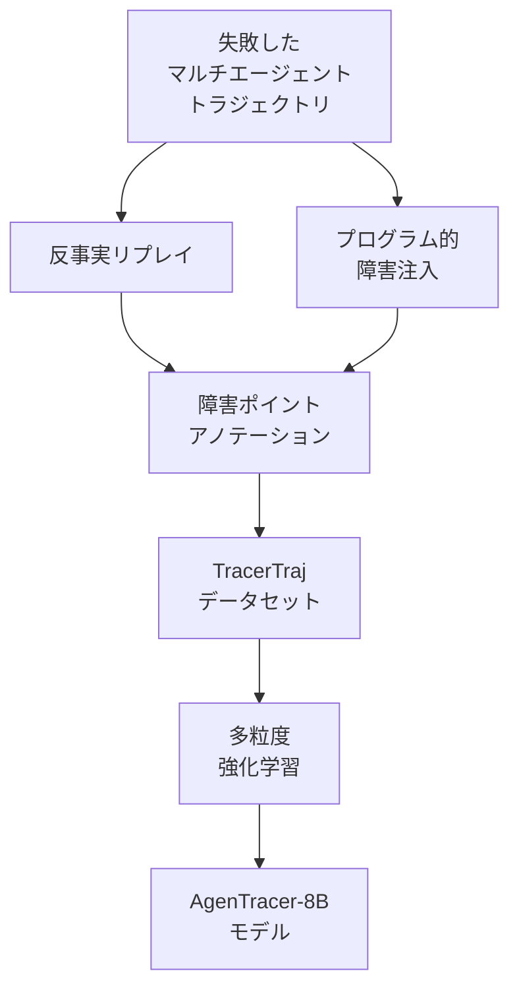

本記事は [AgenTracer: Who Is Inducing Failure in the LLM Agentic Systems?](https://arxiv.org/abs/2509.03312)（Zhang et al., 2025）の解説記事です。

## 論文概要（Abstract）

LLMベースのマルチエージェントシステムは単体エージェントを上回る性能を示す一方、システムの脆弱性も増大しています。障害が発生した際に「どのエージェントが」「いつ」障害を引き起こしたかを特定することは、既存の推論モデルでは精度10%未満と報告されています。AgenTracerは、反事実リプレイ（counterfactual replay）とプログラム的障害注入（programmed fault injection）を組み合わせた自動アノテーションフレームワークと、多粒度強化学習で訓練された軽量8Bモデル（AgenTracer-8B）を提案し、Gemini-2.5-ProやClaude-4-Sonnetを最大18.18%上回る障害トレーシング精度を達成しています。

この記事は [Zenn記事: LangSmithでLLMエージェントをデバッグする実践ガイド2026](https://zenn.dev/0h_n0/articles/969d91080115db) の深掘りです。LangSmithはトレースの可視化と分析を提供しますが、AgenTracerは「障害の根本原因を自動で特定するモデル」を構築するアプローチを提案しています。

## 情報源

- **arXiv ID**: 2509.03312
- **URL**: [https://arxiv.org/abs/2509.03312](https://arxiv.org/abs/2509.03312)
- **著者**: Guibin Zhang, Junhao Wang, Junjie Chen, Wangchunshu Zhou, Kun Wang, Shuicheng Yan
- **発表年**: 2025年9月
- **分野**: cs.CL, cs.MA

## 背景と動機（Background & Motivation）

マルチエージェントシステムでは、複数のLLMエージェントが協調してタスクを解決します（例: MetaGPT、MaAS）。しかし、タスク失敗時に以下の問題が発生します：

1. **障害帰属の曖昧さ**: 複数エージェントがメッセージをやり取りする中で、どのエージェントのどの発話が失敗の原因かを特定するのが困難
2. **時間的な因果関係の複雑さ**: 早期ステップのミスが後続ステップに伝播し、表面的なエラーと根本原因が異なる場合がある
3. **既存手法の限界**: 最先端の推論モデル（Claude, Gemini等）でも障害帰属精度は10%未満（著者らの事前評価より）

これらの課題に対し、AgenTracerは「データ駆動型」のアプローチを採用し、高品質な障害トレーシングデータを自動生成してモデルを訓練します。

## 主要な貢献（Key Contributions）

- **反事実リプレイ+障害注入フレームワーク**: 失敗したエージェントトラジェクトリに対し、各ステップを体系的に変更してリプレイすることで、障害の因果関係を自動で特定するアノテーションシステム
- **TracerTrajデータセット**: 上記フレームワークで生成された、障害ポイントがアノテーションされたエージェント実行トラジェクトリのデータセット
- **AgenTracer-8Bモデル**: 多粒度強化学習で訓練された軽量な障害トレーサーモデル。大規模商用モデルを上回る性能を低コストで実現
- **Who&Whenベンチマーク**: 「誰が」「いつ」障害を引き起こしたかを評価する標準ベンチマーク

## 技術的詳細（Technical Details）

### フレームワーク概要

AgenTracerのパイプラインは、データ生成とモデル訓練の2段階で構成されます：



### 反事実リプレイ（Counterfactual Replay）

反事実リプレイは、「もしステップ$t$の出力が異なっていたら結果はどう変わるか」を検証する手法です。具体的には：

1. 失敗したトラジェクトリ $\tau = (s_1, a_1, s_2, a_2, \ldots, s_T, a_T)$ を取得する
2. 各ステップ $t$ について、エージェント $i$ の出力 $a_t^i$ を「理想的な出力」$\hat{a}_t^i$ に置換する
3. 置換後のトラジェクトリをリプレイし、最終結果が改善するかを測定する
4. 改善が最大のステップが、最も影響度の高い障害ポイントとなる

$$
\text{Impact}(t, i) = R(\tau_{\text{intervened}}^{t,i}) - R(\tau_{\text{original}})
$$

ここで、$R(\tau)$ はトラジェクトリ $\tau$ の報酬（タスク成功率）、$\tau_{\text{intervened}}^{t,i}$ はステップ $t$ のエージェント $i$ に介入したトラジェクトリです。

### プログラム的障害注入（Programmed Fault Injection）

反事実リプレイの逆方向のアプローチとして、成功したトラジェクトリに対して意図的に障害を注入し、どのステップでどの程度のダメージが生じるかを測定します：

- **エージェント意思決定への障害注入**: ツール選択を意図的に誤ったものに変更
- **ツール実行結果への障害注入**: API応答を不正なデータで上書き
- **環境応答への障害注入**: 外部システムからの応答をエラーに変更

これにより、各システム要素の障害耐性と伝播パターンを定量的に把握できます。

### 多粒度強化学習（Multi-Granular RL）

AgenTracer-8Bモデルの訓練では、複数の粒度で障害トレーシング能力を獲得する強化学習を採用しています：

- **粗粒度**: 「どのエージェントが障害原因か」（Who）の判定
- **中粒度**: 「どのステップで障害が発生したか」（When）の判定
- **細粒度**: 障害の根本原因と伝播経路の説明生成

各粒度の報酬関数を組み合わせることで、単一粒度の学習では獲得できない階層的な診断能力を実現しています。

### Who&Whenベンチマーク

このベンチマークは以下の2つの指標で障害トレーシングを評価します：

- **Who精度**: 障害を引き起こしたエージェントの正しい識別率
- **When精度**: 障害が発生したステップの正しい特定率
- **Joint精度**: WhoとWhenの両方が正しい場合のみ正解とする複合指標

## 実験結果（Results）

### AgenTracer-8B vs 商用モデル

著者らの報告によると、AgenTracer-8BはWho&Whenベンチマークにおいて以下の性能を示しています：

| モデル | パラメータ数 | Joint精度 |
|-------|-----------|----------|
| Claude-4-Sonnet | 非公開 | ベースライン |
| Gemini-2.5-Pro | 非公開 | ベースライン |
| **AgenTracer-8B** | **8B** | **+18.18%**（対最良商用モデル） |

8Bという軽量モデルが、パラメータ数で数十〜数百倍の商用モデルを上回っている点が著者らの強調するポイントです。これは、多粒度強化学習による特化訓練の効果と、TracerTrajデータセットの品質によるものと報告されています。

### 既存マルチエージェントシステムへの統合効果

AgenTracerをMetaGPTおよびMaASに統合した実験では、以下の改善が報告されています：

| 統合先 | タスク成功率の改善 |
|-------|----------------|
| MetaGPT | +4.8% |
| MaAS | +14.2% |

改善メカニズムとして、AgenTracerが障害ポイントを特定し、該当エージェントの出力を再生成させることで、タスク成功率を向上させています。

## 実装のポイント（Implementation）

AgenTracerを自社のエージェントシステムに統合する際の考慮点：

1. **トラジェクトリのログ形式**: AgenTracerは各ステップのエージェントID、入出力メッセージ、ツール呼び出しを含む構造化ログを必要とする。LangSmithのトレース形式（Run/Trace/Thread）と互換性を持たせるにはアダプターが必要

2. **リプレイ環境の構築**: 反事実リプレイには、エージェントの実行環境を忠実に再現する必要がある。外部APIへの副作用がある場合はモック化が必要

3. **モデルの推論コスト**: AgenTracer-8Bは8Bパラメータのため、推論はGPU 1台（NVIDIA A10G相当）で実行可能。商用APIと比較して大幅なコスト削減が期待できる

```python
from dataclasses import dataclass

@dataclass
class TrajectoryStep:
    """エージェントトラジェクトリの1ステップ"""
    step_index: int
    agent_id: str
    input_message: str
    output_message: str
    tool_calls: list[dict] | None
    timestamp: float

def format_for_agentracer(
    langsmith_runs: list[dict],
) -> list[TrajectoryStep]:
    """LangSmithのRunをAgenTracer形式に変換する

    Args:
        langsmith_runs: LangSmithから取得したRunリスト

    Returns:
        AgenTracer入力形式のトラジェクトリ
    """
    steps = []
    for i, run in enumerate(langsmith_runs):
        steps.append(TrajectoryStep(
            step_index=i,
            agent_id=run.get("name", "unknown"),
            input_message=str(run.get("inputs", "")),
            output_message=str(run.get("outputs", "")),
            tool_calls=run.get("tool_calls"),
            timestamp=run.get("start_time", 0),
        ))
    return steps
```

## 実運用への応用（Practical Applications）

AgenTracerは、LangSmithのデバッグワークフローを以下の方法で強化できます：

1. **障害トリアージの自動化**: LangSmithのトレースデータをAgenTracer-8Bに入力し、「どのエージェントが」「いつ」障害を引き起こしたかを自動判定。Pollyの分析を補完する具体的な障害帰属を提供
2. **事後分析の高速化**: 夜間バッチで過去の障害トレースをAgenTracer-8Bで分析し、障害パターンのレポートを自動生成
3. **自動修復への接続**: AgenTracerが特定した障害ポイントのエージェント出力を、DoVerスタイルの介入で再生成させることで、自動修復パイプラインを構築

ただし、著者らが認める制約として、AgenTracerの有効性はトラジェクトリの完全性とトレーニング時の障害タイプの多様性に依存します。未知の障害モードに対してはデータセットの拡張やモデルの再訓練が必要になる可能性があります。

## 関連研究（Related Work）

- **DoVer**（Ma et al., 2025）: 介入駆動型デバッグフレームワーク。AgenTracerが障害ポイントの「特定」に注力するのに対し、DoVerは仮説の「検証」に注力する点で相補的
- **TRAIL**（Deshpande et al., 2025）: トレース分析のベンチマーク。TRAILがLLMの分析能力を「評価する」のに対し、AgenTracerは分析能力を「構築する」アプローチ
- **MetaGPT**（Hong et al., 2023）: ソフトウェア開発マルチエージェントフレームワーク。AgenTracerの統合により+4.8%のタスク成功率改善が報告されている

## まとめと今後の展望

AgenTracerは、反事実リプレイと障害注入による高品質なデータ自動生成と、多粒度強化学習による特化モデル訓練を組み合わせることで、商用LLMを上回る障害トレーシング精度を8Bパラメータのモデルで達成しています。

LangSmithのようなオブザーバビリティプラットフォームにAgenTracer-8Bを組み込むことで、トレースの可視化だけでなく、障害原因の自動特定と修復提案まで含む包括的なデバッグワークフローの実現が期待されます。MetaGPTやMaASへの統合で実証された4.8-14.2%のタスク成功率改善は、本番環境でのエージェント信頼性向上に直結する成果です。

## 参考文献

- **arXiv**: [https://arxiv.org/abs/2509.03312](https://arxiv.org/abs/2509.03312)
- **Related Zenn article**: [https://zenn.dev/0h_n0/articles/969d91080115db](https://zenn.dev/0h_n0/articles/969d91080115db)

---

:::message
この記事はAI（Claude Code）により自動生成されました。内容の正確性については論文原文で検証していますが、最新の情報は公式リポジトリもご確認ください。
:::
