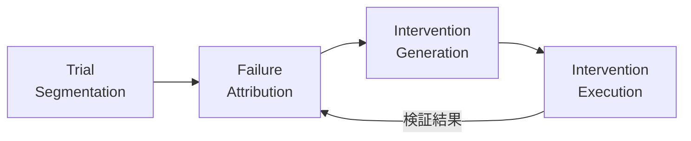

本記事は [DoVer: Intervention-Driven Auto Debugging for LLM Multi-Agent Systems](https://arxiv.org/abs/2512.06749)（Ma et al., 2025）の解説記事です。

## 論文概要（Abstract）

LLMベースのマルチエージェントシステムは複雑なタスクを解決できる一方、障害発生時のデバッグが困難です。従来のログ分析では、長く分岐する実行トレースの中から障害箇所を特定するのが難しいという問題がありました。DoVerは「介入駆動型デバッグ」という新しいアプローチを提案し、障害仮説を能動的に検証することでこの課題に取り組んでいます。

この記事は [Zenn記事: LangSmithでLLMエージェントをデバッグする実践ガイド2026](https://zenn.dev/0h_n0/articles/969d91080115db) の深掘りです。LangSmithがトレース可視化とPollyによるAI分析でデバッグを支援するのに対し、DoVerは一歩進んで「仮説を実際に介入して検証する」手法を提案しています。

## 情報源

- **arXiv ID**: 2512.06749
- **URL**: [https://arxiv.org/abs/2512.06749](https://arxiv.org/abs/2512.06749)
- **著者**: Ming Ma, Jue Zhang, Fangkai Yang, Yu Kang, Qingwei Lin, Saravan Rajmohan, Dongmei Zhang（Microsoft Research）
- **発表年**: 2025年12月（v3: 2026年1月）
- **分野**: cs.AI, cs.SE
- **採択先**: ICLR 2026

## 背景と動機（Background & Motivation）

LLMマルチエージェントシステム（例: Magentic-One, AutoGen）は、Webブラウジング、コード生成、数学問題解決などの複雑なタスクにおいて単体LLMを上回る性能を示しています。しかし、これらのシステムが失敗した場合、原因特定は困難です。

著者らはその理由として以下を指摘しています：

1. **実行トレースの複雑さ**: 現代のエージェントは複数の計画-実行サイクルを含み、1セッション内に複数のトライアルが発生する
2. **マルチエージェント間の責任分散**: 障害が単一エージェントではなく、エージェント間の調整不良に起因する場合がある
3. **ログ分析の限界**: Self-RefineやCRITICなどの既存手法は実行トレース末尾のみを分析するため、途中で分岐した失敗を捉えられない

## 主要な貢献（Key Contributions）

- **介入駆動型デバッグフレームワーク**: 障害仮説を受動的なログ分析ではなく、能動的な介入実行で検証する初のフレームワーク
- **アノテーション不確実性の体系的分析**: ログベースの障害帰属におけるグラウンドトゥルースの曖昧さを定量的に分析
- **成果指向の評価指標**: 単一ステップの帰属精度ではなく、介入によるタスク成功率と進捗度を評価する新指標を提案
- **フレームワーク横断の汎用性**: Magentic-One（M1）とAutoGen2（AG2）の2つの異なるフレームワークで有効性を実証

## 技術的詳細（Technical Details）

### 4段階パイプライン

DoVerは以下の4段階で動作します：



**Stage 1: Trial Segmentation（トライアル分割）**

実行ログをre-planステップを境界として離散的なトライアルに分割します。現代のエージェントは1セッション内で複数の戦略を試行するため、この分割が分析の前提となります。

**Stage 2: Failure Attribution（障害帰属）**

各トライアルについて、LLMが障害仮説を生成します。仮説には疑わしい失敗ステップ、責任エージェント、および根拠が含まれます。著者らは明示的なステップインデックスとガイダンスリマインダーを含むプロンプト設計により、帰属精度を改善しています。

**Stage 3: Intervention Generation（介入生成）**

帰属仮説を具体的な編集操作に変換します。2種類の介入カテゴリが定義されています：

- **メッセージ修正**: サブエージェントへの指示の明確化、引数の修正
- **計画更新**: ステップの並べ替え、分解、または置換

**Stage 4: Intervention Execution（介入実行）**

システムはチェックポイントから介入を適用してトライアルを再実行します。介入ポイントより前のステップはすべて保持され、結果が測定されます。

### 評価指標

著者らは2つの成果指向指標を提案しています：

**Trial Success Rate（トライアル成功率）**: 介入実行によってタスク成功に至ったトライアルの割合

**Progress Made（進捗度）**: タスク完遂には至らなくても、介入によって達成されたマイルストーンの割合

$$
\text{Progress} = \frac{\text{追加達成マイルストーン数}}{\text{総マイルストーン数}} \in [-1, 1]
$$

ここで、マイルストーンは人間がアノテーションした解法ステップからLLM評価によって抽出されます。

### 仮説検証の分類

介入結果は4カテゴリに分類されます：

| カテゴリ | 条件 |
|---------|------|
| **Validated（検証済み）** | 3回中2回以上の再実行で成功 |
| **Partially Validated（部分検証）** | 成功は2回未満だが、進捗度20%超を2回以上達成 |
| **Refuted（反証）** | 介入を忠実に実行したが、進捗度20%以下 |
| **Inconclusive（不確定）** | エージェントが介入を忠実に実行できなかった |

## 実験結果（Results）

### メインの結果（論文 Table 2より）

| データセット | フレームワーク | 介入トライアル数 | 成功率 | 進捗度 |
|------------|-------------|---------------|--------|--------|
| WW-AB | Magentic-One | 72 | 17.6% | +0% |
| WW-GAIA | Magentic-One | 99 | 17.6% | +8.8% |
| GAIA-Level-1 | Magentic-One | 63 | 27.5% | +15.7% |
| GSMPlus | AutoGen2 | 198 | 49.0% | — |

著者らは、Self-RefineやCRITICベースラインが26件の失敗WW-GAIAケースで0%の回復率だったのに対し、DoVerは17.6%の回復率を達成したと報告しています。

### 仮説検証結果（論文 Table 3より）

| データセット | 検証済み | 不確定 | 部分検証 | 反証 |
|------------|---------|--------|---------|------|
| WW-AB | 15.3% | 66.7% | 4.2% | 13.9% |
| WW-GAIA | 16.2% | 57.6% | 5.1% | 21.2% |
| GAIA-Level-1 | 34.9% | 28.6% | 12.7% | 23.8% |

不確定（Inconclusive）の割合が28-67%と高い点が注目されます。著者らはこれをサブエージェントの能力不足（例: WebSurferにスクロール機能がない）に帰属しています。

### モデル依存性（論文 Table 4より）

| モデル | 介入トライアル数 | 成功率 |
|-------|---------------|--------|
| Qwen3-8B (0-shot) | 77 | 11.3% |
| Qwen3-8B (3-shot) | 77 | 14.3% |
| Qwen3-32B (0-shot) | 87 | 16.9% |
| GPT-4o (0-shot) | 99 | 17.6% |

Few-shotプロンプティングにより小型モデルでも3ポイントの改善が見られ、オープンソースモデルでの適用可能性が示唆されています。

## 実装のポイント（Implementation）

DoVerを自前のエージェントフレームワークに統合するには、以下の4つのコア機能が必要です（論文 Appendix Cより）：

1. **チェックポイント保存**: 各実行ステップの状態を永続化
2. **状態復元**: チェックポイントからの環境再構築
3. **メッセージレベル介入注入**: 特定ステップのエージェント間メッセージを編集
4. **介入ポイントからの実行再開**: 編集後のメッセージで後続ステップを再実行

```python
from dataclasses import dataclass
from typing import Any

@dataclass
class Checkpoint:
    """エージェント実行のチェックポイント"""
    step_index: int
    agent_states: dict[str, Any]
    messages: list[dict[str, str]]
    environment: dict[str, Any]

def apply_intervention(
    checkpoints: list[Checkpoint],
    target_step: int,
    modified_message: dict[str, str],
) -> list[dict[str, str]]:
    """指定ステップのメッセージを介入内容で置換し再実行する

    Args:
        checkpoints: 全ステップのチェックポイントリスト
        target_step: 介入対象のステップインデックス
        modified_message: 修正後のメッセージ

    Returns:
        介入後の実行結果メッセージリスト
    """
    cp = checkpoints[target_step]
    cp.messages[-1] = modified_message
    return resume_execution(cp)
```

AutoGen2への統合では、チェックポイント機能の追加に「非自明なエンジニアリング努力」が必要だったと著者らは報告しています。

## Production Deployment Guide

### AWS実装パターン（コスト最適化重視）

DoVerの介入駆動型デバッグを本番エージェントシステムに統合する場合、以下の構成が考えられます。

| 規模 | 月間デバッグセッション | 推奨構成 | 月額コスト目安 |
|------|-------------------|---------|-------------|
| **Small** | ~100 | Serverless | $80-200 |
| **Medium** | ~1,000 | Hybrid | $500-1,200 |
| **Large** | 10,000+ | Container | $3,000-8,000 |

**Small構成**: Lambda（チェックポイント保存・介入実行）+ S3（チェックポイントストレージ）+ DynamoDB（介入結果記録）+ Bedrock（仮説生成）。エージェント実行が散発的なチームに適しています。

**Medium構成**: ECS Fargate（介入オーケストレータ）+ S3 + ElastiCache Redis（チェックポイントキャッシュ）+ Bedrock。チェックポイントの読み書きが頻繁な場合、Redisキャッシュでレイテンシを短縮できます。

**Large構成**: EKS + Karpenter（Spot Instances優先）+ S3 + OpenSearch（トレース検索）+ Bedrock Batch API。大量のエージェント実行トレースを横断検索し、パターン分析が必要な場合に適しています。

**コスト試算の注意事項**: 上記は2026年5月時点のAWS ap-northeast-1料金に基づく概算値です。DoVerの介入実行は各トライアルを3回再実行するため、LLM APIコストが主要なコストドライバーになります。Bedrock Batch APIの50%割引やPrompt Cachingの活用で大幅に削減可能です。

### 運用・監視設定

```python
import boto3

cloudwatch = boto3.client('cloudwatch')

cloudwatch.put_metric_alarm(
    AlarmName='dover-intervention-cost-spike',
    ComparisonOperator='GreaterThanThreshold',
    EvaluationPeriods=1,
    MetricName='InvocationCount',
    Namespace='Custom/DoVer',
    Period=3600,
    Statistic='Sum',
    Threshold=500,
    AlarmDescription='DoVer介入実行回数が1時間500回超過（コスト急増の可能性）',
    AlarmActions=['arn:aws:sns:ap-northeast-1:123456789:cost-alerts'],
)
```

**コスト最適化チェックリスト**:
- [ ] チェックポイントのS3ライフサイクルポリシー設定（30日で自動削除）
- [ ] Bedrock Batch API使用で介入仮説生成コスト50%削減
- [ ] Inconclusive率が高いエージェントの機能改善を優先（無駄な再実行を削減）
- [ ] 再実行回数を3回→2回に削減する検討（論文のValidated基準は2/3だが、コスト制約下では2/2も検討可能）

## 実運用への応用（Practical Applications）

DoVerのアプローチは、LangSmithのトレース分析を補完する強力なツールとなり得ます：

1. **障害トリアージの自動化**: LangSmithでトレースを可視化し、障害箇所を特定した後、DoVerスタイルの介入で仮説を自動検証
2. **回帰テストの強化**: 過去の障害トレースに対して介入を適用し、修正の有効性を検証
3. **エージェント能力のギャップ分析**: 不確定（Inconclusive）ケースの分析により、サブエージェントに不足している機能を特定

ただし、著者らが認める制約として、現時点ではWebシーキングと数学問題のドメインのみで評価されており、RAGエージェントやコード生成エージェントへの適用は未検証です。また、リアルタイムの本番環境でチェックポイント/リプレイを実行するにはレイテンシとコストのトレードオフが生じます。

## 関連研究（Related Work）

- **Self-Refine**（Madaan et al., 2023）: LLMの出力に対してフィードバックを生成し反復改善する手法。DoVerとの違いは、トレース全体ではなく最終出力のみを対象とする点
- **CRITIC**（Gou et al., 2023）: ツール拡張による自己検証フレームワーク。外部ツールでLLM出力を検証するが、マルチエージェントの障害帰属は対象外
- **AgentMonitor**（Naihin et al., 2023）: エージェント実行のモニタリングフレームワーク。観察に基づく受動的分析であり、能動的介入は行わない

## まとめと今後の展望

DoVerは、マルチエージェントシステムのデバッグを「観察（ログ分析）」から「介入（仮説検証）」へと進化させるフレームワークです。GAIA、AssistantBench、GSMPlusの各ベンチマークで18-49%の障害回復率を達成し、介入駆動型アプローチの有効性を示しました。

今後の研究方向として、非同期オーケストレータへの対応、テキスト以外の介入（コード修正、ツール追加）、本番環境でのリアルタイム適用が挙げられています。LangSmithのようなオブザーバビリティツールとDoVerの介入メカニズムを統合することで、「トレースを見る → 仮説を立てる → 自動で検証する」という完全なデバッグサイクルの実現が期待されます。

## 参考文献

- **arXiv**: [https://arxiv.org/abs/2512.06749](https://arxiv.org/abs/2512.06749)
- **Code**: [https://aka.ms/DoVer](https://aka.ms/DoVer)
- **Related Zenn article**: [https://zenn.dev/0h_n0/articles/969d91080115db](https://zenn.dev/0h_n0/articles/969d91080115db)

---

:::message
この記事はAI（Claude Code）により自動生成されました。内容の正確性については論文原文で検証していますが、最新の情報は公式リポジトリもご確認ください。
:::
