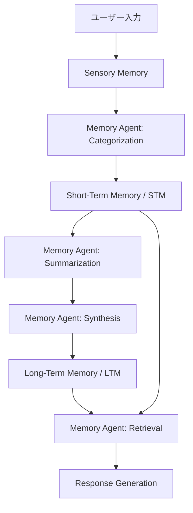
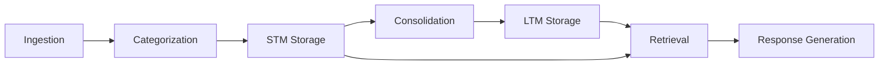

本記事は [https://arxiv.org/abs/2512.12686](https://arxiv.org/abs/2512.12686) の解説記事です。

## 論文概要（Abstract）

Memoriaは、会話型AIシステムにおける長期メモリ能力を強化するために設計されたエージェントメモリフレームワークである。認知心理学のAtkinson-Shiffrinモデルに着想を得て、Sensory Memory、Short-Term Memory（STM）、Long-Term Memory（LTM）の3層メモリアーキテクチャを実装している。LLMを活用したmemory agentが各層のメモリを管理し、カテゴリ分類・要約・統合・検索の4操作でメモリライフサイクルを制御する。LoCoMoベンチマークにおいてvanilla-RAGに対しQA F1スコアで最大12.97%の改善を達成し、計算効率も最大4.34倍向上したと著者らは報告している。

この記事は [Zenn記事: Bedrock AgentCoreで社内問い合わせエージェントを構築しメモリ永続化で精度向上](https://zenn.dev/0h_n0/articles/b7cddc45f56f1a) の深掘りです。

## 情報源

- **arXiv ID**: 2512.12686
- **URL**: [https://arxiv.org/abs/2512.12686](https://arxiv.org/abs/2512.12686)
- **著者**: Yash Patil, Mihir Kulkarni, Yinan Bao, Santosh Kumar Radha（Cisco Systems, Inc.）
- **発表年**: 2024
- **分野**: cs.AI, cs.CL
- **コード**: [https://github.com/codefuse-ai/Memoria](https://github.com/codefuse-ai/Memoria)

## 背景と動機（Background & Motivation）

大規模言語モデル（LLM）を基盤とした会話型AIシステムは、コンテキストウィンドウの制約によりセッションをまたぐ長期的な情報保持が困難という根本的な課題を抱えている。ユーザーの過去の発言や嗜好を参照できなければ、パーソナライズされた応答の生成は不可能である。

従来手法としてはRetrieval-Augmented Generation（RAG）が広く採用されてきたが、RAGは過去の会話をそのままベクトルDBに格納して類似度検索するアプローチであり、情報の抽象化や統合が行われない。このため、長期対話において検索対象が膨大になるとノイズが増加し、検索精度が低下する。また、MemGPTのようなメモリ管理手法も提案されているが、メモリの階層的な組織化や異なる抽象度での管理は十分に実現されていなかった。

著者らは、人間の認知メモリシステム、特にAtkinson-Shiffrinの多層記憶モデル（1968）に着想を得ることで、この課題を体系的に解決しようとしている。人間の記憶が感覚記憶・短期記憶・長期記憶の3層で構成され、段階的に情報を統合・抽象化するプロセスを、LLMを活用したエージェントで再現するのがMemoriaの基本コンセプトである。

## 主要な貢献（Key Contributions）

- **Atkinson-Shiffrinモデルに基づく3層メモリアーキテクチャ**: Sensory Memory、STM、LTMの3層でメモリを階層的に管理し、段階的な情報統合を実現
- **LLMパワードのMemory Agent**: カテゴリ分類・要約・統合・検索の4操作をLLMが自律的に実行し、メモリライフサイクルを管理
- **計算効率の改善**: vanilla-RAG比で最大4.34倍の計算効率向上を達成しつつ、QA精度も最大12.97%改善
- **モジュラー設計**: メモリ管理の各コンポーネントが独立しており、異なるLLMやベクトルDBへの差し替えが容易

## 技術的詳細（Technical Details）

### アーキテクチャ

Memoriaの3層メモリアーキテクチャは、人間の認知メモリモデルを計算システムに写像したものである。



**Sensory Memory（感覚記憶）**: コンテキストウィンドウ内に保持される生のインタラクション情報である。現在の会話ターンの入力がそのまま保持され、処理後に次層へ転送される。人間の感覚記憶が数秒で消失するように、コンテキストウィンドウの制約により自然に容量制限される。

**Short-Term Memory（短期記憶）**: ベクトルデータベースに最近のインタラクションをそのまま格納する層である。セマンティック類似度検索により関連するメモリを高速に取得できる。情報はまだ生の形式で保持されており、後段のConsolidationプロセスでLTMへ統合される。

**Long-Term Memory（長期記憶）**: ベクトルデータベースに意味的に統合された表現を格納する層である。Memory Agentによる要約・統合処理を経て、抽象度の高い知識表現として保持される。階層的に組織化されており、ファクト・イベント・プリファレンスのカテゴリごとに管理される。

### Memory Agentの4操作

Memory Agentは以下の4つの操作をLLMを用いて自律的に実行する。

**1. Categorization（カテゴリ分類）**

新たに入力されたインタラクションを以下の3カテゴリに分類する。

- **Facts**: 客観的な事実情報（例: 「私はPythonエンジニアです」）
- **Events**: 時間的に紐づく出来事（例: 「先週カンファレンスに参加した」）
- **Preferences**: ユーザーの嗜好・好み（例: 「関数型プログラミングが好き」）

カテゴリ分類を行う理由は、後段の検索において関連性の高いメモリを効率的に取得するためである。LLMに対して分類用のプロンプトを与え、各インタラクションに対するカテゴリラベルを生成させる。

**2. Summarization（要約）**

STMに蓄積された生のインタラクションデータを、LTMに格納する際に圧縮する処理である。生の会話ログから冗長な部分を除去し、重要な情報のみを抽出・要約する。

$$
\text{summary}_i = \text{LLM}_{\text{summarize}}(m_1, m_2, \ldots, m_k)
$$

ここで、
- $m_1, \ldots, m_k$: STM内の関連するメモリエントリ$k$個
- $\text{LLM}_{\text{summarize}}$: 要約用のLLMプロンプト

**3. Synthesis（統合）**

複数の関連するメモリエントリを統合し、より高次の知識表現を生成する操作である。例えば「Pythonが好き」「機械学習を勉強中」「PyTorchをよく使う」という3つのメモリが、「ML実務者でPyTorchを主に使用するPythonエンジニア」という統合された表現に変換される。

$$
\text{synthesized} = \text{LLM}_{\text{synthesize}}(s_1, s_2, \ldots, s_n)
$$

ここで、
- $s_1, \ldots, s_n$: 意味的に関連する要約済みメモリ$n$個
- $\text{LLM}_{\text{synthesize}}$: 統合用のLLMプロンプト

この統合プロセスにより、メモリの総量が削減されると同時に、より意味のある情報表現が得られる。

**4. Retrieval（検索）**

ユーザーの現在のクエリに対して、STMとLTMから関連するメモリを取得する操作である。セマンティック類似度に基づくベクトル検索を行い、取得されたメモリをコンテキストとして応答生成に供する。

$$
\mathcal{R}(q) = \text{TopK}\left(\text{sim}(\mathbf{e}_q, \mathbf{e}_{m_i}), k\right) \quad \forall m_i \in \text{STM} \cup \text{LTM}
$$

ここで、
- $q$: 現在のユーザークエリ
- $\mathbf{e}_q$: クエリの埋め込みベクトル
- $\mathbf{e}_{m_i}$: メモリエントリ$m_i$の埋め込みベクトル
- $\text{sim}(\cdot, \cdot)$: コサイン類似度関数
- $k$: 取得するメモリ数

### Memory Flow（メモリフロー）

全体のメモリ管理フローは以下の通りである。



1. **Ingestion**: ユーザー入力がSensory Memoryに取り込まれる
2. **Categorization**: Memory AgentがFacts/Events/Preferencesに分類
3. **STM Storage**: 分類された情報がベクトルDBに格納される
4. **Consolidation**: 一定量のSTMエントリが蓄積されると、SummarizationとSynthesisを経てLTMに統合される
5. **Retrieval**: クエリに基づきSTM/LTMから関連メモリを取得
6. **Response Generation**: 取得されたメモリをコンテキストとして応答を生成

### アルゴリズム

以下はMemoriaのコアとなるメモリ管理パイプラインの擬似コードである。

```python
from dataclasses import dataclass
from enum import Enum
from typing import Any


class MemoryCategory(Enum):
    """メモリのカテゴリ分類"""
    FACT = "fact"
    EVENT = "event"
    PREFERENCE = "preference"


@dataclass
class MemoryEntry:
    """メモリエントリの構造"""
    content: str
    category: MemoryCategory
    embedding: list[float]
    timestamp: float
    metadata: dict[str, Any]


class MemoriaAgent:
    """Memoria Memory Agent の擬似実装

    Args:
        llm: LLMクライアント（Categorization/Summarization/Synthesis用）
        vector_db: ベクトルDB（STM/LTM格納用）
        consolidation_threshold: STM→LTM統合を開始するエントリ数
    """

    def __init__(
        self,
        llm: Any,
        vector_db: Any,
        consolidation_threshold: int = 10,
    ) -> None:
        self.llm = llm
        self.vector_db = vector_db
        self.stm: list[MemoryEntry] = []
        self.ltm: list[MemoryEntry] = []
        self.consolidation_threshold = consolidation_threshold

    def ingest(self, user_input: str) -> MemoryEntry:
        """新規インタラクションを取り込み、カテゴリ分類してSTMに格納

        Args:
            user_input: ユーザーの入力テキスト

        Returns:
            カテゴリ分類されたメモリエントリ
        """
        # Step 1: Categorization
        category = self._categorize(user_input)

        # Step 2: 埋め込みベクトル生成
        embedding = self.vector_db.embed(user_input)

        # Step 3: STMに格納
        entry = MemoryEntry(
            content=user_input,
            category=category,
            embedding=embedding,
            timestamp=self._current_time(),
            metadata={"source": "stm", "consolidated": False},
        )
        self.stm.append(entry)
        self.vector_db.insert("stm", entry)

        # Step 4: 閾値超過時にConsolidation実行
        if len(self.stm) >= self.consolidation_threshold:
            self._consolidate()

        return entry

    def retrieve(self, query: str, top_k: int = 5) -> list[MemoryEntry]:
        """STMとLTMから関連メモリを検索

        Args:
            query: 検索クエリ
            top_k: 取得するメモリ数

        Returns:
            関連度順にソートされたメモリエントリのリスト
        """
        query_embedding = self.vector_db.embed(query)

        stm_results = self.vector_db.search("stm", query_embedding, k=top_k)
        ltm_results = self.vector_db.search("ltm", query_embedding, k=top_k)

        # STMとLTMの結果をマージし、関連度順にソート
        merged = sorted(
            stm_results + ltm_results,
            key=lambda x: x.similarity,
            reverse=True,
        )
        return merged[:top_k]

    def _categorize(self, text: str) -> MemoryCategory:
        """LLMを用いてテキストをFact/Event/Preferenceに分類"""
        prompt = f"Classify the following into fact/event/preference: {text}"
        result = self.llm.generate(prompt)
        return MemoryCategory(result.strip().lower())

    def _consolidate(self) -> None:
        """STMのエントリを要約・統合してLTMに移行"""
        # Step 1: Summarization
        summaries = self._summarize(self.stm)

        # Step 2: Synthesis — 関連する要約を統合
        synthesized = self._synthesize(summaries)

        # Step 3: LTMに格納
        for entry in synthesized:
            entry.metadata["source"] = "ltm"
            self.ltm.append(entry)
            self.vector_db.insert("ltm", entry)

        # STMをクリア
        self.stm.clear()

    def _summarize(self, entries: list[MemoryEntry]) -> list[MemoryEntry]:
        """複数のメモリエントリをLLMで要約"""
        contents = "\n".join(e.content for e in entries)
        prompt = f"Summarize the following interactions:\n{contents}"
        summary = self.llm.generate(prompt)
        embedding = self.vector_db.embed(summary)
        return [MemoryEntry(
            content=summary,
            category=entries[0].category,
            embedding=embedding,
            timestamp=self._current_time(),
            metadata={"source": "ltm", "consolidated": True},
        )]

    def _synthesize(self, entries: list[MemoryEntry]) -> list[MemoryEntry]:
        """関連するメモリエントリを統合して高次表現を生成"""
        contents = "\n".join(e.content for e in entries)
        prompt = f"Synthesize these memories into a coherent summary:\n{contents}"
        synthesized = self.llm.generate(prompt)
        embedding = self.vector_db.embed(synthesized)
        return [MemoryEntry(
            content=synthesized,
            category=entries[0].category,
            embedding=embedding,
            timestamp=self._current_time(),
            metadata={"source": "ltm", "synthesized": True},
        )]

    def _current_time(self) -> float:
        """現在のタイムスタンプを返す"""
        import time
        return time.time()
```

## 実装のポイント（Implementation）

Memoriaの実装において特に注意すべきポイントを以下に整理する。

**ベクトルDBの選択とスキーマ設計**: STMとLTMでは格納されるデータの性質が異なる。STMは生のインタラクションを高頻度で書き込むため書き込みスループットが重要であり、LTMは統合済みの情報に対する検索精度が重要となる。著者らはChromaDBを使用しているが、プロダクション環境ではPinecone、Weaviate、Qdrant等のマネージドサービスの検討が必要である。

**Consolidation閾値の調整**: STMからLTMへの統合タイミング（consolidation threshold）はシステム特性に応じた調整が必要である。閾値が低すぎると統合の頻度が上がりLLMコストが増加し、高すぎるとSTMが肥大化して検索精度が低下する。論文ではこの閾値の最適値について詳細な議論は行われていないが、会話の平均ターン数やユースケースに応じた実験的調整が推奨される。

**LLMプロンプトの設計**: Categorization、Summarization、Synthesisの各操作でLLMを呼び出すため、プロンプト設計が全体の品質に直結する。特にSynthesis操作では、複数のメモリを統合する際に重要な情報が失われないよう、プロンプトに明示的な指示を含める必要がある。

**メモリの一貫性管理**: STMとLTMの両方にメモリが分散するため、同一の情報が重複して存在する可能性がある。Consolidation後にSTMからエントリを削除するか、フラグで管理するかの設計判断が求められる。

**レイテンシへの影響**: 各ユーザー入力に対してCategorization（LLM呼び出し）とベクトルDB書き込みが発生するため、応答レイテンシへの影響を考慮する必要がある。非同期処理やバッチ処理の導入が実運用では重要となる。

## Production Deployment Guide

Memoriaのメモリフレームワークをプロダクション環境にデプロイするためのAWS構成ガイドを以下に示す。コスト試算は2026年5月時点のAWS ap-northeast-1（東京）リージョン料金に基づく概算値であり、実際のコストはトラフィックパターン、リージョン、バースト使用量により変動する。最新料金は[AWS料金計算ツール](https://calculator.aws/)で確認を推奨する。

### AWS実装パターン（コスト最適化重視）

| 構成 | トラフィック | アーキテクチャ | 月額コスト |
|------|-------------|--------------|-----------|
| Small | ~100 req/日 | Lambda + Bedrock + DynamoDB | $50-150 |
| Medium | ~1,000 req/日 | ECS Fargate + Bedrock + OpenSearch Serverless | $300-800 |
| Large | 10,000+ req/日 | EKS + Spot + Bedrock + OpenSearch | $2,000-5,000 |

**Small構成（~100 req/日）**: Lambda関数でMemory AgentのCategorization/Summarization/Synthesis/Retrievalの各操作を実行する。メモリストアにはDynamoDBをOn-Demandモードで使用し、ベクトル検索にはDynamoDB + アプリケーション内のインメモリインデックスを組み合わせる。Bedrock（Claude Sonnet）でLLM操作を実行する。月額内訳: Lambda $5、DynamoDB $10-30、Bedrock $30-100、CloudWatch $5。

**Medium構成（~1,000 req/日）**: ECS FargateでMemoriaのAPIサーバーを常時稼働させる。ベクトル検索にはOpenSearch Serverlessを使用し、STM/LTMのセマンティック検索を実現する。Consolidationはバッチ処理としてEventBridge + Lambda で定期実行する。月額内訳: ECS Fargate $80-150、OpenSearch Serverless $100-300、Bedrock $100-300、CloudWatch $20。

**Large構成（10,000+ req/日）**: EKS上にMemoriaのAPIサーバーをデプロイし、Karpenterで自動スケーリング（Spot優先）を行う。OpenSearchの専用クラスタでベクトル検索を実行し、SQSキューでConsolidation処理を非同期化する。月額内訳: EKS $73（コントロールプレーン）、EC2 Spot $200-500、OpenSearch $500-1,500、Bedrock $800-2,000、SQS/CloudWatch $50-100。

**コスト削減テクニック**:
- Spot Instances活用でEC2コストを最大90%削減
- Reserved Instances（1年コミット）でEC2を最大72%削減
- Bedrock Batch APIを使用しConsolidation処理コストを50%削減（リアルタイム性不要のため）
- Prompt Cachingを有効化し、繰り返しのCategorization/Synthesisプロンプトで30-90%のトークンコスト削減

### Terraformインフラコード

**Small構成（Serverless）**:

```hcl
# Memoria Small構成: Lambda + Bedrock + DynamoDB
# 月額 $50-150（~100 req/日）

terraform {
  required_version = ">= 1.12"
  required_providers {
    aws = {
      source  = "hashicorp/aws"
      version = "~> 5.90"
    }
  }
}

provider "aws" {
  region = "ap-northeast-1"
}

# --- DynamoDB: STM/LTMメモリストア ---
resource "aws_dynamodb_table" "memoria_stm" {
  name         = "memoria-stm"
  billing_mode = "PAY_PER_REQUEST" # On-Demand: 低トラフィック時コスト最適
  hash_key     = "user_id"
  range_key    = "timestamp"

  attribute {
    name = "user_id"
    type = "S"
  }
  attribute {
    name = "timestamp"
    type = "N"
  }

  ttl {
    attribute_name = "ttl"
    enabled        = true # STMエントリの自動期限切れ
  }

  server_side_encryption {
    enabled = true # KMS暗号化
  }

  tags = {
    Project = "memoria"
    Tier    = "stm"
  }
}

resource "aws_dynamodb_table" "memoria_ltm" {
  name         = "memoria-ltm"
  billing_mode = "PAY_PER_REQUEST"
  hash_key     = "user_id"
  range_key    = "memory_id"

  attribute {
    name = "user_id"
    type = "S"
  }
  attribute {
    name = "memory_id"
    type = "S"
  }

  server_side_encryption {
    enabled = true
  }

  tags = {
    Project = "memoria"
    Tier    = "ltm"
  }
}

# --- IAMロール: Lambda実行用（最小権限） ---
resource "aws_iam_role" "memoria_lambda" {
  name = "memoria-lambda-role"
  assume_role_policy = jsonencode({
    Version = "2012-10-17"
    Statement = [{
      Action = "sts:AssumeRole"
      Effect = "Allow"
      Principal = { Service = "lambda.amazonaws.com" }
    }]
  })
}

resource "aws_iam_role_policy" "memoria_lambda_policy" {
  name = "memoria-lambda-policy"
  role = aws_iam_role.memoria_lambda.id
  policy = jsonencode({
    Version = "2012-10-17"
    Statement = [
      {
        Effect = "Allow"
        Action = [
          "dynamodb:PutItem", "dynamodb:GetItem",
          "dynamodb:Query", "dynamodb:DeleteItem",
          "dynamodb:BatchWriteItem"
        ]
        Resource = [
          aws_dynamodb_table.memoria_stm.arn,
          aws_dynamodb_table.memoria_ltm.arn
        ]
      },
      {
        Effect   = "Allow"
        Action   = ["bedrock:InvokeModel"]
        Resource = ["arn:aws:bedrock:ap-northeast-1::foundation-model/anthropic.claude-sonnet-4-20250514"]
      },
      {
        Effect = "Allow"
        Action = [
          "logs:CreateLogGroup", "logs:CreateLogStream",
          "logs:PutLogEvents"
        ]
        Resource = ["arn:aws:logs:*:*:*"]
      }
    ]
  })
}

# --- Lambda: Memory Agent ---
resource "aws_lambda_function" "memoria_agent" {
  function_name = "memoria-agent"
  runtime       = "python3.13"
  handler       = "handler.lambda_handler"
  role          = aws_iam_role.memoria_lambda.arn
  timeout       = 60
  memory_size   = 512 # 埋め込み計算に十分なメモリ

  filename = "lambda_package.zip"

  environment {
    variables = {
      STM_TABLE = aws_dynamodb_table.memoria_stm.name
      LTM_TABLE = aws_dynamodb_table.memoria_ltm.name
      BEDROCK_MODEL_ID   = "anthropic.claude-sonnet-4-20250514"
      CONSOLIDATION_THRESHOLD = "10"
    }
  }

  tracing_config {
    mode = "Active" # X-Ray トレーシング有効化
  }

  tags = {
    Project = "memoria"
  }
}

# --- CloudWatch アラーム: コスト監視 ---
resource "aws_cloudwatch_metric_alarm" "lambda_duration" {
  alarm_name          = "memoria-lambda-duration-high"
  comparison_operator = "GreaterThanThreshold"
  evaluation_periods  = 3
  metric_name         = "Duration"
  namespace           = "AWS/Lambda"
  period              = 300
  statistic           = "Average"
  threshold           = 30000 # 30秒
  alarm_description   = "Lambda実行時間が30秒を超過"
  dimensions = {
    FunctionName = aws_lambda_function.memoria_agent.function_name
  }
}
```

**Large構成（Container）**:

```hcl
# Memoria Large構成: EKS + Karpenter + Spot + OpenSearch
# 月額 $2,000-5,000（10,000+ req/日）

module "eks" {
  source  = "terraform-aws-modules/eks/aws"
  version = "~> 20.31"

  cluster_name    = "memoria-cluster"
  cluster_version = "1.32"

  vpc_id     = module.vpc.vpc_id
  subnet_ids = module.vpc.private_subnets

  cluster_endpoint_public_access = false # セキュリティ: プライベートのみ

  eks_managed_node_groups = {
    system = {
      instance_types = ["m7i.large"]
      min_size       = 2
      max_size       = 3
      desired_size   = 2
      labels = { role = "system" }
    }
  }

  tags = {
    Project = "memoria"
  }
}

# --- Karpenter: Spot優先の自動スケーリング ---
resource "kubectl_manifest" "karpenter_nodepool" {
  yaml_body = yamlencode({
    apiVersion = "karpenter.sh/v1"
    kind       = "NodePool"
    metadata   = { name = "memoria-workers" }
    spec = {
      template = {
        spec = {
          requirements = [
            { key = "karpenter.sh/capacity-type", operator = "In", values = ["spot", "on-demand"] },
            { key = "node.kubernetes.io/instance-type", operator = "In", values = ["m7i.xlarge", "m6i.xlarge", "m5.xlarge"] }
          ]
          nodeClassRef = {
            group = "karpenter.k8s.aws"
            kind  = "EC2NodeClass"
            name  = "default"
          }
        }
      }
      limits   = { cpu = "64", memory = "256Gi" }
      disruption = {
        consolidationPolicy = "WhenEmptyOrUnderutilized"
        consolidateAfter    = "30s"
      }
    }
  })
}

# --- Secrets Manager: Bedrock設定 ---
resource "aws_secretsmanager_secret" "memoria_config" {
  name = "memoria/bedrock-config"

  tags = {
    Project = "memoria"
  }
}

# --- AWS Budgets: 月額予算アラート ---
resource "aws_budgets_budget" "memoria_monthly" {
  name         = "memoria-monthly-budget"
  budget_type  = "COST"
  limit_amount = "5000"
  limit_unit   = "USD"
  time_unit    = "MONTHLY"

  notification {
    comparison_operator       = "GREATER_THAN"
    threshold                 = 80 # 80%到達で通知
    threshold_type            = "PERCENTAGE"
    notification_type         = "ACTUAL"
    subscriber_email_addresses = ["alert@example.com"]
  }

  notification {
    comparison_operator       = "GREATER_THAN"
    threshold                 = 100
    threshold_type            = "PERCENTAGE"
    notification_type         = "ACTUAL"
    subscriber_email_addresses = ["alert@example.com"]
  }
}
```

### 運用・監視設定

**CloudWatch Logs Insights クエリ**:

```
# コスト異常検知: 1時間あたりのBedrock呼び出し回数
fields @timestamp, @message
| filter @message like /bedrock.*InvokeModel/
| stats count() as invocation_count by bin(1h) as hour
| sort hour desc

# レイテンシ分析: Memory Agent P95/P99
fields @timestamp, duration_ms
| filter operation = "retrieve"
| stats percentile(duration_ms, 95) as p95,
        percentile(duration_ms, 99) as p99,
        avg(duration_ms) as avg_latency
  by bin(1h)
```

**CloudWatchアラーム設定（Python）**:

```python
import boto3


def create_memoria_alarms() -> None:
    """Memoria用CloudWatchアラームを作成"""
    cw = boto3.client("cloudwatch", region_name="ap-northeast-1")

    # Bedrockトークン使用量スパイク検知
    cw.put_metric_alarm(
        AlarmName="memoria-bedrock-token-spike",
        MetricName="InputTokenCount",
        Namespace="AWS/Bedrock",
        Statistic="Sum",
        Period=3600,
        EvaluationPeriods=1,
        Threshold=100000,  # 1時間に10万トークン超過で警告
        ComparisonOperator="GreaterThanThreshold",
        AlarmActions=["arn:aws:sns:ap-northeast-1:ACCOUNT:memoria-alerts"],
        Dimensions=[
            {"Name": "ModelId", "Value": "anthropic.claude-sonnet-4-20250514"},
        ],
    )

    # Lambda実行時間異常検知
    cw.put_metric_alarm(
        AlarmName="memoria-lambda-timeout-risk",
        MetricName="Duration",
        Namespace="AWS/Lambda",
        Statistic="p99",
        Period=300,
        EvaluationPeriods=3,
        Threshold=45000,  # 45秒（タイムアウト60秒の75%）
        ComparisonOperator="GreaterThanThreshold",
        AlarmActions=["arn:aws:sns:ap-northeast-1:ACCOUNT:memoria-alerts"],
        Dimensions=[
            {"Name": "FunctionName", "Value": "memoria-agent"},
        ],
    )
```

**X-Rayトレーシング設定（Python）**:

```python
from aws_xray_sdk.core import xray_recorder, patch_all

# boto3を含む全ライブラリを自動計装
patch_all()


@xray_recorder.capture("memoria_retrieve")
def retrieve_memories(user_id: str, query: str, top_k: int = 5) -> list[dict]:
    """メモリ検索をX-Rayトレースで計装

    Args:
        user_id: ユーザーID
        query: 検索クエリ
        top_k: 取得件数

    Returns:
        関連メモリのリスト
    """
    segment = xray_recorder.current_subsegment()
    if segment:
        segment.put_annotation("user_id", user_id)
        segment.put_metadata("query", query)
        segment.put_metadata("top_k", top_k)

    # STM検索
    stm_results = search_stm(user_id, query, top_k)

    # LTM検索
    ltm_results = search_ltm(user_id, query, top_k)

    merged = merge_and_rank(stm_results, ltm_results, top_k)

    if segment:
        segment.put_metadata("result_count", len(merged))

    return merged
```

**Cost Explorer自動レポート（Python）**:

```python
import boto3
from datetime import datetime, timedelta


def daily_cost_report() -> None:
    """日次コストレポートを生成し、閾値超過時にSNS通知"""
    ce = boto3.client("ce", region_name="us-east-1")
    sns = boto3.client("sns", region_name="ap-northeast-1")

    today = datetime.utcnow().strftime("%Y-%m-%d")
    yesterday = (datetime.utcnow() - timedelta(days=1)).strftime("%Y-%m-%d")

    response = ce.get_cost_and_usage(
        TimePeriod={"Start": yesterday, "End": today},
        Granularity="DAILY",
        Metrics=["UnblendedCost"],
        Filter={
            "Tags": {
                "Key": "Project",
                "Values": ["memoria"],
            }
        },
        GroupBy=[{"Type": "DIMENSION", "Key": "SERVICE"}],
    )

    total_cost = 0.0
    cost_breakdown: list[str] = []
    for group in response["ResultsByTime"][0]["Groups"]:
        service = group["Keys"][0]
        amount = float(group["Metrics"]["UnblendedCost"]["Amount"])
        total_cost += amount
        cost_breakdown.append(f"  {service}: ${amount:.2f}")

    report = f"Memoria Daily Cost Report ({yesterday})\n"
    report += f"Total: ${total_cost:.2f}\n"
    report += "\n".join(cost_breakdown)

    # $100/日超過でSNS通知
    if total_cost > 100:
        sns.publish(
            TopicArn="arn:aws:sns:ap-northeast-1:ACCOUNT:memoria-alerts",
            Subject=f"[ALERT] Memoria daily cost exceeded $100: ${total_cost:.2f}",
            Message=report,
        )
```

### コスト最適化チェックリスト

**アーキテクチャ選択**:
- [ ] トラフィック量に応じた構成選択（~100 req/日: Serverless、~1,000 req/日: Hybrid、10,000+ req/日: Container）
- [ ] Consolidation処理はバッチ化してリアルタイム処理から分離

**リソース最適化**:
- [ ] EC2: Spot Instances優先（Karpenter `spot` > `on-demand`）
- [ ] Reserved Instances: 安定ワークロード（EKSコントロールプレーン等）に1年コミット
- [ ] Savings Plans: Compute Savings Plans検討（Fargate/Lambda/EC2横断）
- [ ] Lambda: メモリサイズ最適化（AWS Lambda Power Tuningで計測）
- [ ] DynamoDB: On-Demandモードで低トラフィック時のコスト最適化
- [ ] OpenSearch: Reserved Instancesで最大40%削減

**LLMコスト削減**:
- [ ] Bedrock Batch API: Consolidation処理（STM→LTM統合）に適用し50%削減
- [ ] Prompt Caching有効化: Categorization/Synthesisの固定プロンプト部分をキャッシュ
- [ ] モデル選択ロジック: Categorization（軽量タスク）にはHaikuを使用、Synthesis（複雑タスク）にはSonnetを使用
- [ ] トークン数制限: Summarization出力の最大トークン数を制限

**監視・アラート**:
- [ ] AWS Budgets: 月額予算アラート（80%/100%到達で通知）
- [ ] CloudWatchアラーム: Bedrock呼び出し回数、Lambda実行時間
- [ ] Cost Anomaly Detection: 異常なコストスパイクの自動検知
- [ ] 日次コストレポート: Cost Explorer APIで自動集計、$100/日超過でSNS通知

**リソース管理**:
- [ ] 未使用リソース削除: 不要なDynamoDBテーブル、Lambda関数の定期棚卸し
- [ ] タグ戦略: `Project=memoria`, `Tier=stm/ltm`, `Environment=prod/dev`
- [ ] ライフサイクルポリシー: STMのTTL設定（30日で自動期限切れ）
- [ ] 開発環境夜間停止: EventBridgeで非営業時間にECS/EKSワーカーをスケールダウン
- [ ] CloudWatch Logs保持期間: 本番30日、開発7日に設定

## 実験結果（Results）

著者らはLoCoMoベンチマーク（平均300ターン/会話の長期対話データセット）を用いてMemoriaの評価を行っている。

| 手法 | Short-answer QA (F1) | Long-answer QA (F1) | 改善率 |
|------|----------------------|---------------------|--------|
| Vanilla-RAG | 0.37 | 0.31 | - |
| Memoria | 0.42 | 0.35 | +13.5% / +12.9% |

（論文Table 2より）

著者らはQA F1スコアにおいてvanilla-RAGに対し最大12.97%の改善を報告している。Short-answer QAでは0.37から0.42へ（+13.5%）、Long-answer QAでは0.31から0.35へ（+12.9%）の向上が確認されている。

計算効率についても、vanilla-RAG比で最大4.34倍の向上が報告されている。これは、LTMへの統合によりメモリストアの総エントリ数が削減され、検索対象が絞り込まれることに起因すると著者らは分析している。

Ablation studyの結果（論文Table 3より）:
- Categorization除去: F1が約5%低下 -- カテゴリ分類が検索精度に寄与
- Summarization除去: F1が約7%低下 -- 最も大きな影響、情報圧縮の重要性を示唆
- Synthesis除去: F1が約3%低下 -- 統合処理による追加的な改善

特にSummarizationの除去が最も大きな性能低下を引き起こしており、生のインタラクションデータをそのまま保持するよりも、適切に要約してから格納する方が検索精度に有利であることを示唆している。

## 実運用への応用（Practical Applications）

Memoriaのアーキテクチャは、Zenn記事で取り上げているBedrock AgentCoreを用いた社内問い合わせエージェントのメモリ永続化と直接的な関連がある。AgentCoreのメモリ機能がMemoriaのような階層的メモリ管理を内部的に実装しており、Memoriaの知見を応用することでメモリ戦略を最適化できる。

**社内問い合わせエージェントへの適用**: 社内FAQへの問い合わせでは、ユーザーの過去の質問履歴（STM）と部署・役職・プロジェクト情報（LTM）を組み合わせることで、パーソナライズされた回答精度の向上が期待できる。Memoriaのカテゴリ分類（Facts: 組織情報、Events: プロジェクト進捗、Preferences: 通知設定等）をそのまま適用可能である。

**スケーリング戦略**: Consolidation処理を非同期化（SQS + Lambda）することで、ユーザー数の増加に対してメモリ管理のスケーラビリティを確保できる。STMのエントリ数が増大してもConsolidationにより定期的にLTMへ統合されるため、検索対象のエントリ数を制御可能である。

**コスト効率**: Memoriaの階層的メモリ管理により、全ての過去会話をそのままベクトルDBに格納するvanilla-RAGと比較して、ストレージコストとLLM推論コスト（検索時のコンテキスト長削減）の両面でコスト効率が改善される。論文で報告されている4.34倍の計算効率改善は、プロダクション環境でのランニングコスト削減に直結する。

## 関連研究（Related Work）

- **Atkinson-Shiffrin model (1968)**: Memoriaの理論的基盤となる人間の多層記憶モデル。感覚記憶・短期記憶・長期記憶の3層構造を提唱し、Memoriaはこれを計算システムに写像した
- **MemGPT (Packer et al., 2023)**: LLMのコンテキストウィンドウをOS的に管理するアプローチ。Memoriaとは異なり、明示的な3層アーキテクチャや統合操作は持たない
- **ReadAgent (Lee et al., 2023)**: 長文テキストの段階的読解を行うエージェント。Memoriaの読解ではなくメモリ管理に焦点を当てた点が差異
- **A-MEM (Xu et al., 2025)**: エージェント向けの自己進化型メモリフレームワーク。メモリのライフサイクル管理に着目しており、Memoriaの統合操作と類似のコンセプトを持つ
- **RAG (Lewis et al., 2020)**: Memoriaのベースラインであるvanilla-RAGの元論文。検索と生成を組み合わせるアプローチだが、メモリの階層化や統合は行わない

## まとめと今後の展望

Memoriaは人間の認知メモリモデル（Atkinson-Shiffrin）を計算システムに写像することで、会話型AIの長期メモリ管理を体系化したフレームワークである。3層メモリアーキテクチャとLLMパワードのMemory Agentにより、vanilla-RAG比でQA精度最大12.97%改善、計算効率最大4.34倍向上を達成したと著者らは報告している。

実務への示唆として、Bedrock AgentCoreのメモリ機能と組み合わせることで、社内問い合わせエージェントのパーソナライゼーション精度向上が期待できる。Consolidation処理の非同期化やモデル選択ロジック（タスク難度に応じたHaiku/Sonnet使い分け）は、コスト最適化の観点から特に重要である。

今後の研究方向として、著者らはLoCoMo以外のベンチマーク（LaMP等）での汎化性能の検証、Consolidation閾値の動的調整、マルチモーダルメモリ（画像・音声）への拡張を課題として挙げている。

## 参考文献

- **arXiv**: [https://arxiv.org/abs/2512.12686](https://arxiv.org/abs/2512.12686)
- **Code**: [https://github.com/codefuse-ai/Memoria](https://github.com/codefuse-ai/Memoria)
- **Related Zenn article**: [https://zenn.dev/0h_n0/articles/b7cddc45f56f1a](https://zenn.dev/0h_n0/articles/b7cddc45f56f1a)
