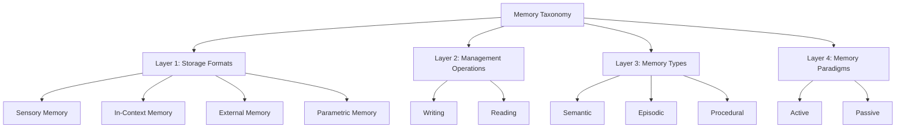
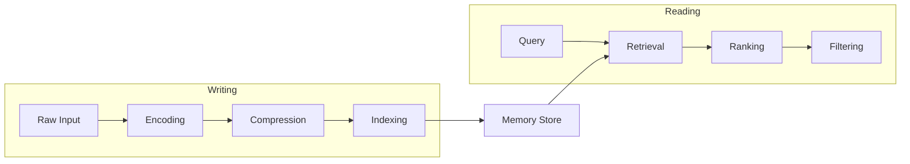

本記事は [https://arxiv.org/abs/2603.07670](https://arxiv.org/abs/2603.07670) の解説記事です。

## 論文概要（Abstract）

大規模言語モデル（LLM）が自律エージェントとして複雑な長期タスクを遂行する場面が増えている。こうしたエージェントにとって、過去の経験を蓄積・保持・活用する**メモリ機構**は不可欠な認知能力である。本サーベイは、LLMエージェントのメモリシステムを**4層タクソノミー**（ストレージ形式・管理操作・メモリタイプ・メモリパラダイム）として体系化し、Knowledge Injection・Long-Term Retention・Cross-Session Continuityの3軸にわたって既存研究を包括的に整理している。さらに評価ベンチマークの横断比較、Memory Hallucination・Multi-Agent Coordination・Privacyなどの未解決課題、およびNeuromorphic IntegrationやSelf-Evolving Memoryといった将来方向を議論している。

この記事は [Zenn記事: Bedrock AgentCoreで社内問い合わせエージェントを構築しメモリ永続化で精度向上](https://zenn.dev/0h_n0/articles/b7cddc45f56f1a) の深掘りです。

## 情報源

- **arXiv ID**: 2603.07670
- **URL**: [https://arxiv.org/abs/2603.07670](https://arxiv.org/abs/2603.07670)
- **著者**: Zirui Song (Peking Univ.), Yuan Feng (Tsinghua Univ.), Tianyi Tang (Peking Univ.), Ying Shen (Tsinghua Univ.)
- **発表年**: 2025
- **分野**: cs.AI, cs.CL, cs.LG

## 背景と動機（Background & Motivation）

LLMベースの自律エージェントは、単発のプロンプト応答から脱却し、ツール操作・計画立案・環境観察を組み合わせた複雑なタスクを長期にわたって遂行するシステムへと進化している。しかし、LLM単体のコンテキストウィンドウには物理的な上限があり、セッションをまたぐ情報保持は本質的に困難である。

著者らは、認知科学における人間の記憶モデル（感覚記憶・短期記憶・長期記憶）を参照しつつ、LLMエージェントのメモリ機構を統一的に整理する枠組みが存在しないことを課題として指摘している。既存研究はRAG（Retrieval-Augmented Generation）やKnowledge Graphへの統合など個別のアプローチに焦点を当てるものが多く、メモリシステム全体を俯瞰する体系的な分類が不足していた。

本サーベイの動機は、(1) 散在するメモリ関連研究を統一タクソノミーで整理すること、(2) 各アプローチの長所・短所を比較可能にすること、(3) 未解決の課題と将来方向を明確にすることにある。

## 主要な貢献（Key Contributions）

- **4層タクソノミーの提案**: ストレージ形式・管理操作・メモリタイプ・メモリパラダイムの4軸でメモリシステムを分類する統一的な枠組みを構築
- **3軸サーベイ**: Knowledge Injection、Long-Term Retention、Cross-Session Continuityの観点から既存システムを包括的にレビュー
- **評価ベンチマークの横断比較**: MemoryBench、LongBench、LaMP、LoCoMoなど主要ベンチマークの特性と限界を整理
- **未解決課題と将来方向の提示**: Memory Hallucination、Multi-Agent Coordination、Privacy、Neuromorphic Integrationなどの研究フロンティアを明示

## 技術的詳細: 4層タクソノミー

本サーベイの中核は、LLMエージェントのメモリ機構を4つのレイヤーで分類するタクソノミーである。以下の図にその全体構造を示す。



### Layer 1: Storage Formats（ストレージ形式）

著者らは、メモリの物理的な保持場所に基づいて4つの形式を区別している。

**Sensory Memory（感覚記憶）** は、エージェントが環境から取得した生データ（テキスト、画像、環境観察結果など）を一時的に保持するバッファである。認知科学における感覚記憶に対応し、処理前の生の入力を短時間だけ維持する。マルチモーダルエージェントにおいては、視覚的観察やAPIレスポンスなどがここに該当する。

**In-Context Memory（コンテキスト内記憶）** は、LLMのコンテキストウィンドウ内に直接配置される情報である。認知科学の作業記憶（Working Memory）に対応する。プロンプトに含まれる会話履歴、システム指示、Few-shot例などがこれにあたる。アクセス速度は最速だが、コンテキスト長 $L$ の制約を受ける。

$$
\text{In-Context Memory} \subseteq \{t_1, t_2, \ldots, t_L\}
$$

ここで $t_i$ はトークン、$L$ はモデルのコンテキストウィンドウ長である。

**External Memory（外部記憶）** は、コンテキストウィンドウの外部に置かれたストレージを指す。具体的には以下のようなシステムが含まれる。

| 形式 | 代表例 | 特徴 |
|------|--------|------|
| ベクトルストア | FAISS, Pinecone, Chroma | 密ベクトル検索。意味的類似度で検索可能 |
| Knowledge Graph | Neo4j, Amazon Neptune | 構造化された関係表現。推論に適する |
| リレーショナルDB | PostgreSQL, DynamoDB | 構造化データの正確な検索 |
| Key-Valueストア | Redis, Memcached | 高速アクセス。セッション情報の保持に適する |

外部記憶の容量は理論上無制限だが、検索の精度と遅延がボトルネックとなる。

**Parametric Memory（パラメトリック記憶）** は、モデルの重み $\theta$ にエンコードされた知識である。事前学習やFine-tuningによって獲得され、推論時に暗黙的に利用される。

$$
p(y \mid x) = f(x; \theta)
$$

ここで $x$ は入力、$y$ は出力、$\theta$ はモデルパラメータ、$f$ はモデルの関数表現である。パラメトリック記憶は更新コストが高い（再学習が必要）が、推論時の追加レイテンシがない点が利点である。

### Layer 2: Management Operations（管理操作）

メモリの管理操作は、大きく**Writing（書き込み）**と**Reading（読み出し）**に分かれる。

#### Writing操作

書き込みは3つのサブプロセスから構成される。

1. **Encoding（符号化）**: 生情報をメモリ表現に変換する。テキストを埋め込みベクトルに変換するembeddingや、会話をエピソードとして構造化する処理が該当する。

   $$
   \mathbf{e} = \text{Encode}(m)
   $$

   ここで $m$ は元の情報、$\mathbf{e}$ はエンコード後のメモリ表現である。

2. **Compression（圧縮）**: メモリ容量の効率化のため、情報を要約・集約する。会話履歴の要約生成やエピソードの統合がこれにあたる。

   $$
   m_{\text{compressed}} = \text{Compress}(m_1, m_2, \ldots, m_k)
   $$

3. **Indexing（索引付け）**: 後の検索を効率化するため、メモリにメタデータやインデックスを付与する。時間スタンプ、トピックタグ、重要度スコアなどが付与される。

#### Reading操作

読み出しも3つのサブプロセスから構成される。

1. **Retrieval（検索）**: クエリに基づいてメモリ候補を取得する。ベクトル類似度検索、キーワード検索、グラフ探索などが使われる。

   $$
   \mathcal{M}_{\text{candidates}} = \text{Retrieve}(q, \mathcal{M})
   $$

   ここで $q$ はクエリ、$\mathcal{M}$ はメモリストア全体である。

2. **Ranking（ランキング）**: 取得した候補を関連性・重要度でスコアリングし、順位付けする。

   $$
   \text{score}(m_i) = \alpha \cdot \text{relevance}(m_i, q) + \beta \cdot \text{recency}(m_i) + \gamma \cdot \text{importance}(m_i)
   $$

   ここで $\alpha, \beta, \gamma$ は重み係数であり、関連性・新しさ・重要度のトレードオフを制御する。この式は、Generative Agentsで提案された記憶検索スコアリングに類似する設計である。

3. **Filtering（フィルタリング）**: コンテキストウィンドウの制約やタスクの要件に基づき、最終的にプロンプトに含めるメモリを選別する。



### Layer 3: Memory Types（メモリタイプ）

認知科学の長期記憶分類に対応して、著者らは3つのメモリタイプを定義している。

**Semantic Memory（意味記憶）** は、世界に関する一般的な知識を保持する。概念の定義、事実関係、エンティティ間の関連性などが含まれる。Knowledge Graphの形式で保持されることが多く、RAGにおけるドキュメントチャンクもこのカテゴリに該当する。

**Episodic Memory（エピソード記憶）** は、特定の過去イベントの記録である。いつ・どこで・何が起きたかというコンテキスト情報を含む。Generative Agents（Park et al., 2023）のメモリストリームが代表例であり、各エピソードには時間スタンプ、場所、関与したエンティティなどのメタデータが付与される。

**Procedural Memory（手続き記憶）** は、タスク実行の手順やスキルに関する知識である。ReActフレームワークにおけるアクションパターンや、エージェントが学習したツール使用手順がこれに該当する。従来のLLMシステムでは明示的な手続き記憶の実装は比較的少なく、著者らは今後の研究課題として指摘している。

| メモリタイプ | 内容 | 認知科学対応 | 実装例 |
|-------------|------|-------------|--------|
| Semantic | 一般知識・概念・事実 | 意味記憶 | RAGのドキュメントストア、KG |
| Episodic | 特定イベントの記録 | エピソード記憶 | Generative Agentsのメモリストリーム |
| Procedural | タスク手順・スキル | 手続き記憶 | ReActのアクションパターン |

### Layer 4: Memory Paradigms（メモリパラダイム）

メモリの管理主体に基づき、2つのパラダイムが区別される。

**Active Memory（能動的メモリ）** では、エージェント自身がいつ何を保存するか、いつ何を検索するか、何を忘却するかを明示的に決定する。MemGPT（Packer et al., 2023）が代表例であり、LLMがOS的なメモリ管理を行い、メイン・コンテキスト（作業記憶）とアーカイバル・ストレージ（長期記憶）間でデータを明示的に移動する。

```python
class ActiveMemoryAgent:
    """Active Memoryパラダイムの概念的な実装"""

    def __init__(self, llm, memory_store):
        self.llm = llm
        self.working_memory: list[str] = []  # コンテキスト内
        self.archive: MemoryStore = memory_store  # 外部ストレージ

    def decide_and_store(self, observation: str) -> None:
        """エージェントが保存判断を行う"""
        importance = self.llm.evaluate_importance(observation)
        if importance > THRESHOLD:
            encoded = self.llm.summarize(observation)
            self.archive.write(encoded, metadata={"timestamp": now()})

    def decide_and_retrieve(self, query: str) -> list[str]:
        """エージェントが検索判断を行う"""
        candidates = self.archive.search(query, top_k=10)
        ranked = self.llm.rank_by_relevance(candidates, query)
        return ranked[:MAX_CONTEXT_ITEMS]
```

**Passive Memory（受動的メモリ）** では、メモリの蓄積と利用が暗黙的に行われる。コンテキストウィンドウに追加される会話履歴（自動的に蓄積）や、Fine-tuningによるパラメトリック記憶の更新（暗黙的な知識埋め込み）がこのパラダイムに該当する。

著者らは、実際のシステムではActiveとPassiveが組み合わされることが多いと指摘している。たとえば、会話履歴は受動的に蓄積される（Passive）一方、重要なエピソードの明示的な保存は能動的に行われる（Active）というハイブリッド構成である。

## サーベイ3軸の詳細

### 1. Knowledge Injection（知識注入）

外部知識をLLMに注入する手法として、以下の3つのアプローチが整理されている。

**RAG（Retrieval-Augmented Generation）** は、外部ドキュメントストアから関連情報を検索し、プロンプトに追加する手法である。LLMの知識カットオフを補い、ハルシネーションを低減する効果がある。著者らは、RAGの課題としてチャンク分割の粒度、埋め込みモデルの品質、検索と生成の整合性を挙げている。

**Knowledge Graph統合** は、構造化された知識表現をLLMと組み合わせる手法である。エンティティ間の関係性を明示的に保持できるため、推論タスクでの正確性向上が期待できる。ただし、KGの構築・維持コストが課題となる。

**Fine-tuning** は、ドメイン固有の知識をモデル重みに直接埋め込む手法である。推論時の追加検索が不要だが、知識の更新にはモデルの再学習が必要となる。

### 2. Long-Term Retention（長期保持）

セッション内で長期的に情報を保持する手法として以下が議論されている。

**Episodic Memory Systems** は、過去のインタラクションを構造化して保持する。Generative Agents（Park et al., 2023）の実装では、各メモリエントリに重要度スコア・新しさ・関連度の3指標を組み合わせた検索が行われる。

**Summarization（要約）** は、長い会話履歴を圧縮して保持する手法である。RecursiveSummarizationMemory（LangChain実装）のように、履歴が一定長を超えると自動的に要約が生成される。

**Memory Consolidation（記憶固定）** は、人間の睡眠中の記憶固定プロセスに着想を得た手法で、重要なメモリを選択的に強化し、不要なメモリを忘却する。

### 3. Cross-Session Continuity（セッション間継続性）

複数セッションにまたがる情報の継続性を実現する手法として以下が議論されている。

**Persistent Storage** は、外部データベースにメモリを永続化する直接的な手法である。AWS Bedrock AgentCoreのメモリ永続化機能はこのカテゴリに該当し、DynamoDBなどにエージェントのセッション情報を保持する。

**User Profiling** は、ユーザーの嗜好や過去のインタラクションパターンをプロファイルとして蓄積する。LaMP（Salemi et al., 2024）ベンチマークがこのカテゴリの評価に用いられる。

**State Management** は、タスクの進行状態を明示的に管理する手法であり、マルチステップタスクの中断・再開を可能にする。

## 各メモリシステムの実装パターン比較

サーベイ対象の代表的システムについて、タクソノミーの観点から比較を行う。

| システム | Storage Format | Memory Type | Paradigm | 主な手法 |
|---------|---------------|-------------|----------|---------|
| MemGPT | In-Context + External | Episodic + Semantic | Active | OS的メモリ管理、ページング |
| Generative Agents | External (DB) | Episodic | Active | 重要度+新しさ+関連度スコアリング |
| RAG (一般) | External (Vector) | Semantic | Passive | 埋め込み類似度検索 |
| LangChain Memory | In-Context + External | Episodic + Semantic | Hybrid | Buffer/Summary/KG等の選択式 |
| RAISE | External (KG) | Semantic + Procedural | Active | KGベースの知識検索+推論 |
| Reflexion | In-Context | Episodic + Procedural | Active | 自己反省による経験蓄積 |
| Voyager | External (Code DB) | Procedural | Active | スキルライブラリの自動構築 |

### 実装パターンの選択指針

著者らの分析を基に、各パターンの適用場面を整理する。

**In-Context Memory中心のパターン**は、会話の文脈を維持するだけでよいシンプルなシナリオに適する。実装が容易で遅延も小さいが、コンテキスト長の制約を直接受ける。

**External Memory + RAGパターン**は、大量のドキュメントや過去の会話から関連情報を検索するシナリオに適する。スケーラビリティに優れるが、検索精度がシステム全体の性能を左右する。

**KG統合パターン**は、エンティティ間の関係推論が重要なシナリオに適する。構造化された知識表現により、マルチホップ推論が可能になるが、KGの構築・保守コストが高い。

**Hybrid（Active + Passive）パターン**は、長期間のタスク遂行が求められるシナリオに適する。MemGPTのように、エージェント自身がメモリ管理を行うことで、コンテキストウィンドウの制約を動的に克服する。

## ベンチマーク横断レビュー

著者らは、LLMエージェントのメモリ能力を評価する主要ベンチマークを以下のように整理している。

| ベンチマーク | 評価対象 | 主なメトリクス | 特徴 |
|-------------|---------|---------------|------|
| MemoryBench | メモリ管理能力全般 | Accuracy, F1 | メモリの書込・読出・更新を総合評価 |
| LongBench | 長文脈理解 | ROUGE, F1 | 4k-100k+トークンの長文処理能力 |
| LaMP | パーソナライゼーション | Accuracy, ROUGE | ユーザープロファイルに基づく応答適応 |
| LoCoMo | 長期会話メモリ | F1, BLEU | セッション間のメモリ一貫性 |

著者らは、既存ベンチマークにおける以下の限界を指摘している。

1. **メモリタイプのカバレッジ不足**: 多くのベンチマークはSemantic Memoryの評価に偏り、Procedural Memoryの評価が不十分
2. **動的メモリ管理の評価困難**: 書き込み・更新・忘却といった動的操作の評価基準が未確立
3. **マルチエージェント環境への未対応**: 複数エージェント間のメモリ共有・整合性を評価するベンチマークが不足
4. **実世界タスクとのギャップ**: ベンチマークタスクと実際のエージェント運用シナリオの乖離

評価メトリクスについて、著者らはタスク依存の指標（Accuracy, ROUGE, BLEU, F1）に加え、メモリ固有のメトリクスとしてMemory Precision（検索されたメモリのうち関連するものの割合）、Memory Recall（関連メモリのうち検索できたものの割合）、Memory Staleness（古いメモリが不適切に使われる頻度）を提案している。

## 未解決課題（Key Challenges）

### Memory Hallucination（メモリハルシネーション）

LLMが実際には保存されていない情報を「記憶している」と誤って生成する問題である。著者らは、これがパラメトリック記憶と外部記憶の不整合から生じる場合と、検索されたメモリをLLMが誤解釈する場合があると分析している。既存のRAGシステムでも、検索結果の文脈から逸脱した回答を生成する事例が報告されており、メモリの信頼性を保証する仕組みが求められている。

### Multi-Agent Coordination（マルチエージェント協調）

複数のエージェントが共有メモリにアクセスする場合、以下の課題が生じる。

- **一貫性**: あるエージェントがメモリを更新した際、他のエージェントがその更新を適切に反映できるか
- **競合**: 同時書き込みによるメモリの矛盾
- **選択的共有**: どのメモリを他のエージェントと共有し、どのメモリを個人的に保持するか

### Privacy（プライバシー）

エージェントがユーザーの個人情報をメモリに蓄積する場合、パーソナライゼーションの精度とプライバシー保護のトレードオフが生じる。著者らは、差分プライバシーの適用やメモリの選択的忘却（right to be forgotten）といったアプローチの研究が必要であると指摘している。

### Long-Horizon Reasoning（長期推論）

タスクが長期にわたる場合、蓄積されたメモリの整合性を維持することが困難になる。メモリの更新履歴の追跡、矛盾する情報の検出と解決、時間経過に伴うメモリの陳腐化への対処が求められる。

## Emerging Frontiers（将来の研究方向）

### Neuromorphic Integration（神経形態学的統合）

人間の脳の記憶メカニズム（海馬の記憶固定、新皮質への転送など）をLLMエージェントに取り入れるアプローチである。著者らは、スパイキングニューラルネットワークとの統合や、睡眠中の記憶再生に相当するオフライン処理の可能性を議論している。

### Self-Evolving Memory（自己進化メモリ）

エージェントのメモリシステム自体がタスク経験を通じて進化する仕組みである。メモリの構造やインデックス戦略がタスクの特性に応じて自動的に最適化される。メタ学習的なアプローチにより、メモリ管理ポリシー自体を学習する研究が今後期待されている。

### Memory Compression（メモリ圧縮）

コンテキストウィンドウの制約を克服するため、メモリの効率的な圧縮技術が求められている。情報損失を最小化しつつ、保持する情報量を最大化する圧縮アルゴリズムの開発が課題である。

### Cross-Modal Memory（クロスモーダルメモリ）

テキスト・画像・音声・動画など異なるモダリティにまたがるメモリの統合管理である。マルチモーダルLLMの発展に伴い、モダリティ間の整合性を保ちながらメモリを管理する仕組みの重要性が増している。

## 実運用への応用（Practical Applications）

本サーベイの知見は、Zenn記事で取り上げたBedrock AgentCoreのメモリ永続化と直接的に関連する。

**AWS Bedrock AgentCoreとの対応**: AgentCoreのメモリ永続化機能は、本サーベイのタクソノミーにおいてExternal Memory（Layer 1）+ Episodic/Semantic Memory（Layer 3）+ Active Paradigm（Layer 4）に位置づけられる。DynamoDBへのセッション情報の永続化はPersistent Storage（Cross-Session Continuity軸）に該当する。

**プロダクション視点での示唆**:

- **メモリストレージの選択**: 社内問い合わせエージェントの場合、FAQ的な知識はSemantic Memory（KGまたはベクトルストア）、過去の問い合わせ履歴はEpisodic Memory（DynamoDB）として管理することが有効
- **検索スコアリングの設計**: 著者らが整理した関連度・新しさ・重要度の3指標に基づくスコアリングは、社内問い合わせの文脈でも有用。最新の社内規程変更は新しさで優先し、頻出質問は重要度で優先するといった戦略が考えられる
- **メモリ圧縮の適用**: 長期運用で蓄積される問い合わせ履歴の要約・圧縮は、ストレージコストとレイテンシの両面で重要

## サーベイ対象システムの比較表（関連研究）

| 研究 | 年 | 主な貢献 | メモリ形式 | 対象タスク |
|------|-----|---------|-----------|-----------|
| Generative Agents (Park et al.) | 2023 | エピソード記憶 + リフレクション | External DB | シミュレーション |
| MemGPT (Packer et al.) | 2023 | OS的メモリ管理 | In-Context + External | 対話・QA |
| Reflexion (Shinn et al.) | 2023 | 自己反省による経験蓄積 | In-Context | 推論・コーディング |
| Voyager (Wang et al.) | 2023 | スキルライブラリ自動構築 | External Code DB | ゲーム（Minecraft） |
| RAISE (Shao et al.) | 2024 | KGベース記憶推論 | External KG | 知識推論 |
| A-MEM (Xu et al.) | 2025 | Zettelkasten式自律メモリ | External (Structured Notes) | 長期記憶 |
| LaMP (Salemi et al.) | 2024 | パーソナライゼーション評価 | External (Profile) | ユーザー適応 |

各システムは異なるLayer 1（Storage Format）とLayer 4（Paradigm）の組み合わせを採用しており、タスク要件に応じた設計選択がなされている。著者らは、単一のアプローチが全てのシナリオに最適ということはなく、タスクの特性（対話の長さ、知識の種類、マルチエージェントの有無など）に応じた選択が重要であると結論づけている。

## まとめと今後の展望

本サーベイは、LLMエージェントのメモリ機構を4層タクソノミーという統一的な枠組みで整理した点に大きな意義がある。ストレージ形式・管理操作・メモリタイプ・メモリパラダイムの4軸による分類は、既存システムの位置づけを明確にし、新たなシステム設計の指針を提供する。

実務への示唆として、AWS Bedrock AgentCoreのようなマネージドサービスにおいても、本サーベイのタクソノミーに基づいてメモリ設計を行うことで、より効果的なエージェントの構築が期待できる。特に、Active/Passiveパラダイムの使い分けと、Semantic/Episodic/Proceduralの3種メモリの適切な組み合わせは、社内問い合わせエージェントのようなプロダクションシステムにおいて実用的な設計指針となる。

今後の研究方向として、著者らが指摘するMemory HallucinationやMulti-Agent Coordinationの課題は、プロダクション環境での信頼性に直結する。これらの課題への対処法が確立されることで、LLMエージェントのメモリシステムはさらに堅牢なものとなるだろう。

## 参考文献

- **arXiv**: [https://arxiv.org/abs/2603.07670](https://arxiv.org/abs/2603.07670)
- **Related Zenn article**: [https://zenn.dev/0h_n0/articles/b7cddc45f56f1a](https://zenn.dev/0h_n0/articles/b7cddc45f56f1a)
