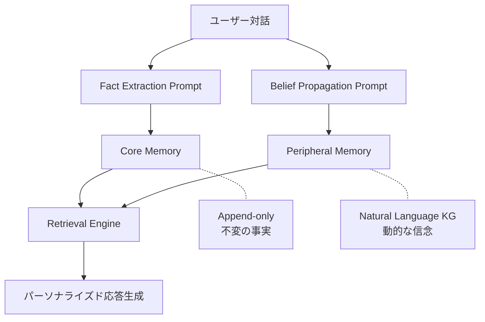
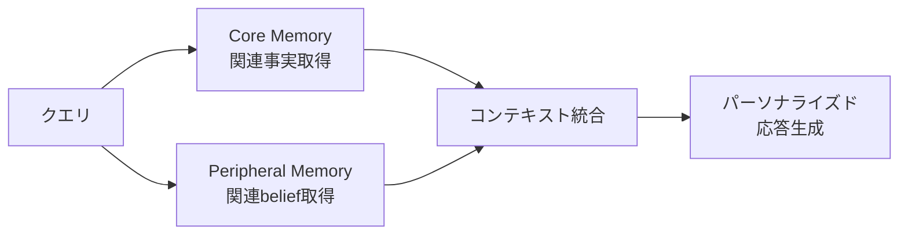

本記事は [MemMachine: A Ground-Truth-Preserving Memory System for Personalized AI Agents](https://arxiv.org/abs/2604.04853)（Al-Omari et al., 2025）の解説記事です。

## 論文概要（Abstract）

AIモデルがstatelessなエンジンからstatefulなエージェントへと進化する中で、対話履歴を跨いでユーザーの情報を保持・活用するメモリシステムの構築が重要な課題となっています。既存のメモリシステムはappend-onlyの蓄積や周期的なサマリー生成に依存しており、ユーザーに関する「否定できない事実（factual ground truth）」が上書き・要約の過程で破壊されるリスクがあります。MemMachineは、不変のCore Memoryとbelief propagationで進化するPeripheral Memory（自然言語ナレッジグラフ）の2層構造により、事実の正確性を保護しつつ柔軟なパーソナライゼーションを実現するメモリシステムです。

この記事は [Zenn記事: Bedrock AgentCoreで社内問い合わせエージェントを構築しメモリ永続化で精度向上](https://zenn.dev/0h_n0/articles/b7cddc45f56f1a) の深掘りです。Zenn記事ではBedrock AgentCoreのメモリ永続化機能を活用した社内エージェント構築を解説していますが、本記事ではその基盤となる「エージェントメモリの設計思想」をMemMachine論文を通じて掘り下げます。

## 情報源

- **arXiv ID**: 2604.04853
- **URL**: [https://arxiv.org/abs/2604.04853](https://arxiv.org/abs/2604.04853)
- **著者**: Hani Al-Omari, Muath Alzghool, Salim Sazzed（Old Dominion University）
- **発表年**: 2025年4月
- **分野**: cs.AI, cs.CL

## 背景と動機（Background & Motivation）

LLMベースのAIエージェントが実用化されるにつれ、複数セッションにまたがるユーザー情報の管理が重要性を増しています。著者らは既存のメモリシステムにおける根本的な問題を以下のように整理しています。

1. **Append-only方式の限界**: MemGPT（Packer et al., 2023）のようなappend-only方式は会話履歴の蓄積に伴いメモリが肥大化し、関連情報の検索効率が低下する
2. **サマリーによる事実の喪失**: 周期的なサマリー生成は、ユーザーの名前・職業・居住地といった「否定できない事実」を要約の過程で欠落・歪曲するリスクがある
3. **信念と事実の混同**: ユーザーの好み・意見（時間とともに変化する「belief」）と、変化しない事実（「fact」）を区別せずに管理すると、古い好みが事実として固定されたり、逆に事実が更新されてしまう

著者らはこの課題を「factual ground truthの保護」と定義し、事実と信念を明示的に分離して管理するアーキテクチャの必要性を主張しています。

## 主要な貢献（Key Contributions）

- **2層メモリアーキテクチャ**: 不変の事実を保存するCore Memoryと、動的な信念をナレッジグラフで管理するPeripheral Memoryの分離設計
- **Belief propagation機構**: 新情報に基づいてKGのエッジを更新・削除・追加するプロンプトベースの信念伝播メカニズム
- **LLM非依存性**: Claude 3.5 Sonnet、GPT-4o、Gemini 1.5 Proの3つのLLMで動作を実証
- **既存システムへのアドオン互換性**: MemoryOS等の既存メモリシステムに追加レイヤーとして統合可能であることを実験的に示した

## 技術的詳細（Technical Details）

### アーキテクチャ全体像

MemMachineの2層メモリアーキテクチャは以下の構造を持ちます。



### Core Memory: 不変の事実の保護

Core Memoryはユーザーに関する「否定できない事実」を保存する不変ストアです。著者らはfact extraction promptを用いて、対話履歴から以下のような事実を自然言語センテンスとして抽出します。

**抽出される事実の例**:
- 「ユーザーの名前はAliceである」
- 「ユーザーはOld Dominion Universityの学生である」
- 「ユーザーはナッツアレルギーを持っている」

Core Memoryの設計原則は以下の通りです。

1. **Append-only**: 一度保存された事実は上書き・削除できない
2. **自然言語表現**: 構造化データではなく自然言語センテンスとして保存し、LLMによる検索・活用を容易にする
3. **セッション横断的蓄積**: 各セッション終了時に新たな事実が追加される

形式的には、Core Memory $\mathcal{C}$ はセッション $t$ において以下のように更新されます。

$$
\mathcal{C}_{t} = \mathcal{C}_{t-1} \cup \text{Extract}(D_t)
$$

ここで、
- $\mathcal{C}_t$: セッション $t$ 終了時のCore Memory
- $D_t$: セッション $t$ の対話履歴
- $\text{Extract}(\cdot)$: LLMによるfact extraction関数

重要な点として、$\mathcal{C}$ に対する削除操作 $\setminus$ は定義されておらず、集合は単調増加のみが許可されます。

### Peripheral Memory: 動的な信念のナレッジグラフ

Peripheral Memoryはユーザーの好み・意見・状態といった「時間とともに変化しうる信念（belief）」を管理します。著者らはこれを自然言語ナレッジグラフ（Natural Language KG）として実装しています。

KGは $(s, r, o)$ トリプル（subject, relation, object）で構成されます。

**トリプルの例**:
- `(Alice, prefers_cuisine, Italian)`
- `(Alice, current_project, machine_learning_thesis)`
- `(Alice, dislikes, cold_weather)`

#### Belief Propagation

新しい対話から得られた情報に基づき、belief propagation promptがKGのエッジを以下の3操作で更新します。

1. **UPDATE**: 既存エッジの object を新しい値で上書き（例: `prefers_cuisine: Italian → Japanese`）
2. **DELETE**: 無効になったエッジを削除
3. **ADD**: 新しいトリプルを追加

形式的には、セッション $t$ でのPeripheral Memory $\mathcal{P}$ の更新は以下の通りです。

$$
\mathcal{P}_t = (\mathcal{P}_{t-1} \setminus \mathcal{D}_t) \cup \mathcal{U}_t \cup \mathcal{A}_t
$$

ここで、
- $\mathcal{P}_t$: セッション $t$ 終了時のPeripheral Memory（KGエッジの集合）
- $\mathcal{D}_t$: 削除されるエッジの集合
- $\mathcal{U}_t$: 更新されるエッジの集合（古いエッジの削除と新しいエッジの追加を包含）
- $\mathcal{A}_t$: 新規追加されるエッジの集合

Core Memoryとの対比が重要です。Core Memoryが $\cup$ のみを許可するのに対し、Peripheral Memoryは $\setminus$（削除）を含む完全なCRUD操作をサポートします。この設計により、ユーザーの好みの変化を反映しつつ、事実は不変に保護されます。

#### 矛盾解消

Peripheral Memory内で矛盾が発生した場合、belief propagationプロンプトが新しい情報を優先してエッジを上書きします。例えば、ユーザーが「最近はイタリアンよりも和食が好きになった」と発言した場合、`prefers_cuisine` のobjectが `Italian` から `Japanese` に更新されます。

### Retrieval機構

クエリ受信時のRetrieval processは以下の手順で動作します。



1. **Core Memoryからの事実取得**: クエリに関連する不変の事実を検索（例: アレルギー情報、居住地）
2. **Peripheral Memoryからの信念取得**: クエリに関連する動的な好み・状態を検索（例: 好きな料理、現在のプロジェクト）
3. **コンテキスト統合**: 両方のメモリから取得した情報を統合し、LLMのプロンプトに注入
4. **応答生成**: 統合されたコンテキストに基づいてパーソナライズされた応答を生成

著者らは、Core Memoryの情報がPeripheral Memoryの信念と矛盾する場合、Core Memory（事実）が優先されると述べています。

### アルゴリズム

以下はMemMachineのセッション更新処理の擬似コードです。

```python
from dataclasses import dataclass, field

@dataclass
class Triple:
    """Peripheral Memoryのナレッジグラフエッジ

    Attributes:
        subject: エンティティ（例: "Alice"）
        relation: 関係（例: "prefers_cuisine"）
        obj: オブジェクト（例: "Italian"）
    """
    subject: str
    relation: str
    obj: str

@dataclass
class MemMachine:
    """MemMachineメモリシステム

    Core Memory: append-onlyの不変事実ストア
    Peripheral Memory: belief propagationで更新されるKG
    """
    core_memory: list[str] = field(default_factory=list)
    peripheral_memory: list[Triple] = field(default_factory=list)

    def update_session(self, dialogue: list[dict[str, str]], llm) -> None:
        """セッション終了時のメモリ更新

        Args:
            dialogue: セッションの対話履歴
            llm: LLMインスタンス（fact/belief抽出に使用）
        """
        # Phase 1: Core Memory更新（append-only）
        new_facts = llm.extract_facts(dialogue)
        self.core_memory.extend(new_facts)  # 削除不可、追加のみ

        # Phase 2: Peripheral Memory更新（belief propagation）
        operations = llm.belief_propagation(
            dialogue=dialogue,
            existing_kg=self.peripheral_memory,
        )
        for op in operations:
            if op.type == "DELETE":
                self.peripheral_memory = [
                    t for t in self.peripheral_memory
                    if not (t.subject == op.triple.subject
                            and t.relation == op.triple.relation)
                ]
            elif op.type == "UPDATE":
                self.peripheral_memory = [
                    t for t in self.peripheral_memory
                    if not (t.subject == op.triple.subject
                            and t.relation == op.triple.relation)
                ]
                self.peripheral_memory.append(op.triple)
            elif op.type == "ADD":
                self.peripheral_memory.append(op.triple)

    def retrieve(self, query: str, llm) -> dict[str, list]:
        """クエリに関連するメモリを取得

        Args:
            query: ユーザーのクエリ
            llm: LLMインスタンス（関連性判定に使用）

        Returns:
            facts（Core Memory）とbeliefs（Peripheral Memory）の辞書
        """
        relevant_facts = llm.retrieve_relevant(
            query=query, memory=self.core_memory
        )
        relevant_beliefs = llm.retrieve_relevant_triples(
            query=query, kg=self.peripheral_memory
        )
        return {"facts": relevant_facts, "beliefs": relevant_beliefs}
```

### 既存システムへのアドオン互換性

MemMachineの重要な特徴として、既存のメモリシステム（MemoryOS, COMEDY等）に対するアドオンとして機能する点が挙げられます。著者らは、既存システムのメモリ管理レイヤーの上にMemMachineの2層構造を追加することで、既存システムの性能を向上させられることを実験的に示しています。

## 実装のポイント（Implementation）

MemMachineはプロンプトエンジニアリングベースの実装であり、外部モデルの学習やファインチューニングを必要としません。実装上の主要なポイントは以下の通りです。

1. **Fact extraction promptの設計**: ユーザーの対話から「否定できない事実」のみを抽出するプロンプトの品質がCore Memoryの精度を決定する。過度に広い抽出（好みを事実として抽出）や過度に狭い抽出（重要な事実の見逃し）を避ける必要がある
2. **Belief propagation promptの設計**: 既存KGの状態を入力として受け取り、ADD/UPDATE/DELETE操作を正確に出力するプロンプトが必要。特に矛盾検出と解消のロジックをプロンプト内で表現する
3. **KGの肥大化対策**: セッションを重ねるとPeripheral MemoryのKGが肥大化し、検索効率が低下する。著者ら自身もこの点を制約として認めている
4. **LLM APIコスト**: 各セッション終了時にfact extraction + belief propagationの2回のLLM呼び出しが発生し、クエリ時にも検索用のLLM呼び出しが必要

## Production Deployment Guide

MemMachineはプロンプトベースの実装でありLLM非依存のため、AWS上でのプロダクション環境構築が比較的容易です。以下にトラフィック量別の構成を示します。

### AWS実装パターン（コスト最適化重視）

**注意**: 以下のコスト試算は2026年5月時点のAWS ap-northeast-1（東京）リージョン料金に基づく概算値です。実際のコストはトラフィックパターン、リージョン、バースト使用量により変動します。最新料金はAWS料金計算ツールで確認を推奨します。

| 構成 | トラフィック | 主要サービス | 月額概算 |
|------|-------------|-------------|---------|
| Small | ~100 req/日 | Lambda + Bedrock + DynamoDB | $50-150 |
| Medium | ~1,000 req/日 | ECS Fargate + Bedrock + DynamoDB | $300-800 |
| Large | 10,000+ req/日 | EKS + Karpenter + Spot + ElastiCache | $2,000-5,000 |

**Small構成（~100 req/日）**: Lambda関数でMemMachineのメモリ更新・検索ロジックを実行。Core MemoryとPeripheral Memory（KGトリプル）はDynamoDBに保存。Bedrockでfact extraction / belief propagation / 応答生成を実行。月額内訳: Lambda $5, DynamoDB On-Demand $10-20, Bedrock（Claude 3.5 Sonnet相当） $30-120。

**Medium構成（~1,000 req/日）**: ECS Fargateでアプリケーションサーバーを常駐化。DynamoDBのProvisioned Capacityモードで安定したスループット確保。Bedrock Batch APIを活用し非リアルタイムのメモリ更新コストを50%削減。月額内訳: ECS Fargate $80-150, DynamoDB $50-100, Bedrock $150-500。

**Large構成（10,000+ req/日）**: EKS + Karpenter + Spot Instancesで自動スケーリング。ElastiCache（Redis）でKGトリプルの高速検索キャッシュ。DynamoDBをバックエンドストアとして永続化。月額内訳: EKS $200, Spot Instances $300-800, ElastiCache $200-400, DynamoDB $300-500, Bedrock $1,000-3,000。

**コスト削減テクニック**:
- Spot Instances活用でEKSノードコストを最大90%削減
- Reserved Instances（1年コミット）でECS/EKS基盤コストを最大72%削減
- Bedrock Batch API使用で非リアルタイム処理のLLMコストを50%削減
- Prompt Caching有効化でfact extraction / belief propagationプロンプトのコストを30-90%削減

### Terraformインフラコード

**Small構成（Serverless）**:

```hcl
# MemMachine Serverless構成（Lambda + DynamoDB + Bedrock）
# 2026年5月時点の設定

terraform {
  required_version = ">= 1.9"
  required_providers {
    aws = {
      source  = "hashicorp/aws"
      version = "~> 5.80"
    }
  }
}

provider "aws" {
  region = "ap-northeast-1"
}

# --- DynamoDB: Core Memory（append-only事実ストア） ---
resource "aws_dynamodb_table" "core_memory" {
  name         = "memmachine-core-memory"
  billing_mode = "PAY_PER_REQUEST" # コスト最適化: On-Demand
  hash_key     = "user_id"
  range_key    = "fact_id"

  attribute {
    name = "user_id"
    type = "S"
  }
  attribute {
    name = "fact_id"
    type = "S"
  }

  point_in_time_recovery {
    enabled = true
  }

  server_side_encryption {
    enabled = true # KMS暗号化
  }

  tags = {
    Project   = "memmachine"
    Component = "core-memory"
  }
}

# --- DynamoDB: Peripheral Memory（KGトリプルストア） ---
resource "aws_dynamodb_table" "peripheral_memory" {
  name         = "memmachine-peripheral-memory"
  billing_mode = "PAY_PER_REQUEST"
  hash_key     = "user_id"
  range_key    = "triple_id"

  attribute {
    name = "user_id"
    type = "S"
  }
  attribute {
    name = "triple_id"
    type = "S"
  }

  # GSI: subject検索用
  global_secondary_index {
    name            = "subject-index"
    hash_key        = "user_id"
    range_key       = "triple_id"
    projection_type = "ALL"
  }

  server_side_encryption {
    enabled = true
  }

  tags = {
    Project   = "memmachine"
    Component = "peripheral-memory"
  }
}

# --- IAMロール: Lambda実行用（最小権限） ---
resource "aws_iam_role" "lambda_exec" {
  name = "memmachine-lambda-exec"

  assume_role_policy = jsonencode({
    Version = "2012-10-17"
    Statement = [{
      Action = "sts:AssumeRole"
      Effect = "Allow"
      Principal = { Service = "lambda.amazonaws.com" }
    }]
  })
}

resource "aws_iam_role_policy" "lambda_policy" {
  name = "memmachine-lambda-policy"
  role = aws_iam_role.lambda_exec.id

  policy = jsonencode({
    Version = "2012-10-17"
    Statement = [
      {
        Effect = "Allow"
        Action = [
          "dynamodb:GetItem", "dynamodb:PutItem",
          "dynamodb:Query", "dynamodb:DeleteItem",
          "dynamodb:UpdateItem"
        ]
        Resource = [
          aws_dynamodb_table.core_memory.arn,
          aws_dynamodb_table.peripheral_memory.arn,
          "${aws_dynamodb_table.peripheral_memory.arn}/index/*"
        ]
      },
      {
        Effect   = "Allow"
        Action   = ["bedrock:InvokeModel"]
        Resource = ["arn:aws:bedrock:ap-northeast-1::foundation-model/*"]
      },
      {
        Effect = "Allow"
        Action = [
          "logs:CreateLogGroup", "logs:CreateLogStream",
          "logs:PutLogEvents"
        ]
        Resource = ["arn:aws:logs:*:*:*"]
      }
    ]
  })
}

# --- Lambda関数 ---
resource "aws_lambda_function" "memmachine" {
  function_name = "memmachine-handler"
  role          = aws_iam_role.lambda_exec.arn
  handler       = "handler.lambda_handler"
  runtime       = "python3.13"
  timeout       = 120 # Bedrock呼び出しを考慮
  memory_size   = 512

  filename = "lambda.zip"

  environment {
    variables = {
      CORE_MEMORY_TABLE       = aws_dynamodb_table.core_memory.name
      PERIPHERAL_MEMORY_TABLE = aws_dynamodb_table.peripheral_memory.name
      BEDROCK_MODEL_ID        = "anthropic.claude-sonnet-4-20250514"
    }
  }

  tracing_config {
    mode = "Active" # X-Ray有効化
  }

  tags = {
    Project = "memmachine"
  }
}

# --- CloudWatchアラーム: コスト監視 ---
resource "aws_cloudwatch_metric_alarm" "lambda_duration" {
  alarm_name          = "memmachine-lambda-high-duration"
  comparison_operator = "GreaterThanThreshold"
  evaluation_periods  = 3
  metric_name         = "Duration"
  namespace           = "AWS/Lambda"
  period              = 300
  statistic           = "p95"
  threshold           = 60000 # 60秒超過でアラート
  alarm_description   = "Lambda実行時間P95が60秒を超過"

  dimensions = {
    FunctionName = aws_lambda_function.memmachine.function_name
  }
}
```

**Large構成（Container）**:

```hcl
# MemMachine Container構成（EKS + Karpenter + Spot）
# 2026年5月時点の設定

module "eks" {
  source  = "terraform-aws-modules/eks/aws"
  version = "~> 20.31"

  cluster_name    = "memmachine-cluster"
  cluster_version = "1.32"

  vpc_id     = module.vpc.vpc_id
  subnet_ids = module.vpc.private_subnets

  cluster_endpoint_public_access = false # セキュリティ: プライベートのみ

  eks_managed_node_groups = {
    system = {
      instance_types = ["m7i.large"]
      min_size       = 2
      max_size       = 3
      desired_size   = 2
    }
  }

  tags = {
    Project = "memmachine"
  }
}

# --- Karpenter: Spot優先の自動スケーリング ---
resource "kubectl_manifest" "karpenter_nodepool" {
  yaml_body = yamlencode({
    apiVersion = "karpenter.sh/v1"
    kind       = "NodePool"
    metadata   = { name = "memmachine-spot" }
    spec = {
      template = {
        spec = {
          requirements = [
            { key = "karpenter.sh/capacity-type", operator = "In", values = ["spot", "on-demand"] },
            { key = "node.kubernetes.io/instance-type", operator = "In",
              values = ["m7i.xlarge", "m6i.xlarge", "m5.xlarge", "c7i.xlarge"] }
          ]
        }
      }
      limits   = { cpu = "100", memory = "400Gi" }
      disruption = {
        consolidationPolicy = "WhenEmptyOrUnderutilized"
        consolidateAfter    = "30s"
      }
    }
  })
}

# --- Secrets Manager: Bedrock設定 ---
resource "aws_secretsmanager_secret" "bedrock_config" {
  name        = "memmachine/bedrock-config"
  description = "MemMachine Bedrock configuration"

  tags = {
    Project = "memmachine"
  }
}

# --- AWS Budgets: 予算アラート ---
resource "aws_budgets_budget" "memmachine" {
  name         = "memmachine-monthly"
  budget_type  = "COST"
  limit_amount = "5000"
  limit_unit   = "USD"
  time_unit    = "MONTHLY"

  cost_filter {
    name   = "TagKeyValue"
    values = ["user:Project$memmachine"]
  }

  notification {
    comparison_operator       = "GREATER_THAN"
    threshold                 = 80
    threshold_type            = "PERCENTAGE"
    notification_type         = "FORECASTED"
    subscriber_email_addresses = ["alert@example.com"]
  }
}
```

### 運用・監視設定

**CloudWatch Logs Insights クエリ**:

```
# コスト異常検知: 1時間あたりのBedrock呼び出し回数
fields @timestamp, @message
| filter @message like /bedrock.*InvokeModel/
| stats count() as invocations by bin(1h)
| sort invocations desc

# レイテンシ分析: メモリ更新処理のP95/P99
fields @timestamp, duration_ms, operation
| filter operation in ["fact_extraction", "belief_propagation"]
| stats avg(duration_ms) as avg_ms,
        pct(duration_ms, 95) as p95_ms,
        pct(duration_ms, 99) as p99_ms
  by operation
```

**CloudWatchアラーム設定（Python）**:

```python
import boto3

cloudwatch = boto3.client("cloudwatch", region_name="ap-northeast-1")

def create_bedrock_token_alarm() -> None:
    """Bedrockトークン使用量スパイク検知アラームを作成"""
    cloudwatch.put_metric_alarm(
        AlarmName="memmachine-bedrock-token-spike",
        MetricName="InputTokenCount",
        Namespace="AWS/Bedrock",
        Statistic="Sum",
        Period=3600,
        EvaluationPeriods=1,
        Threshold=500000,
        ComparisonOperator="GreaterThanThreshold",
        AlarmActions=["arn:aws:sns:ap-northeast-1:ACCOUNT:memmachine-alerts"],
        Dimensions=[{"Name": "ModelId", "Value": "anthropic.claude-sonnet-4-20250514"}],
    )
```

**X-Rayトレーシング設定（Python）**:

```python
from aws_xray_sdk.core import xray_recorder, patch_all

# boto3自動計装
patch_all()

@xray_recorder.capture("memory_update")
def update_memory(user_id: str, dialogue: list[dict]) -> None:
    """メモリ更新処理をX-Rayでトレース

    Args:
        user_id: ユーザーID
        dialogue: セッション対話履歴
    """
    subsegment = xray_recorder.current_subsegment()
    subsegment.put_annotation("user_id", user_id)
    subsegment.put_metadata("dialogue_turns", len(dialogue))

    # Core Memory更新
    with xray_recorder.capture("fact_extraction"):
        facts = extract_facts(dialogue)

    # Peripheral Memory更新
    with xray_recorder.capture("belief_propagation"):
        operations = propagate_beliefs(dialogue)

    subsegment.put_metadata("facts_added", len(facts))
    subsegment.put_metadata("kg_operations", len(operations))
```

**Cost Explorer自動レポート（Python）**:

```python
import boto3
from datetime import datetime, timedelta

ce = boto3.client("ce", region_name="ap-northeast-1")
sns = boto3.client("sns", region_name="ap-northeast-1")

def daily_cost_report() -> dict:
    """日次コストレポートを取得しSNS通知

    Returns:
        Bedrock/Lambda/DynamoDBの日次コスト辞書
    """
    end = datetime.utcnow().strftime("%Y-%m-%d")
    start = (datetime.utcnow() - timedelta(days=1)).strftime("%Y-%m-%d")

    response = ce.get_cost_and_usage(
        TimePeriod={"Start": start, "End": end},
        Granularity="DAILY",
        Metrics=["UnblendedCost"],
        Filter={
            "Tags": {"Key": "Project", "Values": ["memmachine"]}
        },
        GroupBy=[{"Type": "DIMENSION", "Key": "SERVICE"}],
    )

    costs = {}
    for group in response["ResultsByTime"][0]["Groups"]:
        service = group["Keys"][0]
        amount = float(group["Metrics"]["UnblendedCost"]["Amount"])
        costs[service] = amount

    total = sum(costs.values())
    if total > 100:
        sns.publish(
            TopicArn="arn:aws:sns:ap-northeast-1:ACCOUNT:memmachine-alerts",
            Subject="MemMachine日次コスト超過アラート",
            Message=f"日次コスト: ${total:.2f}\n内訳: {costs}",
        )

    return costs
```

### コスト最適化チェックリスト

**アーキテクチャ選択**:
- [ ] トラフィック量に応じた構成選択（~100/日: Serverless、~1,000/日: Hybrid、10,000+/日: Container）
- [ ] リアルタイム性要件の確認（メモリ更新は非同期でも可）

**リソース最適化**:
- [ ] EC2/EKS: Spot Instances優先（最大90%削減）
- [ ] Reserved Instances: 1年コミットで最大72%削減
- [ ] Savings Plans: Compute Savings Plans検討
- [ ] Lambda: メモリサイズ最適化（512MB推奨、Power Tuningで検証）
- [ ] ECS/EKS: アイドル時のスケールダウン設定（Karpenter consolidation）
- [ ] DynamoDB: On-Demandモードで開始、安定後にProvisioned切替

**LLMコスト削減**:
- [ ] Bedrock Batch API: 非リアルタイムのメモリ更新処理に使用（50%削減）
- [ ] Prompt Caching有効化: fact extraction / belief propagationプロンプトのキャッシュ（30-90%削減）
- [ ] モデル選択ロジック: 単純なfact extractionにはHaikuクラス、複雑なbelief propagationにはSonnetクラスを使い分け
- [ ] トークン数制限: KG全体ではなく関連トリプルのみをプロンプトに含める

**監視・アラート**:
- [ ] AWS Budgets: 月額予算設定（予測ベース80%でアラート）
- [ ] CloudWatchアラーム: Bedrockトークン使用量、Lambda実行時間
- [ ] Cost Anomaly Detection有効化
- [ ] 日次コストレポート自動送信

**リソース管理**:
- [ ] 未使用リソース定期削除（未使用ENI、古いLambdaバージョン）
- [ ] タグ戦略: `Project=memmachine` タグで全リソースを追跡
- [ ] ライフサイクルポリシー: CloudWatch Logsの保持期間設定（30日推奨）
- [ ] 開発環境: 夜間・週末のEKSノード停止
- [ ] DynamoDB TTL: 古いPeripheral Memoryエッジの自動削除検討

## 実験結果（Results）

著者らはLaMP（Language Model Personalization）ベンチマークの3つのタスクでMemMachineを評価しています（論文Table 1, 2より）。

| ベンチマーク | タスク | 指標 | MemMachine | 最良ベースライン | 備考 |
|---|---|---|---|---|---|
| LaMP-3 | 商品レーティング予測 | Accuracy | 0.5733 | 0.6067 (MemoryOS) | ベースラインに敗北 |
| LaMP-5 | 論文タイトル生成 | ROUGE-1 | 0.3839 | - | SoTA達成 |
| LaMP-5 | 論文タイトル生成 | ROUGE-L | 0.2877 | - | SoTA達成 |
| LaMP-7 | ツイートパラフレーズ | ROUGE-1 | 0.8749 | - | SoTA達成 |
| LaMP-7 | ツイートパラフレーズ | ROUGE-L | 0.8710 | - | SoTA達成 |

著者らは以下の点を報告しています。

**SoTA達成率**: 3ベンチマーク中2つ（LaMP-5, LaMP-7）でSoTAを達成（論文Table 1より）。

**LLM非依存性**: Claude 3.5 Sonnet、GPT-4o、Gemini 1.5 Proの3つのLLMで動作を実証し、特定のLLMに依存しないことを示しています（論文Section 5.2より）。

**アドオン効果**: MemMachineをMemoryOSに追加した場合、LaMP-3のAccuracyが0.6067（MemoryOS単独）から0.6133（MemMachine+MemoryOS）に改善されたと報告しています（論文Table 2より）。これは2層メモリ構造が既存システムの補完として機能することを示唆しています。

**Ablation Study**: Core Memoryを除去した場合、全ベンチマークでスコアが低下。Peripheral Memoryを除去した場合もほぼ全ベンチマークで低下が確認されています（論文Section 5.3より）。この結果は、事実と信念の分離管理が性能向上に寄与していることを裏付けています。

**LaMP-3での敗北**: 商品レーティング予測（数値予測タスク）ではMemoryOS単独に敗北しています。著者らはこの原因として、数値予測タスクではfactual ground truthの保護よりも、統計的パターンの学習がより重要である可能性を示唆しています。

## 実運用への応用（Practical Applications）

MemMachineのアーキテクチャは、Zenn記事で解説されているBedrock AgentCoreのメモリ永続化機能と密接に関連しています。具体的な応用場面は以下の通りです。

**社内問い合わせエージェント**: Bedrock AgentCoreで構築する社内エージェントにMemMachineの2層構造を適用することで、従業員の部署・役職（Core Memory: 不変の事実）と現在担当しているプロジェクト・関心事項（Peripheral Memory: 動的な信念）を分離管理できます。これにより、人事異動で部署が変わった場合でも、元の部署での実績（事実）は保護されつつ、現在の関心事項は更新されます。

**カスタマーサポート**: 顧客の契約情報・アカウントID（事実）と、最近の問い合わせ傾向・不満点（信念）を分離することで、長期的な顧客関係管理が可能になります。

**スケーリング考慮事項**: KGの肥大化は実運用上の課題です。著者ら自身もこの制約を認めており、長期間にわたるユーザーとの対話ではPeripheral MemoryのKGサイズが検索効率に影響する可能性があります。実運用では、TTL（Time-To-Live）による古いエッジの自動削除や、関連性スコアに基づくKGの定期的な刈り込みが必要になると考えられます。

## 関連研究（Related Work）

- **MemGPT**（Packer et al., 2023）: LLMのコンテキストウィンドウ外にメモリを保持する仮想メモリ管理システム。MemMachineとの違いは、事実と信念の明示的な分離がない点
- **MemoryOS**（Liu et al., 2025）: メモリをOSのように階層管理するシステム。MemMachineはアドオンとしてMemoryOS上に統合可能であることが実験的に示されている
- **COMEDY**（Wang et al., 2024）: 対話メモリの圧縮・管理システム。MemMachineと同様にナレッジグラフを活用するが、factual ground truthの保護メカニズムは持たない
- **HippoRAG**（Peng et al., 2024）: 海馬のメモリ形成プロセスに着想を得たRAGシステム。MemMachineのPeripheral Memoryと同様にKGベースだが、Core Memoryに相当する不変層はない
- **TransE**（Bordes et al., 2013）: ナレッジグラフ埋め込み手法。MemMachineのPeripheral Memoryにおけるトリプル表現の理論的基盤

## まとめと今後の展望

MemMachineは、AIエージェントのメモリシステムにおいて「事実と信念の分離」という明確な設計原則を提示した研究です。Core Memory（不変の事実）とPeripheral Memory（動的な信念のKG）の2層構造により、LaMP-5とLaMP-7でSoTAを達成し、既存システムへのアドオンとしても有効であることが示されています。

実務への示唆として、Bedrock AgentCoreのようなエージェントフレームワークにMemMachineの設計思想を取り入れることで、長期的なユーザー情報管理の信頼性を向上させられる可能性があります。一方、KGの肥大化やLLMの抽出精度への依存といった課題は、プロダクション環境での採用に際して検討が必要です。

今後の研究方向として、著者らはKGの効率的なスケーリング手法や、マルチモーダル情報（画像・音声）への拡張を挙げています。

## 参考文献

- **arXiv**: [https://arxiv.org/abs/2604.04853](https://arxiv.org/abs/2604.04853)
- **Related Zenn article**: [https://zenn.dev/0h_n0/articles/b7cddc45f56f1a](https://zenn.dev/0h_n0/articles/b7cddc45f56f1a)
- **MemGPT**: Packer, C. et al. (2023). MemGPT: Towards LLMs as Operating Systems. arXiv:2310.08560
- **MemoryOS**: Liu, J. et al. (2025). MemoryOS: An Operating System for LLM Memory Management. arXiv
- **COMEDY**: Wang, Z. et al. (2024). Compressed Memory for Dialogue Systems. arXiv
- **HippoRAG**: Peng, B. et al. (2024). HippoRAG: Neurobiologically Inspired Long-Term Memory for Large Language Models. arXiv:2405.14831
