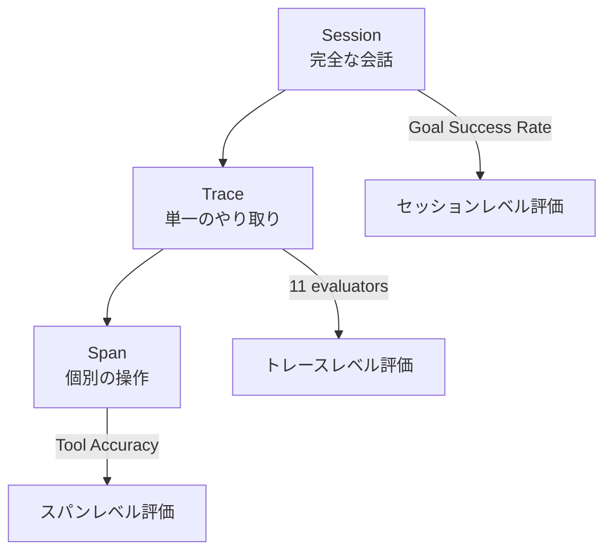

本記事は [Build reliable AI agents with Amazon Bedrock AgentCore Evaluations](https://aws.amazon.com/blogs/machine-learning/build-reliable-ai-agents-with-amazon-bedrock-agentcore-evaluations/)（AWS Machine Learning Blog, 2026年3月31日）の解説記事です。

## ブログ概要（Summary）

Amazon Bedrock AgentCore Evaluationsは、AIエージェントのパフォーマンスを開発から本番運用までライフサイクル全体で評価するフルマネージドサービスです。ブログでは「テストで予期しなかった誤ったツール呼び出し、一貫性のない応答、障害モードがユーザーに発生した」という課題を出発点に、LLM-as-a-Judge、グラウンドトゥルース評価、カスタムコード評価の3つの手法を組み合わせた評価フレームワークを紹介しています。評価はセッション・トレース・スパンの3階層で動作し、オンライン（本番サンプリング）とオンデマンド（開発・CI/CD）の2つのモードで利用できます。

この記事は [Zenn記事: LangSmithでLLMエージェントをデバッグする実践ガイド2026](https://zenn.dev/0h_n0/articles/969d91080115db) の深掘りです。LangSmithがRun・Trace・Threadの3層構造でトレースを管理するのに対し、Bedrock AgentCore Evaluationsはセッション・トレース・スパンの3階層で「評価」を管理します。アーキテクチャの思想は類似しており、両者の比較を通じてエージェントオブザーバビリティの設計原則を理解できます。

## 情報源

- **種別**: 企業テックブログ（AWS Machine Learning Blog）
- **URL**: [https://aws.amazon.com/blogs/machine-learning/build-reliable-ai-agents-with-amazon-bedrock-agentcore-evaluations/](https://aws.amazon.com/blogs/machine-learning/build-reliable-ai-agents-with-amazon-bedrock-agentcore-evaluations/)
- **組織**: Amazon Web Services
- **発表日**: 2026年3月31日
- **著者**: Akarsha Sehwag, Samaneh Aminikhanghahi, Bharathi Srinivasan, Ishan Singh, Jack Gordley, Osman Santos

## 技術的背景（Technical Background）

エージェントの評価がシンプルなLLM評価と異なるのは、LLMの非決定的な性質です。同一のクエリでも異なる出力が生成されるため、個別のテスト結果ではなく「実際の行動パターン」を理解するための反復テストが必要とブログは述べています。

従来のソフトウェアテストとの大きな違いとして：
- **決定論的テスト → 確率的評価**: 同じ入力に対する出力が毎回変わる
- **バイナリ判定 → 多次元スコアリング**: 正解/不正解ではなく、有用性・正確性・安全性など複数軸で評価
- **開発時のみ → 継続的監視**: 本番環境でのサイレントな品質劣化を検出する必要がある

## 実装アーキテクチャ（Architecture）

### 3階層評価フレームワーク

この3階層は、LangSmithのThread/Trace/Runの3層構造と概念的に対応しています：

| Bedrock AgentCore | LangSmith | 対応する単位 |
|------------------|-----------|------------|
| Session | Thread | 会話全体 |
| Trace | Trace | 1回のやり取り |
| Span | Run | 個別の操作（LLM呼び出し、ツール実行等） |

### 13の組み込み評価器

**セッションレベル（1件）**:
- **Goal Success Rate**: ユーザーの目的が達成されたかを評価

**トレースレベル（11件）**:
- **Helpfulness**: 応答がユーザーの目的達成にどの程度貢献するか
- **Correctness**: 事実的な正確性（グラウンドトゥルースとの照合）
- **Coherence**: 応答内の論理的一貫性
- **Conciseness**: 不要な冗長性がないか
- **Faithfulness**: 会話履歴との整合性
- **Harmfulness**: 有害な内容が含まれていないか
- **Instruction Following**: システム指示への準拠度
- **Response Relevance**: 元の質問に回答しているか
- **Context Relevance**: 検索された文脈が適切か
- **Refusal**: 不適切な要求に対して適切に拒否しているか
- **Stereotyping**: ステレオタイプ的な偏見がないか

**スパンレベル（2件）**:
- **Tool Selection Accuracy**: 適切なツールが選択されたか
- **Tool Parameter Accuracy**: ツールに渡されたパラメータが正しいか

### しばしば混同される評価器の区別

ブログでは以下の混同されやすいペアを明確に区別しています：

| 評価器A | 評価器B | 違い |
|---------|---------|------|
| **Correctness** | **Faithfulness** | Correctnessは事実的正確性、Faithfulnessは会話履歴との整合性 |
| **Helpfulness** | **Response Relevance** | Helpfulnessは目的達成への貢献度、Response Relevanceは質問への回答度 |
| **Coherence** | **Context Relevance** | Coherenceは内部矛盾の検出、Context Relevanceは検索品質の評価 |

この区別は、LangSmithのデバッグにおいても重要です。例えばRAGエージェントの品質が低い場合、Coherenceスコアが低ければLLMの推論に問題があり、Context Relevanceスコアが低ければ検索品質に問題があると切り分けられます。

### 3つの評価手法

**LLM-as-a-Judge**: LLMが構造化されたルーブリックで評価します。「推論してからスコアを付ける」形式で、判断根拠が透明化されます。

**グラウンドトゥルース評価**: 事前定義されたデータセットとの比較です。3種類の入力を受け付けます：
- `expected_response`: 期待される応答テキスト（Correctness評価器に供給）
- `expected_trajectory`: 期待されるツール呼び出し順序（トラジェクトリ一致評価器に供給）
- `assertions`: ゴール達成条件（Goal Success Rate評価器に供給）

**カスタムコード評価器**: Lambda関数による決定論的スコアリングです。ブログでは以下の用途が推奨されています：
- 口座残高・取引IDなどの正確な値の検証
- フォーマット準拠チェック
- ビジネスルールの強制
- 大量の本番監視（LLM推論よりLambdaのコストが大幅に安い）

### 2つのデプロイメントモード

**オンライン評価（本番環境）**:
- 設定可能な割合でライブトレースをサンプリング
- CloudWatchダッシュボードとの統合
- スコア閾値に基づくカスタムアラーム
- サイレントな品質劣化の検出

**オンデマンド評価（開発環境）**:
- CI/CDパイプラインへの統合
- A/Bテストの実施
- 本番と同一の評価器を使用（一貫性を確保）

## パフォーマンス最適化（Performance）

### 診断トラブルシューティングパターン

ブログでは、評価結果のパターンから問題を切り分ける4つの診断パターンが紹介されています：

| パターン | 推定原因 | 対処法 |
|---------|---------|--------|
| 全評価器のスコアが低い | Context Relevanceの問題、システムプロンプトの不明確さ | 検索品質の改善、ツール説明の見直し |
| 類似入力でスコアが不安定 | 評価器指示の特異性不足、temperature設定 | カスタム評価器の指示精緻化、temperatureの低下 |
| Tool Selection Accuracy高いがGoal Success Rate低い | ツール不足、逐次ツール呼び出しの失敗 | 追加ツールの提供、ツール連鎖の改善 |
| 評価の遅延/スロットリング | サンプリングレートの過剰、評価器数の過多 | サンプリング率の低下、評価器数の削減、モデルクォータの引き上げ |

これらの診断パターンは、LangSmithでのデバッグにも応用できます。例えば、LangSmithのフィルタリングで「エラーあり」のトレースを抽出した後、上記のパターンで問題を切り分けることが可能です。

## 運用での学び（Production Lessons）

### ベストプラクティス（8項目）

ブログが推奨する3つの原則に基づく8つのプラクティスを要約します：

**エビデンス駆動（Evidence-Driven）**:
1. ベースラインパフォーマンスを計測し、改善の基準点を確立する
2. 統計的に厳密なA/Bテストでプロンプト変更を評価する
3. 反復テストで信頼性をベンチマークする（LLMの非決定性を考慮）

**多次元評価（Multi-Dimensional）**:
4. エージェントの目的に応じた成功基準を早期に定義する
5. ワークフローの各ステップを独立して評価する
6. ドメイン専門家を評価基準の策定に関与させる
7. 組み込み評価器からカスタム評価器へ段階的に移行する

**継続的計測（Continuous）**:
8. テストベースラインに対するドリフトを検出し、本番のエッジケースでテストデータセットを継続的に拡充する

### 推奨する評価器の選択

ブログでは「3-4つの評価器から始める」ことが推奨されています。エージェントの種類別の推奨：

- **カスタマーサービスエージェント**: Helpfulness, Goal Success Rate, Instruction Following
- **RAGエージェント**: Correctness, Faithfulness, Context Relevance
- **ツール集約型エージェント**: Tool Selection Accuracy, Tool Parameter Accuracy, Goal Success Rate

## 学術研究との関連（Academic Connection）

Bedrock AgentCore EvaluationsのLLM-as-a-Judge手法は、以下の学術研究に基づいています：

- **LLM-as-a-Judge**（Zheng et al., 2023）: LLMを評価者として使用する手法の体系化。Bedrock AgentCoreは構造化ルーブリックによる評価を採用しており、この研究の実装版
- **TRAIL**（Deshpande et al., 2025）: エージェントトレースの障害分析ベンチマーク。TRAILのタクソノミーとBedrock AgentCoreの13評価器は部分的に重複しており、相互に補完可能
- **Agent-as-a-Judge**（2025）: エージェント自体を評価者として使う手法。Bedrock AgentCoreのカスタムコード評価器はこのアプローチの簡易版と位置づけられる

## LangSmithとの比較

| 観点 | LangSmith | Bedrock AgentCore Evaluations |
|------|-----------|------------------------------|
| 階層構造 | Thread/Trace/Run | Session/Trace/Span |
| AI分析 | Polly（対話型） | LLM-as-a-Judge（スコアリング型） |
| 評価器数 | カスタム定義 | 13組み込み + カスタム |
| 本番監視 | フィルタ + アラート | サンプリング + CloudWatch統合 |
| フレームワーク | 多数対応（LangChain, OpenAI等） | Bedrock Agentに最適化 |
| プロンプト改善 | Playground連携 | オンデマンド評価でA/Bテスト |
| コスト | Plus $39/月〜 | Bedrock利用料に含む |

両者は排他的ではなく、併用可能です。LangSmithでトレースを可視化しPollyで障害箇所を特定した後、Bedrock AgentCore Evaluationsで定量的な品質スコアを継続監視する、というワークフローが考えられます。

## 本番導入ガイド（Production Deployment Guide）

### 前提条件
- AWSアカウントでBedrock AgentCoreが利用可能なリージョン（us-east-1, us-west-2等）
- CloudWatchへの書き込み権限を持つIAMロール
- 評価対象のBedrock Agent（既存または新規）

### 導入ステップ

1. **ベースライン計測**: 現行エージェントに対してオンデマンド評価を実行し、13評価器のスコアを取得する。この値が改善の基準点となる
2. **評価器の選択**: エージェントの種別に応じて3-4個の評価器を選択する（上記「推奨する評価器の選択」参照）
3. **オンライン評価の有効化**: サンプリングレートを5-10%に設定し、CloudWatchダッシュボードを構成する
4. **アラーム設定**: 各評価器のスコアがベースラインから一定以上低下した場合にSNS通知を発火するCloudWatchアラームを設定する
5. **CI/CD統合**: オンデマンド評価をパイプラインに組み込み、プロンプト変更時に自動実行する

### コスト見積もり

ブログでは具体的な料金は記載されていませんが、評価のコスト構造は以下の通りです：
- **LLM-as-a-Judge**: 評価1件あたりLLM推論コストが発生（評価器の数 × サンプル数）
- **カスタムコード評価器**: Lambda実行コストのみ（LLM推論より大幅に安価）
- **オンライン評価**: サンプリングレートに比例してコストが増加

大量の本番トラフィックがある場合、カスタムコード評価器をLLM-as-a-Judgeの前段フィルタとして配置し、異常検出時のみLLM評価を実行するハイブリッド構成が推奨されます。

## まとめと実践への示唆

Bedrock AgentCore Evaluationsは、エージェントの品質管理を「テスト工程」から「継続的な運用プロセス」に拡張するサービスです。特に、13の組み込み評価器による多次元評価、オンライン/オンデマンドの2モード運用、CloudWatchとの統合による本番監視は、エージェントの信頼性を組織的に管理するための実用的な基盤を提供しています。

LangSmithが「開発者がトレースを見て障害を特定する」デバッグ中心のツールであるのに対し、Bedrock AgentCore Evaluationsは「サービスが自動的に品質をスコアリングし続ける」品質保証中心のサービスです。両者を組み合わせることで、障害の発見（LangSmith）から定量評価（AgentCore）、改善の検証（AgentCore A/Bテスト）、再発防止（LangSmith回帰テスト）まで、デバッグサイクル全体をカバーできます。

## 参考文献

- **Blog URL**: [https://aws.amazon.com/blogs/machine-learning/build-reliable-ai-agents-with-amazon-bedrock-agentcore-evaluations/](https://aws.amazon.com/blogs/machine-learning/build-reliable-ai-agents-with-amazon-bedrock-agentcore-evaluations/)
- **Related Zenn article**: [https://zenn.dev/0h_n0/articles/969d91080115db](https://zenn.dev/0h_n0/articles/969d91080115db)

---

:::message
この記事はAI（Claude Code）により自動生成されました。内容の正確性についてはAWS公式ブログ原文で検証していますが、最新の情報はAWS公式ドキュメントもご確認ください。
:::
