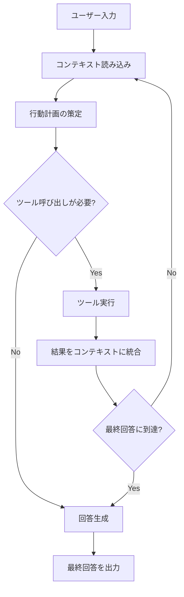
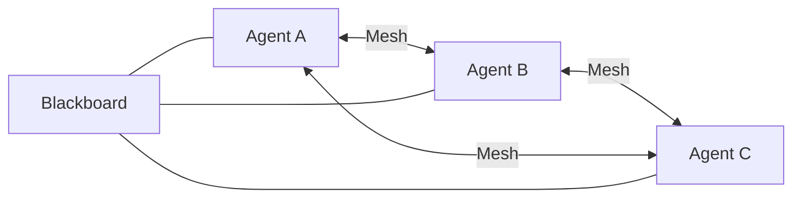
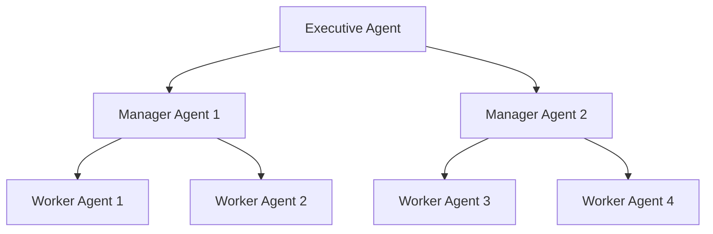
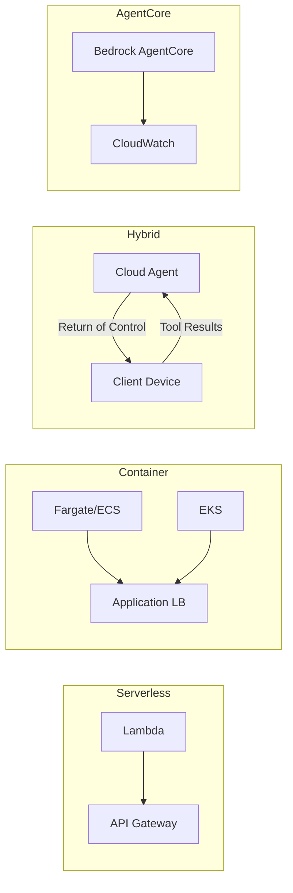

本記事は [https://aws.amazon.com/blogs/machine-learning/strands-agents-sdk-a-technical-deep-dive-into-agent-architectures-and-observability/](https://aws.amazon.com/blogs/machine-learning/strands-agents-sdk-a-technical-deep-dive-into-agent-architectures-and-observability/) の解説記事です。

## ブログ概要（Summary）

AWSが公開したStrands Agents SDKは、LLMエージェントを構築するためのオープンソースフレームワーク（Apache 2.0ライセンス）である。AWSの公式ブログによると、このSDKは「Model-driven（モデル駆動）」アプローチを採用し、LLMをプランナーとして自律的にツール呼び出しと推論をチェーンさせる設計思想を持つ。Single Agent、Swarm（ピアツーピア）、Supervisor-Agent、Hierarchicalの4つのマルチエージェントパターンをサポートし、OpenTelemetryによるObservability統合を標準搭載している。Kiro、Amazon Q、AWS Glue、VPC Reachability Analyzerなど、AWSの本番プロダクトで実際に使用されている。

この記事は [Zenn記事: Bedrock AgentCoreで社内問い合わせエージェントを構築しメモリ永続化で精度向上](https://zenn.dev/0h_n0/articles/b7cddc45f56f1a) の深掘りです。

## 情報源

- **種別**: 企業テックブログ（AWS Machine Learning Blog）
- **URL**: [https://aws.amazon.com/blogs/machine-learning/strands-agents-sdk-a-technical-deep-dive-into-agent-architectures-and-observability/](https://aws.amazon.com/blogs/machine-learning/strands-agents-sdk-a-technical-deep-dive-into-agent-architectures-and-observability/)
- **組織**: AWS Industries PACE team
- **著者**: Jin Tan Ruan（Senior Generative AI Developer）
- **発表日**: 2025年7月31日

## 技術的背景（Technical Background）

LLMエージェントの構築にはこれまで多くのフレームワークが存在してきたが、AWSの公式ブログによると、従来のフレームワークの多くは「developer-first（開発者主導）」のアプローチを採用しており、開発者がワークフローのチェーンを明示的に組み立てる必要があった。この設計は柔軟性が高い反面、ワークフローの設計・保守が複雑化し、LLMの推論能力を十分に活用できない場面があった。

Strands Agents SDKはこの課題に対して「LLM-first（モデル主導）」というアプローチで回答を示している。ブログでは「LLMにプロンプトとツールを与え、モデル自身にオーケストレーションを委ねる」設計と説明されている。開発者はツールとシステムプロンプトを定義するだけでよく、推論チェーンの制御はLLMが担う。

学術的には、ReAct（Reasoning + Acting）パターンに基づくエージェントループの実装であり、LLMが「観察 → 思考 → 行動」のサイクルを自律的に回す構造を持つ。このアプローチは、ツール呼び出しの順序や条件分岐をハードコードする必要がなく、タスクの複雑さに応じてLLMが動的に推論パスを決定できる点で優れている。

## 実装アーキテクチャ（Architecture）

### コアアーキテクチャ: 3コンポーネント構成

ブログによると、Strands Agents SDKのコアは3つのコンポーネントで構成される。

1. **LLM（モデル）**: エージェントの頭脳。推論、プランニング、ツール選択を担当
2. **System Prompt**: エージェントの振る舞いを定義する指示文
3. **Tools**: エージェントが外部世界と対話するための関数・API群

```python
from strands import Agent
from strands_tools import calculator

agent = Agent(tools=[calculator])
result = agent("What is the square root of 1764?")
print(result)
```

ブログではこのシンプルなAPI設計について、「3行でエージェントを構築できる」と説明されている。

### エージェントループの動作

ブログでは、エージェントループの動作を以下のように説明している。

> "The LLM behind the agent iteratively reads the conversation (and context), plans an action, possibly calls a tool, and then incorporates the tool's result before deciding the next step, until it reaches a final answer."

この動作をフロー図で示す。



このループはLLM自身が終了条件を判断する点が特徴的である。開発者が明示的にループ回数や終了条件を設定する必要がなく、LLMが「十分な情報が集まった」と判断した時点で最終回答を生成する。

### ツール統合

ブログでは、ツール統合の3つの手法が説明されている。

**@toolデコレータによるカスタムツール定義**:

```python
from strands import Agent, tool
from strands_tools import retrieve, http_request

RESEARCH_ASSISTANT_PROMPT = """
You are a specialized research assistant.
Focus on providing factual, well-sourced information.
Always cite sources in your answers.
"""

@tool
def research_assistant(query: str) -> str:
    """Tool that uses a specialized agent to answer research queries."""
    research_agent = Agent(
        system_prompt=RESEARCH_ASSISTANT_PROMPT,
        tools=[retrieve, http_request]
    )
    return research_agent(query)
```

**Model Context Protocol（MCP）**: ブログによると、MCPはオープンスタンダードであり、カスタムコードを書くことなく数千の外部ツールにアクセス可能にするプロトコルである。AnthropicやMetaも互換性に貢献している。

**Agent-to-Agent（A2A）プロトコル**: エージェント間でツールとして相互呼び出しを可能にし、マルチエージェント連携のオーバーヘッドを最小化する。

さらに、開発中はホットリロードに対応しており、エージェントを再起動せずにツールの追加・変更が可能と説明されている。

### モデル非依存性

ブログでは、Strands SDKが特定のLLMプロバイダに依存しない設計であることが強調されている。サポートされるプロバイダは以下の通りである。

- Amazon Bedrock（Claude、その他Bedrockモデル）
- Anthropic API（直接）
- OpenAI
- Ollama（ローカルモデル）
- LlamaAPI
- その他（プラグイン可能なプロバイダインタフェース経由）

ブログによると、「コードを変更せずに、Bedrock上のClaudeからローカルのLlama 3やOpenAI GPT-4にモデルを切り替えられる」と説明されている。

## マルチエージェントパターン（Multi-Agent Patterns）

ブログでは、4つのマルチエージェントパターンが詳細に解説されている。

### 1. Single Agent

単一の`Agent`クラスがタスク全体を処理するパターン。質問応答、データ取得、シンプルなアシスタントに適している。LLMが自身でクエリを解釈し、ツールの使用を判断し、反復的に最終回答に到達する。

### 2. Swarm（ピアツーピア）

複数のエージェントが単一のオーケストレータなしに動作し、ピアツーピアで通信するパターン。ブログでは3つの通信パターンが説明されている。

- **Mesh通信**: エージェント間の自由な通信
- **共有メモリ/ブラックボード**: エージェントが共通リポジトリに情報を投稿
- **メッセージパッシングチャネル**: エージェントペア間の直接通信

また、協調の哲学として以下が紹介されている。

- **Collaborative swarms**: エージェント間で能動的に合意を形成
- **Competitive swarms**: 並列に独立した戦略を実行し、批評し合う
- **Hybrid approaches**: 協調と探索を混合



### 3. Supervisor-Agent（オーケストレータ方式）

1つのオーケストレータエージェントがユーザーと対話し、専門エージェントにタスクを委譲するパターン。ブログのコード例では、各専門エージェントを`@tool`デコレータでラップしてオーケストレータに渡す構成が示されている。

```python
orchestrator_agent = Agent(
    tools=[research_assistant, math_assistant, trip_planner_assistant]
)
response = orchestrator_agent(
    "What are the latest NASA findings on Mars, "
    "and can you calculate the travel time to Mars at 20km/s?"
)
```

ブログによると、この方式の利点は関心の分離、モジュール性、組織の明確さである。

### 4. Hierarchical（階層型）

複数レベルの委譲を持つツリー構造のパターン。トップレベルのエグゼクティブがマネージャーに委譲し、マネージャーがさらにワーカーに委譲する。タスクは下方向に流れ、結果は上方向に流れる。



ブログでは、`agent_graph`ユーティリティがこれらのマルチエージェントネットワークをプログラム的に管理する機能を提供すると説明されている。ノード（エージェント）とエッジ（接続）を定義し、トポロジを指定し、エージェント間のメッセージングとスケーラビリティを管理する。

## Observability（可観測性）

### OpenTelemetry統合

ブログでは、Strands SDKのObservabilityがOpenTelemetry（OTEL）標準に基づいて設計されていると説明されている。各エージェント実行はトレースを生成し、トレースはスパンで構成される。

**キャプチャされるスパンの種類**:
- **LLMモデル呼び出し**: プロンプト、モデルパラメータ、トークン使用量
- **ツール呼び出し**: ツール名、入力、出力

**トラッキングされるメトリクス**:

| メトリクス | 詳細 |
|-----------|------|
| ツール呼び出し頻度 | 成功/失敗率 |
| ツール実行時間 | 個別ツールのランタイム |
| 推論ループ回数 | インタラクションあたりのループ数 |
| モデル応答レイテンシ | Time to First Byte、完了時間 |
| トークン消費量 | プロンプトトークン vs 完了トークン |
| システムメトリクス | CPU、メモリ使用率 |
| カスタムビジネスメトリクス | ユーザー満足度フィードバック等 |

### AWS統合

ブログによると、トレースはOTEL互換バックエンドに送信可能であり、以下のAWSサービスとの統合が説明されている。

- **AWS X-Ray**: 分散トレーシングの可視化。エージェントの推論チェーン全体を1つのトレースとして追跡可能
- **Amazon CloudWatch**: リアルタイムメトリクス監視とアラーム設定。レイテンシ、エラーカウント、トークン使用量、リクエストあたりコスト
- **CloudWatch Logs**: 構造化ログの集約。プロンプト、モデル応答、ツール選択判断、エラー情報

### テレメトリの消費者

ブログでは、テレメトリデータを消費する3つのペルソナが示されている。

- **開発者**: トレースを使って意思決定チェーンを診断
- **データエンジニア**: テレメトリを集約し、使用パターン分析とコスト追跡
- **AIリサーチャー**: ログとトレースで失敗モードを特定し、プロンプトを改善

## デプロイメントパターン（Deployment Patterns）

### Lambda（Serverless）

ブログによると、短時間で完了するエージェントタスクやイベント駆動の呼び出しに適している。Lambda Function URLsまたはAPI Gateway経由でトリガーされ、同時実行によるスケーラビリティと最小限の運用オーバーヘッドを実現する。ストリーミングインタラクションにはWebSocketsまたは非同期パターンを使用する。

### Containers（Fargate / ECS / EKS）

長時間実行やステートフルなエージェントサービスに適している。Fargate（サーバーレスコンテナ）またはECS/EKSデプロイメントでストリーミングインタラクションと高い同時実行をサポートする。GPU搭載インスタンスでの大規模モデル実行も可能である。

### Hybrid Return-of-Control

ブログでは、エージェントをクラウド（例: AWS）でホストし、特定のツール実行をクライアントデバイスやオンプレミスサービスに委譲するハイブリッドパターンが説明されている。データガバナンス（データ処理をローカルに保持）とクラウドベースの推論を両立させるパターンである。

### Amazon Bedrock AgentCore

ブログによると、Bedrock AgentCoreはセキュアでサーバーレスなランタイムであり、`BedrockAgentCoreApp`ラッパーを使用してStrandsエージェントをデプロイする。2025年7月時点でパブリックプレビューであり、以下の機能を持つ。

- 最大8時間の長時間タスク
- 非同期ツール実行
- ツール相互運用性（MCP、A2A、API Gatewayサービス）
- セキュアなID管理（OAuth、Cognito、IAM）
- ネイティブObservability（CloudWatch、OTEL）



## セキュリティ（Security）

ブログでは、以下のセキュリティ機能が解説されている。

**Fine-Grained Tool Access Control**: 各エージェントがアクセスできるツールを開発者が明示的に制御する。ロールベースのツール活用ロジックにより、最小権限の原則をセッション単位で適用可能。

**データ保護**: 機密データのエンドツーエンド暗号化（保存時・転送時）、Amazon Bedrock Guardrailsまたはカスタムバリデーションによる入出力のサニタイゼーション、ログの構造化・機密情報のリダクション。

**認証・認可**: IAMロール、Amazon Cognito、OAuthトークン、API GatewayまたはLambda認証によるエンドポイントレベルの多層防御。

**脅威モデリング**: AWSが公開したMAESTROフレームワークによるエージェントAI脅威モデリング。プロンプトインジェクション、データ漏洩試行に対する入力バリデーション、出力フィルタリング、例外ハンドリングの実装が推奨されている。

## パフォーマンス最適化（Performance）

### スケーラビリティ

ブログによると、ツール数やエージェントステップ数に厳密な上限はなく、計算リソースとモデルの制約のみが制限となる。パイプライン化されたオペレーションにより、LLMの応答ストリーミングを完了前から開始できる。マルチエージェント構成では並行実行がサポートされている。

### エラーハンドリング

- ツール呼び出しのタイムアウトと推論ループ数の制限（暴走防止）
- リトライループとフォールバックロジック
- CloudWatch統合によるメトリクス監視（レイテンシ、エラーカウント、トークン使用量、リクエストあたりコスト）
- 異常検知アラートの設定

### モノリシック vs マイクロサービス

ブログでは、デプロイ戦略として以下が説明されている。

- **モノリシック**: エージェントループとすべてのツールを1プロセスに配置。低レイテンシ（インメモリ関数呼び出し）でシンプルなデプロイ
- **マイクロサービス**: 各ツールをAPI経由の個別サービスとして分離。障害分離、負荷の高いツールの独立スケーリング、ポリグロット実装が可能

ブログでは「モノリシックで開始し、必要に応じて重要なツールをマイクロサービスに分離する」アプローチが推奨されている。

## 運用での学び（Production Lessons）

### プロダクションでの採用実績

ブログによると、Strands SDKは以下のAWSプロダクトで本番使用されている。

- **Kiro**: IDEエージェント
- **Amazon Q**: 開発者アシスタント
- **AWS Glue**: データ統合サービス
- **VPC Reachability Analyzer**: ネットワーク接続分析

これらの本番環境での使用実績は、SDKの信頼性と成熟度を示すものである。

### Strands vs LangChain

ブログでは、Strands SDKとLangChainの設計思想の違いが明確に比較されている。

| 観点 | Strands | LangChain |
|------|---------|-----------|
| 設計思想 | LLM-first（モデルがプランナー） | Developer-first（開発者がチェーン構築） |
| ツールエコシステム | MCP標準で数千のツール接続 | コミュニティ貢献のコネクタが豊富 |
| マルチエージェント | swarms/graphs/階層型が標準搭載 | LangGraph等で実現 |
| Observability | OTEL統合が標準 | サードパーティ（Langfuse等）で補完 |
| メモリ | セッション・状態管理 | 多様なメモリバリアント |
| ユースケース | AWS/Bedrockでのプロダクション | カスタム制御・実験的研究 |

ブログでは「Strandsでは多くの機能がビルトインまたはシンプルな設定で利用できる。これにより、モニタリングが必須のエンタープライズ・プロダクションシナリオで魅力的」と説明されている。

## 学術研究との関連（Academic Connection）

Strands SDKのエージェントループは、Yao et al. (2023) の ReAct パターン（Reasoning + Acting）を実装レベルに落とし込んだものと解釈できる。LLMが観察・思考・行動のサイクルを回す構造は、ReActの「thought-action-observation」トリプレットと対応している。また、マルチエージェントパターンのSwarmアーキテクチャは、分散AIシステムにおけるマルチエージェントシステム（MAS）の研究に基づいており、Supervisor-Agent方式は集中型制御のオーケストレーション研究に通じる。

## Production Deployment Guide

Strands Agents SDKは実装アーキテクチャが詳細に記載されているため、AWSでのプロダクションデプロイメントガイドを以下に示す。

### AWS実装パターン（コスト最適化重視）

**注意**: 以下のコスト試算は2026年5月時点のAWS ap-northeast-1（東京）リージョン料金に基づく概算値です。実際のコストはトラフィックパターン、リージョン、バースト使用量により変動します。最新料金はAWS料金計算ツールで確認を推奨します。

| 構成 | トラフィック | 月額コスト | 主要サービス |
|------|------------|-----------|-------------|
| Small | ~100 req/日 | $50-150 | Lambda + Bedrock + DynamoDB |
| Medium | ~1,000 req/日 | $300-800 | ECS Fargate + Bedrock + ElastiCache |
| Large | 10,000+ req/日 | $2,000-5,000 | EKS + Spot + Karpenter + Bedrock |

**Small構成（~100 req/日）**: Lambda関数でStrandsエージェントを実行。API Gateway経由でリクエストを受け付け、DynamoDBにセッション状態を保存。Bedrockで推論。Lambda 128-512MB、DynamoDB On-Demand、CloudWatch基本監視で月額$50-150。

**Medium構成（~1,000 req/日）**: ECS Fargateでコンテナ化。ALBでロードバランシング。ElastiCacheでセッションキャッシュ。Fargateタスク0.5vCPU/1GB RAM x 2-4タスク。ストリーミング対応。月額$300-800。

**Large構成（10,000+ req/日）**: EKSクラスタにKarpenterで自動スケーリング。Spot Instances優先でコスト削減。マルチエージェント構成の並行実行。月額$2,000-5,000。

**コスト削減テクニック**:
- Spot Instances活用で最大90%削減（EKSワーカーノード）
- Reserved Instances購入で最大72%削減（安定ワークロード）
- Bedrock Batch API使用で50%削減（非リアルタイム処理）
- Prompt Caching有効化で30-90%削減（反復的プロンプト）

### Terraformインフラコード

#### Small構成（Serverless）

```hcl
# Strands Agent - Small構成 (Lambda + Bedrock + DynamoDB)
# terraform apply で即デプロイ可能

terraform {
  required_version = ">= 1.9"
  required_providers {
    aws = {
      source  = "hashicorp/aws"
      version = "~> 5.80"
    }
  }
}

provider "aws" {
  region = "ap-northeast-1"
}

# --- IAMロール（最小権限） ---
resource "aws_iam_role" "strands_lambda" {
  name = "strands-agent-lambda-role"
  assume_role_policy = jsonencode({
    Version = "2012-10-17"
    Statement = [{
      Action = "sts:AssumeRole"
      Effect = "Allow"
      Principal = { Service = "lambda.amazonaws.com" }
    }]
  })
}

resource "aws_iam_role_policy" "strands_lambda_policy" {
  name = "strands-agent-policy"
  role = aws_iam_role.strands_lambda.id
  policy = jsonencode({
    Version = "2012-10-17"
    Statement = [
      {
        # Bedrock推論のみ許可
        Effect   = "Allow"
        Action   = ["bedrock:InvokeModel", "bedrock:InvokeModelWithResponseStream"]
        Resource = "arn:aws:bedrock:ap-northeast-1::foundation-model/*"
      },
      {
        # DynamoDBセッション管理
        Effect   = "Allow"
        Action   = ["dynamodb:GetItem", "dynamodb:PutItem", "dynamodb:UpdateItem", "dynamodb:DeleteItem"]
        Resource = aws_dynamodb_table.sessions.arn
      },
      {
        # CloudWatch Logs
        Effect   = "Allow"
        Action   = ["logs:CreateLogGroup", "logs:CreateLogStream", "logs:PutLogEvents"]
        Resource = "arn:aws:logs:ap-northeast-1:*:*"
      }
    ]
  })
}

# --- DynamoDB（On-Demandでコスト最適化） ---
resource "aws_dynamodb_table" "sessions" {
  name         = "strands-agent-sessions"
  billing_mode = "PAY_PER_REQUEST" # On-Demand: 低トラフィックでコスト最適
  hash_key     = "session_id"

  attribute {
    name = "session_id"
    type = "S"
  }

  ttl {
    attribute_name = "expires_at"
    enabled        = true
  }

  server_side_encryption {
    enabled = true # KMS暗号化
  }
}

# --- Lambda関数 ---
resource "aws_lambda_function" "strands_agent" {
  function_name = "strands-agent"
  runtime       = "python3.12"
  handler       = "app.handler"
  role          = aws_iam_role.strands_lambda.arn
  timeout       = 300 # 5分（エージェントループに十分な時間）
  memory_size   = 512 # コスト vs パフォーマンスのバランス

  environment {
    variables = {
      DYNAMODB_TABLE = aws_dynamodb_table.sessions.name
      MODEL_ID       = "anthropic.claude-sonnet-4-20250514"
    }
  }

  tracing_config {
    mode = "Active" # X-Rayトレーシング有効化
  }

  filename = "lambda_package.zip"
}

# --- CloudWatchアラーム（コスト監視） ---
resource "aws_cloudwatch_metric_alarm" "lambda_duration" {
  alarm_name          = "strands-agent-high-duration"
  comparison_operator = "GreaterThanThreshold"
  evaluation_periods  = 3
  metric_name         = "Duration"
  namespace           = "AWS/Lambda"
  period              = 300
  statistic           = "Average"
  threshold           = 60000 # 60秒超過でアラーム
  alarm_description   = "Agent execution time exceeds 60s"

  dimensions = {
    FunctionName = aws_lambda_function.strands_agent.function_name
  }
}
```

#### Large構成（Container）

```hcl
# Strands Agent - Large構成 (EKS + Karpenter + Spot)

module "eks" {
  source  = "terraform-aws-modules/eks/aws"
  version = "~> 20.31"

  cluster_name    = "strands-agent-cluster"
  cluster_version = "1.31"

  vpc_id     = module.vpc.vpc_id
  subnet_ids = module.vpc.private_subnets

  # コントロールプレーンのみ（ワーカーはKarpenter管理）
  cluster_endpoint_public_access = false
}

# --- Karpenter Provisioner（Spot優先で最大90%コスト削減） ---
resource "kubectl_manifest" "karpenter_nodepool" {
  yaml_body = yamlencode({
    apiVersion = "karpenter.sh/v1"
    kind       = "NodePool"
    metadata   = { name = "strands-agents" }
    spec = {
      template = {
        spec = {
          requirements = [
            { key = "karpenter.sh/capacity-type", operator = "In", values = ["spot", "on-demand"] },
            { key = "node.kubernetes.io/instance-type", operator = "In",
              values = ["m7i.xlarge", "m7i.2xlarge", "m6i.xlarge", "m6i.2xlarge"] }
          ]
        }
      }
      limits   = { cpu = "100", memory = "400Gi" }
      disruption = {
        consolidationPolicy = "WhenEmptyOrUnderutilized"
        consolidateAfter    = "30s"
      }
    }
  })
}

# --- Secrets Manager（Bedrock設定） ---
resource "aws_secretsmanager_secret" "bedrock_config" {
  name                    = "strands-agent/bedrock-config"
  recovery_window_in_days = 7
}

# --- AWS Budgets（予算アラート） ---
resource "aws_budgets_budget" "strands_monthly" {
  name         = "strands-agent-monthly"
  budget_type  = "COST"
  limit_amount = "5000"
  limit_unit   = "USD"
  time_unit    = "MONTHLY"

  notification {
    comparison_operator       = "GREATER_THAN"
    threshold                 = 80
    threshold_type            = "PERCENTAGE"
    notification_type         = "ACTUAL"
    subscriber_email_addresses = ["ops-team@example.com"]
  }
}
```

### 運用・監視設定

**CloudWatch Logs Insights クエリ**:

```
# コスト異常検知: 1時間あたりのトークン使用量
fields @timestamp, @message
| filter @message like /token_usage/
| stats sum(prompt_tokens) as total_prompt, sum(completion_tokens) as total_completion by bin(1h)
| sort @timestamp desc
```

```
# レイテンシ分析: P95, P99
fields @timestamp, duration_ms
| filter @message like /agent_completion/
| stats percentile(duration_ms, 95) as p95, percentile(duration_ms, 99) as p99 by bin(1h)
```

**CloudWatch アラーム設定（Python）**:

```python
import boto3

cloudwatch = boto3.client("cloudwatch", region_name="ap-northeast-1")

def create_token_usage_alarm(function_name: str, threshold: float = 100000) -> None:
    """Bedrockトークン使用量スパイク検知アラームを作成する。

    Args:
        function_name: 監視対象のLambda関数名
        threshold: 5分間のトークン使用量閾値
    """
    cloudwatch.put_metric_alarm(
        AlarmName=f"{function_name}-token-spike",
        MetricName="TokenUsage",
        Namespace="StrandsAgent",
        Statistic="Sum",
        Period=300,
        EvaluationPeriods=2,
        Threshold=threshold,
        ComparisonOperator="GreaterThanThreshold",
        AlarmActions=["arn:aws:sns:ap-northeast-1:ACCOUNT:ops-alerts"],
    )
```

**X-Ray トレーシング設定（Python）**:

```python
from aws_xray_sdk.core import xray_recorder, patch_all

# boto3自動計装
patch_all()

@xray_recorder.capture("strands_agent_invoke")
def invoke_agent(query: str, session_id: str) -> str:
    """エージェント呼び出しをX-Rayでトレースする。

    Args:
        query: ユーザークエリ
        session_id: セッションID

    Returns:
        エージェントの応答テキスト
    """
    subsegment = xray_recorder.current_subsegment()
    subsegment.put_annotation("session_id", session_id)
    subsegment.put_metadata("query", query)

    result = agent(query)

    subsegment.put_metadata("token_usage", {
        "prompt_tokens": result.token_usage.prompt_tokens,
        "completion_tokens": result.token_usage.completion_tokens,
    })
    return str(result)
```

**Cost Explorer 日次レポート（Python）**:

```python
import boto3
from datetime import datetime, timedelta

ce = boto3.client("ce", region_name="ap-northeast-1")
sns = boto3.client("sns", region_name="ap-northeast-1")

def daily_cost_report() -> dict:
    """日次コストレポートを取得し、閾値超過時にSNS通知する。

    Returns:
        サービス別コスト辞書
    """
    today = datetime.utcnow().strftime("%Y-%m-%d")
    yesterday = (datetime.utcnow() - timedelta(days=1)).strftime("%Y-%m-%d")

    response = ce.get_cost_and_usage(
        TimePeriod={"Start": yesterday, "End": today},
        Granularity="DAILY",
        Metrics=["UnblendedCost"],
        Filter={
            "Or": [
                {"Dimensions": {"Key": "SERVICE", "Values": ["Amazon Bedrock"]}},
                {"Dimensions": {"Key": "SERVICE", "Values": ["AWS Lambda"]}},
                {"Dimensions": {"Key": "SERVICE", "Values": ["Amazon Elastic Kubernetes Service"]}},
            ]
        },
        GroupBy=[{"Type": "DIMENSION", "Key": "SERVICE"}],
    )

    total = sum(
        float(g["Metrics"]["UnblendedCost"]["Amount"])
        for r in response["ResultsByTime"]
        for g in r["Groups"]
    )

    if total > 100:
        sns.publish(
            TopicArn="arn:aws:sns:ap-northeast-1:ACCOUNT:cost-alerts",
            Subject="Strands Agent Cost Alert",
            Message=f"Daily cost ${total:.2f} exceeds $100 threshold",
        )

    return {
        g["Keys"][0]: float(g["Metrics"]["UnblendedCost"]["Amount"])
        for r in response["ResultsByTime"]
        for g in r["Groups"]
    }
```

### コスト最適化チェックリスト

**アーキテクチャ選択**:
- [ ] トラフィック量に応じた構成選択（~100 req/日: Serverless、~1000 req/日: Hybrid、10000+ req/日: Container）
- [ ] ストリーミング要件の確認（Lambda: WebSocket必要、Fargate/EKS: ネイティブ対応）

**リソース最適化**:
- [ ] EC2/EKS: Spot Instances優先（最大90%削減）
- [ ] Reserved Instances: 1年コミットで安定ワークロードを確保（最大72%削減）
- [ ] Savings Plans: Compute Savings Plans検討
- [ ] Lambda: Power Tuningでメモリサイズ最適化（128MB-512MB）
- [ ] ECS/EKS: Karpenterでアイドル時自動スケールダウン（consolidateAfter: 30s）
- [ ] DynamoDB: On-Demandモードで低トラフィック時のコスト削減

**LLMコスト削減**:
- [ ] Bedrock Batch API使用で50%削減（非リアルタイム処理）
- [ ] Prompt Caching有効化で30-90%削減（反復的システムプロンプト）
- [ ] モデル選択ロジック: 簡易タスクはHaiku、複雑タスクはSonnet/Opus
- [ ] トークン数制限: max_tokensパラメータで出力トークン上限設定
- [ ] コンテキストウィンドウ管理: 不要な履歴の自動削除

**監視・アラート**:
- [ ] AWS Budgets: 月次予算アラート（80%/100%閾値）
- [ ] CloudWatch アラーム: Lambda実行時間、トークン使用量スパイク
- [ ] Cost Anomaly Detection: ML異常検知有効化
- [ ] 日次コストレポート: Cost Explorer API + SNS通知
- [ ] X-Ray: 分散トレーシングでボトルネック特定

**リソース管理**:
- [ ] 未使用リソース削除: 定期的なリソース棚卸し
- [ ] タグ戦略: `Project:strands-agent`、`Environment:prod/dev`
- [ ] ライフサイクルポリシー: DynamoDB TTL、S3ライフサイクル、CloudWatch Logs保持期間
- [ ] 開発環境夜間停止: EKS開発クラスタの自動停止/起動

## まとめと実践への示唆

AWSの公式ブログによると、Strands Agents SDKは「LLM-first」の設計思想により、エージェント構築の複雑さを大幅に削減することを目指している。3つのコンポーネント（LLM、システムプロンプト、ツール）のみでエージェントを構築でき、4つのマルチエージェントパターンとOpenTelemetryによるObservability統合が標準で提供される。

実務への示唆として、Bedrock AgentCoreとの組み合わせにより、Zenn記事で解説した社内問い合わせエージェントのような用途において、スケーラブルかつ監視可能なプロダクション環境の構築が容易になる。特に、OpenTelemetryによるトークン消費量やレイテンシのトラッキングは、LLMアプリケーションのコスト管理と品質改善に直結する機能である。

ブログで紹介されているKiro、Amazon Q、AWS Glueなどでの本番使用実績は、SDKの成熟度と信頼性を裏付けるものであり、エンタープライズグレードのエージェントアプリケーション構築に向けた有力な選択肢となることを示している。

## 参考文献

- **Blog URL**: [https://aws.amazon.com/blogs/machine-learning/strands-agents-sdk-a-technical-deep-dive-into-agent-architectures-and-observability/](https://aws.amazon.com/blogs/machine-learning/strands-agents-sdk-a-technical-deep-dive-into-agent-architectures-and-observability/)
- **GitHub**: [https://github.com/strands-agents/sdk-python](https://github.com/strands-agents/sdk-python)
- **Related Zenn article**: [https://zenn.dev/0h_n0/articles/b7cddc45f56f1a](https://zenn.dev/0h_n0/articles/b7cddc45f56f1a)
- **Yao et al. (2023)**: "ReAct: Synergizing Reasoning and Acting in Language Models", ICLR 2023
