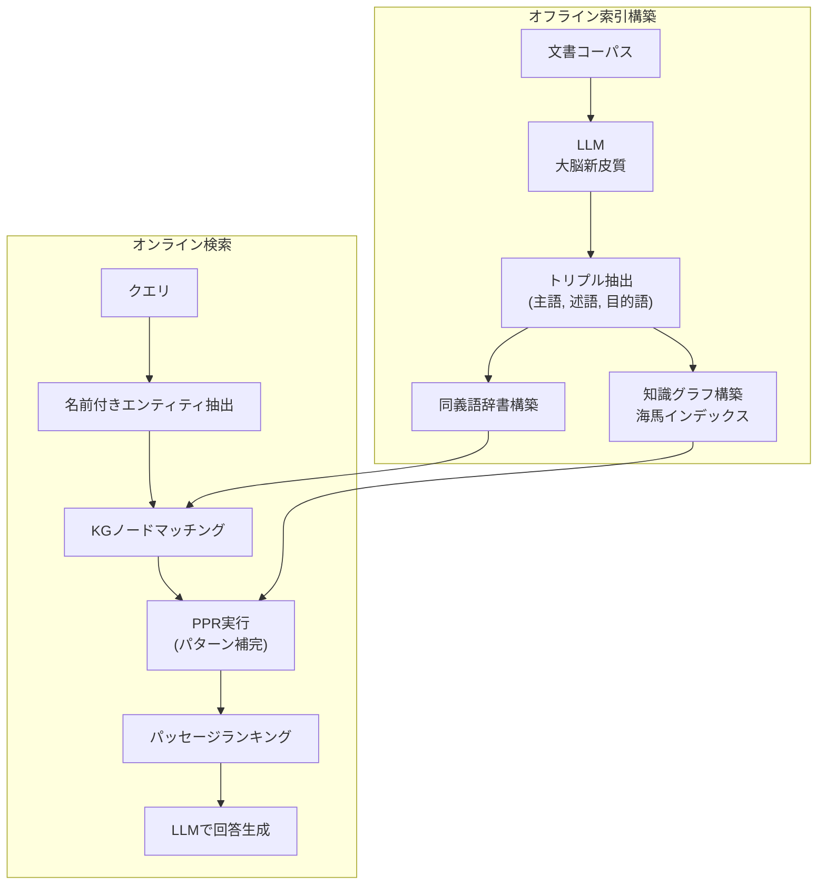
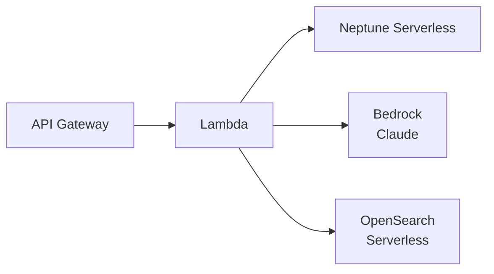

本記事は [HippoRAG: Neurobiologically Inspired Long-Term Memory for Large Language Models](https://arxiv.org/abs/2405.14831)（Gutiérrez et al., 2024）の解説記事です。

## 論文概要（Abstract）

Retrieval-Augmented Generation（RAG）は外部知識を活用する手法として広く普及していますが、複数の文書にまたがるマルチホップ推論や、長期的な知識の統合が求められる場面では性能が低下します。HippoRAGは、神経科学における海馬インデックス理論（hippocampal indexing theory）と相補的学習系（Complementary Learning Systems; CLS）理論に基づき、LLM・知識グラフ・Personalized PageRank（PPR）を組み合わせたRAGフレームワークです。著者らは、マルチホップ質問応答において既存手法を最大20%上回る性能を達成したと報告しています。また、反復的な検索を行わず単一ステップでマルチホップ検索を実現することで、計算コストの大幅な削減にも成功しています。

この記事は [Zenn記事: Bedrock AgentCoreで社内問い合わせエージェントを構築しメモリ永続化で精度向上](https://zenn.dev/0h_n0/articles/b7cddc45f56f1a) の深掘りです。AgentCoreのメモリ永続化機能は「エージェントが過去の対話を記憶する」仕組みですが、HippoRAGは「知識コーパス全体を海馬のように構造化記憶する」アプローチを提案しており、RAGの長期記憶設計に関する理論的基盤を提供します。

## 情報源

- **arXiv ID**: 2405.14831
- **URL**: [https://arxiv.org/abs/2405.14831](https://arxiv.org/abs/2405.14831)
- **著者**: Bernal Jiménez Gutiérrez, Yiheng Shu, Yu Gu, Michihiro Yasunaga, Yu Su
- **発表年**: 2024年5月（2025年1月改訂）
- **カンファレンス**: NeurIPS 2024
- **分野**: cs.CL, cs.AI
- **コード**: [GitHub (OSU-NLP-Group/HippoRAG)](https://github.com/OSU-NLP-Group/HippoRAG)

## カンファレンス情報（NeurIPS 2024）

NeurIPS（Conference on Neural Information Processing Systems）は機械学習・人工知能分野の最高峰の国際会議です。2024年はカナダ・バンクーバーで開催され、15,671件の投稿から3,658件が採択されました（採択率約23.4%）。HippoRAGは本会議に採択されており、RAGと神経科学の融合という新規性の高いアプローチが評価されています。

## 背景と動機（Background & Motivation）

### 従来RAGの限界

標準的なRAGパイプラインは、クエリに対してベクトル類似度検索で関連文書を取得し、LLMのコンテキストに挿入する構成を採用しています。この手法には以下の限界があります：

1. **マルチホップ推論の困難さ**: 回答に複数の文書からの情報統合が必要な場合、1回の検索では関連する全文書を取得できない。例えば「スタンフォード大学の卒業生が設立した企業のCEOは誰か」という質問では、「スタンフォード卒業生」と「企業CEO」をつなぐ中間情報が必要となる
2. **知識の断片化**: 各文書が独立したベクトルとして格納されるため、文書間の関係性が失われる。類似度検索はクエリとの表層的な一致に依存し、意味的なつながりを辿ることができない
3. **反復検索のコスト**: IRCoTのような反復検索手法はマルチホップ推論を改善するが、LLMを複数回呼び出すためコストが高く、遅延も大きい

### 神経科学からの着想：相補的学習系（CLS）理論

著者らは、人間の記憶システムに着目しています。CLS理論は、人間の長期記憶が以下の2つの相補的なシステムで構成されると主張しています：

- **大脳新皮質（Neocortex）**: 経験を一般化された知識表現としてゆっくり学習する。パターン分離（pattern separation）により、類似した記憶を区別して格納する
- **海馬（Hippocampus）**: 新しい経験を素早くインデックスとして記録する。パターン補完（pattern completion）により、部分的な手がかりから関連する記憶全体を復元する

著者らは、この2系統の記憶メカニズムがRAGの課題を解決する鍵であると論じています。特に海馬のパターン補完機能は、マルチホップ推論における中間的な知識の連鎖を辿る能力に対応すると指摘しています。

## 主要な貢献（Key Contributions）

- **CLS理論のRAGへの初適用**: 神経科学の記憶理論をRAGフレームワーク設計の理論的基盤として体系的に活用した最初の研究
- **知識グラフ＋PPRによるパターン補完の模倣**: 海馬のパターン補完をPersonalized PageRankによるグラフ上の活性化伝播として計算的に実現
- **単一ステップでのマルチホップ検索**: 反復的なLLM呼び出しを行わず、グラフベースの探索で一度にマルチホップ推論を達成。IRCoTと同等以上の性能を反復なしで実現
- **3つのマルチホップQAベンチマークでの性能向上**: MuSiQue、2WikiMultiHopQA、HotpotQAにおいて、既存手法を最大20%上回る性能を報告

## 技術的詳細（Technical Details）

### CLS理論とHippoRAGの対応関係

HippoRAGは、CLS理論の3つの要素をそれぞれ計算的なコンポーネントにマッピングしています：

| 脳の構造 | 機能 | HippoRAGコンポーネント |
|:---:|:---:|:---:|
| 大脳新皮質 | パターン分離（経験の符号化） | LLM（知識グラフトリプル抽出） |
| 海馬インデックス | 連想記憶の索引 | 知識グラフ（KG） |
| 海馬CA3領域 | パターン補完（部分手がかりからの想起） | Personalized PageRank |

### アーキテクチャ全体図



### コンポーネント1: LLM（大脳新皮質）による知識抽出

大脳新皮質の役割は、新しい経験を意味的に処理して一般化された知識表現として格納することです。HippoRAGでは、LLMがこの役割を担い、各パッセージから知識グラフトリプルを抽出します。

パッセージ $p$ に対し、LLMは以下の形式でトリプル集合を抽出します：

$$
\text{LLM}(p) = \{(s_i, r_i, o_i)\}_{i=1}^{n_p}
$$

ここで $s_i$ は主語エンティティ、$r_i$ は述語（関係）、$o_i$ は目的語エンティティです。例えば「Albert Einsteinはプリンストン大学で物理学を教えた」というパッセージからは、(Albert Einstein, taught at, Princeton University)、(Albert Einstein, subject, Physics) のようなトリプルが抽出されます。

著者らはプロンプトエンジニアリングにより、LLMが一貫した粒度でエンティティを抽出するよう設計しています。これは大脳新皮質のパターン分離に対応し、類似するが異なる概念（例: "machine learning" と "deep learning"）を区別して格納する機能を実現しています。

### コンポーネント2: 知識グラフ（海馬インデックス）

抽出されたトリプルはグラフ $G = (V, E)$ として構造化されます。ノード $V$ はエンティティ、エッジ $E$ は関係を表します。各ノードには出典パッセージへの参照が保持されており、これが海馬インデックスの「皮質表現への参照」に対応します。

さらに、同義語辞書 $\mathcal{D}$ が構築されます。これはエンティティ名の表記揺れ（例: "AI" と "Artificial Intelligence"）を吸収するためのマッピングで、検索時のノードマッチング精度を向上させます。具体的には各エンティティのエンベディングを事前計算し、コサイン類似度によるマッチングを行います。

### コンポーネント3: Personalized PageRank（パターン補完）

パターン補完は、海馬のCA3領域が部分的な手がかりから完全な記憶を復元する機能です。HippoRAGはこれをPersonalized PageRank（PPR）で実現しています。

クエリ $q$ が与えられると、まずLLMでクエリから名前付きエンティティ $\{e_1, e_2, \ldots, e_k\}$ を抽出します。次に、同義語辞書を用いてKG上の対応ノードを特定し、それらをPPRのシードノード（ソースノード）として設定します。

PPRの更新式は以下の通りです：

$$
\mathbf{r}^{(t+1)} = \alpha \cdot \mathbf{s} + (1 - \alpha) \cdot \mathbf{A}^\top \mathbf{r}^{(t)}
$$

ここで：
- $\mathbf{r}^{(t)}$ はステップ $t$ における各ノードのPPRスコアベクトル
- $\mathbf{s}$ はパーソナライゼーションベクトル（シードノードに均一な確率を割り当て）
- $\mathbf{A}$ は知識グラフの列正規化された隣接行列
- $\alpha$ はダンピングファクター（テレポーテーション確率。著者らは $\alpha = 0.5$ を使用）

収束後、各パッセージ $p$ のスコアは、そのパッセージに関連するノードのPPRスコアの最大値として計算されます：

$$
\text{score}(p) = \max_{v \in V_p} r_v
$$

ここで $V_p$ はパッセージ $p$ から抽出されたトリプルに含まれるノード集合です。このスコアでパッセージをランキングし、上位を取得してLLMに入力します。

PPRの直感的な説明として、著者らは以下のように述べています。シードノードからグラフ上を「ランダムウォーク」し、各ステップで確率 $\alpha$ で元のシードに戻る（テレポーテーション）。このウォークの定常分布がPPRスコアとなり、シードノードから多くのパスで到達可能なノード（= 意味的に関連が深いノード）ほど高いスコアを得ます。これにより、クエリの一部のエンティティから、関連する全情報に至る「連想」がグラフ構造を通じて実現されます。

## アルゴリズム（Algorithm）

### オフライン索引構築

```python
from dataclasses import dataclass, field
from typing import Any

import numpy as np


@dataclass(frozen=True)
class Triple:
    """知識グラフのトリプル（主語-述語-目的語）。

    Attributes:
        subject: 主語エンティティ
        predicate: 述語（関係）
        object_: 目的語エンティティ
        source_passage_id: 出典パッセージの識別子
    """

    subject: str
    predicate: str
    object_: str
    source_passage_id: str


@dataclass
class KnowledgeGraph:
    """海馬インデックスとして機能する知識グラフ。

    Attributes:
        nodes: エンティティノードの集合
        edges: トリプルのリスト
        node_to_passages: ノードから出典パッセージへのマッピング
        adjacency: 隣接リスト表現
    """

    nodes: set[str] = field(default_factory=set)
    edges: list[Triple] = field(default_factory=list)
    node_to_passages: dict[str, set[str]] = field(default_factory=dict)
    adjacency: dict[str, list[str]] = field(default_factory=dict)

    def add_triple(self, triple: Triple) -> None:
        """トリプルをグラフに追加する。"""
        self.nodes.add(triple.subject)
        self.nodes.add(triple.object_)
        self.edges.append(triple)

        # パッセージマッピング
        for entity in (triple.subject, triple.object_):
            if entity not in self.node_to_passages:
                self.node_to_passages[entity] = set()
            self.node_to_passages[entity].add(triple.source_passage_id)

        # 隣接リスト（無向）
        if triple.subject not in self.adjacency:
            self.adjacency[triple.subject] = []
        self.adjacency[triple.subject].append(triple.object_)
        if triple.object_ not in self.adjacency:
            self.adjacency[triple.object_] = []
        self.adjacency[triple.object_].append(triple.subject)


def build_offline_index(
    passages: list[dict[str, str]],
    llm_client: Any,
) -> KnowledgeGraph:
    """コーパスからオフライン索引を構築する（大脳新皮質による符号化）。

    Args:
        passages: パッセージのリスト。各要素は {"id": str, "text": str}。
        llm_client: トリプル抽出に使用するLLMクライアント。

    Returns:
        構築された知識グラフ。
    """
    kg = KnowledgeGraph()

    for passage in passages:
        # LLMでトリプルを抽出（大脳新皮質のパターン分離に対応）
        triples = llm_client.extract_triples(passage["text"])
        for subj, pred, obj in triples:
            triple = Triple(
                subject=subj,
                predicate=pred,
                object_=obj,
                source_passage_id=passage["id"],
            )
            kg.add_triple(triple)

    return kg
```

### オンライン検索（PPRによるパターン補完）

```python
import numpy as np


def personalized_pagerank(
    kg: KnowledgeGraph,
    seed_nodes: list[str],
    alpha: float = 0.5,
    max_iter: int = 50,
    tol: float = 1e-6,
) -> dict[str, float]:
    """Personalized PageRankで海馬のパターン補完を模倣する。

    シードノードからグラフ上を活性化伝播し、意味的に
    関連するノードを発見する。

    Args:
        kg: 知識グラフ（海馬インデックス）。
        seed_nodes: クエリから抽出されたエンティティに対応するKGノード。
        alpha: ダンピングファクター（テレポーテーション確率）。
        max_iter: PPR反復の最大回数。
        tol: 収束判定の閾値。

    Returns:
        各ノードのPPRスコア辞書。
    """
    nodes = list(kg.nodes)
    node_idx = {node: i for i, node in enumerate(nodes)}
    n = len(nodes)

    # パーソナライゼーションベクトル（シードノードに均一分布）
    s = np.zeros(n)
    for seed in seed_nodes:
        if seed in node_idx:
            s[node_idx[seed]] = 1.0 / len(seed_nodes)

    # 列正規化された隣接行列の構築
    a_matrix = np.zeros((n, n))
    for node, neighbors in kg.adjacency.items():
        if node not in node_idx:
            continue
        i = node_idx[node]
        for neighbor in neighbors:
            if neighbor not in node_idx:
                continue
            j = node_idx[neighbor]
            a_matrix[j][i] += 1.0

    # 列正規化
    col_sums = a_matrix.sum(axis=0, keepdims=True)
    col_sums[col_sums == 0] = 1.0  # ゼロ除算回避
    a_matrix = a_matrix / col_sums

    # PPR反復計算
    r = s.copy()
    for _ in range(max_iter):
        r_new = alpha * s + (1 - alpha) * (a_matrix @ r)
        if np.linalg.norm(r_new - r, ord=1) < tol:
            break
        r = r_new

    return {nodes[i]: float(r[i]) for i in range(n)}


def retrieve_passages(
    kg: KnowledgeGraph,
    ppr_scores: dict[str, float],
    top_k: int = 10,
) -> list[tuple[str, float]]:
    """PPRスコアに基づきパッセージをランキングする。

    各パッセージのスコアは、そのパッセージに関連する
    ノードのPPRスコアの最大値として計算される。

    Args:
        kg: 知識グラフ。
        ppr_scores: 各ノードのPPRスコア。
        top_k: 取得するパッセージ数。

    Returns:
        (パッセージID, スコア) のリスト（スコア降順）。
    """
    passage_scores: dict[str, float] = {}

    for node, passages in kg.node_to_passages.items():
        node_score = ppr_scores.get(node, 0.0)
        for passage_id in passages:
            current = passage_scores.get(passage_id, 0.0)
            passage_scores[passage_id] = max(current, node_score)

    ranked = sorted(
        passage_scores.items(),
        key=lambda x: x[1],
        reverse=True,
    )
    return ranked[:top_k]
```

## 実装のポイント（Implementation Notes）

### 知識グラフ構築における注意点

1. **トリプル抽出の粒度制御**: LLMによるトリプル抽出はプロンプト設計に依存する。著者らはOpenIE形式のプロンプトを使用し、過度に細かいトリプル（例: 冠詞や修飾語をエンティティに含める）を抑制している。パターン分離の品質が検索精度に直結するため、抽出プロンプトの最適化は重要な実装ポイントである

2. **同義語辞書の構築**: エンティティの表記揺れを吸収するため、各エンティティのエンベディングを事前計算し、コサイン類似度に基づくマッチングを行う。著者らはContrieverエンコーダーを使用し、類似度閾値による自動マッチングを採用している

3. **スケーラビリティ**: 大規模コーパスではグラフサイズが膨大になる。著者らのMuSiQueでの実験では約20,000パッセージから約10万トリプルが抽出されている。実運用では分散グラフデータベース（例: Amazon Neptune、Neo4j）の使用が推奨される

### PPRの収束条件とハイパーパラメータ

- **ダンピングファクター $\alpha$**: 著者らは $\alpha = 0.5$ を使用している。この値はシードノードへの「帰還確率」を制御し、小さい値はグラフをより広範に探索する一方、大きい値はシードノード付近に集中する。著者らの実験では $\alpha = 0.5$ が最良の結果を示したと報告されている
- **収束判定**: L1ノルムベースの収束判定（閾値 $10^{-6}$）で、通常20-30回の反復で収束する
- **エッジの重み**: 論文の基本設定では無重みグラフを使用しているが、述語の意味的類似度を重みとして追加する拡張も考えられる

## Production Deployment Guide

### AWSインフラ構成パターン

HippoRAGを本番環境にデプロイする際の規模別アーキテクチャを示します。

#### Small（PoC / 月間10万クエリ以下）



- **知識グラフ**: Amazon Neptune Serverless（自動スケーリング、最小コスト）
- **LLM**: Amazon Bedrock（Claude Sonnet）でトリプル抽出・回答生成
- **エンベディング**: OpenSearch Serverless（同義語マッチング用ベクトル検索）
- **コンピュート**: Lambda（オンライン検索）+ Step Functions（オフライン索引構築）

#### Medium（月間100万クエリ）

- Neptune プロビジョンド（r6g.xlarge）に切り替え
- ECS Fargate でオンライン検索サービスを常駐化
- ElastiCache（Redis）でPPRスコアのキャッシュ層を追加

#### Large（月間1,000万クエリ以上）

- EKS + Neptune プロビジョンド（r6g.4xlarge、リードレプリカ2台）
- PPR計算をGPUインスタンス（g5.xlarge）でバッチ処理
- DAX + ElastiCache による多層キャッシュ

#### Terraform例（Small構成）

```hcl
# Neptune Serverless クラスター
resource "aws_neptune_cluster" "hipporag" {
  cluster_identifier                  = "hipporag-kg"
  engine                              = "neptune"
  serverless_v2_scaling_configuration {
    min_capacity = 1.0
    max_capacity = 8.0
  }
  iam_database_authentication_enabled = true
  storage_encrypted                   = true
  kms_key_id                          = aws_kms_key.neptune.arn

  tags = {
    Project = "hipporag"
    Env     = "prod"
  }
}

resource "aws_neptune_cluster_instance" "hipporag" {
  cluster_identifier = aws_neptune_cluster.hipporag.id
  instance_class     = "db.serverless"
  engine             = "neptune"
}

# Lambda（オンライン検索）
resource "aws_lambda_function" "hipporag_search" {
  function_name = "hipporag-online-search"
  runtime       = "python3.12"
  handler       = "handler.lambda_handler"
  memory_size   = 1024
  timeout       = 30

  environment {
    variables = {
      NEPTUNE_ENDPOINT = aws_neptune_cluster.hipporag.endpoint
      BEDROCK_MODEL_ID = "anthropic.claude-sonnet-4-20250514"
    }
  }

  vpc_config {
    subnet_ids         = var.private_subnet_ids
    security_group_ids = [aws_security_group.lambda.id]
  }
}
```

#### Terraform例（Large構成 - EKS + Neptune）

```hcl
# Neptune プロビジョンド（Large構成）
resource "aws_neptune_cluster" "hipporag_large" {
  cluster_identifier                  = "hipporag-kg-large"
  engine                              = "neptune"
  backup_retention_period             = 7
  preferred_backup_window             = "03:00-04:00"
  iam_database_authentication_enabled = true
  storage_encrypted                   = true
  kms_key_id                          = aws_kms_key.neptune.arn
}

resource "aws_neptune_cluster_instance" "writer" {
  cluster_identifier = aws_neptune_cluster.hipporag_large.id
  instance_class     = "db.r6g.4xlarge"
  engine             = "neptune"
}

resource "aws_neptune_cluster_instance" "reader" {
  count              = 2
  cluster_identifier = aws_neptune_cluster.hipporag_large.id
  instance_class     = "db.r6g.2xlarge"
  engine             = "neptune"
}
```

### セキュリティベストプラクティス

- **IAMデータベース認証**: Neptune への接続はIAM認証を必須とし、パスワード認証は無効化する
- **VPC内配置**: Neptune、Lambda、EKSは全てプライベートサブネットに配置する。パブリックアクセスは一切許可しない
- **KMS暗号化**: Neptune のストレージ暗号化、S3のコーパスデータ暗号化にカスタマーマネージドキー（CMK）を使用する
- **Secrets Manager**: LLM APIキー等のシークレットはSecrets Managerに格納し、Lambda/EKSからIAMロールベースでアクセスする
- **WAF**: API Gatewayの前段にAWS WAFを配置し、レート制限とIPフィルタリングを適用する

### 運用・監視設定

- **CloudWatch Metrics**: PPR計算時間、Neptune クエリレイテンシ、Lambda同時実行数をカスタムメトリクスとして発行する
- **CloudWatch Alarms**: PPR計算時間 > 5秒、Neptune CPU > 80%、Lambda エラー率 > 1% でアラートを発報する
- **X-Ray トレーシング**: Lambda → Neptune → Bedrock の呼び出しチェーン全体をトレースし、ボトルネックを可視化する
- **ログ**: 構造化JSONログをCloudWatch Logsに出力し、Logs Insightsでクエリ分析を行う

### コスト最適化チェックリスト

- [ ] Neptune Serverlessの最大キャパシティを実負荷に基づき調整する（初期値8.0 NCUは過剰な場合がある）
- [ ] Bedrock のProvisionedThroughputを検討する（月間100万クエリ以上で費用対効果が高い）
- [ ] 頻出クエリのPPRスコアをElastiCacheにキャッシュし、Neptune へのクエリ数を削減する
- [ ] オフライン索引構築はSpotインスタンスで実行する（中断許容可能なバッチ処理）
- [ ] S3 Intelligent-Tieringでコーパスデータのストレージコストを最適化する

## 実験結果（Experimental Results）

著者らは3つのマルチホップ質問応答ベンチマークでHippoRAGを評価しています。以下は論文Table 1およびTable 2に基づく主要結果です。

### ベースライン手法との比較（Recall@2）

著者らの実験によると、HippoRAGは以下の性能を達成しています：

| 手法 | MuSiQue | 2WikiMultiHopQA | HotpotQA |
|:---|:---:|:---:|:---:|
| ColBERTv2 | 25.4 | 56.0 | 55.7 |
| Contriever | 28.9 | 41.5 | 40.1 |
| Proposition | 30.1 | 42.5 | 44.6 |
| RAPTOR | 28.5 | 46.8 | 55.7 |
| IRCoT（反復検索） | 30.5 | 62.6 | 60.5 |
| **HippoRAG** | **40.8** | **76.1** | **58.0** |

（論文Table 1より。数値はRecall@2（%）。太字は各ベンチマーク最高値。）

MuSiQueとWikiMultiHopQAでは、HippoRAGが反復検索手法であるIRCoTを含む全手法を大幅に上回っています。特にMuSiQueでは、IRCoT対比で+10.3ポイントの改善を達成しています。HotpotQAでは、HippoRAGは58.0%でIRCoTの60.5%をわずかに下回っていますが、著者らはHotpotQAのクエリの多くが単純な1ホップで解決可能であり、KGベースの間接的な推論が不要なケースではベクトル検索が有利であると分析しています。

### 反復検索との効率性比較

著者らは、HippoRAGが単一ステップ検索であるにもかかわらず、反復検索手法と同等以上の性能を達成している点を強調しています。IRCoTは各質問に対して平均3-5回のLLM呼び出しを必要とするのに対し、HippoRAGはPPR計算（数十ミリ秒）と1回のLLM呼び出しで完了します。著者らの報告によると、検索ステップの計算コストはIRCoTの約10分の1です。

## 実運用への応用（Practical Applications）

### AgentCore Knowledge Base + HippoRAGの組み合わせ考察

[Zenn記事](https://zenn.dev/0h_n0/articles/b7cddc45f56f1a)で取り上げたBedrock AgentCoreのメモリ永続化機能は、エージェントが過去の対話コンテキストを保持するためのMemory層を提供します。一方、HippoRAGは「外部知識コーパスの構造化記憶」に焦点を当てています。

両者を組み合わせるアーキテクチャとして、以下が考えられます：

1. **対話メモリ（AgentCore Memory）**: ユーザーとの対話履歴を永続化し、パーソナライズされた応答を生成する
2. **知識メモリ（HippoRAG）**: 社内ドキュメント・FAQ・ナレッジベースを知識グラフとして構造化し、マルチホップの問い合わせに対応する

社内問い合わせエージェントの例では、「AWSアカウントの請求方法」→「請求担当チーム」→「チームの連絡先」という3段階の推論が必要な場合に、HippoRAGのパターン補完が知識グラフ上で自動的に経路を辿り、単一ステップで関連情報を取得できます。これはAgentCoreのKnowledge Base機能（ベクトル検索ベース）では困難な、構造的な知識の連鎖を辿る能力を補完するものです。

### その他の応用領域

- **法律文書検索**: 法令間の参照関係（「第X条に基づく」）を知識グラフ化し、関連法令を網羅的に取得する
- **医療情報システム**: 症状→疾患→治療法→薬剤の連鎖を構造化し、マルチホップの診療支援を実現する
- **カスタマーサポート**: 製品マニュアル・FAQ・過去の問い合わせ事例を統合的に検索する

## 関連研究（Related Work）

HippoRAGと関連する主要な手法を比較します。

### IRCoT（Trivedi et al., 2023）

反復的にCoT推論と検索を交互に行う手法です。各ステップでLLMが次に必要な情報を推論し、追加検索を実行します。マルチホップ推論に対応できますが、LLMの複数回呼び出しが必要でコストが高いという課題があります。HippoRAGはPPRによるグラフ上の活性化伝播で同等の推論を単一ステップで実現し、計算コストを大幅に削減しています。

### Self-RAG（Asai et al., 2024）

LLM自身が「検索が必要か」「取得した文書は関連があるか」を判断するリフレクショントークンを学習する手法です。検索の要否を動的に制御できますが、マルチホップ推論への直接的な対応は限定的です。HippoRAGとは「いつ検索するか」（Self-RAG）と「どう検索するか」（HippoRAG）で焦点が異なり、両者の組み合わせも有望です。

### RAPTOR（Sarthi et al., 2024）

文書を階層的にクラスタリングし、各レベルの要約を作成する手法です。階層構造により異なる粒度の情報にアクセスできますが、文書間の明示的な関係性は捉えません。HippoRAGはエンティティ間の関係を知識グラフとして明示的に表現する点で異なり、特にマルチホップ推論で優位性を示しています。

### GraphRAG（Microsoft, 2024）

知識グラフとコミュニティ検出を組み合わせたRAG手法です。グラフ上のコミュニティ構造を利用してグローバルな要約クエリに対応できます。HippoRAGとはグラフの活用方法が異なり、GraphRAGがコミュニティ単位の要約に焦点を当てるのに対し、HippoRAGはPPRによるノード単位の活性化伝播でマルチホップの経路探索を行います。

## まとめと今後の展望

HippoRAGは、神経科学のCLS理論をRAGフレームワークの設計原理として体系的に適用した研究です。LLMを大脳新皮質、知識グラフを海馬インデックス、PPRをパターン補完として対応付けることで、従来のベクトル検索では困難だったマルチホップ推論を単一ステップで実現しています。

著者らは今後の方向性として、HippoRAG v2（HippoRAG 2, Gutiérrez et al., 2025）でメタ検索やオンラインKG更新への対応を進めていると報告しています。また、実運用における課題として、LLMによるトリプル抽出のコスト・品質のトレードオフ、大規模グラフでのPPR計算の効率化、動的に更新されるコーパスへの対応が挙げられます。

AgentCoreのような運用基盤とHippoRAGのような構造化記憶を組み合わせることで、「対話の記憶」と「知識の記憶」を統合したより高度なエージェントシステムの構築が期待されます。

## 参考文献

- Gutiérrez, B. J., Shu, Y., Gu, Y., Yasunaga, M., & Su, Y. (2024). HippoRAG: Neurobiologically Inspired Long-Term Memory for Large Language Models. *NeurIPS 2024*. [arXiv:2405.14831](https://arxiv.org/abs/2405.14831)
- Trivedi, H., Balasubramanian, N., Khot, T., & Sabharwal, A. (2023). Interleaving Retrieval with Chain-of-Thought Reasoning for Knowledge-Intensive Multi-Step Questions. *ACL 2023*. [arXiv:2212.10509](https://arxiv.org/abs/2212.10509)
- Asai, A., Wu, Z., Wang, Y., Sil, A., & Hajishirzi, H. (2024). Self-RAG: Learning to Retrieve, Generate, and Critique through Self-Reflection. *ICLR 2024*. [arXiv:2310.11511](https://arxiv.org/abs/2310.11511)
- Sarthi, P., Abdullah, S., Tuli, A., Khanna, S., Goldie, A., & Manning, C. D. (2024). RAPTOR: Recursive Abstractive Processing for Tree-Organized Retrieval. *ICLR 2024*. [arXiv:2401.18059](https://arxiv.org/abs/2401.18059)
- Edge, D., Trinh, H., Cheng, N., et al. (2024). From Local to Global: A Graph RAG Approach to Query-Focused Summarization. [arXiv:2404.16130](https://arxiv.org/abs/2404.16130)
- McClelland, J. L., McNaughton, B. L., & O'Reilly, R. C. (1995). Why There Are Complementary Learning Systems in the Hippocampus and Neocortex. *Psychological Review*, 102(3), 419-457.
- Teyler, T. J., & DiScenna, P. (1986). The Hippocampal Memory Indexing Theory. *Behavioral Neuroscience*, 100(2), 147-154.
