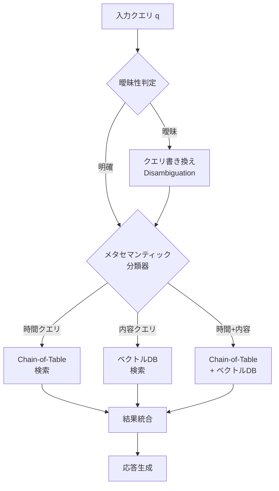

本記事は [Toward Conversational Agents with Context and Time Sensitive Long-term Memory](https://arxiv.org/abs/2406.00057)（Alonso et al., 2024）の解説記事です。

この記事は [Zenn記事: Bedrock AgentCoreで社内問い合わせエージェントを構築しメモリ永続化で精度向上](https://zenn.dev/0h_n0/articles/b7cddc45f56f1a) の深掘りです。AgentCoreのShort-term MemoryとLong-term Memoryが解決する問題の学術的背景を理解することで、メモリ永続化の設計判断をより深く行えるようになります。

## 論文概要（Abstract）

会話エージェントにおけるRAG（Retrieval-Augmented Generation）は、ユーザーとの過去の対話履歴から関連情報を検索して応答生成に活用する仕組みです。しかし、標準的なRAGアプローチには2つの重大な課題があります。第一に、「先週の火曜日に何を話した？」のような**時間・イベントベースクエリ**に対して、意味的類似度だけでは正確な検索ができません。第二に、「昨日のあの件」のような**曖昧クエリ**は、直前の会話文脈なしには意味を解釈できません。

著者らは、シミュレートされた長期会話データに基づく新しい評価データセットを構築し、標準RAGがこれらのタスクで著しく低い性能（時間クエリでRecall 5.82%）を示すことを実証しています。提案手法は、Chain-of-Table検索、ベクトルDB検索、クエリ曖昧性解消プロンプトを組み合わせたハイブリッドアプローチで、時間クエリのRecallを93.95%まで向上させています。

## 情報源

- **arXiv ID**: 2406.00057
- **URL**: [https://arxiv.org/abs/2406.00057](https://arxiv.org/abs/2406.00057)
- **著者**: Nick Alonso, Tomás Figliolia, Anthony Ndirango, Beren Millidge
- **発表年**: 2024年5月（2024年6月改訂）
- **分野**: cs.CL, cs.LG

## 背景と動機（Background & Motivation）

大規模言語モデル（LLM）をベースとした会話エージェントは、ユーザーとの長期的なインタラクションにおいて過去の対話内容を記憶・活用する能力が求められています。一般的なアプローチとして、会話履歴をベクトルデータベースに格納し、新しいクエリに対して意味的類似度（cosine similarity）で検索するRAGが広く採用されています。

しかし、著者らは標準RAGが以下の2つのクエリタイプで根本的に機能しないことを指摘しています。

### 1. 時間・イベントベースクエリの問題

ユーザーは過去の会話について「いつ」「何番目に」という時間的・順序的な参照を頻繁に行います。

- 「先週の火曜日にXについて話したのはいつ？」
- 「3番目のセッションで議論したトピックは？」
- 「1月27日にJoleneが言及したゲームは？」

これらのクエリは**意味的な内容ではなく時間的な順序**に基づく検索を必要とします。cosine similarityによるベクトル検索は、テキストの意味的類似度しか考慮しないため、時間情報を活用できません。

### 2. 曖昧クエリの問題

対話中にユーザーは代名詞や指示語を多用します。

- 「昨日のあれについてもっと教えて」
- 「さっき話したその方法を詳しく」
- 「That thing we discussed earlier」

これらの曖昧なクエリは、**直前の会話コンテキスト（セッション文脈）**なしには正しく解釈できません。しかし、標準RAGは各クエリを独立して処理するため、文脈情報を活用した曖昧性解消ができません。

### 既存手法の限界

著者らの予備実験によると、標準的なベクトル検索（multi-qa-mpnet-base-dot-v1 + FAISS）は、時間ベースクエリに対してRecall 5.82%（k=30）という極めて低い性能しか達成できていません。メタデータをテキストに連結してembeddingに含める手法でも7.47%にとどまっています。

## 主要な貢献（Key Contributions）

著者らは以下の4つの貢献を報告しています。

1. **2つの問題の定式化**: 会話エージェントの長期記憶における時間ベースクエリと曖昧クエリの問題を明確に定義し、標準RAGの限界を定量的に実証
2. **ハイブリッド検索アーキテクチャ**: Chain-of-Table検索（構造化テーブル検索）とベクトルDB検索を統合し、メタセマンティック分類器で適切な検索経路を選択するパイプラインの構築
3. **クエリ曖昧性解消プロンプト**: few-shotプロンプティングによるクエリの書き換え手法で、曖昧なクエリを文脈を含む明確なクエリに変換
4. **評価用データセットの構築**: LoCoMoデータセットを拡張し、時間ベースおよび曖昧クエリの2,134件（非曖昧）+ 1,944件（曖昧）のQAペアを含むベンチマークを構築

## 技術的詳細（Technical Details）

### 問題の定式化

会話エージェントのメモリシステムにおいて、会話履歴を $\mathcal{H} = \{(r_i, m_i)\}_{i=1}^{N}$ と定義します。ここで $r_i$ は第 $i$ 番目の応答テキスト、$m_i = (\text{speaker}_i, \text{session}_i, \text{date}_i, \text{time}_i)$ は付随するメタデータです。

クエリ $q$ に対して、関連する応答の集合 $\mathcal{R}^* \subseteq \mathcal{H}$ を検索するタスクを考えます。標準RAGはembedding関数 $\phi$ を用いてコサイン類似度でランキングします。

$$
\text{score}_{\text{semantic}}(q, r_i) = \frac{\phi(q) \cdot \phi(r_i)}{||\phi(q)|| \cdot ||\phi(r_i)||}
$$

しかし、時間ベースクエリ $q_t$（例: 「セッション5で何を話した？」）では、この類似度は機能しません。必要な検索は以下のフィルタリング操作です。

$$
\mathcal{R}^*_{t} = \{(r_i, m_i) \in \mathcal{H} \mid f_{\text{filter}}(m_i, q_t) = \text{true}\}
$$

ここで $f_{\text{filter}}$ はメタデータに対する条件フィルタ（日付範囲、セッション番号等）です。

曖昧クエリ $q_a$ に対しては、直前のコンテキスト $C = (r_{j-k}, \ldots, r_{j-1})$ を用いた曖昧性解消関数 $g$ が必要です。

$$
q'_a = g(q_a, C)
$$

ここで $q'_a$ は曖昧性が解消されたクエリです。

### ハイブリッド検索アーキテクチャ

著者らが提案するアーキテクチャは、クエリの種類に応じて適切な検索パスを選択するハイブリッドシステムです。



このパイプラインは3つのコンポーネントで構成されます。

#### 1. Chain-of-Table検索

著者らはWang et al.（2024）のChain-of-Table推論をテーブル型メモリ検索に適応しています。会話履歴を以下のカラムを持つテーブルとして構造化します。

| カラム名 | 説明 | 例 |
|---------|------|-----|
| Response_Index | 応答の通し番号 | 1, 2, 3, ... |
| Session_Index | セッション番号 | 1, 2, 3, ... |
| Speaker | 発話者 | User, Agent |
| Day_Name | 曜日 | Monday, Tuesday |
| Week | 週番号 | 1, 2, 3, ... |
| Date | 日付 | 2023-01-27 |
| Time | 時刻 | 14:30 |
| Content | 応答テキスト | "今日はMLの話を..." |

検索は2つの基本関数を連鎖的に適用します。

- `f_value(column_name, [value1, value2, ...])`: 指定カラムの値が列挙値に一致する行を検索
- `f_between(column_name, [value1, value2])`: 指定カラムの値が範囲内にある行を検索

LLMは3段階のプロンプトで関数チェーンを生成します。

1. **関数名の選択**: `f_value` と `f_between` のどちらを使うか
2. **第1引数（カラム名）の選択**: どのカラムにフィルタを適用するか
3. **第2引数（値）の選択**: フィルタの値を指定

この関数チェーンは `<END>` シグナルが生成されるまで反復的に適用されます。例えば「セッション5の火曜日に話した内容」というクエリに対しては、以下のチェーンが生成されます。

```
f_value(Session_Index, [5]) → f_value(Day_Name, [Tuesday]) → <END>
```

#### 2. ベクトルDB検索

内容ベースのクエリに対しては、標準的なベクトル検索を使用します。

- **Embeddingモデル**: multi-qa-mpnet-base-dot-v1（500Mパラメータ未満のQA特化オープンソースモデル）
- **類似度指標**: cosine similarity
- **検索実装**: FAISS flat search
- **Top-k**: k=10, 20, 30 を評価

各応答テキストをembeddingに変換し、FAISSインデックスに格納します。

#### 3. メタセマンティック分類器

クエリが「時間のみ」「内容のみ」「時間+内容」のどのカテゴリに属するかを判定し、適切な検索パスに振り分けます。「時間+内容」クエリの場合は、まずChain-of-Tableで時間的フィルタリングを行い、その結果をベクトル検索で意味的にランキングする二段階検索を実行します。

著者らの実験によると、この分類器の有無で性能が大きく変わります。分類器なしの場合、hMistral-7bの時間クエリRecallは93.95%から42.26%に低下しています（論文Table 3より）。

#### 4. クエリ曖昧性解消プロンプト

曖昧なクエリに対しては、few-shotプロンプティングで直前の3-6件の応答を文脈として与え、クエリを書き換えます。

著者らのプロンプト設計の要点は以下の通りです。

- 曖昧なクエリと直前の会話コンテキストを入力として与える
- 代名詞・指示語を具体的な名詞・内容に置換した新しいクエリを生成
- 「クエリが曖昧でない場合は、そのまま繰り返す」という指示を含める（非曖昧クエリの性能劣化を防ぐため）

## アルゴリズム（Algorithm）

提案手法のハイブリッド検索パイプラインをPythonコードで示します。

```python
from dataclasses import dataclass
from enum import Enum
from typing import Optional

import numpy as np


class QueryType(Enum):
    """クエリの種類を表す列挙型。"""

    TIME_ONLY = "time"
    CONTENT_ONLY = "content"
    TIME_AND_CONTENT = "time_and_content"


@dataclass
class ConversationResponse:
    """会話履歴の各応答を表すデータクラス。

    Attributes:
        response_index: 応答の通し番号
        session_index: セッション番号
        speaker: 発話者（User/Agent）
        date: 日付文字列（YYYY-MM-DD）
        time: 時刻文字列（HH:MM）
        day_name: 曜日名
        content: 応答テキスト
        embedding: テキストのembeddingベクトル
    """

    response_index: int
    session_index: int
    speaker: str
    date: str
    time: str
    day_name: str
    content: str
    embedding: Optional[np.ndarray] = None


def classify_query(query: str, llm_client: object) -> QueryType:
    """クエリを時間/内容/時間+内容に分類するメタセマンティック分類器。

    Args:
        query: ユーザーのクエリ文字列
        llm_client: LLMクライアント（分類プロンプト実行用）

    Returns:
        QueryType: クエリの種類
    """
    classification_prompt = f"""Classify the following query into one of three categories:
- TIME_ONLY: queries about when/order of events (e.g., "What did we discuss in session 5?")
- CONTENT_ONLY: queries about specific content (e.g., "Tell me about machine learning")
- TIME_AND_CONTENT: queries combining both (e.g., "What game did she mention on Jan 27?")

Query: {query}
Category:"""
    result = llm_client.generate(classification_prompt)
    return QueryType(result.strip().lower())


def disambiguate_query(
    query: str,
    context: list[ConversationResponse],
    llm_client: object,
) -> str:
    """曖昧なクエリを文脈情報で書き換える。

    直前の3-6件の応答を文脈として使用し、代名詞・指示語を
    具体的な名詞に置換した明確なクエリを生成する。

    Args:
        query: 曖昧な可能性のあるクエリ
        context: 直前の会話応答リスト（3-6件）
        llm_client: LLMクライアント

    Returns:
        曖昧性が解消されたクエリ文字列
    """
    context_text = "\n".join(
        f"[{r.speaker}] {r.content}" for r in context[-6:]
    )
    prompt = f"""Given the conversation context and an ambiguous query,
rewrite the query to be unambiguous. If the query is not ambiguous,
just repeat the question.

Context:
{context_text}

Ambiguous Query: {query}
Unambiguous Query:"""
    return llm_client.generate(prompt).strip()


def chain_of_table_search(
    query: str,
    table: list[ConversationResponse],
    llm_client: object,
) -> list[ConversationResponse]:
    """Chain-of-Tableによる構造化テーブル検索。

    LLMがf_value/f_between関数のチェーンを生成し、
    メタデータに対する条件フィルタリングを実行する。

    Args:
        query: 時間情報を含むクエリ
        table: 会話履歴テーブル
        llm_client: LLMクライアント

    Returns:
        フィルタリングされた応答リスト
    """
    results = list(table)

    while True:
        # LLMに次の関数呼び出しを生成させる
        func_call = llm_client.generate_function_call(query, results)

        if func_call == "<END>":
            break

        func_name, column, values = func_call
        if func_name == "f_value":
            results = [
                r for r in results
                if str(getattr(r, column)) in values
            ]
        elif func_name == "f_between":
            results = [
                r for r in results
                if values[0] <= str(getattr(r, column)) <= values[1]
            ]

    return results


def vector_search(
    query_embedding: np.ndarray,
    table: list[ConversationResponse],
    k: int = 30,
) -> list[ConversationResponse]:
    """コサイン類似度によるベクトル検索。

    Args:
        query_embedding: クエリのembeddingベクトル
        table: 会話履歴テーブル
        k: 返却する上位件数

    Returns:
        類似度上位k件の応答リスト
    """
    scored: list[tuple[float, ConversationResponse]] = []
    for response in table:
        if response.embedding is not None:
            similarity = float(
                np.dot(query_embedding, response.embedding)
                / (
                    np.linalg.norm(query_embedding)
                    * np.linalg.norm(response.embedding)
                )
            )
            scored.append((similarity, response))

    scored.sort(key=lambda x: x[0], reverse=True)
    return [r for _, r in scored[:k]]


def hybrid_search(
    query: str,
    table: list[ConversationResponse],
    context: list[ConversationResponse],
    llm_client: object,
    embedding_fn: object,
    k: int = 30,
) -> list[ConversationResponse]:
    """ハイブリッド検索パイプライン。

    1. 曖昧性解消
    2. クエリ分類
    3. 適切な検索パスの実行

    Args:
        query: ユーザーのクエリ
        table: 会話履歴テーブル
        context: 直前の会話コンテキスト
        llm_client: LLMクライアント
        embedding_fn: embedding生成関数
        k: ベクトル検索のtop-k

    Returns:
        検索結果の応答リスト
    """
    # Step 1: 曖昧性解消
    resolved_query = disambiguate_query(query, context, llm_client)

    # Step 2: クエリ分類
    query_type = classify_query(resolved_query, llm_client)

    # Step 3: 検索パスの実行
    if query_type == QueryType.TIME_ONLY:
        return chain_of_table_search(resolved_query, table, llm_client)

    if query_type == QueryType.CONTENT_ONLY:
        query_emb = embedding_fn(resolved_query)
        return vector_search(query_emb, table, k)

    # TIME_AND_CONTENT: 二段階検索
    time_filtered = chain_of_table_search(resolved_query, table, llm_client)
    query_emb = embedding_fn(resolved_query)
    return vector_search(query_emb, time_filtered, k)
```

## 実装のポイント（Implementation Notes）

### タイムスタンプ管理

著者らの実装では、セッション境界の検出に**20分間のギャップ**を閾値として使用しています。応答の時間はシミュレーションで計算されており、平均的な人間の発話速度（25語/分）を基準に応答の長さから推定されています。

実運用では、以下の点を考慮する必要があります。

- セッション境界はアプリケーションの特性に合わせて調整する（チャットボットなら30分、カスタマーサポートなら1時間等）
- タイムスタンプはISO 8601形式で統一的に管理する
- タイムゾーン情報を必ず含めて格納する（ユーザーの所在地に依存する曖昧さを排除）

### テーブル構造設計

Chain-of-Table検索の性能は、テーブルスキーマの設計に大きく依存します。著者らが使用したカラム（Response_Index, Session_Index, Speaker, Day_Name, Week, Date, Time, Content）は、想定されるクエリパターンを網羅的にカバーしています。

実運用での追加カラムとして以下が考えられます。

- `topic`: トピック分類（LLMで自動タグ付け）
- `sentiment`: 感情極性（ポジティブ/ネガティブ/ニュートラル）
- `duration_sec`: 応答にかかった時間
- `channel`: 対話チャネル（チャット、音声、メール等）

### 曖昧性解消プロンプト設計

著者らのプロンプト設計で注目すべき点は、「クエリが曖昧でない場合はそのまま繰り返す」という指示を明示的に含めていることです。これにより、既に明確なクエリに対して不必要な書き換えを行うことを防いでいます。

実運用では、曖昧性解消の前に曖昧性の有無を判定するステップを設けることで、LLM呼び出しコストを削減できます。

## Production Deployment Guide

### AWS実装パターン

本論文の提案手法をAWS上で実装する場合、規模に応じた3つの構成パターンを示します。

| 構成 | 対象 | コンピュート | ストレージ | 検索 | 月額概算 |
|------|------|------------|-----------|------|---------|
| Small | PoC/個人 | Lambda + API Gateway | DynamoDB | DynamoDB Scan + Bedrock | $50-150 |
| Medium | チーム利用 | ECS Fargate | DynamoDB + S3 | OpenSearch Serverless + Bedrock | $300-800 |
| Large | エンタープライズ | EKS | Aurora PostgreSQL | OpenSearch + Bedrock Agents | $1,500-5,000+ |

### Small構成: Lambda + DynamoDB + Bedrock

PoC段階ではサーバーレスアーキテクチャが適しています。Chain-of-Tableの構造化データはDynamoDBに格納し、ベクトル検索はBedrock Knowledge Basesで処理します。

```hcl
# terraform/small/main.tf

terraform {
  required_version = ">= 1.5"
  required_providers {
    aws = {
      source  = "hashicorp/aws"
      version = "~> 5.0"
    }
  }
}

provider "aws" {
  region = "ap-northeast-1"
}

# --- DynamoDB: 会話履歴テーブル ---
resource "aws_dynamodb_table" "conversation_history" {
  name         = "conversation-history"
  billing_mode = "PAY_PER_REQUEST"
  hash_key     = "user_id"
  range_key    = "response_index"

  attribute {
    name = "user_id"
    type = "S"
  }

  attribute {
    name = "response_index"
    type = "N"
  }

  attribute {
    name = "session_index"
    type = "N"
  }

  attribute {
    name = "date"
    type = "S"
  }

  # 時間ベースクエリ用GSI
  global_secondary_index {
    name            = "session-index"
    hash_key        = "user_id"
    range_key       = "session_index"
    projection_type = "ALL"
  }

  global_secondary_index {
    name            = "date-index"
    hash_key        = "user_id"
    range_key       = "date"
    projection_type = "ALL"
  }

  tags = {
    Environment = "production"
    Project     = "conversational-memory"
  }
}

# --- Lambda: ハイブリッド検索関数 ---
resource "aws_lambda_function" "hybrid_search" {
  function_name = "hybrid-search"
  runtime       = "python3.12"
  handler       = "handler.lambda_handler"
  timeout       = 60
  memory_size   = 512

  filename         = "lambda_package.zip"
  source_code_hash = filebase64sha256("lambda_package.zip")

  role = aws_iam_role.lambda_role.arn

  environment {
    variables = {
      TABLE_NAME         = aws_dynamodb_table.conversation_history.name
      BEDROCK_MODEL_ID   = "anthropic.claude-sonnet-4-20250514"
      EMBEDDING_MODEL_ID = "amazon.titan-embed-text-v2:0"
    }
  }
}

# --- IAM Role ---
resource "aws_iam_role" "lambda_role" {
  name = "hybrid-search-lambda-role"

  assume_role_policy = jsonencode({
    Version = "2012-10-17"
    Statement = [{
      Action = "sts:AssumeRole"
      Effect = "Allow"
      Principal = {
        Service = "lambda.amazonaws.com"
      }
    }]
  })
}

resource "aws_iam_role_policy" "lambda_policy" {
  name = "hybrid-search-policy"
  role = aws_iam_role.lambda_role.id

  policy = jsonencode({
    Version = "2012-10-17"
    Statement = [
      {
        Effect = "Allow"
        Action = [
          "dynamodb:Query",
          "dynamodb:GetItem",
          "dynamodb:Scan"
        ]
        Resource = [
          aws_dynamodb_table.conversation_history.arn,
          "${aws_dynamodb_table.conversation_history.arn}/index/*"
        ]
      },
      {
        Effect = "Allow"
        Action = [
          "bedrock:InvokeModel"
        ]
        Resource = "*"
      },
      {
        Effect = "Allow"
        Action = [
          "logs:CreateLogGroup",
          "logs:CreateLogStream",
          "logs:PutLogEvents"
        ]
        Resource = "arn:aws:logs:*:*:*"
      }
    ]
  })
}
```

### Large構成: EKS + OpenSearch

エンタープライズ環境では、OpenSearchのk-NNプラグインでベクトル検索を行い、DynamoDBまたはAurora PostgreSQLで構造化メタデータを管理します。

```hcl
# terraform/large/opensearch.tf

resource "aws_opensearch_domain" "vector_store" {
  domain_name    = "conv-memory-vectors"
  engine_version = "OpenSearch_2.13"

  cluster_config {
    instance_type          = "r6g.large.search"
    instance_count         = 2
    zone_awareness_enabled = true
  }

  ebs_options {
    ebs_enabled = true
    volume_size = 100
    volume_type = "gp3"
  }

  encrypt_at_rest {
    enabled = true
  }

  node_to_node_encryption {
    enabled = true
  }

  domain_endpoint_options {
    enforce_https       = true
    tls_security_policy = "Policy-Min-TLS-1-2-2019-07"
  }

  tags = {
    Environment = "production"
    Project     = "conversational-memory"
  }
}
```

### セキュリティベストプラクティス

1. **データ暗号化**: DynamoDB/OpenSearchの保存時暗号化（AES-256）を有効化し、通信はTLS 1.2以上を強制
2. **アクセス制御**: IAMポリシーで最小権限を適用。Lambda実行ロールにはDynamoDB/Bedrock/OpenSearchへのアクセスのみ許可
3. **PII保護**: 会話履歴にはPII（個人識別情報）が含まれる可能性が高いため、Amazon Macie でS3バケットを監視し、DynamoDBのデータはVPCエンドポイント経由でのみアクセス
4. **ログのサニタイズ**: CloudWatch Logsに会話内容を出力しない。メタデータ（session_index, response_index）のみをログに記録
5. **データ保持ポリシー**: DynamoDB TTLを活用して、一定期間後に会話履歴を自動削除

### 運用・監視設定

```python
# monitoring/cloudwatch_alarms.py
"""CloudWatchアラーム設定例。

ハイブリッド検索パイプラインの監視に必要な
メトリクスとアラームを定義する。
"""

ALARMS = {
    "hybrid_search_latency_p99": {
        "metric": "Duration",
        "namespace": "AWS/Lambda",
        "statistic": "p99",
        "threshold": 10_000,  # 10秒
        "period": 300,
        "evaluation_periods": 3,
        "description": "ハイブリッド検索のP99レイテンシが10秒超過",
    },
    "chain_of_table_error_rate": {
        "metric": "Errors",
        "namespace": "AWS/Lambda",
        "statistic": "Sum",
        "threshold": 5,
        "period": 300,
        "evaluation_periods": 2,
        "description": "Chain-of-Table検索のエラーが5分間で5件超過",
    },
    "bedrock_throttle_count": {
        "metric": "ThrottledCount",
        "namespace": "AWS/Bedrock",
        "statistic": "Sum",
        "threshold": 10,
        "period": 60,
        "evaluation_periods": 3,
        "description": "Bedrockスロットリングが1分間で10件超過",
    },
}
```

### コスト最適化チェックリスト

- [ ] DynamoDBはオンデマンド課金を使用し、予測可能なワークロードではProvisioned Capacityに切り替え
- [ ] Bedrock呼び出し回数を削減: 曖昧性判定を軽量モデル（Haiku）で実施し、Chain-of-Table生成にはSonnetを使用
- [ ] OpenSearchのUltraWarmストレージを活用し、古い会話のembeddingをコスト効率の高いストレージに移行
- [ ] Lambda関数のメモリサイズを最適化（AWS Lambda Power Tuningで測定）
- [ ] CloudFrontキャッシュで同一クエリの重複検索を削減（TTL 5分）
- [ ] Bedrock Batch Inferenceを活用し、バッチ処理可能な曖昧性解消を夜間に実行

## 実験結果（Experimental Results）

### データセット

著者らはLoCoMo（Maharana et al., 2024）データセットの35件のGPT-4生成ダイアログから最も長い12件を選択し、拡張しています。各ダイアログは平均9,209トークン、19セッションで構成されています。

評価用クエリとして、11種類のテンプレート（earlier_today, date_span, dates, day_span, last_day, month, rel_day, rel_month, rel_session, session_span, session）を用いて以下を生成しています。

- **非曖昧時間ベースクエリ**: 2,134件（11,612バリエーション）
- **曖昧時間ベースクエリ**: 1,944件（8,526バリエーション）
- **時間+内容クエリ**: 177件

### 評価指標

著者らはRecallとF2スコアを使用しています。F2スコアはRecallをPrecisionの5倍重み付けする指標で、RAGシステムでは「関連情報の取りこぼし」がLLMの応答品質に直結するため、再現率重視の設計になっています。

$$
F_2 = \frac{5 \times \text{Precision} \times \text{Recall}}{4 \times \text{Precision} + \text{Recall}}
$$

### 非曖昧クエリの結果

著者らの実験によると、提案手法は標準RAGベースラインを大幅に上回っています（論文Table 1より）。

| 手法 | 時間クエリ Recall | 時間クエリ F2 | 時間+内容 Recall | 時間+内容 F2 |
|------|-----------------|-------------|----------------|-------------|
| Semantic (k=30) | 5.82% | 5.89 | 29.43% | 4.43 |
| Semantic w/MetaData (k=30) | 7.47% | 7.55 | 56.40% | 8.43 |
| CoTable+Semantic (hMistral-7b) | **93.95%** | **87.67** | 65.30% | 22.69 |
| CoTable+Semantic (GPT-3.5) | 90.47% | 78.34 | **90.17%** | **32.19** |

標準ベクトル検索のRecallが5.82%であるのに対し、提案手法（hMistral-7b）は93.95%を達成しており、**約16倍の改善**を示しています。

### 曖昧クエリの結果

曖昧クエリに対する曖昧性解消手法の効果も顕著です（論文Table 2より）。

| 手法 | hMistral Recall | hMistral F2 | GPT-3.5 Recall | GPT-3.5 F2 |
|------|---------------|------------|---------------|-----------|
| 元のクエリ（解消なし） | 2.93% | 2.35 | 10.62% | 3.12 |
| コンテキスト連結 | 73.51% | 61.59 | 77.27% | 65.47 |
| クエリ書き換え（提案手法） | **89.43%** | **81.05** | 83.90% | 72.56 |

元のクエリでは2.93%だったRecallが、クエリ書き換えにより89.43%に向上しています。単純なコンテキスト連結（73.51%）と比較しても、クエリ書き換えの方が高い性能を示しています。

### アブレーション分析

メタセマンティック分類器の効果を検証するアブレーション実験の結果も報告されています（論文Table 3より）。

| 構成 | hMistral 時間 Recall | GPT-3.5 時間+内容 Recall |
|------|------|------|
| 分類器あり（提案手法） | 93.95% | 90.17% |
| 分類器なし | 42.26% | 63.10% |

分類器を除去すると、hMistralでは時間クエリのRecallが93.95%から42.26%へと大幅に低下しています。これは、クエリの種類に応じた検索パスの選択が性能に不可欠であることを示しています。

### 使用モデルとハードウェア

著者らはhMistral-7b（OpenHermes、Mistral 7Bのファインチューニングモデル）とGPT-3.5-turboを使用しています。hMistral-7bは単一L40 GPUで推論を実行しており、すべてのテキスト生成にグリーディサンプリングを使用しています。

## 実運用への応用（Practical Applications）

### AgentCore Memoryとの関連

AWS Bedrock AgentCoreは、Short-term Memory（セッション内の直近コンテキスト）とLong-term Memory（セッションをまたぐ永続的記憶）の2種類のメモリを提供しています。本論文の知見は、AgentCoreのメモリ設計と以下のように対応します。

1. **曖昧クエリ → Short-term Memory**: AgentCoreのShort-term Memoryは直近の会話コンテキストを保持しており、本論文のクエリ曖昧性解消と同等の機能を果たします。「昨日のあれ」のような曖昧な参照を、直近の会話文脈から解決できます。

2. **時間ベースクエリ → Long-term Memory + タイムスタンプメタデータ**: AgentCoreのLong-term Memoryにタイムスタンプメタデータを付与することで、本論文のChain-of-Table検索に相当する時間ベースの検索が可能になります。

3. **ハイブリッド検索 → AgentCore検索設定**: AgentCoreのメモリ検索はベクトル検索がベースですが、メタデータフィルタリングと組み合わせることで、本論文の提案手法に近いハイブリッド検索を実現できます。

### 社内問い合わせでの時間クエリ活用

社内問い合わせエージェントでは、以下のような時間ベースクエリが頻出します。

- 「先月のシステム障害の対応内容を教えて」
- 「前回の人事面談で話した目標は？」
- 「先週の金曜日に決まった方針は何だった？」

本論文の知見を踏まえると、会話履歴のメタデータとして日時・セッション情報を構造化して格納し、クエリの種類に応じて検索戦略を切り替えることが、回答精度の向上に直結します。

## 関連研究（Related Work）

### TimeQA（Chen et al., 2021）

時間的推論を必要とするQAデータセットで、Wikipediaの時間的情報に基づく質問応答を扱います。本論文との違いは、TimeQAが静的な文書に対する時間推論であるのに対し、本論文は動的な会話履歴に対する時間検索を扱う点です。

### LoCoMo（Maharana et al., 2024）

長期的な会話における記憶と推論を評価するベンチマークデータセットです。GPT-4で生成された35件のマルチセッション会話で構成されています。本論文はLoCoMoの12件を選択・拡張し、時間ベースおよび曖昧クエリの評価データセットを構築しています。

### GoodAI LTM Benchmark（Castillo et al., 2024）

長期記憶（Long-Term Memory）を持つ会話エージェントの評価ベンチマークです。複数セッションにまたがる記憶の保持と検索を評価します。本論文は類似の問題設定ですが、特に時間的推論と曖昧性解消に焦点を当てている点で差別化されています。

### Chain-of-Table（Wang et al., 2024）

テーブル形式のデータに対するLLMの推論を改善する手法です。LLMがテーブル操作（選択、フィルタリング等）を連鎖的に生成し、段階的にテーブルを変換して回答を導出します。本論文はこのChain-of-Table推論を会話メモリの時間検索に適応しています。

### CAsT（Dalton et al., 2020-2021）

会話的な曖昧クエリに対する情報検索のベンチマーク（Conversational Assistance Track）です。WikipediaやニュースコーパスにおけるConversational Search を扱っています。本論文は文書検索ではなく会話履歴検索における曖昧性解消を対象としています。

## まとめと今後の展望

本論文は、会話エージェントの長期記憶における2つの根本的な課題（時間ベースクエリと曖昧クエリ）を定式化し、標準RAGの限界を定量的に示した点で重要な貢献をしています。

提案手法のハイブリッドアプローチは、Chain-of-Table検索による構造化メタデータの活用、ベクトルDB検索による意味的検索、クエリ曖昧性解消プロンプトによる文脈理解を統合することで、時間クエリでRecall 93.95%（標準RAGの5.82%から約16倍改善）、曖昧クエリでRecall 89.43%（元クエリの2.93%から約30倍改善）を達成しています。

今後の発展として、以下の方向性が考えられます。

1. **大規模LLMの活用**: 著者らはhMistral-7bとGPT-3.5で評価していますが、より大規模なモデル（Claude, GPT-4等）での性能評価が今後の課題です
2. **リアルタイム対話への適用**: 現在のデータセットはシミュレーションですが、実際のユーザー対話での評価が必要です
3. **マルチモーダル情報の統合**: 画像や音声を含む会話履歴への拡張が、実用的な会話エージェントには重要です
4. **AgentCoreとの統合**: AWS Bedrock AgentCoreのメモリ機能にChain-of-Table検索を組み込むことで、より高精度な長期記憶システムを構築できる可能性があります

## 参考文献

1. Alonso, N., Figliolia, T., Ndirango, A., & Millidge, B. (2024). Toward Conversational Agents with Context and Time Sensitive Long-term Memory. *arXiv preprint arXiv:2406.00057*.
2. Wang, Z., et al. (2024). Chain-of-Table: Evolving Tables in the Reasoning Chain for Table Understanding. *ICLR 2024*.
3. Maharana, A., et al. (2024). Evaluating Very Long-Term Conversational Memory of LLM Agents. *ACL 2024*.
4. Castillo, C., et al. (2024). GoodAI LTM Benchmark: A Benchmark for Long-Term Memory in Conversational AI. *arXiv preprint*.
5. Lewis, P., et al. (2020). Retrieval-Augmented Generation for Knowledge-Intensive NLP Tasks. *NeurIPS 2020*.
6. Dalton, J., et al. (2020). CAsT-19: A Dataset for Conversational Information Seeking. *SIGIR 2020*.
7. Chen, W., et al. (2021). A Dataset for Answering Time-Sensitive Questions. *NeurIPS 2021 Datasets and Benchmarks Track*.
8. Mao, Y., et al. (2023). Large Language Model Augmented Query Rewriting for Retrieval. *arXiv preprint*.
