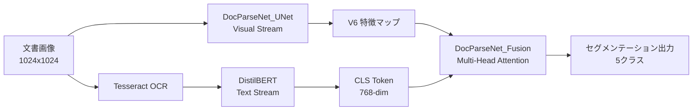

## 論文概要（Abstract）

DocParseNetは、スキャンされた文書画像のセマンティックセグメンテーションにOCR埋め込みを統合したマルチモーダルアーキテクチャである。従来のセマンティックセグメンテーション手法が視覚特徴のみに依存していたのに対し、本手法はTesseract OCRで抽出したテキスト情報をDistilBERTで符号化し、視覚ストリームとマルチヘッドアテンションで融合する。著者らは、4,102件の企業契約書PDFから生成した19,821枚のアノテーション画像を用いた評価で、mIoU 49.78を達成し、ベースライン（GCNet: 30.18）から約65%の改善を報告している。注目すべきは、わずか2.8Mパラメータ（SegFormer-B5の約29分の1）、0.039 TFLOPsという計算効率の高さである。

この記事は [Zenn記事: Claude Opus 4.7のVisionで帳票OCRパイプラインを構築する実践ガイド](https://zenn.dev/0h_n0/articles/cf6a2a6d3a7abc) の深掘りです。

## 情報源

- **arXiv ID**: 2406.17591
- **URL**: [https://arxiv.org/abs/2406.17591](https://arxiv.org/abs/2406.17591)
- **著者**: Ahmad Mohammadshirazi, Ali Nosrati Firoozsalari, Mengxi Zhou et al.（Ohio State University）
- **発表年**: 2024
- **分野**: cs.CV（Computer Vision）
- **コード**: [https://github.com/ahmad-shirazi/DocParseNet](https://github.com/ahmad-shirazi/DocParseNet)

## 背景と動機（Background & Motivation）

スキャンされた文書の自動解析は、契約書管理、請求書処理、法務文書のデジタル化など幅広い業務で需要がある。従来のアプローチは大きく二つに分かれていた。一つはOCRベースのパイプラインで、テキスト抽出後にルールや自然言語処理で構造化する方法である。もう一つはセマンティックセグメンテーションによるピクセルレベルの領域分類である。

しかし、既存のセマンティックセグメンテーション手法（DeepLabV3、UPerNet、SegFormer等）は自然画像向けに設計されており、文書画像特有の課題に十分対応できていなかった。文書画像では、タイトル・署名欄・住所欄といった領域が視覚的に類似しており、レイアウト情報だけでは区別が困難な場合がある。また、SegFormer-B5のような高性能モデルは81.97Mパラメータを要し、エッジデバイスやコスト制約のある環境での運用が難しい。

著者らは、この問題に対して「テキスト情報を視覚特徴に融合する」というマルチモーダルアプローチを提案し、精度と効率の両立を目指している。

## 主要な貢献（Key Contributions）

- **マルチモーダル融合アーキテクチャ**: UNetベースの視覚ストリームとOCRテキストストリームをマルチヘッドアテンションで融合する新規アーキテクチャ（DocParseNet）の提案
- **Shifted MLPエンコーディングブロック**: 従来のConvolution/Transformerブロックに代わる、空間方向シフト操作とMLPを組み合わせた軽量エンコーディングブロックの導入
- **計算効率の大幅改善**: 2.8Mパラメータ、0.039 TFLOPsで、SegFormer-B5（81.97M、0.387 TFLOPs）をmIoUで15ポイント上回る結果を達成
- **大規模文書データセットの構築**: 4,102件の企業契約書PDFから19,821枚のアノテーション画像、5クラスのデータセットを構築

## 技術的詳細（Technical Details）

### 全体アーキテクチャ

DocParseNetは3つのコンポーネントから構成される。



1. **DocParseNet_UNet（Visual Stream）**: Modified UNetベースの視覚特徴抽出
2. **DocParseNet_OCR（Text Stream）**: Tesseract OCR + DistilBERTによるテキスト特徴抽出
3. **DocParseNet_Fusion**: マルチヘッドアテンションによる2ストリームの融合

### DocParseNet_UNet（Visual Stream）

視覚ストリームはModified UNetをベースとし、エンコーダ部分にShifted MLPブロックを採用している。チャネル構成は$[16, 32, 64, 128, 256, 320]$の6段階で、段階的に特徴マップの空間解像度を下げながらチャネル数を増やす。最終段のV6特徴マップが融合モジュールへの入力となる。

従来のUNetがConvolutionブロックを使用するのに対し、DocParseNetではShifted MLPブロックを採用することで、大幅なパラメータ削減を実現している。

### Shifted MLPブロック

Shifted MLPブロックは、空間方向のシフト操作と線形変換を組み合わせた軽量な特徴抽出モジュールである。以下の5ステップで構成される。

**Step 1**: 入力特徴マップを幅方向にシフトする。

$$
X_{\text{shift\_w}} = \text{Shift}_w(X)
$$

**Step 2**: 線形変換を適用する。

$$
X' = W_1 \cdot X_{\text{shift\_w}} + b_1
$$

**Step 3**: Depthwise Convolution（DWConv）とMish活性化関数を適用する。

$$
X'' = \text{Mish}(\text{DWConv}(X'))
$$

ここでMish活性化関数は以下のように定義される。

$$
\text{Mish}(x) = x \cdot \tanh(\text{softplus}(x)) = x \cdot \tanh(\ln(1 + e^x))
$$

**Step 4**: 高さ方向にシフトする。

$$
X_{\text{shift\_h}} = \text{Shift}_h(X'')
$$

**Step 5**: 2回目の線形変換を適用する。

$$
X_{\text{out}} = W_2 \cdot X_{\text{shift\_h}} + b_2
$$

ここで、
- $X \in \mathbb{R}^{B \times C \times H \times W}$: 入力特徴マップ
- $W_1, W_2$: 線形変換の重み行列
- $b_1, b_2$: バイアスベクトル
- $\text{Shift}_w, \text{Shift}_h$: それぞれ幅・高さ方向の巡回シフト操作

このシフト操作は、パラメータフリーで近傍ピクセルの情報を集約する手法であり、Convolutionの代替として機能する。Convolutionカーネルのような学習パラメータを持たないため、モデル全体のパラメータ数を抑制できる。

### DocParseNet_OCR（Text Stream）

テキストストリームでは、まずTesseract OCRで文書画像からテキストを抽出する。抽出されたテキストをDistilBERTに入力し、[CLS]トークンの768次元ベクトルを文書全体のテキスト表現として取得する。

$$
\mathbf{e}_{\text{text}} = \text{DistilBERT}(\text{Tesseract}(I))_{\text{[CLS]}} \in \mathbb{R}^{768}
$$

ここで、$I$は入力文書画像、$\mathbf{e}_{\text{text}}$はテキスト埋め込みベクトルである。

DistilBERTはBERTの蒸留モデルであり、66Mパラメータ（BERTの約40%）で元モデルの97%の性能を維持する。文書解析タスクではテキスト量が限定的であるため、この軽量モデルで十分な表現力が得られると著者らは述べている。

### DocParseNet_Fusion

融合モジュールでは、視覚ストリームのV6特徴マップ$\mathbf{V} \in \mathbb{R}^{C_v \times H \times W}$とテキスト埋め込み$\mathbf{e}_{\text{text}} \in \mathbb{R}^{768}$をマルチヘッドアテンションで統合する。

$$
\text{Fusion}(\mathbf{V}, \mathbf{e}_{\text{text}}) = \text{MHA}(Q=\mathbf{V}, K=\mathbf{e}_{\text{text}}, V=\mathbf{e}_{\text{text}})
$$

ここで、MHAはMulti-Head Attentionを表す。視覚特徴をQuery、テキスト埋め込みをKey/Valueとして使用することで、テキスト情報に基づいて視覚特徴の重み付けを行う。

ただし、論文中では$\mathbf{V}$（320チャネル）と$\mathbf{e}_{\text{text}}$（768次元）の次元整合に関する詳細な説明が不足している点に注意が必要である。線形射影による次元変換が行われていると推測されるが、論文中に明示されていない。

### アルゴリズム

以下にDocParseNetの推論パイプラインの主要コンポーネントを擬似コードで示す。

```python
import torch
import torch.nn as nn
from transformers import DistilBertModel, DistilBertTokenizer
import pytesseract
from PIL import Image


class ShiftedMLPBlock(nn.Module):
    """Shifted MLP encoding block for DocParseNet.

    Replaces convolution with shift operations + linear transforms
    for parameter-efficient feature extraction.

    Args:
        in_channels: Number of input channels
        out_channels: Number of output channels
        shift_size: Pixels to shift in each direction
    """

    def __init__(self, in_channels: int, out_channels: int, shift_size: int = 1):
        super().__init__()
        self.shift_size = shift_size
        self.linear1 = nn.Linear(in_channels, out_channels)
        self.dwconv = nn.Conv2d(
            out_channels, out_channels,
            kernel_size=3, padding=1, groups=out_channels,
        )
        self.linear2 = nn.Linear(out_channels, out_channels)

    def shift_width(self, x: torch.Tensor) -> torch.Tensor:
        """Circular shift along width dimension."""
        return torch.roll(x, shifts=self.shift_size, dims=-1)

    def shift_height(self, x: torch.Tensor) -> torch.Tensor:
        """Circular shift along height dimension."""
        return torch.roll(x, shifts=self.shift_size, dims=-2)

    def forward(self, x: torch.Tensor) -> torch.Tensor:
        """Forward pass through Shifted MLP block.

        Args:
            x: Input tensor of shape (B, C, H, W)

        Returns:
            Output tensor of shape (B, C_out, H, W)
        """
        # Step 1: Shift along width
        x = self.shift_width(x)

        # Step 2: Linear transform (channel mixing)
        x = x.permute(0, 2, 3, 1)  # (B, H, W, C)
        x = self.linear1(x)
        x = x.permute(0, 3, 1, 2)  # (B, C_out, H, W)

        # Step 3: DWConv + Mish activation
        x = torch.nn.functional.mish(self.dwconv(x))

        # Step 4: Shift along height
        x = self.shift_height(x)

        # Step 5: Second linear transform
        x = x.permute(0, 2, 3, 1)
        x = self.linear2(x)
        x = x.permute(0, 3, 1, 2)

        return x


class DocParseNetInference:
    """DocParseNet inference pipeline.

    Args:
        visual_model: Trained UNet with Shifted MLP blocks
        fusion_model: Multi-head attention fusion module
        device: Computation device
    """

    def __init__(
        self,
        visual_model: nn.Module,
        fusion_model: nn.Module,
        device: str = "cuda",
    ):
        self.visual_model = visual_model.to(device)
        self.fusion_model = fusion_model.to(device)
        self.tokenizer = DistilBertTokenizer.from_pretrained("distilbert-base-uncased")
        self.text_encoder = DistilBertModel.from_pretrained(
            "distilbert-base-uncased",
        ).to(device)
        self.device = device

    def extract_text(self, image: Image.Image) -> str:
        """Extract text from document image using Tesseract OCR."""
        return pytesseract.image_to_string(image)

    def encode_text(self, text: str) -> torch.Tensor:
        """Encode extracted text to 768-dim embedding via DistilBERT [CLS].

        Args:
            text: OCR-extracted text string

        Returns:
            Text embedding tensor of shape (1, 768)
        """
        inputs = self.tokenizer(
            text, return_tensors="pt", truncation=True, max_length=512,
        )
        inputs = {k: v.to(self.device) for k, v in inputs.items()}
        with torch.no_grad():
            outputs = self.text_encoder(**inputs)
        return outputs.last_hidden_state[:, 0, :]  # [CLS] token: (1, 768)

    def predict(self, image: Image.Image) -> torch.Tensor:
        """Run full DocParseNet inference pipeline.

        Args:
            image: Input document image (will be resized to 1024x1024)

        Returns:
            Segmentation mask of shape (H, W) with class indices
        """
        # Visual stream
        img_tensor = self._preprocess(image)  # -> (1, 3, 1024, 1024)
        v6_features = self.visual_model(img_tensor)

        # Text stream
        text = self.extract_text(image)
        text_embedding = self.encode_text(text)

        # Fusion + classification
        fused = self.fusion_model(v6_features, text_embedding)

        return fused.argmax(dim=1).squeeze(0)
```

## 実装のポイント（Implementation）

著者らが報告している実装の詳細は以下の通りである。

**学習設定**:
- 入力解像度: 1024x1024
- バッチサイズ: 8
- 学習率: 0.01
- エポック数: 1700
- GPU: NVIDIA A100 80GB
- 活性化関数: Mish（ReLUやGELUではなく）
- フレームワーク: PyTorch

**実装上の注意点**:

1. **Shift操作の境界処理**: `torch.roll`による巡回シフトを使用しているため、画像の端でアーティファクトが発生する可能性がある。実運用ではゼロパディングやリフレクションパディングへの変更も検討に値する

2. **OCRの前処理**: Tesseract OCRの精度は入力画像の品質に大きく依存する。二値化、ノイズ除去、傾き補正などの前処理が推論精度に直結する

3. **DistilBERTの最大入力長**: 512トークンに制限されるため、テキスト量の多い文書では情報の欠落が生じうる。ただし、[CLS]トークンの文書全体表現としての有効性は、文書分類タスクで広く検証されている

4. **過学習への対策**: 論文Table 3より、訓練mIoU 71.79に対して検証mIoU 42.23と大きな乖離が見られる。正則化やデータ拡張の強化が改善余地として存在する

## Production Deployment Guide

DocParseNetは[GitHubリポジトリ](https://github.com/ahmad-shirazi/DocParseNet)で実装が公開されており、PyTorchベースでプロダクション展開が可能である。以下では、文書セグメンテーションパイプラインをAWS上に構築する際の実践的なガイドを示す。

### AWS実装パターン（コスト最適化重視）

DocParseNetのモデルサイズ（2.8Mパラメータ）は非常に小さく、推論時の計算量も0.039 TFLOPsと軽量であるため、GPU不要のCPU推論で十分に運用可能である。ただし、Tesseract OCRとDistilBERTの推論が加わるため、エンドツーエンドのレイテンシにはそれらのオーバーヘッドも考慮する必要がある。

| 構成 | トラフィック | サービス構成 | 月額コスト（概算） |
|------|-------------|-------------|-------------------|
| Small | ~100 req/日 | Lambda + S3 + DynamoDB | $50-120 |
| Medium | ~1,000 req/日 | ECS Fargate + ALB + ElastiCache | $300-700 |
| Large | 10,000+ req/日 | EKS + Spot Instances + S3 | $1,500-4,000 |

**Small構成（~100 req/日）**:
- AWS Lambda（メモリ2048MB、タイムアウト60秒）でDocParseNet推論を実行
- Tesseract OCRはLambda Layerとしてパッケージ化
- DistilBERT + DocParseNetモデルはS3からコールドスタート時にロード
- DynamoDBで解析結果を永続化（On-Demandモード）
- 月額内訳: Lambda $10-20、S3 $5、DynamoDB $5-15、データ転送 $5-10、その他 $25-70

**Medium構成（~1,000 req/日）**:
- ECS Fargate（0.5 vCPU、2GB RAM）でコンテナ常駐。モデルプリロードでコールドスタート回避
- ElastiCacheでOCR結果キャッシュ（同一文書の再処理回避）
- ALBで負荷分散、Auto Scalingで2-4タスクを動的調整
- 月額内訳: Fargate $100-250、ALB $20、ElastiCache $50-100、S3/DynamoDB $20-50、その他 $110-280

**Large構成（10,000+ req/日）**:
- EKS + Karpenter、Spot Instances優先（最大90%コスト削減）
- GPU不要（2.8Mパラメータのため CPU推論で十分なスループット）
- Horizontal Pod Autoscaler（HPA）でリクエスト数に応じたスケーリング
- 月額内訳: EKS Control Plane $73、Spot EC2 $200-800、S3/DynamoDB $100-300、監視 $50-100、その他 $1,077-2,727

**コスト削減テクニック**:
- Spot Instances活用で最大90%削減（DocParseNetの推論は短時間で完了し中断耐性が高い）
- Reserved Instances 1年コミットで最大72%削減（Medium/Large構成向け）
- S3 Intelligent-Tieringでストレージコスト最適化
- 同一文書の再処理をElastiCacheで回避し、不要な推論を削減

> **注**: 上記コストは2026年5月時点のAWS ap-northeast-1（東京）リージョン料金に基づく概算値である。実際のコストはトラフィックパターン、リージョン、バースト使用量により変動する。最新料金は[AWS料金計算ツール](https://calculator.aws/)で確認を推奨する。

### Terraformインフラコード

#### Small構成（Serverless: Lambda + S3 + DynamoDB）

```hcl
# DocParseNet Serverless deployment
# Lambda + S3 + DynamoDB構成

terraform {
  required_version = ">= 1.9"
  required_providers {
    aws = {
      source  = "hashicorp/aws"
      version = "~> 5.80"
    }
  }
}

provider "aws" {
  region = "ap-northeast-1"
}

# --- IAM Role (最小権限) ---
resource "aws_iam_role" "docparsenet_lambda" {
  name = "docparsenet-lambda-role"
  assume_role_policy = jsonencode({
    Version = "2012-10-17"
    Statement = [{
      Action = "sts:AssumeRole"
      Effect = "Allow"
      Principal = { Service = "lambda.amazonaws.com" }
    }]
  })
}

resource "aws_iam_role_policy" "docparsenet_lambda" {
  name = "docparsenet-lambda-policy"
  role = aws_iam_role.docparsenet_lambda.id
  policy = jsonencode({
    Version = "2012-10-17"
    Statement = [
      {
        Effect   = "Allow"
        Action   = ["s3:GetObject"]
        Resource = "${aws_s3_bucket.models.arn}/*"
      },
      {
        Effect = "Allow"
        Action = [
          "dynamodb:PutItem",
          "dynamodb:GetItem",
          "dynamodb:Query"
        ]
        Resource = aws_dynamodb_table.results.arn
      },
      {
        Effect = "Allow"
        Action = [
          "logs:CreateLogGroup",
          "logs:CreateLogStream",
          "logs:PutLogEvents"
        ]
        Resource = "arn:aws:logs:*:*:*"
      },
      {
        Effect   = "Allow"
        Action   = ["xray:PutTraceSegments", "xray:PutTelemetryRecords"]
        Resource = "*"
      }
    ]
  })
}

# --- S3 Bucket (モデル格納、KMS暗号化) ---
resource "aws_s3_bucket" "models" {
  bucket = "docparsenet-models-${data.aws_caller_identity.current.account_id}"
}

resource "aws_s3_bucket_server_side_encryption_configuration" "models" {
  bucket = aws_s3_bucket.models.id
  rule {
    apply_server_side_encryption_by_default {
      sse_algorithm = "aws:kms"
    }
  }
}

resource "aws_s3_bucket_public_access_block" "models" {
  bucket                  = aws_s3_bucket.models.id
  block_public_acls       = true
  block_public_policy     = true
  ignore_public_acls      = true
  restrict_public_buckets = true
}

# --- DynamoDB (解析結果格納、On-Demand課金) ---
resource "aws_dynamodb_table" "results" {
  name         = "docparsenet-results"
  billing_mode = "PAY_PER_REQUEST"  # On-Demand: 低トラフィックでコスト最適
  hash_key     = "document_id"
  range_key    = "processed_at"

  attribute {
    name = "document_id"
    type = "S"
  }
  attribute {
    name = "processed_at"
    type = "S"
  }

  server_side_encryption {
    enabled = true  # KMS暗号化
  }

  point_in_time_recovery {
    enabled = true
  }
}

# --- ECR Repository ---
resource "aws_ecr_repository" "docparsenet" {
  name                 = "docparsenet"
  image_tag_mutability = "IMMUTABLE"

  image_scanning_configuration {
    scan_on_push = true  # セキュリティスキャン
  }

  encryption_configuration {
    encryption_type = "KMS"
  }
}

# --- Lambda Function ---
resource "aws_lambda_function" "docparsenet" {
  function_name = "docparsenet-inference"
  role          = aws_iam_role.docparsenet_lambda.arn
  package_type  = "Image"
  image_uri     = "${aws_ecr_repository.docparsenet.repository_url}:latest"
  memory_size   = 2048  # Tesseract + DistilBERT + DocParseNet
  timeout       = 60
  architectures = ["x86_64"]

  environment {
    variables = {
      MODEL_BUCKET  = aws_s3_bucket.models.id
      RESULTS_TABLE = aws_dynamodb_table.results.name
    }
  }

  tracing_config {
    mode = "Active"  # X-Ray有効化
  }
}

# --- CloudWatch Alarm (コスト・パフォーマンス監視) ---
resource "aws_cloudwatch_metric_alarm" "lambda_duration" {
  alarm_name          = "docparsenet-high-duration"
  comparison_operator = "GreaterThanThreshold"
  evaluation_periods  = 3
  metric_name         = "Duration"
  namespace           = "AWS/Lambda"
  period              = 300
  statistic           = "Average"
  threshold           = 30000  # 30秒超過でアラート
  alarm_description   = "DocParseNet Lambda execution time exceeds 30s"

  dimensions = {
    FunctionName = aws_lambda_function.docparsenet.function_name
  }
}

data "aws_caller_identity" "current" {}
```

#### Large構成（Container: EKS + Karpenter + Spot Instances）

```hcl
# DocParseNet Container deployment
# EKS + Karpenter + Spot Instances構成

module "vpc" {
  source  = "terraform-aws-modules/vpc/aws"
  version = "~> 5.16"

  name = "docparsenet-vpc"
  cidr = "10.0.0.0/16"

  azs             = ["ap-northeast-1a", "ap-northeast-1c", "ap-northeast-1d"]
  private_subnets = ["10.0.1.0/24", "10.0.2.0/24", "10.0.3.0/24"]
  public_subnets  = ["10.0.101.0/24", "10.0.102.0/24", "10.0.103.0/24"]

  enable_nat_gateway = true
  single_nat_gateway = true  # コスト最適化: NAT Gateway 1台に集約
}

module "eks" {
  source  = "terraform-aws-modules/eks/aws"
  version = "~> 20.31"

  cluster_name    = "docparsenet-cluster"
  cluster_version = "1.31"

  vpc_id     = module.vpc.vpc_id
  subnet_ids = module.vpc.private_subnets

  cluster_endpoint_public_access = false  # プライベートアクセスのみ

  enable_cluster_creator_admin_permissions = true
}

# --- Karpenter (Spot優先で自動スケーリング) ---
module "karpenter" {
  source  = "terraform-aws-modules/eks/aws//modules/karpenter"
  version = "~> 20.31"

  cluster_name          = module.eks.cluster_name
  enable_v1_permissions = true

  node_iam_role_additional_policies = {
    AmazonSSMManagedInstanceCore = "arn:aws:iam::aws:policy/AmazonSSMManagedInstanceCore"
  }
}

# --- Secrets Manager (設定・認証情報) ---
resource "aws_kms_key" "docparsenet" {
  description             = "DocParseNet secrets encryption key"
  deletion_window_in_days = 7
  enable_key_rotation     = true
}

resource "aws_secretsmanager_secret" "docparsenet_config" {
  name       = "docparsenet/config"
  kms_key_id = aws_kms_key.docparsenet.id
}

# --- AWS Budgets (予算アラート) ---
resource "aws_budgets_budget" "docparsenet" {
  name         = "docparsenet-monthly"
  budget_type  = "COST"
  limit_amount = "4000"
  limit_unit   = "USD"
  time_unit    = "MONTHLY"

  cost_filter {
    name   = "TagKeyValue"
    values = ["user:Project$docparsenet"]
  }

  notification {
    comparison_operator        = "GREATER_THAN"
    threshold                  = 80
    threshold_type             = "PERCENTAGE"
    notification_type          = "ACTUAL"
    subscriber_email_addresses = ["alerts@example.com"]
  }

  notification {
    comparison_operator        = "GREATER_THAN"
    threshold                  = 100
    threshold_type             = "PERCENTAGE"
    notification_type          = "FORECASTED"
    subscriber_email_addresses = ["alerts@example.com"]
  }
}
```

### 運用・監視設定

**CloudWatch Logs Insights クエリ**:

```
# レイテンシ分析 (P95, P99)
fields @timestamp, @duration
| filter @type = "REPORT"
| stats percentile(@duration, 95) as p95_ms,
        percentile(@duration, 99) as p99_ms,
        avg(@duration) as avg_ms
  by bin(1h)

# OCRフェーズのエラー率監視
fields @timestamp, @message
| filter @message like /ERROR/ and @message like /tesseract|ocr/
| stats count(*) as error_count by bin(1h)
```

**CloudWatch アラーム設定（Python）**:

```python
import boto3


def create_docparsenet_alarms(function_name: str, sns_topic_arn: str) -> None:
    """Create CloudWatch alarms for DocParseNet Lambda monitoring.

    Args:
        function_name: Lambda function name
        sns_topic_arn: SNS topic ARN for alarm notifications
    """
    cloudwatch = boto3.client("cloudwatch", region_name="ap-northeast-1")

    # Lambda実行時間異常検知 (P99 > 45秒でアラート)
    cloudwatch.put_metric_alarm(
        AlarmName=f"{function_name}-high-duration",
        MetricName="Duration",
        Namespace="AWS/Lambda",
        ExtendedStatistic="p99",
        Period=300,
        EvaluationPeriods=3,
        Threshold=45000,  # 45秒 (タイムアウト60秒の75%)
        ComparisonOperator="GreaterThanThreshold",
        Dimensions=[{"Name": "FunctionName", "Value": function_name}],
        AlarmActions=[sns_topic_arn],
    )

    # エラー率検知 (5分間で5件以上)
    cloudwatch.put_metric_alarm(
        AlarmName=f"{function_name}-high-errors",
        MetricName="Errors",
        Namespace="AWS/Lambda",
        Statistic="Sum",
        Period=300,
        EvaluationPeriods=2,
        Threshold=5,
        ComparisonOperator="GreaterThanThreshold",
        Dimensions=[{"Name": "FunctionName", "Value": function_name}],
        AlarmActions=[sns_topic_arn],
    )
```

**X-Ray トレーシング設定（Python）**:

```python
from aws_xray_sdk.core import xray_recorder, patch_all

# boto3自動計装
patch_all()


def trace_docparsenet_inference(document_id: str, image_bytes: bytes) -> dict:
    """Trace DocParseNet inference with X-Ray subsegments.

    Args:
        document_id: Unique document identifier
        image_bytes: Raw image bytes

    Returns:
        Inference result with trace metadata
    """
    segment = xray_recorder.begin_subsegment("docparsenet_inference")
    segment.put_annotation("document_id", document_id)
    segment.put_metadata("image_size_bytes", len(image_bytes))

    try:
        # OCR phase tracing
        with xray_recorder.capture("tesseract_ocr"):
            text = extract_text(image_bytes)
            segment.put_metadata("ocr_text_length", len(text))

        # DistilBERT encoding phase
        with xray_recorder.capture("distilbert_encoding"):
            text_embedding = encode_text(text)

        # DocParseNet inference phase
        with xray_recorder.capture("segmentation_inference"):
            result = run_segmentation(image_bytes, text_embedding)
            segment.put_metadata("num_segments", int(result["num_classes"]))

        return result
    finally:
        xray_recorder.end_subsegment()
```

**Cost Explorer自動レポート（Python）**:

```python
from datetime import datetime, timedelta

import boto3


def get_daily_cost_report(sns_topic_arn: str, threshold_usd: float = 100.0) -> dict:
    """Retrieve daily cost report and alert if threshold exceeded.

    Args:
        sns_topic_arn: SNS topic for cost alerts
        threshold_usd: Daily cost threshold in USD

    Returns:
        Cost breakdown dictionary
    """
    ce = boto3.client("ce", region_name="us-east-1")
    sns = boto3.client("sns", region_name="ap-northeast-1")

    end = datetime.utcnow().strftime("%Y-%m-%d")
    start = (datetime.utcnow() - timedelta(days=1)).strftime("%Y-%m-%d")

    response = ce.get_cost_and_usage(
        TimePeriod={"Start": start, "End": end},
        Granularity="DAILY",
        Metrics=["UnblendedCost"],
        Filter={
            "Tags": {"Key": "Project", "Values": ["docparsenet"]}
        },
        GroupBy=[{"Type": "DIMENSION", "Key": "SERVICE"}],
    )

    total_cost = sum(
        float(group["Metrics"]["UnblendedCost"]["Amount"])
        for result in response["ResultsByTime"]
        for group in result["Groups"]
    )

    if total_cost > threshold_usd:
        sns.publish(
            TopicArn=sns_topic_arn,
            Subject=f"DocParseNet Cost Alert: ${total_cost:.2f}/day",
            Message=(
                f"Daily cost ${total_cost:.2f} exceeds "
                f"threshold ${threshold_usd:.2f}"
            ),
        )

    return {"total_cost_usd": total_cost, "date": start}
```

### コスト最適化チェックリスト

**アーキテクチャ選択**:
- [ ] トラフィック量に応じた構成選択（~100 req/日: Serverless、~1,000: Hybrid、10,000+: Container）
- [ ] DocParseNetの軽量さ（2.8M params、0.039 TFLOPs）を活かしGPU不要のCPU推論を基本方針に
- [ ] バッチ処理可能な業務ではSQS + Lambda非同期パターンを採用

**リソース最適化**:
- [ ] EC2/EKS: Spot Instances優先（推論は短時間完了で中断耐性が高い）
- [ ] Reserved Instances: 1年コミットで最大72%削減（常時稼働コンポーネント向け）
- [ ] Savings Plans: Compute Savings Plansで柔軟に割引適用
- [ ] Lambda: メモリサイズ2048MB（Tesseract + DistilBERT + DocParseNet最適値）
- [ ] ECS/EKS: 非ピーク時のスケールダウン設定
- [ ] NAT Gateway: Single NAT Gatewayで集約（月額$30程度の削減）

**推論コスト削減**:
- [ ] モデルウォームアップ: Provisioned Concurrency（Lambda）またはmin replicas（EKS）
- [ ] OCR結果キャッシュ: ElastiCache/DynamoDBで同一文書の再処理回避
- [ ] バッチ推論: 複数文書を一括処理しオーバーヘッド削減
- [ ] モデル量子化: INT8量子化で推論速度向上・メモリ半減（精度影響は要検証）

**監視・アラート**:
- [ ] AWS Budgets: 月額予算の80%/100%で通知設定
- [ ] CloudWatch アラーム: Lambda Duration P99、エラー率の閾値設定
- [ ] Cost Anomaly Detection: 異常コスト自動検知の有効化
- [ ] 日次コストレポート: Cost Explorer APIで自動取得しSNS通知

**リソース管理**:
- [ ] ECRイメージ: ライフサイクルポリシーで古いイメージを自動削除
- [ ] S3: Intelligent-Tiering有効化（アクセス頻度に応じた自動階層化）
- [ ] CloudWatch Logs: 保持期間設定（30日/90日）
- [ ] タグ戦略: `Project=docparsenet`タグで全リソースにコスト帰属
- [ ] 開発環境: EventBridge Schedulerで夜間・休日の自動停止

## 実験結果（Results）

著者らは、4,102件の企業契約書PDFから生成した19,821枚のアノテーション画像（5クラス: Agreement Title, State, County, Grantor, Grantee）を用いて評価を実施している。

**テストセットmIoU比較（論文Table 2より）**:

| モデル | mIoU | TFLOPs |
|--------|------|--------|
| GCNet | 30.18 | - |
| UPerNet | 25.98 | - |
| DeepLabV3 | 30.16 | - |
| SegFormer-B5 | 34.81 | 0.39 |
| UNeXt | 42.04 | 0.06 |
| **DocParseNet** | **49.78** | **0.04** |

DocParseNetは全ての比較手法を上回るmIoU 49.78を達成している。著者らはGCNet（30.18）に対して58%の改善と報告しているが、UPerNet（25.98）との比較では約91%の改善となる。

**計算効率の比較（論文Table 3より）**:

| モデル | パラメータ数 (M) | TFLOPs | 秒/エポック |
|--------|-----------------|--------|------------|
| DocParseNet | 2.8 | 0.039 | 25 |
| UNeXt | 1.8 | 0.055 | 18 |
| SegFormer-B5 | 81.97 | 0.387 | 141 |

DocParseNetはSegFormer-B5と比較してパラメータ数が約29分の1、計算量が約10分の1でありながら、mIoUで約15ポイント上回っている。UNeXtとの比較では、パラメータ数は約1.6倍だが、mIoUで7.74ポイントの改善を達成している。エポックあたりの学習時間もSegFormer-B5の約18%に抑えられている。

**過学習の兆候と注意点**:

著者らの報告によると、訓練mIoU 71.79に対してValidation mIoU 42.23であり、約30ポイントの乖離が見られる（論文Table 3）。この差は過学習を示唆しており、以下の改善策が考えられる。
- データ拡張の強化（回転、ノイズ付加、色変換等）
- ドロップアウトの追加（Shifted MLPブロック間）
- 早期停止の適用（1700エポックは過大な可能性）
- Weight Decayの調整

また、テストセットmIoU 49.78がValidation mIoU 42.23を上回っている点については、テストデータの分布が訓練データに近い可能性を示唆している。

使用されたデータセットは企業契約書のプロプライエタリデータであり、DocBank、PubLayNet等の公開ベンチマークでの評価は行われていない。さらに、LayoutLMやDocFormerとの実験的比較も実施されていない。アブレーション研究（OCRストリームの有無による精度差等）も報告されていないため、各コンポーネントの貢献度は不明である。

## 実運用への応用（Practical Applications）

DocParseNetの軽量性（2.8Mパラメータ、0.039 TFLOPs）は、実運用において大きな利点となる。GPU不要でCPU推論が実用的なレベルで動作するため、インフラコストを大幅に抑制できる。

**帳票OCRパイプラインへの適用**: Zenn記事で解説されているClaude Opus 4.7のVision APIによる帳票OCRパイプラインでは、まず文書画像からテキストと構造を抽出する必要がある。DocParseNetを前段のセグメンテーションモジュールとして組み込むことで、文書領域を事前に分類し、各領域に特化したOCR処理や後処理を適用できる。たとえば、タイトル領域にはレイアウト保持型の処理、署名欄領域には手書き認識を適用するといった構成が考えられる。

**スケーリング戦略**: モデルサイズが小さいため、水平スケーリングが容易である。Kubernetes上で10-50レプリカを展開しても、GPUクラスタのような大規模投資は不要である。1,000 req/日程度であれば、ECS Fargate 2タスク（0.5 vCPU、2GB RAM）で十分に処理可能と推定される。

**日本語帳票への適用上の制約**: 本論文のデータセットは英語の企業契約書に限定されている。日本語帳票への適用には、(1) Tesseract OCRの日本語モデル（jpn.traineddata）への差し替え、(2) DistilBERTの日本語対応モデル（例: line-corporation/line-distilbert-base-japanese）への置換、(3) 帳票特有のレイアウトパターンに対応するための再学習が必要となる。

## 関連研究（Related Work）

- **LayoutLM（Xu et al., 2020）**: テキスト、レイアウト、画像の3モーダルを事前学習で統合する文書理解モデル。DocParseNetと同様にマルチモーダル融合を行うが、大規模事前学習を必要とする点が異なる。著者らはLayoutLMとの実験的比較を行っていない
- **UNeXt（Valanarasu & Patel, 2022）**: 医用画像セグメンテーション向けの軽量UNetアーキテクチャ。DocParseNetの直接的なベースラインであり、Shifted MLPブロックのアイデアはUNeXtに由来すると考えられる
- **SegFormer（Xie et al., 2021）**: Transformerベースの効率的セマンティックセグメンテーション。汎用性が高いが、文書特化ではない。DocParseNetはパラメータ数約29分の1でmIoUにおいて約15ポイント高い結果を達成している（論文Table 2より）
- **DocFormer（Appalaraju et al., 2021）**: マルチモーダルTransformerによる文書理解。テキスト・視覚融合を行う点でDocParseNetと共通するが、セグメンテーションではなく分類・NERタスク向けに設計されている

## まとめと今後の展望

DocParseNetは、視覚特徴とOCRテキスト埋め込みのマルチモーダル融合により、2.8Mパラメータという軽量なモデルで既存手法を上回るmIoU 49.78を達成した文書セグメンテーション手法である。Shifted MLPブロックによるパラメータ効率の向上と、DistilBERTによるテキスト意味情報の活用が、この結果の鍵となっている。

今後の課題として、(1) 公開ベンチマーク（DocBank、PubLayNet等）での評価による再現性の確保、(2) 過学習の軽減（訓練mIoU 71.79 vs 検証mIoU 42.23の乖離の改善）、(3) 多言語文書への拡張、(4) LayoutLM/DocFormerとの定量比較、(5) アブレーション研究によるOCRストリームの寄与度分析が挙げられる。

実務においては、2.8Mパラメータの軽量性を活かしたCPUベースの大量文書処理や、Claude Vision等のLLMベースOCRパイプラインの前段のセグメンテーションモジュールとしての活用が期待される。

## 参考文献

- **arXiv**: [https://arxiv.org/abs/2406.17591](https://arxiv.org/abs/2406.17591)
- **Code**: [https://github.com/ahmad-shirazi/DocParseNet](https://github.com/ahmad-shirazi/DocParseNet)
- **Related Zenn article**: [https://zenn.dev/0h_n0/articles/cf6a2a6d3a7abc](https://zenn.dev/0h_n0/articles/cf6a2a6d3a7abc)
