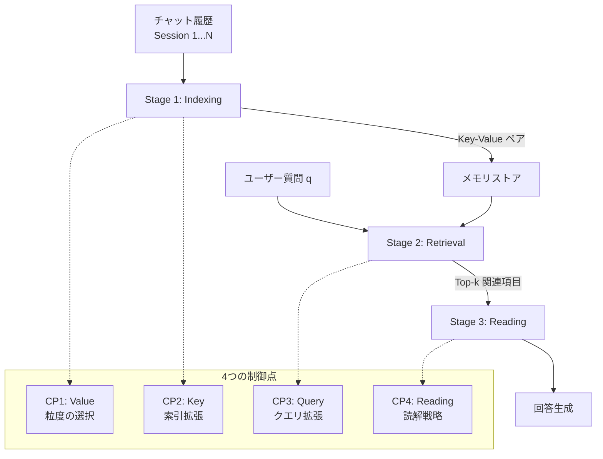

本記事は [LongMemEval: Benchmarking Chat Assistants on Long-Term Interactive Memory](https://arxiv.org/abs/2410.10813)（Wu et al., 2024）の解説記事です。ICLR 2025で採択されました。

## 論文概要（Abstract）

LLM駆動のチャットアシスタントにメモリコンポーネントを統合し、ユーザーとの対話履歴を追跡してパーソナライズされた応答を生成する取り組みが進んでいます。しかし、長期にわたるインタラクションでの持続的な記憶能力は十分に検証されていませんでした。LongMemEvalは、チャットアシスタントの長期記憶を5つの能力軸（情報抽出、マルチセッション推論、時間推論、知識更新、棄権）で体系的に評価するベンチマークです。500問の手作業で作成されたQAペアと、スケーラブルなチャット履歴を用いて評価を行います。著者らの報告によると、商用チャットアシスタントおよび長コンテキストLLMは、長期インタラクションにおいて約30%の精度低下を示しています。

この記事は [Zenn記事: Bedrock AgentCoreで社内問い合わせエージェントを構築しメモリ永続化で精度向上](https://zenn.dev/0h_n0/articles/b7cddc45f56f1a) の深掘りです。AgentCore Memoryによるメモリ永続化がエージェントの応答品質にどう影響するかを理解するうえで、LongMemEvalの評価フレームワークは「何をどう測定すべきか」の指針を提供します。

## 情報源

- **会議名**: ICLR 2025（International Conference on Learning Representations）
- **年**: 2025（arXiv初版: 2024年10月）
- **URL**: [https://arxiv.org/abs/2410.10813](https://arxiv.org/abs/2410.10813)
- **著者**: Di Wu, Hongwei Wang, Wenhao Yu, Yuwei Zhang, Kai-Wei Chang, Dong Yu
- **分野**: cs.CL（計算言語学）
- **コード**: [https://github.com/xiaowu0162/LongMemEval](https://github.com/xiaowu0162/LongMemEval)

## カンファレンス情報

ICLR（International Conference on Learning Representations）は、表現学習・深層学習分野の最高峰国際会議の一つです。2025年はシンガポールで開催されました。LongMemEvalは、LLMのメモリ能力という実用上の重要な問題に対して体系的なベンチマークを提供する研究であり、エージェントシステムの評価基盤として広く参照されています。

## 背景と動機（Background & Motivation）

LLMベースのチャットアシスタント（ChatGPT、Claude、Gemini等）は、ユーザーとの過去の対話を記憶し、パーソナライズされた応答を返す機能を備えつつあります。しかし、この「メモリ」機能の実力を体系的に評価する手段はこれまで存在しませんでした。

著者らは以下の課題を指摘しています：

1. **評価の欠如**: 既存の長コンテキストベンチマーク（Needle-in-a-Haystack等）は単純な情報検索に限定されており、マルチセッション推論や時間的推論といった高度なメモリ能力を測定できない
2. **商用システムの不透明性**: ChatGPTやGeminiのメモリ機能は内部実装が非公開であり、何ができて何ができないのかが明確でない
3. **スケーラビリティの問題**: 対話履歴が長くなるにつれて精度がどう変化するかの体系的な分析が不足している

これらの課題に対し、LongMemEvalは500問の手作業キュレーションQAペアと、自由にスケール可能なチャット履歴生成フレームワークを提供しています。データセット構築には約400時間、商用システム評価には約150時間の人手作業が投入されたと報告されています。

## 主要な貢献（Key Contributions）

- **5つの記憶能力の体系化**: チャットアシスタントに求められるメモリ能力を情報抽出・マルチセッション推論・時間推論・知識更新・棄権の5軸で定義し、7つの質問タイプに細分化
- **スケーラブルなベンチマーク構築**: LongMemEval\_S（約115kトークン、約40セッション）とLongMemEval\_M（約500セッション、約1.5Mトークン）の2つのスケールでの評価を実現
- **統一的な3段階フレームワーク**: Indexing→Retrieval→Readingの3段階でメモリシステムを分析し、各段階での最適化手法を提案
- **包括的な実験評価**: 商用システム（ChatGPT、Gemini等）、長コンテキストLLM、RAGベースシステムを統一条件で比較

## 技術的詳細（Technical Details）

### 5つの記憶能力の定義

LongMemEvalでは、チャットアシスタントの長期記憶を以下の5つの能力軸で評価します。

**1. 情報抽出（Information Extraction, IE）**

過去の対話履歴から特定の情報を正確に想起する能力です。例えば「ユーザーが以前言及した好きな本のタイトルは何か」といった直接的な事実の検索に相当します。

**2. マルチセッション推論（Multi-Session Reasoning, MR）**

複数のセッションに散在する情報を統合して回答する能力です。例えば「ユーザーが3つの異なるセッションで言及した旅行先の共通点は何か」のように、複数の情報源を組み合わせた推論が求められます。

**3. 時間推論（Temporal Reasoning, TR）**

対話履歴中のタイムスタンプや時間的な前後関係を理解する能力です。「ユーザーが転職する前に住んでいた都市はどこか」のように、イベントの時系列を把握した回答が求められます。

**4. 知識更新（Knowledge Updates, KU）**

ユーザー情報の変更を認識し、最新の状態を反映する能力です。例えば、ユーザーが「猫を飼い始めた」と言った後に「猫が亡くなった」と報告した場合、現在ペットがいないことを正しく認識する必要があります。

**5. 棄権（Abstention, ABS）**

対話履歴に含まれていない情報について、回答を正しく拒否する能力です。ユーザーが一度も言及していない情報について質問された際に「その情報は対話履歴にありません」と回答すべきケースです。これはハルシネーション防止の観点で重要な能力です。

### データセット設計

データセット構築には164のユーザー属性が5つのカテゴリ（人口統計、ライフスタイル、状況コンテキスト、ライフイベント、所持品）にわたって定義されています。各質問は複数のエビデンスセッション（最大6セッション）に紐づき、エビデンスの配置位置も多様化されています。

### 3段階フレームワーク

著者らは、メモリシステムを以下の3段階で統一的に分析するフレームワークを提案しています。



**Stage 1: Indexing（索引構築）**

チャット履歴をKey-Valueペアに変換してメモリストアに格納する段階です。各セッション $s_i$ に対して、キー $k_i$ と値 $v_i$ のペアを生成します。

$$
\text{MemoryStore} = \{(k_i, v_i) \mid s_i \in \mathcal{H}\}
$$

ここで、$\mathcal{H}$はチャット履歴全体、$s_i$は第$i$セッション、$k_i$は検索用キー、$v_i$は格納される値（対話内容）です。

Indexingにおける2つの制御点：

- **CP1（Value粒度）**: 値をセッション単位で保持するか、ターン（ラウンド）単位に分解するか、あるいは事実（ファクト）に圧縮するかの選択
- **CP2（Key拡張）**: キーとして元のテキストのみを使うか、要約・キーフレーズ・抽出事実で拡張するかの選択

**Stage 2: Retrieval（検索）**

ユーザーの質問 $q$ に基づいてメモリストアから関連する上位 $k$ 件を取得する段階です。

$$
\mathcal{R}(q) = \text{Top-}k\left(\text{sim}(f(q), k_i) \mid (k_i, v_i) \in \text{MemoryStore}\right)
$$

ここで、$f(q)$はクエリの変換関数（時間情報の付加等）、$\text{sim}$は類似度関数（BM25やコサイン類似度）です。

- **CP3（Query拡張）**: クエリに時間的コンテキスト（タイムスタンプ、時間範囲）を付加して検索精度を向上させる

**Stage 3: Reading（読解）**

検索で取得したコンテキストをLLMに入力し、回答を生成する段階です。

$$
a = \text{LLM}(q, \{v_j \mid (k_j, v_j) \in \mathcal{R}(q)\}, \text{prompt\_strategy})
$$

- **CP4（Reading戦略）**: 入力フォーマット（JSON/自然言語）、読解方式（直接回答/Chain-of-Note）の選択

## 最適化手法

著者らは3段階フレームワークの各制御点に対する最適化手法を提案しています。

### Session Decomposition（セッション分解）

セッション単位ではなく、ターン（ラウンド）単位に分解して格納することで、検索の粒度を細かくします。

```python
from dataclasses import dataclass, field


@dataclass
class ChatTurn:
    """1つの対話ターンを表すデータクラス

    Attributes:
        session_id: 所属セッションのID
        turn_index: セッション内でのターン番号
        user_message: ユーザーの発言
        assistant_message: アシスタントの応答
        timestamp: タイムスタンプ（ISO 8601形式）
    """
    session_id: str
    turn_index: int
    user_message: str
    assistant_message: str
    timestamp: str


@dataclass
class MemoryEntry:
    """メモリストアの1エントリ

    Attributes:
        key: 検索用キー（元テキスト or 拡張キー）
        value: 格納する対話内容
        metadata: タイムスタンプ等のメタデータ
    """
    key: str
    value: str
    metadata: dict[str, str] = field(default_factory=dict)


def decompose_session(
    session: list[ChatTurn],
) -> list[MemoryEntry]:
    """セッションをターン単位に分解してMemoryEntryのリストを生成する

    セッション単位での格納ではなく、各ターンを独立したエントリとして
    格納することで、検索時のノイズを低減する。
    著者らの実験では、ターン単位の分解がセッション単位よりも
    一貫して高い検索精度を達成したと報告されている。

    Args:
        session: 1セッション分の対話ターンのリスト

    Returns:
        ターン単位に分解されたMemoryEntryのリスト
    """
    entries: list[MemoryEntry] = []
    for turn in session:
        # ターンの内容をkey/valueに変換
        value_text = (
            f"User: {turn.user_message}\n"
            f"Assistant: {turn.assistant_message}"
        )
        entry = MemoryEntry(
            key=value_text,
            value=value_text,
            metadata={
                "session_id": turn.session_id,
                "turn_index": str(turn.turn_index),
                "timestamp": turn.timestamp,
            },
        )
        entries.append(entry)
    return entries
```

著者らの報告によると、ターン単位の分解はセッション単位と比較して、GPT-4oを読解モデルとして使用した場合に検索精度および下流タスクの正答率が一貫して向上しています。

### Fact-Augmented Key Expansion（事実拡張キー）

元のテキストに加えて、抽出された事実情報でキーを拡張することで、検索の再現率を向上させます。

```python
def expand_key_with_facts(
    entry: MemoryEntry,
    extracted_facts: list[str],
) -> MemoryEntry:
    """メモリエントリのキーを抽出事実で拡張する

    元のテキストをキーとして保持しつつ、LLMで抽出した
    ユーザー事実を追加することで、多様なクエリに対する
    検索のリコールを改善する。
    著者らの実験では、事実拡張キーにより recall@k が
    9.4%改善し、下流の正答率が5.4%向上したと報告されている。

    Args:
        entry: 元のメモリエントリ
        extracted_facts: LLMで抽出した事実のリスト
            例: ["ユーザーは東京在住", "趣味はランニング"]

    Returns:
        キーが拡張された新しいMemoryEntry
    """
    # Document Expansion: 元のキーに事実を追加
    fact_text = " | ".join(extracted_facts)
    expanded_key = f"{entry.key}\n[Facts]: {fact_text}"
    return MemoryEntry(
        key=expanded_key,
        value=entry.value,
        metadata=entry.metadata,
    )
```

著者らは、キー拡張の戦略として（1）要約、（2）キーフレーズ、（3）ユーザー事実の3種類を比較しています。単独ではいずれも元テキストのみのキーに劣る場合がありますが、元テキストと事実を組み合わせたDocument Expansion方式が最適な結果を達成したと報告されています。具体的には、recall@kが9.4%改善し、下流タスクの正答率が5.4%向上しています。

### Time-Aware Query Expansion（時間認識クエリ拡張）

時間的文脈をクエリに付加することで、時間推論タスクの検索精度を向上させます。

```python
from dataclasses import dataclass


@dataclass
class TimeRange:
    """時間範囲を表すデータクラス

    Attributes:
        start: 開始時点（ISO 8601形式）
        end: 終了時点（ISO 8601形式）
        description: 時間範囲の自然言語記述
    """
    start: str
    end: str
    description: str


def expand_query_with_time(
    query: str,
    time_range: TimeRange | None,
    indexed_events: list[dict[str, str]],
) -> str:
    """クエリに時間的コンテキストを追加する

    時間推論タスクでは、クエリに含まれる時間的手がかり
    （「転職する前」「去年の夏」等）を具体的な時間範囲に
    変換し、検索空間を絞り込む。
    著者らの実験では、時間認識クエリ拡張により
    時間推論タスクのrecallが6.8%-11.3%改善したと報告されている。

    Args:
        query: 元のユーザークエリ
        time_range: LLMで推定された時間範囲（Noneの場合は拡張なし）
        indexed_events: タイムスタンプ付きイベントの索引
            例: [{"timestamp": "2024-03-15", "event": "転職"}]

    Returns:
        時間コンテキストが付加された拡張クエリ
    """
    if time_range is None:
        return query

    # 時間範囲内のイベントをフィルタリング
    relevant_events = [
        e for e in indexed_events
        if time_range.start <= e["timestamp"] <= time_range.end
    ]

    # 拡張クエリの構築
    time_context = (
        f"[Time Context]: {time_range.description} "
        f"({time_range.start} to {time_range.end})"
    )
    if relevant_events:
        event_text = ", ".join(
            e["event"] for e in relevant_events[:5]
        )
        time_context += f"\n[Related Events]: {event_text}"

    return f"{query}\n{time_context}"
```

著者らの報告によると、時間非認識の設計では時間推論タスクの性能が著しく低下し、タイムスタンプ付きイベントの索引構築とクエリフィルタリングの組み合わせが検索空間の効果的な絞り込みに有効であると述べられています。具体的には、強力なLLMによる時間範囲抽出を用いた場合、時間推論のrecallが6.8%から11.3%改善しています。

## 実装のポイント（Implementation）

### ベンチマーク実装の構成

LongMemEvalの実装は[GitHub](https://github.com/xiaowu0162/LongMemEval)で公開されています。Python 3.9環境で動作し、主要コンポーネントは以下の通りです：

- **検索器**: BM25（スパース）、Contriever/Stella/GTE（密ベクトル）の4種類をサポート
- **粒度**: ターン単位（turn-level）とセッション単位（session-level）を選択可能
- **評価**: GPT-4oによるQA正答判定（`evaluate_qa.py`）

### 評価メトリクスの設計

正答率の評価にはGPT-4oを判定器として使用し、回答の意味的な正しさを判定しています。単純な文字列一致ではなく、同義語や言い換えを考慮した評価が行われています。

検索性能はrecall@kで測定されます。

$$
\text{recall@}k = \frac{|\mathcal{R}_k(q) \cap \mathcal{E}(q)|}{|\mathcal{E}(q)|}
$$

ここで、$\mathcal{R}_k(q)$はクエリ$q$に対する上位$k$件の検索結果、$\mathcal{E}(q)$はクエリ$q$のエビデンスセッション集合です。

### カスタム履歴の構築

LongMemEvalは、ShareGPTおよびUltraChatのフィラーセッションを活用して、属性制御パイプラインにより任意のスケールのチャット履歴を構築できます。LongMemEval\_Mでは約500セッション（約1.5Mトークン）まで拡張可能であり、これは実運用環境での長期利用をシミュレートするのに十分な規模です。

## Production Deployment Guide

LongMemEvalの評価フレームワークをAWS上で実装し、エージェントのメモリ品質を継続的にモニタリングするシステムを構築する方法を解説します。

### AWS実装パターン（コスト最適化重視）

LongMemEval方式のメモリ評価パイプラインをAWSで構築する場合の、トラフィック量別推奨構成は以下の通りです。コスト試算は2026年5月時点のap-northeast-1（東京）リージョン料金に基づく概算値であり、実際のコストはトラフィックパターンやバースト使用量により変動します。最新料金は[AWS料金計算ツール](https://calculator.aws/)で確認を推奨します。

| 構成 | 想定規模 | 主要サービス | 月額コスト目安 |
|------|---------|------------|-------------|
| Small | ~100評価/日 | Lambda + Bedrock + DynamoDB | $50-150 |
| Medium | ~1000評価/日 | ECS Fargate + Bedrock + Aurora Serverless | $300-800 |
| Large | 10000+評価/日 | EKS + Karpenter + Bedrock Batch | $2,000-5,000 |

**Small構成の内訳**: Lambda（128MB, 30秒/回 x 100回/日 ≈ $3）、Bedrock Claude Sonnet（入力500トークン x 100回 ≈ $15）、DynamoDB On-Demand（$5-10）、S3（評価ログ保存 $1-3）。

**コスト削減テクニック**:
- Bedrock Batch API使用で推論コスト50%削減（バッチ評価に適用）
- Prompt Caching有効化で同一コンテキストの再利用時30-90%削減
- DynamoDB On-Demandモードで低トラフィック時のコスト最適化
- Spot Instances活用（EKS構成）で計算コスト最大90%削減

### Terraformインフラコード

**Small構成（Serverless）**: Lambda + Bedrock + DynamoDB

```hcl
# LongMemEval メモリ評価パイプライン - Small構成
# Lambda + Bedrock + DynamoDB (Serverless)

terraform {
  required_version = ">= 1.9"
  required_providers {
    aws = {
      source  = "hashicorp/aws"
      version = "~> 5.80"
    }
  }
}

provider "aws" {
  region = "ap-northeast-1"
}

# --- IAM ---
resource "aws_iam_role" "eval_lambda" {
  name = "longmemeval-lambda-role"
  assume_role_policy = jsonencode({
    Version = "2012-10-17"
    Statement = [{
      Action = "sts:AssumeRole"
      Effect = "Allow"
      Principal = { Service = "lambda.amazonaws.com" }
    }]
  })
}

resource "aws_iam_role_policy" "eval_lambda" {
  name = "longmemeval-lambda-policy"
  role = aws_iam_role.eval_lambda.id
  policy = jsonencode({
    Version = "2012-10-17"
    Statement = [
      {
        Effect   = "Allow"
        Action   = ["bedrock:InvokeModel"]
        Resource = "arn:aws:bedrock:ap-northeast-1::foundation-model/anthropic.claude-sonnet-*"
      },
      {
        Effect   = "Allow"
        Action   = ["dynamodb:PutItem", "dynamodb:GetItem", "dynamodb:Query"]
        Resource = aws_dynamodb_table.eval_results.arn
      },
      {
        Effect   = "Allow"
        Action   = ["logs:CreateLogGroup", "logs:CreateLogStream", "logs:PutLogEvents"]
        Resource = "arn:aws:logs:*:*:*"
      }
    ]
  })
}

# --- DynamoDB ---
resource "aws_dynamodb_table" "eval_results" {
  name         = "longmemeval-results"
  billing_mode = "PAY_PER_REQUEST"  # コスト最適化: On-Demand
  hash_key     = "evaluation_id"
  range_key    = "question_id"

  attribute {
    name = "evaluation_id"
    type = "S"
  }
  attribute {
    name = "question_id"
    type = "S"
  }

  server_side_encryption {
    enabled = true  # KMS暗号化
  }

  point_in_time_recovery {
    enabled = true
  }
}

# --- Lambda ---
resource "aws_lambda_function" "eval_runner" {
  function_name = "longmemeval-runner"
  runtime       = "python3.12"
  handler       = "handler.lambda_handler"
  role          = aws_iam_role.eval_lambda.arn
  timeout       = 900       # 15分（Bedrock呼び出し考慮）
  memory_size   = 512

  filename         = "lambda.zip"
  source_code_hash = filebase64sha256("lambda.zip")

  environment {
    variables = {
      DYNAMODB_TABLE = aws_dynamodb_table.eval_results.name
      BEDROCK_MODEL  = "anthropic.claude-sonnet-4-20250514"
    }
  }
}

# --- CloudWatch アラーム ---
resource "aws_cloudwatch_metric_alarm" "lambda_errors" {
  alarm_name          = "longmemeval-lambda-errors"
  comparison_operator = "GreaterThanThreshold"
  evaluation_periods  = 1
  metric_name         = "Errors"
  namespace           = "AWS/Lambda"
  period              = 300
  statistic           = "Sum"
  threshold           = 5
  alarm_description   = "Lambda evaluation errors exceeded threshold"
  dimensions = {
    FunctionName = aws_lambda_function.eval_runner.function_name
  }
}
```

**Large構成（Container）**: EKS + Karpenter + Spot Instances

```hcl
# LongMemEval メモリ評価パイプライン - Large構成
# EKS + Karpenter + Spot Instances

module "eks" {
  source  = "terraform-aws-modules/eks/aws"
  version = "~> 20.31"

  cluster_name    = "longmemeval-cluster"
  cluster_version = "1.31"

  vpc_id     = module.vpc.vpc_id
  subnet_ids = module.vpc.private_subnets

  cluster_endpoint_public_access = false  # セキュリティ: プライベートのみ

  eks_managed_node_groups = {
    system = {
      instance_types = ["m7i.large"]
      min_size       = 1
      max_size       = 2
      desired_size   = 1
    }
  }
}

# Karpenter: Spot優先の自動スケーリング
resource "kubectl_manifest" "karpenter_nodepool" {
  yaml_body = yamlencode({
    apiVersion = "karpenter.sh/v1"
    kind       = "NodePool"
    metadata   = { name = "eval-workers" }
    spec = {
      template = {
        spec = {
          requirements = [
            { key = "karpenter.sh/capacity-type", operator = "In", values = ["spot", "on-demand"] },
            { key = "node.kubernetes.io/instance-type", operator = "In",
              values = ["m7i.xlarge", "m6i.xlarge", "c7i.xlarge"] }
          ]
        }
      }
      limits   = { cpu = "64", memory = "128Gi" }
      disruption = {
        consolidationPolicy = "WhenEmptyOrUnderutilized"
        consolidateAfter    = "30s"
      }
    }
  })
}

# Secrets Manager: Bedrock設定
resource "aws_secretsmanager_secret" "bedrock_config" {
  name       = "longmemeval/bedrock-config"
  kms_key_id = aws_kms_key.eval.arn
}

# AWS Budgets: 予算アラート
resource "aws_budgets_budget" "eval_monthly" {
  name         = "longmemeval-monthly"
  budget_type  = "COST"
  limit_amount = "5000"
  limit_unit   = "USD"
  time_unit    = "MONTHLY"

  notification {
    comparison_operator       = "GREATER_THAN"
    threshold                 = 80
    threshold_type            = "PERCENTAGE"
    notification_type         = "ACTUAL"
    subscriber_email_addresses = ["alert@example.com"]
  }
}
```

### セキュリティベストプラクティス

- **IAMロール**: 最小権限の原則に基づき、`bedrock:InvokeModel`は使用モデルのARNのみに制限
- **ネットワーク**: EKSクラスタのエンドポイントはプライベートアクセスのみ、VPCエンドポイント経由でBedrockに接続
- **暗号化**: DynamoDB/S3/EBSはKMS暗号化を有効化、Secrets Managerでシークレット管理
- **監査**: CloudTrailでAPI呼び出しを記録、AWS Configでリソースコンプライアンスを監視

### 運用・監視設定

**CloudWatch Logs Insights クエリ**（コスト異常検知）:

```
fields @timestamp, @message
| filter @message like /bedrock/
| stats sum(input_tokens) as total_input, sum(output_tokens) as total_output by bin(1h)
| filter total_input > 100000
| sort @timestamp desc
```

**CloudWatch アラーム設定**（Python）:

```python
import boto3


def create_bedrock_token_alarm(
    alarm_name: str = "longmemeval-bedrock-token-spike",
    threshold: float = 50000.0,
    sns_topic_arn: str = "",
) -> dict:
    """Bedrockトークン使用量のスパイク検知アラームを作成する

    Args:
        alarm_name: アラーム名
        threshold: 1時間あたりのトークン使用量閾値
        sns_topic_arn: 通知先SNSトピックのARN

    Returns:
        CloudWatch APIのレスポンス
    """
    client = boto3.client("cloudwatch", region_name="ap-northeast-1")
    return client.put_metric_alarm(
        AlarmName=alarm_name,
        MetricName="InputTokenCount",
        Namespace="AWS/Bedrock",
        Statistic="Sum",
        Period=3600,
        EvaluationPeriods=1,
        Threshold=threshold,
        ComparisonOperator="GreaterThanThreshold",
        AlarmActions=[sns_topic_arn] if sns_topic_arn else [],
        Dimensions=[
            {"Name": "ModelId", "Value": "anthropic.claude-sonnet-4-20250514"}
        ],
    )
```

**X-Ray トレーシング設定**（Python）:

```python
from aws_xray_sdk.core import xray_recorder, patch_all


def configure_xray_tracing(service_name: str = "longmemeval") -> None:
    """X-Rayトレーシングを初期化する

    boto3呼び出しを自動計装し、Bedrock推論の
    レイテンシとエラーを可視化する。

    Args:
        service_name: X-Rayのサービス名
    """
    xray_recorder.configure(service=service_name)
    patch_all()  # boto3, requests等を自動計装
```

**Cost Explorer 日次レポート**（Python）:

```python
import boto3
from datetime import date, timedelta


def get_daily_cost_report() -> dict[str, float]:
    """直近1日のサービス別コストを取得する

    Bedrock、Lambda、EKSのコストを抽出し、
    $100/日を超過した場合はSNS通知を推奨。

    Returns:
        サービス名をキー、コスト（USD）を値とする辞書
    """
    ce = boto3.client("ce", region_name="us-east-1")
    today = date.today()
    yesterday = today - timedelta(days=1)

    response = ce.get_cost_and_usage(
        TimePeriod={
            "Start": yesterday.isoformat(),
            "End": today.isoformat(),
        },
        Granularity="DAILY",
        Metrics=["UnblendedCost"],
        GroupBy=[{"Type": "DIMENSION", "Key": "SERVICE"}],
    )

    costs: dict[str, float] = {}
    for group in response["ResultsByTime"][0]["Groups"]:
        service = group["Keys"][0]
        amount = float(group["Metrics"]["UnblendedCost"]["Amount"])
        if amount > 0.01:
            costs[service] = round(amount, 2)
    return costs
```

### コスト最適化チェックリスト

**アーキテクチャ選択**:
- [ ] トラフィック量に応じた構成を選択（~100: Serverless / ~1000: Hybrid / 10000+: Container）
- [ ] 評価頻度に応じたバッチ vs リアルタイムの判断

**リソース最適化**:
- [ ] EC2/EKS: Spot Instances優先（最大90%削減）
- [ ] Reserved Instances: 1年コミットで最大72%削減
- [ ] Savings Plans: コンピューティング使用量に応じた割引検討
- [ ] Lambda: メモリサイズ最適化（AWS Lambda Power Tuning活用）
- [ ] ECS/EKS: Karpenterでアイドル時自動スケールダウン
- [ ] NAT Gateway: VPCエンドポイントに置き換えてデータ転送費削減

**LLMコスト削減**:
- [ ] Bedrock Batch API使用（非リアルタイム評価で50%削減）
- [ ] Prompt Caching有効化（同一チャット履歴の再評価で30-90%削減）
- [ ] モデル選択ロジック（簡易評価はHaiku、詳細評価はSonnet）
- [ ] トークン数制限（最大入力トークンのガードレール設定）
- [ ] 評価結果のキャッシュ（同一質問・履歴の再評価を防止）

**監視・アラート**:
- [ ] AWS Budgets: 月次予算アラート（80%/100%閾値）
- [ ] CloudWatch アラーム: Bedrockトークン使用量・Lambda実行時間
- [ ] Cost Anomaly Detection: 自動異常検知の有効化
- [ ] 日次コストレポート: Cost Explorer + SNS通知

**リソース管理**:
- [ ] 未使用リソース削除: 不要なENI、EBS、スナップショット
- [ ] タグ戦略: `project:longmemeval`, `env:prod/dev`の統一タグ
- [ ] ライフサイクルポリシー: S3評価ログの90日自動削除
- [ ] 開発環境夜間停止: EventBridgeスケジュールでECS/EKSスケールイン
- [ ] CloudFormation/Terraform drift検出: 意図しないリソース変更の防止

## 実験結果（Results）

### 商用チャットアシスタントの評価

著者らが報告する商用システムの正答率は以下の通りです：

| システム | 正答率 | オフライン読解からの低下 |
|---------|--------|---------------------|
| ChatGPT（GPT-4o） | 57.73% | -37%（vs 91.84%） |
| Coze（GPT-4o） | 32.99% | -64% |
| Coze（GPT-3.5-turbo） | 24.74% | — |

ChatGPTはGPT-4oをバックエンドとして使用した場合でも、オフラインで同じ情報を読解した場合（91.84%）と比較して37%の精度低下が見られると報告されています。これは、メモリの索引構築と検索の段階で大幅な情報損失が発生していることを示唆しています。

### 長コンテキストLLMの評価（LongMemEval\_S）

LongMemEval\_S（約115kトークン、約40セッション）における各モデルの結果：

| モデル | Oracle精度 | LongMemEval\_S | 精度低下 |
|--------|-----------|---------------|---------|
| GPT-4o | 87.0% | 60.6% | -30.3% |
| Llama 3.1 70B Instruct | 74.4% | 33.4% | -55.1% |
| Llama 3.1 8B Instruct | 71.0% | 45.4% | -36.1% |
| Phi-3 128k Instruct | 70.2% | 38.0% | -45.9% |
| Phi-3.5 Mini 4B Instruct | 66.0% | 34.2% | -48.1% |

Oracle条件（エビデンスセッションのみ提示）ではGPT-4oが87.0%を達成しますが、全履歴を入力すると60.6%まで低下しています。著者らはこの結果を「コンテキスト長が増加するにつれて関連情報を正確に特定する能力が低下する」ことの証拠として報告しています。

### 最適化手法の効果

著者らが報告する各制御点の最適化効果：

| 制御点 | 最適化手法 | 改善幅 |
|--------|----------|-------|
| CP2（Key拡張） | 事実拡張Document Expansion | recall@k +9.4%, 正答率 +5.4% |
| CP3（Query拡張） | 時間認識クエリ拡張 | 時間推論recall +6.8%-11.3% |
| CP4（Reading） | Chain-of-Note + JSON形式 | 正答率 最大+10ポイント |

特にCP4のReading戦略では、Chain-of-Note（CoN）とJSON形式の組み合わせが最大10パーセントポイントの正答率改善をもたらしたと報告されています。

### 記憶能力別の分析

著者らの報告によると、5つの記憶能力の中で特に困難なのは以下の順序です：

1. **マルチセッション推論**: 複数セッションの情報を統合する必要があり、最も精度が低い
2. **時間推論**: タイムスタンプの理解と時系列の把握が必要
3. **知識更新**: 情報の最新性を追跡する必要がある
4. **棄権**: 存在しない情報に対する回答拒否の判断
5. **情報抽出**: 最も基本的な能力で比較的高い精度を達成

## 実運用への応用

### AgentCore Memoryの評価への活用

Zenn記事で紹介されているBedrock AgentCore Memoryは、エージェントの対話履歴を永続化し、パーソナライズされた応答を実現する機能です。LongMemEvalのフレームワークを活用することで、AgentCore Memoryの品質を定量的に評価できます。

**具体的な活用方法**:

1. **5つの記憶能力軸での評価**: AgentCore Memoryが情報抽出・マルチセッション推論・時間推論・知識更新・棄権のどれに強く、どれに弱いかを特定する
2. **スケーラビリティテスト**: セッション数を段階的に増やし（40→100→500セッション）、精度低下のカーブを測定する
3. **最適化の方向性**: LongMemEvalの3段階フレームワークに基づき、AgentCore MemoryのIndexing/Retrieval/Readingのどの段階がボトルネックかを診断する

**プロダクション視点での注意点**:

- **レイテンシ**: 検索粒度をターン単位にすると検索対象が増加するため、ベクトルインデックスの最適化が重要
- **コスト**: 事実拡張キーの生成にはLLM呼び出しが必要であり、インデックス構築時のコストと検索精度のトレードオフを考慮する
- **スケーリング**: LongMemEval\_M（1.5Mトークン）規模の履歴を処理するには、DynamoDBの読み取りキャパシティとBedrock呼び出しの並列化が必要

## 関連研究（Related Work）

- **LoCoMo**（Maharana et al., 2024）: 長期対話データセットとして、マルチセッション対話の生成と評価を行う研究です。LongMemEvalは5つの記憶能力を明示的に分離して評価する点でLoCoMoと異なり、より細粒度の能力分析を可能にしています
- **MemoryBench**（Fang et al., 2024）: LLMのメモリ機能を評価するベンチマークです。LongMemEvalはスケーラブルなチャット履歴生成フレームワークを提供し、コンテキスト長の影響を体系的に分析できる点で差別化されています
- **Needle-in-a-Haystack**（Kamradt, 2023）: 長コンテキストの基本的な情報検索能力を測定するテストです。LongMemEvalはマルチセッション推論や時間推論といった高度な記憶能力を測定可能であり、より現実的なチャットアシスタントの評価に適しています
- **MemGPT**（Packer et al., 2023）: OSのページング機構にインスパイアされたメモリ管理システムです。LongMemEvalの評価対象の一つであり、著者らの実験ではMemGPTのメモリ管理も長期インタラクションにおいて課題を抱えていることが示されています

## まとめと今後の展望

LongMemEvalは、チャットアシスタントの長期記憶能力を5つの軸で体系的に評価する初の包括的ベンチマークです。著者らの実験により、現行の商用システム（ChatGPT等）でもオフライン読解と比較して約30-60%の精度低下が生じること、特にマルチセッション推論と時間推論が困難であることが明らかにされています。

提案された3段階フレームワーク（Indexing→Retrieval→Reading）と4つの制御点は、メモリシステムの設計と最適化に体系的な指針を提供します。Bedrock AgentCore Memoryのようなプロダクション環境のメモリシステムにおいても、LongMemEvalの評価フレームワークを導入することで、メモリ品質の定量的な監視と改善が可能になると考えられます。

今後の研究方向としては、マルチモーダル記憶（画像・音声を含む対話履歴）の評価、プライバシーを考慮した記憶の選択的忘却、リアルタイムの記憶更新メカニズムの評価などが挙げられます。

## 参考文献

- **arXiv**: [https://arxiv.org/abs/2410.10813](https://arxiv.org/abs/2410.10813)
- **Code**: [https://github.com/xiaowu0162/LongMemEval](https://github.com/xiaowu0162/LongMemEval)
- **Conference**: ICLR 2025, Singapore
- **Related Zenn article**: [https://zenn.dev/0h_n0/articles/b7cddc45f56f1a](https://zenn.dev/0h_n0/articles/b7cddc45f56f1a)
- **LoCoMo**: Maharana et al., "Evaluating Very Long-Term Conversational Memory of LLM Agents", ACL 2024
- **MemGPT**: Packer et al., "MemGPT: Towards LLMs as Operating Systems", 2023
- **Needle-in-a-Haystack**: Kamradt, "Needle In A Haystack - Pressure Testing LLMs", 2023
