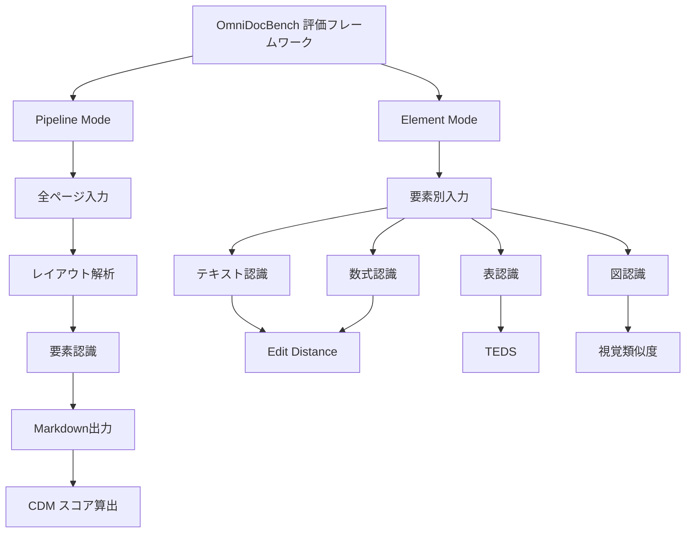

## 論文概要（Abstract）

OmniDocBenchは、PDF文書解析の統一ベンチマークである。学術論文・教科書・財務レポート・試験問題など9種類のカテゴリにわたる800文書を収録し、テキスト・数式・表・図を含む434万要素を人手でアノテーションしている。従来の断片的な評価（OCRのみ、表認識のみなど）を一元化し、エンドツーエンドのパイプライン比較を可能にした点が著者らの主要な貢献である。

この記事は [Zenn記事: Claude Opus 4.7のVisionで帳票OCRパイプラインを構築する実践ガイド](https://zenn.dev/0h_n0/articles/cf6a2a6d3a7abc) の深掘りです。

## 情報源

- **arXiv ID**: 2412.07626
- **URL**: [https://arxiv.org/abs/2412.07626](https://arxiv.org/abs/2412.07626)
- **著者**: Linke Ouyang, Yuan Qu, Hongbin Zhou et al.（OpenDataLab / Shanghai AI Laboratory）
- **発表年**: 2024年12月
- **分野**: cs.CV（Computer Vision）

## 背景と動機（Background & Motivation）

PDF文書解析は、企業のデジタルトランスフォーメーションにおいて中核的な技術である。請求書処理、学術論文のデータ抽出、財務レポートの自動解析など、多様な実務シーンで利用されている。しかし、2024年時点で文書解析の評価は断片化していた。OCR精度はICDAR系のベンチマークで測定し、表認識はTableBank等で測定し、数式認識はIM2LaTeX等で測定するという具合に、要素ごとに別々のベンチマークが存在していた。

この断片化がもたらす問題は大きい。実運用では、1つのPDFページ上にテキスト・数式・表・図が混在しており、それぞれを正確に認識するだけでなく、レイアウト解析によって各要素の配置順序を正しく復元する必要がある。要素単位の個別評価では、このエンドツーエンドのパイプライン性能を正しく測定できない。

著者らはこの課題に対し、9カテゴリ・2言語・4要素タイプを包括的にカバーするOmniDocBenchを構築した。これにより、MinerUやMarker等のパイプラインツールと、GPT-4oやQwen2-VL等のVLM（Vision-Language Model）を同一基準で比較することが可能になった。

## 主要な貢献（Key Contributions）

- **貢献1: 大規模・多様なアノテーション**: 800文書・434万要素の人手アノテーションにより、テキスト・数式・表・図の4要素タイプを網羅。9種の文書カテゴリと英中2言語をカバーする
- **貢献2: 2軸の評価フレームワーク**: Pipeline mode（全ページ処理）とElement mode（要素別評価）の2つの評価軸を設計し、エンドツーエンド性能と要素別性能の両方を測定可能にした
- **貢献3: 新たな評価指標CDMの提案**: Composite Document Metric（CDM）を提案し、テキスト・数式・表・図の認識精度を単一スコアに統合する手法を示した
- **貢献4: 包括的なベースライン評価**: パイプラインツール（MinerU, Marker, Mathpix）とVLM（GPT-4o, InternVL2, Qwen2-VL）を含む複数のシステムを統一的に比較した

## 技術的詳細（Technical Details）

### ベンチマーク設計の全体像

OmniDocBenchの設計思想は「文書解析のあらゆる側面を公平に評価する」ことにある。著者らは以下の設計原則を採用している。

#### 文書カテゴリの選定

9種類の文書カテゴリは、実務で頻繁に遭遇するPDF文書の多様性を反映するように選定されている。

| カテゴリ | 英語 | 特徴的な要素 |
|---------|------|------------|
| 学術論文 | Academic Paper | 数式、図表、参考文献 |
| 教科書 | Textbook | 数式、図、章構造 |
| 雑誌 | Magazine | 複雑なレイアウト、画像 |
| 研究レポート | Research Report | 表、グラフ、統計データ |
| 財務レポート | Financial Report | 複雑な表、数値データ |
| 試験問題 | Exam Paper | 数式、番号付きリスト |
| 政府文書 | Government Doc | テキスト主体、印鑑・署名 |
| 新聞 | Newspaper | 多段組み、画像 |
| ノート | Notebook | 手書き混在、不規則レイアウト |

Zenn記事で取り上げている帳票（invoice）は、このうち財務レポート（Financial Report）カテゴリに構造的に近い。表形式のフィールド抽出、数値データの正確な読み取り、複雑なセル結合の認識といった共通の技術課題を持つ。

#### アノテーション体系

各文書ページの要素は、以下の4タイプに分類されている。

- **テキスト（Text）**: 段落、見出し、ヘッダ/フッタ、キャプション等
- **数式（Formula）**: インライン数式、ディスプレイ数式
- **表（Table）**: 単純な表、結合セルを含む複雑な表
- **図（Figure）**: 写真、グラフ、チャート、図表

アノテーション作業は、人手による包括的なラベリングで行われている。著者らによれば、全800文書に対して434万要素のアノテーションが付与されており、1文書あたり平均約5,425要素という高密度なアノテーションとなっている。

### 評価フレームワーク：Pipeline mode と Element mode



OmniDocBenchの評価フレームワークは2つのモードから成る。

**Pipeline mode** は、PDFページ全体を入力として受け取り、最終的なMarkdown出力までのエンドツーエンド性能を測定する。実運用のシナリオに近く、レイアウト解析の精度が全体スコアに直接影響する。このモードでは、提案されたCDM（Composite Document Metric）を用いて総合スコアを算出する。

**Element mode** は、各要素（テキスト、数式、表、図）をクロップした画像を個別に入力し、要素認識の精度のみを測定する。レイアウト解析の影響を排除できるため、純粋な要素認識能力の比較に適している。

### 評価指標の数式定義

#### Edit Distance（テキスト・数式評価）

テキストおよび数式の認識精度は、正規化Edit Distance（Normalized Edit Distance）で測定される。

$$
\text{NED}(s_{\text{pred}}, s_{\text{gt}}) = 1 - \frac{\text{ED}(s_{\text{pred}}, s_{\text{gt}})}{\max(|s_{\text{pred}}|, |s_{\text{gt}}|)}
$$

ここで、
- $s_{\text{pred}}$: モデルの予測文字列
- $s_{\text{gt}}$: 正解（Ground Truth）文字列
- $\text{ED}(\cdot, \cdot)$: レーベンシュタイン距離（Levenshtein Distance）
- $\|\cdot\|$: 文字列長

NEDは0から1の範囲を取り、1に近いほど認識精度が高いことを示す。完全一致の場合はNED = 1となる。

#### TEDS（Table Edit Distance based Similarity）

表の認識精度は、TEDSで測定される。TEDSは表のHTML構造を木（Tree）として捉え、木編集距離（Tree Edit Distance）を正規化した指標である。

$$
\text{TEDS}(T_{\text{pred}}, T_{\text{gt}}) = 1 - \frac{\text{TED}(T_{\text{pred}}, T_{\text{gt}})}{\max(|T_{\text{pred}}|, |T_{\text{gt}}|)}
$$

ここで、
- $T_{\text{pred}}$: 予測された表のHTML木構造
- $T_{\text{gt}}$: 正解の表のHTML木構造
- $\text{TED}(\cdot, \cdot)$: 木編集距離
- $|T|$: 木のノード数

TEDSは表の構造（行・列・セル結合）とセル内容の両方を評価できる点が特徴である。単純なセル内容の一致率では測定できない、結合セルや複雑なヘッダ構造の認識精度を適切に反映する。

帳票OCRの文脈では、TEDSは請求書の明細テーブルや集計テーブルの構造認識を評価する指標として直接適用可能である。Zenn記事で紹介しているPydanticによる構造化抽出の出力を、TEDS形式で正解データと比較することで、パイプラインの表認識精度を定量的に評価できる。

#### CDM（Composite Document Metric）

CDMは、OmniDocBenchで新たに提案された複合評価指標であり、1つのPDFページ上の全要素タイプの認識精度を統合する。

$$
\text{CDM} = \sum_{t \in \mathcal{T}} w_t \cdot \text{Score}_t
$$

ここで、
- $\mathcal{T}$: 要素タイプの集合（テキスト、数式、表、図）
- $w_t$: 要素タイプ $t$ の重み（ページ内の出現頻度に基づく）
- $\text{Score}_t$: 要素タイプ $t$ の評価スコア（テキスト・数式はNED、表はTEDS）

CDMの設計意図は、文書の構成に応じた重み付けにある。学術論文では数式の比重が高くなり、財務レポートでは表の比重が高くなるため、各ページの要素構成を反映した公平な評価が可能となる。

### Pipeline mode の評価アルゴリズム

Pipeline modeでは、モデルの出力（Markdown等）と正解（Ground Truth）のアライメント（対応付け）が技術的な課題となる。著者らは以下の手順で評価を実施している。

```python
def evaluate_pipeline(
    predicted_markdown: str,
    ground_truth_elements: list[dict],
) -> float:
    """Pipeline modeの評価手順（擬似コード）

    Args:
        predicted_markdown: モデル出力のMarkdown文字列
        ground_truth_elements: 正解要素リスト
            各要素は type, content, bbox を持つ

    Returns:
        CDMスコア（0-1）
    """
    # Step 1: Markdownから要素を抽出
    pred_elements = parse_markdown(predicted_markdown)

    # Step 2: 正解要素との対応付け（位置情報ベース）
    matched_pairs = match_elements(pred_elements, ground_truth_elements)

    # Step 3: 要素タイプ別にスコア算出
    scores_by_type: dict[str, list[float]] = {}
    for pred_elem, gt_elem in matched_pairs:
        elem_type = gt_elem["type"]
        if elem_type in ("text", "formula"):
            score = normalized_edit_distance(
                pred_elem["content"], gt_elem["content"]
            )
        elif elem_type == "table":
            score = teds(pred_elem["html"], gt_elem["html"])
        else:
            score = visual_similarity(pred_elem, gt_elem)
        scores_by_type.setdefault(elem_type, []).append(score)

    # Step 4: 要素タイプ別重み付きスコア（CDM）
    total_elements = sum(len(v) for v in scores_by_type.values())
    cdm = sum(
        (len(scores) / total_elements) * (sum(scores) / len(scores))
        for scores in scores_by_type.values()
    )
    return cdm
```

このアルゴリズムにおけるStep 2のアライメントが重要である。正解要素には位置情報（Bounding Box）が付与されているため、予測要素との空間的な対応付けが可能となる。未検出の要素（False Negative）はスコア0として計上され、誤検出（False Positive）もペナルティとして反映される。

## 実装のポイント（Implementation）

### ベンチマーク利用時の実装上の注意点

OmniDocBenchのコードはGitHubで公開されている。評価スクリプトを利用する際の実装上のポイントを以下に整理する。

**アライメント精度の影響**: Pipeline modeでは、予測要素と正解要素の対応付け（アライメント）が評価スコアに大きく影響する。位置情報が利用できない場合（VLMのテキスト出力など）、シーケンシャルなアライメントにフォールバックするが、ページ内の要素順序が正解と異なると精度が低下する。

**テキスト正規化**: Edit Distanceの計算前に、空白の正規化（全角/半角統一、改行除去）や句読点の統一が必要となる。中国語と英語で正規化ルールが異なる点に注意が必要である。

**TEDS計算のコスト**: 木編集距離の計算は、表のサイズ（行数 $\times$ 列数）に対して計算量が大きい。大規模な表（数百セル）に対しては、タイムアウトの設定が推奨される。著者らのコードでは、1つの表あたりの計算時間に上限を設けている。

**VLM入力のフォーマット**: VLMをPipeline modeで評価する場合、プロンプトの設計が結果に影響する。著者らは、Markdown形式での出力を指示するプロンプトを統一して使用している。

### 自社帳票向けの評価セット構築

OmniDocBenchの評価フレームワークを自社の帳票OCRパイプラインに適用する場合、以下の手順が参考になる。

```python
from dataclasses import dataclass


@dataclass(frozen=True)
class AnnotatedElement:
    """帳票要素のアノテーション

    OmniDocBenchのアノテーション体系に準拠した
    帳票向け評価データの構造。
    """

    element_type: str  # "text", "table", "field"
    content: str  # 正解テキスト or HTML
    bbox: tuple[float, float, float, float]  # (x1, y1, x2, y2)
    field_name: str | None = None  # 帳票固有: "invoice_number" 等


def build_invoice_evaluation_set(
    invoice_images: list[str],
    annotations: list[list[AnnotatedElement]],
) -> dict:
    """帳票評価セットを構築する

    OmniDocBenchの評価フレームワークを帳票向けに
    カスタマイズした評価セットを生成する。

    Args:
        invoice_images: 帳票画像パスのリスト
        annotations: 各画像のアノテーションリスト

    Returns:
        評価セットの辞書
    """
    evaluation_set = {
        "category": "invoice",
        "language": "ja",
        "documents": [],
    }

    for img_path, annots in zip(invoice_images, annotations):
        doc = {
            "image_path": img_path,
            "elements": [
                {
                    "type": a.element_type,
                    "content": a.content,
                    "bbox": a.bbox,
                    "field_name": a.field_name,
                }
                for a in annots
            ],
        }
        evaluation_set["documents"].append(doc)

    return evaluation_set
```

## 実験結果（Results）

### Pipeline mode の結果

著者らがPipeline modeで評価した結果の傾向を以下にまとめる。なお、これらは論文（arXiv:2412.07626）で報告された値に基づく。

#### パイプラインツールの比較

著者らの評価によれば、パイプラインツール間の比較では以下の傾向が報告されている。

- **MinerU**: オープンソースツールとして高い総合性能を示す。特にテキスト認識とレイアウト解析のバランスが良い
- **Marker**: テキスト主体の文書では安定した性能を示すが、複雑な表構造での精度が課題
- **Mathpix**: 数式認識に強みを持つ商用ツール。学術論文カテゴリで高スコアを記録

#### VLMの比較

VLMのPipeline mode評価では、以下の特徴が報告されている。

- **GPT-4o**: 総合的に高い性能を示し、特にテキスト認識と数式認識で強い
- **InternVL2**: 中国語文書でGPT-4oに匹敵する性能を示す
- **Qwen2-VL**: 表認識で比較的良好な性能を示すが、複雑なレイアウトの文書では精度が低下する傾向

VLMはPipeline modeにおいて、専用のパイプラインツールと比較してテキスト認識では競争力のある性能を示したが、複雑な表構造の認識では専用ツールに劣る傾向があると著者らは報告している。

### Element mode の結果

Element modeでは、各要素タイプの認識能力が個別に評価される。レイアウト解析の影響を排除した純粋な要素認識性能として、以下の傾向が報告されている。

- **テキスト認識**: VLMとOCRパイプラインの差は比較的小さい。両者ともNED 0.9以上を達成するカテゴリが多い
- **数式認識**: Mathpix等の専用モデルがVLMを上回る傾向。LaTeX出力の正確性に差がつく
- **表認識**: 構造が複雑になるほど精度差が拡大し、結合セルの多い財務レポートで顕著にTEDSスコアが低下する

### カテゴリ別の分析

9つの文書カテゴリ間で性能のばらつきが大きいことが、著者らの分析で明らかになっている。

**高精度カテゴリ**: 政府文書やテキスト主体の研究レポートは、テキスト認識精度が高い。レイアウトが単純で、フォントが統一されていることが要因と考えられる。

**低精度カテゴリ**: 学術論文（数式混在）、新聞（多段組みレイアウト）、ノート（手書き混在）は認識精度が低い傾向にある。特にノートカテゴリでは、手書きと印刷テキストの混在がレイアウト解析を困難にしている。

**財務レポートと帳票の関連**: 財務レポートカテゴリは、Zenn記事で扱っている帳票（invoice）OCRと密接に関連する。著者らの分析によれば、財務レポートの主な課題は以下の通りである。

- 複雑なセル結合を含む表の認識（行跨ぎ・列跨ぎのセル）
- 数値データの正確な読み取り（桁区切り、通貨記号の処理）
- ヘッダとデータセルの構造的区別

これらはまさに帳票OCRで遭遇する課題であり、OmniDocBenchの財務レポートカテゴリでの評価結果は、帳票OCRシステムの性能予測に参考となる。

## OmniDocBench V1.5 と最新のOCRモデル動向

### V1.5の位置づけ

OmniDocBench V1.5は、原論文（V1.0）の後に公開された更新版であり、評価対象モデルの拡大や指標の改善が含まれている。Zenn記事で言及されているoFox社のOCRモデル比較は、このV1.5を基準として実施されている。

### 最新スコアとZenn記事との関連

oFox社の調査結果として、Zenn記事には以下のモデル比較が記載されている。

| モデル | パラメータ規模 | OmniDocBench V1.5 スコア |
|-------|-------------|------------------------|
| GLM-OCR | 0.9B | 94.62 |
| PaddleOCR-VL | 非公開 | 94.50 |
| Gemini 3.1 Pro | 大規模汎用 | ~90.3 |
| GPT-5.4 | 大規模汎用 | ~85.8 |

これらの数値はoFox社の調査結果として報告されているものである。注目すべき点は以下の通りである。

**小規模専用モデルの優位性**: GLM-OCR（0.9Bパラメータ）がスコア94.62でトップに立っている。パラメータ数が10億未満のモデルが、Gemini 3.1 ProやGPT-5.4といった大規模汎用モデルを上回っている点は、文書解析タスクにおけるドメイン特化の有効性を示唆している。0.9Bという小さなモデルサイズは、オンプレミスやエッジデバイスでの推論にも現実的であり、コスト効率の面でも大規模VLMに対する優位性がある。

**VLM vs 専用OCRモデルのギャップ**: GPT-5.4のスコア（~85.8）は、OCR専用モデルであるGLM-OCRやPaddleOCR-VLに約9ポイント差をつけられている。OmniDocBenchの原論文でもVLMが専用ツールに劣る傾向は報告されていたが、V1.5の結果はこの傾向がより鮮明になっている。ただし、VLMは単一のAPIで文書解析に限らない多様なタスクに対応できるという運用上のメリットがあり、Zenn記事ではClaude Opus 4.7のVisionを活用した帳票OCRパイプラインの構築を紹介している。

**OmniDocBenchが果たす標準化の役割**: これらのモデル比較が可能になったのは、OmniDocBenchという統一的なベンチマークが存在するからである。各モデルの開発者が独自のテストセットで評価した結果では公平な比較ができないが、OmniDocBenchの標準化されたデータセットと評価指標により、異なるアーキテクチャ・異なるパラメータ規模のモデル間で直接的な性能比較が可能となった。

### Zenn記事の実践との接続

Zenn記事では、Claude Opus 4.7のVision機能を使って帳票OCRパイプラインを構築する手法が紹介されている。OmniDocBenchの評価結果は、このようなVLMベースのOCRパイプラインを設計する際に以下の知見を提供する。

1. **精度の期待値設定**: VLMのOmniDocBenchスコアは、帳票OCRの精度上限を推定する参考指標となる。GPT-5.4で~85.8という数値は、VLM単体では完全な精度を期待できないことを意味し、後段の検証ロジックの必要性を裏付ける
2. **弱点の把握**: 複雑な表構造（結合セル）やレイアウトが入り組んだ文書では、VLM単体の精度が低下する傾向がある。Pipeline modeの評価でこの傾向が定量的に示されている
3. **ハイブリッドアプローチの合理性**: Zenn記事で紹介されているPydanticによる構造化抽出は、VLMの出力を型安全に検証するアプローチであり、OmniDocBenchで明らかになったVLMの弱点を補完する設計として合理的である。VLMの柔軟な認識能力とPydanticの厳密な型検証を組み合わせることで、スコア上の不足を運用で補う戦略となっている

## 実運用への応用（Practical Applications）

### ベンチマークとしての活用シーン

OmniDocBenchは以下のシーンで実務的に活用できる。

**OCRシステムの選定**: 自社の処理対象文書に近いカテゴリのスコアを比較し、最適なOCRエンジンを選定する。例えば、財務レポートを多く処理する場合は、財務レポートカテゴリのTEDSスコアを重視する。

**VLM vs パイプラインの判断**: OmniDocBenchの結果は、VLM（Claude, GPT等）とOCR専用パイプライン（MinerU等）のどちらを採用すべきかの判断材料となる。精度重視なら専用モデル、開発速度と柔軟性重視ならVLMという棲み分けが、ベンチマークの数値に基づいて議論できる。

**自社データセットの設計**: OmniDocBenchのアノテーション体系（4要素タイプ、位置情報、正規化ルール）は、自社の帳票評価データセットを設計する際の参考となる。特にTEDSによる表構造の評価は、帳票のフィールド抽出精度の評価にそのまま応用できる。

**モデル更新の評価**: OmniDocBench V1.5のスコア推移に見られるように、新しいモデル（GLM-OCR等）が登場するたびに統一基準で性能を比較できる。自社のOCRパイプラインのモデルを更新する際、OmniDocBenchスコアの変化を確認することで、アップグレードの妥当性を客観的に評価できる。

### 制約事項

OmniDocBenchを帳票OCRの評価に適用する際の制約を認識しておく必要がある。

- **言語の制約**: 現時点で英語と中国語のみ対応。日本語帳票の評価には直接利用できない。日本語特有の縦書き、ルビ、全角/半角混在といった要素はベンチマークに含まれていない
- **帳票固有フィールドの未対応**: 請求書番号、日付、合計金額といった帳票固有のフィールド抽出精度は、OmniDocBenchの評価対象外である。帳票OCRの業務的な正確性を評価するには、別途フィールドレベルのベンチマークが必要となる
- **レイアウトの多様性**: 帳票のレイアウトは企業ごとに大きく異なるが、OmniDocBenchの財務レポートカテゴリは比較的定型的なレイアウトが多い
- **評価時点の制約**: 原論文は2024年12月時点のモデル評価であり、その後急速に進化したVLMの最新性能は反映されていない。V1.5では一部更新されているが、最新モデルとの比較には注意が必要

## 関連研究（Related Work）

- **olmOCR (arXiv:2502.18443)**: 2025年に発表されたOCRモデルで、OmniDocBenchを引用して性能評価を実施している。大規模言語モデルをベースとしたOCRアプローチで、Qwen2-VLをファインチューニングしている。OmniDocBenchが後続研究の評価基盤として機能していることを示す事例である
- **DocLayNet (arXiv:2206.01062)**: IBM Researchが構築した文書レイアウト解析ベンチマーク。80,863ページのアノテーションを含み、レイアウト要素の分類（タイトル・本文・リスト等）に焦点を当てている。OmniDocBenchはレイアウト分類よりも要素内容の認識精度に重点を置いている点で異なる
- **PubLayNet (arXiv:1908.07836)**: PubMed Central由来の学術論文に特化したレイアウト解析データセット。OmniDocBenchはPubLayNetの対象を9カテゴリに拡張し、要素認識の評価指標を追加したものと位置づけられる
- **TableBank (arXiv:1903.01949)**: 表検出・認識に特化したベンチマーク。OmniDocBenchのTEDS評価はTableBankの評価手法を継承しつつ、他の要素タイプとの統合評価（CDM）を実現している

## まとめと今後の展望

OmniDocBenchは、PDF文書解析の評価を統一する試みとして、9カテゴリ・800文書・434万要素という大規模なベンチマークを提供した。Pipeline modeとElement modeの2軸評価、CDMによる複合スコアの導入は、従来の断片的な評価手法を一歩前進させるものである。

実務的には、OmniDocBench V1.5のスコアがoFox社の調査などで活用されており、GLM-OCR（94.62）やPaddleOCR-VL（94.50）といった小規模専用モデルがGPT-5.4（~85.8）を上回る結果が示されている。一方で、Zenn記事で紹介されているClaude Opus 4.7のようなVLMベースのアプローチは、柔軟性と開発速度の面で強みがある。Pydanticによる構造化検証と組み合わせることで、VLMの認識精度の限界を運用レベルで補完する設計は、OmniDocBenchの知見と整合的な戦略である。

今後の課題としては、日本語を含む多言語対応、帳票（invoice）に特化したフィールド抽出の評価指標の追加、そしてVLMの急速な進化に対応した継続的なベンチマーク更新が求められる。OmniDocBenchが文書解析コミュニティの標準ベンチマークとして定着し、後続のV2.0以降でこれらの課題が解決されることが期待される。

## 参考文献

- **arXiv**: [https://arxiv.org/abs/2412.07626](https://arxiv.org/abs/2412.07626)
- **Code**: [https://github.com/opendatalab/OmniDocBench](https://github.com/opendatalab/OmniDocBench)
- **olmOCR**: [https://arxiv.org/abs/2502.18443](https://arxiv.org/abs/2502.18443)
- **DocLayNet**: [https://arxiv.org/abs/2206.01062](https://arxiv.org/abs/2206.01062)
- **Related Zenn article**: [https://zenn.dev/0h_n0/articles/cf6a2a6d3a7abc](https://zenn.dev/0h_n0/articles/cf6a2a6d3a7abc)
