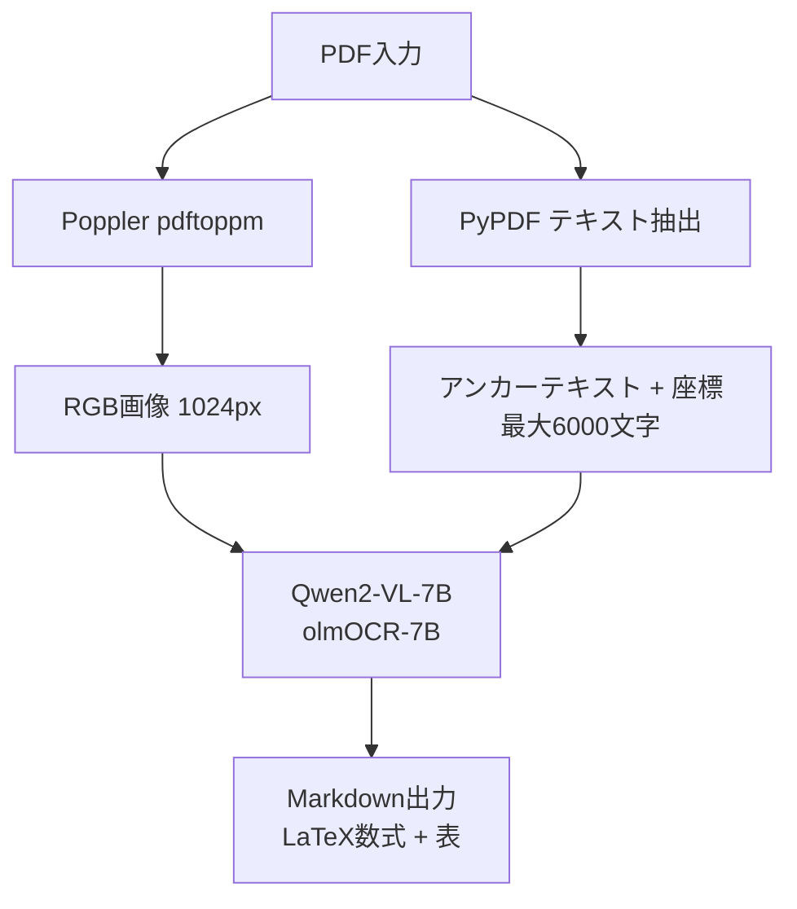
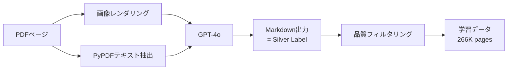
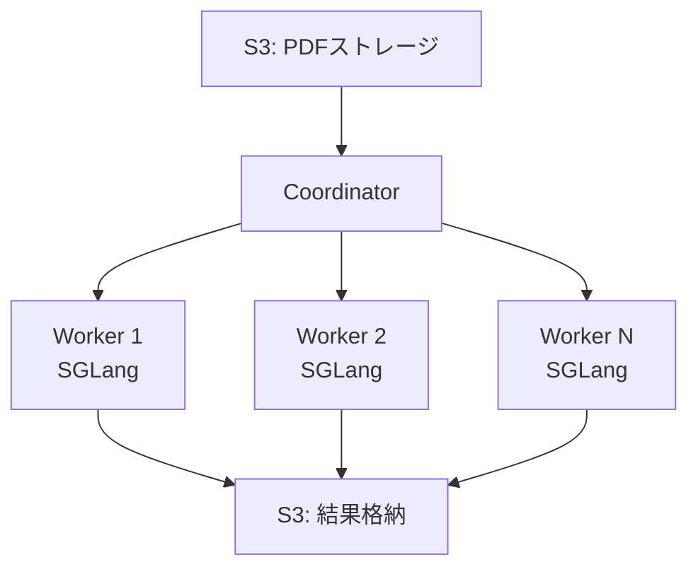

## 論文概要（Abstract）

olmOCRは、Allen Institute for AI（AI2）が開発したオープンソースのPDF→テキスト変換ツールキットです。7BパラメータのVision Language Model（VLM）を約26万ページでfine-tuneし、**Document-anchoring**と呼ばれる技術によってPDFのバイナリ抽出テキスト座標情報をVLMプロンプトに注入することで、100万ページあたり$190（GPT-4oの約1/33のコスト）でSOTA精度を達成したと著者らは報告しています。全コード・モデル・ベンチマークがApache 2.0ライセンスで公開されています。

この記事は [Zenn記事: Claude Opus 4.7のVisionで帳票OCRパイプラインを構築する実践ガイド](https://zenn.dev/0h_n0/articles/cf6a2a6d3a7abc) の深掘りです。

## 情報源

- **arXiv ID**: 2502.18443
- **URL**: [https://arxiv.org/abs/2502.18443](https://arxiv.org/abs/2502.18443)
- **著者**: Jake Poznanski, Jon Borchardt, Jason Dunkelberger, Regan Huff, Daniel Lin, Aman Rangapur, Christopher Wilhelm, Kyle Lo, Luca Soldaini（Allen Institute for AI）
- **発表年**: 2025年2月
- **分野**: cs.CL（Computation and Language）
- **コード**: [https://github.com/allenai/olmocr](https://github.com/allenai/olmocr)（Apache 2.0）

## 背景と動機（Background & Motivation）

### PDFからの大規模テキスト抽出が抱える課題

インターネット上には数兆ページ規模のPDFが存在しますが、LLMの学習データとしてPDFを活用するには、高品質なテキスト抽出が不可欠です。従来のOCRパイプラインには以下の問題がありました。

1. **ルールベースOCR**（Tesseract等）：複雑なレイアウト（多段組み、表、数式）の処理精度が低い
2. **商用API**（GPT-4o、Mistral OCR等）：精度は高いがコストが膨大で、数百万ページ規模の処理は現実的でない
3. **既存オープンソース**（Marker、MinerU等）：ヒューリスティクスへの依存が大きく、特定のPDFタイプで精度が低下する

Zenn記事ではClaude Opus 4.7のVision機能を用いた帳票OCRパイプラインが紹介されていますが、本論文のolmOCRは**大規模コーパス構築**を主目的としており、1ページあたりのコスト効率が極めて重要な文脈に位置づけられます。

### なぜVLMベースのアプローチか

著者らは、VLMがレイアウト理解・数式認識・表構造解析を統一的に処理できる点に注目しています。ただし、VLMだけでは座標情報や文字レベルの精度が不足するため、PDFのバイナリから抽出したテキスト座標情報を**アンカー**として併用するDocument-anchoring技術を提案しています。

## 主要な貢献（Key Contributions）

- **Document-anchoring技術**: PDFバイナリから抽出したテキスト座標情報をVLMプロンプトに注入し、OCR精度を向上させる手法
- **olmOCR-7B**: Qwen2-VL-7B-Instructをベースに266,135ページでfull fine-tuneしたモデル
- **olmOCR-Bench**: 1,402件のPDF、7,010テストケース、8カテゴリからなる包括的OCRベンチマーク
- **スケーラブル推論基盤**: SGLang + S3連携ワーカーによる分散推論アーキテクチャ
- **下流タスク改善**: olmOCRで抽出したテキストを学習データに使用することで、6つのベンチマークで平均+1.3ppの改善
- **完全オープンリリース**: モデル・コード・ベンチマーク・学習データすべてをApache 2.0で公開

## 技術的詳細（Technical Details）

### Document-anchoring技術

olmOCRの中核をなすのがDocument-anchoring技術です。これは、PDFのバイナリレイヤーから抽出したテキストとその座標情報をVLMの入力プロンプトに付加することで、純粋なVision入力だけでは得られない文字レベルの精度を実現する手法です。

#### 処理パイプライン



具体的には以下の2系統の入力をVLMに与えます。

1. **画像入力**: Poppler（`pdftoppm`）でPDFをRGB画像にレンダリング。推論時は最長辺1024pxにリサイズ
2. **アンカーテキスト**: PyPDFでPDFバイナリからテキストとその座標（ページ上の位置情報）を抽出。最大6,000文字まで

これら2つの情報を組み合わせたプロンプトをVLMに入力し、Markdownフォーマット（LaTeX数式・Markdownテーブル含む）のテキストを出力します。

#### アンカーテキストの数学的定式化

PDFページ $p$ に含まれるテキストチャンク集合を $\mathcal{T}_p = \{(t_i, x_i, y_i, w_i, h_i)\}_{i=1}^{N}$ とします。

ここで、
- $t_i$: テキスト文字列
- $(x_i, y_i)$: ページ上の左上座標（ポイント単位）
- $(w_i, h_i)$: テキストチャンクの幅と高さ
- $N$: ページ内のチャンク数

アンカーテキストは、座標順にソートされたチャンクを連結して構成されます：

$$
\text{anchor}(p) = \text{concat}\left(\text{sort}_{(x_i, y_i)}(\mathcal{T}_p)\right) \quad \text{s.t.} \quad |\text{anchor}(p)| \leq 6000
$$

#### プロンプト構造

VLMへの入力プロンプトは以下の形式を取ります：

```python
def build_prompt(image_path: str, anchor_text: str) -> dict:
    """olmOCR推論用プロンプトを構築する

    Args:
        image_path: PDFからレンダリングした画像パス
        anchor_text: PyPDFから抽出した座標付きテキスト

    Returns:
        VLM入力用のメッセージ辞書
    """
    return {
        "role": "user",
        "content": [
            {"type": "image", "image": image_path},
            {
                "type": "text",
                "text": (
                    "Below is the text extracted from the PDF with coordinates.\n"
                    f"Anchor text:\n{anchor_text}\n\n"
                    "Convert this page to clean Markdown. "
                    "Use LaTeX for equations and Markdown tables for tabular data."
                ),
            },
        ],
    }
```

### モデル学習

#### ベースモデルとfine-tune設定

olmOCR-7Bは**Qwen2-VL-7B-Instruct**をベースに、以下の設定でfull fine-tune（LoRAではない）されています。

| パラメータ | 値 |
|---|---|
| ベースモデル | Qwen2-VL-7B-Instruct |
| 学習データ | 266,135ページ |
| バッチサイズ | 4 |
| 学習率 | 1e-6（cosineスケジューラ） |
| 学習ステップ | 10,000（約1.2エポック） |
| ハードウェア | 8x H100 GPU |
| 学習時間 | 16ノード時間 |
| 教師データ | GPT-4oによるsilver labels |

#### 学習データ生成（Silver Labels）

著者らは教師データの生成にGPT-4oを使用しています。各PDFページに対して以下のプロセスでsilver labelsを生成します。



この手法の利点は、人手アノテーションのコストを回避しつつ、大量の学習データを確保できる点です。ただし、GPT-4oの出力に含まれる誤りが学習データに混入するリスクがあるため、品質フィルタリングが重要であると著者らは述べています。

#### 損失関数

標準的な次トークン予測の交差エントロピー損失を使用しています：

$$
\mathcal{L}(\theta) = -\frac{1}{|y|} \sum_{j=1}^{|y|} \log p_\theta(y_j \mid x_{\text{img}}, x_{\text{anchor}}, y_{<j})
$$

ここで、
- $\theta$: モデルパラメータ
- $x_{\text{img}}$: 入力画像
- $x_{\text{anchor}}$: アンカーテキスト
- $y_j$: 出力Markdownの$j$番目のトークン
- $y_{<j}$: $j$番目より前の出力トークン列

### スケーラブル推論アーキテクチャ

著者らは大規模処理（100万ページ超）を実現するため、以下の分散推論基盤を構築しています。



- **SGLang**: VLM推論のためのフレームワーク。バッチ処理とKVキャッシュ管理を効率化
- **S3連携**: PDFの入出力をS3経由で行い、ワーカー間の状態共有を実現
- **水平スケーリング**: ワーカー数を動的に調整可能

## 実装のポイント（Implementation）

### olmOCRを使った推論の実装例

```python
from olmocr import pipeline
from olmocr.data import PDFDataset

def process_pdfs(pdf_dir: str, output_dir: str, batch_size: int = 8) -> None:
    """olmOCRでPDFをバッチ処理する

    Args:
        pdf_dir: PDFファイルが格納されたディレクトリ
        output_dir: Markdown出力先ディレクトリ
        batch_size: バッチサイズ（GPU VRAMに応じて調整）
    """
    # パイプライン初期化
    ocr = pipeline(
        model="allenai/olmOCR-7B-0225-preview",
        device="cuda",
        max_new_tokens=4096,
    )

    dataset = PDFDataset(pdf_dir)
    for batch in dataset.iter_batches(batch_size):
        results = ocr(batch)
        for pdf_path, markdown in zip(batch, results):
            output_path = f"{output_dir}/{pdf_path.stem}.md"
            with open(output_path, "w") as f:
                f.write(markdown)
```

### 実装上の注意点

1. **画像解像度のトレードオフ**: 推論時は最長辺1024pxが推奨。解像度を上げると精度は向上するが、VRAMと推論時間が増大する
2. **アンカーテキストの文字数制限**: 6,000文字を超えるとプロンプト長が過大になり、推論精度が低下する可能性がある
3. **LoRAではなくfull fine-tune**: 著者らはLoRAよりfull fine-tuneの方が精度が高かったと報告しており、推論時のアダプタ管理が不要になるメリットもある
4. **GPU VRAM要件**: 7Bモデルのfp16推論には最低16GB VRAM（A100 40GB推奨）が必要

### Zenn記事との比較

Zenn記事で紹介されているClaude Opus 4.7ベースのOCRパイプラインと比較すると、olmOCRは以下の特徴があります。

| 観点 | Claude Opus 4.7（Zenn記事） | olmOCR |
|---|---|---|
| モデル | 商用API（Anthropic） | オープンソース（7B） |
| コスト | APIコスト従量課金 | セルフホスト（$190/100万ページ） |
| 精度 | 高精度（特に帳票） | olmOCR-Benchで75.5% |
| カスタマイズ | プロンプトエンジニアリング | fine-tune可能 |
| ユースケース | 帳票・請求書の構造化抽出 | 大規模コーパス構築 |
| Pydantic統合 | ネイティブサポート | 後処理で対応 |

## Production Deployment Guide

olmOCRはApache 2.0ライセンスで公開されており、セルフホスト環境での本番運用が可能です。以下にAWS上での実装パターンを示します。

### AWS実装パターン（コスト最適化重視）

**トラフィック量別の推奨構成**:

| 構成 | 処理量 | AWSサービス | GPU | 月額コスト概算 |
|---|---|---|---|---|
| Small | ~1,000ページ/日 | Lambda + SageMaker Serverless | - | $100-200 |
| Medium | ~10,000ページ/日 | ECS Fargate + SageMaker Endpoint | g5.xlarge x1 | $800-1,500 |
| Large | 100,000+ページ/日 | EKS + Karpenter + Spot | g5.xlarge x4+ | $2,000-4,000 |

**Small構成の詳細**:
- Lambda: PDF分割・前処理（メモリ1024MB、タイムアウト300秒）
- SageMaker Serverless Inference: olmOCR-7Bモデル推論
- S3: PDF入力・Markdown出力の格納
- DynamoDB: 処理状況管理（On-Demandモード）
- 月額内訳: SageMaker ~$80、Lambda ~$10、S3 ~$5、DynamoDB ~$5

**Medium構成の詳細**:
- ECS Fargate: オーケストレーション・前処理
- SageMaker Real-time Endpoint: g5.xlarge（24GB VRAM、7Bモデルfp16対応）
- S3 + SQS: 非同期バッチ処理キュー
- 月額内訳: SageMaker g5.xlarge ~$900、ECS ~$200、S3/SQS ~$50

**Large構成の詳細**:
- EKS: コンテナオーケストレーション
- Karpenter: GPU Spot Instancesの自動スケーリング（g5.xlarge、Spot価格約$0.38/時間 vs On-Demand $1.006/時間）
- SGLang: バッチ推論エンジン（論文のアーキテクチャを再現）
- 月額内訳: EKS Control Plane $73、Spot g5.xlarge x4 ~$1,100、ストレージ ~$200

**コスト削減テクニック**:
- Spot Instances活用で最大62%削減（g5.xlarge On-Demand $1.006 → Spot ~$0.38）
- SageMaker Savings Plans（1年コミット）で最大64%削減
- S3 Intelligent-Tiering：処理済みPDFを自動的に低コストストレージクラスに移行
- バッチ処理：リアルタイム不要な場合はSageMaker Batch Transformで推論コストを削減

> **注意**: 上記コストは2026年5月時点のAWS ap-northeast-1（東京）リージョンの料金に基づく概算値です。実際のコストはトラフィックパターン、リージョン、バースト使用量により変動します。最新料金はAWS料金計算ツールで確認してください。

### Terraformインフラコード

#### Small構成（Serverless）

```hcl
# olmocr-small/main.tf
# Small構成: Lambda + SageMaker Serverless + S3 + DynamoDB

terraform {
  required_version = ">= 1.9"
  required_providers {
    aws = {
      source  = "hashicorp/aws"
      version = "~> 5.80"
    }
  }
}

provider "aws" {
  region = "ap-northeast-1"
}

# --- S3 Buckets ---
resource "aws_s3_bucket" "pdf_input" {
  bucket = "olmocr-pdf-input-${data.aws_caller_identity.current.account_id}"
}

resource "aws_s3_bucket_server_side_encryption_configuration" "pdf_input" {
  bucket = aws_s3_bucket.pdf_input.id
  rule {
    apply_server_side_encryption_by_default {
      sse_algorithm = "aws:kms"
    }
  }
}

resource "aws_s3_bucket" "markdown_output" {
  bucket = "olmocr-md-output-${data.aws_caller_identity.current.account_id}"
}

resource "aws_s3_bucket_server_side_encryption_configuration" "markdown_output" {
  bucket = aws_s3_bucket.markdown_output.id
  rule {
    apply_server_side_encryption_by_default {
      sse_algorithm = "aws:kms"
    }
  }
}

# --- DynamoDB (処理状況管理) ---
resource "aws_dynamodb_table" "job_status" {
  name         = "olmocr-job-status"
  billing_mode = "PAY_PER_REQUEST" # コスト最適化: On-Demand
  hash_key     = "job_id"

  attribute {
    name = "job_id"
    type = "S"
  }

  server_side_encryption {
    enabled = true
  }
}

# --- IAM Role (最小権限) ---
resource "aws_iam_role" "lambda_role" {
  name = "olmocr-lambda-role"
  assume_role_policy = jsonencode({
    Version = "2012-10-17"
    Statement = [{
      Action = "sts:AssumeRole"
      Effect = "Allow"
      Principal = { Service = "lambda.amazonaws.com" }
    }]
  })
}

resource "aws_iam_role_policy" "lambda_policy" {
  name = "olmocr-lambda-policy"
  role = aws_iam_role.lambda_role.id
  policy = jsonencode({
    Version = "2012-10-17"
    Statement = [
      {
        Effect = "Allow"
        Action = ["s3:GetObject"]
        Resource = ["${aws_s3_bucket.pdf_input.arn}/*"]
      },
      {
        Effect = "Allow"
        Action = ["s3:PutObject"]
        Resource = ["${aws_s3_bucket.markdown_output.arn}/*"]
      },
      {
        Effect = "Allow"
        Action = ["dynamodb:PutItem", "dynamodb:UpdateItem"]
        Resource = [aws_dynamodb_table.job_status.arn]
      },
      {
        Effect = "Allow"
        Action = ["sagemaker:InvokeEndpoint"]
        Resource = ["*"]
      },
      {
        Effect = "Allow"
        Action = [
          "logs:CreateLogGroup",
          "logs:CreateLogStream",
          "logs:PutLogEvents"
        ]
        Resource = ["arn:aws:logs:*:*:*"]
      }
    ]
  })
}

# --- Lambda Function ---
resource "aws_lambda_function" "ocr_processor" {
  function_name = "olmocr-processor"
  role          = aws_iam_role.lambda_role.arn
  handler       = "handler.lambda_handler"
  runtime       = "python3.12"
  timeout       = 300
  memory_size   = 1024

  filename         = "lambda.zip"
  source_code_hash = filebase64sha256("lambda.zip")

  environment {
    variables = {
      OUTPUT_BUCKET = aws_s3_bucket.markdown_output.id
      JOB_TABLE     = aws_dynamodb_table.job_status.name
    }
  }
}

# --- CloudWatch Alarm (コスト監視) ---
resource "aws_cloudwatch_metric_alarm" "lambda_errors" {
  alarm_name          = "olmocr-lambda-errors"
  comparison_operator = "GreaterThanThreshold"
  evaluation_periods  = 1
  metric_name         = "Errors"
  namespace           = "AWS/Lambda"
  period              = 300
  statistic           = "Sum"
  threshold           = 5
  alarm_description   = "Lambda error rate exceeded threshold"

  dimensions = {
    FunctionName = aws_lambda_function.ocr_processor.function_name
  }
}

data "aws_caller_identity" "current" {}
```

#### Large構成（Container: EKS + Karpenter）

```hcl
# olmocr-large/main.tf
# Large構成: EKS + Karpenter + Spot GPU Instances

module "eks" {
  source  = "terraform-aws-modules/eks/aws"
  version = "~> 20.31"

  cluster_name    = "olmocr-cluster"
  cluster_version = "1.31"

  vpc_id     = module.vpc.vpc_id
  subnet_ids = module.vpc.private_subnets

  # コスト最適化: マネージドノードグループなし（Karpenter管理）
  cluster_endpoint_public_access = false
}

# --- Karpenter (Spot優先 GPU Auto-scaling) ---
resource "kubectl_manifest" "karpenter_nodepool" {
  yaml_body = <<-YAML
    apiVersion: karpenter.sh/v1
    kind: NodePool
    metadata:
      name: gpu-spot
    spec:
      template:
        spec:
          requirements:
            - key: node.kubernetes.io/instance-type
              operator: In
              values: ["g5.xlarge", "g5.2xlarge"]
            - key: karpenter.sh/capacity-type
              operator: In
              values: ["spot", "on-demand"]  # Spot優先
          nodeClassRef:
            group: karpenter.k8s.aws
            kind: EC2NodeClass
            name: gpu
      limits:
        cpu: "64"
        nvidia.com/gpu: "8"
      disruption:
        consolidationPolicy: WhenEmptyOrUnderutilized
        consolidateAfter: 5m
  YAML
}

# --- Secrets Manager (モデル設定) ---
resource "aws_secretsmanager_secret" "model_config" {
  name = "olmocr/model-config"
}

resource "aws_secretsmanager_secret_version" "model_config" {
  secret_id = aws_secretsmanager_secret.model_config.id
  secret_string = jsonencode({
    model_id     = "allenai/olmOCR-7B-0225-preview"
    max_tokens   = 4096
    batch_size   = 8
  })
}

# --- AWS Budgets (予算アラート) ---
resource "aws_budgets_budget" "monthly" {
  name         = "olmocr-monthly-budget"
  budget_type  = "COST"
  limit_amount = "4000"
  limit_unit   = "USD"
  time_unit    = "MONTHLY"

  notification {
    comparison_operator       = "GREATER_THAN"
    threshold                 = 80
    threshold_type            = "PERCENTAGE"
    notification_type         = "ACTUAL"
    subscriber_email_addresses = ["admin@example.com"]
  }
}
```

### 運用・監視設定

#### CloudWatch Logs Insights クエリ

```
# コスト異常検知: 1時間あたりのページ処理量監視
fields @timestamp, @message
| filter @message like /pages_processed/
| stats sum(pages_processed) as total_pages by bin(1h) as hour
| sort hour desc
| limit 24
```

```
# レイテンシ分析: P95, P99
fields @timestamp, duration_ms
| filter @message like /ocr_inference/
| stats percentile(duration_ms, 95) as p95,
        percentile(duration_ms, 99) as p99,
        avg(duration_ms) as avg_ms
  by bin(1h)
```

#### CloudWatch アラーム設定

```python
import boto3

def setup_cloudwatch_alarms(function_name: str, sns_topic_arn: str) -> None:
    """olmOCR用CloudWatchアラームを設定する

    Args:
        function_name: Lambda関数名
        sns_topic_arn: 通知先SNSトピックARN
    """
    cw = boto3.client("cloudwatch", region_name="ap-northeast-1")

    # GPU利用率スパイク検知
    cw.put_metric_alarm(
        AlarmName="olmocr-gpu-utilization-high",
        MetricName="GPUUtilization",
        Namespace="CustomMetrics/olmOCR",
        Statistic="Average",
        Period=300,
        EvaluationPeriods=2,
        Threshold=90.0,
        ComparisonOperator="GreaterThanThreshold",
        AlarmActions=[sns_topic_arn],
        AlarmDescription="GPU utilization exceeded 90% for 10 minutes",
    )

    # 処理エラー率アラーム
    cw.put_metric_alarm(
        AlarmName="olmocr-error-rate",
        MetricName="ErrorCount",
        Namespace="CustomMetrics/olmOCR",
        Statistic="Sum",
        Period=300,
        EvaluationPeriods=1,
        Threshold=10.0,
        ComparisonOperator="GreaterThanThreshold",
        AlarmActions=[sns_topic_arn],
        AlarmDescription="OCR error count exceeded threshold",
    )
```

#### X-Ray トレーシング設定

```python
from aws_xray_sdk.core import xray_recorder, patch_all

# boto3等の自動計装
patch_all()

@xray_recorder.capture("ocr_process_page")
def process_page(pdf_path: str, page_num: int) -> str:
    """1ページ分のOCR処理（X-Rayトレース付き）

    Args:
        pdf_path: PDFファイルパス
        page_num: ページ番号

    Returns:
        Markdown形式のテキスト
    """
    subsegment = xray_recorder.current_subsegment()
    subsegment.put_annotation("pdf_path", pdf_path)
    subsegment.put_annotation("page_num", page_num)

    # 前処理
    with xray_recorder.capture("render_image"):
        image = render_pdf_page(pdf_path, page_num)

    # アンカーテキスト抽出
    with xray_recorder.capture("extract_anchor"):
        anchor = extract_anchor_text(pdf_path, page_num)

    # VLM推論
    with xray_recorder.capture("vlm_inference"):
        result = model.generate(image, anchor)

    subsegment.put_metadata("output_length", len(result))
    return result
```

#### Cost Explorer自動レポート

```python
import boto3
from datetime import datetime, timedelta

def daily_cost_report(sns_topic_arn: str) -> None:
    """日次コストレポートを生成しSNS通知する

    Args:
        sns_topic_arn: 通知先SNSトピックARN
    """
    ce = boto3.client("ce", region_name="us-east-1")
    sns = boto3.client("sns", region_name="ap-northeast-1")

    end = datetime.utcnow().strftime("%Y-%m-%d")
    start = (datetime.utcnow() - timedelta(days=1)).strftime("%Y-%m-%d")

    response = ce.get_cost_and_usage(
        TimePeriod={"Start": start, "End": end},
        Granularity="DAILY",
        Metrics=["UnblendedCost"],
        Filter={
            "Tags": {
                "Key": "Project",
                "Values": ["olmocr"],
            }
        },
        GroupBy=[{"Type": "DIMENSION", "Key": "SERVICE"}],
    )

    total = 0.0
    details = []
    for group in response["ResultsByTime"][0]["Groups"]:
        service = group["Keys"][0]
        cost = float(group["Metrics"]["UnblendedCost"]["Amount"])
        total += cost
        if cost > 0.01:
            details.append(f"  {service}: ${cost:.2f}")

    message = f"olmOCR Daily Cost Report ({start})\nTotal: ${total:.2f}\n"
    message += "\n".join(details)

    # $100/日超過でアラート
    if total > 100:
        message = f"[ALERT] Daily cost exceeded $100!\n{message}"

    sns.publish(TopicArn=sns_topic_arn, Subject="olmOCR Cost Report", Message=message)
```

### コスト最適化チェックリスト

**アーキテクチャ選択**:
- [ ] 処理量が1,000ページ/日以下 → Serverless（Lambda + SageMaker Serverless）
- [ ] 処理量が1,000-10,000ページ/日 → Hybrid（ECS + SageMaker Endpoint）
- [ ] 処理量が10,000ページ/日超 → Container（EKS + Karpenter）

**リソース最適化**:
- [ ] GPU: Spot Instances優先（g5.xlarge Spot ~$0.38/時間 vs On-Demand $1.006/時間）
- [ ] SageMaker: Savings Plans検討（1年コミットで最大64%削減）
- [ ] EKS: Karpenter consolidation設定（アイドル5分後に自動縮退）
- [ ] Lambda: メモリサイズ1024MBで最適化（CPU性能とのバランス）
- [ ] S3: Intelligent-Tiering有効化（処理済みデータの自動階層化）

**OCR固有のコスト削減**:
- [ ] バッチ処理: リアルタイム不要ならSageMaker Batch Transform使用
- [ ] 画像解像度: 推論時1024px制限（精度とコストのバランス）
- [ ] アンカーテキスト: 6,000文字制限の遵守（プロンプト長 = コスト）
- [ ] モデル量子化: INT8/INT4量子化でVRAM削減・スループット向上

**監視・アラート**:
- [ ] AWS Budgets設定（月額上限アラート）
- [ ] CloudWatch アラーム（GPU利用率、エラー率）
- [ ] Cost Anomaly Detection有効化
- [ ] 日次コストレポート（Cost Explorer API + SNS）

**リソース管理**:
- [ ] 未使用SageMaker Endpointの削除（アイドルでもコスト発生）
- [ ] タグ戦略: `Project=olmocr` で全リソースにタグ付け
- [ ] S3ライフサイクルポリシー: 90日後にGlacierへ移行
- [ ] 開発環境: 夜間・週末のGPUインスタンス停止スケジュール
- [ ] ECRイメージ: ライフサイクルポリシーで古いイメージを自動削除

### セキュリティベストプラクティス

- **IAMロール**: 最小権限の原則。Lambda/ECSタスクごとに個別ロールを作成し、必要なS3バケット・DynamoDBテーブルのみにアクセスを制限
- **ネットワーク**: VPCエンドポイント経由でS3・DynamoDB・SageMakerにアクセス。パブリックアクセスを最小化
- **シークレット管理**: モデル設定やAPI鍵はSecrets Managerで管理。環境変数にハードコードしない
- **暗号化**: S3（SSE-KMS）、DynamoDB（暗号化有効）、EBS（暗号化有効）。転送中はTLS 1.2以上を強制
- **監査**: CloudTrail有効化、AWS Config Rulesでコンプライアンス監視

## 実験結果（Results）

### olmOCR-Benchの結果

著者らが構築したolmOCR-Benchは、1,402件のPDF・7,010テストケース・8カテゴリからなる包括的ベンチマークです。以下は論文Table 1からの結果です。

| モデル | Overall Score |
|---|---|
| GOT OCR | 48.3 |
| MinerU v1.3.10 | 61.5 |
| Gemini Flash 2（Anchored） | 63.8 |
| Qwen 2.5 VL | 65.5 |
| GPT-4o（Anchored） | 69.9 |
| Marker v1.7.5 | 70.1 |
| Mistral OCR API | 72.0 |
| **olmOCR（Anchored）** | **75.5** |

olmOCRは、商用APIであるMistral OCR（72.0）やGPT-4o（69.9）を上回り、全体スコア75.5で最高精度を達成しています。

### コスト比較

著者らは100万ページあたりのコスト比較を論文Table 2で報告しています。

| システム | コスト/100万ページ |
|---|---|
| **olmOCR（L40S）** | **$190** |
| olmOCR（A100） | $270 |
| Gemini Flash 2 Batch | $249 |
| MinerU（L40S） | $596 |
| Mistral OCR API | $1,000 |
| GPT-4o Batch | $6,240 |

olmOCRはL40Sで$190/100万ページを実現しており、GPT-4o Batch（$6,240）と比較して約1/33のコストです。オープンソースのMinerU（$596）と比較しても約1/3のコストで、かつ精度も上回っています。

### 下流タスクへの影響

olmOCRで抽出したテキストをOLMo-2-1Bの学習データ（50Bトークン）に使用した場合の効果を、著者らは論文Table 3で報告しています。

| ベンチマーク | ベースライン | olmOCRデータ使用 | 改善幅 |
|---|---|---|---|
| 6ベンチマーク平均 | 53.9% | 55.2% | +1.3pp |
| HellaSwag | - | - | +5.2pp |

HellaSwagで+5.2ppの大幅な改善が見られる点は注目に値します。これは、olmOCRによって抽出されたPDFテキストが、既存のWebクローリングデータでは得られない高品質な知識を含んでいることを示唆しています。

## 実運用への応用（Practical Applications）

### Zenn記事の帳票OCRとの棲み分け

Zenn記事で紹介されているClaude Opus 4.7ベースの帳票OCRパイプラインは、Pydanticによる構造化出力を活用した**高精度な個別帳票処理**に強みがあります。一方、olmOCRは**大量PDFの一括テキスト抽出**に特化しています。

**olmOCRが適するユースケース**:
- 学術論文の大規模コーパス構築（数百万ページ規模）
- 社内文書アーカイブのテキスト化（コスト効率重視）
- LLM学習データのPDFソース活用

**Claude Opus 4.7が適するユースケース**:
- 請求書・領収書の構造化抽出（フィールド単位の高精度が必要）
- 帳票のバリデーション付きパイプライン（Pydantic統合）
- 少量・高精度が求められる業務フロー

### スケーリング戦略

著者らの報告によると、SGLang + S3連携ワーカーの構成でワーカー数を線形にスケールできるため、処理量に応じた柔軟なスケーリングが可能です。100万ページ規模の処理も、L40S GPUクラスタで$190程度のコストで実現できる点は、大規模データパイプラインにおいて実用的な選択肢となります。

### 留意事項

- olmOCRは**英語PDF**を主対象として学習されており、日本語PDFに対する精度は未検証
- silver labels（GPT-4o生成）に由来する誤りが一部含まれる可能性がある
- 手書き文字や極端に低品質なスキャン画像への対応は限定的

## 関連研究（Related Work）

- **Marker** (Nougat後継): ヒューリスティクスベースのPDFパーサー。olmOCR-Benchで70.1のスコアを記録。レイアウト解析に強いが、数式処理でolmOCRに劣る
- **MinerU**: オープンソースのPDF抽出ツール。olmOCR-Benchで61.5のスコア。コストは$596/100万ページとolmOCRの約3倍
- **Nougat** (Meta, 2023): Donut (Swin Transformer + mBART) ベースの学術論文OCR。学術論文特化で汎用性に課題。olmOCRはNougatと異なり汎用PDFに対応
- **GOT OCR**: 汎用OCRモデル。olmOCR-Benchで48.3と低スコア。Document-anchoring技術を持たないため、複雑なレイアウトへの対応が弱い

## まとめと今後の展望

olmOCRは、Document-anchoring技術とQwen2-VL-7Bのfine-tuneにより、**高精度・低コスト・オープンソース**の3要素を兼ね備えたPDF→テキスト変換ツールキットです。olmOCR-Benchで75.5（商用API含む全モデル中最高）を達成し、コストは100万ページあたり$190と報告されています。

今後の研究方向として、以下が考えられます：
- **多言語対応**: 日本語・中国語等の非ラテン文字PDFへの拡張
- **ドメイン特化fine-tune**: 医療・法務等の専門PDFへの適応
- **モデル軽量化**: INT4量子化やDistillationによる推論コストのさらなる削減
- **Zenn記事のパイプラインとの統合**: olmOCRで大量PDFをテキスト化し、Claude Opus 4.7で構造化抽出する2段階パイプライン

## 参考文献

- **arXiv**: [https://arxiv.org/abs/2502.18443](https://arxiv.org/abs/2502.18443)
- **Code**: [https://github.com/allenai/olmocr](https://github.com/allenai/olmocr)（Apache 2.0）
- **HuggingFace Model**: [allenai/olmOCR-7B-0225-preview](https://huggingface.co/allenai/olmOCR-7B-0225-preview)
- **HuggingFace Dataset**: [allenai/olmOCR-mix-0225](https://huggingface.co/datasets/allenai/olmOCR-mix-0225)
- **HuggingFace Benchmark**: [allenai/olmOCR-bench](https://huggingface.co/datasets/allenai/olmOCR-bench)
- **Related Zenn article**: [Claude Opus 4.7のVisionで帳票OCRパイプラインを構築する実践ガイド](https://zenn.dev/0h_n0/articles/cf6a2a6d3a7abc)
