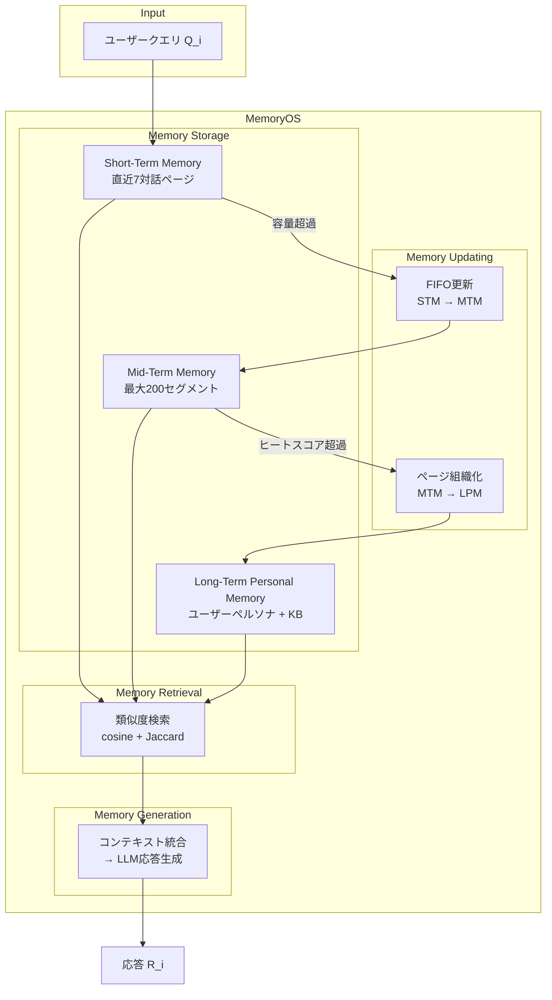

本記事は [Memory OS of AI Agent](https://arxiv.org/abs/2506.06326)（Kang et al., 2025）の解説記事です。

この記事は [Zenn記事: Bedrock AgentCoreで社内問い合わせエージェントを構築しメモリ永続化で精度向上](https://zenn.dev/0h_n0/articles/b7cddc45f56f1a) の深掘りです。Bedrock AgentCoreではエージェントにメモリを持たせて対話品質を向上させますが、MemoryOSはそのメモリ管理を「OSのメモリ管理」という視点で体系的に設計したアーキテクチャであり、エージェントメモリの設計原理を共有しています。

## 論文概要

LLMエージェントは固定長のコンテキストウィンドウに制約され、長期的な対話や個人化された応答の実現が困難です。MemoryOSは、オペレーティングシステムのメモリ管理原理に着想を得た階層型ストレージアーキテクチャを提案しています。短期メモリ（STM）、中期メモリ（MTM）、長期パーソナルメモリ（LPM）の3層構造と、Memory Storage・Updating・Retrieval・Generationの4つのモジュールから成ります。著者らの報告によると、LoCoMoベンチマークにおいてGPT-4o-miniをバックボーンとした場合、ベースライン手法に対してF1スコアで平均49.11%、BLEU-1で平均46.18%の改善を達成しています。

## 情報源

- **会議名**: EMNLP 2025（Conference on Empirical Methods in Natural Language Processing）
- **arXiv ID**: 2506.06326
- **URL**: [https://arxiv.org/abs/2506.06326](https://arxiv.org/abs/2506.06326)
- **著者**: Jiazheng Kang, Mingming Ji, Zhe Zhao, Ting Bai
- **発表年**: 2025
- **分野**: cs.AI
- **コード**: [https://github.com/BAI-LAB/MemoryOS](https://github.com/BAI-LAB/MemoryOS)

## 背景と動機

LLMの固定長コンテキストウィンドウは、長期対話における記憶の一貫性維持を困難にしています。たとえばユーザーが100回にわたる対話で蓄積した好みや文脈を、LLMは次のセッションでは忘却してしまいます。既存のメモリ管理手法（MemGPT、A-MEMなど）はこの問題に取り組んでいますが、著者らは以下の課題を指摘しています。第一に、単一階層のメモリでは「最近の対話コンテキスト」と「長期的なユーザープロファイル」を効率的に管理できません。第二に、メモリの更新戦略が単純すぎると、重要でない情報がメモリを圧迫します。第三に、検索の精度が低いと、関連する過去の対話を適切に呼び出せず応答品質が低下します。MemoryOSはOSのメモリ管理（キャッシュ階層、ページング、FIFO置換）という成熟した設計パターンをLLMエージェントのメモリに適用することで、これらの課題を体系的に解決するアプローチを提案しています。

## 主要な貢献

- **OS型3層メモリアーキテクチャ**: 短期メモリ（STM）・中期メモリ（MTM）・長期パーソナルメモリ（LPM）の階層構造により、対話の即時性と長期的な個人化を両立する設計を提案
- **効率的なメモリ更新戦略**: STMからMTMへの対話チェーンベースFIFO遷移と、MTMからLPMへのヒートスコアに基づくページ組織化戦略により、重要度に応じたメモリの自動昇格を実現
- **LoCoMoベンチマークでの大幅な改善**: GPT-4o-miniバックボーンにおいて、既存手法（MemGPT、A-MEM等）に対してF1で49.11%、BLEU-1で46.18%の平均改善を報告。特にトークン効率面でも、MemGPTの約1/4のトークン消費で高い精度を達成

## 技術的詳細

### 全体アーキテクチャ

MemoryOSは4つのモジュール（Storage・Updating・Retrieval・Generation）と3層のメモリ階層から構成されます。



### 短期メモリ（STM）

STMは直近の対話コンテキストを保持するFIFOキューです。各対話ページ $p_i$ は以下の3要素で構成されます。

$$
p_i = \{Q_i, R_i, T_i\}
$$

ここで $Q_i$ はユーザーのクエリ、$R_i$ はモデルの応答、$T_i$ はタイムスタンプです。STMの容量は固定で7ページに設定されています。

対話チェーン（Dialogue Chain）のメカニズムでは、新しい対話ページが既存チェーンとの意味的関連性を評価されます。類似度がしきい値を超える場合は既存チェーンに連結され、そうでなければ新しいチェーンとして開始されます。

### 中期メモリ（MTM）

MTMはセグメント化されたページ構造で情報を管理します。各セグメントは意味的に関連する複数の対話ページをグループ化したものです。新しいページがMTMに到着すると、既存セグメントとの類似度スコア $\mathcal{F}_\text{score}$ が計算されます。

$$
\mathcal{F}_\text{score} = \cos(e_s, e_p) + \mathcal{F}_\text{Jaccard}(K_s, K_p)
$$

ここで $e_s$ はセグメントの埋め込みベクトル、$e_p$ はページの埋め込みベクトル、$K_s$ と $K_p$ はそれぞれのキーワード集合です。Jaccard類似度は以下で定義されます。

$$
\mathcal{F}_\text{Jaccard}(K_s, K_p) = \frac{|K_s \cap K_p|}{|K_s \cup K_p|}
$$

類似度がしきい値 $\theta = 0.6$ を超える場合、ページは該当セグメントに追加されます。超えない場合は新しいセグメントが作成されます。MTMの最大容量は200セグメントです。

### 長期パーソナルメモリ（LPM）

LPMは持続的なユーザー情報を保持し、以下の2つのサブコンポーネントから構成されます。

- **User Persona**: 静的属性（名前、職業等）、ユーザー知識ベース（KB、容量100エントリ）、ユーザー特性（90次元）
- **Agent Persona**: エージェントプロファイル、エージェント特性

LPMのKBおよび特性キューはそれぞれ容量100エントリのFIFOキューで管理されます。

### メモリ更新メカニズム

#### STMからMTMへの更新（FIFO）

STMの容量（7ページ）を超過した場合、最も古い対話ページがMTMへ遷移します。この際、対話チェーンの情報が保持され、MTMのセグメントへの割り当てが行われます。

#### MTMからLPMへの更新（ヒートスコア）

MTMの各セグメントにはヒートスコアが計算されます。

$$
\text{Heat} = \alpha \cdot N_\text{visit} + \beta \cdot L_\text{interaction} + \gamma \cdot R_\text{recency}
$$

ここで $N_\text{visit}$ は参照回数、$L_\text{interaction}$ は対話長、$R_\text{recency}$ は時間減衰関数です。各係数は $\alpha = \beta = \gamma = 1$ に設定されています。時間減衰は指数関数で定義されます。

$$
R_\text{recency} = \exp\left(-\frac{\Delta t}{\mu}\right)
$$

ここで $\Delta t$ は最終アクセスからの経過時間、$\mu = 1 \times 10^7$ は減衰定数です。ヒートスコアがしきい値 $\tau = 5$ を超えたセグメントの情報がLPMに昇格されます。

### メモリ検索

検索時には3層すべてから関連情報が取得されます。MTMからはコサイン類似度とJaccard類似度の組み合わせスコアで上位 $m=5$ セグメントから上位 $k$ ページ（データセットに応じて5-10）を選択します。LPMからはユーザーKBとエージェント特性の上位10エントリが取得されます。

### メモリ生成

Generationモジュールは、STM・MTM・LPMから検索された情報を統合し、一貫性のあるプロンプトを構築してLLMに渡します。これにより、直近の対話コンテキスト、過去の関連対話要約、長期的なユーザープロファイルが組み合わさった個人化された応答が生成されます。

## アルゴリズム

### STMからMTMへのFIFO更新

```python
from dataclasses import dataclass, field
from collections import deque


@dataclass
class DialoguePage:
    """対話ページを表現するデータクラス

    Attributes:
        query: ユーザーのクエリ文字列
        response: モデルの応答文字列
        timestamp: 対話が発生したUNIXタイムスタンプ
        chain_id: 所属する対話チェーンのID
    """
    query: str
    response: str
    timestamp: float
    chain_id: int = 0


class ShortTermMemory:
    """短期メモリ: FIFOキューで直近の対話を保持

    STMの容量を超過した場合、最も古いページをMTMへ遷移させる。
    MemoryOS論文のDialogue-Chain-Based FIFO原理に基づく。

    Attributes:
        capacity: STMの最大ページ数（デフォルト7）
    """

    def __init__(self, capacity: int = 7) -> None:
        self.capacity: int = capacity
        self._queue: deque[DialoguePage] = deque(maxlen=capacity)

    def add_page(self, page: DialoguePage) -> DialoguePage | None:
        """新しい対話ページを追加し、溢れたページを返す

        Args:
            page: 追加する対話ページ

        Returns:
            容量超過で押し出されたページ（MTMへ遷移対象）。
            超過していなければNone。
        """
        evicted: DialoguePage | None = None
        if len(self._queue) == self.capacity:
            evicted = self._queue[0]  # 最古のページ
        self._queue.append(page)
        return evicted

    @property
    def pages(self) -> list[DialoguePage]:
        """現在保持している全ページを時系列順で返す"""
        return list(self._queue)
```

### MTMのセグメント化とヒートスコアによるLPM昇格

```python
import math
import time
from dataclasses import dataclass, field


@dataclass
class Segment:
    """MTMのセグメント: 意味的に関連する対話ページの集合

    Attributes:
        segment_id: セグメントの一意識別子
        pages: セグメントに属する対話ページのリスト
        embedding: セグメント全体の埋め込みベクトル
        keywords: セグメントのキーワード集合
        visit_count: 参照回数
        interaction_length: 累積対話長
        last_access_time: 最終アクセスのUNIXタイムスタンプ
    """
    segment_id: int
    pages: list[DialoguePage] = field(default_factory=list)
    embedding: list[float] = field(default_factory=list)
    keywords: set[str] = field(default_factory=set)
    visit_count: int = 0
    interaction_length: int = 0
    last_access_time: float = field(default_factory=time.time)


def compute_similarity_score(
    seg_embedding: list[float],
    page_embedding: list[float],
    seg_keywords: set[str],
    page_keywords: set[str],
) -> float:
    """セグメントとページの類似度スコアを計算

    cosine類似度 + Jaccard類似度の合算。
    論文の式 F_score = cos(e_s, e_p) + F_Jaccard(K_s, K_p) に対応。

    Args:
        seg_embedding: セグメントの埋め込みベクトル
        page_embedding: ページの埋め込みベクトル
        seg_keywords: セグメントのキーワード集合
        page_keywords: ページのキーワード集合

    Returns:
        類似度スコア（0以上の実数値）
    """
    # コサイン類似度
    dot: float = sum(a * b for a, b in zip(seg_embedding, page_embedding))
    norm_s: float = math.sqrt(sum(a * a for a in seg_embedding))
    norm_p: float = math.sqrt(sum(b * b for b in page_embedding))
    cosine: float = dot / (norm_s * norm_p) if norm_s * norm_p > 0 else 0.0

    # Jaccard類似度
    intersection: int = len(seg_keywords & page_keywords)
    union: int = len(seg_keywords | page_keywords)
    jaccard: float = intersection / union if union > 0 else 0.0

    return cosine + jaccard


def compute_heat_score(
    segment: Segment,
    alpha: float = 1.0,
    beta: float = 1.0,
    gamma: float = 1.0,
    mu: float = 1e7,
) -> float:
    """セグメントのヒートスコアを計算

    Heat = alpha * N_visit + beta * L_interaction + gamma * R_recency
    R_recency = exp(-delta_t / mu)

    ヒートスコアがしきい値 tau=5 を超えたセグメントはLPMに昇格される。

    Args:
        segment: 対象セグメント
        alpha: 参照回数の重み係数（デフォルト1.0）
        beta: 対話長の重み係数（デフォルト1.0）
        gamma: 時間減衰の重み係数（デフォルト1.0）
        mu: 時間減衰定数（デフォルト1e7）

    Returns:
        ヒートスコア値
    """
    delta_t: float = time.time() - segment.last_access_time
    recency: float = math.exp(-delta_t / mu)
    return (
        alpha * segment.visit_count
        + beta * segment.interaction_length
        + gamma * recency
    )


class MidTermMemory:
    """中期メモリ: セグメント化されたページ管理とLPM昇格判定

    Attributes:
        max_segments: 最大セグメント数（デフォルト200）
        similarity_threshold: セグメント割り当ての類似度しきい値（デフォルト0.6）
        heat_threshold: LPM昇格のヒートスコアしきい値（デフォルト5.0）
    """

    def __init__(
        self,
        max_segments: int = 200,
        similarity_threshold: float = 0.6,
        heat_threshold: float = 5.0,
    ) -> None:
        self.max_segments: int = max_segments
        self.similarity_threshold: float = similarity_threshold
        self.heat_threshold: float = heat_threshold
        self._segments: list[Segment] = []
        self._next_id: int = 0

    def assign_page(
        self,
        page: DialoguePage,
        page_embedding: list[float],
        page_keywords: set[str],
    ) -> list[Segment]:
        """ページをセグメントに割り当て、昇格対象セグメントを返す

        Args:
            page: 割り当てる対話ページ
            page_embedding: ページの埋め込みベクトル
            page_keywords: ページのキーワード集合

        Returns:
            ヒートスコアがしきい値を超えたセグメントのリスト（LPM昇格対象）
        """
        best_score: float = 0.0
        best_segment: Segment | None = None

        for seg in self._segments:
            score = compute_similarity_score(
                seg.embedding, page_embedding, seg.keywords, page_keywords
            )
            if score > best_score:
                best_score = score
                best_segment = seg

        if best_score >= self.similarity_threshold and best_segment is not None:
            best_segment.pages.append(page)
            best_segment.visit_count += 1
            best_segment.interaction_length += 1
            best_segment.last_access_time = time.time()
            best_segment.keywords |= page_keywords
        else:
            new_seg = Segment(
                segment_id=self._next_id,
                pages=[page],
                embedding=page_embedding,
                keywords=page_keywords,
                visit_count=1,
                interaction_length=1,
            )
            self._segments.append(new_seg)
            self._next_id += 1

        # ヒートスコアによる昇格対象の特定
        promoted: list[Segment] = [
            seg for seg in self._segments
            if compute_heat_score(seg) >= self.heat_threshold
        ]
        self._segments = [
            seg for seg in self._segments
            if compute_heat_score(seg) < self.heat_threshold
        ]
        return promoted
```

## 実装のポイント

### 埋め込みモデルの選択

MemoryOSの公式実装ではBAAI/bge-m3、Qwen埋め込み、all-MiniLM-L6-v2をサポートしています。セグメント割り当ての類似度計算がシステム全体の品質を左右するため、ドメインに適した埋め込みモデルの選択が重要です。日本語対話に適用する場合は、多言語対応のbge-m3が有力な選択肢です。

### ハイパーパラメータの調整

著者らが論文で報告しているデフォルト値は以下のとおりです。

| パラメータ | 値 | 説明 |
|-----------|-----|------|
| STM容量 | 7 | 直近7対話ページを保持 |
| MTM最大セグメント数 | 200 | トピック単位のグループ上限 |
| LPM KB/特性容量 | 100 | 各キューのエントリ数上限 |
| 類似度しきい値 $\theta$ | 0.6 | セグメント割り当て判定 |
| ヒートしきい値 $\tau$ | 5 | LPM昇格判定 |
| ヒート係数 $\alpha, \beta, \gamma$ | 1.0 | 均等重み |
| 時間減衰定数 $\mu$ | $1 \times 10^7$ | 約116日で半減 |
| MTM検索トップm | 5 | セグメント選択数 |
| MTM検索トップk | 5-10 | ページ選択数 |

STMの容量7はミラーの法則（人間の短期記憶容量 $7 \pm 2$）に由来すると考えられます。ヒートスコアの減衰定数 $\mu = 1 \times 10^7$ は、秒単位で約116日の半減期に相当し、月単位の対話パターンを捕捉する設計です。

### ベクトルDBの選択

公式実装ではChromaDBを使用しています。MTMのセグメント検索はコサイン類似度ベースのため、ベクトルDBのインデックス効率が検索レイテンシに直結します。大規模運用ではPGVector、Pinecone、Weaviateなどの選択肢も検討すべきです。

### LLMバックボーンの互換性

MemoryOSはOpenAI API互換のインタフェースを通じて複数のLLMをサポートしています。公式リポジトリではOpenAI、Anthropic、Deepseek-R1、Qwen、vLLMが対応しており、バックボーンLLMの変更が容易な設計になっています。

## Production Deployment Guide

### AWS構成パターン

MemoryOSを本番環境に導入する場合の推奨構成です。

| 規模 | 月間アクティブユーザー | 推奨構成 | 月額コスト目安 |
|------|---------------------|---------|-------------|
| **Small** | ~500 | Lambda + DynamoDB + Bedrock | $200-500 |
| **Medium** | ~5,000 | ECS Fargate + Aurora + Bedrock | $800-2,500 |
| **Large** | ~50,000 | EKS + Karpenter + Aurora + Bedrock | $3,000-8,000 |

**コスト試算の注意事項**: 上記は2026年5月時点のAWS ap-northeast-1料金に基づく概算です。LLM API呼び出しコスト（Bedrock Anthropic Claude / GPT-4o-mini相当）が総コストの60-80%を占めるため、Bedrock Batch APIの活用やProvisionedスループットの検討を推奨します。

### Small構成: Lambda + DynamoDB

```hcl
# small_memoryos.tf - MemoryOS Small構成

resource "aws_dynamodb_table" "memory_stm" {
  name         = "memoryos-stm"
  billing_mode = "PAY_PER_REQUEST"
  hash_key     = "user_id"
  range_key    = "timestamp"

  attribute {
    name = "user_id"
    type = "S"
  }

  attribute {
    name = "timestamp"
    type = "N"
  }

  ttl {
    attribute_name = "ttl"
    enabled        = true
  }

  tags = {
    Service = "memoryos"
    Tier    = "stm"
  }
}

resource "aws_dynamodb_table" "memory_mtm" {
  name         = "memoryos-mtm"
  billing_mode = "PAY_PER_REQUEST"
  hash_key     = "user_id"
  range_key    = "segment_id"

  attribute {
    name = "user_id"
    type = "S"
  }

  attribute {
    name = "segment_id"
    type = "S"
  }

  tags = {
    Service = "memoryos"
    Tier    = "mtm"
  }
}

resource "aws_dynamodb_table" "memory_lpm" {
  name         = "memoryos-lpm"
  billing_mode = "PAY_PER_REQUEST"
  hash_key     = "user_id"
  range_key    = "entry_type"

  attribute {
    name = "user_id"
    type = "S"
  }

  attribute {
    name = "entry_type"
    type = "S"
  }

  tags = {
    Service = "memoryos"
    Tier    = "lpm"
  }
}

resource "aws_lambda_function" "memoryos_handler" {
  function_name = "memoryos-handler"
  runtime       = "python3.12"
  handler       = "handler.lambda_handler"
  timeout       = 60
  memory_size   = 512

  environment {
    variables = {
      STM_TABLE        = aws_dynamodb_table.memory_stm.name
      MTM_TABLE        = aws_dynamodb_table.memory_mtm.name
      LPM_TABLE        = aws_dynamodb_table.memory_lpm.name
      BEDROCK_MODEL_ID = "anthropic.claude-sonnet-4-20250514"
    }
  }
}
```

### Large構成: EKS + Karpenter

```hcl
# large_memoryos.tf - MemoryOS Large構成

module "eks" {
  source  = "terraform-aws-modules/eks/aws"
  version = "~> 20.0"

  cluster_name    = "memoryos-cluster"
  cluster_version = "1.31"

  vpc_id     = module.vpc.vpc_id
  subnet_ids = module.vpc.private_subnets

  eks_managed_node_groups = {
    memoryos = {
      instance_types = ["m7i.xlarge"]
      min_size       = 2
      max_size       = 10
      desired_size   = 3
    }
  }
}

resource "helm_release" "karpenter" {
  namespace  = "karpenter"
  name       = "karpenter"
  repository = "oci://public.ecr.aws/karpenter"
  chart      = "karpenter"
  version    = "1.1.0"

  set {
    name  = "settings.clusterName"
    value = module.eks.cluster_name
  }
}

resource "kubectl_manifest" "karpenter_nodepool" {
  yaml_body = <<-YAML
    apiVersion: karpenter.sh/v1
    kind: NodePool
    metadata:
      name: memoryos-pool
    spec:
      template:
        spec:
          nodeClassRef:
            group: karpenter.k8s.aws
            kind: EC2NodeClass
            name: default
          requirements:
            - key: karpenter.sh/capacity-type
              operator: In
              values: ["spot", "on-demand"]
            - key: node.kubernetes.io/instance-type
              operator: In
              values: ["m7i.xlarge", "m7i.2xlarge", "r7i.xlarge"]
      limits:
        cpu: "100"
        memory: "400Gi"
  YAML
}

resource "aws_rds_cluster" "memoryos_aurora" {
  cluster_identifier = "memoryos-aurora"
  engine             = "aurora-postgresql"
  engine_version     = "16.4"
  engine_mode        = "provisioned"

  serverlessv2_scaling_configuration {
    min_capacity = 0.5
    max_capacity = 16
  }

  master_username = "memoryos_admin"
  manage_master_user_password = true

  storage_encrypted   = true
  deletion_protection = true
}
```

### セキュリティベストプラクティス

- **メモリデータの暗号化**: DynamoDB/Auroraの保存時暗号化（AES-256）を有効化。STMの対話データにはユーザーの個人情報が含まれるため、AWS KMSカスタマーマネージドキーの使用を推奨
- **アクセス制御**: Lambda/EKSにはIAMロールで最小権限を付与。DynamoDBへのアクセスはユーザーIDベースの条件キーで制限
- **PII保護**: LPMのUser Personaには氏名・職業等の個人情報が蓄積されるため、Amazon Macie等でPII検出を自動化。メモリ内容のログ出力を禁止するポリシーを設定
- **通信暗号化**: VPCエンドポイント経由でDynamoDB/Bedrock/S3にアクセスし、インターネット経由の通信を排除

### 運用・監視設定

```python
import boto3
from typing import Any


def setup_memoryos_monitoring(
    stack_name: str = "memoryos",
    alarm_email: str = "ops@example.com",
) -> dict[str, Any]:
    """MemoryOS向けCloudWatch監視設定を構築

    STM/MTM/LPMの各層の健全性とLLM API呼び出しを監視する。
    X-Rayトレーシングでメモリ検索のレイテンシボトルネックを特定。

    Args:
        stack_name: CloudFormationスタック名プレフィックス
        alarm_email: アラート通知先メールアドレス

    Returns:
        作成したアラームとダッシュボードのARN辞書
    """
    cw = boto3.client("cloudwatch")

    # メモリ検索レイテンシの監視（P99 > 2秒でアラート）
    cw.put_metric_alarm(
        AlarmName=f"{stack_name}-retrieval-latency-p99",
        MetricName="RetrievalLatencyMs",
        Namespace=f"{stack_name}/MemoryOS",
        Statistic="p99",
        Period=300,
        EvaluationPeriods=3,
        Threshold=2000,
        ComparisonOperator="GreaterThanThreshold",
        AlarmActions=[f"arn:aws:sns:ap-northeast-1:ACCOUNT:ops-alerts"],
    )

    # MTMセグメント数の監視（上限200の80%でアラート）
    cw.put_metric_alarm(
        AlarmName=f"{stack_name}-mtm-segment-count",
        MetricName="MtmSegmentCount",
        Namespace=f"{stack_name}/MemoryOS",
        Statistic="Maximum",
        Period=3600,
        EvaluationPeriods=1,
        Threshold=160,
        ComparisonOperator="GreaterThanThreshold",
    )

    # Bedrock API呼び出しエラー率の監視
    cw.put_metric_alarm(
        AlarmName=f"{stack_name}-bedrock-error-rate",
        MetricName="BedrockErrorCount",
        Namespace=f"{stack_name}/MemoryOS",
        Statistic="Sum",
        Period=300,
        EvaluationPeriods=2,
        Threshold=10,
        ComparisonOperator="GreaterThanThreshold",
    )

    return {
        "alarms_created": 3,
        "dashboard": f"{stack_name}-memoryos-dashboard",
    }
```

**X-Rayトレーシング**: メモリ検索パス（STM直接参照 → MTMセグメント検索 → LPMプロファイル取得）をX-Rayセグメントとして計装し、どの層がレイテンシボトルネックになっているかを可視化します。

### コスト最適化チェックリスト

- [ ] DynamoDBのオンデマンドキャパシティが安定したら、プロビジョンドキャパシティ + Auto Scalingに切り替え（最大70%削減）
- [ ] STMのTTLを設定し、古い対話ページを自動削除（ストレージコスト削減）
- [ ] Bedrock Batch APIを非リアルタイム処理（MTM→LPM昇格、LPM更新）に適用（50%割引）
- [ ] 埋め込み計算をSageMaker Serverless Inferenceにオフロード（GPUコスト最適化）
- [ ] CloudWatch Logsの保持期間を30日に設定（デフォルト無期限からの変更）
- [ ] MTMセグメントの埋め込みベクトルをキャッシュし、再計算を回避
- [ ] Savings Plansの適用（EKS/Fargateの1年コミットで最大20%削減）

## 実験結果

### GVDデータセット（論文Table 1より）

著者らが報告するGPT-4o-miniバックボーンでの各手法の比較結果です。

| 手法 | Accuracy | Correctness | Coherence |
|------|----------|-------------|-----------|
| TiM | 84.5 | 78.8 | 90.8 |
| MemoryBank | 78.4 | 73.3 | 91.2 |
| MemGPT | 87.9 | 83.2 | 89.6 |
| A-MEM | 90.4 | 86.5 | 91.4 |
| **MemoryOS** | **93.3** | **91.2** | **92.3** |

MemoryOSはAccuracyで93.3%、Correctnessで91.2%を達成し、いずれも既存手法を上回っています。

### LoCoMoベンチマーク（論文Table 2より）

LoCoMo（Long Conversational Memory）ベンチマークでのF1スコア比較です。

| 手法 | Single-Hop F1 | Multi-Hop F1 | Temporal F1 | Open-Domain F1 | BLEU-1 |
|------|---------------|--------------|-------------|----------------|--------|
| TiM | 16.25 | 18.43 | 8.35 | 23.74 | 13.12 |
| MemoryBank | 5.00 | 9.68 | 5.56 | 6.61 | 4.77 |
| MemGPT | 26.65 | 25.52 | 9.15 | 41.04 | 17.72 |
| A-MEM | 22.61 | 33.23 | 8.04 | 34.13 | 20.09 |
| **MemoryOS** | **35.27** | **41.15** | **20.02** | **48.62** | **25.22** |

著者らによると、MemoryOSは全カテゴリで最高スコアを達成しています。特にTemporal F1（時間関連の質問）では20.02%を記録し、2位のMemGPT（9.15%）を大幅に上回っています。これは、ヒートスコアの時間減衰関数 $R_\text{recency}$ が時間的コンテキストの保持に効果的に機能していることを示唆しています。

### トークン効率（論文Table 3より）

| 手法 | 平均トークン数 | 平均API呼び出し回数 | 平均F1 |
|------|-------------|-------------------|--------|
| MemoryBank | 432 | 3.0 | 6.84 |
| TiM | 1,274 | 2.6 | 18.01 |
| MemGPT | 16,977 | 4.3 | 29.13 |
| A-MEM | 2,712 | 13.0 | 26.55 |
| **MemoryOS** | **3,874** | **4.9** | **36.23** |

MemoryOSはMemGPTの約1/4のトークン消費（3,874 vs 16,977）でより高いF1スコア（36.23 vs 29.13）を達成しており、トークン効率の面でも優位性があると著者らは報告しています。A-MEMと比較すると、API呼び出し回数は約1/3（4.9 vs 13.0）でF1は36%高い結果となっています。

### アブレーション結果

著者らはMemoryOSの各コンポーネントの寄与を検証するアブレーション実験を実施しています。MTM（中期メモリ）の除去が最も大きな性能低下を引き起こし、3層構造の中間層が情報のフィルタリングと集約において重要な役割を果たしていることが示されています。LPMの除去は中程度の影響、対話チェーンの除去は比較的小さな影響にとどまると報告されています。

## 実運用への応用

### Bedrock AgentCoreとの比較考察

[Zenn記事](https://zenn.dev/0h_n0/articles/b7cddc45f56f1a)で紹介されているBedrock AgentCoreのメモリ永続化機能とMemoryOSを比較すると、以下の違いがあります。

| 観点 | Bedrock AgentCore | MemoryOS |
|------|------------------|----------|
| メモリ階層 | フラットなKey-Value | 3層階層（STM/MTM/LPM） |
| 更新戦略 | 明示的なAPI呼び出し | 自動FIFO + ヒートスコア昇格 |
| 検索方式 | セッションベース | コサイン + Jaccard 複合スコア |
| ペルソナ管理 | なし（カスタム実装が必要） | LPMに組み込み（90次元特性） |
| マネージドサービス | AWS完全マネージド | セルフホスティング |
| スケーラビリティ | AWSインフラに依存 | 設計次第 |

AgentCoreのメモリはシンプルで導入が容易ですが、長期対話における個人化の深度ではMemoryOSの3層構造が優位です。実務的には、AgentCoreの永続化基盤の上にMemoryOSのメモリ管理ロジック（ヒートスコア昇格、セグメント化）を実装する「ハイブリッド構成」が考えられます。

### 適用シナリオ

1. **カスタマーサポート**: 顧客の過去の問い合わせ履歴（MTM）と嗜好プロファイル（LPM）を活用し、パーソナライズされた応答を生成
2. **社内問い合わせエージェント**: 部署ごとの問い合わせパターン（MTMセグメント）と個人の役職・専門分野（LPM User Persona）を組み合わせた回答
3. **教育支援**: 学習者の理解度推移（MTM）と学習スタイル（LPM）に基づく適応的な教材提示

## 関連研究

- **MemGPT**（Packer et al., 2024）: LLMのコンテキストウィンドウをOSの仮想メモリとして扱い、メインメモリとディスクの2層構造でメモリを管理する手法。MemoryOSとの主な違いは階層数（2層 vs 3層）と更新戦略（MemGPTはLLM自身がメモリ操作を決定、MemoryOSはヒートスコアベースの自動昇格）です。LoCoMoベンチマークではMemoryOSが平均F1で約24%上回っています（Table 2より）
- **A-MEM**（Zhang et al., 2025）: エージェント的メモリ管理を提案し、メモリの自律的な整理・統合を行う手法。MemoryOSと比較してAPI呼び出し回数が約2.6倍多く（13.0 vs 4.9）、トークン効率面でMemoryOSが優位です（Table 3より）。GVDデータセットではA-MEMのAccuracy 90.4%に対してMemoryOS 93.3%と報告されています
- **Mem0**（Chheda et al., 2025）: ユーザーの長期記憶をグラフ構造で管理するシステム。個人化の精度に強みがありますが、メモリの階層的な時間管理（短期→中期→長期の段階的遷移）はMemoryOSの特徴的な設計です
- **MemoryBank**（Zhong et al., 2024）: Ebbinghausの忘却曲線に基づくメモリ管理。理論的に興味深いアプローチですが、LoCoMoベンチマークではF1 6.84と低い性能にとどまっており、MemoryOSの36.23と大きな差があります（Table 3より）

## まとめと今後の展望

MemoryOSは、OSのメモリ管理原理（階層キャッシュ、FIFO置換、ページング）をLLMエージェントのメモリ管理に適用した体系的なアーキテクチャです。STM（直近7対話）→ MTM（セグメント化された対話履歴）→ LPM（持続的ユーザープロファイル）の3層構造と、ヒートスコアに基づく自動昇格メカニズムにより、トークン効率を維持しながら高い対話品質を実現しています。

著者らが報告するLoCoMoベンチマークでの+49.11% F1、+46.18% BLEU-1の改善は、メモリ管理の設計がLLMエージェントの対話品質に大きく影響することを示しています。特にTemporal F1での大幅な改善は、時間減衰関数を組み込んだヒートスコアの有効性を示唆しています。

今後の展望として、著者らのアプローチをマルチエージェント環境に拡張し、エージェント間でのメモリ共有・同期の仕組みを構築することが考えられます。また、Bedrock AgentCoreなどのマネージドサービスとの統合により、MemoryOSの3層メモリ管理をクラウドネイティブに展開する実用的なアーキテクチャの構築が期待されます。

## 参考文献

- Kang, J., Ji, M., Zhao, Z., & Bai, T. (2025). Memory OS of AI Agent. arXiv:2506.06326. [https://arxiv.org/abs/2506.06326](https://arxiv.org/abs/2506.06326)
- Packer, C., Wooders, S., Lin, K., Fang, V., Patil, S. G., Stoica, I., & Gonzalez, J. E. (2024). MemGPT: Towards LLMs as Operating Systems. arXiv:2310.08560.
- Zhang, Y., et al. (2025). A-MEM: Agentic Memory for LLM Agents. arXiv:2502.12110.
- Chheda, D., et al. (2025). Mem0: Building Production-Ready AI Agents with Scalable Long-Term Memory. arXiv:2504.19413.
- Zhong, W., Guo, L., Gao, Q., & Wang, Y. (2024). MemoryBank: Enhancing Large Language Models with Long-Term Memory. AAAI 2024.
- **Related Zenn article**: [https://zenn.dev/0h_n0/articles/b7cddc45f56f1a](https://zenn.dev/0h_n0/articles/b7cddc45f56f1a)
- **GitHub**: [https://github.com/BAI-LAB/MemoryOS](https://github.com/BAI-LAB/MemoryOS)

---

:::message
この記事はAI（Claude Code）により自動生成されました。内容の正確性については論文原文で検証していますが、最新の情報は公式リポジトリもご確認ください。
:::
