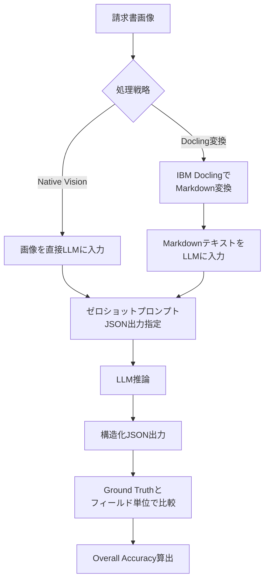
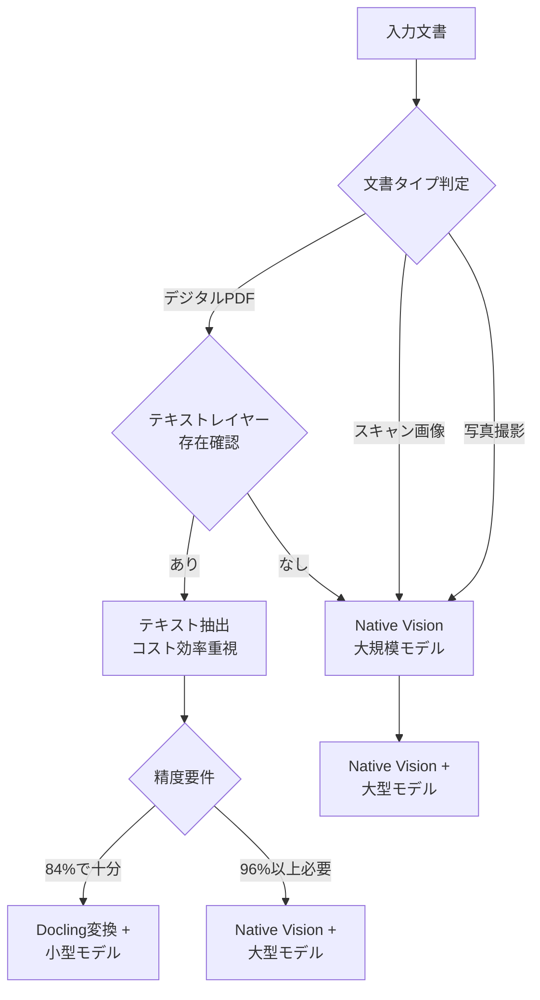

本記事は [https://arxiv.org/abs/2509.04469](https://arxiv.org/abs/2509.04469) の解説記事です。

## 論文概要（Abstract）

本論文は、請求書からの情報抽出タスクにおいて、マルチモーダルLLMの2つの処理戦略――画像を直接入力する「Native Vision」と、Doclingでドキュメントを事前にMarkdownへ変換してからテキストとして入力する「Docling変換」――をゼロショット条件で体系的に比較したベンチマーク研究である。GPT-5系列3モデル、Gemini 2.5系列3モデル、Gemma 3系列2モデルの計8モデルを、Clean Invoices（500件）、Scanned Receipts（ICDAR-2019-SROIE、1000件）、Scanned Invoices（inv-cdip、350件）の3つの公開データセットで評価している。著者らは、Native Vision処理がスキャン文書で最大40ポイントの精度差をつけて優位であること、一方でDocling変換は84-85%付近に精度が収束する「天井効果」を持つことを報告している。

この記事は [Zenn記事: Claude Opus 4.7のVisionで帳票OCRパイプラインを構築する実践ガイド](https://zenn.dev/0h_n0/articles/cf6a2a6d3a7abc) の深掘りです。

## 情報源

- **arXiv ID**: 2509.04469
- **URL**: [https://arxiv.org/abs/2509.04469](https://arxiv.org/abs/2509.04469)
- **著者**: David Berghaus, Armin Berger, Lars Hillebrand et al.（Fraunhofer IAIS, Lamarr Institute）
- **発表年**: 2025
- **分野**: cs.CV, cs.CL（Document AI、マルチモーダルLLM）

## 背景と動機（Background & Motivation）

請求書処理の自動化は、企業のバックオフィス業務における中核的な課題である。従来のOCR+テンプレートマッチング手法は、レイアウトが固定されたフォーマットには有効であったが、フォーマットの多様化やスキャン品質のばらつきに対応するには限界があった。

マルチモーダルLLMの登場により、画像を直接入力して構造化データを抽出する新たなアプローチが可能となった。しかし、実務上は2つの処理戦略が存在する。

1. **Native Vision**: 請求書画像をそのままLLMに入力し、視覚的にフィールドを認識・抽出する
2. **Docling変換**: IBM Doclingなどのドキュメント変換ツールで画像をMarkdownに変換してから、テキストとしてLLMに入力する

Zenn記事ではClaude Opus 4.7のVision APIを用いた帳票OCRパイプラインの実装が紹介されているが、本論文はその根本的な疑問――「画像を直接処理するのと、テキストに変換してから処理するのと、どちらが高精度なのか」――に体系的なベンチマークで回答する研究である。

## 主要な貢献（Key Contributions）

- **8モデル×3データセット×2戦略の網羅的ベンチマーク**: GPT-5系列、Gemini 2.5系列、Gemma 3系列を含む商用・オープンソース8モデルを、Clean/Scanned Invoices/Scanned Receiptsの3データセットでゼロショット評価し、Native VisionとDocling変換を直接比較
- **Docling天井効果の定量化**: Docling変換を経由すると、モデルの規模や性能に関わらず精度が84-85%付近に収束する現象を発見。変換段階での情報損失がボトルネックであることを示した
- **小規模モデルの能力閾値の発見**: 4Bパラメータ規模のGemma 3-4b-itでは、Native Visionの精度がClean Invoicesで45.69%まで低下する一方、Docling変換では84.59%に改善する逆転現象を報告。視覚的理解に必要な最小モデル規模の存在を示唆
- **IBANフィールドの困難さの分析**: 0/O/Uの文字混同により、IBANフィールドが全モデルで最低精度となることを定量的に示した

## 技術的詳細（Technical Details）

### 実験設計

著者らの実験フレームワークは以下の構成である。



### データセット

3つの公開データセットが使用されている。

| データセット | 件数 | 特徴 | 出典 |
|---|---|---|---|
| Clean Invoices | 500 | デジタル生成、高品質 | Donut Dataset |
| Scanned Receipts | 1,000 | 紙レシートのスキャン、ノイズ多 | ICDAR-2019-SROIE |
| Scanned Invoices | 350 | 請求書スキャン、レイアウト多様 | inv-cdip |

Clean Invoicesはデジタル生成されたPDFであり、テキストレイヤーが明確に存在する。一方、Scanned ReceiptsとScanned Invoicesはスキャン画像であり、文字の歪み、ノイズ、影、回転などの劣化要因を含む。この品質差が2つの処理戦略の精度差に直結する。

### 評価手法

各請求書から抽出対象のフィールド（invoice_number、date、total_amount、IBAN等）をJSON形式で出力させ、Ground Truthとフィールド単位で完全一致を判定する。Overall Accuracyは全フィールドの正解率の平均として算出される。

$$
\text{Overall Accuracy} = \frac{1}{|F|} \sum_{f \in F} \frac{\sum_{i=1}^{N} \mathbb{1}[\hat{y}_i^f = y_i^f]}{N}
$$

ここで、

- $F$: 抽出対象フィールドの集合
- $N$: データセット内の文書数
- $\hat{y}_i^f$: 文書$i$のフィールド$f$に対するモデル予測
- $y_i^f$: Ground Truth
- $\mathbb{1}[\cdot]$: 完全一致の指示関数

### Docling変換パイプライン

IBM Doclingは、PDFや画像からMarkdownへの変換を行うオープンソースツールである。内部でOCRエンジン（Tesseract等）とレイアウト解析を組み合わせ、テーブル構造やヘッダー/フッターを含む構造化Markdownを出力する。著者らはDocling v2系をデフォルト設定で使用している。

この変換パイプラインの存在が「天井効果」の原因となる。Doclingの変換精度が上限となるため、どれほど高性能なLLMを使用しても、変換時に失われた情報は復元できない。

### モデル構成

| モデル | パラメータ規模 | 提供元 | 種別 |
|---|---|---|---|
| GPT-5-chat | 非公開 | OpenAI | 商用API |
| GPT-5-mini | 非公開 | OpenAI | 商用API |
| GPT-5-nano | 非公開 | OpenAI | 商用API |
| Gemini 2.5 Pro | 非公開 | Google | 商用API |
| Gemini 2.5 Flash | 非公開 | Google | 商用API |
| Gemini 2.5 Flash-Lite | 非公開 | Google | 商用API |
| Gemma 3-12b-it | 12B | Google | オープンソース |
| Gemma 3-4b-it | 4B | Google | オープンソース |

全モデルでゼロショットプロンプティングを採用し、出力形式はJSONに統一されている。Few-shot例やシステムプロンプトによる追加の誘導は行われていない。

## 実験結果（Results）

### 主要結果

論文のベンチマーク表より、主要モデルのOverall Accuracy（%）を以下に示す。

| Model | Strategy | Scanned Receipts | Clean Invoices | Scanned Invoices |
|---|---|---|---|---|
| gemini-2.5-pro | Native | **87.46** | **96.50** | **92.71** |
| gemini-2.5-pro | Docling | 46.54 | 85.14 | 63.94 |
| gemini-2.5-flash | Native | 82.15 | 93.55 | 92.07 |
| gpt-5-chat | Native | 69.21 | 96.03 | 88.01 |
| gpt-5-chat | Docling | 42.37 | 84.89 | 64.03 |
| gpt-5-mini | Native | 53.92 | 96.31 | 86.88 |
| gpt-5-nano | Native | 58.08 | 86.45 | 80.61 |
| gemma-3-12b-it | Native | 66.91 | 84.66 | 82.09 |
| gemma-3-4b-it | Native | 53.79 | 45.69 | 76.02 |
| gemma-3-4b-it | Docling | 36.69 | 84.59 | 55.43 |

### 分析: 3つの重要な発見

**発見1: Native VisionはスキャンデータでDoclingに大差をつける**

Scanned Receiptsにおいて、gemini-2.5-proのNative（87.46%）とDocling（46.54%）の差は約41ポイントに達する。GPT-5-chatでも同様に、Native（69.21%）対Docling（42.37%）で約27ポイントの差が開く。スキャン品質の低いレシートでは、Doclingの前処理段階でOCRエラーが蓄積し、LLMに渡される時点で情報が劣化していると著者らは分析している。

Scanned Invoicesでも同様の傾向が確認される。gemini-2.5-proではNative（92.71%）対Docling（63.94%）で約29ポイント差、gpt-5-chatではNative（88.01%）対Docling（64.03%）で約24ポイント差である。

**発見2: Docling天井効果（Docling Ceiling）**

Clean Invoicesにおいて、Docling変換を経由した場合の精度が全モデルで84-85%付近に収束する。gemini-2.5-pro（85.14%）、gpt-5-chat（84.89%）、gemma-3-4b-it（84.59%）と、モデル規模やアーキテクチャの差がほとんど消失する。

これはDoclingの変換精度がボトルネックとなっていることを意味する。Clean InvoicesはOCRにとって最も容易な条件であるにもかかわらず、変換段階で約15%の情報損失が発生していることになる。著者らはこの現象を「Docling ceiling」と名付け、テキストベースの中間変換アプローチの本質的な限界を指摘している。

一方、Native VisionではClean Invoicesでgemini-2.5-proが96.50%、gpt-5-chatが96.03%、gpt-5-miniが96.31%を達成しており、天井効果は観察されない。

**発見3: 4Bモデルの能力閾値（Capability Threshold）**

gemma-3-4b-itは、他の全モデルと異なる挙動を示す。Native VisionでClean Invoicesの精度が45.69%と極端に低迷する唯一のモデルである。同じモデルのDocling変換では84.59%に改善するため、問題は画像理解能力にある。

著者らはこれを「4Bパラメータ規模では視覚的な請求書理解に必要な表現能力が不足している」と解釈している。12BパラメータのGemma 3-12b-itではNativeで84.66%を達成しており、4B→12Bの間に視覚的理解の能力閾値が存在する。この閾値の発見は、コスト最適化のためにモデルサイズを縮小する際の下限を示す実用的な知見である。

### エラー分析

著者らの詳細なエラー分析では、以下の傾向が報告されている。

- **IBANフィールド**: 全モデルで最低精度。20文字以上の英数字列であり、スキャン画像では「0」と「O」、「O」と「U」の文字混同が頻発する
- **inv-cdipアノテーション**: 元データセットのGround Truthに不整合が含まれており、著者らが手動修正を行っている。公開ベンチマークのアノテーション品質が評価精度に影響する事例として注目に値する
- **データセット汚染リスク**: 使用した3データセットが公開されているため、学習データに含まれている可能性がある。著者らはこのリスクを認識しつつも、ゼロショット設定でのベンチマークとして有用であると述べている

## 実装のポイント（Implementation）

本論文の実験設計から、実務での帳票OCRパイプライン構築において以下のポイントが導出される。

**モデル選定基準**: Zenn記事で解説されているClaude Opus 4.7を含め、Native Vision処理が可能な大規模モデルを優先すべきである。本論文の結果から、4Bパラメータ未満のモデルはVision性能が不十分な可能性がある。

**前処理戦略の判断フロー**: 入力がデジタル生成PDFの場合、Doclingなどのテキスト抽出ツールでも84-85%の精度が得られる。しかし、スキャン文書やレシートなどノイズの多いデータでは、Native Visionが必須である。



**ゼロショット vs Few-shot**: 本論文はゼロショットのみの評価であるため、Few-shot例やファインチューニングによる追加の精度向上余地がある。Zenn記事で紹介されているPydanticスキーマによる出力構造化は、ゼロショットでの精度を高める有効な手法の一つである。

**フィールド別の信頼度管理**: IBANなど抽出困難なフィールドについては、ルールベースのバリデーション（チェックディジット検証など）を後段に追加することで、LLMの出力精度を補完できる。

```python
def validate_iban(iban: str) -> bool:
    """IBAN check digit validation (ISO 13616).

    Args:
        iban: Extracted IBAN string (e.g., 'DE89370400440532013000')

    Returns:
        True if IBAN check digit is valid
    """
    iban = iban.replace(" ", "").upper()
    if len(iban) < 15 or len(iban) > 34:
        return False
    # Move first 4 chars to end
    rearranged = iban[4:] + iban[:4]
    # Convert letters to numbers (A=10, B=11, ..., Z=35)
    numeric = ""
    for char in rearranged:
        if char.isdigit():
            numeric += char
        else:
            numeric += str(ord(char) - ord("A") + 10)
    return int(numeric) % 97 == 1


def validate_extracted_fields(fields: dict[str, str]) -> dict[str, dict]:
    """Validate LLM-extracted invoice fields with rule-based checks.

    Args:
        fields: Dictionary of field_name -> extracted_value

    Returns:
        Dictionary with validation results per field
    """
    results: dict[str, dict] = {}
    validators = {
        "iban": validate_iban,
        "invoice_date": _validate_date_format,
        "total_amount": _validate_numeric,
    }
    for field_name, value in fields.items():
        validator = validators.get(field_name)
        if validator:
            is_valid = validator(value)
            results[field_name] = {
                "value": value,
                "valid": is_valid,
                "needs_review": not is_valid,
            }
        else:
            results[field_name] = {"value": value, "valid": True, "needs_review": False}
    return results
```

## Production Deployment Guide

本論文の知見をもとに、Zenn記事で紹介されているClaude Vision帳票OCRパイプラインをAWS上でプロダクション運用するための構成を解説する。

### AWS実装パターン（コスト最適化重視）

以下に、トラフィック量別の推奨構成を示す。コスト試算は2026年5月時点のAWS ap-northeast-1（東京）リージョン料金に基づく概算値であり、実際のコストはトラフィックパターン、リージョン、バースト使用量により変動する。最新料金は[AWS料金計算ツール](https://calculator.aws/)で確認を推奨する。

| 構成 | トラフィック | アーキテクチャ | 月額概算 |
|---|---|---|---|
| Small | ~100 req/日 | Lambda + Bedrock (Claude) + DynamoDB + S3 | $50-150 |
| Medium | ~1,000 req/日 | ECS Fargate + Bedrock + Aurora Serverless v2 + S3 | $300-800 |
| Large | 10,000+ req/日 | EKS + Karpenter (Spot) + Bedrock Batch + Aurora + S3 | $2,000-5,000 |

**Small構成の内訳**: Lambda（256MB、平均15秒実行）$8/月、Bedrock Claude Sonnet（100件×画像トークン）$30-80/月、DynamoDB On-Demand $5/月、S3 $1/月、CloudWatch $5/月。Visionモデルは画像トークンのコストが高いため、入力画像の解像度最適化（1024px以下にリサイズ）がコスト削減に直結する。

**Medium構成のポイント**: ECS Fargate（0.5 vCPU / 1GB RAM）でAPIサーバーを稼働し、Bedrockへの呼び出しをキューイング管理する。Aurora Serverless v2で抽出結果を永続化し、バッチ処理とリアルタイム処理を混在させる構成。

**Large構成のポイント**: EKSでワーカーノードを管理し、Karpenter + Spot Instancesで最大90%のコンピュートコスト削減を実現する。Bedrock Batch APIを併用し、非リアルタイム処理分のAPIコストを50%削減する。

**コスト削減テクニック**:
- Bedrock Batch API使用で50%削減（リアルタイム性が不要な場合）
- Prompt Caching有効化で30-90%削減（同一テンプレートの帳票処理時）
- 入力画像のリサイズ・圧縮でトークン数を削減（本論文の知見: 精度への影響は限定的）
- Small構成ではNAT Gatewayを使用せずVPCエンドポイント経由でBedrock接続（$35/月の削減）
- モデルティアリング: Clean InvoicesにはSonnet（安価）、Scanned InvoicesにはOpus（高精度）を振り分け

### Terraformインフラコード

**Small構成（Serverless）**: Lambda + Bedrock + DynamoDB

```hcl
# --- Small: Serverless Invoice OCR Pipeline ---
provider "aws" {
  region = "ap-northeast-1"
}

# VPC Endpoint for Bedrock (NAT Gateway不要でコスト削減)
resource "aws_vpc_endpoint" "bedrock" {
  vpc_id              = aws_vpc.main.id
  service_name        = "com.amazonaws.ap-northeast-1.bedrock-runtime"
  vpc_endpoint_type   = "Interface"
  private_dns_enabled = true
  subnet_ids          = aws_subnet.private[*].id
  security_group_ids  = [aws_security_group.vpce.id]
}

# IAM Role (最小権限の原則)
resource "aws_iam_role" "lambda_ocr" {
  name = "invoice-ocr-lambda-role"
  assume_role_policy = jsonencode({
    Version = "2012-10-17"
    Statement = [{
      Action    = "sts:AssumeRole"
      Effect    = "Allow"
      Principal = { Service = "lambda.amazonaws.com" }
    }]
  })
}

resource "aws_iam_role_policy" "lambda_ocr_policy" {
  name = "invoice-ocr-policy"
  role = aws_iam_role.lambda_ocr.id
  policy = jsonencode({
    Version = "2012-10-17"
    Statement = [
      {
        Effect   = "Allow"
        Action   = ["bedrock:InvokeModel"]
        Resource = "arn:aws:bedrock:ap-northeast-1::foundation-model/anthropic.claude-*"
      },
      {
        Effect   = "Allow"
        Action   = ["dynamodb:PutItem", "dynamodb:GetItem", "dynamodb:Query"]
        Resource = aws_dynamodb_table.ocr_results.arn
      },
      {
        Effect   = "Allow"
        Action   = ["s3:GetObject"]
        Resource = "${aws_s3_bucket.invoices.arn}/*"
      },
      {
        Effect = "Allow"
        Action = [
          "logs:CreateLogGroup",
          "logs:CreateLogStream",
          "logs:PutLogEvents"
        ]
        Resource = "arn:aws:logs:*:*:*"
      }
    ]
  })
}

# Lambda Function
resource "aws_lambda_function" "ocr_processor" {
  function_name = "invoice-ocr-processor"
  runtime       = "python3.12"
  handler       = "handler.lambda_handler"
  role          = aws_iam_role.lambda_ocr.arn
  timeout       = 60  # Vision APIは応答に時間がかかる
  memory_size   = 256 # 画像前処理のため128MBでは不足
  filename      = "lambda.zip"

  environment {
    variables = {
      DYNAMODB_TABLE = aws_dynamodb_table.ocr_results.name
      MODEL_ID       = "anthropic.claude-sonnet-4-20250514"
      MAX_IMAGE_SIZE = "1024" # コスト最適化: 画像リサイズ上限px
    }
  }

  tracing_config {
    mode = "Active" # X-Ray有効化
  }
}

# DynamoDB (On-Demand: 低トラフィック向けコスト最適)
resource "aws_dynamodb_table" "ocr_results" {
  name         = "invoice-ocr-results"
  billing_mode = "PAY_PER_REQUEST"
  hash_key     = "invoice_id"
  range_key    = "processed_at"

  attribute {
    name = "invoice_id"
    type = "S"
  }
  attribute {
    name = "processed_at"
    type = "S"
  }

  server_side_encryption {
    enabled = true # KMS暗号化
  }

  point_in_time_recovery {
    enabled = true
  }
}

# S3 Bucket (請求書画像保存、KMS暗号化)
resource "aws_s3_bucket" "invoices" {
  bucket = "invoice-ocr-input-images"
}

resource "aws_s3_bucket_server_side_encryption_configuration" "invoices" {
  bucket = aws_s3_bucket.invoices.id
  rule {
    apply_server_side_encryption_by_default {
      sse_algorithm = "aws:kms"
    }
  }
}

# CloudWatch Alarm (異常検知)
resource "aws_cloudwatch_metric_alarm" "lambda_errors" {
  alarm_name          = "invoice-ocr-lambda-errors"
  comparison_operator = "GreaterThanThreshold"
  evaluation_periods  = 1
  metric_name         = "Errors"
  namespace           = "AWS/Lambda"
  period              = 300
  statistic           = "Sum"
  threshold           = 5 # 5分間で5エラー超で警告
  alarm_actions       = [aws_sns_topic.alerts.arn]

  dimensions = {
    FunctionName = aws_lambda_function.ocr_processor.function_name
  }
}
```

**Large構成（Container）**: EKS + Karpenter + Spot Instances

```hcl
# --- Large: EKS Container Invoice OCR Pipeline ---
module "eks" {
  source          = "terraform-aws-modules/eks/aws"
  version         = "~> 20.0"
  cluster_name    = "invoice-ocr-cluster"
  cluster_version = "1.31"
  vpc_id          = aws_vpc.main.id
  subnet_ids      = aws_subnet.private[*].id

  cluster_endpoint_public_access = false # セキュリティ: プライベートアクセスのみ

  enable_cluster_creator_admin_permissions = true
}

# Karpenter NodePool (Spot優先で最大90%コスト削減)
resource "kubectl_manifest" "karpenter_nodepool" {
  yaml_body = yamlencode({
    apiVersion = "karpenter.sh/v1"
    kind       = "NodePool"
    metadata   = { name = "invoice-ocr-pool" }
    spec = {
      template = {
        spec = {
          requirements = [
            {
              key      = "karpenter.sh/capacity-type"
              operator = "In"
              values   = ["spot", "on-demand"]
            },
            {
              key      = "node.kubernetes.io/instance-type"
              operator = "In"
              values   = ["m6i.xlarge", "m6a.xlarge", "m5.xlarge", "c6i.xlarge"]
            }
          ]
        }
      }
      limits = { cpu = "100", memory = "400Gi" }
      disruption = {
        consolidationPolicy = "WhenEmptyOrUnderutilized"
        consolidateAfter    = "30s"
      }
    }
  })
}

# Secrets Manager (Bedrock設定、KMS暗号化)
resource "aws_secretsmanager_secret" "bedrock_config" {
  name       = "invoice-ocr/bedrock-config"
  kms_key_id = aws_kms_key.app.arn
}

# AWS Budgets (月額予算アラート)
resource "aws_budgets_budget" "monthly" {
  name         = "invoice-ocr-monthly-budget"
  budget_type  = "COST"
  limit_amount = "5000"
  limit_unit   = "USD"
  time_unit    = "MONTHLY"

  notification {
    comparison_operator        = "GREATER_THAN"
    threshold                  = 80
    threshold_type             = "PERCENTAGE"
    notification_type          = "ACTUAL"
    subscriber_email_addresses = ["ops-team@example.com"]
  }
}
```

### 運用・監視設定

**CloudWatch Logs Insights クエリ**: コスト異常検知・レイテンシ分析

```
fields @timestamp, @message
| filter @message like /bedrock/
| stats sum(input_tokens) as total_input,
        sum(output_tokens) as total_output,
        avg(duration_ms) as avg_latency,
        pct(duration_ms, 95) as p95_latency,
        pct(duration_ms, 99) as p99_latency
  by bin(1h) as hour
| sort hour desc
| limit 24
```

**CloudWatch アラーム設定**: Bedrockトークン使用量・Lambda実行時間

```python
import boto3


def create_ocr_monitoring_alarms(sns_topic_arn: str) -> None:
    """Create CloudWatch alarms for invoice OCR pipeline monitoring.

    Args:
        sns_topic_arn: SNS topic ARN for alert notifications
    """
    cw = boto3.client("cloudwatch", region_name="ap-northeast-1")

    # Lambda実行時間異常検知 (P95が30秒超)
    cw.put_metric_alarm(
        AlarmName="invoice-ocr-lambda-duration-p95",
        MetricName="Duration",
        Namespace="AWS/Lambda",
        Statistic="p95",
        Period=300,
        EvaluationPeriods=2,
        Threshold=30000,  # 30秒 (ms)
        ComparisonOperator="GreaterThanThreshold",
        Dimensions=[
            {"Name": "FunctionName", "Value": "invoice-ocr-processor"}
        ],
        AlarmActions=[sns_topic_arn],
    )

    # Lambda同時実行数の異常検知
    cw.put_metric_alarm(
        AlarmName="invoice-ocr-concurrent-executions",
        MetricName="ConcurrentExecutions",
        Namespace="AWS/Lambda",
        Statistic="Maximum",
        Period=60,
        EvaluationPeriods=3,
        Threshold=50,
        ComparisonOperator="GreaterThanThreshold",
        Dimensions=[
            {"Name": "FunctionName", "Value": "invoice-ocr-processor"}
        ],
        AlarmActions=[sns_topic_arn],
    )
```

**X-Ray トレーシング設定**: boto3自動計装

```python
from aws_xray_sdk.core import xray_recorder, patch_all

# boto3を含む全HTTPライブラリを自動計装
patch_all()


@xray_recorder.capture("process_invoice")
def process_invoice(image_bytes: bytes, model_id: str) -> dict:
    """Process invoice image with Bedrock Vision API.

    Args:
        image_bytes: Raw image bytes of the invoice
        model_id: Bedrock model identifier (e.g., 'anthropic.claude-sonnet-4-20250514')

    Returns:
        Extracted invoice fields as dictionary
    """
    subsegment = xray_recorder.current_subsegment()
    subsegment.put_annotation("model_id", model_id)
    subsegment.put_metadata("image_size_kb", len(image_bytes) / 1024)

    client = boto3.client("bedrock-runtime")
    response = client.invoke_model(
        modelId=model_id,
        body=build_vision_request(image_bytes),
    )
    result = parse_response(response)
    subsegment.put_metadata("fields_extracted", len(result))
    return result
```

**Cost Explorer自動レポート**: 日次コスト監視

```python
import boto3
from datetime import datetime, timedelta


def get_daily_ocr_cost(
    sns_topic_arn: str, threshold_usd: float = 100.0
) -> dict[str, float]:
    """Fetch daily OCR pipeline costs and alert if threshold exceeded.

    Args:
        sns_topic_arn: SNS topic ARN for cost alert notifications
        threshold_usd: Daily cost threshold in USD (default: $100)

    Returns:
        Cost breakdown by AWS service
    """
    ce = boto3.client("ce", region_name="us-east-1")
    today = datetime.utcnow().strftime("%Y-%m-%d")
    yesterday = (datetime.utcnow() - timedelta(days=1)).strftime("%Y-%m-%d")

    response = ce.get_cost_and_usage(
        TimePeriod={"Start": yesterday, "End": today},
        Granularity="DAILY",
        Metrics=["UnblendedCost"],
        Filter={
            "Tags": {
                "Key": "Project",
                "Values": ["invoice-ocr"],
            }
        },
        GroupBy=[{"Type": "DIMENSION", "Key": "SERVICE"}],
    )

    costs: dict[str, float] = {}
    total = 0.0
    for group in response["ResultsByTime"][0]["Groups"]:
        service = group["Keys"][0]
        amount = float(group["Metrics"]["UnblendedCost"]["Amount"])
        costs[service] = amount
        total += amount

    if total > threshold_usd:
        sns = boto3.client("sns")
        sns.publish(
            TopicArn=sns_topic_arn,
            Subject=f"Invoice OCR Daily Cost Alert: ${total:.2f}",
            Message=(
                f"Daily cost ${total:.2f} exceeded threshold ${threshold_usd}.\n"
                f"Breakdown: {costs}"
            ),
        )

    return costs
```

### コスト最適化チェックリスト

**アーキテクチャ選択**:
- [ ] トラフィック量でServerless / Hybrid / Containerを判断
- [ ] バッチ処理可能な帳票はBedrock Batch APIに回す（50%削減）
- [ ] レスポンスタイム要件を確認（リアルタイム vs 非同期）

**リソース最適化**:
- [ ] EC2/EKS: Spot Instances優先（最大90%削減）
- [ ] Reserved Instances: 1年コミットで最大72%削減
- [ ] Savings Plans: Compute Savings Plans検討
- [ ] Lambda: メモリサイズ256MBに最適化（CPU性能とのバランス）
- [ ] ECS/EKS: アイドル時のスケールダウン設定（Karpenter consolidation）
- [ ] NAT Gateway廃止、VPCエンドポイント使用（$35/月削減）

**LLMコスト削減**:
- [ ] Bedrock Batch API使用（非リアルタイム処理で50%削減）
- [ ] Prompt Caching有効化（同一テンプレート帳票で30-90%削減）
- [ ] モデル選択ロジック（Clean→Sonnet / Scanned→Opus、本論文の知見に基づく）
- [ ] トークン数制限（入力画像の解像度を1024px以下に）
- [ ] レスポンスJSONスキーマの最小化（不要フィールド削除）

**監視・アラート**:
- [ ] AWS Budgets設定（月額上限の80%で警告）
- [ ] CloudWatch アラーム（Lambda Duration P95、Error Rate）
- [ ] Cost Anomaly Detection有効化
- [ ] 日次コストレポート（$100/日超過でSNS通知）
- [ ] Bedrockトークン使用量ダッシュボード

**リソース管理**:
- [ ] 未使用リソース定期削除（S3ライフサイクル: 90日後Glacier移行）
- [ ] タグ戦略（Project=invoice-ocr, Environment=prod/dev）
- [ ] CloudWatch Logsの保持期間設定（30日）
- [ ] 開発環境の夜間・休日停止

**セキュリティ**:
- [ ] IAMロール: 最小権限の原則（bedrock:InvokeModelのみ）
- [ ] S3/DynamoDB: KMS暗号化有効
- [ ] VPC: Bedrockへのプライベートエンドポイント接続
- [ ] Secrets Manager: APIキー・設定の安全な管理
- [ ] CloudTrail/Config有効化

## 実運用への応用（Practical Applications）

本論文の知見は、Zenn記事で紹介されているClaude Vision帳票OCRパイプラインの設計判断に直接活用できる。

**処理戦略の選択**: 論文の結果から、スキャン帳票を扱う場合はNative Vision一択である。Claude Opus 4.7のVision APIに画像を直接入力するZenn記事のアプローチは、本論文が示す最適戦略と合致する。一方、デジタル生成PDFのみを処理する場合は、テキスト抽出後にClaude APIを呼ぶ方式でもコスト効率が高い（ただし精度上限は84-85%）。

**モデルティアリング**: 本論文の「4Bモデルの能力閾値」の発見は、コスト最適化に活用できる。Clean InvoicesにはClaude Sonnet（小型・安価）を、Scanned InvoicesにはClaude Opus（大型・高精度）を割り当てるモデルルーティングにより、精度を維持しつつAPIコストを削減する戦略が考えられる。

**品質保証**: IBANフィールドの困難さは、帳票OCRパイプラインにおけるフィールド別の信頼度管理の重要性を示している。抽出結果に対してチェックディジット検証やフォーマットバリデーションを後段に実装し、信頼度が低いフィールドのみ人間によるレビューに回すハイブリッド運用が現実的である。

**スケーリング**: ゼロショットでの評価であるため、Pydanticスキーマによる出力構造化やFew-shot例の追加による精度向上余地がある。Zenn記事で紹介されているPydanticモデルによる型安全な出力パースは、LLMの出力をJSON Schemaに制約することで、ゼロショットでも構造化精度を改善する手法として位置づけられる。

## 関連研究（Related Work）

- **Donut (Kim et al., ECCV 2022)**: OCR不要のEnd-to-Endドキュメント理解モデル。本論文のClean Invoicesデータセットの出典であり、専用モデルによるファインチューニングアプローチとLLMゼロショットの精度差を考察する上での比較対象となる
- **LayoutLMv3 (Huang et al., ACM MM 2022)**: テキスト・レイアウト・画像のマルチモーダル事前学習モデル。ドキュメント理解タスクにおけるファインチューニングベースのアプローチであり、本論文のゼロショットLLMアプローチとは対照的な戦略。LayoutLMv3は特定ドメインで高精度だが、新フォーマットへの汎化にはデータ収集が必要
- **Docling (IBM, 2024)**: 本論文で使用されたドキュメント変換ツール。PDF/画像からMarkdownへの変換を提供し、テキストベース処理戦略の基盤技術。本論文により、その精度上限（84-85%）が定量化された
- **ICDAR-2019-SROIE (Huang et al., 2019)**: スキャンレシート情報抽出の標準ベンチマーク。本論文のScanned Receiptsデータセットの出典であり、OCR分野で広く使用されている

## まとめと今後の展望

本論文は、マルチモーダルLLMによる請求書処理において、Native Vision処理がDocling変換に対してスキャン文書で最大41ポイントの精度差をつけて優位であることを体系的に示した。同時に、Docling変換が84-85%に精度が収束する天井効果と、4Bパラメータモデルにおける視覚的理解の能力閾値を発見している。

実務への示唆として、スキャン帳票を扱うOCRパイプラインではNative Vision処理を採用すべきであり、Zenn記事のClaude Vision APIアプローチはこの知見と整合する。デジタルPDFのみの処理であれば、テキスト変換による低コスト運用も選択肢となるが、精度上限を認識した上での判断が求められる。

今後の研究方向として、著者らはFew-shot例の追加やファインチューニングによる精度改善、Claude/Llama等の他モデルファミリーへの評価拡大、データセット汚染リスクの定量的分析を課題として挙げている。

## 参考文献

- **arXiv**: [https://arxiv.org/abs/2509.04469](https://arxiv.org/abs/2509.04469)
- **Code**: [https://anonymous.4open.science/r/invoice_benchmark_paper-4361/](https://anonymous.4open.science/r/invoice_benchmark_paper-4361/)
- **Related Zenn article**: [https://zenn.dev/0h_n0/articles/cf6a2a6d3a7abc](https://zenn.dev/0h_n0/articles/cf6a2a6d3a7abc)
- **Donut**: Kim et al., "OCR-free Document Understanding Transformer", ECCV 2022
- **LayoutLMv3**: Huang et al., "LayoutLMv3: Pre-training for Document AI with Unified Text and Image Masking", ACM MM 2022
- **Docling**: IBM, "Docling: Document Conversion Toolkit", 2024, [https://github.com/DS4SD/docling](https://github.com/DS4SD/docling)
- **ICDAR-2019-SROIE**: Huang et al., "ICDAR2019 Competition on Scanned Receipt OCR and Information Extraction", ICDAR 2019
