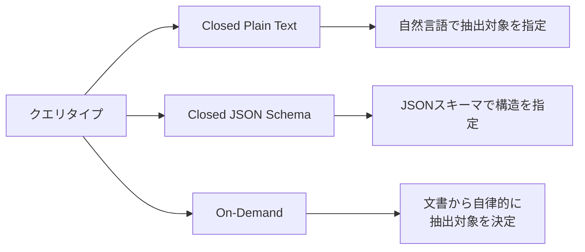
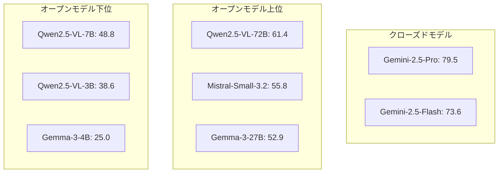
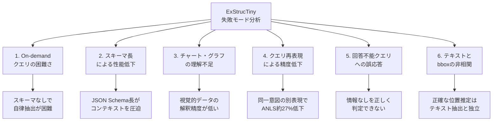

## 論文概要（Abstract）

ExStrucTinyは、J.P. Morgan AI Researchが提案した文書画像からのスキーマ可変構造化情報抽出（Schema-Variable Structured Information Extraction）を評価するためのベンチマークである。304のQAペアと110のマルチページ文書を含み、フォーム・財務レポート・スライド・Webスクリーンショットの4種類の文書タイプにわたって12のVision-Language Model（VLM）を評価している。著者らは、クローズドモデル（Gemini-2.5シリーズ）とオープンモデル間で平均ANLSに18ポイント以上の差があることを報告しており、現行のVLMが実務レベルの構造化抽出にはまだ課題を残していることを明らかにしている。

この記事は [Zenn記事: Claude Opus 4.7のVisionで帳票OCRパイプラインを構築する実践ガイド](https://zenn.dev/0h_n0/articles/cf6a2a6d3a7abc) の深掘りです。

## 情報源

- **arXiv ID**: 2602.12203
- **URL**: [https://arxiv.org/abs/2602.12203](https://arxiv.org/abs/2602.12203)
- **著者**: Mathieu Sibue, Andres Munoz Garza, Samuel Mensah et al.（J.P. Morgan AI Research）
- **発表年**: 2026年
- **分野**: cs.CV, cs.AI

## 背景と動機（Background & Motivation）

文書画像からの構造化情報抽出は、金融・保険・法務など多くの業界で不可欠なタスクである。請求書の項目読み取り、契約書からの条項抽出、財務レポートの数値テーブル解析など、多様な文書を対象に構造化データを自動生成する需要は年々増加している。

従来のベンチマーク（CORD、FUNSD、VRDU等）は固定エンティティスキーマを前提としており、事前に定義されたフィールド名に対して値を抽出するタスク設計であった。しかし、実務ではクライアントや業務ごとに抽出対象のスキーマが異なるため、「スキーマ可変」（schema-variable）な抽出能力の評価が求められる。既存ベンチマークではこの観点が十分にカバーされておらず、汎用VLMがどの程度スキーマ可変な構造化抽出に対応できるかは未解明であった。

また、GPT-4V、Geminiなどの大規模VLMが文書理解タスクに適用されるようになり、従来のOCR+NLPパイプラインからエンドツーエンドのVLMベースアプローチへの移行が進んでいる。このパラダイムシフトにおいて、VLMの構造化抽出能力を体系的に評価する新しいベンチマークの必要性が高まっていた。

## 主要な貢献（Key Contributions）

- **貢献1**: スキーマ可変な構造化情報抽出を評価する初のベンチマーク「ExStrucTiny」の構築。304のQAペア、110のマルチページ文書、4つの文書タイプ（フォーム、財務レポート、スライド、Webスクリーンショット）を含む
- **貢献2**: 3種類のクエリタイプ（closed plain text、closed JSON schema、on-demand）を設計し、スキーマ指定方法がVLMの性能に与える影響を体系的に分析
- **貢献3**: 12のVLM（オープン10モデル、クローズド2モデル）を統一条件下で評価し、クローズドモデルとオープンモデル間の18+ ANLSポイントの精度差や、バウンディングボックス予測の困難さなど、複数の失敗モードを特定

## 技術的詳細（Technical Details）

### ベンチマーク設計

ExStrucTinyのデータは以下の形式で構成されている。各サンプル $i$ に対して入力 ${\bf x}_i$ と出力 ${\bf y}_i$ のペアが定義される。

$$
({\bf x}_i, {\bf y}_i) \quad \text{where} \quad {\bf y}_i = s_i(\{t_{i,k}\}, \{p_{i,k}\}, \{b_{i,k}\})
$$

ここで、
- ${\bf x}_i$: 文書画像（マルチページ対応）
- ${\bf y}_i$: 構造化された出力
- $s_i$: 出力のスキーマ構造（文書ごとに異なる）
- $t_{i,k}$: $k$番目のエンティティのテキスト値
- $p_{i,k}$: $k$番目のエンティティが存在するページインデックス
- $b_{i,k}$: $k$番目のエンティティのバウンディングボックス座標

このフォーマリズムにより、単純なテキスト抽出だけでなく、空間的な位置情報（ページ番号、座標）の正確性も評価対象に含まれる。従来のベンチマークでは $s_i$ が全サンプルで共通（固定スキーマ）であったのに対し、ExStrucTinyでは $s_i$ がサンプルごとに異なる点が本質的な違いである。

### 3つのクエリタイプ

著者らは、スキーマの指定方法がVLMの性能に与える影響を調べるため、以下の3種類のクエリタイプを設計している。



1. **Closed Plain Text**: 抽出すべきエンティティを自然言語テキストで指示する。例えば「この請求書から会社名、日付、合計金額を抽出してください」のような形式。抽出対象が明示されているため、モデルは「何を抽出するか」の判断が不要
2. **Closed JSON Schema**: 抽出すべきエンティティをJSON Schema形式で指定する。フィールド名、型、必須/任意の区別を含む構造化された指示。出力形式が厳密に定義されるため、パース容易性が高い反面、スキーマ定義自体が長くなりトークン消費が増加する
3. **On-Demand**: 特定のスキーマを指示せず、文書から有用な情報を自律的に判断して抽出させる。最も実務に近いが、最も難易度が高いタイプ。モデルが「何を抽出すべきか」と「どう構造化するか」の両方を自律的に決定する必要がある

### 文書タイプの多様性

ベンチマークは4種類の文書タイプで構成されている。

| 文書タイプ | 特徴 | 主な課題 |
|-----------|------|---------|
| フォーム | 構造化されたレイアウト、キー・バリューペア | 対応付けの正確性、手書き文字の認識 |
| 財務レポート | テーブル・チャート混在、数値データ | 数値の正確な抽出、チャート内データの読み取り |
| スライド | 視覚的要素が豊富、自由レイアウト | テキストと図の関係性理解、階層構造の把握 |
| Webスクリーンショット | 複雑なCSS由来レイアウト | DOM構造なしでの情報抽出、広告・ナビゲーション除外 |

110文書のうちマルチページ文書が含まれており、ページ跨ぎの情報統合能力も評価対象となっている。

### 評価指標: ANLS

主要な評価指標としてAverage Normalized Levenshtein Similarity（ANLS）が採用されている。ANLSは予測テキストと正解テキスト間のレーベンシュタイン距離に基づく類似度であり、完全一致でなくとも部分的な正解を評価できるメリットがある。

$$
\text{ANLS}(p, g) = \begin{cases} 1 - \text{NL}(p, g) & \text{if } \text{NL}(p, g) < \tau \\ 0 & \text{otherwise} \end{cases}
$$

ここで、
- $p$: 予測テキスト
- $g$: 正解テキスト
- $\text{NL}(p, g)$: 正規化レーベンシュタイン距離（0から1の範囲）
- $\tau$: 閾値（一般的に0.5）

閾値 $\tau$ を超える距離の予測はスコア0として扱われるため、大きく外れた予測にはペナルティが課される。ANLSは0から1の範囲をとり、論文では100倍してパーセンテージ表記で報告されている。

バウンディングボックスの評価にはIoU（Intersection over Union）が使用されている。

$$
\text{IoU}(B_{\text{pred}}, B_{\text{gt}}) = \frac{|B_{\text{pred}} \cap B_{\text{gt}}|}{|B_{\text{pred}} \cup B_{\text{gt}}|}
$$

ここで $B_{\text{pred}}$ は予測バウンディングボックス、$B_{\text{gt}}$ は正解バウンディングボックスである。

### アルゴリズム: 評価パイプラインの概要

ExStrucTinyの評価パイプラインの構造を擬似コードで示す。

```python
from dataclasses import dataclass


@dataclass
class ExtractionResult:
    """構造化抽出の結果を表すデータクラス"""
    text_values: dict[str, str]
    page_indices: dict[str, int]
    bounding_boxes: dict[str, tuple[float, float, float, float]]


def evaluate_vlm(
    model: VLM,
    documents: list[Document],
    queries: list[Query],
    threshold: float = 0.5,
) -> dict[str, float]:
    """VLMの構造化抽出能力を評価する

    Args:
        model: 評価対象のVLM
        documents: 文書画像のリスト
        queries: クエリのリスト（3タイプ混在）
        threshold: ANLS計算の閾値

    Returns:
        クエリタイプ別・文書タイプ別のANLSスコア
    """
    results: dict[str, list[float]] = {}

    for doc, query in zip(documents, queries):
        # 3-shot prompting, temperature=0.2
        prediction = model.extract(
            images=doc.pages,
            query=query.text,
            num_shots=3,
            temperature=0.2,
        )

        # テキスト値のANLS計算
        anls = compute_anls(
            predicted=prediction.text_values,
            ground_truth=query.ground_truth.text_values,
            threshold=threshold,
        )

        # バウンディングボックスのIoU計算
        iou = compute_bbox_iou(
            predicted=prediction.bounding_boxes,
            ground_truth=query.ground_truth.bounding_boxes,
        )

        key = f"{query.query_type}_{doc.doc_type}"
        results.setdefault(key, []).append(anls)

    return {k: sum(v) / len(v) for k, v in results.items()}
```

このパイプラインでは、各文書に対してクエリを投げ、VLMの出力をパースした上でテキスト値のANLSとバウンディングボックスのIoUを計算する。3-shotプロンプティングとtemperature 0.2が全モデル共通の設定である。

## 実装のポイント（Implementation）

著者らが報告している実験設定から、実務での構造化抽出パイプライン構築に参考になるポイントを整理する。

**プロンプト設計**: 3-shot（3つの例示）でプロンプティングを行い、temperatureは0.2に設定されている。Few-shotの例示は抽出精度に大きく影響するため、対象文書タイプに近い例を選択することが重要である。著者らはクエリの再表現（リフレーズ）でANLSが約27%低下すると報告しており、プロンプトの文言が性能に直結する。

**推論インフラ**: オープンモデルの推論にはvLLMが使用され、4枚のNVIDIA L40S GPU上で実行されている。Qwen2.5-VL-72Bなどの大規模モデルではFP8量子化が適用されており、メモリ効率と推論速度のバランスが取られている。クローズドモデル（Gemini-2.5シリーズ）はAPIを通じて評価されている。

**JSON Schema指定の課題**: JSON Schemaでスキーマを指定するクエリタイプでは、スキーマ定義自体が長くなるため、プロンプトのトークン数が増大する。著者らは、スキーマの長さがモデルのコンテキストウィンドウを圧迫し、性能低下の一因となっていると分析している。実務でPydanticモデルをJSON Schemaにエクスポートしてプロンプトに含める場合、スキーマの簡略化やフィールドの分割投入が有効な対策となる。

**マルチページ対応**: 110文書中にマルチページ文書が含まれており、ページ跨ぎでの情報統合が必要となるケースがある。VLMへの入力として複数ページ画像を一括入力する方法と、ページごとに処理して後から統合する方法のどちらを採るかは設計上の重要な判断ポイントである。前者はコンテキスト長の制約を受け、後者はページ間の関係性を見落とすリスクがある。

**出力パースとバリデーション**: VLMの出力はJSON形式で返されることが期待されるが、実際にはフォーマット不備（閉じ括弧の欠落、不正なエスケープ、型の不一致等）が発生する。堅牢なパーサー実装や、Pydanticなどによる出力スキーマのバリデーションが実運用では不可欠である。Zenn記事で解説されているPydanticベースの帳票OCRパイプラインは、この課題に対する実践的な解決策を提供している。

## 実験結果（Results）

### モデル別総合性能

著者らが報告した12モデルのうち主要8モデルの平均ANLS（論文Table相当）を以下に示す。

| モデル | パラメータ規模 | 種別 | 平均 ANLS |
|--------|-------------|------|-----------|
| Gemma-3-4B | 4B | オープン | 25.0 |
| Qwen2.5-VL-3B | 3B | オープン | 38.6 |
| Qwen2.5-VL-7B | 7B | オープン | 48.8 |
| Gemma-3-27B | 27B | オープン | 52.9 |
| Mistral-Small-3.2-24B | 24B | オープン | 55.8 |
| Qwen2.5-VL-72B-FP8 | 72B | オープン | 61.4 |
| Gemini-2.5-Flash | 非公開 | クローズド | 73.6 |
| Gemini-2.5-Pro | 非公開 | クローズド | 79.5 |

最も高いANLSを記録したのはGemini-2.5-Proの79.5であり、オープンモデル最高のQwen2.5-VL-72Bの61.4と比較して18.1ポイントの差がある。著者らはこの差を、クローズドモデルの学習データ規模と品質、および推論時の最適化に起因すると分析している。

その他の評価対象モデルとして、Gemma-3-12B、Pixtral-12B、Kimi-VL-A3B-16B、Qwen2.5-VL-32Bも含まれている。

### オープンモデル vs クローズドモデルの性能差



クローズドモデルとオープンモデル間の差は18ポイント以上であり、特にon-demandクエリタイプや複雑なレイアウトの文書で差が拡大する傾向が著者らにより報告されている。パラメータ規模の影響も明確であり、同一アーキテクチャファミリー内ではモデルサイズとANLSに正の相関が見られる（例: Qwen2.5-VL-3B: 38.6 → 7B: 48.8 → 72B: 61.4）。

### バウンディングボックス予測の困難さ

バウンディングボックス予測のIoUは全モデルを通じて極めて低い値にとどまっている。最も高いGemini-2.5-Proでも14.4%であり、テキスト抽出能力と空間的位置推定能力の間に大きな乖離があることが示されている。

| 指標 | Gemini-2.5-Pro | オープンモデル |
|------|---------------|--------------|
| ANLS（テキスト） | 79.5 | 最大 61.4 |
| バウンディングボックス IoU | 14.4% | Gemini-2.5-Proよりさらに低い |
| エンティティリコール | 88.1% | 論文参照 |

著者らは、テキスト抽出の精度とバウンディングボックス予測の精度に相関がないことを報告している。VLMが「何が書いてあるか」は理解できても「どこに書いてあるか」の正確な推定は依然困難であるという結論である。この知見は、VLMベースのOCRパイプラインで位置情報が必要な場合、従来型のOCRエンジンとの併用が必要であることを示唆している。

### エンティティリコール

Gemini-2.5-Proのエンティティリコールは88.1%と報告されている。これはスキーマで指定されたエンティティのうち88.1%を正しく検出できていることを意味するが、残りの約12%は見落とされている。金融文書のように高精度が要求されるドメインでは、この見落とし率は許容できない場合がある。人間によるレビューループや、複数回の推論による多数決など、リコール向上のための追加施策が必要となる。

### 6つの失敗モード

著者らは実験を通じて以下の6つの主要な失敗モードを特定している。



1. **On-demandクエリの困難さ**: スキーマを指定しないon-demandクエリは3タイプ中最も低いANLSを記録した。モデルが文書から「何を抽出すべきか」を自律的に判断する能力は限定的であり、実務でスキーマレスな抽出を行う場合は精度低下を前提とした設計が必要である

2. **スキーマ長による性能低下**: JSON Schemaクエリではスキーマ定義が長くなり、モデルのコンテキストウィンドウを圧迫して性能が低下する。フィールド数が多い帳票では、スキーマを分割して複数回推論する戦略が考えられる

3. **チャート・グラフの理解不足**: 財務レポート内のチャートやグラフからの情報抽出は全モデルで精度が低い。棒グラフの数値読み取りや折れ線グラフのトレンド解釈など、視覚的データの定量的理解が課題として残る

4. **クエリ再表現による精度低下**: 同じ意図のクエリを異なる表現で問い合わせると、ANLSが約27%低下すると著者らは報告している。プロンプトの文言に対するモデルの脆弱性を示しており、プロダクション環境ではプロンプトのテンプレート化と検証が重要となる

5. **回答不能クエリへの対応**: 文書中に該当情報が存在しないクエリに対して、モデルが「回答不能」と正しく判定できず、誤った情報を生成してしまう（ハルシネーション）ケースが多い。この問題は金融・法務文書では特に深刻であり、存在しないフィールドに対して尤もらしい値を捏造するリスクがある

6. **テキスト抽出とバウンディングボックスの非相関**: 前述の通り、テキスト値を正しく抽出できてもその空間的位置を正確に予測できない。テキスト理解と空間理解が独立した能力であることを示唆している

## 実運用への応用（Practical Applications）

ExStrucTinyの知見は、VLMベースの帳票OCRパイプライン構築に直接的な示唆を与える。Zenn記事で解説されているClaude Opus 4.7のVisionを用いた帳票OCRパイプラインの設計においても、以下の点が重要である。

**スキーマ指定方式の選択**: 論文の結果から、Closed Plain Textクエリが最もバランスの良い性能を示している。JSON Schemaは構造化された出力を保証しやすいが、スキーマ長が性能に影響する。実運用では、Pydanticモデルで出力スキーマを定義しつつ、プロンプトでは自然言語で要約した指示を併記するハイブリッド戦略が有効と考えられる。Claude APIのtool_useやstructured outputsは、この課題に対するAPI側の解決策を提供している。

**精度保証戦略**: 最高性能のGemini-2.5-Proでも平均ANLS 79.5にとどまることから、単一モデル・単一推論の出力をそのまま信頼することはリスクが高い。人間によるレビューループ、複数回推論の多数決、信頼度スコアによるフィルタリングなど、多層的な品質保証が必要である。特にエンティティリコール88.1%（Gemini-2.5-Pro）は、重要フィールドの約12%が見落とされる可能性を意味する。

**バウンディングボックスの限界**: IoU 14.4%という結果は、VLMのバウンディングボックス予測を文書内の位置特定に使うことが現時点では非現実的であることを示している。位置情報が必要な場合（例: 帳票内の署名欄の特定、スタンプ位置の検出）は、Google Cloud Vision APIやAmazon Textractなどの従来型OCRエンジンとの併用が推奨される。

**コスト・レイテンシのトレードオフ**: オープンモデル（Qwen2.5-VL-72B、ANLS 61.4）とクローズドモデル（Gemini-2.5-Pro、ANLS 79.5）の差は18ポイントだが、自社GPUで推論可能なオープンモデルはAPIコストがかからない。文書タイプやビジネス要件に応じて、コストと精度のトレードオフを判断する必要がある。高精度が必須の金融帳票にはクローズドモデルAPI、大量の定型フォーム処理にはファインチューニング済みオープンモデルという使い分けが現実的な選択肢となる。

## 関連研究（Related Work）

- **CORD（Consolidated Receipt Dataset）**: Park et al.によるレシート画像からの情報抽出ベンチマーク。固定スキーマ（店名、日付、合計金額等の30エンティティ）を前提としており、ExStrucTinyが解決しようとするスキーマ可変性の課題は対象外である
- **FUNSD（Form Understanding in Noisy Scanned Documents）**: Jaumeらによるノイズのあるスキャン文書のフォーム理解ベンチマーク。エンティティのリンク関係（header-question-answer）を評価対象とするが、スキーマは固定されている。ExStrucTinyはスキーマ自体が動的に変化する設定を扱う点で異なる
- **VRDU（Visually Rich Document Understanding）**: Wangらが提案した視覚的にリッチな文書理解ベンチマーク。テンプレートベースの抽出に焦点を当てており、ExStrucTinyのon-demandクエリのような自律的抽出は評価対象外
- **DocVQA**: 文書画像に対する質問応答ベンチマーク。自然言語の質問に自然言語で回答する形式であり、構造化されたJSON出力の生成能力は直接評価していない。ExStrucTinyは構造化出力の正確性を評価する点で補完的な位置づけ
- **Qwen2.5-VL**: Alibabaが開発したVLMシリーズ。本論文ではオープンモデルの中で最も高いANLS（72Bモデルで61.4）を記録しており、文書理解タスクにおけるオープンモデルの代表格として評価されている

## まとめと今後の展望

ExStrucTinyは、VLMのスキーマ可変構造化情報抽出能力を体系的に評価する初のベンチマークとして、重要な貢献を果たしている。著者らの主要な知見は以下の通りである。

- クローズドモデル（Gemini-2.5-Pro、ANLS 79.5）とオープンモデル（Qwen2.5-VL-72B、ANLS 61.4）の間に18.1ポイントの性能差が存在する
- バウンディングボックス予測は全モデルで困難であり、最高IoUはGemini-2.5-Proの14.4%にとどまる
- on-demandクエリ、クエリ再表現（約27%のANLS低下）、回答不能クエリへの誤応答など、実運用で直面する失敗モードが体系的に特定された

実務的には、VLMベースの文書抽出パイプラインを構築する際に、スキーマ指定方式の選択（plain text vs JSON Schema）、精度保証のための多層的な品質管理、位置情報が必要な場合の従来型OCRとの併用といった設計判断に本論文の知見が直接活用できる。

今後の研究方向として、著者らはオープンモデルとクローズドモデルの性能差を埋めるためのファインチューニング手法の探索、バウンディングボックス予測精度の改善、より多様な文書タイプ（手書き文書、多言語文書等）への拡張を挙げている。データセットは現時点ではJ.P. Morganへの申請により利用可能となっている。

## 参考文献

- **arXiv**: [https://arxiv.org/abs/2602.12203](https://arxiv.org/abs/2602.12203)
- **Related Zenn article**: [https://zenn.dev/0h_n0/articles/cf6a2a6d3a7abc](https://zenn.dev/0h_n0/articles/cf6a2a6d3a7abc)
