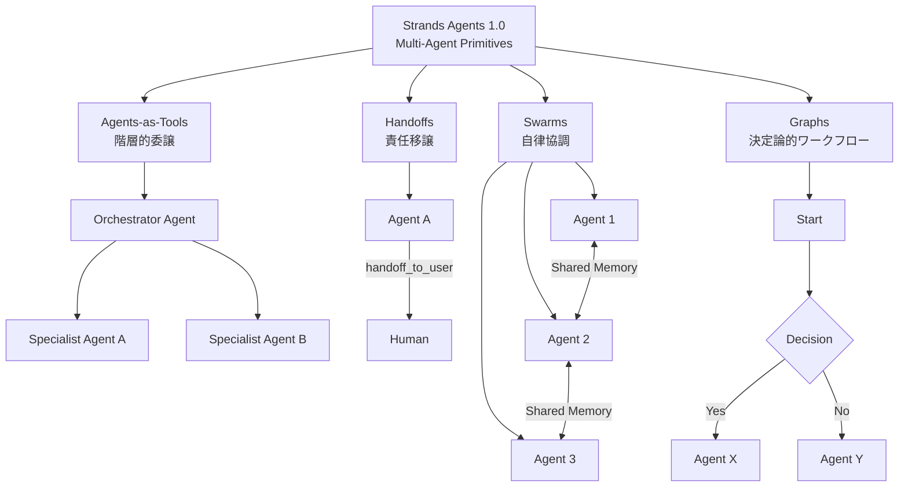

本記事は [Introducing Strands Agents 1.0: Production-Ready Multi-Agent Orchestration Made Simple](https://aws.amazon.com/blogs/opensource/introducing-strands-agents-1-0-production-ready-multi-agent-orchestration-made-simple/)（AWS Open Source Blog, 2025年7月15日）の解説記事です。

## ブログ概要（Summary）

Strands Agents SDKは、AWSがApache-2.0ライセンスで公開しているオープンソースのAIエージェントフレームワークです。2025年5月のプレビューリリース以降、GitHub上で2,000以上のスター、PyPIで150,000回以上のダウンロードを記録し、マージされたPRの22%がコミュニティからの貢献であるとAWSチームは報告しています。1.0では、マルチエージェントオーケストレーションのための4つのプリミティブ（Agents-as-Tools、Handoffs、Swarms、Graphs）、セッション永続化のためのSessionManager、Agent-to-Agent（A2A）プロトコル対応が追加されました。非同期アーキテクチャの全面採用により、ストリーミングレスポンスやキャンセルサポートも提供されています。

この記事は [Zenn記事: Bedrock AgentCoreで社内問い合わせエージェントを構築しメモリ永続化で精度向上](https://zenn.dev/0h_n0/articles/b7cddc45f56f1a) の深掘りです。Zenn記事ではBedrock AgentCoreのMemory機能を使ったセッション永続化を扱っていますが、Strands Agents 1.0のSessionManagerも同様のセッション永続化機能をOSSレベルで実現しています。両者の設計思想の比較を通じて、エージェントのメモリ管理アーキテクチャの理解を深められます。

## 情報源

- **種別**: 企業テックブログ（AWS Open Source Blog）
- **URL**: [https://aws.amazon.com/blogs/opensource/introducing-strands-agents-1-0-production-ready-multi-agent-orchestration-made-simple/](https://aws.amazon.com/blogs/opensource/introducing-strands-agents-1-0-production-ready-multi-agent-orchestration-made-simple/)
- **組織**: Amazon Web Services
- **発表日**: 2025年7月15日
- **著者**: Ryan Coleman（Product Manager, AI developer tools）, Belle Guttman（Agentic AI Engineering teams lead）

## 技術的背景（Technical Background）

AIエージェントフレームワークは、単一エージェントによるツール呼び出しから、複数エージェントが協調して複雑なタスクを遂行するマルチエージェントシステムへと進化しています。この進化に伴い、以下の課題が顕在化しています。

**オーケストレーションの複雑性**: 複数エージェント間の制御フロー管理が困難です。階層的な委譲、責任の移譲、自律的な協調、決定論的なワークフローなど、異なるパターンが要求される場面ごとに適切な制御戦略を選択する必要があります。

**セッション状態管理**: エージェントが長時間のタスクを処理する場合、会話コンテキストの永続化と復元が不可欠です。特にプロダクション環境では、サーバー再起動やスケールイン/アウトに伴う状態消失への対策が求められます。これはZenn記事で取り上げたBedrock AgentCoreのMemory永続化と同一の課題領域です。

**相互運用性**: 異なるフレームワークで構築されたエージェント同士が通信する標準プロトコルが未確立でした。Google主導のA2A（Agent-to-Agent）プロトコルがこの課題に対するオープン標準として登場し、Strands Agents 1.0はこれをネイティブサポートしています。

**モデルプロバイダーの多様化**: Bedrock、Anthropic、OpenAI、Cohere、Meta Llama、Mistral、Stability、Writer、LiteLLMなど多数のモデルプロバイダーが存在し、アプリケーションレベルでのプロバイダー切り替えが容易でなければプロダクション運用に支障をきたします。

## 実装アーキテクチャ（Architecture）

### 4つのマルチエージェントプリミティブ

Strands Agents 1.0の設計の核は、マルチエージェントオーケストレーションを4つの基本パターン（プリミティブ）に分解し、それぞれを独立したAPIとして提供している点です。



#### 1. Agents-as-Tools: 階層的委譲パターン

専門化されたエージェントをツールとしてオーケストレーターエージェントに登録するパターンです。オーケストレーターが全体のタスク分解を担い、各サブタスクを適切な専門エージェントに委譲します。

```python
from strands import Agent
from strands.multiagent.agents_as_tools import AgentTool


def create_research_orchestrator() -> Agent:
    """リサーチオーケストレーターを構築する。

    専門エージェントをツールとして登録し、
    オーケストレーターが適切なエージェントに委譲する。

    Returns:
        オーケストレーターAgent
    """
    # 専門エージェントの定義
    paper_agent: Agent = Agent(
        system_prompt="あなたは学術論文検索の専門家です。arXivとSemantic Scholarを使って論文を検索・要約します。",
        tools=[arxiv_search, semantic_scholar_search],
    )

    code_agent: Agent = Agent(
        system_prompt="あなたはコードレビューの専門家です。GitHubリポジトリのコードを分析します。",
        tools=[github_search, code_analyzer],
    )

    # AgentToolでラップしてオーケストレーターに登録
    orchestrator: Agent = Agent(
        system_prompt="あなたはリサーチマネージャーです。ユーザーの調査依頼を分析し、適切な専門エージェントに委譲してください。",
        tools=[
            AgentTool(
                agent=paper_agent,
                name="paper_researcher",
                description="学術論文の検索と要約を行う",
            ),
            AgentTool(
                agent=code_agent,
                name="code_reviewer",
                description="コードリポジトリの分析を行う",
            ),
        ],
    )

    return orchestrator
```

このパターンの利点は、各エージェントのシステムプロンプトとツールセットを独立して管理できることです。オーケストレーターは`AgentTool`のname/descriptionのみを参照して委譲先を決定するため、各専門エージェントの内部実装が隠蔽されます。

#### 2. Handoffs: 明示的な責任移譲

エージェントから人間への責任移譲を明示的に行うパターンです。会話コンテキストを保持したまま制御を移譲する`handoff_to_user`ツールが組み込みで提供されています。

```python
from strands import Agent


def create_support_agent() -> Agent:
    """サポートエージェントを構築する。

    自動対応が困難な場合にhandoff_to_userで
    人間オペレーターに会話コンテキストごと引き継ぐ。

    Returns:
        サポートAgent
    """
    agent: Agent = Agent(
        system_prompt=(
            "あなたはカスタマーサポートエージェントです。"
            "FAQ回答と基本的なトラブルシューティングを行います。"
            "解決できない場合はhandoff_to_userツールで"
            "人間のオペレーターに引き継いでください。"
        ),
        tools=[faq_search, ticket_lookup, handoff_to_user],
    )

    return agent
```

AWSチームは、このHandoffsパターンが「Human-in-the-Loop」の実装を簡潔にすると説明しています。従来は会話履歴の受け渡しとエスカレーション判定のロジックを自前で実装する必要がありましたが、`handoff_to_user`が会話コンテキスト全体を保持したまま制御を移譲します。

#### 3. Swarms: 自律的なエージェントチーム

複数のエージェントが共有メモリを介して動的に自己組織化し、タスクを協調して遂行するパターンです。各エージェントは他のエージェントの出力を参照しながら自律的に動作します。

```python
from strands import Agent
from strands.multiagent.swarm import Swarm


def create_analysis_swarm() -> Swarm:
    """分析スウォームを構築する。

    複数のアナリストエージェントが共有メモリを通じて
    協調しながら多角的な分析を行う。

    Returns:
        分析Swarm
    """
    market_analyst: Agent = Agent(
        system_prompt="市場動向を分析し、トレンドレポートを作成してください。",
        tools=[market_data_api],
    )

    tech_analyst: Agent = Agent(
        system_prompt="技術トレンドを分析し、技術選定の推奨を作成してください。",
        tools=[github_trending, stackoverflow_api],
    )

    risk_analyst: Agent = Agent(
        system_prompt="市場分析と技術分析の結果を踏まえ、リスク評価を作成してください。",
        tools=[risk_assessment_tool],
    )

    swarm: Swarm = Swarm(
        agents=[market_analyst, tech_analyst, risk_analyst],
        shared_memory=True,
    )

    return swarm
```

Swarmsパターンでは、各エージェントが共有メモリに書き込んだ中間結果を他のエージェントが参照できます。これにより、事前にタスク分解を行わなくても、エージェント間の自律的な情報共有と役割分担が実現されます。

#### 4. Graphs: 決定論的ワークフロー制御

条件分岐やループを含む決定論的なワークフローを定義するパターンです。エージェントの実行順序を明示的に制御でき、条件に応じたルーティングやデシジョンポイントを設けられます。

```python
from strands.multiagent.graph import Graph, GraphNode, GraphEdge


def create_review_pipeline() -> Graph:
    """記事レビューパイプラインを構築する。

    入力検証→レビュー→判定→承認/修正の
    決定論的ワークフローを定義する。

    Returns:
        レビューパイプラインGraph
    """
    # ノード定義（各ノードにエージェントを割り当て）
    validator_node = GraphNode(
        name="validator",
        agent=Agent(
            system_prompt="記事のフォーマットと文字数を検証してください。",
            tools=[format_checker],
        ),
    )

    reviewer_node = GraphNode(
        name="reviewer",
        agent=Agent(
            system_prompt="記事の技術的正確性をレビューしてください。",
            tools=[fact_checker, code_executor],
        ),
    )

    approver_node = GraphNode(
        name="approver",
        agent=Agent(
            system_prompt="レビュー結果に基づき承認判定を行ってください。",
        ),
    )

    fixer_node = GraphNode(
        name="fixer",
        agent=Agent(
            system_prompt="指摘事項に基づき記事を修正してください。",
            tools=[text_editor],
        ),
    )

    # エッジ定義（条件付きルーティング）
    graph: Graph = Graph(
        nodes=[validator_node, reviewer_node, approver_node, fixer_node],
        edges=[
            GraphEdge(source="validator", target="reviewer"),
            GraphEdge(
                source="reviewer",
                target="approver",
                condition=lambda result: result.get("issues_found", 0) == 0,
            ),
            GraphEdge(
                source="reviewer",
                target="fixer",
                condition=lambda result: result.get("issues_found", 0) > 0,
            ),
            GraphEdge(source="fixer", target="reviewer"),  # 修正後に再レビュー
        ],
        entry_point="validator",
    )

    return graph
```

Graphsパターンは、LangGraphのStateGraphと概念的に類似しています。ただしAWSチームは、Strands AgentsのGraphsは「他の3つのプリミティブと組み合わせて使える」点を強調しています。例えば、Graphの各ノードにSwarmsを配置したり、特定のノードでHandoffsを発動させるといった構成が可能です。

### 4つのプリミティブの使い分け

| プリミティブ | ユースケース | 制御フロー | 状態共有 |
|-------------|-------------|-----------|---------|
| Agents-as-Tools | タスク分解・委譲 | 階層的（トップダウン） | オーケストレーター経由 |
| Handoffs | Human-in-the-Loop | 明示的移譲 | 会話コンテキスト引き継ぎ |
| Swarms | 多角的分析・協調 | 自律的（ボトムアップ） | 共有メモリ |
| Graphs | 承認フロー・パイプライン | 決定論的（条件分岐） | ノード間受け渡し |

## SessionManagerとメモリ永続化

### セッション状態の自動永続化

Strands Agents 1.0のSessionManagerは、エージェントの会話状態をS3やファイルシステムに自動で永続化・復元する機構です。

```python
from strands import Agent, SessionManager
from strands.session import S3SessionManager, FileSessionManager


def create_persistent_agent(
    agent_id: str,
    session_id: str,
    bucket_name: str = "my-agent-sessions",
) -> Agent:
    """セッション永続化対応エージェントを構築する。

    S3にセッション状態を自動保存し、
    再起動後も会話コンテキストを復元する。

    Args:
        agent_id: エージェントの一意識別子
        session_id: セッションの一意識別子
        bucket_name: S3バケット名

    Returns:
        セッション永続化対応Agent
    """
    session_manager: SessionManager = S3SessionManager(
        bucket_name=bucket_name,
        agent_id=agent_id,
        session_id=session_id,
    )

    agent: Agent = Agent(
        system_prompt="あなたは社内問い合わせ対応エージェントです。",
        tools=[knowledge_base_search, ticket_create],
        session_manager=session_manager,
    )

    return agent
```

SessionManagerの主な特長として、AWSチームは以下を挙げています。

- **一意のエージェントID**: 各エージェントインスタンスに固有のIDが割り当てられ、複数のエージェントが同一のバックエンドストレージを共有できる
- **並行エージェント処理**: 複数のエージェントが同時にセッションを読み書きしてもデータの整合性が保たれる
- **デプロイメント間の状態復元**: サーバー再起動やコンテナの入れ替え後も、session_idを指定するだけで以前の会話コンテキストが復元される

### Bedrock AgentCore MemorySessionManagerとの関係

Zenn記事で解説しているBedrock AgentCoreのMemory機能とStrands AgentsのSessionManagerは、同じ課題（セッション状態の永続化）に異なるレイヤーで対応しています。

| 観点 | Strands Agents SessionManager | Bedrock AgentCore Memory |
|------|-------------------------------|--------------------------|
| レイヤー | アプリケーション（SDK内蔵） | マネージドサービス |
| バックエンド | S3 / ファイルシステム | AgentCore管理のストア |
| 管理責任 | 開発者 | AWS |
| カスタマイズ性 | バックエンド実装を差し替え可能 | APIパラメータで設定 |
| コスト | S3ストレージ料金のみ | AgentCoreの料金体系に含まれる |
| 可用性・耐久性 | S3のSLA（99.999999999%耐久性） | AgentCoreのSLA |

Strands Agents SDKにはBedrock AgentCoreのMemoryと連携する`AgentCoreMemorySessionManager`も用意されており、OSSのSessionManager APIを通じてマネージドなメモリサービスを利用できます。これにより、開発時はFileSessionManagerでローカルテストを行い、本番環境ではAgentCoreMemorySessionManagerに切り替えるという運用が可能です。

## A2Aプロトコル対応

### Agent-to-Agentオープン標準

A2A（Agent-to-Agent）プロトコルは、異なるフレームワークで構築されたエージェント同士がネットワーク越しに通信するためのオープン標準です。Strands Agents 1.0では、`A2AServer`クラスによってエージェントをネットワークアクセス可能なサービスとして公開できます。

```python
from strands import Agent
from strands.a2a import A2AServer


def deploy_a2a_agent(host: str = "0.0.0.0", port: int = 8080) -> None:
    """エージェントをA2Aサーバーとしてデプロイする。

    Agent Cardが自動生成され、他のA2A対応エージェントや
    クライアントから発見・呼び出し可能になる。

    Args:
        host: バインドするホスト名
        port: リッスンするポート番号
    """
    agent: Agent = Agent(
        system_prompt="あなたはデータ分析エージェントです。",
        tools=[sql_query, chart_generator],
    )

    server: A2AServer = A2AServer(
        agent=agent,
        host=host,
        port=port,
    )

    # Agent Cardが自動生成される
    # GET /.well-known/agent.json でアクセス可能
    server.serve()
```

**Agent Card**: A2Aプロトコルでは、各エージェントが自身の能力を記述したメタデータ（Agent Card）を`/.well-known/agent.json`エンドポイントで公開します。Strands AgentsのA2AServerは、エージェントのシステムプロンプトとツール定義からAgent Cardを自動生成します。これにより、クライアントやオーケストレーターエージェントが利用可能なエージェントを動的に発見し、適切なエージェントにタスクを委譲できます。

### マイクロサービスとしてのエージェント

A2A対応により、各エージェントを独立したマイクロサービスとしてデプロイできます。

```mermaid
graph LR
    Client[Client / Orchestrator]
    Client -->|A2A Protocol| A[Data Agent<br>:8080]
    Client -->|A2A Protocol| B[Search Agent<br>:8081]
    Client -->|A2A Protocol| C[Code Agent<br>:8082]

    A -->|Agent Card| AC[/.well-known/agent.json]
    B -->|Agent Card| BC[/.well-known/agent.json]
    C -->|Agent Card| CC[/.well-known/agent.json]
```

この設計は、従来のマイクロサービスアーキテクチャの知見をエージェントシステムに適用するものです。各エージェントが独立してスケーリング・デプロイ可能であり、障害の影響範囲も個別のサービスに限定されます。

## Production Deployment Guide

### AWS実装パターン（コスト最適化重視）

Strands Agents 1.0をAWS上にデプロイする場合のトラフィック量別推奨構成を示します。コスト試算は2026年5月時点のap-northeast-1（東京）リージョンの料金に基づく概算値です。実際のコストはトラフィックパターンやバースト使用量により変動するため、最新料金はAWS料金計算ツールで確認してください。

| 構成 | トラフィック | 主要サービス | 月額概算 |
|------|-------------|-------------|---------|
| **Small** | ~100 req/日 | Lambda + S3 + Bedrock | $50-150 |
| **Medium** | ~1,000 req/日 | ECS Fargate + S3 + Bedrock | $300-800 |
| **Large** | 10,000+ req/日 | EKS + AgentCore Runtime + S3 | $2,000-5,000 |

**Small構成の内訳**: Lambda（128MB, ~3,000回/月）$5-10、S3（SessionManager用, ~1GB）$1未満、Bedrock（Claude Sonnet, ~100K tokens/日）$30-120、CloudWatch Logs $5。

**Medium構成の内訳**: ECS Fargate（0.5 vCPU, 1GB RAM, 常時1タスク）$30-50、S3 $1-5、Bedrock $150-600、ALB $20-30、CloudWatch $10-20。

**Large構成の内訳**: EKS コントロールプレーン $75、EC2ワーカー（Spot m5.xlarge x3）$150-300、S3 $5-20、Bedrock $1,500-4,000、ALB + WAF $50-100。

**コスト削減テクニック**:
- **Spot Instances活用**: EKSワーカーノードをSpotで運用し、最大90%のコスト削減
- **Bedrock Batch API**: 非リアルタイム処理にBatch APIを使用し、50%のコスト削減
- **Prompt Caching**: Bedrock Prompt Cachingを有効化し、繰り返しの多いシステムプロンプトで30-90%のトークンコスト削減
- **モデル選択ロジック**: 単純なFAQ回答にはHaiku、複雑な推論にはSonnetを使い分け

### Terraformインフラコード

#### Small構成（Serverless）

```hcl
# Small構成: Lambda + S3 + Bedrock
# 月額$50-150（~100 req/日想定）

terraform {
  required_version = ">= 1.9.0"
  required_providers {
    aws = {
      source  = "hashicorp/aws"
      version = "~> 5.80"
    }
  }
}

provider "aws" {
  region = "ap-northeast-1"
}

# SessionManager用S3バケット（KMS暗号化）
resource "aws_s3_bucket" "agent_sessions" {
  bucket = "strands-agent-sessions-${data.aws_caller_identity.current.account_id}"
}

resource "aws_s3_bucket_server_side_encryption_configuration" "agent_sessions" {
  bucket = aws_s3_bucket.agent_sessions.id
  rule {
    apply_server_side_encryption_by_default {
      sse_algorithm = "aws:kms"
    }
  }
}

resource "aws_s3_bucket_public_access_block" "agent_sessions" {
  bucket                  = aws_s3_bucket.agent_sessions.id
  block_public_acls       = true
  block_public_policy     = true
  ignore_public_acls      = true
  restrict_public_buckets = true
}

data "aws_caller_identity" "current" {}

# Lambda用IAMロール（最小権限）
resource "aws_iam_role" "agent_lambda" {
  name = "strands-agent-lambda-role"

  assume_role_policy = jsonencode({
    Version = "2012-10-17"
    Statement = [{
      Action = "sts:AssumeRole"
      Effect = "Allow"
      Principal = { Service = "lambda.amazonaws.com" }
    }]
  })
}

resource "aws_iam_role_policy" "agent_lambda" {
  name = "strands-agent-lambda-policy"
  role = aws_iam_role.agent_lambda.id

  policy = jsonencode({
    Version = "2012-10-17"
    Statement = [
      {
        Effect   = "Allow"
        Action   = ["bedrock:InvokeModel", "bedrock:InvokeModelWithResponseStream"]
        Resource = "arn:aws:bedrock:ap-northeast-1::foundation-model/anthropic.*"
      },
      {
        Effect   = "Allow"
        Action   = ["s3:GetObject", "s3:PutObject"]
        Resource = "${aws_s3_bucket.agent_sessions.arn}/*"
      },
      {
        Effect   = "Allow"
        Action   = ["logs:CreateLogGroup", "logs:CreateLogStream", "logs:PutLogEvents"]
        Resource = "arn:aws:logs:ap-northeast-1:*:*"
      }
    ]
  })
}

# Lambda関数
resource "aws_lambda_function" "agent" {
  function_name = "strands-agent"
  role          = aws_iam_role.agent_lambda.arn
  handler       = "handler.lambda_handler"
  runtime       = "python3.13"
  timeout       = 300  # エージェント処理は長時間化しやすい
  memory_size   = 512  # Strands SDK + 依存関係に十分なメモリ

  environment {
    variables = {
      SESSION_BUCKET = aws_s3_bucket.agent_sessions.id
      MODEL_ID       = "anthropic.claude-sonnet-4-20250514"
    }
  }

  filename = "lambda_package.zip"
}

# CloudWatchアラーム（コスト監視）
resource "aws_cloudwatch_metric_alarm" "lambda_duration" {
  alarm_name          = "strands-agent-high-duration"
  comparison_operator = "GreaterThanThreshold"
  evaluation_periods  = 3
  metric_name         = "Duration"
  namespace           = "AWS/Lambda"
  period              = 300
  statistic           = "Average"
  threshold           = 60000  # 60秒超過でアラート
  alarm_actions       = []     # SNSトピックARNを設定

  dimensions = {
    FunctionName = aws_lambda_function.agent.function_name
  }
}
```

#### Large構成（Container）

```hcl
# Large構成: EKS + Karpenter + Spot Instances
# 月額$2,000-5,000（10,000+ req/日想定）

module "eks" {
  source  = "terraform-aws-modules/eks/aws"
  version = "~> 20.31"

  cluster_name    = "strands-agents-cluster"
  cluster_version = "1.32"

  vpc_id     = module.vpc.vpc_id
  subnet_ids = module.vpc.private_subnets

  # パブリックアクセス最小化
  cluster_endpoint_public_access  = true
  cluster_endpoint_private_access = true

  eks_managed_node_groups = {
    system = {
      instance_types = ["m7i.large"]
      min_size       = 2
      max_size       = 3
      desired_size   = 2
      capacity_type  = "ON_DEMAND"  # システムノードはOn-Demand
    }
  }
}

# Karpenter Provisioner（Spot優先で90%コスト削減）
resource "kubectl_manifest" "karpenter_node_pool" {
  yaml_body = yamlencode({
    apiVersion = "karpenter.sh/v1"
    kind       = "NodePool"
    metadata   = { name = "strands-agents" }
    spec = {
      template = {
        spec = {
          requirements = [
            { key = "karpenter.sh/capacity-type", operator = "In", values = ["spot", "on-demand"] },
            { key = "node.kubernetes.io/instance-type", operator = "In", values = ["m5.xlarge", "m5.2xlarge", "m6i.xlarge", "m6i.2xlarge"] },
          ]
          nodeClassRef = { name = "default" }
        }
      }
      limits   = { cpu = "100", memory = "400Gi" }
      disruption = {
        consolidationPolicy = "WhenEmptyOrUnderutilized"
        consolidateAfter    = "30s"
      }
    }
  })
}

# Secrets Manager（Bedrock設定）
resource "aws_secretsmanager_secret" "agent_config" {
  name       = "strands-agents/config"
  kms_key_id = aws_kms_key.agent.arn
}

# AWS Budgets（予算アラート）
resource "aws_budgets_budget" "agent_monthly" {
  name         = "strands-agents-monthly"
  budget_type  = "COST"
  limit_amount = "5000"
  limit_unit   = "USD"
  time_unit    = "MONTHLY"

  notification {
    comparison_operator       = "GREATER_THAN"
    threshold                 = 80
    threshold_type            = "PERCENTAGE"
    notification_type         = "ACTUAL"
    subscriber_email_addresses = ["ops-team@example.com"]
  }
}
```

### 運用・監視設定

**CloudWatch Logs Insightsクエリ（コスト異常検知）**:

```
fields @timestamp, @message
| filter @message like /tokens/
| stats sum(input_tokens) as total_input, sum(output_tokens) as total_output by bin(1h)
| sort @timestamp desc
| limit 24
```

**CloudWatchアラーム設定（Python）**:

```python
import boto3


def create_bedrock_usage_alarm(
    topic_arn: str,
    threshold: float = 100000.0,
) -> dict:
    """Bedrockトークン使用量のスパイク検知アラームを作成する。

    Args:
        topic_arn: 通知先SNSトピックのARN
        threshold: 1時間あたりのトークン使用量閾値

    Returns:
        作成されたアラームの情報
    """
    cw = boto3.client("cloudwatch", region_name="ap-northeast-1")

    response: dict = cw.put_metric_alarm(
        AlarmName="strands-bedrock-token-spike",
        MetricName="InputTokenCount",
        Namespace="AWS/Bedrock",
        Statistic="Sum",
        Period=3600,
        EvaluationPeriods=1,
        Threshold=threshold,
        ComparisonOperator="GreaterThanThreshold",
        AlarmActions=[topic_arn],
    )

    return response
```

**X-Rayトレーシング設定（Python）**:

```python
from aws_xray_sdk.core import xray_recorder, patch_all


def configure_xray_tracing(service_name: str = "strands-agent") -> None:
    """X-Rayトレーシングを設定する。

    boto3を自動計装し、Bedrock呼び出しの
    レイテンシとエラーを可視化する。

    Args:
        service_name: X-Rayで表示されるサービス名
    """
    xray_recorder.configure(service=service_name)
    patch_all()  # boto3, requests等を自動計装
```

**Cost Explorer日次レポート（Python）**:

```python
import boto3
from datetime import date, timedelta


def get_daily_cost_report() -> dict[str, float]:
    """直近1日のサービス別コストを取得する。

    Bedrock、Lambda、EKSのコストを抽出し、
    $100/日を超過した場合はSNS通知を推奨する。

    Returns:
        サービス名をキー、コスト（USD）を値とする辞書
    """
    ce = boto3.client("ce", region_name="us-east-1")

    today: str = date.today().isoformat()
    yesterday: str = (date.today() - timedelta(days=1)).isoformat()

    response: dict = ce.get_cost_and_usage(
        TimePeriod={"Start": yesterday, "End": today},
        Granularity="DAILY",
        Metrics=["UnblendedCost"],
        GroupBy=[{"Type": "DIMENSION", "Key": "SERVICE"}],
    )

    costs: dict[str, float] = {}
    for group in response["ResultsByTime"][0]["Groups"]:
        service: str = group["Keys"][0]
        amount: float = float(group["Metrics"]["UnblendedCost"]["Amount"])
        if amount > 0:
            costs[service] = round(amount, 2)

    return costs
```

### コスト最適化チェックリスト

**アーキテクチャ選択**:
- [ ] トラフィック量に応じた構成を選択（~100 req/日: Serverless、~1,000 req/日: Hybrid、10,000+ req/日: Container）
- [ ] マルチエージェントの通信パターンに合わせたネットワーク設計（同一VPC内通信 vs A2Aクロスサービス通信）

**リソース最適化**:
- [ ] EC2/EKSワーカーノードはSpot Instances優先（最大90%削減）
- [ ] 安定稼働が必要なシステムノードはReserved Instances（1年コミットで最大72%削減）
- [ ] Savings Plans検討（Compute Savings Plansで柔軟な割引）
- [ ] Lambda: Power Tuningでメモリサイズを最適化
- [ ] ECS/EKS: Karpenterで未使用ノードを自動スケールダウン

**LLMコスト削減**:
- [ ] Bedrock Batch APIを非リアルタイム処理に使用（50%削減）
- [ ] Prompt Cachingを有効化（システムプロンプトの繰り返しで30-90%削減）
- [ ] モデル選択ロジック実装（簡単なタスクにHaiku、複雑なタスクにSonnet）
- [ ] max_tokensで出力トークン数を制限
- [ ] 不要なツール定義を削除してプロンプト長を短縮

**監視・アラート**:
- [ ] AWS Budgets設定（月額上限の80%で通知）
- [ ] CloudWatchアラーム（Bedrockトークンスパイク、Lambda Duration異常）
- [ ] Cost Anomaly Detection有効化
- [ ] 日次コストレポートの自動配信（SNS経由）

**リソース管理**:
- [ ] 未使用のS3セッションデータにライフサイクルポリシー設定（90日で削除/Glacier移行）
- [ ] コストタグ戦略（Environment, Team, Agentタグ必須）
- [ ] CloudWatch Logsの保持期間設定（30日 or 90日）
- [ ] 開発環境の夜間・休日自動停止
- [ ] ECRイメージのライフサイクルポリシー（未使用イメージ削除）

## パフォーマンス最適化（Performance）

### 非同期アーキテクチャ

Strands Agents 1.0は非同期処理を全面的に採用しています。`stream_async`メソッドによるノンブロッキングなストリーミングレスポンス、ツール実行の非同期化、キャンセルサポートが提供されています。

```python
import asyncio
from strands import Agent


async def stream_agent_response(agent: Agent, prompt: str) -> str:
    """エージェントのレスポンスを非同期ストリーミングで取得する。

    stream_asyncによりチャンク単位でレスポンスが返され、
    ユーザーへの体感レイテンシが大幅に短縮される。

    Args:
        agent: Strands Agent
        prompt: ユーザーのプロンプト

    Returns:
        完全なレスポンステキスト
    """
    chunks: list[str] = []

    async for chunk in agent.stream_async(prompt):
        chunks.append(chunk.text)
        # ストリーミング中にUIへリアルタイム表示可能

    return "".join(chunks)
```

**パフォーマンス観点でのモデルプロバイダー選択**:

AWSチームは、Strands Agentsが以下のモデルプロバイダーをサポートしていると説明しています。

| プロバイダー | レイテンシ特性 | コスト傾向 | 適用シーン |
|-------------|-------------|-----------|-----------|
| Amazon Bedrock | 東京リージョン低遅延 | 従量課金 | AWS統合環境 |
| Anthropic Direct | Bedrock経由と同等 | API課金 | マルチクラウド |
| OpenAI | グローバル分散 | API課金 | GPT特化タスク |
| LiteLLM | プロバイダー依存 | ゲートウェイ経由 | マルチプロバイダー切替 |

プロダクション環境では、Bedrock経由でのアクセスが推奨されます。VPCエンドポイント経由でネットワークレイテンシを最小化でき、IAMによるアクセス制御やCloudTrailによる監査ログも統合されるためです。

### 構造化出力

Strands Agents 1.0は、エージェントの出力をPydanticモデルなどの構造化された形式で取得する機能を提供しています。これにより、後続処理でのパース失敗を防ぎ、型安全なパイプラインを構築できます。

## 運用での学び（Production Lessons）

### OSSコミュニティからの貢献

AWSチームは、プレビュー期間中にマージされたPRの22%がコミュニティからの貢献であったと報告しています。これはAWSのオープンソースプロジェクトとしては高い比率であり、フレームワークの設計がコミュニティの関与を促進していることを示唆しています。150,000回を超えるPyPIダウンロードも、エージェントフレームワーク領域における開発者の関心の高さを反映しています。

### マルチエージェントパターンの選択指針

ブログから読み取れる運用上の選択指針として以下が挙げられます。

**段階的導入**: 最初はAgents-as-Toolsパターンで単純な階層委譲から始め、ユースケースが複雑化するにつれてSwarmsやGraphsへ移行するアプローチが推奨されます。4つのプリミティブが独立しているため、既存のエージェントを書き換えずに新しいパターンを追加できます。

**テスト戦略**: Graphsパターンは決定論的な制御フローを持つため、ユニットテストが書きやすく、CI/CDとの親和性が高いです。一方、Swarmsパターンは非決定論的な動作を含むため、統計的な評価（複数回実行の成功率）が必要になります。

**障害分離**: A2Aプロトコルでエージェントをマイクロサービスとして分離することで、特定のエージェントの障害が全体に波及することを防げます。Circuit Breakerパターンとの組み合わせが有効です。

## 学術研究との関連（Academic Connection）

### CoALA（Cognitive Architectures for Language Agents）との対応

Sumers et al.（2024）が提案したCoALAフレームワークは、言語エージェントの認知アーキテクチャを体系化しています。Strands Agents 1.0の設計は、CoALAの以下の要素と対応関係にあります。

- **Memory**: CoALAのworking memory / episodic memoryに対応するのがSessionManager。セッション状態の永続化がepisodic memoryの実装に相当する
- **Action Space**: CoALAの内部/外部アクションに対応するのがツール定義。Agents-as-Toolsパターンは「他のエージェントへの委譲」を外部アクションとして定義している
- **Decision Making**: CoALAのplanning/reasoningに対応するのが4つのプリミティブ。特にGraphsパターンが明示的なplanning構造を提供している

### MemGPTとの比較

Packer et al.（2024）のMemGPTは、LLMのコンテキストウィンドウ制約を仮想メモリ管理で解決するアプローチです。Strands AgentsのSessionManagerも長期的な会話状態管理を扱いますが、アプローチが異なります。MemGPTがLLMレベルでのメモリ階層管理（main context / archival storage）を行うのに対し、SessionManagerはアプリケーションレベルでのセッション状態の永続化に焦点を当てています。両者は補完的であり、SessionManagerの上にMemGPT的なメモリ管理ロジックを構築することも可能です。

### LangGraphとの設計思想の違い

LangGraphはステートフルなグラフベースのワークフローエンジンとして広く使われています。Strands AgentsのGraphsプリミティブは同様の機能を提供しますが、AWSチームは「4つのプリミティブの1つとしてのGraphs」という位置づけを強調しています。LangGraphがグラフ中心の設計であるのに対し、Strands Agentsはユースケースに応じてプリミティブを使い分ける（あるいは組み合わせる）設計です。

## まとめと実践への示唆

Strands Agents 1.0は、マルチエージェントオーケストレーションの4つの基本パターンを明確に分離し、それぞれを独立したAPIとして提供することで、ユースケースに応じた柔軟な構成を可能にしています。特にSessionManagerによるセッション永続化は、Zenn記事で扱ったBedrock AgentCoreのMemory機能とOSSレベルで同等の機能を実現しており、開発からプロダクションへの移行パスを明確にしています。

実践への示唆として、まずAgents-as-Toolsパターンで基本的なマルチエージェント構成を試し、必要に応じてSessionManagerでセッション永続化を追加、最終的にA2Aプロトコルでエージェントをマイクロサービス化するという段階的なアプローチが推奨されます。Apache-2.0ライセンスのOSSであるため、Bedrock AgentCoreのマネージド環境とOSSの自由度を要件に応じて使い分けることが可能です。

## 参考文献

- **Blog URL**: [Introducing Strands Agents 1.0: Production-Ready Multi-Agent Orchestration Made Simple](https://aws.amazon.com/blogs/opensource/introducing-strands-agents-1-0-production-ready-multi-agent-orchestration-made-simple/)
- **GitHub**: [strands-agents/sdk-python](https://github.com/strands-agents/sdk-python)
- **A2A Protocol**: [google/A2A](https://github.com/google/A2A)
- **CoALA**: Sumers, T. R., et al. "Cognitive Architectures for Language Agents." *Transactions on Machine Learning Research*, 2024.
- **MemGPT**: Packer, C., et al. "MemGPT: Towards LLMs as Operating Systems." *arXiv:2310.08560*, 2024.
- **Related Zenn article**: [Bedrock AgentCoreで社内問い合わせエージェントを構築しメモリ永続化で精度向上](https://zenn.dev/0h_n0/articles/b7cddc45f56f1a)
